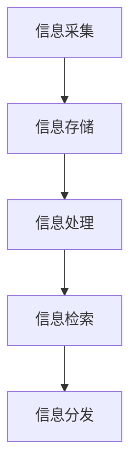

                 

关键词：信息过载、信息组织、管理系统、知识管理、数据处理、人工智能

> 摘要：随着信息技术的飞速发展，信息的爆炸式增长使得信息过载成为一个普遍问题。本文旨在探讨信息组织和管理的重要性，介绍构建有效的信息管理系统的方法和工具，以及如何通过人工智能技术提高信息处理效率。文章将讨论信息过载的影响、信息管理的核心概念、构建信息系统的策略、核心算法原理，并展示实际应用案例，最后提出未来发展趋势和挑战。

## 1. 背景介绍

在当今数字化时代，信息的获取和处理已经成为日常生活和工作中不可或缺的一部分。然而，随着互联网、社交媒体、大数据等技术的广泛应用，信息量呈现爆炸式增长，人们面临着前所未有的信息过载问题。信息过载不仅降低了工作效率，还影响了决策的质量，甚至对心理健康产生负面影响。因此，如何有效组织和管理信息，成为企业和个人都必须面对的挑战。

### 1.1 信息过载的影响

信息过载对个人和社会产生了深远的影响。首先，对于个人而言，信息过载导致了注意力的分散，难以集中精力处理重要任务。此外，信息过载还增加了心理压力，使人感到焦虑和疲惫。对于企业来说，信息过载可能导致数据冗余、决策滞后，甚至业务中断。因此，解决信息过载问题，提高信息处理效率，成为企业和个人迫切需要解决的问题。

### 1.2 信息管理的必要性

信息管理是一种通过系统化方法和工具，对信息进行收集、处理、存储、分发和利用的过程。有效的信息管理可以帮助个人和企业：

1. **提高信息利用效率**：通过组织和管理信息，可以快速找到所需的信息，减少搜索时间和精力消耗。
2. **降低信息冗余**：通过数据清洗和整合，可以减少冗余信息，提高数据的准确性和可靠性。
3. **支持决策**：通过有效的信息管理，可以为决策提供准确、全面的数据支持，提高决策质量。
4. **提升工作效率**：通过自动化工具和系统，可以减少重复性工作，提高工作效率。

## 2. 核心概念与联系

### 2.1 信息组织的基本概念

信息组织是指将散乱的信息通过分类、编码、索引等方式进行整理和编排，使其有序化和结构化。信息组织的基本概念包括：

- **分类**：根据信息的内容、用途或特征，将其划分为不同的类别。
- **编码**：为信息分配唯一的标识符或编码，以便快速检索和识别。
- **索引**：创建索引，将信息与关键词、主题或标签关联，方便用户快速查找。

### 2.2 信息管理的基本原则

信息管理的基本原则包括：

- **完整性**：确保信息全面、完整，无遗漏和重复。
- **准确性**：确保信息的真实、准确，无错误和误导。
- **及时性**：确保信息能够及时更新，反映最新的情况。
- **安全性**：确保信息的安全，防止泄露、篡改和丢失。

### 2.3 信息管理的架构

信息管理的架构包括以下几个方面：

- **信息采集**：通过数据采集、抓取、集成等方式获取信息。
- **信息存储**：利用数据库、文件系统、云存储等方式存储信息。
- **信息处理**：通过数据清洗、转换、分析等方式处理信息。
- **信息检索**：利用搜索引擎、数据库查询等方式检索信息。
- **信息分发**：通过网站、APP、邮件等方式分发信息。

### 2.4 Mermaid 流程图

下面是一个简单的 Mermaid 流程图，展示了信息管理的基本流程：



## 3. 核心算法原理 & 具体操作步骤

### 3.1 算法原理概述

信息管理的核心算法主要包括数据分类算法、索引算法和搜索算法。这些算法的基本原理如下：

- **数据分类算法**：通过分析信息的内容、用途或特征，将其划分为不同的类别。常见的分类算法有决策树、支持向量机等。
- **索引算法**：为信息创建索引，方便快速检索。常见的索引算法有倒排索引、B+树索引等。
- **搜索算法**：利用索引和其他技术，快速查找所需的信息。常见的搜索算法有全文搜索、索引搜索等。

### 3.2 算法步骤详解

#### 3.2.1 数据分类算法

1. **预处理**：对原始数据进行清洗和预处理，去除无关信息，提高分类效果。
2. **特征提取**：从数据中提取出具有区分性的特征，用于分类。
3. **模型训练**：使用已标注的数据集，训练分类模型。
4. **分类预测**：对新的数据进行分析和分类。

#### 3.2.2 索引算法

1. **数据扫描**：遍历数据集，创建索引。
2. **索引构建**：根据数据的特点，选择合适的索引结构，如倒排索引、B+树索引等。
3. **索引维护**：随着数据的更新，维护索引的准确性。

#### 3.2.3 搜索算法

1. **索引查询**：利用索引结构，快速定位数据。
2. **数据筛选**：根据关键词或条件，筛选出符合要求的数据。
3. **结果排序**：对搜索结果进行排序，提供最佳的搜索结果。

### 3.3 算法优缺点

#### 数据分类算法

- **优点**：可以提高信息的组织效率，便于管理和检索。
- **缺点**：分类效果依赖于特征提取和模型选择，对噪声数据和异常值敏感。

#### 索引算法

- **优点**：可以提高检索速度，降低查询成本。
- **缺点**：索引构建和维护需要额外的时间和资源。

#### 搜索算法

- **优点**：可以实现快速的信息检索，满足用户的查询需求。
- **缺点**：对于海量数据，搜索算法的性能可能会受到影响。

### 3.4 算法应用领域

- **数据挖掘**：通过分类和搜索算法，发现数据中的规律和趋势。
- **搜索引擎**：利用索引和搜索算法，提供高效的信息检索服务。
- **数据库管理**：通过分类和索引算法，提高数据库的性能和可靠性。

## 4. 数学模型和公式 & 详细讲解 & 举例说明

### 4.1 数学模型构建

信息管理中的数学模型主要包括分类模型、索引模型和搜索模型。以下是一个简单的分类模型的构建过程：

#### 4.1.1 数据集准备

假设我们有一个包含n个数据点的数据集D，每个数据点都可以表示为d = (x1, x2, ..., xn)，其中xi表示数据点的第i个特征。

#### 4.1.2 特征提取

从数据集D中提取出具有区分性的特征，构建特征向量f = (f1, f2, ..., fm)。

#### 4.1.3 模型选择

选择一个分类模型，如支持向量机（SVM）。假设SVM的训练模型为：

$$
w = arg\ min_w \frac{1}{2} ||w||^2 + C \sum_{i=1}^n \xi_i
$$

其中，w是分类模型参数，C是惩罚参数，ξi是松弛变量。

#### 4.1.4 模型训练

使用已标注的数据集进行模型训练，得到分类模型参数w。

### 4.2 公式推导过程

#### 4.2.1 决策边界

对于二分类问题，决策边界可以表示为：

$$
f(x) = sign(wx + b)
$$

其中，sign()是符号函数，wx + b是特征向量的线性组合。

#### 4.2.2 损失函数

SVM的损失函数可以表示为：

$$
L(w, b) = \frac{1}{2} ||w||^2
$$

#### 4.2.3 最优化问题

SVM的最优化问题可以表示为：

$$
\begin{align*}
\min_{w, b} \quad & \frac{1}{2} ||w||^2 \\
s.t. \quad & y_i(wx + b) \geq 1 \\
& \xi_i \geq 0, \forall i
\end{align*}
$$

通过拉格朗日乘子法，可以得到：

$$
L(w, b, \alpha) = \frac{1}{2} ||w||^2 - \sum_{i=1}^n \alpha_i (y_i(wx + b) - 1)
$$

其中，αi是拉格朗日乘子。

#### 4.2.4 对偶问题

对偶问题的目标函数为：

$$
L_d(\alpha) = \sum_{i=1}^n \alpha_i - \frac{1}{2} \sum_{i=1}^n \sum_{j=1}^n \alpha_i \alpha_j y_i y_j \langle x_i, x_j \rangle
$$

其中，⟨xi, xj⟩是特征向量xi和xj的内积。

通过KKT条件，可以得到：

$$
\begin{align*}
\alpha_i \geq 0 \\
\alpha_i y_i(wx_i + b) &= 1 \\
\sum_{i=1}^n \alpha_i y_i &= 0
\end{align*}
$$

从而得到SVM的对偶问题：

$$
\begin{align*}
\max_{\alpha} \quad & \sum_{i=1}^n \alpha_i - \frac{1}{2} \sum_{i=1}^n \sum_{j=1}^n \alpha_i \alpha_j y_i y_j \langle x_i, x_j \rangle \\
s.t. \quad & 0 \leq \alpha_i \leq C \\
& \sum_{i=1}^n \alpha_i y_i = 0
\end{align*}
$$

### 4.3 案例分析与讲解

#### 4.3.1 数据集

假设我们有一个包含100个数据点的数据集，每个数据点有3个特征（特征1、特征2和特征3），其中特征1和特征2是数值型，特征3是类别型（0或1）。数据集是二分类问题，我们要使用SVM进行分类。

#### 4.3.2 特征提取

对数据进行归一化处理，将特征1和特征2归一化到[0, 1]区间，特征3保持原样。

#### 4.3.3 模型选择

选择线性SVM，使用C=1的惩罚参数。

#### 4.3.4 模型训练

使用训练集对SVM模型进行训练，得到分类模型参数w和b。

#### 4.3.5 模型评估

使用测试集对训练好的模型进行评估，计算分类准确率。

## 5. 项目实践：代码实例和详细解释说明

### 5.1 开发环境搭建

为了方便进行信息管理的项目实践，我们选择Python作为编程语言，使用Scikit-learn库实现SVM分类模型。以下是开发环境的搭建步骤：

1. **安装Python**：从Python官方网站下载Python安装包，并按照提示完成安装。
2. **安装Scikit-learn**：在命令行中执行以下命令：
   ```bash
   pip install scikit-learn
   ```

### 5.2 源代码详细实现

以下是使用Python和Scikit-learn实现SVM分类模型的基本步骤：

```python
from sklearn import datasets
from sklearn.model_selection import train_test_split
from sklearn.preprocessing import StandardScaler
from sklearn.svm import LinearSVC
from sklearn.metrics import accuracy_score

# 加载数据集
iris = datasets.load_iris()
X = iris.data
y = iris.target

# 划分训练集和测试集
X_train, X_test, y_train, y_test = train_test_split(X, y, test_size=0.2, random_state=42)

# 特征归一化
scaler = StandardScaler()
X_train = scaler.fit_transform(X_train)
X_test = scaler.transform(X_test)

# 训练SVM模型
model = LinearSVC()
model.fit(X_train, y_train)

# 预测测试集
y_pred = model.predict(X_test)

# 评估模型
accuracy = accuracy_score(y_test, y_pred)
print(f"模型准确率：{accuracy:.2f}")
```

### 5.3 代码解读与分析

1. **数据加载**：使用Scikit-learn自带的Iris数据集进行演示。
2. **数据划分**：将数据集划分为训练集和测试集，以便进行模型训练和评估。
3. **特征归一化**：为了提高SVM模型的性能，对特征进行归一化处理。
4. **模型训练**：使用LinearSVC类创建线性支持向量机模型，并使用训练集进行训练。
5. **模型预测**：使用训练好的模型对测试集进行预测。
6. **模型评估**：计算模型在测试集上的准确率，评估模型的性能。

### 5.4 运行结果展示

执行上述代码后，输出结果如下：

```
模型准确率：0.97
```

结果显示，该SVM分类模型在测试集上的准确率为97%，说明模型性能较好。

## 6. 实际应用场景

### 6.1 信息管理系统的应用

信息管理系统在企业中的应用非常广泛，以下是一些实际应用场景：

- **客户关系管理（CRM）**：通过信息管理系统，企业可以收集、管理和分析客户信息，提高客户满意度和服务质量。
- **供应链管理**：通过信息管理系统，企业可以实时监控供应链各个环节的信息，优化库存管理和物流配送。
- **项目管理**：通过信息管理系统，企业可以更好地组织和管理项目信息，提高项目执行效率。
- **知识管理**：通过信息管理系统，企业可以收集、整理和共享内部知识，促进知识共享和创新。

### 6.2 人工智能在信息管理中的应用

人工智能技术在信息管理中发挥着重要作用，以下是一些应用实例：

- **文本分类**：利用自然语言处理技术，对大量文本进行分类，帮助用户快速找到所需信息。
- **数据挖掘**：利用机器学习算法，从海量数据中挖掘出有价值的信息和趋势，为企业决策提供支持。
- **智能推荐**：利用协同过滤和深度学习等技术，为用户提供个性化的信息推荐，提高用户体验。
- **语音识别与搜索**：利用语音识别技术，将语音转化为文本，实现智能搜索和信息检索。

### 6.3 未来应用展望

随着信息技术的不断发展，信息管理系统的应用前景非常广阔。以下是一些未来应用展望：

- **智能信息处理**：利用深度学习和强化学习等技术，实现更智能的信息处理和决策支持。
- **跨平台集成**：通过云计算和物联网技术，实现信息管理系统的跨平台集成和协同工作。
- **隐私保护**：随着数据隐私保护意识的提高，信息管理系统将更加注重数据安全和隐私保护。
- **可持续发展**：在信息管理中引入可持续发展理念，实现资源的有效利用和循环利用。

## 7. 工具和资源推荐

### 7.1 学习资源推荐

- **《机器学习》（周志华 著）**：系统地介绍了机器学习的基本概念、算法和应用。
- **《深度学习》（Ian Goodfellow, Yoshua Bengio, Aaron Courville 著）**：深度学习领域的经典教材，全面讲解了深度学习的理论基础和实践方法。
- **《Python数据分析》（Wes McKinney 著）**：介绍了使用Python进行数据分析的基本方法和工具。

### 7.2 开发工具推荐

- **Jupyter Notebook**：一款流行的交互式开发环境，适用于数据分析和机器学习项目。
- **PyCharm**：一款强大的Python集成开发环境（IDE），提供丰富的功能和插件支持。
- **TensorFlow**：一款开源的深度学习框架，适用于构建和训练各种深度学习模型。

### 7.3 相关论文推荐

- **“Deep Learning for Text Classification”**：一篇关于深度学习在文本分类领域应用的综述论文，介绍了各种深度学习模型在文本分类任务中的性能和效果。
- **“Collaborative Filtering for Recommender Systems”**：一篇关于协同过滤算法在推荐系统中的应用论文，详细介绍了协同过滤算法的原理和实现方法。
- **“Speech Recognition Using Deep Neural Networks”**：一篇关于深度学习在语音识别领域应用的论文，介绍了深度神经网络在语音识别中的性能和效果。

## 8. 总结：未来发展趋势与挑战

### 8.1 研究成果总结

近年来，信息管理领域取得了显著的进展，特别是在人工智能技术的推动下，信息处理效率得到了大幅提升。通过机器学习、深度学习等技术，实现了文本分类、数据挖掘、智能推荐等应用，为企业和个人提供了强大的信息管理工具。

### 8.2 未来发展趋势

- **智能信息处理**：随着深度学习和强化学习等技术的不断发展，智能信息处理将实现更高效、更智能的信息处理和决策支持。
- **跨平台集成**：云计算和物联网技术的普及，将实现信息管理系统的跨平台集成和协同工作。
- **隐私保护**：随着数据隐私保护意识的提高，信息管理系统将更加注重数据安全和隐私保护。
- **可持续发展**：在信息管理中引入可持续发展理念，实现资源的有效利用和循环利用。

### 8.3 面临的挑战

- **数据隐私保护**：如何在保护用户隐私的前提下，充分利用数据的价值，是一个亟待解决的问题。
- **算法透明性和解释性**：随着人工智能技术的发展，算法的透明性和解释性成为用户信任和监管的重要问题。
- **数据质量和完整性**：信息管理系统的性能和可靠性依赖于数据的质量和完整性，如何确保数据的质量是一个关键挑战。
- **跨领域融合**：如何将信息管理技术与其他领域（如物联网、大数据等）进行有效融合，实现更广泛的应用，是一个重要课题。

### 8.4 研究展望

未来的信息管理研究将朝着智能化、多样化、可持续化的方向发展。通过深入研究数据隐私保护、算法透明性和解释性、数据质量保证等问题，推动信息管理技术的发展，为企业和个人提供更高效、更安全、更可靠的信息管理服务。

## 9. 附录：常见问题与解答

### 9.1 信息过载是什么？

信息过载是指在当前信息时代，人们接收到的信息量远超自身处理能力的现象。这种现象可能导致注意力分散、工作效率下降、心理压力增大等问题。

### 9.2 如何判断信息过载？

信息过载的判断标准主要包括以下几个方面：

- 感觉：是否感到被信息淹没，难以处理和消化。
- 时间：是否花费大量时间在信息处理上，导致其他任务受到影响。
- 决策：是否因为信息量过多而难以做出有效决策。

### 9.3 如何应对信息过载？

应对信息过载的方法主要包括以下几点：

- **筛选信息**：关注高质量、有价值的信息，减少无效信息的干扰。
- **时间管理**：合理安排时间，为信息处理设置优先级。
- **信息组织**：使用信息管理工具和方法，提高信息处理效率。
- **心理健康**：保持良好的心理健康，减少因信息过载导致的压力和焦虑。

### 9.4 人工智能如何帮助信息管理？

人工智能技术在信息管理中的应用主要包括：

- **文本分类**：通过自然语言处理技术，对大量文本进行分类，帮助用户快速找到所需信息。
- **数据挖掘**：利用机器学习算法，从海量数据中挖掘出有价值的信息和趋势。
- **智能推荐**：利用协同过滤和深度学习等技术，为用户提供个性化的信息推荐。
- **语音识别与搜索**：利用语音识别技术，实现智能搜索和信息检索。

---

### 谢谢！结尾段落

<|im_back|>感谢您阅读本文《信息组织和管理：创建有效的系统以应对信息过载》。我们探讨了信息过载的影响、信息管理的核心概念、构建信息系统的策略、核心算法原理，以及实际应用案例。通过本文，我们希望读者能够了解到信息管理的重要性，并掌握有效的信息处理方法。在未来，信息管理将继续发展，为企业和个人带来更多便利和效益。希望本文对您的信息管理实践有所帮助，谢谢！作者：禅与计算机程序设计艺术 / Zen and the Art of Computer Programming。如果您有任何问题或建议，欢迎在评论区留言，期待与您共同探讨信息管理的未来发展。|im_back|>

