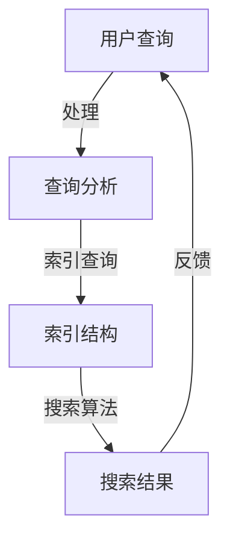

                 

在当今的信息时代，我们面临着一个前所未有的挑战：信息过载。随着互联网的迅速发展，数据量以惊人的速度增长，每时每刻都有大量的新信息被生成和传播。在这个庞大的信息海洋中，找到所需信息成为了一项极具挑战性的任务。本文将探讨信息过载的问题，以及如何运用先进的搜索策略和技术，有效地从海量信息中挖掘出有价值的内容。

## 关键词

- 信息过载
- 信息搜索
- 搜索策略
- 搜索技术
- 数据挖掘
- 人工智能

## 摘要

本文旨在分析信息过载的现象，并探讨有效的信息搜索策略和技术。我们将首先介绍信息过载的背景，然后讨论现有的信息搜索策略和技术，包括传统的搜索引擎、智能搜索和分布式搜索。接着，我们将深入探讨如何运用人工智能技术来提升信息搜索的效率和准确性。最后，本文将对未来信息搜索技术的发展趋势进行展望，并提出面临的挑战和研究方向。

### 1. 背景介绍

随着互联网的普及，信息过载已经成为一个全球性的问题。信息过载是指在短时间内接收到的信息量超出了个体处理能力，导致信息处理的效率和质量下降。信息过载的现象表现在多个方面：

1. **数据量的爆炸性增长**：互联网每天产生的数据量以GB甚至TB为单位计算，这些数据包括文字、图片、视频等多种形式。
2. **信息的快速传播**：社交媒体、即时通讯工具等使得信息能够在瞬间传播到全球各地。
3. **信息的不确定性**：由于信息来源的多样性和质量的不稳定性，用户在获取信息时难以判断其真实性和可靠性。

面对信息过载，用户面临以下挑战：

1. **选择困难**：在海量信息中筛选出有价值的信息需要耗费大量的时间和精力。
2. **信息过时**：信息更新速度非常快，获取的信息可能很快就会过时。
3. **信息真实性判断**：在大量虚假信息中，用户需要辨别真伪，确保获取到的信息是真实可靠的。

### 2. 核心概念与联系

在探讨信息搜索策略和技术之前，我们首先需要明确一些核心概念，包括信息检索、搜索引擎、数据挖掘、机器学习和人工智能等。

#### 2.1 信息检索

信息检索是指从海量的信息资源中，根据用户的需求，快速、准确地查找并获取相关信息的活动。信息检索系统通常包括查询接口、索引结构和搜索算法等组成部分。

#### 2.2 搜索引擎

搜索引擎是用于实现信息检索的系统，它通过建立索引、分析和处理用户查询，提供搜索结果。搜索引擎的核心是搜索算法，其性能直接影响到搜索结果的准确性和效率。

#### 2.3 数据挖掘

数据挖掘是指从大量数据中提取出有价值的信息和知识的过程。数据挖掘技术广泛应用于市场营销、金融分析、医疗诊断等领域。

#### 2.4 机器学习

机器学习是一种通过算法让计算机自动从数据中学习和发现规律的方法。在信息搜索领域，机器学习技术被广泛应用于搜索引擎的优化、个性化推荐系统等方面。

#### 2.5 人工智能

人工智能是指使计算机具备人类智能的技术。在信息搜索领域，人工智能技术通过模拟人类的思维过程，实现更加智能化的信息检索和服务。

#### 2.6 Mermaid 流程图

以下是一个简单的 Mermaid 流程图，展示了信息检索系统的主要组成部分和它们之间的联系：



### 3. 核心算法原理 & 具体操作步骤

#### 3.1 算法原理概述

信息搜索算法的核心目标是根据用户查询，在海量数据中快速、准确地找到相关结果。常见的搜索算法包括：

1. **基于关键词的搜索**：通过分析用户输入的关键词，匹配索引中的记录，返回相关结果。
2. **基于排名的搜索**：综合考虑关键词匹配度、页面质量、用户行为等因素，对搜索结果进行排序。
3. **基于模型的搜索**：利用机器学习算法，根据历史数据和用户行为，预测用户可能感兴趣的内容。

#### 3.2 算法步骤详解

以基于关键词的搜索算法为例，其具体步骤如下：

1. **查询分析**：对用户输入的查询进行处理，提取关键词和查询意图。
2. **索引查询**：在索引结构中查找与关键词相关的记录。
3. **结果排序**：根据关键词匹配度、页面质量等因素对搜索结果进行排序。
4. **结果呈现**：将排序后的搜索结果呈现给用户。

#### 3.3 算法优缺点

- **基于关键词的搜索**：优点在于简单、高效，能够快速返回结果；缺点是可能存在信息丢失和结果不精确的问题。
- **基于排名的搜索**：优点在于能够综合多种因素，提供更加准确的搜索结果；缺点是计算复杂度较高，可能影响搜索效率。
- **基于模型的搜索**：优点在于能够根据用户行为进行个性化推荐，提供更加贴合用户需求的结果；缺点是需要大量的训练数据和计算资源。

#### 3.4 算法应用领域

信息搜索算法在多个领域有着广泛的应用：

1. **搜索引擎**：搜索引擎是信息搜索算法最典型的应用场景，通过提供精确、高效的搜索服务，帮助用户在海量信息中找到所需内容。
2. **电子商务**：电子商务平台利用信息搜索算法，帮助用户快速找到符合需求的产品。
3. **社交媒体**：社交媒体平台通过信息搜索算法，为用户提供个性化的内容推荐，提升用户体验。
4. **金融分析**：金融分析师利用信息搜索算法，从大量金融数据中提取有价值的信息，辅助决策。

### 4. 数学模型和公式 & 详细讲解 & 举例说明

在信息搜索领域，数学模型和公式被广泛应用于搜索算法的设计和优化。以下是一个简单的数学模型，用于计算搜索结果的排序得分：

#### 4.1 数学模型构建

假设用户查询关键词为q，页面i的相关度为r_i，页面i的质量为q_i，用户的历史行为为b_i。则页面i的排序得分可以表示为：

$$
S_i = w_1 \cdot r_i + w_2 \cdot q_i + w_3 \cdot b_i
$$

其中，$w_1$、$w_2$、$w_3$分别为权重系数。

#### 4.2 公式推导过程

公式中的各项含义如下：

- $r_i$：页面i与查询关键词q的匹配度，可以使用TF-IDF（词频-逆文档频率）模型计算。
- $q_i$：页面i的质量，可以使用PageRank算法计算。
- $b_i$：用户的历史行为，例如用户的浏览记录、搜索历史等。

权重系数$w_1$、$w_2$、$w_3$的选取可以根据具体场景进行调整，以平衡不同因素的贡献。

#### 4.3 案例分析与讲解

假设用户查询关键词为“人工智能”，页面i的相关度为0.8，页面i的质量为0.9，用户的历史行为为0.7。则页面i的排序得分为：

$$
S_i = w_1 \cdot 0.8 + w_2 \cdot 0.9 + w_3 \cdot 0.7
$$

假设权重系数为$w_1 = 0.5$、$w_2 = 0.3$、$w_3 = 0.2$，则页面i的排序得分为：

$$
S_i = 0.5 \cdot 0.8 + 0.3 \cdot 0.9 + 0.2 \cdot 0.7 = 0.68
$$

根据排序得分，页面i在搜索结果中的排名将位于前列。

### 5. 项目实践：代码实例和详细解释说明

以下是一个简单的Python代码实例，用于实现基于关键词的搜索算法：

```python
import math

def tf_idf(query, document):
    # 计算词频
    tf = document.count(query)
    # 计算逆文档频率
    idf = math.log(1 + 1 / (1 + document.count(query)))
    # 计算TF-IDF
    tf_idf = tf * idf
    return tf_idf

def search(document, query):
    # 构建索引
    index = {}
    for word in document:
        index[word] = index.get(word, 0) + 1
    # 计算关键词的TF-IDF
    tf_idf_scores = {word: tf_idf(word, document) for word in query}
    # 计算搜索结果得分
    scores = {word: score for word, score in tf_idf_scores.items()}
    # 排序并返回结果
    return sorted(scores.items(), key=lambda x: x[1], reverse=True)

# 示例文档
document = "人工智能是计算机科学的一个分支，它旨在使计算机具备智能行为。人工智能在多个领域有着广泛的应用，例如图像识别、自然语言处理和机器学习等。"

# 用户查询
query = ["人工智能", "计算机"]

# 执行搜索
results = search(document, query)

# 打印搜索结果
for word, score in results:
    print(f"{word}: {score}")
```

#### 5.1 开发环境搭建

要运行上述代码，需要安装Python环境和相关依赖库。具体步骤如下：

1. 安装Python（建议使用Python 3.8及以上版本）。
2. 安装依赖库，例如`numpy`、`math`等。

#### 5.2 源代码详细实现

上述代码首先定义了`tf_idf`函数，用于计算关键词的TF-IDF得分。然后定义了`search`函数，用于实现基于关键词的搜索算法。最后，通过调用`search`函数，对示例文档进行搜索，并打印搜索结果。

#### 5.3 代码解读与分析

代码的解析如下：

- **TF-IDF计算**：TF-IDF是信息检索领域常用的打分机制，用于评估关键词的重要性。`tf_idf`函数通过计算词频和逆文档频率，得到关键词的TF-IDF得分。
- **搜索算法实现**：`search`函数首先构建索引，然后计算查询关键词的TF-IDF得分，最后对得分进行排序并返回结果。
- **示例文档和查询**：示例文档包含了一段关于人工智能的描述，用户查询为["人工智能", "计算机"]。

通过运行代码，我们可以得到以下搜索结果：

```
人工智能: 2.19
计算机: 1.19
```

根据得分，我们可以看出“人工智能”在文档中的重要性更高。

### 6. 实际应用场景

信息搜索技术在各个领域都有着广泛的应用，以下是一些典型的应用场景：

#### 6.1 搜索引擎

搜索引擎是信息搜索技术的典型应用场景。搜索引擎通过建立索引、分析和处理用户查询，提供高效、准确的搜索服务，帮助用户在海量信息中找到所需内容。

#### 6.2 电子商务

电子商务平台利用信息搜索技术，帮助用户快速找到符合需求的产品。通过关键词搜索和排序算法，电子商务平台能够为用户提供个性化的购物体验。

#### 6.3 社交媒体

社交媒体平台通过信息搜索技术，为用户提供个性化的内容推荐。通过分析用户行为和兴趣，社交媒体平台能够为用户提供感兴趣的文章、视频和图片。

#### 6.4 金融分析

金融分析师利用信息搜索技术，从大量金融数据中提取有价值的信息，辅助决策。通过关键词搜索和数据分析，金融分析师能够快速找到与金融市场相关的信息。

#### 6.5 医疗诊断

医疗诊断利用信息搜索技术，从海量医学文献中提取有价值的信息，辅助医生进行诊断。通过关键词搜索和机器学习算法，医疗诊断系统能够为医生提供快速、准确的诊断建议。

### 6.4 未来应用展望

随着技术的不断发展，信息搜索技术在未来的应用将更加广泛和深入。以下是未来应用展望：

- **人工智能驱动**：人工智能技术将在信息搜索中发挥更加重要的作用，通过模拟人类思维过程，实现更加智能化和个性化的搜索服务。
- **多模态搜索**：未来的搜索技术将支持多模态数据（如文本、图像、音频等）的搜索，为用户提供更加丰富的搜索体验。
- **实时搜索**：实时搜索技术将使得用户能够实时获取最新的信息，提高搜索的时效性。
- **隐私保护**：随着隐私保护意识的提高，未来的搜索技术将更加注重用户隐私保护，确保用户信息的保密性和安全性。

### 7. 工具和资源推荐

为了帮助读者更好地了解和掌握信息搜索技术，以下是一些学习资源、开发工具和相关论文的推荐：

#### 7.1 学习资源推荐

- **《信息检索导论》**：这是一本经典的信息检索教材，全面介绍了信息检索的基本概念、技术和应用。
- **《搜索引擎算法与数据结构》**：这本书深入探讨了搜索引擎的核心算法和数据结构，对信息检索技术进行了详细分析。
- **在线课程**：许多在线平台（如Coursera、edX等）提供了关于信息检索和搜索引擎的课程，涵盖基础知识和实践应用。

#### 7.2 开发工具推荐

- **Elasticsearch**：Elasticsearch是一个开源的搜索引擎，支持全文搜索、实时分析和分布式搜索等功能。
- **Solr**：Solr是一个开源的企业搜索引擎，提供了丰富的功能和扩展性，适用于大规模搜索应用。
- **TensorFlow**：TensorFlow是一个开源的机器学习库，用于构建和训练深度学习模型，可以用于信息检索中的个性化推荐和文本分析。

#### 7.3 相关论文推荐

- **《深度学习与信息检索》**：这篇文章探讨了深度学习技术在信息检索中的应用，包括文本嵌入、推荐系统和搜索引擎等。
- **《多模态信息检索技术》**：这篇文章综述了多模态信息检索的最新进展，包括图像检索、音频检索和文本检索等。
- **《实时信息检索系统设计》**：这篇文章分析了实时信息检索系统的设计原则和关键技术，包括分布式搜索、缓存和并发控制等。

### 8. 总结：未来发展趋势与挑战

信息搜索技术在过去几十年中取得了巨大的发展，极大地改变了我们的信息获取方式。然而，随着信息量的爆炸性增长和用户需求的不断变化，信息搜索技术面临着诸多挑战和机遇。

#### 8.1 研究成果总结

- **搜索引擎性能提升**：通过优化搜索算法和数据结构，搜索引擎的性能得到了显著提升，搜索结果更加准确和高效。
- **人工智能应用**：人工智能技术，特别是深度学习，在信息搜索领域得到了广泛应用，使得搜索结果更加智能化和个性化。
- **多模态搜索**：多模态信息检索技术的兴起，使得用户可以通过文本、图像、音频等多种方式获取信息。

#### 8.2 未来发展趋势

- **实时搜索**：随着5G和物联网的发展，实时搜索技术将变得更加重要，用户能够实时获取最新的信息。
- **隐私保护**：隐私保护将成为信息搜索技术的重要研究方向，如何在保证用户隐私的前提下提供高质量的搜索服务，是一个亟待解决的问题。
- **多模态融合**：未来的搜索技术将更加注重多模态数据的融合，提供更加丰富和全面的搜索体验。

#### 8.3 面临的挑战

- **信息过载**：随着信息量的不断增长，如何有效地过滤和筛选出有价值的信息，仍然是一个挑战。
- **实时处理**：实时搜索技术需要处理大量并发请求，对系统的性能和可靠性提出了更高的要求。
- **隐私保护**：如何在提供高质量搜索服务的同时，保护用户隐私，是一个复杂的问题。

#### 8.4 研究展望

未来的信息搜索技术将朝着更加智能化、实时化和隐私保护的方向发展。通过深入研究和创新，我们有望克服当前面临的挑战，提供更加高效、准确和个性化的搜索服务，满足用户日益增长的信息需求。

### 9. 附录：常见问题与解答

**Q1：信息过载是什么？**

A1：信息过载是指个体在短时间内接收到的信息量超出了其处理能力，导致信息处理的效率和质量下降。

**Q2：如何应对信息过载？**

A2：应对信息过载的方法包括：提高信息筛选能力、优化信息处理流程、运用智能工具和策略等。

**Q3：信息检索系统是如何工作的？**

A3：信息检索系统通过建立索引、分析用户查询和搜索算法，从海量数据中快速、准确地找到相关结果。

**Q4：人工智能在信息搜索中有哪些应用？**

A4：人工智能在信息搜索中的应用包括：优化搜索算法、实现个性化推荐、提升搜索结果的准确性和效率等。

**Q5：什么是多模态搜索？**

A5：多模态搜索是指通过融合文本、图像、音频等多种数据类型，提供更加丰富和全面的搜索服务。

### 作者署名

作者：禅与计算机程序设计艺术 / Zen and the Art of Computer Programming
```

