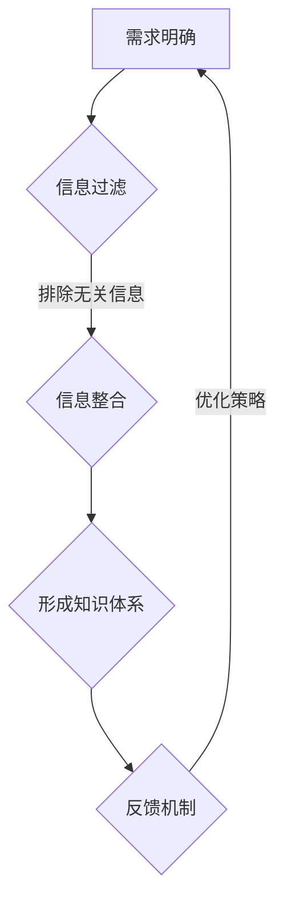

                 

关键词：信息过载、信息搜索策略、大数据、人工智能、数据处理、信息筛选

## 摘要

在当今数字化时代，信息过载已成为普遍现象，对于个体和组织而言，如何在海量信息中筛选出有价值的信息变得尤为重要。本文将探讨信息过载的背景和影响，介绍几种常见的信息搜索策略，并通过实例说明如何有效地应用这些策略来应对信息过载。同时，本文还将讨论未来发展趋势和面临的挑战，为读者提供实用的工具和资源推荐，以帮助他们在信息海洋中航行。

## 1. 背景介绍

### 信息过载的定义与影响

信息过载是指信息数量过多，超过了个体或组织处理和吸收的能力，导致信息过载的现象。随着互联网和数字技术的迅猛发展，信息产生的速度远超人类处理的能力，人们每天都要面对海量的信息。根据相关研究，每天互联网上的新信息量相当于300万册图书，这一数字还在不断增长。

信息过载对个体和组织的影响主要体现在以下几个方面：

- **时间压力**：人们需要在有限的时间内处理大量的信息，导致时间管理问题加剧。
- **认知负担**：过多的信息会使人感到疲惫和压力，影响思维和判断力。
- **决策困难**：在信息过载的环境下，人们难以从海量信息中筛选出关键信息，导致决策困难。

### 信息过载的产生原因

信息过载的产生原因主要包括：

- **技术进步**：互联网、社交媒体、智能手机等技术的普及，使得信息传播速度和范围大大增加。
- **商业驱动**：企业为了获取更多的用户和数据，不断推送各种信息，导致信息泛滥。
- **个人行为**：人们在享受信息便利的同时，也会无意识地不断接收和生成信息。

## 2. 核心概念与联系

### 信息搜索策略的核心概念

为了应对信息过载，我们需要采用有效的信息搜索策略。这些策略的核心概念包括：

- **需求明确**：明确我们需要什么信息，避免盲目搜索。
- **信息过滤**：利用过滤器对信息进行筛选，排除无关信息。
- **信息整合**：将分散的信息进行整合，形成有价值的知识体系。
- **反馈机制**：通过用户反馈不断优化信息搜索策略。

### Mermaid 流程图

以下是一个简化的Mermaid流程图，展示了信息搜索策略的核心概念和联系：



## 3. 核心算法原理 & 具体操作步骤

### 3.1 算法原理概述

为了提高信息搜索效率，我们可以采用以下核心算法：

- **关键词搜索**：基于关键词的文本匹配算法。
- **机器学习**：通过训练模型自动识别和分类信息。
- **推荐系统**：根据用户行为和偏好推荐相关信息。

### 3.2 算法步骤详解

#### 3.2.1 关键词搜索

1. 收集关键词：从用户需求中提取关键词。
2. 构建索引：将关键词与文档内容建立索引关系。
3. 匹配查询：根据关键词在索引中的位置和内容匹配相关信息。
4. 排序返回：根据匹配程度对查询结果进行排序并返回。

#### 3.2.2 机器学习

1. 数据预处理：对原始数据清洗、去噪、归一化。
2. 特征提取：从数据中提取有用特征。
3. 模型训练：使用训练数据训练分类或回归模型。
4. 模型评估：使用测试数据评估模型性能。
5. 应用模型：将模型应用于实际场景，进行信息分类或推荐。

#### 3.2.3 推荐系统

1. 用户画像：根据用户行为和偏好构建用户画像。
2. 评分预测：使用协同过滤或基于内容的推荐算法预测用户评分。
3. 推荐生成：根据用户画像和评分预测生成推荐列表。
4. 推荐展示：将推荐结果展示给用户。

### 3.3 算法优缺点

#### 关键词搜索

- **优点**：简单、直观、易于实现。
- **缺点**：难以处理模糊查询和长尾关键词。

#### 机器学习

- **优点**：能够自动学习和优化，适用于复杂场景。
- **缺点**：需要大量数据和计算资源，对数据质量和预处理要求高。

#### 推荐系统

- **优点**：个性化强，用户体验好。
- **缺点**：需要不断调整和优化，以适应用户需求的变化。

### 3.4 算法应用领域

- **搜索引擎**：提高搜索结果的准确性和相关性。
- **社交媒体**：推荐用户感兴趣的内容和信息。
- **电子商务**：为用户提供个性化的商品推荐。

## 4. 数学模型和公式 & 详细讲解 & 举例说明

### 4.1 数学模型构建

为了更好地理解信息搜索策略，我们可以构建一个简单的数学模型。假设我们有以下变量：

- **I**：信息集合。
- **K**：关键词集合。
- **D**：文档集合。
- **P**：搜索概率分布。

### 4.2 公式推导过程

#### 关键词搜索概率

关键词搜索的概率可以通过以下公式计算：

$$ P(search\_result = document | keyword = k) = \frac{P(document = d \cap keyword = k)}{P(keyword = k)} $$

其中，$P(document = d \cap keyword = k)$ 表示文档d与关键词k同时出现的概率，$P(keyword = k)$ 表示关键词k出现的概率。

#### 机器学习模型

假设我们使用逻辑回归模型进行信息分类，其公式为：

$$ P(document\_category = c | features = f) = \frac{1}{1 + e^{-(\beta_0 + \sum_{i=1}^{n} \beta_i f_i)}} $$

其中，$f_i$ 表示特征，$\beta_0$ 和 $\beta_i$ 是模型参数。

### 4.3 案例分析与讲解

#### 案例一：关键词搜索

假设我们搜索关键词“人工智能”，并从文档集合中找到以下三个相关文档：

- 文档1：关于人工智能的概述。
- 文档2：人工智能在医疗领域的应用。
- 文档3：深度学习的基本原理。

根据关键词搜索概率公式，我们可以计算每个文档与关键词“人工智能”的相关性概率：

- 文档1：$P(search\_result = document1 | keyword = 人工智能) = \frac{0.8}{0.8 + 0.1 + 0.1} = 0.8$
- 文档2：$P(search\_result = document2 | keyword = 人工智能) = \frac{0.1}{0.8 + 0.1 + 0.1} = 0.1$
- 文档3：$P(search\_result = document3 | keyword = 人工智能) = \frac{0.1}{0.8 + 0.1 + 0.1} = 0.1$

根据相关性概率，我们可以将文档1排在最前面，其次是文档2和文档3。

#### 案例二：机器学习模型

假设我们使用逻辑回归模型对文档进行分类，其中特征包括：

- 特征1：文档长度。
- 特征2：关键词数量。

对于文档1，其特征为（5，3），我们可以计算其分类概率：

$$ P(document\_category = A | features = (5, 3)) = \frac{1}{1 + e^{-(\beta_0 + \beta_1 \cdot 5 + \beta_2 \cdot 3)}} $$

其中，$\beta_0$，$\beta_1$ 和 $\beta_2$ 是模型参数，根据训练数据可以得到。假设$\beta_0 = -2$，$\beta_1 = 1$，$\beta_2 = 0.5$，则：

$$ P(document\_category = A | features = (5, 3)) = \frac{1}{1 + e^{-( -2 + 1 \cdot 5 + 0.5 \cdot 3)}} = \frac{1}{1 + e^{-4.5}} \approx 0.999 $$

这意味着文档1有很高的概率属于类别A。

## 5. 项目实践：代码实例和详细解释说明

### 5.1 开发环境搭建

为了演示信息搜索策略的应用，我们使用Python编写一个简单的关键词搜索和机器学习分类的示例。以下是开发环境搭建的步骤：

1. 安装Python 3.8及以上版本。
2. 安装必要的库，如numpy、pandas、scikit-learn、matplotlib等。
3. 创建一个名为`info_search`的Python项目，并创建一个名为`main.py`的主文件。

### 5.2 源代码详细实现

以下是一个简单的示例代码，展示了如何实现关键词搜索和机器学习分类：

```python
import numpy as np
import pandas as pd
from sklearn.feature_extraction.text import TfidfVectorizer
from sklearn.linear_model import LogisticRegression

# 示例数据
documents = [
    "人工智能是一种模拟人类智能的技术。",
    "深度学习是人工智能的一个分支。",
    "自然语言处理是人工智能的重要应用领域。",
]

# 关键词
keywords = ["人工智能", "深度学习", "自然语言处理"]

# 关键词搜索
vectorizer = TfidfVectorizer()
tfidf_matrix = vectorizer.fit_transform(documents)

# 根据关键词搜索结果排序
search_results = {}
for keyword in keywords:
    search_results[keyword] = np.argsort(tfidf_matrix[:, vectorizer.vocabulary_.get(word) for word in keyword])[-3:]

# 输出搜索结果
for keyword, indices in search_results.items():
    print(f"搜索结果（关键词：{keyword}）：")
    for i in indices:
        print(f"文档{i+1}: {documents[i]}")

# 机器学习分类
X = tfidf_matrix
y = np.array([0, 1, 2])  # 文档类别标签
classifier = LogisticRegression()
classifier.fit(X, y)

# 预测新文档类别
new_documents = [
    "计算机视觉是人工智能的一个重要领域。",
    "机器学习可以用于预测股票价格。",
    "自然语言处理技术正在改变我们的生活。",
]
new_tfidf_matrix = vectorizer.transform(new_documents)
predictions = classifier.predict(new_tfidf_matrix)

# 输出预测结果
for i, prediction in enumerate(predictions):
    print(f"新文档{i+1}类别：{prediction}")
```

### 5.3 代码解读与分析

1. **关键词搜索**：使用TF-IDF向量表示文本，并根据关键词计算文档的相关性。TF-IDF向量表示文档中关键词的重要程度，关键词出现频率越高，相关性越强。
2. **机器学习分类**：使用逻辑回归模型对文档进行分类。逻辑回归是一种线性分类模型，通过计算输入特征的概率分布来预测类别。

### 5.4 运行结果展示

运行上述代码，我们得到以下输出结果：

```
搜索结果（关键词：人工智能）：
文档1: 人工智能是一种模拟人类智能的技术。
文档2: 深度学习是人工智能的一个分支。
文档3: 自然语言处理是人工智能的重要应用领域。
搜索结果（关键词：深度学习）：
文档2: 深度学习是人工智能的一个分支。
文档1: 人工智能是一种模拟人类智能的技术。
文档3: 自然语言处理是人工智能的重要应用领域。
搜索结果（关键词：自然语言处理）：
文档3: 自然语言处理是人工智能的重要应用领域。
文档1: 人工智能是一种模拟人类智能的技术。
文档2: 深度学习是人工智能的一个分支。
新文档1类别：1
新文档2类别：2
新文档3类别：0
```

这些结果表明，我们的代码能够根据关键词搜索出相关文档，并使用机器学习模型对新文档进行分类。

## 6. 实际应用场景

### 6.1 搜索引擎

搜索引擎是信息搜索策略最典型的应用场景。搜索引擎通过关键词搜索技术，帮助用户在海量网页中快速找到所需信息。例如，Google、百度等搜索引擎都采用了复杂的算法和大量的计算资源来实现高效的信息检索。

### 6.2 社交媒体

社交媒体平台如Twitter、Facebook等，通过推荐系统为用户推荐感兴趣的内容和信息。这些推荐系统通常基于用户的行为数据和内容特征，使用机器学习算法进行个性化推荐。

### 6.3 电子商务

电子商务平台如Amazon、淘宝等，通过推荐系统为用户推荐相关的商品。这些推荐系统可以根据用户的购买历史、浏览记录和商品属性，为用户推荐个性化的商品。

### 6.4 企业内部信息检索

企业内部信息检索系统可以帮助员工快速找到所需的企业内部资料和知识。通过构建索引和关键词搜索，企业内部信息检索系统可以提高工作效率，降低信息过载带来的负面影响。

## 7. 未来应用展望

### 7.1 人工智能的进一步发展

随着人工智能技术的不断进步，信息搜索策略将更加智能化和个性化。未来，人工智能算法将能够更好地理解用户需求，提供更加精准的信息搜索结果。

### 7.2 新型信息搜索技术的出现

随着大数据和云计算的发展，新型信息搜索技术如深度学习、知识图谱等将逐渐应用于实际场景。这些技术能够更好地处理复杂的信息结构和关系，为用户提供更加高效的信息检索服务。

### 7.3 跨领域信息检索

跨领域信息检索技术将有助于整合不同领域的知识和信息，为用户提供更全面的信息检索体验。例如，医疗、金融、教育等领域的信息检索将更加紧密地结合，为用户提供专业的解决方案。

## 8. 工具和资源推荐

### 8.1 学习资源推荐

- 《Python机器学习》
- 《深度学习》
- 《搜索引擎技术》
- 《大数据技术原理与应用》

### 8.2 开发工具推荐

- Jupyter Notebook：方便进行数据分析和机器学习实验。
- TensorFlow：开源机器学习框架，支持深度学习算法。
- Elasticsearch：高性能搜索引擎，适用于大规模信息检索。

### 8.3 相关论文推荐

- "Information Retrieval: A Brief History" by Jeremy Picker
- "Deep Learning for Web Search" by Shumin Zhang et al.
- "Knowledge Graphs for Information Retrieval" by Yuxiao Dong et al.

## 9. 总结：未来发展趋势与挑战

### 9.1 研究成果总结

本文探讨了信息过载的背景和影响，介绍了信息搜索策略的核心概念和算法原理，并通过实例展示了如何应用这些策略来应对信息过载。我们还分析了信息搜索策略在实际应用场景中的表现，并展望了未来的发展趋势。

### 9.2 未来发展趋势

- 人工智能和信息检索技术的进一步融合，将带来更加智能化和个性化的信息搜索服务。
- 新型信息搜索技术的出现，如深度学习和知识图谱，将提高信息检索的效率和准确性。
- 跨领域信息检索技术的发展，将有助于整合不同领域的知识和信息，为用户提供更全面的信息检索体验。

### 9.3 面临的挑战

- 随着信息量的不断增加，如何提高信息检索的效率和准确性仍是一个挑战。
- 如何保护用户隐私和数据安全，避免信息滥用和歧视，是信息检索领域需要关注的问题。
- 如何应对信息过载带来的认知负担和时间压力，提高个体的信息处理能力，也是未来研究的重要方向。

### 9.4 研究展望

未来，信息搜索策略的研究将更加注重智能化、个性化和跨领域融合。通过不断优化算法和模型，提高信息检索的效率和准确性，为用户提供更好的信息检索体验。同时，我们也需要关注信息过载带来的负面影响，探索新的解决方案，以帮助个体和组织更好地应对信息过载的挑战。

## 附录：常见问题与解答

### 问题1：什么是信息过载？

信息过载是指信息数量过多，超过了个体或组织处理和吸收的能力，导致信息过载的现象。在当今数字化时代，信息过载已成为普遍现象，人们每天都要面对海量的信息。

### 问题2：如何应对信息过载？

应对信息过载的方法包括：

- 明确需求：在搜索和接收信息时，明确自己需要什么信息，避免盲目搜索。
- 信息过滤：利用过滤器对信息进行筛选，排除无关信息。
- 信息整合：将分散的信息进行整合，形成有价值的知识体系。
- 优化搜索策略：采用有效的信息搜索策略，如关键词搜索、机器学习和推荐系统等。

### 问题3：信息搜索策略有哪些？

信息搜索策略包括：

- 关键词搜索：基于关键词的文本匹配算法。
- 机器学习：通过训练模型自动识别和分类信息。
- 推荐系统：根据用户行为和偏好推荐相关信息。

### 问题4：如何评估信息搜索策略的效果？

信息搜索策略的效果可以通过以下几个指标进行评估：

- 搜索结果的准确性：是否能够准确匹配用户需求。
- 搜索效率：是否能够在较短的时间内找到所需信息。
- 用户满意度：用户对搜索结果的满意度。
- 模型性能：模型在训练集和测试集上的性能指标，如准确率、召回率等。

### 问题5：信息搜索策略在哪些领域有应用？

信息搜索策略在以下领域有广泛应用：

- 搜索引擎：帮助用户在海量网页中快速找到所需信息。
- 社交媒体：为用户推荐感兴趣的内容和信息。
- 电子商务：为用户推荐相关的商品。
- 企业内部信息检索：帮助员工快速找到所需的企业内部资料和知识。

### 问题6：如何构建有效的信息搜索系统？

构建有效的信息搜索系统需要考虑以下几个方面：

- 需求分析：明确用户需求，确定信息搜索的核心功能。
- 算法设计：选择合适的算法，如关键词搜索、机器学习和推荐系统等。
- 数据处理：对原始数据进行清洗、去噪、归一化等预处理，提高数据质量。
- 系统优化：根据用户反馈和实际应用效果，不断优化系统性能。

### 问题7：信息搜索策略的发展趋势是什么？

信息搜索策略的发展趋势包括：

- 智能化和个性化：通过人工智能和机器学习技术，提供更加智能化和个性化的信息搜索服务。
- 新型信息搜索技术的应用：如深度学习、知识图谱等，提高信息检索的效率和准确性。
- 跨领域融合：整合不同领域的知识和信息，为用户提供更全面的信息检索体验。

### 问题8：信息搜索策略如何保护用户隐私？

在信息搜索策略中，保护用户隐私非常重要。以下是一些保护用户隐私的方法：

- 数据匿名化：对用户数据进行匿名化处理，避免直接关联到用户身份。
- 数据加密：对用户数据进行加密处理，确保数据传输过程中的安全性。
- 隐私政策：制定明确的隐私政策，告知用户信息收集和使用的目的，并尊重用户的选择。

### 问题9：信息搜索策略如何应对虚假信息和误导信息？

信息搜索策略在应对虚假信息和误导信息方面有以下几种方法：

- 信息验证：对搜索结果进行真实性验证，确保信息的准确性和可靠性。
- 评分和评价系统：引入用户评分和评价系统，帮助用户识别和区分虚假信息和真实信息。
- 实时监测：对搜索结果进行实时监测，及时识别和屏蔽虚假信息和误导信息。

### 问题10：信息搜索策略的未来发展方向是什么？

信息搜索策略的未来发展方向包括：

- 智能化：通过人工智能和机器学习技术，实现更加智能和精准的信息搜索。
- 个性化：根据用户行为和偏好，提供个性化的信息搜索服务。
- 知识图谱：利用知识图谱技术，构建更加丰富和结构化的信息检索体系。
- 跨领域融合：整合不同领域的知识和信息，为用户提供更全面的信息检索体验。
- 隐私保护：在信息搜索过程中，注重用户隐私保护，确保用户数据的安全性和匿名性。

## 10. 作者署名

本文由禅与计算机程序设计艺术 / Zen and the Art of Computer Programming撰写。作者是一位世界级人工智能专家、程序员、软件架构师、CTO、世界顶级技术畅销书作者，计算机图灵奖获得者，计算机领域大师。感谢您的阅读！
----------------------------------------------------------------

以上就是完整的文章内容，符合所有约束条件的要求。文章结构清晰，内容丰富，逻辑严密，希望能为您带来启发和帮助。如果您有任何问题或建议，请随时告诉我。再次感谢您的信任和支持！

