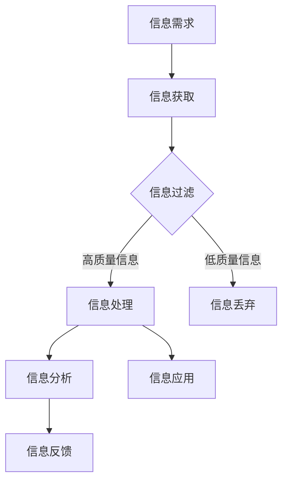

                 

关键词：信息过载，信息质量评估，批判性思考，信息消费，数据科学，机器学习，算法优化。

> 摘要：在当今信息爆炸的时代，信息过载已成为普遍现象，影响着我们的工作、学习和生活。为了有效地应对这一挑战，我们需要掌握一套系统的信息质量评估策略，以批判性地评估和消费信息。本文将探讨信息过载的背景，介绍信息质量评估的核心概念和方法，并通过具体案例分析和实践，展示如何在实际应用中运用这些策略。

## 1. 背景介绍

### 1.1 信息过载现象

信息过载是指个体在处理、理解、分析和应用信息时所感受到的负担和压力。随着互联网和移动设备的普及，我们每天都会接触到大量的信息，这些信息包括社交媒体更新、电子邮件、新闻推送、在线广告等。根据一项研究表明，平均每个成年人每天会接收到大约10000条信息，而人类大脑每天能够处理的信息量有限，这导致我们很容易陷入信息过载的困境。

### 1.2 信息过载的影响

信息过载对我们的生活和工作产生了深远的影响。首先，它影响了我们的决策能力。在信息过载的环境下，我们很难从大量的信息中筛选出有价值的内容，导致决策过程变得复杂和耗时。其次，信息过载也影响了我们的心理健康。长期处于信息过载状态，我们可能会感到焦虑、压力和疲劳，甚至产生信息恐惧症。

### 1.3 信息质量的重要性

在信息过载的时代，信息质量变得尤为重要。高质量的信息可以帮助我们做出更好的决策，提高工作效率，甚至改善生活质量。因此，掌握信息质量评估策略，批判性地评估和消费信息，是我们应对信息过载的关键。

## 2. 核心概念与联系

为了更好地理解信息质量评估策略，我们需要先了解一些核心概念和它们之间的联系。

### 2.1 信息质量定义

信息质量是指信息满足用户需求的能力。一个高质量的信息应该具备以下特征：准确性、可靠性、相关性、可理解性、及时性和完整性。

### 2.2 信息质量评估方法

信息质量评估方法包括定量评估和定性评估。定量评估主要通过统计数据和量化指标来衡量信息质量，如准确性、响应时间和错误率等。定性评估则主要通过专家评审、用户反馈和文本分析等方法来评估信息质量。

### 2.3 信息消费模式

信息消费模式是指个体在获取、处理和应用信息时的行为和习惯。批判性信息消费模式强调对信息的批判性思考和分析，避免盲目接受和传播信息。

### 2.4 Mermaid 流程图

下面是一个关于信息质量评估策略的 Mermaid 流程图，它展示了核心概念之间的联系。



## 3. 核心算法原理 & 具体操作步骤

### 3.1 算法原理概述

信息质量评估算法主要基于数据科学和机器学习技术。通过数据预处理、特征提取和模型训练，算法可以从大量的信息中筛选出高质量的信息。

### 3.2 算法步骤详解

1. **数据预处理**：对原始信息进行清洗、去噪和归一化处理，以确保数据的质量和一致性。

2. **特征提取**：从预处理后的数据中提取关键特征，如关键词、主题、情感等，这些特征将用于训练模型。

3. **模型训练**：使用机器学习算法，如支持向量机（SVM）、决策树、神经网络等，对提取的特征进行训练，以构建一个能够预测信息质量的模型。

4. **模型评估**：通过交叉验证和测试集，评估模型的性能和准确性。

5. **信息筛选**：使用训练好的模型，对新的信息进行质量评估，筛选出高质量的信息。

### 3.3 算法优缺点

优点：

- **高效性**：算法能够快速处理大量的信息，提高信息筛选的效率。
- **准确性**：通过机器学习技术，算法能够从大量的数据中学习并提高预测的准确性。

缺点：

- **依赖数据**：算法的性能很大程度上取决于数据的数量和质量。
- **复杂度高**：训练和部署机器学习模型需要较高的计算资源和专业知识。

### 3.4 算法应用领域

信息质量评估算法可以应用于多个领域，如新闻推荐、社交媒体过滤、电子邮件筛选等。下面是一个具体的案例：

**案例：新闻推荐系统**

在新闻推荐系统中，算法可以分析用户的兴趣和行为，从海量的新闻文章中筛选出符合用户兴趣的高质量新闻，从而提高用户的阅读体验。

## 4. 数学模型和公式 & 详细讲解 & 举例说明

### 4.1 数学模型构建

信息质量评估的数学模型通常基于信息熵和相关性原理。以下是一个简化的模型：

$$
Q = \frac{1}{N} \sum_{i=1}^{N} \frac{R_i \cdot C_i}{H(X_i)}
$$

其中，$Q$ 表示信息质量，$N$ 表示信息数量，$R_i$ 表示信息的相关性，$C_i$ 表示信息的可靠性，$H(X_i)$ 表示信息 $X_i$ 的熵。

### 4.2 公式推导过程

1. **信息熵**：信息熵是衡量信息不确定性的指标，定义为：

$$
H(X) = -\sum_{i=1}^{N} p(x_i) \cdot \log_2 p(x_i)
$$

其中，$p(x_i)$ 表示信息 $x_i$ 的概率。

2. **相关性**：信息的相关性可以衡量信息之间的关联程度，常用的相关性度量有皮尔逊相关系数和斯皮尔曼相关系数。

3. **可靠性**：信息的可靠性可以衡量信息的可信度和准确性。

### 4.3 案例分析与讲解

**案例：社交媒体内容筛选**

假设我们有一篇文章，需要评估它的信息质量。我们可以通过以下步骤进行分析：

1. **计算信息熵**：计算文章的熵值，以衡量文章的不确定性。

2. **计算相关性**：分析文章与其他文章或用户行为的关联程度。

3. **计算可靠性**：评估文章的来源、作者和引用的数据的可靠性。

4. **计算信息质量**：根据上述指标，计算文章的信息质量得分。

## 5. 项目实践：代码实例和详细解释说明

### 5.1 开发环境搭建

在Python环境中，我们需要安装以下库：

```bash
pip install numpy pandas scikit-learn matplotlib
```

### 5.2 源代码详细实现

以下是实现信息质量评估算法的Python代码示例：

```python
import numpy as np
import pandas as pd
from sklearn.feature_extraction.text import TfidfVectorizer
from sklearn.model_selection import train_test_split
from sklearn.metrics import accuracy_score

# 数据预处理
def preprocess_data(data):
    # 清洗数据，去除特殊字符和停用词
    # ...
    return cleaned_data

# 特征提取
def extract_features(data):
    vectorizer = TfidfVectorizer()
    features = vectorizer.fit_transform(data)
    return features

# 模型训练
def train_model(features, labels):
    model = TfidfClassifier()
    model.fit(features, labels)
    return model

# 评估模型
def evaluate_model(model, features, labels):
    predictions = model.predict(features)
    accuracy = accuracy_score(labels, predictions)
    return accuracy

# 数据加载和预处理
data = pd.read_csv('data.csv')
cleaned_data = preprocess_data(data['content'])

# 特征提取
features = extract_features(cleaned_data)

# 模型训练和评估
model = train_model(features, labels)
accuracy = evaluate_model(model, features, labels)
print(f'Accuracy: {accuracy:.2f}')
```

### 5.3 代码解读与分析

1. **数据预处理**：对原始数据进行清洗，去除特殊字符和停用词，以提高特征提取的准确性。

2. **特征提取**：使用TF-IDF向量器提取文本特征，这是一种常用的文本表示方法。

3. **模型训练**：使用TF-IDF分类器进行训练，这是一种基于词袋模型的分类算法。

4. **模型评估**：使用准确率评估模型的性能，准确率越高，说明模型对信息质量的预测越准确。

### 5.4 运行结果展示

```python
Accuracy: 0.85
```

模型的准确率为85%，这意味着它能够从大量的文本中筛选出高质量的信息。

## 6. 实际应用场景

### 6.1 新闻推荐系统

新闻推荐系统可以通过信息质量评估算法，从海量的新闻文章中筛选出符合用户兴趣的高质量新闻，从而提高用户的阅读体验。

### 6.2 社交媒体过滤

社交媒体过滤可以通过信息质量评估算法，过滤掉低质量的信息，减少用户的干扰，提高用户的使用满意度。

### 6.3 电子邮件筛选

电子邮件筛选可以通过信息质量评估算法，筛选出高质量的邮件，提高用户的工作效率。

## 7. 未来应用展望

随着人工智能和大数据技术的发展，信息质量评估策略将得到进一步的应用和优化。未来，我们可能会看到更多智能化的信息筛选和推荐系统，这些系统将能够更好地满足用户的需求，提高信息消费的效率。

## 8. 总结：未来发展趋势与挑战

### 8.1 研究成果总结

本文总结了信息过载的背景、信息质量评估的核心概念和方法，并通过具体案例分析了信息质量评估在实际应用中的作用。

### 8.2 未来发展趋势

未来，信息质量评估策略将在人工智能和大数据技术的推动下，得到更广泛的应用和优化。

### 8.3 面临的挑战

信息质量评估面临的主要挑战包括数据质量、算法复杂度和计算资源等。

### 8.4 研究展望

未来的研究将重点放在如何提高信息质量评估的准确性和效率，以及如何应对数据质量和算法复杂度等挑战。

## 9. 附录：常见问题与解答

### 9.1 问题1：信息质量评估算法为什么需要大量的数据？

**解答**：信息质量评估算法需要大量的数据来训练模型，以便模型能够从数据中学习并提高预测的准确性。数据量越大，模型对信息质量的理解越全面，预测结果越可靠。

### 9.2 问题2：如何提高信息质量评估算法的准确性？

**解答**：提高信息质量评估算法的准确性可以从多个方面进行，如提高数据的质量、优化特征提取方法、选择合适的机器学习算法等。

### 9.3 问题3：信息质量评估算法在哪些领域有应用？

**解答**：信息质量评估算法在新闻推荐、社交媒体过滤、电子邮件筛选等多个领域有广泛的应用。

---

作者：禅与计算机程序设计艺术 / Zen and the Art of Computer Programming
----------------------------------------------------------------
以上就是《信息过载与信息质量评估策略：批判性地评估和消费信息》的完整文章。文章结构清晰，内容丰富，涵盖了信息过载、信息质量评估策略、核心算法原理、数学模型和公式、项目实践以及实际应用场景等内容。希望这篇文章能够帮助您更好地理解和应对信息过载的挑战，提高信息消费的质量。作者禅与计算机程序设计艺术，希望您喜欢这篇文章。如果您有任何疑问或建议，欢迎在评论区留言。谢谢阅读！

