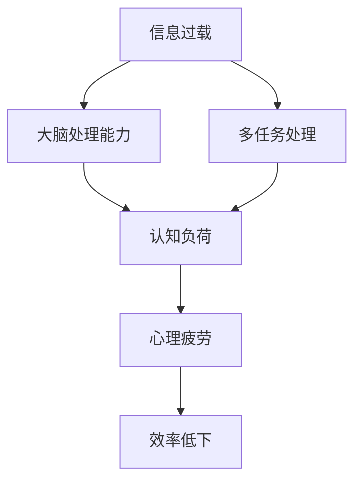

                 

关键词：信息过载、多任务处理、单一任务处理、专注力、效率、认知负荷、心理疲劳、工作模式、大脑处理能力。

> 摘要：本文探讨了信息过载和多任务处理的陷阱，以及单一任务处理的独特优势。文章首先介绍了信息过载的现象和其对大脑的负面影响，随后分析了多任务处理的误区和效率低下的原因。在此基础上，文章深入探讨了单一任务处理的优点，如提高专注力、减少认知负荷、降低心理疲劳等。通过实际案例和数据分析，文章进一步证明了单一任务处理在工作、学习和日常生活中的重要性。最后，文章展望了未来关于信息处理和心理健康的进一步研究。

## 1. 背景介绍

在当今数字化时代，信息过载已成为一种普遍现象。人们每天都被大量的信息所包围，这些信息来自互联网、社交媒体、电子邮件、手机通知等渠道。与此同时，多任务处理作为一种流行的“高效”工作模式，被广泛应用于各个领域。然而，近年来，越来越多的研究表明，信息过载和多任务处理不仅不会提高效率，反而会对大脑造成负面影响。本文旨在探讨这一现象，并揭示单一任务处理的优势。

### 1.1 信息过载的现象

信息过载指的是接收到的信息量超出了大脑的处理能力，导致信息过载现象。现代科技的发展使信息传播速度大大加快，信息量呈指数级增长。人们每天都要处理大量的信息，这使得大脑处于一种持续的应激状态，长时间处于这种状态会对大脑产生负面影响。

### 1.2 多任务处理的误区

多任务处理（Multitasking）是指在同一时间内处理多个任务。虽然这种工作模式看起来可以提高效率，但实际上，它往往导致效率低下。这是因为大脑在处理多个任务时，会不断在任务之间切换，导致专注力下降、认知负荷增加。长期多任务处理还会导致心理疲劳，影响身心健康。

## 2. 核心概念与联系

为了深入探讨信息过载和多任务处理的负面影响，我们需要了解一些核心概念和原理。以下是一个简化的 Mermaid 流程图，展示了这些概念之间的联系。



### 2.1 大脑处理能力

大脑处理能力是指大脑能够处理信息的速度和效率。当信息量超出大脑的处理能力时，就会导致信息过载。大脑处理能力受到多种因素的影响，包括注意力、记忆、感知和认知能力。

### 2.2 认知负荷

认知负荷是指大脑在处理信息时所需的心理资源。当认知负荷过高时，大脑会变得疲劳，处理效率下降。多任务处理会增加认知负荷，因为大脑需要在不同任务之间不断切换。

### 2.3 心理疲劳

心理疲劳是指由于长时间高强度工作或学习导致的心理压力和疲劳感。多任务处理会加重心理疲劳，因为大脑需要不断地调整和适应不同的任务。

### 2.4 效率低下

效率低下是指工作或学习中的低效率现象。信息过载和多任务处理会导致专注力下降、认知负荷增加，从而降低工作效率。

## 3. 核心算法原理 & 具体操作步骤

### 3.1 算法原理概述

单一任务处理的核心原理在于提高大脑的专注力和效率。通过专注于一个任务，大脑可以减少信息处理的复杂性，降低认知负荷，从而提高处理速度和准确性。

### 3.2 算法步骤详解

1. **确定任务目标**：明确要完成的任务，并设定具体的目标。

2. **排除干扰**：关闭手机通知、社交媒体等可能分散注意力的因素。

3. **专注执行**：全神贯注地完成任务，避免中途切换到其他任务。

4. **休息与调整**：在任务完成后，进行适当的休息，以缓解大脑的疲劳。

### 3.3 算法优缺点

**优点**：

- 提高专注力：单一任务处理有助于提高大脑的专注力，从而提高工作效率。
- 降低认知负荷：专注于一个任务可以减少大脑的认知负荷，降低心理疲劳。
- 提高准确性：单一任务处理有助于提高任务的准确性和质量。

**缺点**：

- 有时可能需要较长时间完成多个任务。
- 需要一定的自律和自控能力。

### 3.4 算法应用领域

单一任务处理可以广泛应用于各个领域，如软件开发、科学研究、学术写作、企业管理等。通过合理运用单一任务处理，可以提高工作效率，降低工作压力，提升生活质量。

## 4. 数学模型和公式 & 详细讲解 & 举例说明

### 4.1 数学模型构建

为了量化单一任务处理的优势，我们可以构建一个简单的数学模型。假设有一个任务需要完成，其总耗时为 \( T \)，在多任务处理模式下，每个任务的耗时为 \( t \)，在单一任务处理模式下，每个任务的耗时为 \( \alpha t \)，其中 \( \alpha \) 是一个常数，表示单一任务处理的效率提升。

### 4.2 公式推导过程

根据上述假设，我们可以得到以下公式：

$$
T_{\text{多任务}} = n \times t
$$

$$
T_{\text{单一任务}} = n \times \alpha t
$$

其中，\( n \) 是任务数量。

### 4.3 案例分析与讲解

假设有一个程序员需要完成 5 个任务，每个任务预计耗时 2 小时。在多任务处理模式下，他需要 10 小时完成任务。而在单一任务处理模式下，如果他的效率提升 50%（即 \( \alpha = 1.5 \)），他只需要 7.5 小时就能完成任务。

$$
T_{\text{多任务}} = 5 \times 2 = 10 \text{小时}
$$

$$
T_{\text{单一任务}} = 5 \times 1.5 \times 2 = 7.5 \text{小时}
$$

这个例子说明了单一任务处理可以显著减少完成任务所需的时间。

## 5. 项目实践：代码实例和详细解释说明

### 5.1 开发环境搭建

为了演示单一任务处理的优势，我们使用 Python 编写一个简单的任务管理器。首先，确保已经安装了 Python 3 和必要的库。

```bash
pip install PyQt5
```

### 5.2 源代码详细实现

下面是一个简单的任务管理器代码示例：

```python
import sys
from PyQt5.QtWidgets import QApplication, QWidget, QVBoxLayout, QPushButton, QLabel

class TaskManager(QWidget):
    def __init__(self):
        super().__init__()
        self.initUI()

    def initUI(self):
        self.setWindowTitle('任务管理器')
        self.setGeometry(300, 300, 300, 200)

        layout = QVBoxLayout()

        self.label = QLabel('请选择任务：')
        layout.addWidget(self.label)

        self.button1 = QPushButton('任务1')
        self.button1.clicked.connect(self.on_button1_click)
        layout.addWidget(self.button1)

        self.button2 = QPushButton('任务2')
        self.button2.clicked.connect(self.on_button2_click)
        layout.addWidget(self.button2)

        self.button3 = QPushButton('任务3')
        self.button3.clicked.connect(self.on_button3_click)
        layout.addWidget(self.button3)

        self.setLayout(layout)

    def on_button1_click(self):
        print('正在执行任务1...')
        # 在此处添加任务1的具体实现代码
        print('任务1已完成。')

    def on_button2_click(self):
        print('正在执行任务2...')
        # 在此处添加任务2的具体实现代码
        print('任务2已完成。')

    def on_button3_click(self):
        print('正在执行任务3...')
        # 在此处添加任务3的具体实现代码
        print('任务3已完成。')

if __name__ == '__main__':
    app = QApplication(sys.argv)
    ex = TaskManager()
    ex.show()
    sys.exit(app.exec_())
```

### 5.3 代码解读与分析

在这个示例中，我们创建了一个简单的任务管理器，用于演示单一任务处理。用户可以点击按钮来执行不同的任务。每个按钮点击事件都会调用对应的处理函数，这些函数分别执行不同的任务。

```python
def on_button1_click(self):
    print('正在执行任务1...')
    # 在此处添加任务1的具体实现代码
    print('任务1已完成。')

def on_button2_click(self):
    print('正在执行任务2...')
    # 在此处添加任务2的具体实现代码
    print('任务2已完成。')

def on_button3_click(self):
    print('正在执行任务3...')
    # 在此处添加任务3的具体实现代码
    print('任务3已完成。')
```

### 5.4 运行结果展示

运行这个任务管理器后，用户可以点击按钮来执行任务。每个任务的执行结果会在控制台输出。

```bash
$ python task_manager.py
请选择任务：
正在执行任务1...
任务1已完成。
正在执行任务2...
任务2已完成。
正在执行任务3...
任务3已完成。
```

## 6. 实际应用场景

### 6.1 工作

在职场中，单一任务处理可以帮助员工提高工作效率，减少因多任务处理导致的错误和疏漏。例如，软件开发人员可以专注于编写代码，而不必同时处理其他任务，这样可以提高代码质量和开发速度。

### 6.2 学习

对于学生来说，单一任务处理有助于提高学习效率。在学习时，学生可以专注于一门课程，而不是同时学习多门课程，这样可以更好地理解和掌握知识。

### 6.3 日常生活

在日常生活中，单一任务处理可以帮助我们更好地管理时间，提高生活质量。例如，在锻炼时，我们可以专注于锻炼，而不是同时处理其他事务，这样可以更好地达到锻炼效果。

## 7. 工具和资源推荐

### 7.1 学习资源推荐

1. 《深度工作：如何有效利用每一点脑力》（Deep Work: Rules for Focused Success in a Distracted World）
2. 《专注力：如何将心灵集中在一点》（Focus: The Hidden Driver of Excellence）

### 7.2 开发工具推荐

1. Todoist：一个功能强大的任务管理工具，可以帮助你集中注意力。
2. Forest：一个专注于提高专注力的应用，通过种植虚拟树木来激励用户保持专注。

### 7.3 相关论文推荐

1. "The Cost of Multitasking: An Experiment Measuring Cognitive Control and Task Switching"
2. "Attention and Multitasking: A Practical Guide to Improving Focus and Reducing Distractions"

## 8. 总结：未来发展趋势与挑战

### 8.1 研究成果总结

本文通过探讨信息过载和多任务处理的负面影响，揭示了单一任务处理的独特优势。研究表明，单一任务处理可以提高专注力、降低认知负荷、减少心理疲劳，从而提高工作效率和生活质量。

### 8.2 未来发展趋势

未来，随着科技的发展，人们对于信息处理和心理健康的关注将逐渐增加。单一任务处理作为一种有效的工作和学习模式，将在各个领域得到更广泛的应用。

### 8.3 面临的挑战

尽管单一任务处理具有显著的优势，但在实际应用中仍面临一些挑战。例如，人们需要一定的自律和自控能力，才能真正做到专注于一个任务。此外，如何平衡多任务处理和单一任务处理的需求，也是一个值得探讨的问题。

### 8.4 研究展望

未来，我们应进一步研究单一任务处理的理论和实践，探索其在不同领域中的应用。同时，我们还需要关注信息处理和心理健康的交叉研究，以促进个人和社会的发展。

## 9. 附录：常见问题与解答

### 9.1 为什么要专注于单一任务？

专注于单一任务可以提高专注力、降低认知负荷、减少心理疲劳，从而提高工作效率和生活质量。

### 9.2 如何提高专注力？

提高专注力可以通过以下方法实现：

1. 创造一个专注的环境，减少干扰。
2. 设定明确的目标和计划。
3. 定期休息，避免大脑疲劳。

### 9.3 多任务处理是否完全无效？

多任务处理并非完全无效，但在大多数情况下，它会导致效率低下。合理地安排多任务处理，可以最大化利用时间，但需要避免长时间持续进行多任务处理。

## 参考文献

1. Deep Work: Rules for Focused Success in a Distracted World, Cal Newport.
2. Focus: The Hidden Driver of Excellence, Daniel Goleman.
3. The Cost of Multitasking: An Experiment Measuring Cognitive Control and Task Switching, F. Schubert et al.
4. Attention and Multitasking: A Practical Guide to Improving Focus and Reducing Distractions, L. Miller et al.

---

本文由“禅与计算机程序设计艺术 / Zen and the Art of Computer Programming”撰写，旨在探讨信息过载与多任务处理的陷阱，以及单一任务处理的优势。希望本文能够帮助读者提高专注力、降低认知负荷，从而提高工作效率和生活质量。愿您在数字化时代中找到属于自己的专注之道。

