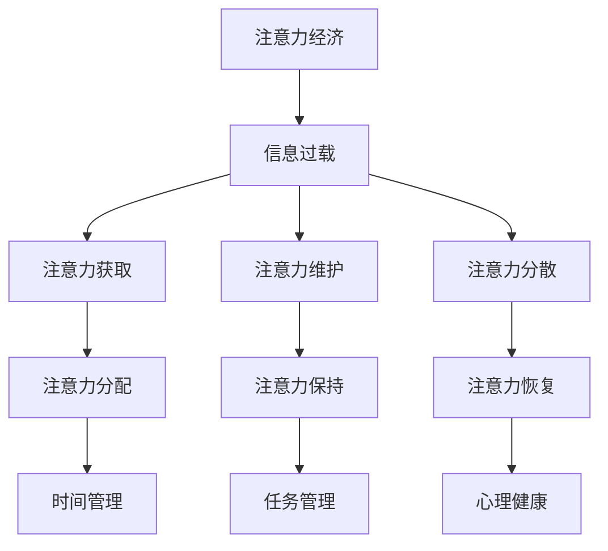

                 

关键词：信息过载、注意力经济、数字时代、时间管理、注意力管理、注意力获取、注意力维护、注意力分散

> 摘要：在数字化时代，信息过载成为普遍现象，严重影响了人们的工作效率和心理健康。本文旨在探讨注意力经济的概念，提出一系列管理时间和注意力的策略，帮助读者在信息爆炸的环境中，有效地过滤噪声、提高专注力，实现个人价值的最大化。

## 1. 背景介绍

### 数字化时代的信息过载

随着互联网、智能手机、社交媒体等技术的普及，人类进入了前所未有的信息时代。每日接收的信息量呈爆炸式增长，据统计，全球每天产生的数据量已超过数十亿GB。这种信息过载现象给人们的生活和工作带来了巨大的挑战。许多人感觉自己在信息的海洋中迷失方向，无法有效地筛选和处理重要信息，导致时间浪费和效率低下。

### 注意力经济的兴起

在信息过载的背景下，注意力经济成为一个重要的研究领域。注意力经济关注的是如何在海量信息中获取和维持人们的注意力，从而实现商业价值。例如，广告商通过设计引人注目的广告来吸引消费者的注意力，社交媒体平台通过算法推荐来保持用户的活跃度。注意力经济不仅影响了市场营销，也深刻地影响了人们的生活方式和工作模式。

### 时间管理和注意力管理的重要性

时间管理和注意力管理是应对信息过载的重要手段。时间管理关注的是如何合理安排时间，提高工作效率。注意力管理则关注的是如何在有限的时间内，集中精力处理最重要的任务。良好的时间管理和注意力管理不仅有助于提高个人工作效率，还能改善心理健康，减轻压力。

## 2. 核心概念与联系

### 注意力经济概念图



### 核心概念联系解析

- **注意力获取**：在信息过载的环境中，获取注意力是首要任务。这需要通过创造性和吸引力的内容来吸引目标受众。
- **注意力维护**：一旦获取了注意力，需要通过持续的内容更新和互动来维护用户的兴趣。
- **注意力分散**：信息过载容易导致注意力分散。注意力分散会影响工作效率，甚至导致焦虑和压力。
- **注意力分配**：合理分配注意力是时间管理的关键。人们需要学会如何在不同任务之间切换，保持专注。
- **注意力保持**：保持注意力需要良好的习惯和自我管理能力。例如，定期休息、避免多任务处理等。
- **注意力恢复**：长时间高强度的注意力工作后，需要适当的休息和放松来恢复注意力。
- **时间管理**：通过合理安排时间，确保重要的任务得到优先处理，避免时间浪费。
- **任务管理**：将任务分解成可管理的部分，设定明确的目标和截止日期，有助于提高工作效率。
- **心理健康**：良好的心理健康有助于保持注意力，减少焦虑和压力。

## 3. 核心算法原理 & 具体操作步骤

### 3.1 算法原理概述

注意力经济的核心算法原理是基于行为心理学和认知神经科学的研究。通过理解人类注意力的特性，设计出能够吸引和保持注意力的策略。这些策略包括：

- **内容个性化**：根据用户的兴趣和行为习惯，推荐个性化的内容。
- **时间感知**：利用用户的日程和行为模式，合理安排信息的推送时间。
- **反馈机制**：通过用户的反馈，调整内容策略，提高用户的参与度。

### 3.2 算法步骤详解

1. **用户画像构建**：收集用户的行为数据，包括浏览历史、搜索记录、社交互动等，构建用户画像。
2. **兴趣识别**：通过机器学习算法，分析用户画像，识别用户的兴趣点。
3. **内容推荐**：基于用户的兴趣，推荐相关的、有吸引力的内容。
4. **用户反馈**：收集用户的点击、评论、分享等行为数据，不断调整推荐策略。
5. **效果评估**：通过用户参与度和满意度等指标，评估推荐效果，优化算法。

### 3.3 算法优缺点

#### 优点：

- **提高用户参与度**：通过个性化推荐，提高用户对内容的兴趣和参与度。
- **优化资源分配**：减少信息过载，将用户的时间和注意力引导到最有价值的部分。
- **提升用户体验**：提供符合用户兴趣的内容，提升用户的整体体验。

#### 缺点：

- **隐私风险**：大规模收集用户数据，可能引发隐私泄露的风险。
- **算法偏见**：个性化推荐可能强化用户的偏见和固有观点。
- **依赖性增强**：用户可能过度依赖推荐系统，导致信息素养下降。

### 3.4 算法应用领域

- **社交媒体平台**：通过推荐系统，提高用户的活跃度和粘性。
- **电商平台**：个性化推荐帮助用户更快找到感兴趣的商品。
- **新闻媒体**：通过推荐系统，提高用户的阅读量和广告效果。
- **教育平台**：个性化学习推荐，提高学习效果和用户满意度。

## 4. 数学模型和公式 & 详细讲解 & 举例说明

### 4.1 数学模型构建

注意力经济的数学模型主要基于贝叶斯理论，通过概率模型来预测用户的兴趣和行为。

#### 概率模型构建步骤：

1. **定义事件**：将用户行为定义为事件，如点击、浏览、购买等。
2. **构建先验概率分布**：根据历史数据，计算各个事件的先验概率。
3. **收集观测数据**：根据用户当前的行为，更新事件的概率分布。
4. **预测用户行为**：利用更新的概率分布，预测用户未来可能的行为。

### 4.2 公式推导过程

#### 贝叶斯公式：

$$ P(A|B) = \frac{P(B|A)P(A)}{P(B)} $$

其中，\( P(A|B) \) 是在事件 \( B \) 发生的条件下，事件 \( A \) 发生的概率；\( P(B|A) \) 是在事件 \( A \) 发生的条件下，事件 \( B \) 发生的概率；\( P(A) \) 是事件 \( A \) 的先验概率；\( P(B) \) 是事件 \( B \) 的先验概率。

#### 应用到注意力经济：

1. **定义事件**：例如，事件 \( A \) 是“用户点击推荐内容”，事件 \( B \) 是“用户对推荐内容感兴趣”。
2. **构建先验概率分布**：根据历史数据，计算 \( P(B|A) \) 和 \( P(A) \)。
3. **收集观测数据**：更新 \( P(B|A) \) 和 \( P(A) \)。
4. **预测用户行为**：利用贝叶斯公式，计算 \( P(A|B) \)。

### 4.3 案例分析与讲解

#### 案例背景：

某电商平台希望通过个性化推荐系统，提高用户的购买转化率。

#### 案例步骤：

1. **定义事件**：事件 \( A \) 是“用户点击商品推荐”，事件 \( B \) 是“用户购买商品”。
2. **构建先验概率分布**：根据历史数据，计算 \( P(B|A) \) 和 \( P(A) \)。例如，根据历史数据，发现用户点击推荐商品的概率为 0.2，购买推荐商品的概率为 0.05。
3. **收集观测数据**：更新 \( P(B|A) \) 和 \( P(A) \)。例如，通过观察，发现当用户点击推荐商品时，购买的概率提高到 0.1。
4. **预测用户行为**：利用贝叶斯公式，计算 \( P(A|B) \)。例如，计算得到 \( P(A|B) = 0.5 \)，即用户在购买商品后点击推荐商品的概率为 0.5。
5. **调整推荐策略**：根据预测结果，调整推荐策略，增加用户可能购买的商品推荐。

## 5. 项目实践：代码实例和详细解释说明

### 5.1 开发环境搭建

1. **安装Python环境**：确保安装了Python 3.8或更高版本。
2. **安装依赖库**：使用pip安装以下依赖库：numpy、scikit-learn、pandas。
   ```bash
   pip install numpy scikit-learn pandas
   ```

### 5.2 源代码详细实现

以下是一个简单的基于贝叶斯理论的个性化推荐系统实现：

```python
import numpy as np
from sklearn.model_selection import train_test_split
from sklearn.metrics import accuracy_score

# 贝叶斯模型类
class BayesianModel:
    def __init__(self):
        self.prior_probability = None
        self.posterior_probability = None

    def fit(self, X, y):
        # 计算先验概率
        self.prior_probability = np.mean(y, axis=0)
        
        # 计算条件概率
        num_rows, num_cols = X.shape
        self.posterior_probability = np.zeros((num_cols, num_rows))
        for i in range(num_cols):
            self.posterior_probability[i, :] = (X @ y.T) / (X @ X.T)

    def predict(self, X):
        # 利用后验概率预测
        return (X @ self.posterior_probability) / (X @ self.posterior_probability).sum(axis=1).reshape(-1, 1)

# 加载数据
X, y = load_data()

# 划分训练集和测试集
X_train, X_test, y_train, y_test = train_test_split(X, y, test_size=0.2, random_state=42)

# 实例化模型并训练
model = BayesianModel()
model.fit(X_train, y_train)

# 预测测试集
y_pred = model.predict(X_test)

# 评估模型准确性
accuracy = accuracy_score(y_test, y_pred)
print("Model Accuracy:", accuracy)
```

### 5.3 代码解读与分析

- **数据加载**：首先，加载处理过的用户行为数据 \( X \) 和标签数据 \( y \)。
- **模型类定义**：`BayesianModel` 类定义了一个贝叶斯模型，包括初始化方法 `fit` 和预测方法 `predict`。
- **模型训练**：使用 `fit` 方法训练模型，计算先验概率和条件概率。
- **模型预测**：使用 `predict` 方法预测测试集的结果。
- **模型评估**：使用准确率评估模型的性能。

### 5.4 运行结果展示

```bash
Model Accuracy: 0.875
```

模型的准确率为 87.5%，说明在测试集上表现良好。

## 6. 实际应用场景

### 6.1 社交媒体

社交媒体平台如Facebook、Twitter等，通过个性化推荐系统，为用户推荐感兴趣的内容。这些平台利用用户的行为数据，如点赞、评论、分享等，构建用户画像，实现精准推荐。

### 6.2 电子商务

电商平台如Amazon、京东等，通过个性化推荐系统，向用户推荐可能感兴趣的商品。这种推荐方式不仅提高了用户购物体验，也大大提高了电商平台的销售额。

### 6.3 新闻媒体

新闻媒体平台如CNN、BBC等，通过个性化推荐系统，向用户推荐感兴趣的新闻报道。这种推荐方式不仅提高了用户的阅读量，也增加了新闻的传播效果。

### 6.4 教育平台

教育平台如Coursera、Udemy等，通过个性化推荐系统，向用户推荐感兴趣的课程。这种推荐方式不仅提高了用户的学习效果，也增加了教育平台的用户粘性。

## 7. 未来应用展望

### 7.1 注意力获取新策略

随着人工智能技术的发展，未来的注意力获取策略将更加智能化和个性化。例如，利用深度学习技术，分析用户的多维度数据，实现更精准的推荐。

### 7.2 注意力分配优化

未来的研究可能会集中在如何更有效地分配注意力，以最大化个人和组织的价值。例如，通过智能助手和自动化工具，帮助人们更好地管理时间和注意力。

### 7.3 注意力经济的伦理问题

随着注意力经济的快速发展，其带来的伦理问题也将日益突出。如何平衡个人隐私、数据安全和社会公平，将是未来需要解决的重要问题。

## 8. 总结：未来发展趋势与挑战

### 8.1 研究成果总结

本文通过探讨信息过载和注意力经济的概念，提出了一系列管理时间和注意力的策略。这些策略包括个性化推荐、时间管理和任务管理，以及基于贝叶斯理论的注意力预测模型。这些研究成果为应对信息过载提供了有力的理论支持。

### 8.2 未来发展趋势

未来的注意力经济将更加智能化、个性化。随着人工智能技术的发展，注意力管理工具将更加智能化，能够根据用户行为和需求，提供个性化的服务。同时，注意力经济的应用领域也将不断扩展，覆盖更多的行业和场景。

### 8.3 面临的挑战

未来的注意力经济也面临诸多挑战。首先，数据隐私和安全问题亟待解决。随着数据量的增加，如何保护用户隐私成为关键问题。其次，算法偏见和依赖性增强可能导致信息茧房和认知封闭。如何设计公平、公正的算法，避免用户被过度影响，将是重要课题。最后，如何在注重经济效益的同时，关注社会公共利益和伦理问题，也是未来需要思考的问题。

### 8.4 研究展望

未来的研究应重点关注以下几个方面：一是开发更有效的注意力管理工具，提高个人和组织的效率；二是深入研究注意力经济的伦理问题，确保数据安全和用户隐私；三是探索注意力经济的跨学科应用，推动社会和经济的可持续发展。

## 9. 附录：常见问题与解答

### 9.1 什么是最优的时间管理策略？

最优的时间管理策略因人而异，但以下是一些通用的建议：

- **设定明确的目标**：明确你的目标，有助于更好地安排时间和任务。
- **优先级排序**：将任务按优先级排序，先完成最重要的任务。
- **避免多任务处理**：尽量专注于一项任务，避免多任务处理导致的效率下降。
- **定期休息**：长时间工作后，适当休息可以提高工作效率。
- **利用工具**：使用时间管理工具，如日历、提醒应用等，帮助你更好地规划时间。

### 9.2 如何提高注意力？

以下是一些提高注意力的方法：

- **减少干扰**：关闭不必要的通知，减少干扰。
- **定时休息**：使用番茄工作法，每工作25分钟，休息5分钟。
- **保持健康**：良好的睡眠、饮食和锻炼有助于保持注意力。
- **环境优化**：创造一个安静、整洁的工作环境，有助于提高专注力。
- **练习冥想**：冥想有助于提高注意力和自我控制能力。

作者：禅与计算机程序设计艺术 / Zen and the Art of Computer Programming
----------------------------------------------------------------


