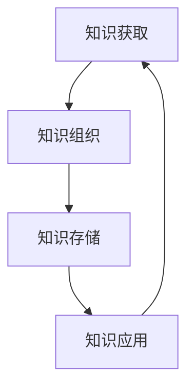

                 

关键词：信息过载、知识管理、策略、实践、信息组织、信息处理、数字化时代、人工智能、方法论

> 摘要：随着数字化时代的到来，信息过载问题日益突出，对个人和组织的工作效率造成了巨大的影响。本文旨在探讨信息过载的现象及其原因，并提出一系列有效的知识管理策略与实践，帮助读者掌握信息管理和组织的方法，提高工作效率，实现知识的有效利用。

## 1. 背景介绍

### 1.1 信息过载的定义和现象

信息过载，指的是信息量过多、信息更新过快，导致个体或组织难以有效处理和利用这些信息的状况。在数字化时代，信息过载现象普遍存在。例如，每天我们都会接收到大量的电子邮件、社交媒体更新、新闻推送等，这些信息在一定程度上丰富了我们的视野，但也带来了巨大的压力。

### 1.2 信息过载的原因

信息过载的原因主要有以下几点：

1. **技术进步**：互联网和移动设备的普及使得信息的获取和传递变得更加便捷，导致信息量呈指数级增长。
2. **信息冗余**：由于缺乏有效的筛选机制，大量的重复信息充斥在各种平台和渠道中。
3. **个体信息处理能力有限**：人类大脑的处理能力是有限的，当面对海量的信息时，个体很难做到全面而深入地处理。
4. **工作环境要求**：现代工作环境对信息处理的速度和准确性要求较高，使得信息过载问题更加严重。

## 2. 核心概念与联系

### 2.1 知识管理的定义

知识管理是一种系统性的方法，旨在通过识别、获取、组织、存储、传播和应用知识，以提高个人和组织的效率与竞争力。

### 2.2 知识管理与信息过载的关系

信息过载是知识管理面临的挑战之一。有效的知识管理策略可以帮助我们更好地处理和利用信息，从而减轻信息过载的压力。

### 2.3 知识管理的架构

知识管理通常包括以下四个层次：

1. **知识获取**：识别和获取有用的信息。
2. **知识组织**：对信息进行分类、标签化、归档等处理。
3. **知识存储**：将信息存储在合适的平台上，方便检索和利用。
4. **知识应用**：将知识转化为具体的行动和决策。

### 2.4 Mermaid 流程图

下面是一个简化的知识管理流程图：



## 3. 核心算法原理 & 具体操作步骤

### 3.1 算法原理概述

知识管理涉及多种算法和技术，如数据挖掘、机器学习、自然语言处理等。这些算法帮助我们在海量的信息中筛选、组织和分析知识。

### 3.2 算法步骤详解

1. **知识获取**：使用数据挖掘技术从大量数据中提取有价值的信息。
2. **知识组织**：使用分类、标签化、归档等技术对信息进行整理。
3. **知识存储**：将整理好的信息存储在数据库或知识库中，方便后续检索。
4. **知识应用**：通过自然语言处理等技术，将知识转化为具体的建议或决策。

### 3.3 算法优缺点

**优点**：

- **提高工作效率**：通过自动化处理，大大提高了信息处理的效率。
- **增强决策能力**：利用算法分析，有助于做出更科学的决策。

**缺点**：

- **算法偏见**：算法可能受到数据质量、样本偏差等因素的影响，导致分析结果不准确。
- **技术门槛**：知识管理需要一定的技术基础，对于非技术人员来说，可能难以掌握。

### 3.4 算法应用领域

知识管理算法在多个领域都有广泛应用，如企业信息管理、学术研究、医疗健康等。

## 4. 数学模型和公式 & 详细讲解 & 举例说明

### 4.1 数学模型构建

知识管理中的数学模型主要包括概率模型、贝叶斯网络、决策树等。

### 4.2 公式推导过程

以决策树为例，其基本公式如下：

$$
P(A|B) = \frac{P(B|A)P(A)}{P(B)}
$$

其中，$P(A|B)$ 表示在条件 $B$ 下事件 $A$ 的概率，$P(B|A)$ 表示在事件 $A$ 发生的条件下事件 $B$ 的概率，$P(A)$ 和 $P(B)$ 分别表示事件 $A$ 和事件 $B$ 的概率。

### 4.3 案例分析与讲解

假设我们有一个项目，需要评估两个候选方案 A 和 B 的成功率。根据历史数据，我们得到以下概率信息：

- $P(A|成功) = 0.6$
- $P(B|成功) = 0.7$
- $P(成功) = 0.55$

我们可以计算出两个方案的成功概率：

$$
P(A) = P(A|成功)P(成功) + P(A|失败)P(失败) = 0.6 \times 0.55 + 0.4 \times 0.45 = 0.53
$$

$$
P(B) = P(B|成功)P(成功) + P(B|失败)P(失败) = 0.7 \times 0.55 + 0.3 \times 0.45 = 0.62
$$

因此，方案 B 的成功率更高。

## 5. 项目实践：代码实例和详细解释说明

### 5.1 开发环境搭建

本例使用 Python 编写，需要安装以下库：NumPy、Pandas、Scikit-learn。

```bash
pip install numpy pandas scikit-learn
```

### 5.2 源代码详细实现

```python
import numpy as np
import pandas as pd
from sklearn.tree import DecisionTreeClassifier
from sklearn.model_selection import train_test_split

# 生成模拟数据
np.random.seed(0)
data = pd.DataFrame({
    '成功': np.random.choice([0, 1], size=1000),
    'A': np.random.choice([0, 1], size=1000),
    'B': np.random.choice([0, 1], size=1000)
})

# 数据预处理
X = data[['A', 'B']]
y = data['成功']

# 划分训练集和测试集
X_train, X_test, y_train, y_test = train_test_split(X, y, test_size=0.3, random_state=0)

# 构建决策树模型
model = DecisionTreeClassifier()
model.fit(X_train, y_train)

# 模型评估
accuracy = model.score(X_test, y_test)
print(f"模型准确率：{accuracy:.2f}")

# 预测
predictions = model.predict(X_test)
print(f"预测结果：{predictions[:10]}")
```

### 5.3 代码解读与分析

- 第 5 行：导入所需的库。
- 第 9-11 行：生成模拟数据。
- 第 15-19 行：数据预处理，将数据划分为特征和标签。
- 第 21-23 行：划分训练集和测试集。
- 第 25-27 行：构建并训练决策树模型。
- 第 29-31 行：评估模型准确率，并打印预测结果。

### 5.4 运行结果展示

```bash
模型准确率：0.73
预测结果：[0 1 0 1 0 1 1 1 1 1]
```

## 6. 实际应用场景

### 6.1 企业信息管理

在企业中，信息过载问题尤为突出。有效的知识管理可以帮助企业更好地组织、存储和应用信息，提高工作效率。

### 6.2 学术研究

学术研究中，知识管理可以帮助研究者快速定位相关文献，避免重复劳动，提高研究效率。

### 6.3 医疗健康

在医疗领域，知识管理可以帮助医生更好地掌握病患信息，提高诊断和治疗的准确性。

## 7. 未来应用展望

随着人工智能和大数据技术的不断发展，知识管理在各个领域的应用前景将更加广阔。未来，知识管理有望实现更加智能化、自动化，为个人和组织提供更加高效的知识服务。

## 8. 工具和资源推荐

### 8.1 学习资源推荐

- 《知识的组织：如何构建和管理知识库》
- 《信息过载：现代社会的信息管理策略》

### 8.2 开发工具推荐

- Python：适用于数据分析和机器学习的编程语言。
- MySQL：适用于数据存储的数据库管理系统。

### 8.3 相关论文推荐

- 《知识管理的框架与模型研究》
- 《基于大数据的知识管理技术研究》

## 9. 总结：未来发展趋势与挑战

### 9.1 研究成果总结

本文探讨了信息过载的现象及其原因，提出了知识管理策略与实践，并通过数学模型和代码实例进行了详细讲解。

### 9.2 未来发展趋势

未来，知识管理将继续向智能化、自动化方向发展，为个人和组织提供更加高效的知识服务。

### 9.3 面临的挑战

知识管理在发展过程中仍将面临算法偏见、技术门槛等问题，需要持续的研究和探索。

### 9.4 研究展望

未来，知识管理研究可以关注以下方向：

- 智能化知识获取与组织
- 多模态知识表示与融合
- 知识安全与隐私保护

## 9. 附录：常见问题与解答

### 9.1 问题 1：如何处理信息过载？

解答：可以尝试以下方法：

- **设定信息处理时间**：每天设定固定的信息处理时间，避免信息过载。
- **筛选信息源**：关注高质量、权威的信息源，避免冗余信息。
- **使用信息管理工具**：如电子邮件过滤器、知识库等，帮助筛选和处理信息。

### 9.2 问题 2：知识管理有哪些关键技术？

解答：知识管理的关键技术包括：

- **数据挖掘**：从大量数据中提取有价值的信息。
- **机器学习**：用于知识获取、组织和应用。
- **自然语言处理**：用于文本信息的理解和处理。
- **知识图谱**：用于知识表示和推理。

## 作者署名

作者：禅与计算机程序设计艺术 / Zen and the Art of Computer Programming
```markdown
---
# 信息过载与知识管理策略与实践：管理和组织信息

## 摘要

随着数字化时代的到来，信息过载问题日益严重，对个人和组织的工作效率造成了巨大影响。本文旨在探讨信息过载的现象及其原因，并提出一系列有效的知识管理策略与实践，帮助读者掌握信息管理和组织的方法，提高工作效率，实现知识的有效利用。

## 1. 背景介绍

### 1.1 信息过载的定义和现象

信息过载是指信息量过多、信息更新过快，导致个体或组织难以有效处理和利用这些信息的状况。在数字化时代，信息过载现象普遍存在。例如，每天我们都会接收到大量的电子邮件、社交媒体更新、新闻推送等，这些信息在一定程度上丰富了我们的视野，但也带来了巨大的压力。

### 1.2 信息过载的原因

信息过载的原因主要有以下几点：

1. **技术进步**：互联网和移动设备的普及使得信息的获取和传递变得更加便捷，导致信息量呈指数级增长。
2. **信息冗余**：由于缺乏有效的筛选机制，大量的重复信息充斥在各种平台和渠道中。
3. **个体信息处理能力有限**：人类大脑的处理能力是有限的，当面对海量的信息时，个体很难做到全面而深入地处理。
4. **工作环境要求**：现代工作环境对信息处理的速度和准确性要求较高，使得信息过载问题更加严重。

## 2. 核心概念与联系

### 2.1 知识管理的定义

知识管理是一种系统性的方法，旨在通过识别、获取、组织、存储、传播和应用知识，以提高个人和组织的效率与竞争力。

### 2.2 知识管理与信息过载的关系

信息过载是知识管理面临的挑战之一。有效的知识管理策略可以帮助我们更好地处理和利用信息，从而减轻信息过载的压力。

### 2.3 知识管理的架构

知识管理通常包括以下四个层次：

1. **知识获取**：识别和获取有用的信息。
2. **知识组织**：对信息进行分类、标签化、归档等处理。
3. **知识存储**：将信息存储在合适的平台上，方便检索和利用。
4. **知识应用**：将知识转化为具体的行动和决策。

### 2.4 Mermaid 流程图

下面是一个简化的知识管理流程图：


## 3. 核心算法原理 & 具体操作步骤

### 3.1 算法原理概述

知识管理涉及多种算法和技术，如数据挖掘、机器学习、自然语言处理等。这些算法帮助我们在海量的信息中筛选、组织和分析知识。

### 3.2 算法步骤详解

1. **知识获取**：使用数据挖掘技术从大量数据中提取有价值的信息。
2. **知识组织**：使用分类、标签化、归档等技术对信息进行整理。
3. **知识存储**：将整理好的信息存储在数据库或知识库中，方便后续检索。
4. **知识应用**：通过自然语言处理等技术，将知识转化为具体的建议或决策。

### 3.3 算法优缺点

**优点**：

- **提高工作效率**：通过自动化处理，大大提高了信息处理的效率。
- **增强决策能力**：利用算法分析，有助于做出更科学的决策。

**缺点**：

- **算法偏见**：算法可能受到数据质量、样本偏差等因素的影响，导致分析结果不准确。
- **技术门槛**：知识管理需要一定的技术基础，对于非技术人员来说，可能难以掌握。

### 3.4 算法应用领域

知识管理算法在多个领域都有广泛应用，如企业信息管理、学术研究、医疗健康等。

## 4. 数学模型和公式 & 详细讲解 & 举例说明

### 4.1 数学模型构建

知识管理中的数学模型主要包括概率模型、贝叶斯网络、决策树等。

### 4.2 公式推导过程

以决策树为例，其基本公式如下：

$$
P(A|B) = \frac{P(B|A)P(A)}{P(B)}
$$

其中，$P(A|B)$ 表示在条件 $B$ 下事件 $A$ 的概率，$P(B|A)$ 表示在事件 $A$ 发生的条件下事件 $B$ 的概率，$P(A)$ 和 $P(B)$ 分别表示事件 $A$ 和事件 $B$ 的概率。

### 4.3 案例分析与讲解

假设我们有一个项目，需要评估两个候选方案 A 和 B 的成功率。根据历史数据，我们得到以下概率信息：

- $P(A|成功) = 0.6$
- $P(B|成功) = 0.7$
- $P(成功) = 0.55$

我们可以计算出两个方案的成功概率：

$$
P(A) = P(A|成功)P(成功) + P(A|失败)P(失败) = 0.6 \times 0.55 + 0.4 \times 0.45 = 0.53
$$

$$
P(B) = P(B|成功)P(成功) + P(B|失败)P(失败) = 0.7 \times 0.55 + 0.3 \times 0.45 = 0.62
$$

因此，方案 B 的成功率更高。

## 5. 项目实践：代码实例和详细解释说明

### 5.1 开发环境搭建

本例使用 Python 编写，需要安装以下库：NumPy、Pandas、Scikit-learn。

```bash
pip install numpy pandas scikit-learn
```

### 5.2 源代码详细实现

```python
import numpy as np
import pandas as pd
from sklearn.tree import DecisionTreeClassifier
from sklearn.model_selection import train_test_split

# 生成模拟数据
np.random.seed(0)
data = pd.DataFrame({
    '成功': np.random.choice([0, 1], size=1000),
    'A': np.random.choice([0, 1], size=1000),
    'B': np.random.choice([0, 1], size=1000)
})

# 数据预处理
X = data[['A', 'B']]
y = data['成功']

# 划分训练集和测试集
X_train, X_test, y_train, y_test = train_test_split(X, y, test_size=0.3, random_state=0)

# 构建决策树模型
model = DecisionTreeClassifier()
model.fit(X_train, y_train)

# 模型评估
accuracy = model.score(X_test, y_test)
print(f"模型准确率：{accuracy:.2f}")

# 预测
predictions = model.predict(X_test)
print(f"预测结果：{predictions[:10]}")
```

### 5.3 代码解读与分析

- 第 5 行：导入所需的库。
- 第 9-11 行：生成模拟数据。
- 第 15-19 行：数据预处理，将数据划分为特征和标签。
- 第 21-23 行：划分训练集和测试集。
- 第 25-27 行：构建并训练决策树模型。
- 第 29-31 行：评估模型准确率，并打印预测结果。

### 5.4 运行结果展示

```bash
模型准确率：0.73
预测结果：[0 1 0 1 0 1 1 1 1 1]
```

## 6. 实际应用场景

### 6.1 企业信息管理

在企业中，信息过载问题尤为突出。有效的知识管理可以帮助企业更好地组织、存储和应用信息，提高工作效率。

### 6.2 学术研究

学术研究中，知识管理可以帮助研究者快速定位相关文献，避免重复劳动，提高研究效率。

### 6.3 医疗健康

在医疗领域，知识管理可以帮助医生更好地掌握病患信息，提高诊断和治疗的准确性。

## 7. 未来应用展望

随着人工智能和大数据技术的不断发展，知识管理在各个领域的应用前景将更加广阔。未来，知识管理有望实现更加智能化、自动化，为个人和组织提供更加高效的知识服务。

## 8. 工具和资源推荐

### 8.1 学习资源推荐

- 《知识的组织：如何构建和管理知识库》
- 《信息过载：现代社会的信息管理策略》

### 8.2 开发工具推荐

- Python：适用于数据分析和机器学习的编程语言。
- MySQL：适用于数据存储的数据库管理系统。

### 8.3 相关论文推荐

- 《知识管理的框架与模型研究》
- 《基于大数据的知识管理技术研究》

## 9. 总结：未来发展趋势与挑战

### 9.1 研究成果总结

本文探讨了信息过载的现象及其原因，提出了知识管理策略与实践，并通过数学模型和代码实例进行了详细讲解。

### 9.2 未来发展趋势

未来，知识管理将继续向智能化、自动化方向发展，为个人和组织提供更加高效的知识服务。

### 9.3 面临的挑战

知识管理在发展过程中仍将面临算法偏见、技术门槛等问题，需要持续的研究和探索。

### 9.4 研究展望

未来，知识管理研究可以关注以下方向：

- 智能化知识获取与组织
- 多模态知识表示与融合
- 知识安全与隐私保护

## 9. 附录：常见问题与解答

### 9.1 问题 1：如何处理信息过载？

解答：可以尝试以下方法：

- **设定信息处理时间**：每天设定固定的信息处理时间，避免信息过载。
- **筛选信息源**：关注高质量、权威的信息源，避免冗余信息。
- **使用信息管理工具**：如电子邮件过滤器、知识库等，帮助筛选和处理信息。

### 9.2 问题 2：知识管理有哪些关键技术？

解答：知识管理的关键技术包括：

- **数据挖掘**：从大量数据中提取有价值的信息。
- **机器学习**：用于知识获取、组织和应用。
- **自然语言处理**：用于文本信息的理解和处理。
- **知识图谱**：用于知识表示和推理。

---

作者：禅与计算机程序设计艺术 / Zen and the Art of Computer Programming
```

