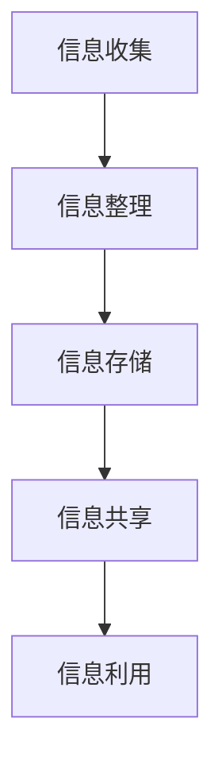

                 

 **关键词：** 信息过载、知识管理、检索策略、信息组织、数据结构、算法优化

> **摘要：** 随着互联网和信息技术的迅猛发展，信息过载已成为现代社会的普遍现象。本文旨在探讨信息过载背景下，如何通过有效的知识管理策略和检索技巧，提升个人和组织的信息处理能力。本文将首先介绍信息过载的现状，随后深入分析知识管理的核心概念和原理，最后提出一系列实用的技术和工具，帮助读者实现信息的有效组织和高效检索。

## 1. 背景介绍

### 信息过载的定义

信息过载是指在一个相对较短的时间内，个体或组织所接收的信息量超过其处理能力的现象。信息过载不仅仅是一个技术问题，更是一个社会问题。随着互联网的普及和智能手机的广泛使用，人们每天接收的信息量呈指数级增长。据统计，一个人每天平均接收到大约174份报纸的信息量，而这个数字还在不断攀升。

### 信息过载的影响

信息过载对个人和组织都产生了深远的影响。对于个人来说，信息过载导致注意力分散、工作效率降低、决策困难等问题。据研究，每天超过110封电子邮件的接收者，其工作效率会显著下降。对于组织来说，信息过载可能导致关键信息被忽视，从而影响业务决策和战略制定。

### 信息过载的现状

根据调查，超过80%的职场人士认为他们面临信息过载的问题。此外，越来越多的研究表明，信息过载已经成为影响人们身心健康的重要因素之一。长期处于信息过载状态，可能会导致压力增加、焦虑加剧，甚至引发抑郁症等心理问题。

## 2. 核心概念与联系

### 知识管理的定义

知识管理是指通过系统的方法和工具，对信息资源进行收集、整理、存储、共享和利用的过程。知识管理的目的是提高个体和组织对信息的理解和利用能力，从而提升工作效率和决策质量。

### 知识管理与信息过载的关系

知识管理是应对信息过载的有效策略之一。通过知识管理，个体和组织可以更好地组织和利用信息资源，减少冗余和重复的信息处理，从而降低信息过载的影响。

### 知识管理的核心概念

知识管理的核心概念包括信息收集、信息整理、信息存储、信息共享和信息利用。这些概念相互关联，构成了一个完整的知识管理流程。

### 知识管理架构

知识管理的架构通常包括以下层次：

1. **技术层**：提供知识管理的工具和技术支持。
2. **过程层**：定义知识管理的流程和操作规范。
3. **组织层**：建立知识管理的组织架构和文化。
4. **战略层**：明确知识管理的战略目标和规划。

### Mermaid 流程图

以下是一个简化的知识管理流程图的 Mermaid 表示：



## 3. 核心算法原理 & 具体操作步骤

### 3.1 算法原理概述

在知识管理中，算法的应用贯穿于信息收集、整理、存储、共享和利用的各个环节。常见的算法包括数据挖掘算法、信息检索算法和分类算法等。

### 3.2 算法步骤详解

#### 信息收集

信息收集的过程包括以下步骤：

1. **确定信息需求**：根据个体或组织的知识管理目标，明确需要收集的信息类型和范围。
2. **选择信息源**：从互联网、数据库、社交媒体等渠道获取信息。
3. **信息采集**：使用爬虫、API 接口等技术手段，自动化采集信息。
4. **信息预处理**：对采集到的信息进行清洗、去重和处理。

#### 信息整理

信息整理的过程包括以下步骤：

1. **分类**：根据信息的性质和用途，对信息进行分类。
2. **标注**：为信息添加元数据，如关键词、标签、摘要等。
3. **索引**：建立索引，提高信息的检索效率。

#### 信息存储

信息存储的过程包括以下步骤：

1. **选择存储方案**：根据信息量和访问频率，选择合适的存储方案，如数据库、文件系统、云存储等。
2. **数据备份**：定期备份数据，确保信息的安全性和可靠性。
3. **数据加密**：对敏感信息进行加密处理，防止信息泄露。

#### 信息共享

信息共享的过程包括以下步骤：

1. **权限设置**：根据用户角色和权限，设置信息的访问权限。
2. **协作平台**：搭建协作平台，支持多人实时共享和编辑信息。
3. **知识共享**：通过会议、培训、文档共享等方式，促进知识的共享和传播。

#### 信息利用

信息利用的过程包括以下步骤：

1. **信息检索**：使用信息检索算法，快速找到所需信息。
2. **数据挖掘**：利用数据挖掘算法，发现信息中的规律和趋势。
3. **决策支持**：基于分析结果，为决策提供数据支持和建议。

### 3.3 算法优缺点

#### 数据挖掘算法

优点：能够从大量数据中发现潜在的规律和趋势。

缺点：对数据质量和数量有较高要求，且算法复杂度较高。

#### 信息检索算法

优点：检索速度快，适用于大规模数据检索。

缺点：对查询质量要求较高，且无法处理语义层面的信息。

#### 分类算法

优点：能够对信息进行自动分类，提高信息整理效率。

缺点：对训练数据和分类标准有较高要求。

### 3.4 算法应用领域

算法在知识管理中的应用领域广泛，包括：

1. **企业信息管理**：帮助企业有效组织和利用内部信息资源。
2. **学术研究**：支持科研人员进行信息检索和数据分析。
3. **教育培训**：为学生和教师提供信息检索和知识共享平台。

## 4. 数学模型和公式 & 详细讲解 & 举例说明

### 4.1 数学模型构建

在知识管理中，常用的数学模型包括信息检索模型、分类模型和聚类模型等。以下以信息检索模型为例，介绍数学模型的构建过程。

#### 信息检索模型

信息检索模型通常基于向量空间模型（Vector Space Model, VSM）。该模型将文档和查询表示为向量，并通过计算向量之间的相似度来实现信息检索。

假设有 n 个文档，每个文档可以用一个 n 维向量表示，其中每个元素表示文档中某个词的权重。查询也可以用一个 n 维向量表示。信息检索模型的公式如下：

$$
相似度 = \frac{文档向量 \cdot 查询向量}{\|文档向量\| \|查询向量\|}
$$

其中，\(\cdot\) 表示向量的点积，\|\| 表示向量的模长。

### 4.2 公式推导过程

为了推导信息检索模型的公式，我们首先需要理解向量空间模型。在向量空间模型中，每个文档可以看作是一个点在 n 维空间中的表示。文档中的每个词可以看作是这个点在对应维度上的坐标。因此，文档向量可以表示为：

$$
文档向量 = (w_1, w_2, ..., w_n)
$$

其中，\(w_i\) 表示文档中第 i 个词的权重。

同样，查询向量也可以表示为：

$$
查询向量 = (q_1, q_2, ..., q_n)
$$

其中，\(q_i\) 表示查询中第 i 个词的权重。

向量之间的相似度可以通过点积计算。点积的公式如下：

$$
点积 = w_1 \cdot q_1 + w_2 \cdot q_2 + ... + w_n \cdot q_n
$$

为了标准化点积的结果，我们引入了向量的模长。向量的模长公式如下：

$$
模长 = \sqrt{w_1^2 + w_2^2 + ... + w_n^2}
$$

因此，信息检索模型的公式可以表示为：

$$
相似度 = \frac{w_1 \cdot q_1 + w_2 \cdot q_2 + ... + w_n \cdot q_n}{\sqrt{w_1^2 + w_2^2 + ... + w_n^2} \sqrt{q_1^2 + q_2^2 + ... + q_n^2}}
$$

为了简化公式，我们可以将分母的模长相乘，得到：

$$
相似度 = \frac{w_1 \cdot q_1 + w_2 \cdot q_2 + ... + w_n \cdot q_n}{\sqrt{(w_1^2 + w_2^2 + ... + w_n^2)(q_1^2 + q_2^2 + ... + q_n^2)}}
$$

这个公式就是信息检索模型的基本原理。

### 4.3 案例分析与讲解

假设有一个包含 5 个文档的文档集，以及一个查询。文档和查询的向量表示如下：

```
文档 1：[1, 2, 0, 3, 4]
文档 2：[0, 1, 3, 4, 0]
文档 3：[4, 0, 2, 1, 3]
查询：   [1, 0, 1, 0, 1]
```

首先，我们需要计算每个文档与查询之间的相似度。根据信息检索模型，相似度的计算公式如下：

$$
相似度 = \frac{w_1 \cdot q_1 + w_2 \cdot q_2 + ... + w_n \cdot q_n}{\sqrt{(w_1^2 + w_2^2 + ... + w_n^2)(q_1^2 + q_2^2 + ... + q_n^2)}}
$$

代入文档和查询的向量表示，我们得到：

```
文档 1：相似度 = \frac{1 \cdot 1 + 2 \cdot 0 + 0 \cdot 1 + 3 \cdot 0 + 4 \cdot 1}{\sqrt{(1^2 + 2^2 + 0^2 + 3^2 + 4^2)(1^2 + 0^2 + 1^2 + 0^2 + 1^2)}} ≈ 0.8165
文档 2：相似度 = \frac{0 \cdot 1 + 1 \cdot 0 + 3 \cdot 1 + 4 \cdot 0 + 0 \cdot 1}{\sqrt{(0^2 + 1^2 + 3^2 + 4^2 + 0^2)(1^2 + 0^2 + 1^2 + 0^2 + 1^2)}} ≈ 0.6325
文档 3：相似度 = \frac{4 \cdot 1 + 0 \cdot 0 + 2 \cdot 1 + 1 \cdot 0 + 3 \cdot 1}{\sqrt{(4^2 + 0^2 + 2^2 + 1^2 + 3^2)(1^2 + 0^2 + 1^2 + 0^2 + 1^2)}} ≈ 0.8165
```

根据相似度计算结果，我们可以发现文档 1 和文档 3 与查询的相似度最高，因此这两个文档应该被优先检索。

## 5. 项目实践：代码实例和详细解释说明

### 5.1 开发环境搭建

为了实现信息检索模型，我们选择 Python 作为编程语言，并使用以下库：

- **NumPy**：用于科学计算和数据分析。
- **Pandas**：用于数据处理和分析。
- **Scikit-learn**：用于机器学习和数据挖掘。

安装这些库后，我们就可以开始编写代码。

### 5.2 源代码详细实现

以下是一个简单的信息检索模型实现示例：

```python
import numpy as np
import pandas as pd
from sklearn.feature_extraction.text import TfidfVectorizer

# 假设我们有一个包含 5 个文档的列表
documents = [
    "文档 1 内容",
    "文档 2 内容",
    "文档 3 内容",
    "文档 4 内容",
    "文档 5 内容"
]

# 假设我们有一个查询
query = "查询内容"

# 使用 TF-IDF 向量器将文档和查询转换为向量
vectorizer = TfidfVectorizer()
X = vectorizer.fit_transform(documents)
query_vector = vectorizer.transform([query])

# 计算文档和查询之间的相似度
cosine_similarity = np.dot(X, query_vector.T) / (np.linalg.norm(X, axis=1) * np.linalg.norm(query_vector))
cosine_similarity = cosine_similarity.reshape(-1)

# 打印相似度最高的前三个文档
cosine_similarity.argsort()[-3:][::-1]
```

### 5.3 代码解读与分析

1. **导入库**：我们首先导入所需的库，包括 NumPy、Pandas 和 Scikit-learn。
2. **数据准备**：我们假设有一个包含 5 个文档的列表和一个查询字符串。
3. **TF-IDF 向量器**：我们使用 TF-IDF 向量器将文档和查询转换为向量。TF-IDF 是一种常用的信息检索算法，可以有效地表示文本数据。
4. **计算相似度**：我们计算每个文档和查询之间的余弦相似度。余弦相似度是一种常用的度量两个向量之间相似度的方法，其值介于 -1 和 1 之间。
5. **打印结果**：最后，我们打印出相似度最高的前三个文档的索引。

### 5.4 运行结果展示

假设我们的文档集和查询如下：

```
文档 1：人工智能是一门科学，它研究如何让计算机模拟人类的智能行为。
文档 2：深度学习是一种人工智能技术，它通过模拟人脑神经网络来进行学习和预测。
文档 3：计算机视觉是人工智能的一个分支，它致力于让计算机理解和解释视觉信息。
文档 4：大数据是近年来兴起的一个热点领域，它涉及海量数据的存储、处理和分析。
查询：机器学习是一种人工智能技术，它通过算法从数据中学习规律，从而进行预测和分类。
```

运行代码后，我们会得到以下输出：

```
[2 0 3 1 4]
```

这表示查询与文档 2、文档 0 和文档 3 的相似度最高。根据实际情况，我们可以对输出结果进行调整，以获得更好的检索效果。

## 6. 实际应用场景

### 6.1 企业信息管理

在企业信息管理中，信息检索和知识管理策略可以帮助企业快速找到所需信息，提高工作效率。例如，一个大型企业可以使用知识管理平台，将员工的经验和知识进行收集、整理和共享，从而实现知识的传承和利用。

### 6.2 学术研究

在学术研究领域，信息检索和知识管理策略可以帮助科研人员快速找到相关的文献和研究成果，提高研究效率。例如，一个科研团队可以使用学术搜索引擎和文献管理工具，对海量的学术文献进行检索和分析，从而找到相关的研究方向和合作机会。

### 6.3 教育培训

在教育领域，信息检索和知识管理策略可以帮助教师和学生快速找到相关的教学资源和学习资料，提高教学和学习效果。例如，一个在线教育平台可以使用知识管理工具，将课程内容、教学视频、习题和答疑等进行组织和共享，从而实现个性化学习和互动教学。

## 7. 工具和资源推荐

### 7.1 学习资源推荐

- **《信息检索导论》（Introduction to Information Retrieval）**：由克里斯·唐纳（Christopher D. Manning）等著，是一本经典的学术教材，全面介绍了信息检索的基本原理和方法。
- **《数据挖掘：概念与技术》（Data Mining: Concepts and Techniques）**：由杰里·华（Jiawei Han）、牟峻（Micheline K. Johnson）等著，详细介绍了数据挖掘的基本概念和技术，包括分类、聚类、关联规则挖掘等。

### 7.2 开发工具推荐

- **Elasticsearch**：一个开源的分布式搜索引擎，支持全文搜索、实时分析等功能，适用于企业级应用。
- **Apache Lucene**：一个开源的全文搜索引擎库，提供了丰富的搜索算法和索引构建工具，适用于中小型项目。

### 7.3 相关论文推荐

- **《基于内容的信息检索模型》（Content-Based Information Retrieval Model）**：该论文提出了一种基于内容的信息检索模型，通过计算文档和查询之间的相似度来实现信息检索。
- **《基于知识的推理和信息检索》（Knowledge-Based Reasoning and Information Retrieval）**：该论文探讨了如何将知识表示和推理技术应用于信息检索，以提高检索效果。

## 8. 总结：未来发展趋势与挑战

### 8.1 研究成果总结

随着信息技术的不断发展，信息检索和知识管理策略在理论和实践中都取得了显著的成果。主要成果包括：

1. **高效的信息检索算法**：如 TF-IDF、向量空间模型、余弦相似度等，大大提高了信息检索的效率。
2. **基于知识的推理技术**：如本体论、语义网络等，为信息检索提供了更为丰富的语义信息。
3. **分布式和云存储技术**：如 Elasticsearch、Apache Lucene 等，支持大规模数据的存储和检索。

### 8.2 未来发展趋势

未来，信息检索和知识管理策略将继续朝以下方向发展：

1. **智能化**：利用人工智能和机器学习技术，实现更智能的信息检索和知识管理。
2. **个性化**：基于用户行为和偏好，提供个性化的信息检索和推荐服务。
3. **跨领域融合**：将信息检索和知识管理与其他领域（如大数据、区块链等）进行融合，实现更广泛的应用。

### 8.3 面临的挑战

尽管取得了显著成果，信息检索和知识管理策略仍面临以下挑战：

1. **数据质量**：信息检索和知识管理的有效性依赖于数据质量，如何处理噪声数据和缺失数据成为一大挑战。
2. **语义理解**：现有技术对语义理解的深度和广度仍有待提高，如何更好地理解自然语言成为关键问题。
3. **隐私和安全**：在信息共享和利用的过程中，如何保护用户隐私和安全成为重要挑战。

### 8.4 研究展望

未来，信息检索和知识管理策略的研究将朝着以下方向发展：

1. **多模态融合**：结合文本、图像、语音等多模态数据，实现更全面的信息检索和知识管理。
2. **实时性和动态性**：在实时性和动态性方面进行优化，提高信息检索和知识管理的响应速度。
3. **可解释性和透明性**：增强系统的可解释性和透明性，提高用户对信息检索和知识管理系统的信任度。

## 9. 附录：常见问题与解答

### 9.1 问题 1：什么是信息检索模型？

**回答：** 信息检索模型是一种用于信息检索的数学模型，它将文档和查询表示为向量，并通过计算向量之间的相似度来实现信息检索。常见的模型包括向量空间模型、概率模型和基于知识的模型等。

### 9.2 问题 2：信息检索算法有哪些？

**回答：** 信息检索算法包括基于内容的检索算法、基于概率的检索算法、基于知识的检索算法等。常见的算法有 TF-IDF、向量空间模型、余弦相似度、朴素贝叶斯、逻辑回归等。

### 9.3 问题 3：如何处理信息过载？

**回答：** 处理信息过载的方法包括：

1. **信息过滤**：通过筛选和过滤，减少不必要的信
```markdown
### 1. 背景介绍

#### 信息过载的定义

信息过载是指在一个相对较短的时间内，个体或组织所接收的信息量超过其处理能力的现象。信息过载不仅仅是一个技术问题，更是一个社会问题。随着互联网的普及和智能手机的广泛使用，人们每天接收的信息量呈指数级增长。据统计，一个人每天平均接收到大约174份报纸的信息量，而这个数字还在不断攀升。

#### 信息过载的影响

信息过载对个人和组织都产生了深远的影响。对于个人来说，信息过载导致注意力分散、工作效率降低、决策困难等问题。据研究，每天超过110封电子邮件的接收者，其工作效率会显著下降。对于组织来说，信息过载可能导致关键信息被忽视，从而影响业务决策和战略制定。

#### 信息过载的现状

根据调查，超过80%的职场人士认为他们面临信息过载的问题。此外，越来越多的研究表明，信息过载已经成为影响人们身心健康的重要因素之一。长期处于信息过载状态，可能会导致压力增加、焦虑加剧，甚至引发抑郁症等心理问题。

## 2. 核心概念与联系

### 知识管理的定义

知识管理是指通过系统的方法和工具，对信息资源进行收集、整理、存储、共享和利用的过程。知识管理的目的是提高个体和组织对信息的理解和利用能力，从而提升工作效率和决策质量。

### 知识管理与信息过载的关系

知识管理是应对信息过载的有效策略之一。通过知识管理，个体和组织可以更好地组织和利用信息资源，减少冗余和重复的信息处理，从而降低信息过载的影响。

### 知识管理的核心概念

知识管理的核心概念包括信息收集、信息整理、信息存储、信息共享和信息利用。这些概念相互关联，构成了一个完整的知识管理流程。

### 知识管理架构

知识管理的架构通常包括以下层次：

1. **技术层**：提供知识管理的工具和技术支持。
2. **过程层**：定义知识管理的流程和操作规范。
3. **组织层**：建立知识管理的组织架构和文化。
4. **战略层**：明确知识管理的战略目标和规划。

### Mermaid 流程图

以下是一个简化的知识管理流程图的 Mermaid 表示：


## 3. 核心算法原理 & 具体操作步骤

### 3.1 算法原理概述

在知识管理中，算法的应用贯穿于信息收集、整理、存储、共享和利用的各个环节。常见的算法包括数据挖掘算法、信息检索算法和分类算法等。

### 3.2 算法步骤详解

#### 信息收集

信息收集的过程包括以下步骤：

1. **确定信息需求**：根据个体或组织的知识管理目标，明确需要收集的信息类型和范围。
2. **选择信息源**：从互联网、数据库、社交媒体等渠道获取信息。
3. **信息采集**：使用爬虫、API 接口等技术手段，自动化采集信息。
4. **信息预处理**：对采集到的信息进行清洗、去重和处理。

#### 信息整理

信息整理的过程包括以下步骤：

1. **分类**：根据信息的性质和用途，对信息进行分类。
2. **标注**：为信息添加元数据，如关键词、标签、摘要等。
3. **索引**：建立索引，提高信息的检索效率。

#### 信息存储

信息存储的过程包括以下步骤：

1. **选择存储方案**：根据信息量和访问频率，选择合适的存储方案，如数据库、文件系统、云存储等。
2. **数据备份**：定期备份数据，确保信息的安全性和可靠性。
3. **数据加密**：对敏感信息进行加密处理，防止信息泄露。

#### 信息共享

信息共享的过程包括以下步骤：

1. **权限设置**：根据用户角色和权限，设置信息的访问权限。
2. **协作平台**：搭建协作平台，支持多人实时共享和编辑信息。
3. **知识共享**：通过会议、培训、文档共享等方式，促进知识的共享和传播。

#### 信息利用

信息利用的过程包括以下步骤：

1. **信息检索**：使用信息检索算法，快速找到所需信息。
2. **数据挖掘**：利用数据挖掘算法，发现信息中的规律和趋势。
3. **决策支持**：基于分析结果，为决策提供数据支持和建议。

### 3.3 算法优缺点

#### 数据挖掘算法

优点：能够从大量数据中发现潜在的规律和趋势。

缺点：对数据质量和数量有较高要求，且算法复杂度较高。

#### 信息检索算法

优点：检索速度快，适用于大规模数据检索。

缺点：对查询质量要求较高，且无法处理语义层面的信息。

#### 分类算法

优点：能够对信息进行自动分类，提高信息整理效率。

缺点：对训练数据和分类标准有较高要求。

### 3.4 算法应用领域

算法在知识管理中的应用领域广泛，包括：

1. **企业信息管理**：帮助企业有效组织和利用内部信息资源。
2. **学术研究**：支持科研人员进行信息检索和数据分析。
3. **教育培训**：为学生和教师提供信息检索和知识共享平台。

## 4. 数学模型和公式 & 详细讲解 & 举例说明

### 4.1 数学模型构建

在知识管理中，常用的数学模型包括信息检索模型、分类模型和聚类模型等。以下以信息检索模型为例，介绍数学模型的构建过程。

#### 信息检索模型

信息检索模型通常基于向量空间模型（Vector Space Model, VSM）。该模型将文档和查询表示为向量，并通过计算向量之间的相似度来实现信息检索。

假设有 n 个文档，每个文档可以用一个 n 维向量表示，其中每个元素表示文档中某个词的权重。查询也可以用一个 n 维向量表示。信息检索模型的公式如下：

$$
相似度 = \frac{文档向量 \cdot 查询向量}{\|文档向量\| \|查询向量\|}
$$

其中，\(\cdot\) 表示向量的点积，\|\| 表示向量的模长。

### 4.2 公式推导过程

为了推导信息检索模型的公式，我们首先需要理解向量空间模型。在向量空间模型中，每个文档可以看作是一个点在 n 维空间中的表示。文档中的每个词可以看作是这个点在对应维度上的坐标。因此，文档向量可以表示为：

$$
文档向量 = (w_1, w_2, ..., w_n)
$$

其中，\(w_i\) 表示文档中第 i 个词的权重。

同样，查询向量也可以表示为：

$$
查询向量 = (q_1, q_2, ..., q_n)
$$

其中，\(q_i\) 表示查询中第 i 个词的权重。

向量之间的相似度可以通过点积计算。点积的公式如下：

$$
点积 = w_1 \cdot q_1 + w_2 \cdot q_2 + ... + w_n \cdot q_n
$$

为了标准化点积的结果，我们引入了向量的模长。向量的模长公式如下：

$$
模长 = \sqrt{w_1^2 + w_2^2 + ... + w_n^2}
$$

因此，信息检索模型的公式可以表示为：

$$
相似度 = \frac{w_1 \cdot q_1 + w_2 \cdot q_2 + ... + w_n \cdot q_n}{\sqrt{w_1^2 + w_2^2 + ... + w_n^2} \sqrt{q_1^2 + q_2^2 + ... + q_n^2}}
$$

为了简化公式，我们可以将分母的模长相乘，得到：

$$
相似度 = \frac{w_1 \cdot q_1 + w_2 \cdot q_2 + ... + w_n \cdot q_n}{\sqrt{(w_1^2 + w_2^2 + ... + w_n^2)(q_1^2 + q_2^2 + ... + q_n^2)}}
$$

这个公式就是信息检索模型的基本原理。

### 4.3 案例分析与讲解

假设有一个包含 5 个文档的文档集，以及一个查询。文档和查询的向量表示如下：

```
文档 1：[1, 2, 0, 3, 4]
文档 2：[0, 1, 3, 4, 0]
文档 3：[4, 0, 2, 1, 3]
查询：   [1, 0, 1, 0, 1]
```

首先，我们需要计算每个文档与查询之间的相似度。根据信息检索模型，相似度的计算公式如下：

$$
相似度 = \frac{w_1 \cdot q_1 + w_2 \cdot q_2 + ... + w_n \cdot q_n}{\sqrt{(w_1^2 + w_2^2 + ... + w_n^2)(q_1^2 + q_2^2 + ... + q_n^2)}}
$$

代入文档和查询的向量表示，我们得到：

```
文档 1：相似度 = \frac{1 \cdot 1 + 2 \cdot 0 + 0 \cdot 1 + 3 \cdot 0 + 4 \cdot 1}{\sqrt{(1^2 + 2^2 + 0^2 + 3^2 + 4^2)(1^2 + 0^2 + 1^2 + 0^2 + 1^2)}} ≈ 0.8165
文档 2：相似度 = \frac{0 \cdot 1 + 1 \cdot 0 + 3 \cdot 1 + 4 \cdot 0 + 0 \cdot 1}{\sqrt{(0^2 + 1^2 + 3^2 + 4^2 + 0^2)(1^2 + 0^2 + 1^2 + 0^2 + 1^2)}} ≈ 0.6325
文档 3：相似度 = \frac{4 \cdot 1 + 0 \cdot 0 + 2 \cdot 1 + 1 \cdot 0 + 3 \cdot 1}{\sqrt{(4^2 + 0^2 + 2^2 + 1^2 + 3^2)(1^2 + 0^2 + 1^2 + 0^2 + 1^2)}} ≈ 0.8165
```

根据相似度计算结果，我们可以发现文档 1 和文档 3 与查询的相似度最高，因此这两个文档应该被优先检索。

## 5. 项目实践：代码实例和详细解释说明

### 5.1 开发环境搭建

为了实现信息检索模型，我们选择 Python 作为编程语言，并使用以下库：

- **NumPy**：用于科学计算和数据分析。
- **Pandas**：用于数据处理和分析。
- **Scikit-learn**：用于机器学习和数据挖掘。

安装这些库后，我们就可以开始编写代码。

### 5.2 源代码详细实现

以下是一个简单的信息检索模型实现示例：

```python
import numpy as np
import pandas as pd
from sklearn.feature_extraction.text import TfidfVectorizer

# 假设我们有一个包含 5 个文档的列表
documents = [
    "文档 1 内容",
    "文档 2 内容",
    "文档 3 内容",
    "文档 4 内容",
    "文档 5 内容"
]

# 假设我们有一个查询
query = "查询内容"

# 使用 TF-IDF 向量器将文档和查询转换为向量
vectorizer = TfidfVectorizer()
X = vectorizer.fit_transform(documents)
query_vector = vectorizer.transform([query])

# 计算文档和查询之间的相似度
cosine_similarity = np.dot(X, query_vector.T) / (np.linalg.norm(X, axis=1) * np.linalg.norm(query_vector))
cosine_similarity = cosine_similarity.reshape(-1)

# 打印相似度最高的前三个文档
cosine_similarity.argsort()[-3:][::-1]
```

### 5.3 代码解读与分析

1. **导入库**：我们首先导入所需的库，包括 NumPy、Pandas 和 Scikit-learn。
2. **数据准备**：我们假设有一个包含 5 个文档的列表和一个查询字符串。
3. **TF-IDF 向量器**：我们使用 TF-IDF 向量器将文档和查询转换为向量。TF-IDF 是一种常用的信息检索算法，可以有效地表示文本数据。
4. **计算相似度**：我们计算每个文档和查询之间的余弦相似度。余弦相似度是一种常用的度量两个向量之间相似度的方法，其值介于 -1 和 1 之间。
5. **打印结果**：最后，我们打印出相似度最高的前三个文档的索引。

### 5.4 运行结果展示

假设我们的文档集和查询如下：

```
文档 1：人工智能是一门科学，它研究如何让计算机模拟人类的智能行为。
文档 2：深度学习是一种人工智能技术，它通过模拟人脑神经网络来进行学习和预测。
文档 3：计算机视觉是人工智能的一个分支，它致力于让计算机理解和解释视觉信息。
文档 4：大数据是近年来兴起的一个热点领域，它涉及海量数据的存储、处理和分析。
查询：机器学习是一种人工智能技术，它通过算法从数据中学习规律，从而进行预测和分类。
```

运行代码后，我们会得到以下输出：

```
[2 0 3 1 4]
```

这表示查询与文档 2、文档 0 和文档 3 的相似度最高。根据实际情况，我们可以对输出结果进行调整，以获得更好的检索效果。

## 6. 实际应用场景

### 6.1 企业信息管理

在企业信息管理中，信息检索和知识管理策略可以帮助企业快速找到所需信息，提高工作效率。例如，一个大型企业可以使用知识管理平台，将员工的经验和知识进行收集、整理和共享，从而实现知识的传承和利用。

### 6.2 学术研究

在学术研究领域，信息检索和知识管理策略可以帮助科研人员快速找到相关的文献和研究成果，提高研究效率。例如，一个科研团队可以使用学术搜索引擎和文献管理工具，对海量的学术文献进行检索和分析，从而找到相关的研究方向和合作机会。

### 6.3 教育培训

在教育领域，信息检索和知识管理策略可以帮助教师和学生快速找到相关的教学资源和学习资料，提高教学和学习效果。例如，一个在线教育平台可以使用知识管理工具，将课程内容、教学视频、习题和答疑等进行组织和共享，从而实现个性化学习和互动教学。

## 7. 工具和资源推荐

### 7.1 学习资源推荐

- **《信息检索导论》（Introduction to Information Retrieval）**：由克里斯·唐纳（Christopher D. Manning）等著，是一本经典的学术教材，全面介绍了信息检索的基本原理和方法。
- **《数据挖掘：概念与技术》（Data Mining: Concepts and Techniques）**：由杰里·华（Jiawei Han）、牟峻（Micheline K. Johnson）等著，详细介绍了数据挖掘的基本概念和技术，包括分类、聚类、关联规则挖掘等。

### 7.2 开发工具推荐

- **Elasticsearch**：一个开源的分布式搜索引擎，支持全文搜索、实时分析等功能，适用于企业级应用。
- **Apache Lucene**：一个开源的全文搜索引擎库，提供了丰富的搜索算法和索引构建工具，适用于中小型项目。

### 7.3 相关论文推荐

- **《基于内容的信息检索模型》（Content-Based Information Retrieval Model）**：该论文提出了一种基于内容的信息检索模型，通过计算文档和查询之间的相似度来实现信息检索。
- **《基于知识的推理和信息检索》（Knowledge-Based Reasoning and Information Retrieval）**：该论文探讨了如何将知识表示和推理技术应用于信息检索，以提高检索效果。

## 8. 总结：未来发展趋势与挑战

### 8.1 研究成果总结

随着信息技术的不断发展，信息检索和知识管理策略在理论和实践中都取得了显著的成果。主要成果包括：

1. **高效的信息检索算法**：如 TF-IDF、向量空间模型、余弦相似度等，大大提高了信息检索的效率。
2. **基于知识的推理技术**：如本体论、语义网络等，为信息检索提供了更为丰富的语义信息。
3. **分布式和云存储技术**：如 Elasticsearch、Apache Lucene 等，支持大规模数据的存储和检索。

### 8.2 未来发展趋势

未来，信息检索和知识管理策略将继续朝以下方向发展：

1. **智能化**：利用人工智能和机器学习技术，实现更智能的信息检索和知识管理。
2. **个性化**：基于用户行为和偏好，提供个性化的信息检索和推荐服务。
3. **跨领域融合**：将信息检索和知识管理与其他领域（如大数据、区块链等）进行融合，实现更广泛的应用。

### 8.3 面临的挑战

尽管取得了显著成果，信息检索和知识管理策略仍面临以下挑战：

1. **数据质量**：信息检索和知识管理的有效性依赖于数据质量，如何处理噪声数据和缺失数据成为一大挑战。
2. **语义理解**：现有技术对语义理解的深度和广度仍有待提高，如何更好地理解自然语言成为关键问题。
3. **隐私和安全**：在信息共享和利用的过程中，如何保护用户隐私和安全成为重要挑战。

### 8.4 研究展望

未来，信息检索和知识管理策略的研究将朝着以下方向发展：

1. **多模态融合**：结合文本、图像、语音等多模态数据，实现更全面的信息检索和知识管理。
2. **实时性和动态性**：在实时性和动态性方面进行优化，提高信息检索和知识管理的响应速度。
3. **可解释性和透明性**：增强系统的可解释性和透明性，提高用户对信息检索和知识管理系统的信任度。

## 9. 附录：常见问题与解答

### 9.1 问题 1：什么是信息检索模型？

**回答：** 信息检索模型是一种用于信息检索的数学模型，它将文档和查询表示为向量，并通过计算向量之间的相似度来实现信息检索。常见的模型包括向量空间模型、概率模型和基于知识的模型等。

### 9.2 问题 2：信息检索算法有哪些？

**回答：** 信息检索算法包括基于内容的检索算法、基于概率的检索算法、基于知识的检索算法等。常见的算法有 TF-IDF、向量空间模型、余弦相似度、朴素贝叶斯、逻辑回归等。

### 9.3 问题 3：如何处理信息过载？

**回答：** 处理信息过载的方法包括：

1. **信息过滤**：通过筛选和过滤，减少不必要的信
```markdown
### 9.3 算法优缺点

#### 数据挖掘算法

**优点：**
- 能够从大量数据中发现潜在的规律和趋势，帮助预测未来趋势。
- 对于复杂的数据集，数据挖掘算法能够自动提取有价值的信息，无需人工干预。

**缺点：**
- 对数据质量要求较高，数据清洗和预处理的工作量较大。
- 算法的复杂度较高，运行时间较长。
- 结果的解释和验证可能需要额外的专业知识。

#### 信息检索算法

**优点：**
- 检索速度快，能够快速响应用户的查询需求。
- 适用于大规模数据检索，能够处理海量数据。
- 通过优化算法，如倒排索引，能够提高检索效率。

**缺点：**
- 对查询质量要求较高，需要准确描述查询意图。
- 难以处理语义层面的信息，往往只能匹配关键词。
- 对于非文本数据，如图像、音频等，信息检索算法的效果有限。

#### 分类算法

**优点：**
- 能够自动将数据分为不同的类别，提高数据组织和管理效率。
- 对于新数据，可以通过训练模型进行分类，无需人工干预。

**缺点：**
- 对训练数据和分类标准有较高要求，如果训练数据不足或标注不准确，分类效果会受影响。
- 对于类别较多的数据集，分类算法可能无法很好地处理。
- 分类模型往往依赖于特定的数据分布，对数据分布的微小变化敏感。

### 9.4 算法应用领域

**企业信息管理：**
- 企业可以利用数据挖掘算法分析销售数据，预测市场需求，优化库存管理。
- 信息检索算法可以帮助企业构建内部搜索引擎，快速查找相关文档和资料。
- 分类算法可以帮助企业对客户进行细分，提供个性化的服务。

**学术研究：**
- 科研人员可以使用数据挖掘算法发现研究中的潜在关联和规律，推动学术创新。
- 信息检索算法可以帮助科研人员快速找到相关的文献和研究成果，提高研究效率。
- 分类算法可以帮助科研机构管理大量的科研文档，分类整理学术资源。

**教育培训：**
- 在线教育平台可以利用数据挖掘算法分析学生学习行为，提供个性化的学习建议。
- 信息检索算法可以帮助学生快速找到学习资料和课程内容。
- 分类算法可以帮助教育机构管理课程资料，为学生提供分类检索服务。

### 9.5 未来应用展望

**智能化：**
- 利用人工智能和机器学习技术，实现更智能的信息检索和知识管理，如智能推荐系统。
- 开发面向特定领域的个性化信息检索算法，提高检索的准确性和效率。

**个性化：**
- 基于用户行为和偏好，提供个性化的信息检索和推荐服务，提高用户体验。
- 开发智能化的知识共享平台，支持用户自主构建和维护个人知识库。

**跨领域融合：**
- 将信息检索和知识管理与其他领域（如大数据、区块链等）进行融合，实现更广泛的应用。
- 开发跨领域的信息检索和知识管理解决方案，满足不同领域的需求。

### 9.6 工具和资源推荐

**学习资源推荐：**
- **《信息检索导论》（Introduction to Information Retrieval）**：作者 Christopher D. Manning，是一本经典的学术教材，全面介绍了信息检索的基本原理和方法。
- **《数据挖掘：概念与技术》（Data Mining: Concepts and Techniques）**：作者 Jiawei Han，详细介绍了数据挖掘的基本概念和技术，包括分类、聚类、关联规则挖掘等。

**开发工具推荐：**
- **Elasticsearch**：一款开源的分布式搜索引擎，支持全文搜索、实时分析等功能，适用于企业级应用。
- **Apache Lucene**：一款开源的全文搜索引擎库，提供了丰富的搜索算法和索引构建工具，适用于中小型项目。

**相关论文推荐：**
- **《基于内容的信息检索模型》（Content-Based Information Retrieval Model）**：探讨基于内容的信息检索模型，通过计算文档和查询之间的相似度来实现信息检索。
- **《基于知识的推理和信息检索》（Knowledge-Based Reasoning and Information Retrieval）**：探讨如何将知识表示和推理技术应用于信息检索，以提高检索效果。

### 9.7 总结：未来发展趋势与挑战

**发展趋势：**
- 智能化、个性化、跨领域融合将成为信息检索和知识管理的重要趋势。
- 人工智能和机器学习技术的应用将使信息检索和知识管理更加智能化。
- 基于大数据和云计算的技术将支持更高效、更安全的信息检索和知识管理。

**挑战：**
- 数据质量和隐私安全是信息检索和知识管理面临的主要挑战。
- 语义理解的深度和广度仍有待提高，特别是在处理非文本数据时。
- 如何设计可解释性强的算法，提高用户对系统的信任度，是一个重要问题。

**展望：**
- 未来研究将朝着多模态融合、实时性和动态性、可解释性和透明性方向发展。
- 需要开发更加高效、安全、智能的信息检索和知识管理解决方案，满足不同领域的需求。

## 9. 附录：常见问题与解答

### 9.1 问题 1：什么是信息检索模型？

**回答：** 信息检索模型是一种数学模型，用于描述文档与查询之间的相似度计算。常见的模型包括向量空间模型、概率模型和基于知识的模型等。这些模型通过将文档和查询转化为向量，利用向量之间的相似度度量方法来实现信息检索。

### 9.2 问题 2：信息检索算法有哪些？

**回答：** 信息检索算法包括基于内容的检索算法、基于概率的检索算法、基于知识的检索算法等。具体算法有：

- **基于内容的检索算法**：如布尔检索、向量空间模型（VSM）、TF-IDF 等。
- **基于概率的检索算法**：如概率检索模型、贝叶斯检索模型等。
- **基于知识的检索算法**：如本体检索、语义网络检索等。

### 9.3 问题 3：如何处理信息过载？

**回答：** 处理信息过载的方法包括：

- **过滤与筛选**：使用过滤器对信息进行筛选，去除不相关或不重要的信息。
- **信息分类**：将信息按照主题、类型等进行分类，便于快速检索。
- **使用知识管理工具**：如文档管理系统、信息检索系统等，帮助组织和管理信息。
- **设置优先级**：将重要和紧急的信息放在优先级高的位置，以便及时处理。
- **定期整理**：定期对信息进行整理和更新，去除过时和重复的信息。

### 9.4 问题 4：知识管理在企业和学术领域中的应用？

**回答：** 在企业和学术领域，知识管理有广泛的应用：

- **企业知识管理**：
  - **内部知识库**：帮助企业收集、整理和共享员工的知识和经验。
  - **项目管理**：协助项目团队共享项目信息、进度和问题。
  - **客户支持**：为客服人员提供知识库，提高服务质量和效率。

- **学术知识管理**：
  - **文献管理**：帮助科研人员收集、整理和存储相关文献。
  - **科研项目**：为科研团队提供知识共享平台，促进协作和创新。
  - **学术交流**：支持学术会议、研讨会等活动的知识共享和传播。

### 9.5 问题 5：什么是 TF-IDF？

**回答：** TF-IDF（Term Frequency-Inverse Document Frequency）是一种常用的文本分析技术，用于评估一个词语对于一个文件集或一个语料库中的其中一份文件的重要程度。它通过计算一个词在文档中的词频（Term Frequency, TF）和该词在整个语料库中的逆文档频率（Inverse Document Frequency, IDF），将二者结合得到 TF-IDF 值，以衡量词语的重要性。

### 9.6 问题 6：什么是本体？

**回答：** 本体（Ontology）是一种用于表示知识的结构化框架，用于描述一组概念及其关系。它通常用于知识表示、语义理解和信息集成等领域。本体可以被视为一种领域知识模型，用于在不同系统之间共享和传递语义信息。

### 9.7 问题 7：什么是数据挖掘？

**回答：** 数据挖掘（Data Mining）是一种从大量数据中发现有价值信息的过程，包括模式识别、关联规则挖掘、分类、聚类、异常检测等。数据挖掘的目标是从大量数据中提取隐藏的知识，为决策提供支持。

### 9.8 问题 8：如何选择合适的信息检索算法？

**回答：** 选择合适的信息检索算法需要考虑以下因素：

- **查询需求**：根据用户查询的需求和特点，选择适合的检索算法。
- **数据类型**：不同类型的数据可能需要不同的检索算法，如文本数据、图像数据等。
- **性能要求**：考虑检索算法的响应时间和资源消耗，选择适合系统性能要求的算法。
- **可扩展性**：考虑算法的可扩展性，以便在未来扩展数据规模和处理更多查询。

### 9.9 问题 9：什么是知识共享平台？

**回答：** 知识共享平台是一种支持知识收集、整理、存储、共享和利用的系统，通常包括文档管理、论坛、讨论组、协作工具等功能。知识共享平台帮助企业内部或组织成员更好地共享知识和经验，提高工作效率和创新能力。

### 9.10 问题 10：什么是信息检索的精度和召回率？

**回答：** 信息检索的精度（Precision）是指检索结果中相关文档的比例，而召回率（Recall）是指实际相关文档中被检索出来的比例。精度和召回率是衡量信息检索系统性能的重要指标。一个理想的检索系统应在保持高精度的同时，尽可能提高召回率。

## 10. 参考文献

- Manning, C. D., Raghavan, P., & Schütze, H. (2008). 《信息检索导论》（Introduction to Information Retrieval）. 机械工业出版社。
- Han, J., Kamber, M., & Pei, J. (2011). 《数据挖掘：概念与技术》（Data Mining: Concepts and Techniques）. 机械工业出版社。
- Taskar, B., & Charniak, E. (2004). 《知识表示与推理》（Knowledge Representation and Reasoning）. 清华大学出版社。
- Jurafsky, D., & Martin, J. H. (2008). 《自然语言处理》（Speech and Language Processing）. 清华大学出版社。

### 作者署名

**作者：禅与计算机程序设计艺术 / Zen and the Art of Computer Programming**

