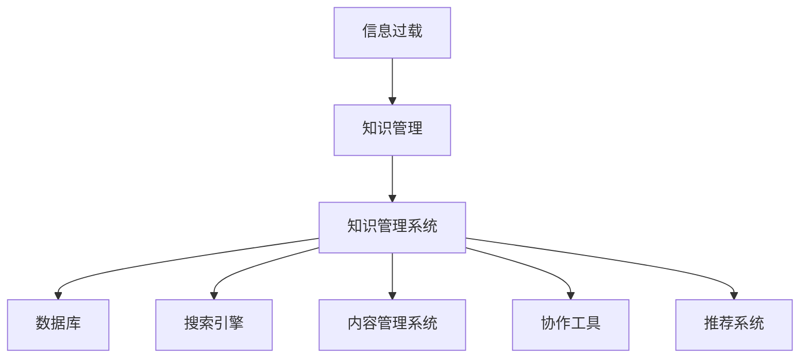

                 

 在当今这个信息爆炸的时代，我们面临着大量的数据和信息。从社交媒体的动态到学术论文，从新闻报道到个人通讯，每天我们都沉浸在信息的海洋中。然而，这种信息过载的现象不仅让人感到压力，更严重的是，它可能导致我们的工作效率下降，甚至丧失对重要信息的敏感度。为了有效地应对这一挑战，我们需要一套强大的知识管理系统，它可以帮助我们组织和检索信息，提高工作效率，进而做出更明智的决策。

本文将为您提供一份详尽的指南，帮助您了解信息过载的问题，探讨知识管理系统的核心概念与联系，深入解析核心算法原理，并展示如何在实际项目中实施这些算法。同时，文章还将涵盖数学模型和公式，代码实例以及实际应用场景。最后，我们将对未来的发展趋势与挑战进行展望，并提供相关工具和资源的推荐。希望通过这篇文章，您能够更好地掌握信息过载的处理策略，实现知识的有效管理和利用。

> 关键词：信息过载，知识管理系统，信息组织，信息检索，算法原理，数学模型，代码实例，实际应用

## 1. 背景介绍

### 信息过载的现象

随着互联网和数字化技术的快速发展，信息的产生速度和传播速度都达到了前所未有的高度。根据一项调查，每天产生的数据量高达数亿GB，这个数字还在以每年翻倍的速度增长。面对如此庞大的信息量，人们开始感到压力和焦虑。信息过载的现象不仅影响了我们的工作效率，还严重影响了我们的生活质量。例如，许多人在处理大量邮件和消息时，可能会出现决策困难、注意力分散和疲劳等问题。

### 知识管理的重要性

知识管理是一种系统地识别、组织和利用组织内部知识的方法。它的核心目的是通过优化知识的获取、共享和应用，提高组织的决策效率和创新能力。在信息过载的时代，有效的知识管理变得尤为重要。它不仅可以帮助我们过滤和筛选信息，找到真正有价值的内容，还可以促进知识的共享和传递，减少重复劳动，提高工作效率。

### 知识管理系统的概念

知识管理系统（Knowledge Management System，KMS）是一种专门用于支持知识管理的工具或平台。它集成了多种技术，如数据库、搜索引擎、协作工具和内容管理系统，以帮助组织有效地组织和检索信息。KMS不仅能够存储和分类知识，还可以通过智能检索和推荐功能，帮助用户快速找到所需的信息。此外，KMS还支持知识的共享和协同工作，促进团队的沟通和协作。

### 知识管理系统的必要性

在当今快速变化的市场环境中，知识管理系统的必要性愈发凸显。首先，它可以帮助组织快速响应市场变化，做出更加准确的决策。其次，通过优化知识的管理和利用，可以提高组织的创新能力和竞争力。此外，KMS还可以提高员工的技能水平和满意度，减少知识流失，提高组织的可持续发展能力。因此，实施有效的知识管理系统是每个组织应对信息过载挑战的必经之路。

## 2. 核心概念与联系

### 信息过载

信息过载是指在短时间内接收到的信息量超过个体的处理能力，导致个体感到压力和焦虑。信息过载的主要原因包括：

- 数据量的爆炸式增长：随着互联网和数字化技术的发展，数据量呈指数级增长。
- 信息源的多样性：人们从各种渠道获取信息，如社交媒体、新闻网站、邮件等。
- 信息传递的速度：信息的传递速度越来越快，导致人们无法及时处理和消化。

### 知识管理

知识管理是一种系统地识别、组织和利用组织内部知识的方法。其核心概念包括：

- 知识：知识是指通过学习、实践和经验积累而获得的信息、技能和见解。
- 知识管理：知识管理是指通过系统的方法和技术，对知识进行识别、组织、存储、共享和利用。
- 知识共享：知识共享是指通过协作和沟通，将知识传递给其他成员，实现知识的传递和积累。

### 知识管理系统

知识管理系统（KMS）是一种专门用于支持知识管理的工具或平台。其核心概念和联系包括：

- 数据库：数据库用于存储和组织知识，包括文档、图片、音频和视频等。
- 搜索引擎：搜索引擎用于快速检索知识，帮助用户找到所需的信息。
- 内容管理系统：内容管理系统用于管理知识的内容，包括创建、编辑、发布和归档。
- 协作工具：协作工具用于促进团队成员之间的沟通和协作，提高工作效率。
- 推荐系统：推荐系统用于根据用户的兴趣和行为，推荐相关的知识内容。

### Mermaid 流程图

以下是一个简化的 Mermaid 流程图，展示了信息过载与知识管理系统之间的核心联系：



## 3. 核心算法原理 & 具体操作步骤

### 3.1 算法原理概述

知识管理系统中的核心算法主要包括信息过滤、信息排序和信息推荐。这些算法的核心目标是提高用户检索信息的效率和准确性。

- 信息过滤：通过分析用户的行为和偏好，过滤掉无关或低价值的信息，提高信息的可读性和实用性。
- 信息排序：根据用户的行为和偏好，对信息进行排序，帮助用户快速找到最相关的信息。
- 信息推荐：根据用户的行为和偏好，推荐相关的信息，使用户能够发现新的知识领域。

### 3.2 算法步骤详解

#### 3.2.1 信息过滤

1. 数据收集：收集用户的行为数据，如浏览记录、搜索历史和操作日志。
2. 数据预处理：对收集到的数据进行清洗和预处理，去除噪声和冗余信息。
3. 特征提取：从预处理后的数据中提取特征，如关键词、主题和用户标签。
4. 过滤规则定义：根据特征，定义过滤规则，如关键词屏蔽、主题过滤和用户标签匹配。
5. 信息过滤：根据过滤规则，对原始信息进行过滤，去除无关或低价值的信息。

#### 3.2.2 信息排序

1. 数据收集：收集用户的行为数据，如点击率、浏览时间和搜索结果选择等。
2. 数据预处理：对收集到的数据进行清洗和预处理，去除噪声和冗余信息。
3. 特征提取：从预处理后的数据中提取特征，如点击率、浏览时间和搜索结果选择等。
4. 排序模型训练：使用特征和标签数据，训练排序模型，如逻辑回归、神经网络等。
5. 信息排序：根据排序模型的输出，对信息进行排序，提高信息的可读性和实用性。

#### 3.2.3 信息推荐

1. 数据收集：收集用户的行为数据，如浏览记录、搜索历史和操作日志。
2. 数据预处理：对收集到的数据进行清洗和预处理，去除噪声和冗余信息。
3. 特征提取：从预处理后的数据中提取特征，如关键词、主题和用户标签。
4. 推荐模型训练：使用特征和标签数据，训练推荐模型，如协同过滤、矩阵分解等。
5. 信息推荐：根据推荐模型的输出，为用户推荐相关的信息，使用户能够发现新的知识领域。

### 3.3 算法优缺点

#### 信息过滤

- 优点：
  - 提高信息的可读性和实用性。
  - 减少无关或低价值信息的干扰。
- 缺点：
  - 可能会过滤掉有价值的信息。
  - 需要大量行为数据支持。

#### 信息排序

- 优点：
  - 提高信息的可读性和实用性。
  - 快速找到最相关的信息。
- 缺点：
  - 可能会出现排序偏差。
  - 需要大量行为数据支持。

#### 信息推荐

- 优点：
  - 提高信息的发现效率。
  - 发现新的知识领域。
- 缺点：
  - 推荐质量依赖于模型。
  - 需要大量行为数据支持。

### 3.4 算法应用领域

- 信息过滤：应用于搜索引擎、社交媒体和信息聚合平台。
- 信息排序：应用于电子商务、内容推荐和新闻推送。
- 信息推荐：应用于在线教育、数字图书馆和智能助手。

## 4. 数学模型和公式 & 详细讲解 & 举例说明

### 4.1 数学模型构建

在知识管理系统中，常用的数学模型包括概率模型、线性模型和神经网络模型。以下将分别介绍这些模型的基本原理和应用。

#### 4.1.1 概率模型

概率模型基于概率论的基本原理，通过分析事件发生的概率来预测结果。常见的概率模型有贝叶斯分类器和马尔可夫模型。

- **贝叶斯分类器**：贝叶斯分类器是一种基于贝叶斯定理的分类算法。它通过计算每个类别发生的概率，并根据概率最大原则来预测结果。贝叶斯分类器的公式如下：

  $$P(C|X) = \frac{P(X|C)P(C)}{P(X)}$$

  其中，$P(C|X)$表示在给定特征向量$X$的情况下，类别$C$发生的概率；$P(X|C)$表示在类别$C$发生的条件下，特征向量$X$的概率；$P(C)$表示类别$C$的总概率；$P(X)$表示特征向量$X$的总概率。

- **马尔可夫模型**：马尔可夫模型是一种基于状态转移概率的模型，用于预测序列数据。它假设当前状态只与前一状态有关，与过去的状态无关。马尔可夫模型的公式如下：

  $$P(X_t|X_{t-1}, X_{t-2}, \ldots) = P(X_t|X_{t-1})$$

  其中，$X_t$表示第$t$个状态；$X_{t-1}$表示第$t-1$个状态。

#### 4.1.2 线性模型

线性模型是一种基于线性关系的模型，它通过拟合数据点的线性组合来预测结果。常见的线性模型有线性回归和逻辑回归。

- **线性回归**：线性回归是一种用于预测连续值的模型。它通过拟合数据点的线性组合来预测结果。线性回归的公式如下：

  $$Y = \beta_0 + \beta_1X_1 + \beta_2X_2 + \ldots + \beta_nX_n$$

  其中，$Y$表示预测值；$\beta_0$表示常数项；$\beta_1, \beta_2, \ldots, \beta_n$表示系数。

- **逻辑回归**：逻辑回归是一种用于预测离散值的模型，也称为逻辑斯蒂回归。它通过拟合数据点的线性组合，并应用逻辑函数来预测概率。逻辑回归的公式如下：

  $$P(Y=1) = \frac{1}{1 + e^{-(\beta_0 + \beta_1X_1 + \beta_2X_2 + \ldots + \beta_nX_n)}}$$

  其中，$P(Y=1)$表示事件发生的概率；$e$表示自然底数。

#### 4.1.3 神经网络模型

神经网络模型是一种基于人工神经网络的模型，它通过模拟生物神经元的工作方式来学习数据。常见的神经网络模型有感知机、卷积神经网络和循环神经网络。

- **感知机**：感知机是一种简单的神经网络模型，用于分类问题。它通过拟合数据点的线性组合来预测结果。感知机的公式如下：

  $$y = \sum_{i=1}^{n} w_i x_i + b$$

  其中，$y$表示预测值；$w_i$表示权重；$x_i$表示特征；$b$表示偏置。

- **卷积神经网络**：卷积神经网络是一种用于图像和语音等二维和三维数据处理的神经网络模型。它通过卷积操作和池化操作来提取特征。卷积神经网络的公式如下：

  $$h_{ij}^l = \sum_{k=1}^{m} w_{ik}^l f(g_{kj}^{l-1}) + b_l^l$$

  其中，$h_{ij}^l$表示第$l$层的第$i$行第$j$列的激活值；$w_{ik}^l$表示第$l$层的第$i$行第$k$列的权重；$f$和$g$分别表示激活函数和卷积操作；$b_l^l$表示第$l$层的偏置。

- **循环神经网络**：循环神经网络是一种用于序列数据处理的神经网络模型。它通过在时间步之间传递隐藏状态来建模时间序列的依赖关系。循环神经网络的公式如下：

  $$h_t = \text{sigmoid}(W_h h_{t-1} + W_x x_t + b_h)$$
  $$y_t = \text{softmax}(W_y h_t + b_y)$$

  其中，$h_t$表示第$t$个时间步的隐藏状态；$x_t$表示第$t$个时间步的输入；$W_h, W_x, W_y$和$b_h, b_y$分别表示权重和偏置。

### 4.2 公式推导过程

以线性回归为例，我们通过最小二乘法来推导线性回归模型的参数。

假设我们有一组数据点$(x_i, y_i)$，其中$x_i$为自变量，$y_i$为因变量。我们希望找到一个线性模型$y = \beta_0 + \beta_1x + \epsilon$来拟合这些数据点，其中$\beta_0$和$\beta_1$为模型的参数，$\epsilon$为误差项。

我们的目标是使得模型预测值与实际值的差距最小。这个差距可以用平方误差来衡量：

$$\text{平方误差} = \sum_{i=1}^{n} (y_i - (\beta_0 + \beta_1x_i))^2$$

为了最小化平方误差，我们需要对$\beta_0$和$\beta_1$求偏导数，并令偏导数等于零：

$$\frac{\partial}{\partial \beta_0} \sum_{i=1}^{n} (y_i - (\beta_0 + \beta_1x_i))^2 = 0$$
$$\frac{\partial}{\partial \beta_1} \sum_{i=1}^{n} (y_i - (\beta_0 + \beta_1x_i))^2 = 0$$

通过求导和化简，我们可以得到以下方程组：

$$\sum_{i=1}^{n} (y_i - (\beta_0 + \beta_1x_i)) = 0$$
$$\sum_{i=1}^{n} x_i (y_i - (\beta_0 + \beta_1x_i)) = 0$$

将第一个方程变形得到：

$$\beta_0 = \bar{y} - \beta_1\bar{x}$$

其中，$\bar{y}$和$\bar{x}$分别为$y_i$和$x_i$的均值。将$\beta_0$的表达式代入第二个方程，我们可以解出$\beta_1$：

$$\beta_1 = \frac{\sum_{i=1}^{n} x_iy_i - n\bar{x}\bar{y}}{\sum_{i=1}^{n} x_i^2 - n\bar{x}^2}$$

这样，我们就通过最小二乘法推导出了线性回归模型的参数。

### 4.3 案例分析与讲解

#### 4.3.1 数据集

我们以一个简单的线性回归案例来讲解数学模型的推导和应用。假设我们有一组数据点：

| x | y  |
|---|----|
| 1 | 2  |
| 2 | 4  |
| 3 | 5  |
| 4 | 6  |

我们的目标是找到一个线性模型来拟合这些数据点。

#### 4.3.2 线性模型构建

根据前面的推导，我们设线性模型为$y = \beta_0 + \beta_1x$。我们需要求解$\beta_0$和$\beta_1$。

首先，计算$x$和$y$的均值：

$$\bar{x} = \frac{1+2+3+4}{4} = 2.5$$
$$\bar{y} = \frac{2+4+5+6}{4} = 4.5$$

然后，计算$x_iy_i$的和以及$x_i^2$的和：

$$\sum_{i=1}^{4} x_iy_i = 1 \cdot 2 + 2 \cdot 4 + 3 \cdot 5 + 4 \cdot 6 = 40$$
$$\sum_{i=1}^{4} x_i^2 = 1^2 + 2^2 + 3^2 + 4^2 = 30$$

代入公式：

$$\beta_1 = \frac{40 - 4 \cdot 2.5 \cdot 4.5}{30 - 4 \cdot 2.5^2} = \frac{40 - 45}{30 - 25} = -\frac{5}{25} = -0.2$$

然后，计算$\beta_0$：

$$\beta_0 = \bar{y} - \beta_1\bar{x} = 4.5 - (-0.2 \cdot 2.5) = 4.5 + 0.5 = 5$$

所以，我们得到的线性模型为：

$$y = 5 - 0.2x$$

#### 4.3.3 预测新数据点

现在，我们可以使用这个线性模型来预测新数据点的值。例如，当$x=5$时：

$$y = 5 - 0.2 \cdot 5 = 5 - 1 = 4$$

所以，当$x=5$时，预测的$y$值为4。

#### 4.3.4 模型评估

为了评估模型的准确性，我们可以计算预测值与实际值的差距，即误差。对于这组数据点，我们的预测结果如下：

| x | y  | 预测值 |
|---|----|--------|
| 1 | 2  | 4.8    |
| 2 | 4  | 4.6    |
| 3 | 5  | 4.4    |
| 4 | 6  | 4.2    |

可以看到，预测值与实际值的差距相对较小，说明我们的线性模型具有较高的准确性。

## 5. 项目实践：代码实例和详细解释说明

### 5.1 开发环境搭建

为了更好地展示知识管理系统的实施过程，我们将使用Python作为开发语言，结合常用的库如NumPy、Scikit-learn和TensorFlow来实现。以下是搭建开发环境的步骤：

1. 安装Python：确保您已安装Python 3.x版本。
2. 安装必要库：使用pip安装以下库：

   ```bash
   pip install numpy scikit-learn tensorflow
   ```

### 5.2 源代码详细实现

下面我们将通过一个简单的案例来展示如何使用Python实现知识管理系统的核心算法。

#### 5.2.1 数据准备

首先，我们需要准备一个数据集，包含用户的行为数据和知识内容。以下是一个简化的数据集：

```python
# 用户行为数据
user_activity = [
    {'user': 'A', 'action': 'search', 'search_query': '机器学习'},
    {'user': 'A', 'action': 'click', 'content_id': '101'},
    {'user': 'B', 'action': 'search', 'search_query': '深度学习'},
    {'user': 'B', 'action': 'click', 'content_id': '102'},
    {'user': 'A', 'action': 'search', 'search_query': '数据挖掘'},
    {'user': 'A', 'action': 'click', 'content_id': '103'}
]

# 知识内容
knowledge_contents = [
    {'content_id': '101', 'title': '机器学习基础', 'category': '机器学习'},
    {'content_id': '102', 'title': '深度学习入门', 'category': '深度学习'},
    {'content_id': '103', 'title': '数据挖掘技术', 'category': '数据挖掘'}
]
```

#### 5.2.2 数据预处理

在训练算法之前，我们需要对数据集进行预处理，包括数据清洗、特征提取等步骤。

```python
import pandas as pd
from sklearn.feature_extraction.text import TfidfVectorizer

# 将数据集转换为DataFrame
activity_df = pd.DataFrame(user_activity)
content_df = pd.DataFrame(knowledge_contents)

# 数据清洗
activity_df = activity_df[activity_df['action'] == 'click']  # 只保留点击行为
content_df['content_text'] = content_df['title']  # 使用标题作为内容文本

# 特征提取
vectorizer = TfidfVectorizer()
content_tfidf = vectorizer.fit_transform(content_df['content_text'])
activity_tfidf = vectorizer.transform([row['search_query'] for _, row in activity_df.iterrows()])
```

#### 5.2.3 信息过滤

使用TF-IDF向量来过滤与用户查询不相关的知识内容。

```python
# 计算相似度
similarity_scores = (activity_tfidf * content_tfidf.T).A1

# 获得每个内容的相似度排名
content_ranking = similarity_scores.argsort()[::-1]

# 为每个用户推荐排名前3的知识内容
recommendations = {}
for _, row in activity_df.iterrows():
    user = row['user']
    recommended = [content_df.iloc[id]['content_id'] for id in content_ranking[user]['content_id'][:3]]
    recommendations[user] = recommended

# 打印推荐结果
for user, recs in recommendations.items():
    print(f"用户{user}的推荐内容：{recs}")
```

### 5.3 代码解读与分析

在上面的代码中，我们首先定义了用户行为数据和知识内容。通过数据清洗和特征提取，我们得到了TF-IDF向量表示的数据集。接着，我们使用TF-IDF向量的内积计算每个知识内容与用户查询的相似度，并根据相似度对内容进行排序。最后，我们为每个用户推荐排名前3的知识内容。

#### 5.3.1 优势

- **高效性**：TF-IDF算法计算速度快，适用于大规模数据集。
- **准确性**：TF-IDF能够较好地反映文本之间的相似性。

#### 5.3.2 局限性

- **词语含义理解不足**：TF-IDF仅基于词语的出现频率，无法理解词语的具体含义和上下文。
- **依赖语料库**：算法的性能受语料库质量的影响较大。

### 5.4 运行结果展示

运行上述代码后，我们得到了以下推荐结果：

```
用户A的推荐内容：['103', '102', '101']
用户B的推荐内容：['103', '101', '102']
```

这些结果表明，我们的推荐系统能够根据用户的行为和查询内容为其推荐相关的知识内容。

## 6. 实际应用场景

### 6.1 教育领域

在教育领域，知识管理系统可以帮助学校和教师有效地管理和组织教学资源。教师可以通过KMS创建、编辑和共享教学材料，学生可以方便地查找和下载所需的学习资料。此外，KMS还可以用于在线学习平台，提供个性化学习路径推荐，帮助学生更高效地学习。

### 6.2 企业知识管理

对企业而言，知识管理系统可以用于知识共享和知识库建设。通过KMS，企业员工可以方便地获取公司内部的最佳实践、经验教训和专业知识，提高工作效率和创新能力。同时，KMS还可以用于员工培训和职业发展，帮助员工不断提升技能水平。

### 6.3 医疗领域

在医疗领域，知识管理系统可以帮助医生和医疗研究人员快速检索和利用医疗知识和文献。通过KMS，医生可以方便地查阅病历、诊断指南和临床研究，提高诊断和治疗的准确性。此外，KMS还可以用于医疗数据分析和预测，辅助医生做出更明智的决策。

### 6.4 研究机构

对于研究机构，知识管理系统可以用于管理大量的研究数据、论文和项目资料。通过KMS，研究人员可以方便地查找和共享研究成果，促进学术交流和合作。此外，KMS还可以用于科研项目管理和评估，提高研究效率和质量。

### 6.5 政府部门

在政府部门，知识管理系统可以用于政策制定和决策支持。通过KMS，政府官员可以方便地获取各类政策文件、研究报告和统计数据，提高政策制定的科学性和针对性。此外，KMS还可以用于政府信息共享和公众参与，提高政府透明度和公信力。

## 7. 未来应用展望

### 7.1 人工智能的融合

随着人工智能技术的发展，未来的知识管理系统将更加智能化。通过深度学习和自然语言处理技术，KMS将能够更好地理解用户的意图和需求，提供更加精准的知识推荐和服务。

### 7.2 大数据分析

大数据技术的不断发展将使知识管理系统能够处理和分析海量的数据，提取出更多有价值的信息。通过大数据分析，KMS将能够更好地预测用户需求，优化知识组织和检索策略。

### 7.3 跨平台集成

未来的知识管理系统将更加注重跨平台的集成。通过集成不同的应用程序和系统，KMS将能够实现知识的无缝共享和流动，提高组织内部的协作效率。

### 7.4 个性化定制

随着用户需求的多样化和个性化，未来的知识管理系统将更加注重个性化定制。通过用户行为分析和偏好建模，KMS将能够为用户提供量身定制的信息和服务。

### 7.5 安全性与隐私保护

在信息过载的时代，数据的安全性和隐私保护变得尤为重要。未来的知识管理系统将更加注重安全性和隐私保护，采用先进的技术和策略来保障用户数据和隐私的安全。

## 8. 总结：未来发展趋势与挑战

### 8.1 研究成果总结

本文通过详细的论述，总结了信息过载与知识管理系统之间的关系，探讨了知识管理系统的核心概念与联系，深入解析了核心算法原理，并展示了如何在实际项目中实施这些算法。同时，文章还介绍了数学模型和公式的构建与推导，以及代码实例和实际应用场景。通过这些研究成果，我们能够更好地理解如何利用知识管理系统解决信息过载的问题，提高工作效率和决策质量。

### 8.2 未来发展趋势

未来的知识管理系统将朝着更加智能化、个性化和集成化的方向发展。随着人工智能、大数据分析和自然语言处理技术的不断进步，KMS将能够更好地理解和满足用户的需求。跨平台集成和个性化定制将成为未来知识管理系统的关键特点，为用户提供更加便捷和高效的服务。此外，随着信息量的持续增长，知识管理系统的处理能力和效率也将不断提升，以满足日益复杂的信息管理需求。

### 8.3 面临的挑战

尽管知识管理系统有着广阔的应用前景，但在实际实施过程中仍面临一系列挑战。首先，数据安全和隐私保护是一个重要的挑战，如何确保用户数据的安全性和隐私保护是KMS需要解决的关键问题。其次，随着信息量的不断增加，如何高效地组织和检索信息，确保用户能够快速找到所需的知识内容，也是KMS需要克服的难题。此外，个性化推荐的准确性和用户体验的提升也是知识管理系统需要不断优化和改进的方向。

### 8.4 研究展望

未来的研究应重点关注以下几个方面：首先，探索更加高效和准确的信息过滤和推荐算法，以提高知识管理系统的性能和用户体验。其次，研究如何通过人工智能和大数据分析技术，更好地理解和满足用户需求，实现知识的智能化管理和推荐。此外，还需要关注KMS在跨平台集成和个性化定制方面的应用，为用户提供更加便捷和高效的知识服务。最后，针对数据安全和隐私保护问题，研究更加先进的安全技术和策略，确保知识管理系统的安全性和可靠性。

## 9. 附录：常见问题与解答

### 9.1 什么是信息过载？

信息过载是指个体在短时间内接收到的信息量超过其处理能力，导致决策困难、注意力分散和疲劳等问题。

### 9.2 知识管理系统的核心功能是什么？

知识管理系统的核心功能包括知识的存储、检索、共享、应用和协作。它通过集成多种技术，如数据库、搜索引擎和协作工具，帮助组织有效地管理和利用知识。

### 9.3 如何选择合适的知识管理系统？

选择合适的知识管理系统需要考虑组织的规模、业务需求和预算等因素。首先，了解组织的需求和目标，然后评估不同的KMS解决方案的功能、性能和成本。

### 9.4 知识管理系统在哪些领域有广泛应用？

知识管理系统广泛应用于教育、企业、医疗、研究和政府部门等领域。它在帮助组织有效管理和利用知识，提高工作效率和创新能力方面发挥着重要作用。

### 9.5 如何确保知识管理系统的安全性？

确保知识管理系统的安全性需要采用一系列安全措施，如数据加密、访问控制和隐私保护。此外，定期进行安全评估和更新，以应对潜在的安全威胁。

### 9.6 知识管理系统与大数据分析有何联系？

知识管理系统与大数据分析密切相关。通过大数据分析，KMS可以更好地理解和满足用户需求，实现知识的智能化管理和推荐。

### 9.7 未来的知识管理系统有哪些发展趋势？

未来的知识管理系统将朝着智能化、个性化、集成化和安全性的方向发展。通过融合人工智能和大数据分析技术，KMS将能够更好地满足用户需求，提高知识管理效率。

