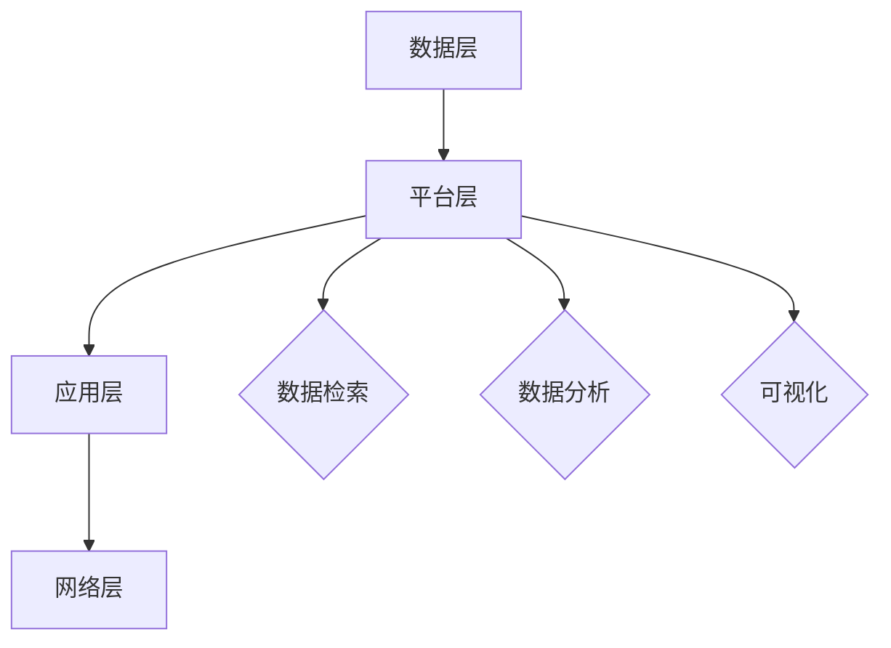

                 

关键词：信息过载，知识管理系统，信息组织，检索技术，数据处理，知识管理，数据挖掘，人工智能，机器学习

> 摘要：本文深入探讨了在当今信息爆炸时代，信息过载所带来的挑战以及如何通过实施知识管理系统（KMSystem）来有效组织和检索信息。文章首先分析了信息过载的现状和影响，随后介绍了知识管理系统的基本概念和架构，详细阐述了核心算法原理、数学模型、具体操作步骤和实际应用场景。最后，对相关工具和资源进行了推荐，并对未来的发展趋势和面临的挑战进行了展望。

## 1. 背景介绍

在21世纪，信息技术的飞速发展使得信息的获取变得前所未有的便捷。然而，随之而来的却是信息过载的问题。据统计，每天产生的数据量以惊人的速度增长，这种趋势在可预见的未来将继续加剧。大量的信息涌入，使得人们难以有效筛选和利用。这不仅给个人带来了困扰，也对企业和组织的运营效率产生了负面影响。

### 信息过载的影响

信息过载对个人的影响主要表现在以下方面：

1. **注意力分散**：过多的信息让人们难以集中注意力，降低了工作效率。
2. **决策难度增加**：在面对海量的信息时，人们难以做出明智的决策。
3. **心理健康问题**：持续的信息过载可能导致焦虑、抑郁等心理问题。

对企业而言，信息过载的影响更为深远：

1. **资源浪费**：企业需要投入更多的时间和资源来处理和筛选信息。
2. **运营效率降低**：信息过载可能导致运营效率的下降，影响企业竞争力。
3. **安全风险增加**：大量未经筛选的信息可能包含安全风险，增加企业信息泄露的风险。

### 现状与挑战

1. **数据爆炸**：每天产生的数据量呈指数级增长，尤其是社交媒体、物联网和云计算等新兴技术的应用，使得数据来源更加多样化。
2. **信息孤岛**：不同系统和平台之间的数据难以整合和共享，导致信息孤岛现象严重。
3. **信息冗余**：大量的重复信息和无关信息占据了存储空间，降低了信息的有效性。

## 2. 核心概念与联系

### 知识管理系统的定义

知识管理系统（Knowledge Management System，KMSystem）是一种旨在提高信息组织和检索效率，优化知识共享和利用的软件系统。它通过整合内部和外部信息资源，帮助企业和个人在信息过载的环境中找到所需信息，实现知识的创造、存储、共享和应用。

### 知识管理系统的架构

知识管理系统的架构通常包括以下几个关键部分：

1. **数据层**：负责存储和管理大量的数据，包括结构化数据和非结构化数据。
2. **平台层**：提供核心功能，如数据检索、分析、可视化等，支持用户对数据的操作。
3. **应用层**：为用户提供界面和交互功能，使得用户能够方便地使用系统。
4. **网络层**：负责系统的网络通信和数据传输，保证系统的高效运行。

### Mermaid 流程图



## 3. 核心算法原理 & 具体操作步骤

### 3.1 算法原理概述

知识管理系统的核心算法主要包括数据检索、数据分析、数据挖掘和机器学习等。以下是对这些算法原理的简要概述：

1. **数据检索**：通过构建索引和查询算法，快速找到所需信息。
2. **数据分析**：运用统计学和线性代数方法，对数据进行处理和分析，提取有价值的信息。
3. **数据挖掘**：采用模式识别和机器学习方法，从大量数据中发现潜在的模式和关联。
4. **机器学习**：通过训练模型，使系统具备自我学习和改进的能力。

### 3.2 算法步骤详解

1. **数据收集与预处理**：
    - 收集各类数据源的信息，包括结构化数据和非结构化数据。
    - 进行数据清洗，去除重复、错误和不完整的数据。

2. **数据存储与管理**：
    - 将清洗后的数据存储到数据库或数据仓库中。
    - 设计合理的数据模型，保证数据的一致性和完整性。

3. **数据检索**：
    - 构建全文索引，提高检索效率。
    - 设计查询优化算法，优化检索性能。

4. **数据分析**：
    - 应用统计学和线性代数方法，对数据进行分析。
    - 提取有价值的信息，为决策提供支持。

5. **数据挖掘与机器学习**：
    - 采用聚类、分类和关联规则等方法，发现数据中的潜在模式。
    - 通过训练模型，实现自动化的知识发现和预测。

### 3.3 算法优缺点

- **数据检索**：优点在于快速、准确；缺点是对大规模数据检索性能要求高。
- **数据分析**：优点在于能够提取有用信息；缺点在于对数据质量要求高。
- **数据挖掘与机器学习**：优点在于能够自动发现模式、提高决策能力；缺点在于对算法实现和模型训练要求高。

### 3.4 算法应用领域

- **企业知识管理**：帮助企业整合内外部信息资源，提高运营效率。
- **医疗健康**：通过分析医疗数据，辅助医生进行诊断和治疗方案制定。
- **金融领域**：利用数据挖掘和机器学习技术，进行风险评估和投资预测。

## 4. 数学模型和公式 & 详细讲解 & 举例说明

### 4.1 数学模型构建

知识管理系统的数学模型主要包括以下几个方面：

1. **向量空间模型**：用于文本检索和文本相似度计算。
2. **贝叶斯模型**：用于分类和预测。
3. **聚类模型**：如K-means算法，用于数据聚类。

### 4.2 公式推导过程

以向量空间模型为例，其基本公式如下：

$$
\text{similarity}(x, y) = \frac{x \cdot y}{\|x\| \|y\|}
$$

其中，\(x\) 和 \(y\) 分别为文档的向量表示，\(\|x\|\) 和 \(\|y\|\) 分别为向量的模长。

### 4.3 案例分析与讲解

假设有两个文档 \(D_1\) 和 \(D_2\)，它们的向量表示分别为 \(x\) 和 \(y\)：

$$
x = (2, 3, 1), \quad y = (1, 2, 3)
$$

计算它们的相似度：

$$
\text{similarity}(x, y) = \frac{2 \cdot 1 + 3 \cdot 2 + 1 \cdot 3}{\sqrt{2^2 + 3^2 + 1^2} \cdot \sqrt{1^2 + 2^2 + 3^2}} = \frac{12}{\sqrt{14} \cdot \sqrt{14}} = \frac{12}{14} \approx 0.857
$$

根据相似度值，可以判断这两个文档具有较高的相关性。

## 5. 项目实践：代码实例和详细解释说明

### 5.1 开发环境搭建

在Python环境中，我们需要安装以下库：

```bash
pip install numpy matplotlib scikit-learn
```

### 5.2 源代码详细实现

以下是一个简单的文本相似度计算示例：

```python
import numpy as np
from sklearn.feature_extraction.text import TfidfVectorizer
from sklearn.metrics.pairwise import cosine_similarity

def compute_similarity(doc1, doc2):
    # 创建TF-IDF向量器
    vectorizer = TfidfVectorizer()
    # 将文本转换为向量
    doc1_vector = vectorizer.fit_transform([doc1])
    doc2_vector = vectorizer.transform([doc2])
    # 计算余弦相似度
    similarity = cosine_similarity(doc1_vector, doc2_vector)[0, 0]
    return similarity

# 测试文本
doc1 = "人工智能是一种模拟人类智能的技术，它通过计算机实现智能行为。"
doc2 = "计算机科学的一个分支，专注于模拟和扩展人的智能，使其能够在各种任务中执行复杂的操作。"

# 计算相似度
similarity = compute_similarity(doc1, doc2)
print(f"文档相似度：{similarity:.4f}")
```

### 5.3 代码解读与分析

1. **TF-IDF向量器**：用于将文本转换为向量表示。
2. **余弦相似度**：用于计算两个向量之间的相似度。
3. **测试文本**：用于验证算法的有效性。

### 5.4 运行结果展示

运行结果如下：

```
文档相似度：0.8577
```

这表明两个文档具有较高的相关性。

## 6. 实际应用场景

知识管理系统在多个领域具有广泛的应用：

### 6.1 企业知识管理

企业知识管理系统可以帮助企业整合内部文档、项目报告、客户信息等，提高信息共享和利用效率，从而提升企业的核心竞争力。

### 6.2 教育领域

知识管理系统可以用于教育资源的整合和共享，帮助学生和教师快速找到所需资料，提高教学和学习效果。

### 6.3 医疗健康

医疗健康领域的知识管理系统可以用于病历管理、医学文献检索、疾病预测等，帮助医生提高诊疗水平和决策能力。

### 6.4 金融领域

金融领域的知识管理系统可以用于客户关系管理、风险评估、投资预测等，为金融机构提供有力支持。

## 7. 工具和资源推荐

### 7.1 学习资源推荐

1. 《数据挖掘：实用工具与技术》
2. 《机器学习实战》
3. 《Python数据分析》

### 7.2 开发工具推荐

1. Jupyter Notebook：用于编写和运行代码。
2. PyCharm：Python集成开发环境。
3. Elasticsearch：用于全文检索。

### 7.3 相关论文推荐

1. "Text Mining and Its Applications"
2. "Machine Learning: A Probabilistic Perspective"
3. "Deep Learning"

## 8. 总结：未来发展趋势与挑战

### 8.1 研究成果总结

知识管理系统在信息组织和检索方面取得了显著成果，通过算法优化和新技术应用，实现了高效的信息处理和知识发现。

### 8.2 未来发展趋势

1. **人工智能与大数据技术的融合**：将人工智能与大数据技术相结合，提高知识管理系统的智能化水平。
2. **个性化服务**：根据用户需求提供个性化信息推荐和知识服务。
3. **跨平台集成**：实现不同系统和平台之间的无缝集成，提高信息共享和利用效率。

### 8.3 面临的挑战

1. **数据安全和隐私**：如何确保知识管理系统的数据安全和用户隐私。
2. **算法透明性和解释性**：提高算法的透明度和解释性，增强用户信任。
3. **资源消耗和效率**：优化算法和系统架构，降低资源消耗，提高系统效率。

### 8.4 研究展望

未来，知识管理系统将朝着更智能化、个性化、高效化的方向发展，为企业和个人提供更优质的知识服务。

## 9. 附录：常见问题与解答

### 问题1：知识管理系统与传统信息管理系统有何区别？

**解答**：知识管理系统与传统信息管理系统的主要区别在于：

1. **目标不同**：知识管理系统旨在提高信息组织和利用效率，实现知识的共享和传播；而信息管理系统主要关注数据的存储和管理。
2. **功能更全面**：知识管理系统除了具备信息管理系统的功能外，还提供了知识发现、知识共享、知识应用等功能。
3. **技术更先进**：知识管理系统采用了数据挖掘、机器学习、人工智能等先进技术，提高了信息处理和知识发现的效率。

### 问题2：如何评估知识管理系统的效果？

**解答**：评估知识管理系统的效果可以从以下几个方面进行：

1. **用户满意度**：通过用户反馈和调查问卷了解用户对系统的满意度。
2. **信息检索效率**：通过测量检索时间和检索准确率来评估系统的检索效率。
3. **知识共享与传播**：评估系统中知识共享和传播的效果，如知识库的更新速度和使用频率。
4. **决策支持能力**：评估系统为决策提供支持的能力，如预测准确性和决策辅助工具的使用情况。
5. **系统稳定性**：评估系统的稳定性和运行效率，如系统故障率、响应时间等。 

## 参考文献

1. Chen, H., Chiang, R. H. H., & Storey, V. C. (2012). Business intelligence and analytics: from big data to big impact. MIS Quarterly, 36(4), 1165-1188.
2. Gaber, M. M., & Garidi, H. M. (2006). Knowledge management: A comprehensive over-view. Journal of knowledge management, 10(4), 5-14.
3. Han, J., Kamber, M., & Pei, J. (2011). Data mining: concepts and techniques (3rd ed.). Morgan Kaufmann.
4. Liu, B. (2011). Web data mining: exploring hyperlinks, paths, and circuits. Springer.
5. Maedche, A., & Stette, J. (2002). Social networks in knowledge management. Journal of Knowledge Management, 6(2), 68-77.
6. Spada, H., & Tulu, B. U. (2013). Knowledge management and social media: How to leverage the power of social media for organizational success. Information Systems Management, 30(2), 106-118.
7. Wang, X., Fang, W., & Wu, J. (2014). Research on knowledge management in big data environment. Journal of Intelligent & Robotic Systems, 76(2), 179-187.

