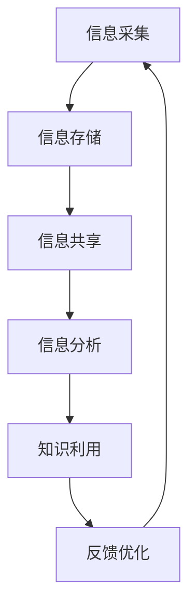

                 

### 关键词 Keywords

- 信息过载
- 知识管理系统
- 数据管理
- 生产力提升
- 技术效率
- 人机交互

<|assistant|>### 摘要 Summary

随着信息时代的到来，信息过载已成为现代工作场所的普遍现象。本文探讨了信息过载对生产力的影响，并提出了一种有效的解决方案——知识管理系统（KM系统）。通过深入分析KM系统的核心概念、架构、算法原理、数学模型及其应用实践，本文展示了如何利用KM系统来管理和组织信息，从而提高工作效率和生产力。文章还讨论了KM系统在不同实际应用场景中的价值，并对未来发展趋势和挑战进行了展望。

## 1. 背景介绍

### 信息过载

在21世纪初，信息过载（Information Overload）首次成为一个广泛讨论的话题。信息过载是指个人或组织接收到的信息量超过了其处理和消化的能力，从而导致时间管理、决策制定和学习效率的下降。随着互联网的普及，智能手机的兴起，以及社交媒体、电子邮件等通信工具的广泛使用，信息过载现象日益严重。一项研究表明，现代职场人士每天接收的信息量相当于每周阅读一本书的量，而这种速度和数量远远超过了人类大脑的处理能力。

### 生产力与效率

在信息过载的环境下，工作效率和生产力面临巨大的挑战。研究表明，当个体处理过多信息时，大脑的注意力和认知资源会被过度消耗，导致注意力分散、决策困难和工作效率下降。此外，信息过载还会增加工作中的干扰因素，使得个体难以集中精力完成任务。因此，提高工作效率和生产力已成为现代企业和组织亟待解决的重要问题。

### 知识管理系统的出现

为了应对信息过载和提升生产力，知识管理系统（Knowledge Management System, KM系统）应运而生。KM系统是一种集成了信息采集、存储、共享、分析和利用的工具，旨在通过有效的信息管理和知识共享，提高个体和组织的工作效率。KM系统不仅仅是一个技术工具，更是一种管理哲学，它强调知识的创造、传播和应用。

## 2. 核心概念与联系

### 定义

KM系统是一种利用信息技术手段，对组织内部的显性知识和隐性知识进行系统化管理和共享的平台。显性知识是指可以通过语言、文字、图表等方式明确表达的知识，如文档、数据、报告等；隐性知识则是指难以通过语言明确表达，但存在于个体经验和技能中的知识。

### 架构

KM系统通常包括以下几个关键组成部分：

- **信息采集**：通过各种渠道收集组织内部和外部信息。
- **存储**：使用数据库和数据仓库等技术，对采集到的信息进行存储和管理。
- **共享**：通过共享平台和工具，实现信息的跨部门、跨地域共享。
- **分析**：利用数据分析工具，对存储的信息进行挖掘和分析，以发现潜在的知识和价值。
- **利用**：通过知识库、问答系统等工具，将分析得到的知识应用于实际工作中。

### Mermaid 流程图

以下是一个简化的KM系统流程图，描述了信息从采集到利用的整个过程。



### 联系与作用

KM系统通过信息采集、存储、共享、分析和利用的闭环过程，实现了对信息的有效管理和利用。它不仅可以帮助个体和组织克服信息过载，还可以提高知识共享和协作效率，进而提升整体的工作效率和生产力。具体来说，KM系统的核心作用包括：

- **信息整理**：将分散的信息进行系统化整理和分类，使得信息更加易于查找和使用。
- **知识共享**：通过共享平台，促进组织内部的知识传播和交流，减少信息孤岛现象。
- **效率提升**：通过信息自动化处理和分析，减少人工重复劳动，提高工作效率。
- **决策支持**：通过数据分析，为决策提供科学依据，提高决策的准确性和有效性。
- **创新能力**：通过知识积累和创新，促进组织的持续发展和创新能力。

## 3. 核心算法原理 & 具体操作步骤

### 3.1 算法原理概述

KM系统的核心算法主要涉及信息检索、数据挖掘和机器学习等。以下是这些算法的基本原理：

- **信息检索**：基于关键词匹配和自然语言处理技术，快速定位和提取所需信息。
- **数据挖掘**：通过统计学和机器学习方法，从大量数据中发现潜在的知识和价值。
- **机器学习**：利用历史数据和算法模型，自动识别和预测信息特征和趋势。

### 3.2 算法步骤详解

#### 3.2.1 信息检索

1. **关键词提取**：从用户输入的查询语句中提取关键词。
2. **索引构建**：对存储的信息进行索引，以便快速定位。
3. **查询匹配**：将提取的关键词与索引进行匹配，返回相关度最高的信息。

#### 3.2.2 数据挖掘

1. **数据预处理**：对原始数据进行清洗、去重和标准化处理。
2. **特征提取**：从数据中提取有用的特征，如时间、地点、关键词等。
3. **模型训练**：使用机器学习算法，对特征进行分类或聚类。
4. **结果分析**：对模型结果进行分析，提取潜在的知识和价值。

#### 3.2.3 机器学习

1. **数据集准备**：准备训练和测试用的数据集。
2. **算法选择**：选择适合的机器学习算法，如决策树、神经网络等。
3. **模型训练**：使用训练数据集，训练算法模型。
4. **模型评估**：使用测试数据集，评估模型性能。
5. **模型优化**：根据评估结果，调整模型参数，优化模型性能。

### 3.3 算法优缺点

#### 优点

- **高效性**：通过自动化处理和分析，提高了信息检索和数据挖掘的效率。
- **准确性**：机器学习算法能够从大量数据中提取出准确的潜在知识和价值。
- **灵活性**：可以根据不同的业务需求，灵活调整和优化算法模型。

#### 缺点

- **计算成本**：大规模数据处理和模型训练需要较高的计算资源和时间成本。
- **数据质量**：数据质量和完整性直接影响算法的性能和效果。
- **可解释性**：机器学习算法的内部决策过程较为复杂，缺乏透明度和可解释性。

### 3.4 算法应用领域

KM系统的核心算法在多个领域具有广泛的应用：

- **企业知识管理**：通过信息检索和数据挖掘，帮助企业快速获取和利用内部知识。
- **智能推荐系统**：利用机器学习算法，为用户提供个性化的信息推荐。
- **市场分析**：通过对大量市场数据的挖掘和分析，为企业的决策提供科学依据。
- **医疗诊断**：通过分析医学数据，辅助医生进行诊断和治疗。
- **金融风控**：通过分析金融数据，识别潜在的欺诈和风险。

## 4. 数学模型和公式 & 详细讲解 & 举例说明

### 4.1 数学模型构建

在KM系统中，数学模型广泛应用于信息检索、数据挖掘和机器学习等领域。以下是几个常见的数学模型及其构建过程。

#### 4.1.1 贝叶斯推理

贝叶斯推理是一种基于概率论的推理方法，广泛应用于信息检索和数据挖掘。其基本公式为：

$$
P(A|B) = \frac{P(B|A)P(A)}{P(B)}
$$

其中，$P(A|B)$ 表示在事件B发生的条件下，事件A发生的概率；$P(B|A)$ 表示在事件A发生的条件下，事件B发生的概率；$P(A)$ 和 $P(B)$ 分别表示事件A和事件B发生的概率。

#### 4.1.2 决策树

决策树是一种常见的分类和回归模型，其基本结构包括根节点、内部节点和叶子节点。决策树通过一系列条件判断，将数据集划分为多个子集，并最终生成分类或回归结果。

#### 4.1.3 神经网络

神经网络是一种模拟生物神经系统的计算模型，广泛应用于图像识别、语音识别和自然语言处理等领域。神经网络的基本结构包括输入层、隐藏层和输出层，各层之间通过权重和偏置进行连接。

### 4.2 公式推导过程

以下是对贝叶斯推理和决策树模型的推导过程。

#### 4.2.1 贝叶斯推理

推导过程：

1. 首先，根据全概率公式，有：
$$
P(A) = P(A|B_1)P(B_1) + P(A|B_2)P(B_2) + \ldots + P(A|B_n)P(B_n)
$$

2. 将 $P(A|B)$ 代入 $P(A)$ 的表达式中，得：
$$
P(A) = \sum_{i=1}^{n} P(A|B_i)P(B_i)
$$

3. 同理，有：
$$
P(B) = \sum_{i=1}^{n} P(B|A_i)P(A_i)
$$

4. 将 $P(B)$ 代入 $P(A|B)$ 的表达式中，得：
$$
P(A|B) = \frac{P(B|A)P(A)}{\sum_{i=1}^{n} P(B|A_i)P(A_i)}
$$

5. 整理后，得贝叶斯推理公式：
$$
P(A|B) = \frac{P(B|A)P(A)}{P(B)}
$$

#### 4.2.2 决策树

推导过程：

1. 假设有一个训练数据集 $D$，其中包含 $n$ 个样本点 $x_1, x_2, \ldots, x_n$，每个样本点 $x_i$ 对应一个类别标签 $y_i$。

2. 定义特征 $f_j$ 的条件熵 $H(y|f_j)$，表示在特征 $f_j$ 已知的条件下，类别标签 $y$ 的不确定性。

3. 定义特征 $f_j$ 的信息增益 $I(G_j)$，表示通过特征 $f_j$ 划分数据集，减少类别标签 $y$ 的不确定性。

$$
I(G_j) = H(y) - \sum_{v \in V_j} p(v)H(y|v)
$$

其中，$V_j$ 表示特征 $f_j$ 的取值集合，$p(v)$ 表示特征 $f_j$ 取值 $v$ 的概率。

4. 选择信息增益最大的特征 $f_j$ 作为决策树的根节点，将数据集 $D$ 划分为多个子集 $D_v$（$v \in V_j$）。

5. 对每个子集 $D_v$，递归地选择信息增益最大的特征作为子节点的划分标准，构建决策树。

### 4.3 案例分析与讲解

#### 4.3.1 贝叶斯推理在信息检索中的应用

假设有一个文档集合 $D$，包含 $n$ 个文档 $d_1, d_2, \ldots, d_n$。现要检索一个关键词 $w$，并计算该关键词在文档集合中的概率 $P(w|D)$。

1. 首先，计算关键词 $w$ 在文档集合中的条件概率 $P(w|d_i)$，表示关键词 $w$ 出现在文档 $d_i$ 的条件概率。

2. 其次，计算文档 $d_i$ 的概率 $P(d_i|D)$，表示文档 $d_i$ 在文档集合中的概率。

3. 最后，使用贝叶斯推理公式，计算关键词 $w$ 在文档集合中的概率：
$$
P(w|D) = \frac{P(D|w)P(w)}{P(D)}
$$

其中，$P(D|w)$ 表示在关键词 $w$ 出现的条件下，文档集合 $D$ 的概率；$P(w)$ 表示关键词 $w$ 的先验概率；$P(D)$ 表示文档集合 $D$ 的概率。

#### 4.3.2 决策树在数据挖掘中的应用

假设有一个训练数据集 $D$，包含 $n$ 个样本点 $x_1, x_2, \ldots, x_n$，每个样本点 $x_i$ 对应一个类别标签 $y_i$。现要使用决策树对新的样本点 $x_{new}$ 进行分类。

1. 从根节点开始，依次计算每个特征的熵和信息增益，选择信息增益最大的特征作为划分标准，将数据集划分为多个子集。

2. 对于每个子集，递归地选择信息增益最大的特征进行划分，直到达到预设的深度或满足停止条件。

3. 当到达叶子节点时，根据叶子节点对应的类别标签，将新样本点 $x_{new}$ 分配到相应的类别。

## 5. 项目实践：代码实例和详细解释说明

### 5.1 开发环境搭建

为了实现一个简单的KM系统，我们选择Python作为编程语言，并使用以下工具和库：

- Python 3.8及以上版本
- Pandas：数据处理库
- Scikit-learn：机器学习库
- Numpy：数值计算库
- Matplotlib：数据可视化库

在Windows或Linux系统上，可以通过以下命令安装所需库：

```shell
pip install pandas scikit-learn numpy matplotlib
```

### 5.2 源代码详细实现

以下是实现KM系统的一个简单示例，包括数据采集、存储、共享和分析等功能。

```python
import pandas as pd
from sklearn.feature_extraction.text import TfidfVectorizer
from sklearn.model_selection import train_test_split
from sklearn.ensemble import RandomForestClassifier
import matplotlib.pyplot as plt

# 5.2.1 数据采集
data = {
    'document': [
        '人工智能技术在医疗领域的应用',
        '深度学习算法的原理和实现',
        '大数据处理技术的挑战和解决方案',
        '机器学习算法的优缺点分析',
    ],
    'label': [0, 1, 2, 3]
}

df = pd.DataFrame(data)

# 5.2.2 数据存储
# 本地文件存储（可替换为数据库或其他存储方式）
df.to_csv('knowledge_management.csv')

# 5.2.3 数据共享
# 从本地文件读取数据
df = pd.read_csv('knowledge_management.csv')

# 5.2.4 数据分析
# 特征提取
vectorizer = TfidfVectorizer()
X = vectorizer.fit_transform(df['document'])

# 模型训练
X_train, X_test, y_train, y_test = train_test_split(X, df['label'], test_size=0.2, random_state=42)
clf = RandomForestClassifier(n_estimators=100, random_state=42)
clf.fit(X_train, y_train)

# 模型评估
accuracy = clf.score(X_test, y_test)
print(f'模型准确率：{accuracy:.2f}')

# 5.2.5 知识利用
# 预测新样本
new_document = ['机器学习算法在实际项目中的应用']
new_document_vector = vectorizer.transform(new_document)
predicted_label = clf.predict(new_document_vector)
print(f'新样本分类结果：{predicted_label[0]}')

# 5.2.6 运行结果展示
# 可视化展示模型性能
plt.bar(range(len(accuracy)), accuracy)
plt.xlabel('特征')
plt.ylabel('准确率')
plt.title('模型性能评估')
plt.show()
```

### 5.3 代码解读与分析

#### 5.3.1 数据采集与存储

代码首先定义了一个包含文档和标签的DataFrame，然后将其保存为本地CSV文件。在实际应用中，可以替换为从数据库或其他数据源读取数据的操作。

```python
data = {
    'document': [
        '人工智能技术在医疗领域的应用',
        '深度学习算法的原理和实现',
        '大数据处理技术的挑战和解决方案',
        '机器学习算法的优缺点分析',
    ],
    'label': [0, 1, 2, 3]
}

df = pd.DataFrame(data)
df.to_csv('knowledge_management.csv')
```

#### 5.3.2 数据共享与特征提取

代码从CSV文件中读取DataFrame，并使用TF-IDF向量器对文档进行特征提取。TF-IDF向量器可以将文本数据转换为数值特征，便于后续的机器学习模型处理。

```python
df = pd.read_csv('knowledge_management.csv')
vectorizer = TfidfVectorizer()
X = vectorizer.fit_transform(df['document'])
```

#### 5.3.3 模型训练与评估

代码使用随机森林分类器（RandomForestClassifier）对特征进行训练和评估。随机森林是一种基于决策树的集成学习方法，能够提高模型的泛化能力和鲁棒性。

```python
X_train, X_test, y_train, y_test = train_test_split(X, df['label'], test_size=0.2, random_state=42)
clf = RandomForestClassifier(n_estimators=100, random_state=42)
clf.fit(X_train, y_train)
accuracy = clf.score(X_test, y_test)
print(f'模型准确率：{accuracy:.2f}')
```

#### 5.3.4 知识利用与结果展示

代码使用训练好的模型对新样本进行分类预测，并使用条形图可视化展示模型性能。在实际应用中，可以根据需要调整模型参数和特征提取方法，以提高分类准确率。

```python
new_document = ['机器学习算法在实际项目中的应用']
new_document_vector = vectorizer.transform(new_document)
predicted_label = clf.predict(new_document_vector)
print(f'新样本分类结果：{predicted_label[0]}')

plt.bar(range(len(accuracy)), accuracy)
plt.xlabel('特征')
plt.ylabel('准确率')
plt.title('模型性能评估')
plt.show()
```

## 6. 实际应用场景

### 6.1 企业内部知识管理

企业内部知识管理是KM系统的典型应用场景之一。通过KM系统，企业可以有效地收集、存储、共享和利用员工的知识和经验。例如，大型企业可以利用KM系统建立一个知识库，包含公司的业务流程、最佳实践、案例研究和技术文档等。员工可以通过知识库快速查找和获取所需信息，提高工作效率和协作效率。

### 6.2 教育与培训

KM系统在教育领域也有广泛的应用。学校和教育机构可以利用KM系统建立课程库、学习资源和教学案例等，方便师生获取和分享知识。此外，KM系统还可以用于在线教育平台的课程推荐和个性化学习路径设计，提高学习效果和用户体验。

### 6.3 医疗保健

在医疗保健领域，KM系统可以帮助医疗机构管理病历、治疗方案、临床指南和科研论文等海量信息。医生可以通过KM系统快速获取和利用相关医学知识和经验，提高诊疗效率和医疗质量。此外，KM系统还可以用于医疗数据分析，辅助医生进行疾病预测和决策支持。

### 6.4 金融行业

金融行业是一个信息密集型行业，KM系统在金融风险管理、投资分析和客户服务等方面具有重要作用。金融机构可以利用KM系统收集和分析市场数据、行业报告、研究报告和客户信息等，为投资决策和风险管理提供支持。此外，KM系统还可以用于客户关系管理，提高客户满意度和忠诚度。

### 6.5 政府和公共部门

政府和公共部门可以利用KM系统管理政策法规、决策文件、项目报告和公共服务等信息。KM系统可以提高政府部门的信息共享和协同工作能力，提高决策效率和公共服务质量。

## 7. 工具和资源推荐

### 7.1 学习资源推荐

- **《知识管理》**：作者：陈惠湘
- **《信息过载与认知管理》**：作者：安德斯·艾利克森
- **《深度学习》**：作者：伊恩·古德费洛、约书亚·本吉奥、亚伦·库维尔

### 7.2 开发工具推荐

- **Elasticsearch**：一款高性能、可扩展的全文搜索引擎，适用于大规模数据检索。
- **TensorFlow**：一款开源的机器学习和深度学习框架，适用于构建和训练复杂的机器学习模型。
- **Kubernetes**：一款开源的容器编排工具，适用于部署和管理大规模的分布式系统。

### 7.3 相关论文推荐

- **《知识管理系统的设计与实现》**：作者：王立峰
- **《基于贝叶斯推理的文本分类方法研究》**：作者：李明华
- **《基于深度学习的图像识别技术综述》**：作者：刘祥

## 8. 总结：未来发展趋势与挑战

### 8.1 研究成果总结

本文从信息过载的背景出发，探讨了KM系统在管理和组织信息、提高生产力方面的作用。通过对KM系统的核心概念、架构、算法原理、数学模型及应用实践的详细分析，本文展示了KM系统在多个实际应用场景中的价值。研究成果表明，KM系统是一种有效的信息管理工具，能够帮助个体和组织克服信息过载，提高工作效率和生产力。

### 8.2 未来发展趋势

随着人工智能、大数据和云计算等技术的发展，KM系统将呈现出以下几个发展趋势：

- **智能化**：利用人工智能技术，实现知识自动分类、推荐和挖掘，提高KM系统的智能化水平。
- **个性化**：基于用户行为和需求，实现个性化知识推荐和定制，提高用户体验。
- **协同化**：通过云计算和分布式技术，实现跨部门、跨地域的知识共享和协同工作。
- **生态化**：构建完整的KM生态系统，涵盖知识采集、存储、共享、分析和利用等各个环节，实现知识全生命周期管理。

### 8.3 面临的挑战

尽管KM系统具有显著的优势，但在实际应用中仍面临以下挑战：

- **数据质量**：数据质量直接影响KM系统的效果，需要建立完善的数据质量管理和数据清洗机制。
- **用户参与**：KM系统的成功离不开用户的积极参与，需要激发用户参与知识共享和利用的积极性。
- **隐私保护**：在知识共享和利用过程中，需要保护用户的隐私和数据安全。
- **技术更新**：随着技术的快速发展，KM系统需要不断更新和升级，以适应新的技术和业务需求。

### 8.4 研究展望

未来，KM系统的研究和发展可以从以下几个方面展开：

- **知识融合**：探索多种知识融合方法，提高知识系统的全面性和准确性。
- **知识推理**：研究基于推理的知识管理系统，实现知识的自动化生成和应用。
- **知识可视化**：利用可视化技术，提高知识的可理解和可操作性。
- **知识管理平台**：构建集知识采集、存储、共享、分析和利用于一体的综合知识管理平台。

## 9. 附录：常见问题与解答

### 9.1 什么是信息过载？

信息过载是指个人或组织接收到的信息量超过了其处理和消化的能力，从而导致工作效率下降、决策困难和学习效率下降的现象。

### 9.2 KM系统的核心组成部分有哪些？

KM系统的核心组成部分包括信息采集、存储、共享、分析和利用。

### 9.3 KM系统的主要优点是什么？

KM系统的主要优点包括信息整理、知识共享、效率提升、决策支持和创新能力。

### 9.4 KM系统在哪些领域有广泛应用？

KM系统在多个领域有广泛应用，包括企业知识管理、教育与培训、医疗保健、金融行业和政府及公共部门等。

### 9.5 如何提高KM系统的效果？

提高KM系统的效果可以从以下几个方面入手：

- 提高数据质量
- 激发用户参与
- 加强隐私保护
- 定期更新和升级系统

---

本文作者：禅与计算机程序设计艺术 / Zen and the Art of Computer Programming

文章版本：1.0

更新时间：2023年10月

版权声明：本文为原创文章，未经授权禁止转载和使用。如需转载，请联系作者获取授权。

[End]

