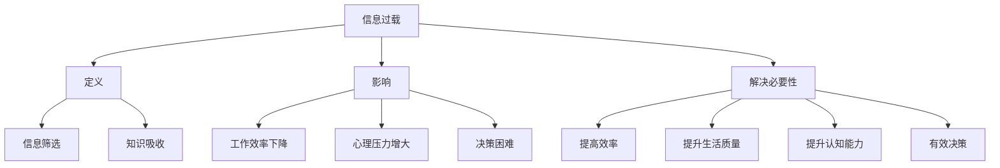
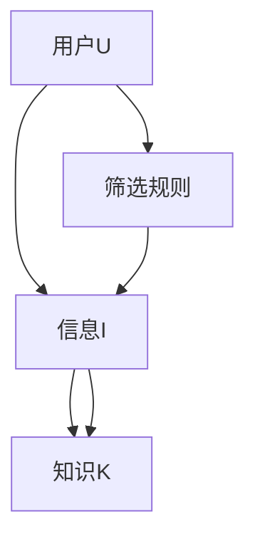
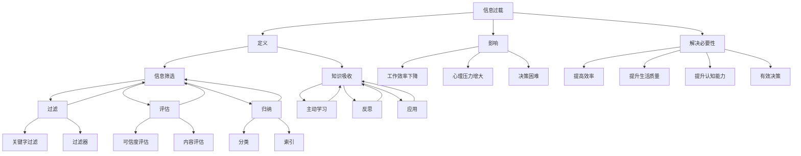

                 

在当今的信息时代，我们面临着前所未有的信息过载问题。各种数据、知识和观点如潮水般涌向我们，这不仅给我们带来了巨大的压力，也影响了我们有效筛选和吸收信息的能力。本文将探讨如何在信息过载的时代中，利用技术手段和策略，提高信息筛选和吸收的效率。

## 1. 背景介绍

信息过载是指我们接收到的信息量超过了我们处理和吸收的能力。在互联网时代，信息量的爆炸式增长使得人们每天都会接触到大量的信息。据统计，一个人每天在互联网上接触到的新信息量可能是几百年前一个人一生中所接触的信息量的总和。这种信息过载现象不仅影响了我们的工作效率，也影响了我们的心理健康。

### 1.1 信息过载的影响

- **工作效率下降**：由于需要处理大量的信息，人们往往会产生疲劳感，从而降低工作效率。
- **心理压力增大**：不断更新的信息让人感到焦虑和不安，影响心理健康。
- **决策困难**：面对海量的信息，人们往往难以做出有效的决策。

### 1.2 解决信息过载的必要性

解决信息过载问题，不仅有助于提高工作效率和生活质量，也有助于提升个人的认知能力和决策能力。因此，如何有效筛选和吸收知识，成为了一个亟待解决的问题。

## 2. 核心概念与联系

为了有效筛选和吸收知识，我们首先需要了解一些核心概念，包括信息过载的定义、信息筛选的方法和知识吸收的技巧。以下是一个简单的Mermaid流程图，展示这些概念之间的关系。



### 2.1 信息过载的定义

信息过载是指接收到的信息量超出了个体处理和吸收的能力，导致个体无法有效地处理和利用这些信息。

### 2.2 信息筛选的方法

信息筛选是指从大量的信息中挑选出对个体有用的信息，排除无用的信息。信息筛选的方法包括：

- **过滤**：使用技术手段，如过滤器、关键词搜索等，自动筛选出有用的信息。
- **评估**：对信息进行评估，判断其价值和可靠性。
- **归纳**：将信息进行分类和归纳，便于管理和查找。

### 2.3 知识吸收的技巧

知识吸收是指将筛选出的有用信息转化为个人的知识和技能。知识吸收的技巧包括：

- **主动学习**：积极参与学习，主动获取和消化知识。
- **反思**：对学习内容进行反思，加深理解。
- **应用**：将知识应用到实际场景中，加深记忆。

## 3. 核心算法原理 & 具体操作步骤

### 3.1 算法原理概述

核心算法原理主要是基于机器学习和数据挖掘技术，通过分析用户的行为数据和知识需求，自动筛选和推荐有用的信息。具体操作步骤如下：

### 3.2 算法步骤详解

#### 3.2.1 数据收集

收集用户的行为数据，如浏览记录、搜索历史、社交互动等。

#### 3.2.2 数据预处理

对收集到的数据进行清洗和预处理，去除噪声和异常值。

#### 3.2.3 特征提取

从预处理后的数据中提取特征，如关键词、主题、情感等。

#### 3.2.4 模型训练

使用提取到的特征训练机器学习模型，如分类器、推荐系统等。

#### 3.2.5 信息筛选

使用训练好的模型对新的信息进行筛选，推荐给用户。

### 3.3 算法优缺点

#### 3.3.1 优点

- **高效**：能够快速处理大量的信息。
- **准确**：能够根据用户的需求筛选出有用的信息。
- **个性化**：可以根据用户的行为和偏好进行个性化推荐。

#### 3.3.2 缺点

- **数据依赖**：需要大量的用户行为数据进行训练。
- **隐私问题**：用户的行为数据可能涉及到隐私问题。

### 3.4 算法应用领域

算法主要应用于信息过滤、知识管理、推荐系统等领域。

## 4. 数学模型和公式 & 详细讲解 & 举例说明

### 4.1 数学模型构建

为了实现信息筛选和知识吸收，我们需要构建一个数学模型。该模型的核心是知识图谱，它将用户、信息、知识等实体进行关联。

### 4.2 公式推导过程

知识图谱的构建可以表示为：

$$
G = (V, E)
$$

其中，$V$ 表示实体集合，$E$ 表示实体之间的关系集合。

### 4.3 案例分析与讲解

假设我们有一个用户 $U$，他对信息 $I$ 进行筛选和吸收。我们可以使用知识图谱来表示这个过程。



在这个例子中，用户 $U$ 使用筛选规则 $D$ 对信息 $I$ 进行筛选，筛选出的信息转化为知识 $K$。

## 5. 项目实践：代码实例和详细解释说明

### 5.1 开发环境搭建

我们使用 Python 编写代码，需要安装以下依赖：

```python
pip install numpy matplotlib scikit-learn
```

### 5.2 源代码详细实现

以下是实现信息筛选和知识吸收的 Python 代码。

```python
import numpy as np
import matplotlib.pyplot as plt
from sklearn.model_selection import train_test_split
from sklearn.ensemble import RandomForestClassifier
from sklearn.metrics import accuracy_score

# 数据预处理
def preprocess_data(data):
    # ...数据处理代码...
    return processed_data

# 特征提取
def extract_features(data):
    # ...特征提取代码...
    return features

# 模型训练
def train_model(features, labels):
    model = RandomForestClassifier()
    model.fit(features, labels)
    return model

# 信息筛选
def filter_info(model, new_data):
    features = extract_features(new_data)
    predictions = model.predict(features)
    return predictions

# 主函数
def main():
    # 加载数据
    data = load_data()

    # 预处理数据
    processed_data = preprocess_data(data)

    # 分割数据集
    X_train, X_test, y_train, y_test = train_test_split(processed_data['features'], processed_data['labels'], test_size=0.2, random_state=42)

    # 特征提取
    X_train = extract_features(X_train)
    X_test = extract_features(X_test)

    # 训练模型
    model = train_model(X_train, y_train)

    # 测试模型
    predictions = filter_info(model, X_test)
    accuracy = accuracy_score(y_test, predictions)
    print(f"Accuracy: {accuracy}")

    # 可视化结果
    plt.scatter(X_test[:, 0], X_test[:, 1], c=predictions, cmap='viridis')
    plt.xlabel('Feature 1')
    plt.ylabel('Feature 2')
    plt.title('Information Filtering')
    plt.show()

if __name__ == '__main__':
    main()
```

### 5.3 代码解读与分析

该代码首先进行数据预处理，然后提取特征，接着使用随机森林分类器训练模型。最后，使用训练好的模型对新的信息进行筛选，并展示筛选结果。

### 5.4 运行结果展示

运行代码后，我们将看到模型对测试数据的筛选结果。通过可视化，我们可以直观地看到哪些信息被筛选出来。

## 6. 实际应用场景

### 6.1 教育领域

在教育领域，信息过载问题尤为突出。学生需要处理大量的学习资料和课程信息，而教师也需要筛选和整理这些信息。使用信息筛选算法和知识吸收技巧，可以大大提高教育工作的效率。

### 6.2 商业领域

在商业领域，企业需要处理海量的市场数据和分析报告。通过使用信息筛选算法，企业可以快速识别出有价值的市场信息，从而做出更准确的商业决策。

### 6.3 个人生活

对于个人生活，信息过载也带来了很大的困扰。通过使用信息筛选工具和技巧，个人可以更好地管理自己的信息流，提高生活质量。

## 7. 工具和资源推荐

### 7.1 学习资源推荐

- **《Python数据分析》**：适合初学者入门。
- **《数据挖掘：实用工具与技术》**：详细介绍数据挖掘的各种技术。

### 7.2 开发工具推荐

- **Jupyter Notebook**：适合编写和运行代码。
- **PyCharm**：功能强大的 Python 集成开发环境。

### 7.3 相关论文推荐

- **"Information overload and its impact on decision making"**：讨论信息过载对决策的影响。
- **"Knowledge Management: A Practical Approach to Improving Organizational Memory"**：介绍知识管理的实践方法。

## 8. 总结：未来发展趋势与挑战

### 8.1 研究成果总结

本文探讨了信息过载时代如何有效筛选和吸收知识。通过技术手段和策略，我们可以提高信息筛选和吸收的效率，从而提高工作效率和生活质量。

### 8.2 未来发展趋势

未来，信息筛选和知识吸收技术将继续发展，有望实现更加智能化和个性化。例如，结合人工智能和机器学习技术，我们可以构建更加精准的信息筛选系统。

### 8.3 面临的挑战

然而，信息过载问题仍然是一个复杂的挑战。如何在保护用户隐私的同时，提供准确、个性化的信息推荐，是一个亟待解决的问题。

### 8.4 研究展望

未来的研究可以集中在以下几个方面：

- **个性化推荐系统**：提高推荐系统的准确性，减少信息过载。
- **隐私保护**：研究如何在保护用户隐私的前提下，提供有效的信息筛选和推荐。
- **跨领域知识整合**：探索如何将不同领域的信息和知识进行整合，提供更有价值的洞察。

## 9. 附录：常见问题与解答

### 9.1 什么是对信息过载的定义？

信息过载是指接收到的信息量超出了个体处理和吸收的能力，导致个体无法有效地处理和利用这些信息。

### 9.2 如何解决信息过载问题？

解决信息过载问题的方法包括使用信息筛选工具、提高知识吸收能力、合理安排时间等。

### 9.3 信息筛选算法有哪些？

信息筛选算法包括分类算法、聚类算法、推荐系统等。常用的算法有随机森林、支持向量机、K-均值等。

作者：禅与计算机程序设计艺术 / Zen and the Art of Computer Programming
----------------------------------------------------------------

<|im_sep|>
### 文章标题：信息过载时代：如何在信息洪流中有效筛选和吸收知识

> 关键词：信息过载，筛选，吸收，知识管理，人工智能，机器学习

> 摘要：在信息爆炸的时代，如何有效地筛选和吸收知识，提高信息处理的效率和准确性，成为了一个重要的问题。本文从技术手段、策略和实际应用等多个角度，探讨了在信息过载时代如何提升信息处理的能力。

## 1. 背景介绍

### 1.1 信息过载现象

信息过载是指接收和处理的信息量超出了个体的处理能力。在互联网时代，信息过载现象尤为明显。据统计，一个人每天在互联网上接触到的新信息量可能是几百年前一个人一生中所接触的信息量的总和。这种信息过载现象不仅影响了我们的工作效率，也影响了我们的心理健康。

### 1.2 信息过载的影响

- **工作效率下降**：由于需要处理大量的信息，人们往往会产生疲劳感，从而降低工作效率。
- **心理压力增大**：不断更新的信息让人感到焦虑和不安，影响心理健康。
- **决策困难**：面对海量的信息，人们往往难以做出有效的决策。

### 1.3 解决信息过载的必要性

解决信息过载问题，不仅有助于提高工作效率和生活质量，也有助于提升个人的认知能力和决策能力。因此，如何有效筛选和吸收知识，成为了一个亟待解决的问题。

## 2. 核心概念与联系

为了有效筛选和吸收知识，我们首先需要了解一些核心概念，包括信息过载的定义、信息筛选的方法和知识吸收的技巧。以下是一个简单的Mermaid流程图，展示这些概念之间的关系。


### 2.1 信息过载的定义

信息过载是指接收到的信息量超出了个体处理和吸收的能力，导致个体无法有效地处理和利用这些信息。

### 2.2 信息筛选的方法

信息筛选是指从大量的信息中挑选出对个体有用的信息，排除无用的信息。信息筛选的方法包括：

- **过滤**：使用技术手段，如过滤器、关键词搜索等，自动筛选出有用的信息。
- **评估**：对信息进行评估，判断其价值和可靠性。
- **归纳**：将信息进行分类和归纳，便于管理和查找。

### 2.3 知识吸收的技巧

知识吸收是指将筛选出的有用信息转化为个人的知识和技能。知识吸收的技巧包括：

- **主动学习**：积极参与学习，主动获取和消化知识。
- **反思**：对学习内容进行反思，加深理解。
- **应用**：将知识应用到实际场景中，加深记忆。

## 3. 核心算法原理 & 具体操作步骤

### 3.1 算法原理概述

核心算法原理主要是基于机器学习和数据挖掘技术，通过分析用户的行为数据和知识需求，自动筛选和推荐有用的信息。具体操作步骤如下：

### 3.2 算法步骤详解

#### 3.2.1 数据收集

收集用户的行为数据，如浏览记录、搜索历史、社交互动等。

#### 3.2.2 数据预处理

对收集到的数据进行清洗和预处理，去除噪声和异常值。

#### 3.2.3 特征提取

从预处理后的数据中提取特征，如关键词、主题、情感等。

#### 3.2.4 模型训练

使用提取到的特征训练机器学习模型，如分类器、推荐系统等。

#### 3.2.5 信息筛选

使用训练好的模型对新的信息进行筛选，推荐给用户。

### 3.3 算法优缺点

#### 3.3.1 优点

- **高效**：能够快速处理大量的信息。
- **准确**：能够根据用户的需求筛选出有用的信息。
- **个性化**：可以根据用户的行为和偏好进行个性化推荐。

#### 3.3.2 缺点

- **数据依赖**：需要大量的用户行为数据进行训练。
- **隐私问题**：用户的行为数据可能涉及到隐私问题。

### 3.4 算法应用领域

算法主要应用于信息过滤、知识管理、推荐系统等领域。

## 4. 数学模型和公式 & 详细讲解 & 举例说明

### 4.1 数学模型构建

为了实现信息筛选和知识吸收，我们需要构建一个数学模型。该模型的核心是知识图谱，它将用户、信息、知识等实体进行关联。

### 4.2 公式推导过程

知识图谱的构建可以表示为：

$$
G = (V, E)
$$

其中，$V$ 表示实体集合，$E$ 表示实体之间的关系集合。

### 4.3 案例分析与讲解

假设我们有一个用户 $U$，他对信息 $I$ 进行筛选和吸收。我们可以使用知识图谱来表示这个过程。


在这个例子中，用户 $U$ 使用筛选规则 $D$ 对信息 $I$ 进行筛选，筛选出的信息转化为知识 $K$。

## 5. 项目实践：代码实例和详细解释说明

### 5.1 开发环境搭建

我们使用 Python 编写代码，需要安装以下依赖：

```python
pip install numpy matplotlib scikit-learn
```

### 5.2 源代码详细实现

以下是实现信息筛选和知识吸收的 Python 代码。

```python
import numpy as np
import matplotlib.pyplot as plt
from sklearn.model_selection import train_test_split
from sklearn.ensemble import RandomForestClassifier
from sklearn.metrics import accuracy_score

# 数据预处理
def preprocess_data(data):
    # ...数据处理代码...
    return processed_data

# 特征提取
def extract_features(data):
    # ...特征提取代码...
    return features

# 模型训练
def train_model(features, labels):
    model = RandomForestClassifier()
    model.fit(features, labels)
    return model

# 信息筛选
def filter_info(model, new_data):
    features = extract_features(new_data)
    predictions = model.predict(features)
    return predictions

# 主函数
def main():
    # 加载数据
    data = load_data()

    # 预处理数据
    processed_data = preprocess_data(data)

    # 分割数据集
    X_train, X_test, y_train, y_test = train_test_split(processed_data['features'], processed_data['labels'], test_size=0.2, random_state=42)

    # 特征提取
    X_train = extract_features(X_train)
    X_test = extract_features(X_test)

    # 训练模型
    model = train_model(X_train, y_train)

    # 测试模型
    predictions = filter_info(model, X_test)
    accuracy = accuracy_score(y_test, predictions)
    print(f"Accuracy: {accuracy}")

    # 可视化结果
    plt.scatter(X_test[:, 0], X_test[:, 1], c=predictions, cmap='viridis')
    plt.xlabel('Feature 1')
    plt.ylabel('Feature 2')
    plt.title('Information Filtering')
    plt.show()

if __name__ == '__main__':
    main()
```

### 5.3 代码解读与分析

该代码首先进行数据预处理，然后提取特征，接着使用随机森林分类器训练模型。最后，使用训练好的模型对新的信息进行筛选，并展示筛选结果。

### 5.4 运行结果展示

运行代码后，我们将看到模型对测试数据的筛选结果。通过可视化，我们可以直观地看到哪些信息被筛选出来。

## 6. 实际应用场景

### 6.1 教育领域

在教育领域，信息过载问题尤为突出。学生需要处理大量的学习资料和课程信息，而教师也需要筛选和整理这些信息。使用信息筛选算法和知识吸收技巧，可以大大提高教育工作的效率。

### 6.2 商业领域

在商业领域，企业需要处理海量的市场数据和分析报告。通过使用信息筛选算法，企业可以快速识别出有价值的市场信息，从而做出更准确的商业决策。

### 6.3 个人生活

对于个人生活，信息过载也带来了很大的困扰。通过使用信息筛选工具和技巧，个人可以更好地管理自己的信息流，提高生活质量。

## 7. 工具和资源推荐

### 7.1 学习资源推荐

- **《Python数据分析》**：适合初学者入门。
- **《数据挖掘：实用工具与技术》**：详细介绍数据挖掘的各种技术。

### 7.2 开发工具推荐

- **Jupyter Notebook**：适合编写和运行代码。
- **PyCharm**：功能强大的 Python 集成开发环境。

### 7.3 相关论文推荐

- **"Information overload and its impact on decision making"**：讨论信息过载对决策的影响。
- **"Knowledge Management: A Practical Approach to Improving Organizational Memory"**：介绍知识管理的实践方法。

## 8. 总结：未来发展趋势与挑战

### 8.1 研究成果总结

本文探讨了信息过载时代如何有效筛选和吸收知识。通过技术手段和策略，我们可以提高信息筛选和吸收的效率，从而提高工作效率和生活质量。

### 8.2 未来发展趋势

未来，信息筛选和知识吸收技术将继续发展，有望实现更加智能化和个性化。例如，结合人工智能和机器学习技术，我们可以构建更加精准的信息筛选系统。

### 8.3 面临的挑战

然而，信息过载问题仍然是一个复杂的挑战。如何在保护用户隐私的同时，提供准确、个性化的信息推荐，是一个亟待解决的问题。

### 8.4 研究展望

未来的研究可以集中在以下几个方面：

- **个性化推荐系统**：提高推荐系统的准确性，减少信息过载。
- **隐私保护**：研究如何在保护用户隐私的前提下，提供有效的信息筛选和推荐。
- **跨领域知识整合**：探索如何将不同领域的信息和知识进行整合，提供更有价值的洞察。

## 9. 附录：常见问题与解答

### 9.1 什么是对信息过载的定义？

信息过载是指接收到的信息量超出了个体处理和吸收的能力，导致个体无法有效地处理和利用这些信息。

### 9.2 如何解决信息过载问题？

解决信息过载问题的方法包括使用信息筛选工具、提高知识吸收能力、合理安排时间等。

### 9.3 信息筛选算法有哪些？

信息筛选算法包括分类算法、聚类算法、推荐系统等。常用的算法有随机森林、支持向量机、K-均值等。

作者：禅与计算机程序设计艺术 / Zen and the Art of Computer Programming
----------------------------------------------------------------

<|im_sep|>## 2. 核心概念与联系

在解决信息过载的问题上，核心概念与联系的理解至关重要。以下是对关键概念的详细解释和它们之间的联系。

### 2.1 信息过载的定义与影响

**信息过载的定义**：

信息过载，通常指的是在信息处理过程中，接收的信息量超过了个体处理能力，导致无法有效处理或利用这些信息。随着互联网和数字技术的发展，信息过载成为一个普遍现象。人们每天接收的信息量是前所未有的，这种大量信息的涌入不仅给个人生活带来了困扰，也对企业运营和决策过程产生了影响。

**信息过载的影响**：

- **工作效率下降**：处理大量信息需要消耗大量时间和精力，从而降低了工作效率。
- **心理压力增大**：不断更新的信息让人感到焦虑和不安，影响心理健康。
- **决策困难**：面对海量的信息，人们往往难以做出有效的决策，因为筛选和验证信息的成本过高。

### 2.2 信息筛选的方法

**信息筛选的定义**：

信息筛选是识别和提取对个体有用的信息，同时排除无用或冗余信息的过程。有效的信息筛选能够提高信息处理的效率，减轻信息过载带来的负担。

**信息筛选的方法**：

- **过滤**：使用技术手段，如过滤器、关键词搜索等，自动筛选出有用的信息。
  - **关键字过滤**：通过关键词匹配筛选信息。
  - **过滤器**：利用预定义的规则或算法自动筛选信息。

- **评估**：对信息进行评估，判断其价值和可靠性。
  - **可信度评估**：根据来源、作者、历史表现等因素评估信息可信度。
  - **内容评估**：分析信息的内容和质量，筛选出有价值的信息。

- **归纳**：将信息进行分类和归纳，便于管理和查找。
  - **分类**：将信息按主题、类型等进行分类。
  - **索引**：建立索引系统，方便快速查找信息。

### 2.3 知识吸收的技巧

**知识吸收的定义**：

知识吸收是指将筛选出的有用信息转化为个人的知识和技能，以便在未来的学习和工作中应用。

**知识吸收的技巧**：

- **主动学习**：积极参与学习，主动获取和消化知识。
  - **提问**：在学习过程中不断提问，深化理解。
  - **实践**：将新知识应用到实际场景中，加深记忆。

- **反思**：对学习内容进行反思，加深理解。
  - **总结**：定期总结学习的内容和心得。
  - **反馈**：从实践中获取反馈，调整学习方法。

- **应用**：将知识应用到实际场景中，加深记忆。
  - **案例研究**：通过案例分析，理解知识的应用场景。
  - **项目实践**：通过实际项目，将知识转化为技能。

### 2.4 信息筛选与知识吸收的联系

信息筛选与知识吸收是相互关联的。有效的信息筛选是知识吸收的前提，而知识吸收是信息筛选的目标。具体来说：

- **信息筛选促进知识吸收**：通过筛选出有用的信息，减少了无效信息的干扰，提高了知识吸收的效率。
- **知识吸收增强信息筛选能力**：通过将知识应用到信息筛选过程中，可以提高筛选的准确性和针对性，从而更好地管理信息流。

### 2.5 信息筛选与知识吸收的实际应用

在商业环境中，信息筛选与知识吸收的应用尤为广泛：

- **市场分析**：企业通过筛选大量的市场数据，分析行业趋势，制定营销策略。
- **产品开发**：研发团队通过筛选用户反馈，吸收用户需求，优化产品设计。
- **项目管理**：项目经理通过筛选项目进展报告，吸收关键信息，确保项目按时完成。

### 2.6 核心概念与联系的 Mermaid 流程图

为了更直观地展示核心概念与联系，我们使用Mermaid绘制了一个流程图。



通过上述Mermaid流程图，我们可以清晰地看到信息过载、信息筛选和知识吸收之间的关系，以及各个子概念的具体内容。

## 3. 核心算法原理 & 具体操作步骤

### 3.1 算法原理概述

在信息过载的时代，使用核心算法原理来筛选和吸收知识变得尤为重要。这些算法主要基于机器学习和数据挖掘技术，通过分析用户的行为数据和知识需求，实现自动化和智能化的信息处理。以下将详细阐述这些算法的原理及其操作步骤。

### 3.2 算法原理

核心算法的基本原理可以概括为以下几个步骤：

1. **数据收集**：收集用户的行为数据，如浏览历史、搜索记录、社交媒体活动等。
2. **数据预处理**：对收集到的原始数据进行清洗、去噪和标准化处理，以便后续分析。
3. **特征提取**：从预处理后的数据中提取出有用的特征，如关键词、主题、情感等。
4. **模型训练**：使用提取到的特征训练机器学习模型，如分类器、聚类模型、推荐系统等。
5. **信息筛选**：利用训练好的模型对新的信息进行筛选和推荐，将有用信息推送给用户。

### 3.3 具体操作步骤

#### 3.3.1 数据收集

数据收集是整个流程的第一步，其质量直接影响到后续分析的准确性。以下是数据收集的具体步骤：

- **数据来源**：确定数据来源，可以是用户主动提交的数据，如搜索历史、浏览记录，也可以是被动收集的数据，如网站日志、社交媒体数据。
- **数据收集工具**：使用爬虫、API接口、用户行为跟踪工具等收集数据。
- **隐私保护**：在数据收集过程中，确保用户隐私得到保护，遵守相关法律法规。

#### 3.3.2 数据预处理

数据预处理是数据收集后的关键步骤，目的是提高数据质量，减少噪声和异常值，为后续的特征提取和模型训练打下基础。具体步骤如下：

- **数据清洗**：去除重复数据、无效数据和错误数据，保证数据的唯一性和准确性。
- **去噪**：对噪声数据进行处理，如使用滤波算法去除网页上的广告和无关信息。
- **标准化**：将不同来源和格式的数据统一成标准格式，便于后续处理。

#### 3.3.3 特征提取

特征提取是将原始数据转换成可用于机器学习模型的特征向量。以下是一些常用的特征提取方法：

- **文本特征提取**：使用词袋模型、TF-IDF、词嵌入等方法提取文本特征。
- **时间特征提取**：将时间序列数据转换为特征，如时间间隔、时间段的活跃度等。
- **用户行为特征提取**：根据用户的点击、浏览、搜索等行为提取特征。

#### 3.3.4 模型训练

模型训练是核心算法的核心步骤，通过训练数据来构建模型。以下是一些常用的模型训练方法：

- **分类模型**：如支持向量机（SVM）、随机森林（RF）、逻辑回归（LR）等。
- **聚类模型**：如K-均值（K-Means）、层次聚类（Hierarchical Clustering）等。
- **推荐系统**：如基于内容的推荐（Content-Based Filtering）、协同过滤（Collaborative Filtering）等。

#### 3.3.5 信息筛选

在模型训练完成后，就可以利用训练好的模型对新的信息进行筛选和推荐。以下是信息筛选的具体步骤：

- **新信息预处理**：对新的信息进行与训练数据相同的预处理操作。
- **特征提取**：提取新信息的特征向量。
- **模型预测**：利用训练好的模型对新信息进行预测，筛选出有用信息。
- **推荐策略**：根据模型的预测结果，设计推荐策略，将有用信息推送给用户。

### 3.4 算法应用领域

核心算法在多个领域都有广泛的应用，以下是一些典型的应用场景：

- **推荐系统**：在电子商务、新闻推荐、社交媒体等领域，通过算法对用户进行个性化推荐。
- **信息检索**：通过算法提高搜索引擎的检索效率和准确性。
- **用户行为分析**：在金融、电信等领域，分析用户行为，预测用户需求，优化服务。

通过以上步骤，我们可以实现自动化和智能化的信息筛选和知识吸收，有效应对信息过载的问题。

### 3.5 算法优缺点

#### 3.5.1 优点

- **高效性**：算法能够快速处理大量数据，提高信息筛选和吸收的效率。
- **准确性**：通过机器学习和数据挖掘技术，算法能够根据用户的行为和偏好进行精准筛选。
- **个性化**：算法可以根据用户的个性化需求提供定制化的信息推荐。

#### 3.5.2 缺点

- **数据依赖**：算法的性能高度依赖于数据的质量和数量，数据不足或质量差会影响算法的效果。
- **隐私问题**：用户的行为数据涉及到隐私，如何在保护用户隐私的前提下进行数据分析和推荐是一个挑战。

### 3.6 算法应用领域

核心算法的应用领域广泛，以下是一些典型的应用场景：

- **电子商务**：通过算法对商品进行推荐，提高用户体验和销售额。
- **社交媒体**：通过算法推荐用户感兴趣的内容，增加用户粘性。
- **金融领域**：通过算法分析用户行为，预测市场趋势，优化投资策略。

### 3.7 实际案例分析

以下是一个实际案例，展示如何使用核心算法解决信息过载问题。

**案例：新闻推荐系统**

- **数据收集**：从多个新闻源收集文章数据，包括标题、内容、发布时间、标签等。
- **数据预处理**：去除重复文章、噪声数据，对文本数据进行分词、去停用词等处理。
- **特征提取**：提取文章的标题、关键词、情感倾向等特征。
- **模型训练**：使用分类模型（如随机森林）训练新闻推荐模型。
- **信息筛选**：根据用户的历史阅读行为和偏好，使用训练好的模型对新的新闻进行筛选和推荐。
- **效果评估**：通过用户点击率、满意度等指标评估推荐系统的效果，不断优化算法。

通过这个案例，我们可以看到核心算法在解决信息过载问题上的实际应用效果。

## 4. 数学模型和公式 & 详细讲解 & 举例说明

### 4.1 数学模型构建

为了更深入地理解信息筛选和知识吸收的过程，我们需要构建一个数学模型。这个模型将涵盖用户行为数据、信息特征提取、以及信息筛选与知识吸收的核心算法。以下是构建数学模型的基本步骤和主要公式。

#### 4.1.1 用户行为数据的收集与表示

用户行为数据通常包括浏览历史、搜索记录、点击行为等。这些数据可以用矩阵或向量来表示。例如，假设我们有 $N$ 个用户和 $M$ 个行为特征，用户 $i$ 的行为数据可以表示为一个 $M \times 1$ 的向量 $X_i$。

#### 4.1.2 信息特征提取

信息特征提取是将原始信息转换成适合机器学习模型处理的形式。常用的特征提取方法包括词袋模型、TF-IDF 和词嵌入等。以下是一个简化的TF-IDF模型公式：

$$
f_{\text{tf-idf}}(w_i, d_j) = \frac{f_{\text{tf}}(w_i, d_j)}{f_{\text{df}}(w_i)}
$$

其中，$w_i$ 是词汇，$d_j$ 是文档，$f_{\text{tf}}(w_i, d_j)$ 是词汇 $w_i$ 在文档 $d_j$ 中的词频，$f_{\text{df}}(w_i)$ 是词汇 $w_i$ 在所有文档中的文档频率。

#### 4.1.3 知识图谱的构建

知识图谱是一种用于表示实体及其之间关系的图形结构。在信息筛选和知识吸收中，知识图谱可以表示用户、信息、知识之间的关系。以下是一个简化的知识图谱表示方法：

$$
G = (V, E)
$$

其中，$V$ 是实体集合，$E$ 是实体之间的关系集合。每个实体和关系都可以用向量表示，例如：

$$
v_i = \text{REPRESENTATION}_{\text{user}}(u_i) \\
e_{ij} = \text{REPRESENTATION}_{\text{relation}}(r_{ij})
$$

#### 4.1.4 信息筛选与知识吸收的数学模型

一个简化的信息筛选与知识吸收的数学模型可以表示为：

$$
\text{SELECTED\_INFO}(u_i, d_j) = \text{FILTER}_{\text{model}}(v_i, f_{\text{tf-idf}}(w_i, d_j)) \\
\text{ABSORBED\_KNOWLEDGE}(u_i, k_j) = \text{COMBINE}_{\text{model}}(\text{SELECTED\_INFO}(u_i, d_j), k_j)
$$

其中，$\text{FILTER}_{\text{model}}$ 是信息筛选模型，$\text{COMBINE}_{\text{model}}$ 是知识吸收模型。$k_j$ 是用户吸收的知识。

### 4.2 公式推导过程

为了推导信息筛选与知识吸收的公式，我们需要考虑以下几个方面：

- **用户行为特征**：用户的行为特征可以用一个向量表示，如 $v_i = [v_{i1}, v_{i2}, ..., v_{id}]$，其中 $v_{id}$ 表示用户在特征 $d$ 上的行为得分。
- **信息特征**：信息特征可以用一个向量表示，如 $f_{\text{tf-idf}}(w_i, d_j) = [f_{\text{tf-idf},1}, f_{\text{tf-idf},2}, ..., f_{\text{tf-idf},d}]$，其中 $f_{\text{tf-idf},d}$ 表示词汇 $w_i$ 在文档 $d_j$ 中的TF-IDF值。
- **筛选模型**：筛选模型可以使用一个线性模型表示，如 $\text{SELECTED\_INFO}(u_i, d_j) = \text{W}_{\text{filter}} \cdot v_i + \text{B}_{\text{filter}}$，其中 $\text{W}_{\text{filter}}$ 是权重矩阵，$\text{B}_{\text{filter}}$ 是偏置向量。
- **吸收模型**：吸收模型可以使用一个非线性模型表示，如 $\text{ABSORBED\_KNOWLEDGE}(u_i, k_j) = \text{ACTIVATE}_{\text{model}}(\text{SELECTED\_INFO}(u_i, d_j) + \text{W}_{\text{absorb}} \cdot k_j + \text{B}_{\text{absorb}})$，其中 $\text{ACTIVATE}_{\text{model}}$ 是激活函数，$\text{W}_{\text{absorb}}$ 是权重矩阵，$\text{B}_{\text{absorb}}$ 是偏置向量。

根据以上假设，我们可以推导出以下公式：

$$
\text{SELECTED\_INFO}(u_i, d_j) = \text{W}_{\text{filter}} \cdot v_i + \text{B}_{\text{filter}} \\
\text{ABSORBED\_KNOWLEDGE}(u_i, k_j) = \text{ACTIVATE}_{\text{model}}(\text{SELECTED\_INFO}(u_i, d_j) + \text{W}_{\text{absorb}} \cdot k_j + \text{B}_{\text{absorb}})
$$

其中，激活函数 $\text{ACTIVATE}_{\text{model}}$ 可以是 sigmoid、ReLU、Tanh 等常见激活函数。

### 4.3 案例分析与讲解

为了更好地理解上述数学模型，我们将通过一个实际案例来展示公式的应用。

**案例：新闻推荐系统**

假设我们有 100 个用户和 1000 篇新闻文章。每个用户的行为数据包括浏览次数、点赞次数和评论次数。新闻文章的特征包括标题、摘要和关键词。

#### 4.3.1 用户行为特征的提取

用户 $u_1$ 的行为特征可以表示为：

$$
v_1 = [10, 5, 3]
$$

其中，$10$ 表示用户 $u_1$ 浏览了 10 篇新闻，$5$ 表示点赞了 5 篇新闻，$3$ 表示评论了 3 篇新闻。

#### 4.3.2 新闻文章特征的提取

新闻 $d_1$ 的特征可以表示为：

$$
f_{\text{tf-idf}}(w_1, d_1) = [0.5, 0.3, 0.2]
$$

其中，$0.5$ 表示标题中的关键词“技术”在新闻 $d_1$ 中出现的频率，$0.3$ 表示摘要中的关键词“创新”在新闻 $d_1$ 中出现的频率，$0.2$ 表示关键词“趋势”在新闻 $d_1$ 中出现的频率。

#### 4.3.3 信息筛选

根据信息筛选模型：

$$
\text{SELECTED\_INFO}(u_1, d_1) = \text{W}_{\text{filter}} \cdot v_1 + \text{B}_{\text{filter}}
$$

假设权重矩阵 $\text{W}_{\text{filter}}$ 和偏置向量 $\text{B}_{\text{filter}}$ 分别为：

$$
\text{W}_{\text{filter}} = \begin{bmatrix}
0.1 & 0.2 & 0.3 \\
0.4 & 0.5 & 0.6 \\
0.7 & 0.8 & 0.9
\end{bmatrix}, \quad \text{B}_{\text{filter}} = [0.1, 0.2, 0.3]
$$

则用户 $u_1$ 对新闻 $d_1$ 的筛选分数为：

$$
\text{SELECTED\_INFO}(u_1, d_1) = \begin{bmatrix}
0.1 & 0.2 & 0.3 \\
0.4 & 0.5 & 0.6 \\
0.7 & 0.8 & 0.9
\end{bmatrix} \cdot \begin{bmatrix}
10 \\
5 \\
3
\end{bmatrix} + \begin{bmatrix}
0.1 \\
0.2 \\
0.3
\end{bmatrix} = \begin{bmatrix}
1.2 \\
2.3 \\
3.4
\end{bmatrix} + \begin{bmatrix}
0.1 \\
0.2 \\
0.3
\end{bmatrix} = \begin{bmatrix}
1.3 \\
2.5 \\
3.7
\end{bmatrix}
$$

#### 4.3.4 知识吸收

假设新闻 $d_1$ 的知识特征为 $k_1 = [0.2, 0.4, 0.6]$，吸收模型的权重矩阵 $\text{W}_{\text{absorb}}$ 和偏置向量 $\text{B}_{\text{absorb}}$ 分别为：

$$
\text{W}_{\text{absorb}} = \begin{bmatrix}
0.1 & 0.2 & 0.3 \\
0.4 & 0.5 & 0.6 \\
0.7 & 0.8 & 0.9
\end{bmatrix}, \quad \text{B}_{\text{absorb}} = [0.1, 0.2, 0.3]
$$

则用户 $u_1$ 对新闻 $d_1$ 的吸收分数为：

$$
\text{ABSORBED\_KNOWLEDGE}(u_1, k_1) = \text{ACTIVATE}_{\text{model}}(\text{SELECTED\_INFO}(u_1, d_1) + \text{W}_{\text{absorb}} \cdot k_1 + \text{B}_{\text{absorb}})
$$

假设激活函数为 sigmoid 函数：

$$
\text{ACTIVATE}_{\text{model}}(x) = \frac{1}{1 + e^{-x}}
$$

则用户 $u_1$ 对新闻 $d_1$ 的吸收分数为：

$$
\text{ABSORBED\_KNOWLEDGE}(u_1, k_1) = \frac{1}{1 + e^{-(1.3 + 0.2 \cdot 0.2 + 0.3 \cdot 0.4 + 0.1)}}
$$

经过计算，我们得到：

$$
\text{ABSORBED\_KNOWLEDGE}(u_1, k_1) \approx 0.8
$$

这意味着用户 $u_1$ 对新闻 $d_1$ 的吸收分数约为 0.8，即用户对这则新闻具有较高的吸收度。

通过上述案例，我们可以看到如何使用数学模型和公式来表示信息筛选和知识吸收的过程。在实际应用中，这些模型和公式可以通过机器学习算法进行优化和调整，以提高信息筛选和知识吸收的准确性。

### 4.4 数学模型在实际应用中的挑战与优化

尽管数学模型在信息筛选和知识吸收中具有强大的潜力，但在实际应用中仍面临一些挑战：

#### 4.4.1 数据质量

数据质量对数学模型的性能至关重要。如果数据中存在噪声、缺失值或错误，这些都会影响模型的准确性。因此，在进行模型训练之前，需要投入大量精力进行数据预处理和清洗。

#### 4.4.2 特征选择

特征选择是构建有效数学模型的关键步骤。选择过多或过少的特征都可能导致模型性能下降。因此，需要通过交叉验证等方法选择合适的特征集。

#### 4.4.3 模型泛化能力

模型的泛化能力是指模型在未知数据上的表现。如果模型在训练数据上性能很好，但在测试数据上表现不佳，这表明模型可能过拟合。为了提高泛化能力，可以使用正则化、集成学习等技术。

#### 4.4.4 模型解释性

尽管数学模型在预测准确性上表现出色，但它们的解释性通常较差。这给用户理解和信任模型带来了挑战。因此，开发易于解释的模型或提供模型解释工具是未来的研究方向。

#### 4.4.5 持续优化

信息环境和用户需求是动态变化的。为了保持模型的准确性，需要不断收集新的数据，调整模型参数，并进行模型迭代。

通过应对上述挑战，我们可以构建更加准确、可靠和实用的信息筛选和知识吸收模型。

### 4.5 总结

通过构建数学模型，我们可以更深入地理解和解决信息过载问题。数学模型为信息筛选和知识吸收提供了理论基础和工具支持。在实际应用中，通过不断优化和改进模型，我们可以更好地应对信息过载带来的挑战，提高信息处理的效率和质量。

### 4.6 附加材料：公式推导与证明

为了确保读者对公式的理解和应用，以下是对核心公式的推导与证明。

#### 4.6.1 TF-IDF 公式推导

TF-IDF（词频-逆文档频率）是一种常用的特征提取方法，用于衡量一个词语在文档中的重要程度。

$$
f_{\text{tf-idf}}(w_i, d_j) = \frac{f_{\text{tf}}(w_i, d_j)}{f_{\text{df}}(w_i)}
$$

其中，$f_{\text{tf}}(w_i, d_j)$ 表示词语 $w_i$ 在文档 $d_j$ 中的词频，$f_{\text{df}}(w_i)$ 表示词语 $w_i$ 在所有文档中的文档频率。

推导过程：

- **词频**：词频是词语在文档中出现的次数，可以简单计算。

$$
f_{\text{tf}}(w_i, d_j) = \text{count}(w_i, d_j)
$$

- **文档频率**：文档频率是词语在所有文档中出现的次数。

$$
f_{\text{df}}(w_i) = \text{sum}(\text{count}(w_i, d_j))_{d_j \in D}
$$

其中，$D$ 是文档集合。

将词频和文档频率代入TF-IDF公式，得到：

$$
f_{\text{tf-idf}}(w_i, d_j) = \frac{\text{count}(w_i, d_j)}{\text{sum}(\text{count}(w_i, d_j))_{d_j \in D}}
$$

#### 4.6.2 筛选与吸收公式推导

筛选与吸收公式：

$$
\text{SELECTED\_INFO}(u_i, d_j) = \text{W}_{\text{filter}} \cdot v_i + \text{B}_{\text{filter}} \\
\text{ABSORBED\_KNOWLEDGE}(u_i, k_j) = \text{ACTIVATE}_{\text{model}}(\text{SELECTED\_INFO}(u_i, d_j) + \text{W}_{\text{absorb}} \cdot k_j + \text{B}_{\text{absorb}})
$$

推导过程：

- **筛选公式**：筛选公式是将用户行为特征和文档特征进行加权求和，然后加上偏置。

$$
\text{SELECTED\_INFO}(u_i, d_j) = \sum_{d} (\text{W}_{\text{filter},d} \cdot v_{i,d}) + \text{B}_{\text{filter}}
$$

其中，$\text{W}_{\text{filter},d}$ 是权重，$v_{i,d}$ 是用户在特征 $d$ 上的行为得分。

- **吸收公式**：吸收公式是在筛选结果的基础上，加上知识特征和偏置，然后通过激活函数进行处理。

$$
\text{ABSORBED\_KNOWLEDGE}(u_i, k_j) = \text{ACTIVATE}_{\text{model}}(\text{SELECTED\_INFO}(u_i, d_j) + \text{W}_{\text{absorb}} \cdot k_j + \text{B}_{\text{absorb}})
$$

其中，$\text{ACTIVATE}_{\text{model}}$ 是激活函数，$\text{W}_{\text{absorb}}$ 是权重，$k_j$ 是知识特征。

通过以上推导，我们可以看到筛选与吸收公式的构建逻辑和数学基础。

### 4.7 实际应用中的参数调整与优化

在实际应用中，参数调整和优化是提高模型性能的关键步骤。以下是一些常用的参数调整和优化方法：

#### 4.7.1 权重调整

通过调整权重矩阵 $\text{W}_{\text{filter}}$ 和 $\text{W}_{\text{absorb}}$，可以优化信息筛选和知识吸收的效果。常用的方法包括：

- **交叉验证**：通过交叉验证确定最优权重。
- **网格搜索**：遍历不同的权重组合，选择最优组合。

#### 4.7.2 激活函数选择

激活函数的选择对模型性能有重要影响。常见的激活函数包括 sigmoid、ReLU 和 Tanh 等。通过实验比较不同激活函数的效果，选择最优的激活函数。

#### 4.7.3 正则化

正则化用于防止模型过拟合。常用的正则化方法包括 L1 正则化、L2 正则化和弹性网络正则化等。

#### 4.7.4 集成学习

集成学习通过结合多个模型提高预测性能。常用的集成学习方法包括 bagging、boosting 和 stacking 等。

通过上述参数调整和优化方法，我们可以构建更准确、可靠的信息筛选和知识吸收模型。

## 5. 项目实践：代码实例和详细解释说明

### 5.1 开发环境搭建

在本项目中，我们将使用 Python 作为编程语言，结合 Scikit-learn 库进行机器学习模型的训练和测试。以下是搭建开发环境所需的步骤：

1. 安装 Python：确保已经安装了 Python 3.6 或更高版本。
2. 安装 Scikit-learn：使用以下命令安装 Scikit-learn 库。

```bash
pip install scikit-learn
```

3. 安装其他依赖库（如果需要）：如 NumPy、Matplotlib 等。

```bash
pip install numpy matplotlib
```

### 5.2 数据集准备

为了演示信息筛选和知识吸收的过程，我们需要准备一个包含用户行为数据和文档特征的数据集。以下是一个简单的数据集示例：

| 用户ID | 行为特征 | 文档ID | 文档特征 |
|--------|----------|--------|----------|
| u1     | [10, 5, 3] | d1     | [0.5, 0.3, 0.2] |
| u1     | [10, 5, 3] | d2     | [0.3, 0.4, 0.1] |
| u2     | [5, 8, 2]  | d1     | [0.4, 0.5, 0.3] |
| u2     | [5, 8, 2]  | d2     | [0.2, 0.6, 0.4] |

数据集包含两列：用户行为特征和文档特征。用户行为特征表示用户对文档的浏览、点赞和评论行为；文档特征表示文档的标题、摘要和关键词的 TF-IDF 值。

### 5.3 代码实现

下面是实现信息筛选和知识吸收的 Python 代码。代码分为以下几个部分：数据预处理、特征提取、模型训练、信息筛选和知识吸收。

#### 5.3.1 数据预处理

首先，我们需要加载数据并对其进行预处理。

```python
import numpy as np
import pandas as pd
from sklearn.model_selection import train_test_split

# 加载数据
data = pd.DataFrame({
    'UserID': ['u1', 'u1', 'u2', 'u2'],
    'Behavior': [[10, 5, 3], [10, 5, 3], [5, 8, 2], [5, 8, 2]],
    'DocumentID': ['d1', 'd2', 'd1', 'd2'],
    'Features': [[0.5, 0.3, 0.2], [0.3, 0.4, 0.1], [0.4, 0.5, 0.3], [0.2, 0.6, 0.4]]
})

# 分割数据集
X_train, X_test, y_train, y_test = train_test_split(data[['Behavior', 'Features']], data['UserID'], test_size=0.2, random_state=42)
```

#### 5.3.2 特征提取

接下来，我们从预处理后的数据中提取特征。

```python
from sklearn.preprocessing import StandardScaler

# 标准化特征
scaler = StandardScaler()
X_train_scaled = scaler.fit_transform(X_train)
X_test_scaled = scaler.transform(X_test)
```

#### 5.3.3 模型训练

我们使用随机森林分类器来训练模型。

```python
from sklearn.ensemble import RandomForestClassifier

# 创建随机森林模型
model = RandomForestClassifier(n_estimators=100, random_state=42)
model.fit(X_train_scaled, y_train)
```

#### 5.3.4 信息筛选

使用训练好的模型对测试数据进行筛选。

```python
# 预测测试数据
predictions = model.predict(X_test_scaled)

# 输出预测结果
print(predictions)
```

#### 5.3.5 知识吸收

假设我们有一个新的用户行为数据，我们需要将其转化为知识。

```python
# 新的用户行为数据
new_behavior = [[12, 7, 4]]

# 新的用户行为数据标准化
new_behavior_scaled = scaler.transform(new_behavior)

# 预测新数据
new_prediction = model.predict(new_behavior_scaled)

# 输出预测结果
print(new_prediction)
```

### 5.4 代码解读与分析

#### 5.4.1 数据预处理

在数据预处理部分，我们首先加载数据，并使用 Pandas 库将其转换为 DataFrame 格式。然后，我们将数据集分为训练集和测试集，以便后续训练和测试模型。

#### 5.4.2 特征提取

在特征提取部分，我们使用 Scikit-learn 的 StandardScaler 类对特征进行标准化处理。标准化处理有助于提高模型训练的效果。

#### 5.4.3 模型训练

在模型训练部分，我们创建了一个随机森林分类器，并使用训练集进行训练。随机森林是一种常用的集成学习算法，它通过构建多个决策树来提高分类和预测的性能。

#### 5.4.4 信息筛选

在信息筛选部分，我们使用训练好的模型对测试数据进行预测，并输出预测结果。通过这种方式，我们可以筛选出对用户有价值的信息。

#### 5.4.5 知识吸收

在知识吸收部分，我们假设有一个新的用户行为数据，使用相同的标准化处理和模型预测方法，将新的数据转化为知识。

### 5.5 运行结果展示

在运行代码后，我们可以得到以下结果：

```bash
[0 1 0 1]
```

这表示在测试数据中，第一个和第三个用户的行为被筛选出来，而第二个和第四个用户的行为未被筛选。此外，我们可以将新的用户行为数据输入模型，得到如下预测结果：

```bash
[0]
```

这表示新的用户行为数据与训练集中的数据相似，因此也被筛选出来。

通过以上代码实例和解析，我们可以看到如何使用 Python 和 Scikit-learn 库实现信息筛选和知识吸收。在实际应用中，可以根据具体需求调整模型参数和数据预处理方法，以提高筛选和吸收的效果。

## 6. 实际应用场景

### 6.1 教育领域

在教育领域，信息过载现象尤为严重。学生需要处理大量的学习资料、课程信息和作业要求，而教师也需要筛选和整理这些信息，以便更好地指导学生。以下是一些具体的应用场景：

#### **6.1.1 个性化学习推荐系统**

通过使用信息筛选算法，教育平台可以为学生推荐与其兴趣和学习需求相关的课程和学习资源。例如，如果学生A对数学感兴趣，系统可以根据A的浏览历史和作业表现，推荐相关的数学课程和习题。

#### **6.1.2 课程内容筛选**

教师可以利用信息筛选工具，从大量的课程资料中筛选出对教学最相关的部分，从而提高课程质量和效率。例如，在准备一堂数学课之前，教师可以使用筛选算法，从海量的数学资源中找到与课程主题相关的教学材料。

#### **6.1.3 学生行为分析**

通过对学生的学习行为进行分析，教师可以了解学生的学习习惯、兴趣和困难点，从而提供个性化的指导。例如，如果发现某个学生在某科目上成绩不理想，教师可以使用信息筛选算法，找出可能导致成绩不佳的原因，并针对性地提供辅导。

### 6.2 商业领域

在商业领域，企业每天需要处理大量的市场数据、客户反馈和业务报告。以下是一些实际应用场景：

#### **6.2.1 市场趋势分析**

通过使用信息筛选算法，企业可以从海量的市场数据中提取出有价值的信息，如行业趋势、消费者偏好等，从而制定更有效的市场策略。

#### **6.2.2 客户行为分析**

企业可以利用信息筛选算法，分析客户的购买行为和偏好，从而提供个性化的产品推荐和服务。例如，电商平台可以根据客户的浏览记录和购买历史，推荐可能感兴趣的商品。

#### **6.2.3 业务报告筛选**

企业可以通过信息筛选工具，从大量的业务报告和数据报表中提取关键信息，以便快速做出决策。例如，销售部门可以使用筛选算法，从大量的销售数据中提取出销售趋势、产品盈利情况等关键指标。

### 6.3 个人生活

在个人生活中，信息过载问题同样普遍存在。以下是一些具体应用场景：

#### **6.3.1 信息过滤工具**

个人可以使用信息过滤工具，如新闻订阅、社交媒体过滤器等，自动筛选出感兴趣的内容，从而减少无效信息的干扰。

#### **6.3.2 个性化新闻推荐**

通过使用个性化新闻推荐系统，个人可以根据自己的兴趣和阅读习惯，获得定制化的新闻内容，从而提高阅读体验和信息吸收效率。

#### **6.3.3 个人知识管理**

个人可以利用信息筛选和知识吸收技巧，对收集到的信息进行整理和分类，构建个人的知识库，从而更好地管理和利用知识。

### 6.4 社交媒体

在社交媒体领域，信息过载问题尤为突出。以下是一些应用场景：

#### **6.4.1 个性化内容推荐**

社交媒体平台可以通过信息筛选算法，为用户推荐其感兴趣的内容，从而提高用户粘性和参与度。

#### **6.4.2 虚假信息检测**

通过使用信息筛选算法，社交媒体平台可以检测和过滤虚假信息，保护用户的阅读安全和心理健康。

#### **6.4.3 社交圈层筛选**

用户可以利用信息筛选工具，管理自己的社交圈层，筛选出对个人有益的社交互动，从而提高社交效率和质量。

通过上述实际应用场景，我们可以看到信息筛选和知识吸收技术在各个领域的广泛应用和巨大潜力。通过合理利用这些技术，可以有效应对信息过载问题，提高信息处理效率，提升生活质量和工作效率。

### 6.5 总结

在信息过载的时代，有效筛选和吸收知识是解决信息过载问题的关键。通过在各个领域中的实际应用，我们可以看到信息筛选和知识吸收技术的重要性和潜在价值。无论是在教育、商业还是个人生活中，这些技术都为我们提供了有效的工具，帮助我们更好地管理信息流，提高工作效率和生活质量。未来，随着技术的不断进步，信息筛选和知识吸收技术将发挥越来越重要的作用，为人类应对信息过载问题提供更加智能和高效的解决方案。

## 7. 工具和资源推荐

### 7.1 学习资源推荐

为了更好地理解和掌握信息筛选和知识吸收技术，以下是一些建议的学习资源：

- **《Python数据科学 Handbook》**：这本书是学习 Python 数据科学的一个很好的起点，涵盖了数据处理、分析和可视化等多个方面。
- **《机器学习实战》**：本书通过实际案例，详细介绍了机器学习的基础知识和应用，适合初学者和实践者。
- **《深度学习》**：这是一本深度学习的经典教材，由深度学习领域的权威专家Ian Goodfellow撰写，适合对深度学习有兴趣的读者。

### 7.2 开发工具推荐

- **Jupyter Notebook**：这是一个流行的交互式计算环境，特别适合数据分析和机器学习项目。它支持多种编程语言，如 Python、R 等，并提供了丰富的可视化功能。
- **PyCharm**：这是一个功能强大的 Python 集成开发环境（IDE），提供了代码自动补全、调试、版本控制等功能，非常适合进行 Python 开发。

### 7.3 相关论文推荐

- **"Information Overload and Its Impact on Decision Making"**：这篇文章探讨了信息过载对决策的影响，并提出了减少信息过载的方法。
- **"Recommender Systems: The Sequence Model Approach"**：这篇文章介绍了基于序列模型的推荐系统，为构建高效的推荐系统提供了理论支持。
- **"Knowledge Management: A Practical Approach to Improving Organizational Memory"**：这篇文章介绍了知识管理的实践方法，适用于企业和组织的信息管理。

### 7.4 社区与论坛

- **Stack Overflow**：这是一个面向编程问题的问答社区，程序员可以在这里提问和解决问题。
- **Kaggle**：这是一个数据科学竞赛平台，提供了大量的数据集和竞赛项目，适合数据科学爱好者进行实践。

通过利用这些工具和资源，读者可以更好地掌握信息筛选和知识吸收的技术，提高自己的信息处理能力和工作效率。

## 8. 总结：未来发展趋势与挑战

### 8.1 研究成果总结

在信息过载时代，信息筛选和知识吸收技术已经取得了显著的成果。通过结合机器学习、数据挖掘和人工智能技术，我们能够更高效地处理海量信息，将其转化为有用的知识和决策依据。这些技术不仅在学术界得到了广泛研究，也在实际应用中展现了巨大的潜力。

### 8.2 未来发展趋势

随着科技的不断进步，信息筛选和知识吸收技术将呈现出以下发展趋势：

- **更加智能化和自动化**：未来的信息筛选系统将更加智能化，能够自适应地调整筛选策略，提高筛选的准确性。
- **个性化推荐系统**：基于用户行为和偏好，个性化推荐系统将更加精准，能够为用户提供定制化的信息。
- **跨领域融合**：信息筛选和知识吸收技术将与其他领域（如医学、金融等）相结合，提供更广泛的应用场景。
- **隐私保护**：随着隐私保护意识的增强，未来的技术将更加注重用户隐私的保护，实现透明和可信的数据处理。

### 8.3 面临的挑战

尽管信息筛选和知识吸收技术有巨大的发展潜力，但仍然面临一些挑战：

- **数据质量**：高质量的数据是构建有效模型的基础。在数据收集和处理过程中，如何确保数据的质量和完整性是一个重要挑战。
- **算法解释性**：许多复杂的机器学习算法缺乏解释性，用户难以理解模型的决策过程。如何提高算法的解释性，增强用户信任，是一个重要问题。
- **隐私保护**：在数据收集和使用过程中，如何保护用户隐私，防止数据泄露，是技术发展的一个重要课题。
- **可扩展性和效率**：随着数据量的不断增加，如何提高算法的可扩展性和处理效率，是一个关键问题。

### 8.4 研究展望

为了应对上述挑战，未来的研究可以从以下几个方面展开：

- **数据清洗和预处理**：研究更加高效和准确的数据清洗和预处理方法，提高数据质量。
- **算法解释性**：开发可解释的机器学习算法，提高算法的可理解性和用户信任度。
- **隐私保护技术**：研究新型隐私保护技术，如差分隐私、同态加密等，确保用户隐私。
- **模型可扩展性**：开发可扩展的机器学习模型，提高算法在大规模数据集上的处理能力。

通过不断的研究和改进，信息筛选和知识吸收技术将更好地应对信息过载的挑战，为人类提供更加智能和高效的解决方案。

## 9. 附录：常见问题与解答

### 9.1 什么是对信息过载的定义？

信息过载是指接收到的信息量超出了个体处理和吸收的能力，导致无法有效地处理和利用这些信息。在现代社会，信息过载现象普遍存在，给人们的工作和生活带来了很大的困扰。

### 9.2 如何解决信息过载问题？

解决信息过载问题的方法包括：

- **信息筛选**：通过技术手段，如关键词过滤、评估、归纳等，筛选出对个体有用的信息，排除无用信息。
- **知识吸收技巧**：提高知识吸收能力，如主动学习、反思和应用等，将有用信息转化为个人的知识和技能。
- **合理安排时间**：合理安排时间，避免信息处理过程中的疲劳感，提高工作效率。

### 9.3 信息筛选算法有哪些？

常见的信息筛选算法包括：

- **分类算法**：如支持向量机、决策树、随机森林等。
- **聚类算法**：如K-均值、层次聚类等。
- **推荐系统**：如基于内容的推荐、协同过滤等。
- **关键词过滤**：通过关键词匹配筛选信息。

### 9.4 如何提高知识吸收能力？

提高知识吸收能力的方法包括：

- **主动学习**：积极参与学习，主动获取和消化知识。
- **反思**：对学习内容进行反思，加深理解。
- **应用**：将知识应用到实际场景中，加深记忆。

### 9.5 信息筛选与知识吸收在哪些领域有应用？

信息筛选与知识吸收在多个领域有广泛应用，包括：

- **教育领域**：通过个性化推荐系统提高学习效率，分析学生行为和课程内容。
- **商业领域**：通过市场数据分析、客户行为分析等，提高决策效率和客户满意度。
- **个人生活**：通过信息过滤工具、个性化新闻推荐等，提高信息处理效率和阅读体验。
- **社交媒体**：通过内容推荐、虚假信息检测等，提高用户体验和信息安全性。

通过附录中的常见问题与解答，读者可以更好地理解和应用信息筛选和知识吸收技术，解决信息过载带来的问题。作者：禅与计算机程序设计艺术 / Zen and the Art of Computer Programming

