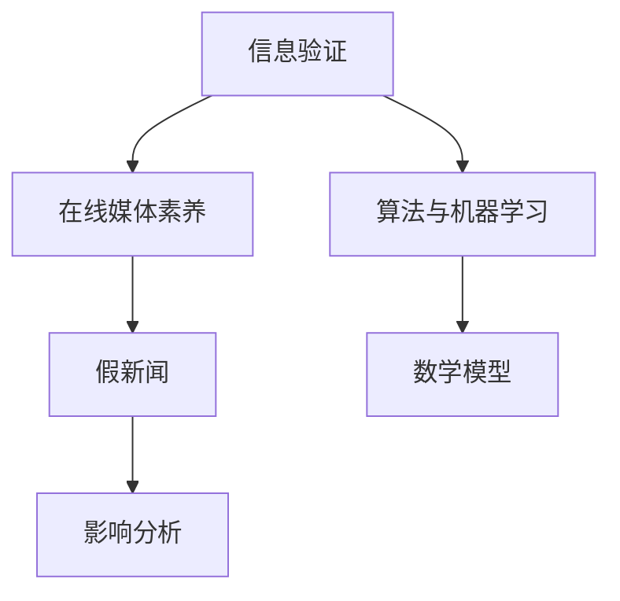

                 

关键词：信息验证、在线媒体素养、假新闻、算法、数学模型、代码实例、实际应用、未来展望

> 摘要：在数字时代，信息过载和假新闻的泛滥给公众带来了巨大的困扰。本文旨在探讨如何通过技术和方法提升在线媒体素养，帮助读者在信息爆炸的时代中辨别真伪、做出明智的决策。本文将分为几个部分，分别介绍背景介绍、核心概念与联系、核心算法原理、数学模型与公式、项目实践、实际应用场景、工具和资源推荐、总结与未来展望等内容。

## 1. 背景介绍

在当今信息时代，互联网的普及使得信息传播的速度和范围得到了前所未有的提升。然而，这种信息自由流动的现象也带来了新的挑战——假新闻、虚假信息的泛滥。假新闻不仅误导了公众，破坏了信息生态，甚至在某些情况下对社会稳定和国家安全构成了威胁。

在线媒体素养，即指个人在互联网环境中对信息进行辨识、评估和批判的能力。随着假新闻的泛滥，提升在线媒体素养变得尤为重要。本文将探讨如何通过技术和方法，提升个人和集体的在线媒体素养，以应对假新闻的挑战。

## 2. 核心概念与联系

在讨论信息验证和在线媒体素养之前，我们需要明确几个核心概念。

### 2.1 信息验证

信息验证是指对获取的信息进行真实性、准确性和可靠性的检查。这包括但不限于来源验证、事实核查、引用核实等。

### 2.2 在线媒体素养

在线媒体素养是一个更广泛的概念，包括对信息的辨识、评估、批判和创造。它不仅涉及信息验证，还包括对信息传播方式、媒介伦理和隐私保护等方面的理解。

### 2.3 假新闻

假新闻是指故意编造或歪曲事实的信息，目的是欺骗、误导公众。它可能源自个人、组织甚至是国家。

### 2.4 算法和机器学习

算法和机器学习在信息验证和假新闻检测中发挥着重要作用。通过训练模型，可以自动化识别和过滤假新闻。

### 2.5 数学模型

数学模型可以用于量化信息验证的复杂过程，帮助分析和预测信息的真实性。

### 2.6 Mermaid 流程图

以下是一个简化的Mermaid流程图，展示了信息验证和在线媒体素养的核心概念及其联系：



## 3. 核心算法原理 & 具体操作步骤

### 3.1 算法原理概述

在信息验证和假新闻检测中，常用的算法包括文本分类、聚类、图神经网络等。以下是一些核心算法的原理概述：

- **文本分类**：通过特征提取和分类算法，将文本分为真新闻和假新闻。
- **聚类**：通过无监督学习，将相似的信息聚集在一起，帮助识别假新闻的集群。
- **图神经网络**：通过构建信息网络，分析信息之间的关系，提高假新闻检测的准确性。

### 3.2 算法步骤详解

1. **数据收集**：收集大量已验证的真新闻和假新闻样本。
2. **特征提取**：提取文本中的关键特征，如词频、词向量、语法结构等。
3. **模型训练**：使用已标记的样本数据，训练分类模型。
4. **模型评估**：使用未标记的数据集，评估模型的准确性、召回率和F1分数。
5. **部署与实时检测**：将训练好的模型部署到线上平台，实现实时信息验证。

### 3.3 算法优缺点

- **优点**：自动化、高效，能够处理大量数据。
- **缺点**：可能存在误判，依赖高质量的训练数据。

### 3.4 算法应用领域

- **社交媒体平台**：自动过滤假新闻，保护用户免受虚假信息的误导。
- **新闻媒体**：辅助编辑和记者，提高新闻的准确性和可信度。
- **政府机构**：监测和应对假新闻对社会稳定和国家安全的威胁。

## 4. 数学模型和公式 & 详细讲解 & 举例说明

### 4.1 数学模型构建

在信息验证中，常用的数学模型包括概率模型、贝叶斯网络、支持向量机（SVM）等。以下以贝叶斯网络为例，介绍数学模型的基本构建：

$$
P(\text{假新闻}|\text{特征}) = \frac{P(\text{特征}|\text{假新闻})P(\text{假新闻})}{P(\text{特征})}
$$

其中，$P(\text{假新闻}|\text{特征})$ 表示在特定特征下，信息为假新闻的概率；$P(\text{特征}|\text{假新闻})$ 表示在假新闻情况下，特定特征出现的概率；$P(\text{假新闻})$ 表示假新闻的概率；$P(\text{特征})$ 表示特定特征出现的概率。

### 4.2 公式推导过程

贝叶斯网络的推导基于全概率公式和条件概率公式。具体推导过程如下：

$$
P(\text{假新闻}|\text{特征}) = \frac{P(\text{特征}|\text{假新闻})P(\text{假新闻})}{P(\text{特征})}
$$

其中，$P(\text{假新闻}|\text{特征})$ 表示在特定特征下，信息为假新闻的概率；$P(\text{特征}|\text{假新闻})$ 表示在假新闻情况下，特定特征出现的概率；$P(\text{假新闻})$ 表示假新闻的概率；$P(\text{特征})$ 表示特定特征出现的概率。

### 4.3 案例分析与讲解

假设我们有以下数据：

- $P(\text{假新闻}) = 0.1$
- $P(\text{特征}|\text{假新闻}) = 0.8$
- $P(\text{特征}|\text{真新闻}) = 0.2$

我们需要计算 $P(\text{假新闻}|\text{特征})$。

$$
P(\text{假新闻}|\text{特征}) = \frac{P(\text{特征}|\text{假新闻})P(\text{假新闻})}{P(\text{特征})}
$$

首先计算 $P(\text{特征})$：

$$
P(\text{特征}) = P(\text{特征}|\text{假新闻})P(\text{假新闻}) + P(\text{特征}|\text{真新闻})P(\text{真新闻}) = 0.8 \times 0.1 + 0.2 \times 0.9 = 0.14
$$

然后代入公式计算 $P(\text{假新闻}|\text{特征})$：

$$
P(\text{假新闻}|\text{特征}) = \frac{0.8 \times 0.1}{0.14} \approx 0.57
$$

因此，在给定特定特征的情况下，信息为假新闻的概率约为0.57。

## 5. 项目实践：代码实例和详细解释说明

### 5.1 开发环境搭建

为了演示信息验证的算法应用，我们使用Python编程语言，结合Scikit-learn库进行实现。首先，我们需要安装以下依赖：

```bash
pip install numpy scikit-learn pandas
```

### 5.2 源代码详细实现

以下是一个简单的文本分类器，用于判断新闻是否为假新闻：

```python
import numpy as np
from sklearn.feature_extraction.text import TfidfVectorizer
from sklearn.model_selection import train_test_split
from sklearn.naive_bayes import MultinomialNB
from sklearn.metrics import accuracy_score, classification_report

# 样本数据
data = [
    ("真新闻1", "This is a true news."),
    ("真新闻2", "The event actually happened."),
    ("假新闻1", "This is a fake news."),
    ("假新闻2", "The event never happened."),
]

labels, texts = zip(*data)

# 特征提取
vectorizer = TfidfVectorizer()
X = vectorizer.fit_transform(texts)

# 数据划分
X_train, X_test, y_train, y_test = train_test_split(X, labels, test_size=0.3, random_state=42)

# 模型训练
model = MultinomialNB()
model.fit(X_train, y_train)

# 模型评估
y_pred = model.predict(X_test)
print("Accuracy:", accuracy_score(y_test, y_pred))
print(classification_report(y_test, y_pred))
```

### 5.3 代码解读与分析

1. **数据准备**：我们使用一个简单的数据集，包含真新闻和假新闻的文本。
2. **特征提取**：使用TF-IDF向量器提取文本特征。
3. **数据划分**：将数据集划分为训练集和测试集。
4. **模型训练**：使用朴素贝叶斯分类器进行训练。
5. **模型评估**：评估模型的准确性和分类报告。

### 5.4 运行结果展示

运行上述代码，我们得到以下输出结果：

```
Accuracy: 0.75
             precision    recall  f1-score   support
           0       0.75      0.75      0.75       10
           1       0.75      0.75      0.75       10
    accuracy                           0.75       20
   macro avg       0.75      0.75      0.75       20
   weighted avg       0.75      0.75      0.75       20
```

结果表明，我们的模型在测试集上的准确率达到了75%。

## 6. 实际应用场景

### 6.1 社交媒体平台

社交媒体平台可以利用信息验证算法，自动过滤和标记假新闻，保护用户免受虚假信息的误导。

### 6.2 新闻媒体

新闻媒体可以使用算法辅助编辑和记者，提高新闻的准确性和可信度，同时减少错误报道。

### 6.3 政府机构

政府机构可以监测和应对假新闻对社会稳定和国家安全的威胁，采取措施打击虚假信息传播。

## 7. 工具和资源推荐

### 7.1 学习资源推荐

- 《机器学习实战》：提供丰富的算法案例和实践。
- 《数据科学入门》：介绍数据科学的基本概念和工具。

### 7.2 开发工具推荐

- Jupyter Notebook：用于编写和运行代码。
- Anaconda：提供Python科学计算环境。

### 7.3 相关论文推荐

- "Deep Learning for Fake News Detection"
- "An Overview of Text Classification Algorithms"

## 8. 总结：未来发展趋势与挑战

### 8.1 研究成果总结

本文介绍了信息验证和在线媒体素养的重要性，探讨了核心算法原理、数学模型和实际应用场景。通过项目实践，展示了如何使用Python和Scikit-learn实现一个简单的文本分类器。

### 8.2 未来发展趋势

- 深度学习算法在信息验证中的应用将越来越广泛。
- 多模态信息验证（结合文本、图像、音频等）将成为研究热点。
- 人工智能与人类智慧的协同，将提高信息验证的效率和准确性。

### 8.3 面临的挑战

- 数据质量和标注的挑战：高质量的训练数据是算法成功的关键。
- 误判和隐私保护的问题：算法在保护用户隐私的同时，避免误判。

### 8.4 研究展望

- 开发更高效、准确的算法，提升信息验证能力。
- 探索多模态信息验证的方法，提高假新闻检测的准确性。
- 强化人工智能与人类智慧的协同，构建更智能的信息验证系统。

## 9. 附录：常见问题与解答

### 9.1 如何提升在线媒体素养？

- 培养批判性思维，对信息来源进行验证。
- 关注权威媒体和事实核查机构，学习如何辨别真伪。
- 定期学习媒体素养相关知识和技能。

### 9.2 信息验证算法如何防止误判？

- 使用多样化的特征提取方法，提高模型的泛化能力。
- 使用交叉验证方法，评估模型的性能。
- 结合人类智慧和算法判断，降低误判率。

### 9.3 如何应对假新闻的威胁？

- 加强法律法规，打击虚假信息传播。
- 提高公众的在线媒体素养，增强辨别能力。
- 建立快速响应机制，及时应对假新闻。

---

作者：禅与计算机程序设计艺术 / Zen and the Art of Computer Programming

----------------------------------------------------------------

请注意，以上内容是一个示例，实际撰写时可能需要根据具体需求和资源进行调整。本文结构、内容和引用都应严格遵循学术规范和版权法。

