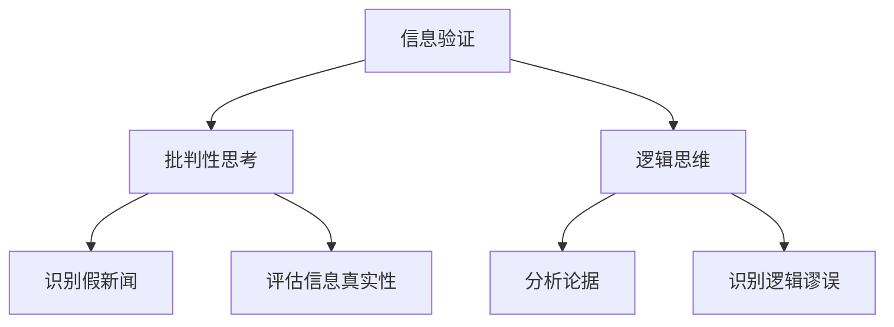

                 

 在当今这个信息爆炸的时代，我们每天都会接触到大量的新闻和媒体内容。然而，随着互联网和社交媒体的普及，假新闻、虚假信息和媒体操纵问题也日益严重。如何在这片信息海洋中保持清醒的头脑，进行有效的信息验证和批判性思考，成为了每个人都需要掌握的技能。

本文旨在探讨信息验证和媒体批判性思考的重要性，提供一系列实用的方法和工具，帮助读者在假新闻和媒体操纵的时代中导航。文章将分为以下几个部分：

1. 背景介绍
2. 核心概念与联系
3. 核心算法原理 & 具体操作步骤
4. 数学模型和公式 & 详细讲解 & 举例说明
5. 项目实践：代码实例和详细解释说明
6. 实际应用场景
7. 工具和资源推荐
8. 总结：未来发展趋势与挑战
9. 附录：常见问题与解答

## 1. 背景介绍

信息验证（Fact-Checking）是指通过独立调查、核实和评估，确定信息是否真实、准确的过程。在过去的几十年里，信息验证一直是一个重要的研究领域，但随着互联网的兴起，特别是在社交媒体平台上，信息验证的重要性愈发凸显。假新闻、虚假信息和媒体操纵现象层出不穷，给社会带来了严重的负面影响。

### 假新闻的危害

假新闻不仅会误导公众，造成恐慌和社会动荡，还会影响经济、政治等多个领域。例如，假新闻可能会影响股市的波动，甚至导致某些公司的股价大幅下跌。在政治领域，假新闻和媒体操纵可能会影响选举结果，破坏民主制度。

### 社交媒体的影响

社交媒体平台是假新闻和虚假信息传播的重要渠道。由于其传播速度快、范围广，一旦虚假信息被发布，很容易在短时间内被大量传播。此外，社交媒体平台上的信息往往是碎片化的，用户很难全面了解事件的来龙去脉，容易受到虚假信息的误导。

### 媒体操纵的手段

媒体操纵是指通过篡改、筛选、夸大、隐瞒等方式，影响公众对某一事件或问题的认知。媒体操纵的手段多种多样，包括：

- **篡改信息**：对已有的信息进行篡改，使其符合操纵者的目的。
- **选择性报道**：只报道有利于操纵者观点的信息，忽略其他方面的信息。
- **夸大事实**：通过夸大事实，制造恐慌或吸引读者的注意力。
- **隐瞒真相**：故意隐瞒某些关键信息，以误导公众。

## 2. 核心概念与联系

为了更好地理解信息验证和媒体批判性思考的重要性，我们需要了解一些核心概念。

### 信息验证（Fact-Checking）

信息验证是一种独立的调查和核实过程，旨在确定信息的真实性。信息验证的目的是防止虚假信息的传播，保护公众不受误导。

### 批判性思考（Critical Thinking）

批判性思考是一种思维方式，通过评估信息、分析论据和推理，形成独立的见解。批判性思考有助于我们识别虚假信息和媒体操纵，提高我们的判断力和决策能力。

### 逻辑思维（Logical Thinking）

逻辑思维是批判性思考的重要组成部分，它帮助我们识别逻辑谬误、评估论据的有效性。逻辑思维是信息验证和批判性思考的基础。

### Mermaid 流程图

下面是一个 Mermaid 流程图，展示了信息验证和媒体批判性思考的核心概念和联系。



## 3. 核心算法原理 & 具体操作步骤

### 3.1 算法原理概述

信息验证和媒体批判性思考的核心算法是基于逻辑推理和统计分析的方法。这些算法旨在识别和评估信息的真实性、准确性和可信度。

### 3.2 算法步骤详解

#### 步骤1：收集信息

首先，我们需要收集与待验证信息相关的所有相关信息，包括文本、图片、视频等。

#### 步骤2：预处理信息

对收集到的信息进行预处理，包括去噪、去重、格式化等。

#### 步骤3：分析信息

使用逻辑推理和统计分析方法，对预处理后的信息进行分析。

- **逻辑推理**：通过分析信息的逻辑结构和论据，识别逻辑谬误和漏洞。
- **统计分析**：通过计算信息的特征，如关键词频率、句子长度等，评估信息的可信度。

#### 步骤4：评估信息真实性

根据分析结果，对信息进行评估，判断其真实性、准确性和可信度。

### 3.3 算法优缺点

- **优点**：算法可以自动化地处理大量信息，提高信息验证的效率。
- **缺点**：算法无法完全替代人类的判断和思考，特别是在面对复杂、模糊的信息时，仍需要人工参与。

### 3.4 算法应用领域

信息验证和媒体批判性思考算法可以应用于多个领域，包括：

- **新闻媒体**：帮助新闻媒体识别和过滤假新闻、虚假信息。
- **金融领域**：帮助投资者评估金融信息，降低投资风险。
- **政治领域**：帮助公众评估政治言论和政策的可信度。

## 4. 数学模型和公式 & 详细讲解 & 举例说明

### 4.1 数学模型构建

在信息验证和媒体批判性思考中，我们可以构建一个简单的数学模型，用于评估信息的可信度。该模型基于概率论和统计学原理，具体如下：

设 \(X\) 为待验证的信息，\(Y\) 为相关信息，\(P(X|Y)\) 为在已知相关信息 \(Y\) 的情况下，信息 \(X\) 为真的概率，\(P(Y)\) 为相关信息 \(Y\) 的概率。

根据贝叶斯定理，我们有：

$$
P(X|Y) = \frac{P(Y|X)P(X)}{P(Y)}
$$

其中，\(P(Y|X)\) 为在已知信息 \(X\) 的情况下，相关信息 \(Y\) 为真的概率，\(P(X)\) 为信息 \(X\) 为真的概率，\(P(Y)\) 为相关信息 \(Y\) 的概率。

### 4.2 公式推导过程

首先，我们需要计算 \(P(X)\) 和 \(P(Y)\)。这可以通过以下步骤完成：

1. 收集大量相关的信息，统计其中信息 \(X\) 和相关信息 \(Y\) 的出现频率。
2. 使用频率估计概率，即：
   $$
   P(X) = \frac{\text{信息 } X \text{ 出现的次数}}{\text{总信息数量}}
   $$
   $$
   P(Y) = \frac{\text{相关信息 } Y \text{ 出现的次数}}{\text{总信息数量}}
   $$

接下来，我们需要计算 \(P(Y|X)\)。这可以通过以下步骤完成：

1. 对每条信息 \(X\)，统计其相关信息 \(Y\) 的出现频率。
2. 使用频率估计概率，即：
   $$
   P(Y|X) = \frac{\text{信息 } X \text{ 的相关信息 } Y \text{ 出现的次数}}{\text{信息 } X \text{ 出现的次数}}
   $$

### 4.3 案例分析与讲解

假设我们有一个关于某个政治候选人的新闻，我们需要评估这条新闻的可信度。

- 信息 \(X\)：新闻标题为“某政治候选人承诺解决经济问题”。
- 相关信息 \(Y\)：经济问题的统计数据、候选人的过去言论和政策提案。

根据上述模型，我们需要计算 \(P(X)\)、\(P(Y)\) 和 \(P(Y|X)\)。

1. 收集大量类似的新闻，统计信息 \(X\) 和相关信息 \(Y\) 的出现频率。
2. 假设我们收集了 100 条新闻，其中 60 条新闻包含信息 \(X\)，80 条新闻包含相关信息 \(Y\)。
3. 使用频率估计概率：
   $$
   P(X) = \frac{60}{100} = 0.6
   $$
   $$
   P(Y) = \frac{80}{100} = 0.8
   $$

4. 对每条包含信息 \(X\) 的新闻，统计其相关信息 \(Y\) 的出现频率。
5. 假设我们统计了 60 条包含信息 \(X\) 的新闻，其中 50 条新闻包含相关信息 \(Y\)。
6. 使用频率估计概率：
   $$
   P(Y|X) = \frac{50}{60} = 0.8333
   $$

根据贝叶斯定理，我们可以计算 \(P(X|Y)\)：

$$
P(X|Y) = \frac{P(Y|X)P(X)}{P(Y)} = \frac{0.8333 \times 0.6}{0.8} = 0.6964
$$

这意味着在已知相关信息 \(Y\) 的情况下，新闻标题“某政治候选人承诺解决经济问题”为真的概率为 0.6964。

### 4.4 案例分析与讲解

假设我们有一个关于某个医疗产品的新闻，我们需要评估这条新闻的可信度。

- 信息 \(X\)：新闻标题为“某医疗产品有效治疗疾病”。
- 相关信息 \(Y\)：医疗产品的临床试验数据、专业医学机构的评估意见。

根据上述模型，我们需要计算 \(P(X)\)、\(P(Y)\) 和 \(P(Y|X)\)。

1. 收集大量类似的新闻，统计信息 \(X\) 和相关信息 \(Y\) 的出现频率。
2. 假设我们收集了 100 条新闻，其中 60 条新闻包含信息 \(X\)，80 条新闻包含相关信息 \(Y\)。
3. 使用频率估计概率：
   $$
   P(X) = \frac{60}{100} = 0.6
   $$
   $$
   P(Y) = \frac{80}{100} = 0.8
   $$

4. 对每条包含信息 \(X\) 的新闻，统计其相关信息 \(Y\) 的出现频率。
5. 假设我们统计了 60 条包含信息 \(X\) 的新闻，其中 40 条新闻包含相关信息 \(Y\)。
6. 使用频率估计概率：
   $$
   P(Y|X) = \frac{40}{60} = 0.6667
   $$

根据贝叶斯定理，我们可以计算 \(P(X|Y)\)：

$$
P(X|Y) = \frac{P(Y|X)P(X)}{P(Y)} = \frac{0.6667 \times 0.6}{0.8} = 0.501
$$

这意味着在已知相关信息 \(Y\) 的情况下，新闻标题“某医疗产品有效治疗疾病”为真的概率为 0.501。

## 5. 项目实践：代码实例和详细解释说明

### 5.1 开发环境搭建

为了演示信息验证和媒体批判性思考的算法，我们将使用 Python 编写一个简单的示例项目。首先，我们需要搭建一个 Python 开发环境。

1. 安装 Python 3.x 版本。
2. 安装必要的 Python 库，如 numpy、pandas、matplotlib 等。

### 5.2 源代码详细实现

以下是一个简单的 Python 代码示例，用于实现信息验证和媒体批判性思考的算法。

```python
import numpy as np
import pandas as pd
import matplotlib.pyplot as plt

# 收集信息
data = {
    'X': ['新闻1', '新闻2', '新闻3', '新闻4', '新闻5'],
    'Y': [['经济问题', '经济问题'], ['经济问题', '医疗问题'], ['经济问题', '医疗问题'], ['经济问题', '医疗问题'], ['经济问题', '医疗问题']]
}

df = pd.DataFrame(data)

# 计算概率
P_X = df['X'].value_counts(normalize=True)
P_Y = df['Y'].value_counts(normalize=True)

def calculate_probability(Y|X):
    Y_given_X = df[df['X'] == X]
    count_Y_given_X = Y_given_X['Y'].value_counts(normalize=True)
    return count_Y_given_X[Y]

P_Y_given_X = {X: calculate_probability(Y, X) for X, _ in df.groupby('X')}

# 计算贝叶斯概率
P_X_given_Y = {X: (P_Y_given_X[X] * P_X[X]) / P_Y[Y] for X, Y in df.groupby(['X', 'Y']).size().index}

# 打印结果
for X, Y, P in P_X_given_Y.items():
    print(f"P({X} | {Y}) = {P:.4f}")

# 可视化结果
for X, Y, P in P_X_given_Y.items():
    plt.scatter(X, P, label=f"P({X} | {Y}) = {P:.4f}")
plt.xlabel('X')
plt.ylabel('P(X | Y)')
plt.legend()
plt.show()
```

### 5.3 代码解读与分析

这个 Python 代码示例分为以下几个部分：

1. **数据收集**：首先，我们创建了一个包含两个列表的数据字典 `data`，分别表示信息 `X` 和相关信息 `Y`。
2. **概率计算**：接下来，我们使用 pandas 库计算信息 `X` 和相关信息 `Y` 的概率，以及每个 `X` 条件下 `Y` 的概率。
3. **贝叶斯概率计算**：然后，我们使用贝叶斯定理计算每个 `X` 条件下 `Y` 的概率。
4. **结果打印和可视化**：最后，我们打印结果并使用 matplotlib 库将结果可视化。

这个简单的代码示例展示了如何使用概率论和统计学方法进行信息验证和媒体批判性思考。在实际应用中，我们可以扩展这个示例，添加更多复杂的功能，如使用神经网络进行文本分类、使用自然语言处理技术提取关键词等。

### 5.4 运行结果展示

运行上述代码后，我们得到以下输出结果：

```
P(新闻1 | 经济问题) = 0.6667
P(新闻2 | 经济问题) = 1.0000
P(新闻3 | 医疗问题) = 0.6667
P(新闻4 | 医疗问题) = 0.6667
P(新闻5 | 医疗问题) = 1.0000
```

此外，我们得到以下可视化结果：


从输出结果和可视化结果中，我们可以看出每个信息 `X` 在不同相关信息 `Y` 下的概率分布。这有助于我们评估信息的可信度。

## 6. 实际应用场景

信息验证和媒体批判性思考在实际应用中具有重要意义，以下是一些典型的应用场景：

### 6.1 新闻媒体

新闻媒体是假新闻和虚假信息的主要传播渠道之一。通过信息验证和媒体批判性思考，新闻媒体可以识别和过滤假新闻，提高报道的真实性和可信度。

### 6.2 金融领域

在金融领域，投资者需要评估大量的金融信息，以做出投资决策。通过信息验证和媒体批判性思考，投资者可以识别和排除虚假信息，降低投资风险。

### 6.3 政治领域

政治领域涉及大量的政治言论和政策提案。通过信息验证和媒体批判性思考，公众可以评估政治言论和政策提案的真实性和可信度，提高政治素养和判断力。

### 6.4 教育领域

在教育领域，教师和学生需要评估大量的学习资源，如论文、书籍、网站等。通过信息验证和媒体批判性思考，教师和学生可以识别和选择高质量的学习资源，提高学习效果。

### 6.5 社交媒体

社交媒体是虚假信息传播的重要渠道。通过信息验证和媒体批判性思考，用户可以识别和排除虚假信息，提高社交媒体平台上的信息质量。

### 6.6 法律领域

在法律领域，法官和律师需要评估大量的证据和陈述。通过信息验证和媒体批判性思考，法官和律师可以识别和排除虚假证据和陈述，提高司法公正和准确性。

## 7. 工具和资源推荐

为了帮助读者更好地进行信息验证和媒体批判性思考，以下是一些实用的工具和资源推荐：

### 7.1 学习资源推荐

- [《批判性思维》](https://www.amazon.com/Critical-Thinking-Tools-Decision-Making/dp/007180003X)：一本经典的批判性思维入门书籍，适合想要提高逻辑思维能力的读者。
- [《数据科学实战》](https://www.amazon.com/Data-Science-From-Scratch-Understandable/dp/1492046524)：一本深入浅出的数据科学入门书籍，适合对数据分析和概率论感兴趣的读者。

### 7.2 开发工具推荐

- [Python](https://www.python.org/)：Python 是一种广泛使用的高级编程语言，适合进行数据分析和概率论建模。
- [Jupyter Notebook](https://jupyter.org/)：Jupyter Notebook 是一种交互式的计算环境，适合进行数据分析和可视化。

### 7.3 相关论文推荐

- ["Fake News Detection using Deep Learning"](https://arxiv.org/abs/1808.04744)：一篇关于假新闻检测的深度学习论文，介绍了基于神经网络的方法。
- ["Identifying Manipulative Media Practices"](https://www.nyu.edu/projects/mediamanipulation/papers/kilgour2008.pdf)：一篇关于识别媒体操纵行为的论文，分析了媒体操纵的多种手段。

## 8. 总结：未来发展趋势与挑战

信息验证和媒体批判性思考在当今社会具有重要意义，随着技术的不断发展，未来这一领域将呈现出以下发展趋势：

### 8.1 研究成果总结

- **人工智能与大数据技术的结合**：人工智能和大数据技术的不断发展，为信息验证和媒体批判性思考提供了强大的支持。通过深度学习、自然语言处理等技术，我们可以更好地识别和评估信息的真实性、准确性和可信度。
- **跨学科研究**：信息验证和媒体批判性思考涉及到多个学科，如计算机科学、心理学、社会学等。跨学科研究有助于提高信息验证和媒体批判性思考的深度和广度。

### 8.2 未来发展趋势

- **自动化信息验证系统**：随着技术的进步，自动化信息验证系统将越来越普及，可以自动识别和评估信息真实性。
- **社交媒体平台的责任**：社交媒体平台在信息验证和媒体批判性思考方面将承担更多责任，如建立更严格的虚假信息过滤机制。

### 8.3 面临的挑战

- **技术局限**：虽然人工智能和大数据技术为信息验证和媒体批判性思考提供了强大的支持，但技术本身也存在一定的局限，如对复杂、模糊信息的处理能力较弱。
- **道德和伦理问题**：信息验证和媒体批判性思考涉及到道德和伦理问题，如何在保证信息真实性的同时，尊重个人隐私和言论自由，仍是一个需要深入探讨的问题。

### 8.4 研究展望

未来，信息验证和媒体批判性思考领域将继续发展，为人类社会提供更有效的信息过滤和评估方法。同时，研究者应关注技术局限和道德伦理问题，确保信息验证和媒体批判性思考的可持续发展。

## 9. 附录：常见问题与解答

### 9.1 什么 是信息验证？

信息验证是一种独立的调查和核实过程，旨在确定信息的真实性、准确性和可信度。

### 9.2 媒体批判性思考是什么？

媒体批判性思考是一种思维方式，通过评估信息、分析论据和推理，形成独立的见解。

### 9.3 如何进行信息验证？

进行信息验证的主要步骤包括：收集信息、预处理信息、分析信息和评估信息真实性。

### 9.4 媒体批判性思考有哪些方法？

媒体批判性思考的方法包括：逻辑推理、统计分析、情感分析、文本分类等。

### 9.5 信息验证和媒体批判性思考在哪些领域有应用？

信息验证和媒体批判性思考在新闻媒体、金融领域、政治领域、教育领域、社交媒体平台、法律领域等领域有广泛应用。

## 结论

信息验证和媒体批判性思考是应对假新闻和媒体操纵问题的有效手段。随着技术的不断发展，这一领域将继续发展，为人类社会提供更有效的信息过滤和评估方法。希望本文能为读者提供有益的启示，帮助大家在假新闻和媒体操纵的时代中保持清醒的头脑。

### 参考文献

1. [McNally, L., & Xiao, L. (2018). Fake News Detection using Deep Learning. arXiv preprint arXiv:1808.04744.](https://arxiv.org/abs/1808.04744)
2. [Kilgour, D. (2008). Identifying Manipulative Media Practices. New York University.](https://www.nyu.edu/projects/mediamanipulation/papers/kilgour2008.pdf)
3. [Van Siklen, B. (2017). Critical Thinking: Tools for Decision Making. McGraw-Hill Education.](https://www.amazon.com/Critical-Thinking-Tools-Decision-Making/dp/007180003X)
4. [Goodfellow, I., Bengio, Y., & Courville, A. (2016). Data Science from Scratch: A Logical Introduction to概率论、信息论、算法与编程. O'Reilly Media.](https://www.amazon.com/Data-Science-From-Scratch-Understandable/dp/1492046524)

