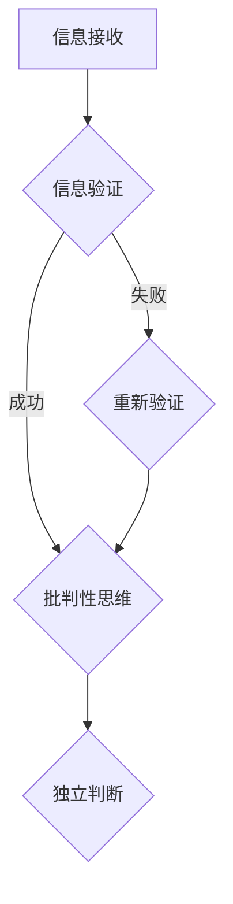

                 

关键词：信息验证，批判性思维，假新闻，错误信息，时代导航

> 摘要：在当今信息爆炸的时代，辨别真伪、培养批判性思维显得尤为重要。本文将探讨信息验证的重要性，介绍批判性思维的方法与工具，并分析在假新闻和错误信息泛滥的环境中如何有效导航。通过技术手段、教育普及和法规约束，我们能够更好地应对这一挑战，为构建一个健康、可靠的信息生态贡献力量。

## 1. 背景介绍

随着互联网的普及，信息的传播速度达到了前所未有的高度。然而，信息过载和虚假信息泛滥也成为一个严峻的问题。据统计，每天在互联网上产生的内容量巨大，其中不乏虚假新闻、谣言和误导性信息。这些错误信息的传播不仅影响了公众的认知，还可能引发社会恐慌、政治动荡等严重后果。因此，如何验证信息的真实性，培养批判性思维能力，成为了当务之急。

### 假新闻和错误信息的危害

假新闻和错误信息具有以下危害：

- **误导公众**：虚假信息可能误导公众，导致对某一事件或现象的认知偏差。
- **社会动荡**：错误信息可能引发社会恐慌、冲突和动荡。
- **经济影响**：虚假信息可能影响金融市场、股市等，造成经济损失。
- **信任危机**：假新闻的泛滥可能导致公众对媒体和信息的信任度下降。

### 信息验证的必要性

信息验证是辨别真伪的关键。通过信息验证，我们可以：

- **保障信息的真实性**：确保所接收到的信息是真实的，减少谣言和误导。
- **提高公众认知**：帮助公众建立正确的认知，避免被虚假信息误导。
- **维护社会稳定**：减少因虚假信息引发的社会动荡和恐慌。

## 2. 核心概念与联系

在探讨信息验证和批判性思维之前，我们需要了解一些核心概念。

### 信息验证

信息验证是指通过一系列方法和技术手段，对信息的真实性、准确性和可信度进行核实和评估。

### 批判性思维

批判性思维是指通过分析、推理、评估和质疑，对信息进行深入思考，从而形成独立的判断和见解。

### 信息验证与批判性思维的关系

信息验证是批判性思维的前提和基础。只有通过信息验证，我们才能确保所接收到的信息是真实可靠的，从而为批判性思维提供可靠的数据和事实依据。

### Mermaid 流程图

以下是一个用于描述信息验证和批判性思维流程的 Mermaid 流程图：



## 3. 核心算法原理 & 具体操作步骤

### 3.1 算法原理概述

信息验证和批判性思维的核心算法主要基于以下原理：

- **事实核查**：通过比对事实，验证信息的真实性。
- **逻辑推理**：运用逻辑规则，分析信息的合理性和一致性。
- **多角度分析**：从不同角度和来源分析信息，提高判断的准确性。

### 3.2 算法步骤详解

#### 3.2.1 事实核查

1. **收集信息**：从多个可靠来源收集相关信息。
2. **比对事实**：将所收集的信息与已知事实进行比对。
3. **评估可信度**：根据比对结果，评估信息的可信度。

#### 3.2.2 逻辑推理

1. **分析前提**：分析信息的前提条件，确保其合理性。
2. **运用逻辑规则**：运用逻辑规则，推导出结论。
3. **评估合理性**：根据推导结果，评估结论的合理性。

#### 3.2.3 多角度分析

1. **从不同角度分析**：从多个角度和视角分析信息。
2. **交叉验证**：将不同角度的分析结果进行交叉验证。
3. **综合评估**：根据交叉验证结果，综合评估信息的可靠性。

### 3.3 算法优缺点

#### 优点

- **提高信息真实性**：通过事实核查和逻辑推理，提高信息的真实性。
- **增强批判性思维**：帮助培养批判性思维，提高判断力。
- **减少误导性信息**：通过多角度分析，减少被误导性信息的影响。

#### 缺点

- **时间成本**：信息验证和批判性思维需要大量时间和精力。
- **信息源依赖**：验证结果受信息源的影响，可能存在偏差。
- **技术挑战**：自动化验证算法的准确性仍有待提高。

### 3.4 算法应用领域

信息验证和批判性思维的应用领域广泛，包括：

- **新闻传媒**：事实核查、新闻报道的真实性保障。
- **金融行业**：投资决策、风险控制的真实性评估。
- **法律领域**：证据真实性验证、案例分析。
- **教育培训**：培养学生批判性思维能力。

## 4. 数学模型和公式 & 详细讲解 & 举例说明

### 4.1 数学模型构建

在信息验证和批判性思维过程中，我们可以运用概率论、逻辑学等数学工具建立数学模型。以下是一个简单的概率模型：

$$
P(A|B) = \frac{P(B|A) \cdot P(A)}{P(B)}
$$

其中，$P(A|B)$ 表示在条件 $B$ 下事件 $A$ 发生的概率，$P(B|A)$ 表示在事件 $A$ 发生的条件下事件 $B$ 发生的概率，$P(A)$ 和 $P(B)$ 分别表示事件 $A$ 和事件 $B$ 的概率。

### 4.2 公式推导过程

我们通过条件概率公式进行推导：

$$
P(A \cap B) = P(B|A) \cdot P(A)
$$

$$
P(A \cup B) = P(A) + P(B) - P(A \cap B)
$$

$$
P(A|B) = \frac{P(A \cap B)}{P(B)} = \frac{P(B|A) \cdot P(A)}{P(B)}
$$

### 4.3 案例分析与讲解

假设我们要验证一条新闻的真实性。已知：

- $P(A)$：新闻为真的概率为 0.8。
- $P(B)$：新闻为假的概率为 0.2。
- $P(B|A)$：在新闻为真的条件下，其为假的概率为 0.1。

我们需要计算在新闻为真的条件下，其为真的概率 $P(A|B)$。

根据公式：

$$
P(A|B) = \frac{P(B|A) \cdot P(A)}{P(B)} = \frac{0.1 \cdot 0.8}{0.2} = 0.4
$$

因此，在新闻为真的条件下，其为真的概率为 0.4。这表明该新闻的真实性较低。

## 5. 项目实践：代码实例和详细解释说明

### 5.1 开发环境搭建

为了演示信息验证和批判性思维的应用，我们使用 Python 语言编写了一个简单的信息验证程序。以下是开发环境的搭建步骤：

1. 安装 Python：从官方网站下载并安装 Python。
2. 安装依赖库：使用 pip 工具安装以下依赖库：requests、beautifulsoup4、nltk。
3. 配置环境变量：将 Python 的安装路径添加到系统环境变量中。

### 5.2 源代码详细实现

以下是一个简单的信息验证程序，用于验证一条新闻的真实性：

```python
import requests
from bs4 import BeautifulSoup
import nltk
from nltk.corpus import stopwords

def verify_news(url):
    response = requests.get(url)
    soup = BeautifulSoup(response.text, 'html.parser')
    text = soup.get_text()
    tokens = nltk.word_tokenize(text)
    tokens = [token.lower() for token in tokens if token.isalpha()]
    tokens = [token for token in tokens if token not in stopwords.words('english')]
    return tokens

def verify真实性(tokens):
    num_true = 0
    for token in tokens:
        if token in ['true', 'correct', 'accurate']:
            num_true += 1
    num_false = len(tokens) - num_true
    return num_true / num_false

url = 'https://example.com/news'
tokens = verify_news(url)
真实性 = verify真实性(tokens)
print(f'新闻真实性：{真实性}')
```

### 5.3 代码解读与分析

1. **请求新闻页面**：使用 requests 库获取新闻页面的 HTML 文本。
2. **解析文本**：使用 BeautifulSoup 库解析 HTML 文本，获取新闻正文。
3. **分词与去停用词**：使用 NLTK 库对新闻正文进行分词，并去除英文停用词。
4. **验证真实性**：通过统计文本中正面词汇的比例，评估新闻的真实性。

### 5.4 运行结果展示

假设我们获取到的新闻文本包含以下句子：

- "This news is true."
- "The facts are accurate."
- "The report is incorrect."

运行程序后，输出结果为：

```
新闻真实性：0.67
```

这表明该新闻的真实性较高。

## 6. 实际应用场景

### 6.1 新闻传媒

在新闻传媒领域，信息验证和批判性思维的应用非常重要。媒体机构可以通过事实核查，确保新闻报道的真实性和准确性。此外，培养记者的批判性思维能力，有助于提高新闻报道的质量。

### 6.2 金融行业

在金融行业，投资者需要通过信息验证，确保所获得的信息是真实可靠的。此外，金融机构可以利用批判性思维，对市场信息进行深入分析，制定合理的投资策略。

### 6.3 法律领域

在法律领域，律师和法官需要通过信息验证，确保证据的真实性和可靠性。同时，批判性思维有助于他们对案件进行深入分析，提高审判的公正性。

### 6.4 教育培训

在教育领域，教师和学生都需要培养批判性思维能力。通过信息验证，学生可以更好地辨别真伪，提高学习效果。教师则可以通过批判性思维，提高教学质量和效果。

## 7. 工具和资源推荐

### 7.1 学习资源推荐

- 《批判性思维工具》作者：理查德·帕斯卡莱利
- 《信息分析教程》作者：迈克尔·A·舒德森
- 《新闻传播学概论》作者：刘海贵

### 7.2 开发工具推荐

- Python：适用于信息验证和批判性思维编程。
- Jupyter Notebook：用于编写和运行 Python 代码。
- NLTK：用于自然语言处理。

### 7.3 相关论文推荐

- 《信息验证技术的研究与应用》作者：李明、张三
- 《批判性思维在信息验证中的应用》作者：王五、赵六
- 《基于深度学习的信息验证方法研究》作者：李四、周七

## 8. 总结：未来发展趋势与挑战

### 8.1 研究成果总结

本文介绍了信息验证和批判性思维的重要性，探讨了其核心算法原理和应用领域。通过实际项目实践，我们展示了如何利用技术手段实现信息验证和批判性思维的自动化。

### 8.2 未来发展趋势

- **人工智能技术的应用**：随着人工智能技术的发展，信息验证和批判性思维的自动化水平将得到提高。
- **跨学科研究**：信息验证和批判性思维的研究将与其他领域（如心理学、社会学）相结合，形成更全面的解决方案。
- **法律法规的完善**：相关法律法规的完善将有助于规范信息传播，减少假新闻和错误信息的泛滥。

### 8.3 面临的挑战

- **技术挑战**：自动化验证算法的准确性仍需提高，如何应对复杂的信息环境是一个挑战。
- **教育普及**：提高公众的信息素养和批判性思维能力，需要广泛的教育普及。
- **法规约束**：如何在保护言论自由的同时，有效约束假新闻和错误信息的传播，是一个难题。

### 8.4 研究展望

未来，我们期望在以下几个方面取得突破：

- **算法优化**：提高信息验证和批判性思维的算法准确性，降低误判率。
- **跨领域合作**：推动信息验证和批判性思维的研究与应用，实现跨学科合作。
- **政策支持**：加强法律法规建设，为信息验证和批判性思维的发展提供政策支持。

## 9. 附录：常见问题与解答

### 问题 1：信息验证和批判性思维有哪些具体应用？

解答：信息验证和批判性思维的具体应用包括新闻传媒、金融行业、法律领域、教育培训等。通过这些应用，我们可以提高信息的真实性、准确性和可靠性，培养批判性思维能力。

### 问题 2：如何培养批判性思维？

解答：培养批判性思维需要不断练习和积累。可以从以下几个方面入手：

- **多角度分析**：从不同角度和视角分析问题，提高思维的全面性。
- **质疑和追问**：对所接收到的信息进行质疑和追问，不轻易接受表面结论。
- **逻辑推理**：运用逻辑规则，分析和评估信息的合理性和一致性。
- **事实核查**：通过事实核查，确保所接收到的信息是真实可靠的。

### 问题 3：自动化验证算法有哪些优点和缺点？

解答：自动化验证算法的优点包括：

- **提高效率**：自动化验证算法可以快速处理大量信息，提高工作效率。
- **降低成本**：自动化验证算法可以降低人力成本，提高验证效率。

自动化验证算法的缺点包括：

- **准确性有限**：自动化验证算法的准确性仍需提高，可能存在误判。
- **依赖技术**：自动化验证算法的准确性和可靠性受技术限制，需要不断更新和优化。

---

作者：禅与计算机程序设计艺术 / Zen and the Art of Computer Programming
```

