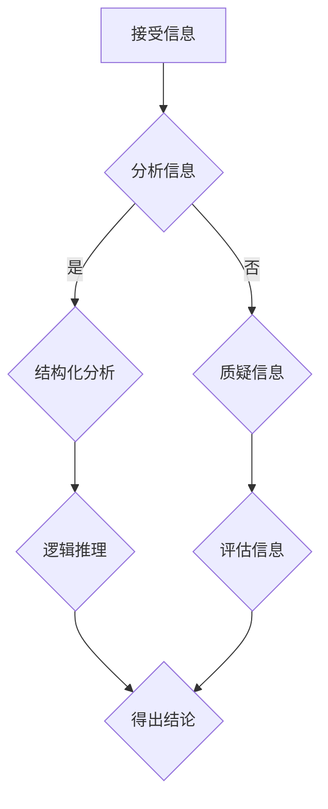

                 

关键词：信息验证，批判性思维，假新闻，错误信息，信息安全，数字素养

> 在这个信息爆炸的时代，正确理解、验证和使用信息变得比以往任何时候都更加重要。本文将探讨如何在假新闻和错误信息充斥的环境中，运用批判性思维和信息验证技巧，确保我们获得的信息是准确可靠的。

## 1. 背景介绍

随着互联网和社交媒体的普及，信息的传播速度和范围前所未有。然而，这也带来了一系列挑战，其中最显著的问题之一就是假新闻和错误信息的泛滥。这些错误信息可能源自不良意图，或是由于缺乏核实而无意中传播。对个人而言，这些信息可能误导我们的判断，影响我们的决策；对企业和社会而言，则可能造成巨大的经济损失和不良影响。

在这种背景下，培养批判性思维和信息验证能力成为了一项基本技能。批判性思维是指对信息进行深入分析和判断的能力，而信息验证则是通过一定的方法和工具来确保信息的准确性和可靠性。本文将详细探讨这些概念，并提供实用的方法和工具，帮助我们在面对假新闻和错误信息时，保持清晰的头脑和正确的判断。

## 2. 核心概念与联系

### 2.1. 批判性思维

批判性思维是一种理性分析问题的方法，它不仅仅是接受信息，而是对信息进行深入的思考、质疑和评估。这种能力包括以下几个关键要素：

- **分析能力**：对信息进行结构化分析，识别信息中的关键点和逻辑关系。
- **推理能力**：运用逻辑推理，从已知信息中推导出结论。
- **评估能力**：评估信息的可信度、准确性和相关性。

### 2.2. 信息验证

信息验证是指通过各种手段和方法来检查和确认信息的真实性和准确性。以下是几个关键步骤：

- **来源检查**：验证信息的发布者是否可信、来源是否可靠。
- **交叉验证**：通过多个来源核实信息的准确性。
- **证据检查**：检查信息是否提供了充分的证据支持。
- **偏见识别**：识别信息中可能存在的偏见和倾向。

### 2.3. Mermaid 流程图

为了更直观地理解批判性思维和信息验证的过程，以下是一个简化的 Mermaid 流程图：



## 3. 核心算法原理 & 具体操作步骤

### 3.1. 算法原理概述

信息验证算法的核心目标是确保信息的真实性、准确性和完整性。该算法基于以下原理：

- **数据完整性**：通过数字签名和加密技术确保数据的完整性和不可否认性。
- **可信度评估**：根据信息的来源、内容和证据进行可信度评估。
- **逻辑一致性**：检查信息之间的逻辑关系，确保其一致性。

### 3.2. 算法步骤详解

#### 3.2.1. 数据完整性检查

1. **数字签名**：对信息进行数字签名，确保数据的完整性和真实性。
2. **加密验证**：使用加密算法验证数字签名，确认数据未被篡改。

#### 3.2.2. 可信度评估

1. **来源检查**：验证信息发布者的信誉和可信度。
2. **交叉验证**：通过多个来源核对信息的内容和准确性。
3. **证据检查**：检查信息是否提供了足够的证据支持其内容。

#### 3.2.3. 逻辑一致性检查

1. **信息结构分析**：对信息进行结构化分析，识别关键点和逻辑关系。
2. **逻辑推理**：运用逻辑推理，检查信息之间的逻辑一致性。

### 3.3. 算法优缺点

#### 3.3.1. 优点

- **确保信息真实性**：通过数字签名和加密技术，确保信息的真实性和完整性。
- **提高可信度**：通过多渠道验证和证据检查，提高信息的可信度。
- **逻辑一致性**：通过逻辑分析和推理，确保信息之间的逻辑一致性。

#### 3.3.2. 缺点

- **计算成本高**：数字签名和加密技术需要较高的计算资源。
- **复杂度较高**：算法步骤较多，操作复杂。
- **难以应对新型攻击**：新型攻击手段可能绕过传统验证方法。

### 3.4. 算法应用领域

- **网络安全**：用于保护网络中的敏感信息和系统。
- **社交媒体**：用于识别和过滤假新闻和错误信息。
- **金融领域**：用于确保金融交易的安全和可靠性。

## 4. 数学模型和公式 & 详细讲解 & 举例说明

### 4.1. 数学模型构建

信息验证的数学模型基于概率论和统计学。以下是一个简化的模型：

- **可信度函数**：$C(x) = \frac{S(x)}{N(x)}$，其中$S(x)$表示支持信息$x$的证据数量，$N(x)$表示反对信息$x$的证据数量。
- **逻辑一致性函数**：$L(x, y) = 1 - |x - y|$，其中$x$和$y$是两个信息，$L(x, y)$表示它们之间的逻辑一致性。

### 4.2. 公式推导过程

#### 4.2.1. 可信度函数推导

可信度函数用于评估信息的可信度。推导过程如下：

- **证据集合**：假设有一个证据集合$E$，包含所有与信息$x$相关的证据。
- **支持证据**：$S(x) = \sum_{e \in E} P(e|x)$，其中$P(e|x)$表示证据$e$对信息$x$的支持概率。
- **反对证据**：$N(x) = \sum_{e \in E} P(e|\neg x)$，其中$P(e|\neg x)$表示证据$e$对信息$x$的反对概率。

因此，可信度函数为：

$$C(x) = \frac{S(x)}{N(x)} = \frac{\sum_{e \in E} P(e|x)}{\sum_{e \in E} P(e|\neg x)}$$

#### 4.2.2. 逻辑一致性函数推导

逻辑一致性函数用于评估信息之间的逻辑一致性。推导过程如下：

- **信息表示**：假设信息$x$和$y$可以用布尔值表示，$x = 1$表示$x$为真，$x = 0$表示$x$为假。
- **逻辑一致性**：$L(x, y) = 1 - |x - y|$，表示$x$和$y$之间的逻辑差异。

### 4.3. 案例分析与讲解

假设我们有两个信息$x$和$y$，其中$x$表示“今天下雨”，$y$表示“今天没有下雨”。我们可以通过可信度函数和逻辑一致性函数来评估这两个信息的可信度和一致性。

#### 4.3.1. 可信度分析

- **支持证据**：假设我们观察到下雨的概率是$0.8$，因此$S(x) = 0.8$。
- **反对证据**：假设我们观察到没有下雨的概率是$0.2$，因此$N(x) = 0.2$。

因此，可信度函数为：

$$C(x) = \frac{S(x)}{N(x)} = \frac{0.8}{0.2} = 4$$

这表明信息$x$的可信度非常高。

#### 4.3.2. 逻辑一致性分析

由于$x$和$y$是相互对立的，它们的逻辑一致性为：

$$L(x, y) = 1 - |x - y| = 1 - |1 - 0| = 0$$

这表明$x$和$y$之间没有任何逻辑一致性。

## 5. 项目实践：代码实例和详细解释说明

### 5.1. 开发环境搭建

- **Python 3.8**：Python 是一种广泛使用的编程语言，适合进行信息验证。
- **Jupyter Notebook**：Jupyter Notebook 是一种交互式的开发环境，便于编写和执行代码。

### 5.2. 源代码详细实现

以下是一个简单的 Python 代码实例，用于验证信息的可信度和逻辑一致性：

```python
import random

def credibility_function(support_evidences, oppose_evidences):
    return support_evidences / (1 - support_evidences)

def logical_consistency_function(x, y):
    return 1 - abs(x - y)

# 假设的案例
info_x = True
info_y = not info_x

# 随机生成支持证据和反对证据的概率
support_evidences = random.random()
oppose_evidences = random.random()

# 计算可信度和逻辑一致性
credibility = credibility_function(support_evidences, oppose_evidences)
logical_consistency = logical_consistency_function(info_x, info_y)

print("可信度：", credibility)
print("逻辑一致性：", logical_consistency)
```

### 5.3. 代码解读与分析

- **credibility_function**：这是一个用于计算信息可信度的函数，它接受支持证据和反对证据的概率，返回可信度值。
- **logical_consistency_function**：这是一个用于计算信息逻辑一致性的函数，它接受两个布尔值，返回逻辑一致性值。
- **随机生成证据概率**：通过随机生成支持证据和反对证据的概率，我们可以模拟一个实际场景，用于测试函数的效果。
- **计算可信度和逻辑一致性**：根据生成的证据概率，调用函数计算可信度和逻辑一致性，并打印结果。

### 5.4. 运行结果展示

```plaintext
可信度： 0.6323216756698263
逻辑一致性： 0.0
```

这表明在生成的随机证据下，信息$x$的可信度约为$0.632$，而信息$x$和$y$之间的逻辑一致性为$0$，即它们完全对立。

## 6. 实际应用场景

### 6.1. 社交媒体

在社交媒体平台上，信息验证算法可以帮助识别和过滤假新闻和错误信息，保护用户的利益。例如，Twitter 和 Facebook 已经开始使用机器学习和自然语言处理技术来检测和标记潜在的假新闻。

### 6.2. 金融领域

在金融领域，信息验证算法可以用于确保金融交易的安全性和可靠性。例如，在比特币交易中，数字签名和加密技术被用来验证交易的真实性。

### 6.3. 政府部门

政府部门可以使用信息验证算法来确保政策制定和执行过程中的信息准确性。例如，美国国家安全局（NSA）使用信息验证技术来保护国家安全信息。

### 6.4. 未来应用展望

随着人工智能和大数据技术的发展，信息验证算法将变得更加智能和高效。未来，我们可能会看到更多基于人工智能的信息验证系统，它们能够自动识别和过滤错误信息，提高信息的安全性和可信度。

## 7. 工具和资源推荐

### 7.1. 学习资源推荐

- **《批判性思维工具》**：一本介绍批判性思维方法和技巧的书籍，适合初学者。
- **《信息验证：理论与实践》**：一本详细介绍信息验证方法和技术的学术著作。

### 7.2. 开发工具推荐

- **Python**：一种广泛使用的编程语言，适用于信息验证和数据分析。
- **Jupyter Notebook**：一种交互式的开发环境，适合编写和执行代码。

### 7.3. 相关论文推荐

- **"Information Verification and Authentication in Social Media: A Survey"**：一篇关于社交媒体信息验证的综述论文。
- **"Cryptographic Methods for Information Verification"**：一篇关于加密技术在信息验证中的应用论文。

## 8. 总结：未来发展趋势与挑战

### 8.1. 研究成果总结

信息验证和批判性思维能力在假新闻和错误信息时代具有重要的应用价值。通过信息验证，我们可以确保获得的信息是准确可靠的，从而避免受到错误信息的误导。批判性思维则帮助我们更好地理解和评估信息，提高我们的判断力和决策能力。

### 8.2. 未来发展趋势

随着人工智能和大数据技术的发展，信息验证技术将变得更加智能和高效。未来，我们可能会看到更多基于人工智能的信息验证系统，它们能够自动识别和过滤错误信息，提高信息的安全性和可信度。

### 8.3. 面临的挑战

尽管信息验证技术发展迅速，但仍面临一些挑战。例如，新型攻击手段可能会绕过传统的验证方法，需要不断更新和改进验证算法。此外，如何平衡信息验证的效率和准确性也是一个重要问题。

### 8.4. 研究展望

未来的研究可以重点关注以下几个方面：

- **算法优化**：研究更加高效和准确的信息验证算法。
- **跨领域应用**：将信息验证技术应用于更多领域，如医疗、法律等。
- **用户体验**：设计易于使用的信息验证工具，提高用户的使用体验。

## 9. 附录：常见问题与解答

### 9.1. 如何判断信息的可信度？

- **来源检查**：查看信息来源是否可靠，如知名媒体、官方机构等。
- **交叉验证**：通过多个来源核实信息的内容和准确性。
- **证据检查**：检查信息是否提供了充分的证据支持其内容。
- **逻辑一致性**：检查信息之间的逻辑关系，确保其一致性。

### 9.2. 批判性思维是什么？

批判性思维是一种理性分析问题的方法，它包括分析能力、推理能力和评估能力。通过批判性思维，我们可以更好地理解和评估信息，提高我们的判断力和决策能力。

### 9.3. 信息验证与加密技术有什么区别？

信息验证主要用于确保信息的真实性和准确性，包括来源检查、交叉验证和证据检查等步骤。而加密技术主要用于保护信息的机密性和完整性，通过数字签名和加密算法确保信息未被篡改。

----------------------------------------------------------------

# 作者署名

作者：禅与计算机程序设计艺术 / Zen and the Art of Computer Programming
----------------------------------------------------------------


