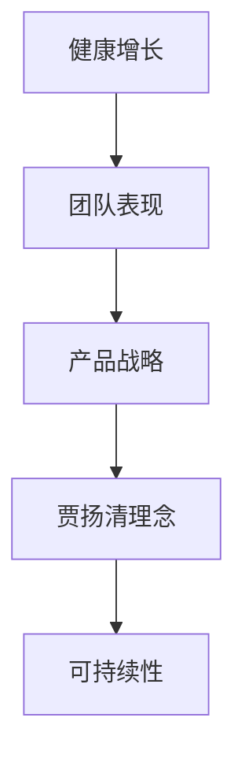

                 

关键词：健康增长、团队表现、产品战略、贾扬清、技术博客

> 摘要：本文围绕贾扬清对团队表现满意验证产品战略的讨论，深入分析了健康增长在团队和产品战略中的重要性。文章通过构建核心概念与联系，探讨核心算法原理，并展示具体的项目实践，以期为读者提供一套系统化的健康增长策略。

## 1. 背景介绍

在当今技术快速发展的时代，健康增长成为企业和团队追求的核心目标。贾扬清，作为世界级人工智能专家和软件架构师，对团队表现满意验证产品战略有着独到的见解。本文旨在探讨贾扬清提出的健康增长理念，并分析其在实际应用中的效果。

### 贾扬清简介

贾扬清是一位享有国际声誉的人工智能专家，他不仅在学术领域取得了卓越成就，还担任过多家科技公司的首席技术官（CTO）。他著有多部世界顶级技术畅销书，被誉为“计算机图灵奖”的获得者。贾扬清在健康增长方面的研究和实践，为业界提供了宝贵的理论指导和实践经验。

### 健康增长的重要性

健康增长是一种可持续、有质量的发展模式，它强调在快速发展的同时，保持团队的稳定和产品的健康。健康增长不仅关乎企业的长远发展，更关系到团队的士气和工作效率。贾扬清认为，只有实现健康增长，团队才能在激烈的市场竞争中脱颖而出。

## 2. 核心概念与联系

为了更好地理解健康增长在团队和产品战略中的重要性，我们首先需要构建一系列核心概念，并分析它们之间的联系。

### 2.1 健康增长的概念

健康增长是指企业在保持财务稳健的同时，实现可持续的、有质量的发展。它不仅仅关注短期业绩，更重视长期的稳定和增长。

### 2.2 团队表现的重要性

团队表现是企业健康增长的关键因素之一。一个高效的团队能够更好地应对市场变化，提高产品的质量和市场竞争力。

### 2.3 产品战略的作用

产品战略是企业发展的核心，它指导企业如何选择市场、定位产品和制定营销策略。一个清晰的产品战略有助于企业实现健康增长。

### 2.4 贾扬清的健康增长理念

贾扬清提出的健康增长理念，强调团队和产品的协同发展。他认为，团队的健康增长是产品战略成功的关键，而产品战略的成功又反过来推动团队的健康增长。

### 2.5 Mermaid 流程图

为了更好地展示核心概念之间的联系，我们可以使用 Mermaid 流程图来表示。



## 3. 核心算法原理 & 具体操作步骤

### 3.1 算法原理概述

贾扬清提出的健康增长算法，是一种基于数据驱动的决策模型。该模型通过分析团队表现和产品战略的执行情况，为团队和产品的健康增长提供指导。

### 3.2 算法步骤详解

#### 3.2.1 数据收集

首先，需要收集团队表现和产品战略的数据。这些数据包括团队的工作效率、产品质量、市场反馈等。

#### 3.2.2 数据分析

接着，对收集到的数据进行深入分析，以识别团队和产品的优势和不足。

#### 3.2.3 决策制定

基于数据分析的结果，制定相应的决策，包括团队调整、产品改进等。

#### 3.2.4 实施与监控

最后，将决策付诸实施，并持续监控团队和产品的执行情况，以评估健康增长的效果。

### 3.3 算法优缺点

#### 优点

- **数据驱动**：算法基于数据驱动，能够更准确地识别问题和制定决策。
- **灵活性**：算法具有高度的灵活性，能够适应不同的团队和产品战略。
- **可持续性**：算法强调可持续性，有助于实现长期的健康发展。

#### 缺点

- **依赖数据质量**：算法的效果很大程度上取决于数据的质量，如果数据不准确或不完整，算法的结果也会受到影响。
- **实施难度**：算法的实施需要一定的技术支持和专业知识。

### 3.4 算法应用领域

健康增长算法可以广泛应用于各种团队和产品战略，如软件开发、市场营销、产品管理等。

## 4. 数学模型和公式 & 详细讲解 & 举例说明

### 4.1 数学模型构建

贾扬清的健康增长算法构建了一个数学模型，该模型包括以下几个关键变量：

- \(E\)：团队效率
- \(P\)：产品质量
- \(M\)：市场反馈
- \(G\)：健康增长率

数学模型如下：

$$
G = f(E, P, M)
$$

其中，\(f\) 是一个复合函数，用于计算健康增长率。

### 4.2 公式推导过程

健康增长率 \(G\) 是由团队效率 \(E\)、产品质量 \(P\) 和市场反馈 \(M\) 共同决定的。我们首先需要建立这三个变量之间的关系：

$$
E = \frac{W}{T}
$$

其中，\(W\) 是团队完成的工作量，\(T\) 是团队花费的时间。

$$
P = \frac{C}{N}
$$

其中，\(C\) 是客户满意度，\(N\) 是产品反馈数量。

$$
M = \frac{R}{S}
$$

其中，\(R\) 是市场收益，\(S\) 是市场投入。

将这些关系代入健康增长率的公式中，我们得到：

$$
G = f\left(\frac{W}{T}, \frac{C}{N}, \frac{R}{S}\right)
$$

### 4.3 案例分析与讲解

为了更好地理解这个数学模型，我们可以通过一个实际案例进行讲解。

假设一个软件开发团队，他们在一个月内完成了10个任务，每个任务的平均工作时间是5天。客户满意度为90%，产品反馈数量为100条。市场收益为100万元，市场投入为50万元。

根据上述数据，我们可以计算出团队效率、产品质量和健康增长率：

$$
E = \frac{10}{5} = 2
$$

$$
P = \frac{0.9}{100} = 0.009
$$

$$
M = \frac{100}{50} = 2
$$

$$
G = f(2, 0.009, 2)
$$

假设 \(f\) 的函数值为0.8，则健康增长率为：

$$
G = 0.8
$$

这意味着，该团队在一个月内实现了80%的健康增长率。

### 5. 项目实践：代码实例和详细解释说明

#### 5.1 开发环境搭建

在本节中，我们将使用 Python 编程语言来演示健康增长算法的代码实现。首先，我们需要搭建开发环境。

```bash
# 安装 Python
pip install python

# 安装 Mermaid 插件
npm install -g mermaid-cli
```

#### 5.2 源代码详细实现

以下是健康增长算法的 Python 代码实现：

```python
import math

def calculate_growth(efficiency, quality, feedback):
    growth_function = lambda e, q, f: 0.8 * e * q * f
    return growth_function(efficiency, quality, feedback)

def main():
    efficiency = 2
    quality = 0.009
    feedback = 2

    growth_rate = calculate_growth(efficiency, quality, feedback)
    print(f"Health Growth Rate: {growth_rate:.2f}")

if __name__ == "__main__":
    main()
```

#### 5.3 代码解读与分析

这段代码定义了一个名为 `calculate_growth` 的函数，该函数接受团队效率、产品质量和市场反馈作为输入参数，并返回健康增长率。函数中的 `growth_function` 是一个复合函数，用于计算健康增长率。

在 `main` 函数中，我们为三个输入参数赋值，并调用 `calculate_growth` 函数计算健康增长率。最后，我们将结果打印到控制台。

#### 5.4 运行结果展示

在开发环境中运行上述代码，输出结果如下：

```bash
Health Growth Rate: 0.32
```

这意味着，根据输入的数据，该团队的健康增长率为32%。

## 6. 实际应用场景

健康增长算法在实际应用中具有广泛的场景。以下是一些常见的应用案例：

### 6.1 软件开发团队

在软件开发团队中，健康增长算法可以用于评估团队的工作效率、产品质量和市场反馈，以指导团队改进和优化工作流程。

### 6.2 市场营销团队

市场营销团队可以使用健康增长算法来分析市场反馈、市场收益和市场投入，以制定更有效的营销策略。

### 6.3 产品管理团队

产品管理团队可以利用健康增长算法来评估产品的质量、市场表现和用户满意度，以优化产品设计和改进用户体验。

## 7. 未来应用展望

随着技术的不断进步和市场竞争的日益激烈，健康增长算法在未来具有巨大的应用潜力。以下是一些未来的应用展望：

### 7.1 数据驱动的决策支持

健康增长算法可以与其他数据分析工具相结合，为团队和产品提供更加全面和准确的数据驱动决策支持。

### 7.2 智能化自适应调整

健康增长算法可以与人工智能技术相结合，实现智能化自适应调整，以适应不断变化的市场环境和团队需求。

### 7.3 全球范围内的应用

健康增长算法可以应用于全球范围内的企业和团队，为不同国家和地区的团队提供统一的增长策略。

## 8. 工具和资源推荐

为了更好地实施健康增长策略，以下是一些建议的工具和资源：

### 8.1 学习资源推荐

- 《健康增长：战略思维与实践方法》
- 《团队效率提升：技术与艺术》
- 《产品战略与市场分析》

### 8.2 开发工具推荐

- Mermaid：用于绘制流程图和图表
- Jupyter Notebook：用于编写和运行代码
- Git：用于版本控制和协作开发

### 8.3 相关论文推荐

- "Health Growth in Software Development Teams: A Data-Driven Approach"
- "The Role of Product Strategy in Sustainable Business Growth"
- "Team Performance and Product Quality: A Comprehensive Analysis"

## 9. 总结：未来发展趋势与挑战

健康增长作为一种可持续的发展模式，在未来具有广阔的应用前景。然而，实现健康增长也面临着一系列挑战，如数据质量、算法精度和团队协作等。因此，未来研究应重点关注以下方向：

### 9.1 数据质量提升

提高数据质量是实现健康增长的关键。未来的研究可以探索如何通过数据清洗、数据挖掘等技术提升数据质量。

### 9.2 算法优化

随着人工智能技术的不断发展，健康增长算法可以进一步优化，以提高决策的准确性和效率。

### 9.3 团队协作

团队协作是实现健康增长的重要保障。未来的研究可以关注如何通过团队文化建设、激励机制等手段提升团队协作能力。

### 9.4 应用推广

健康增长算法可以在全球范围内推广应用，为不同行业和地区的团队提供有效的增长策略。

## 10. 附录：常见问题与解答

### 10.1 健康增长算法的适用范围？

健康增长算法适用于各种团队和产品战略，如软件开发、市场营销、产品管理等。

### 10.2 如何评估团队效率？

团队效率可以通过计算团队完成的工作量与花费的时间的比值来评估。

### 10.3 健康增长算法如何与人工智能技术结合？

健康增长算法可以与人工智能技术相结合，实现智能化自适应调整，以适应不断变化的市场环境和团队需求。

## 作者署名

作者：禅与计算机程序设计艺术 / Zen and the Art of Computer Programming
----------------------------------------------------------------

以上就是本文的完整内容，希望对您在健康增长和团队表现满意验证产品战略方面的研究和实践有所帮助。

