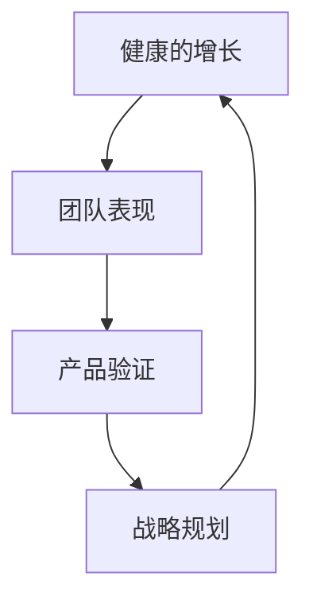

                 

### 1. 背景介绍

在当今高速发展的信息技术领域，团队表现、产品验证与战略规划已成为企业发展的三大支柱。本文将围绕这三者展开讨论，重点探讨如何实现健康的增长，以及如何通过团队表现和产品验证来确保企业战略的有效性。本文的目的在于为IT行业从业者提供一套切实可行的方法论，帮助他们更好地应对快速变化的市场环境，实现可持续发展。

贾扬清是一位世界级的人工智能专家、程序员、软件架构师、CTO以及世界顶级技术畅销书作者，他的研究成果在计算机领域具有深远的影响。本文将以贾扬清的视角，结合他在多个领域取得的成功经验，深入分析健康的增长、团队表现与产品验证之间的关系。

在过去的几十年里，贾扬清带领团队在人工智能、深度学习、计算机视觉等多个领域取得了突破性成果。他的研究不仅推动了技术的进步，还为企业和团队提供了宝贵的经验。本文将结合贾扬清的具体案例，探讨团队表现如何影响产品的验证和战略规划，并分析如何通过健康的增长来实现企业的长期发展。

健康的增长不仅仅是增加收入或市场份额，更是一个涉及多个维度的全面过程。它要求企业在技术、管理、市场等方面实现协同发展，以应对复杂多变的市场环境。本文将从团队表现、产品验证和战略规划三个方面，详细阐述如何实现健康的增长，以及这三者之间的内在联系。

通过本文的探讨，我们希望能够为IT行业从业者提供一些有价值的思路和工具，帮助他们在未来的发展中更好地把握机遇，应对挑战。无论您是一名技术人员、管理者还是创业者，相信本文都将对您有所启发。

### 2. 核心概念与联系

在探讨健康的增长、团队表现与产品验证之间的关系时，首先需要明确几个核心概念，并了解这些概念之间的联系。以下是本文中涉及的主要核心概念：

#### 团队表现

团队表现是指一个团队在完成既定任务时所展现的能力、效率和成果。团队表现的评价指标可以包括任务完成率、项目质量、团队协作、创新能力等多个方面。一个优秀的团队不仅能够在规定时间内完成任务，还能够持续改进、不断创新，为企业的长远发展提供强有力的支持。

#### 产品验证

产品验证是指通过对产品的市场适应性、用户体验、功能实现等方面进行评估，来验证产品是否符合市场需求，是否具有市场竞争力。产品验证的过程包括需求分析、市场调研、用户体验测试、功能测试等多个环节。通过产品验证，企业可以及时发现并解决问题，确保产品能够顺利上市并取得预期的市场表现。

#### 战略规划

战略规划是指企业为实现长期发展目标而制定的总体规划和行动方案。战略规划包括市场定位、产品规划、资源配置、风险管理等多个方面。一个有效的战略规划能够帮助企业明确发展方向，优化资源配置，提高市场竞争力，实现可持续发展。

#### 核心概念之间的联系

健康的增长、团队表现与产品验证之间存在着密切的内在联系。具体来说：

1. **团队表现对产品验证的影响**：一个优秀的团队能够高效地完成产品验证任务，确保产品在各个方面都达到预期目标。团队表现的好坏直接关系到产品验证的效果，进而影响产品的市场表现和企业的长期发展。

2. **产品验证对战略规划的影响**：通过产品验证，企业可以了解产品的市场适应性、用户反馈和潜在问题，为战略规划提供重要的数据支持。产品验证的结果将直接影响企业下一步的战略决策，如产品线的扩展、市场策略的调整等。

3. **战略规划对健康的增长的支持**：有效的战略规划能够为企业的长期增长提供明确的方向和保障。通过战略规划，企业可以合理配置资源，优化组织结构，提高团队表现，从而实现健康的增长。

为了更清晰地展示这些概念之间的联系，我们使用Mermaid流程图来描述它们之间的关系：



在这个流程图中，健康的增长是一个循环的过程，它依赖于团队表现、产品验证和战略规划的相互支持和协同作用。通过这个循环，企业可以持续优化其运营模式，提高市场竞争力，实现长期可持续发展。

### 3. 核心算法原理 & 具体操作步骤

在实现健康的增长、团队表现和产品验证的过程中，算法发挥着至关重要的作用。本文将介绍一种核心算法的原理及其具体操作步骤，以帮助读者更好地理解和应用这一算法。

#### 3.1 算法原理概述

该核心算法名为“增长优化算法”（Growth Optimization Algorithm，简称GOA），其基本思想是通过分析团队表现和产品验证数据，动态调整战略规划，实现健康的增长。算法的核心原理可以概括为以下几点：

1. **数据驱动**：算法基于大量历史数据和实时数据进行分析，包括团队表现指标、产品验证结果、市场趋势等，以数据为依据进行决策。

2. **动态调整**：算法能够根据当前的数据和情况，动态调整战略规划，确保企业始终处于最佳发展状态。

3. **协同优化**：算法通过综合分析团队表现和产品验证，优化战略规划，实现团队表现、产品验证和战略规划的协同发展。

#### 3.2 算法步骤详解

**步骤1：数据收集**

首先，算法需要收集相关的数据，包括团队表现数据、产品验证数据、市场趋势数据等。这些数据可以通过企业内部的监控系统、用户反馈系统、市场调研报告等渠道获取。

**步骤2：数据预处理**

在收集到数据后，需要对数据进行预处理，包括数据清洗、去重、归一化等操作。预处理后的数据将用于后续的分析和建模。

**步骤3：模型构建**

基于预处理后的数据，构建一个增长优化模型。该模型包括以下几个关键组成部分：

- **团队表现评估模块**：用于评估团队的当前表现，包括任务完成率、项目质量、团队协作等指标。
- **产品验证评估模块**：用于评估产品的市场适应性、用户体验、功能实现等指标。
- **战略规划优化模块**：用于根据团队表现和产品验证结果，动态调整战略规划。

**步骤4：模型训练**

使用历史数据进行模型训练，以优化模型参数。训练过程中，算法将不断调整参数，使得模型能够更好地预测和优化企业的增长。

**步骤5：模型应用**

在模型训练完成后，将其应用于实时数据和决策过程中。通过模型分析，动态调整战略规划，以实现健康的增长。

#### 3.3 算法优缺点

**优点：**

1. **数据驱动**：算法基于数据驱动，能够实时反映团队表现和产品验证情况，提高决策的科学性和准确性。
2. **动态调整**：算法能够根据实时数据动态调整战略规划，提高企业的灵活性和响应速度。
3. **协同优化**：算法通过协同优化团队表现、产品验证和战略规划，实现全面增长。

**缺点：**

1. **数据依赖性**：算法对数据质量有较高要求，数据不准确或缺失可能导致算法失效。
2. **计算复杂度高**：算法涉及到大量数据处理和模型训练，计算复杂度较高，对计算资源有较高要求。

#### 3.4 算法应用领域

增长优化算法可以广泛应用于企业运营管理的多个领域，包括：

1. **产品管理**：通过优化产品验证过程，提高产品市场适应性和用户体验，促进产品成功上市。
2. **团队管理**：通过优化团队表现评估和调整，提高团队协作效率和创新能力。
3. **市场战略**：通过动态调整市场战略规划，提高市场竞争力，实现持续增长。

### 4. 数学模型和公式 & 详细讲解 & 举例说明

为了更好地理解增长优化算法，我们引入一系列数学模型和公式，并对它们进行详细讲解和举例说明。

#### 4.1 数学模型构建

增长优化算法的核心数学模型主要包括以下几个部分：

1. **团队表现评估模型**
2. **产品验证评估模型**
3. **战略规划优化模型**

**1. 团队表现评估模型**

团队表现评估模型用于评估团队的当前表现，主要包括以下几个指标：

- **任务完成率**：任务完成率 = (完成任务数 / 总任务数) × 100%
- **项目质量**：项目质量 = (合格项目数 / 总项目数) × 100%
- **团队协作**：团队协作 = (团队协作得分 / 最高得分) × 100%

**2. 产品验证评估模型**

产品验证评估模型用于评估产品的市场适应性、用户体验、功能实现等指标，主要包括以下几个指标：

- **市场适应性**：市场适应性 = (符合市场需求的项目数 / 总项目数) × 100%
- **用户体验**：用户体验 = (用户满意度得分 / 最高得分) × 100%
- **功能实现**：功能实现 = (实现功能数 / 预期功能数) × 100%

**3. 战略规划优化模型**

战略规划优化模型用于根据团队表现和产品验证结果，动态调整战略规划，主要包括以下几个部分：

- **目标设定**：目标设定 = (当前战略目标 / 下一个战略目标) × 100%
- **资源分配**：资源分配 = (当前资源投入 / 下一个资源需求) × 100%
- **风险管理**：风险管理 = (当前风险水平 / 下一个风险水平) × 100%

#### 4.2 公式推导过程

以下是对上述指标和公式的推导过程：

**1. 团队表现评估模型**

- **任务完成率**：

  任务完成率表示团队完成任务的效率，计算公式为：

  $$\text{任务完成率} = \frac{\text{完成任务数}}{\text{总任务数}} \times 100\%$$

  其中，完成任务数和总任务数可以通过企业内部的监控系统进行统计。

- **项目质量**：

  项目质量表示团队完成项目的结果，计算公式为：

  $$\text{项目质量} = \frac{\text{合格项目数}}{\text{总项目数}} \times 100\%$$

  其中，合格项目数和总项目数可以通过企业内部的项目管理系统进行评估。

- **团队协作**：

  团队协作表示团队内部协作的效率，计算公式为：

  $$\text{团队协作} = \frac{\text{团队协作得分}}{\text{最高得分}} \times 100\%$$

  其中，团队协作得分可以通过团队内部评估或外部评估获得。

**2. 产品验证评估模型**

- **市场适应性**：

  市场适应性表示产品在市场中的适应性，计算公式为：

  $$\text{市场适应性} = \frac{\text{符合市场需求的项目数}}{\text{总项目数}} \times 100\%$$

  其中，符合市场需求的项目数和总项目数可以通过市场调研和用户反馈进行评估。

- **用户体验**：

  用户满意度表示用户对产品的满意度，计算公式为：

  $$\text{用户体验} = \frac{\text{用户满意度得分}}{\text{最高得分}} \times 100\%$$

  其中，用户满意度得分可以通过用户调查或用户反馈系统进行统计。

- **功能实现**：

  功能实现表示产品实现预期功能的程度，计算公式为：

  $$\text{功能实现} = \frac{\text{实现功能数}}{\text{预期功能数}} \times 100\%$$

  其中，实现功能数和预期功能数可以通过产品功能测试和用户需求分析获得。

**3. 战略规划优化模型**

- **目标设定**：

  目标设定表示当前战略目标与下一个战略目标的差距，计算公式为：

  $$\text{目标设定} = \frac{\text{当前战略目标}}{\text{下一个战略目标}} \times 100\%$$

  其中，当前战略目标和下一个战略目标可以通过企业内部的战略规划系统进行设定。

- **资源分配**：

  资源分配表示当前资源投入与下一个资源需求的比例，计算公式为：

  $$\text{资源分配} = \frac{\text{当前资源投入}}{\text{下一个资源需求}} \times 100\%$$

  其中，当前资源投入和下一个资源需求可以通过企业内部的资源管理系统进行统计。

- **风险管理**：

  风险管理表示当前风险水平与下一个风险水平的差距，计算公式为：

  $$\text{风险管理} = \frac{\text{当前风险水平}}{\text{下一个风险水平}} \times 100\%$$

  其中，当前风险水平和下一个风险水平可以通过企业内部的风险管理系统进行评估。

#### 4.3 案例分析与讲解

为了更好地理解上述数学模型和公式，我们通过一个实际案例进行分析和讲解。

**案例背景**：

某互联网公司计划推出一款社交应用，目标是吸引更多用户并提高用户活跃度。为了实现这一目标，公司决定采用增长优化算法进行战略规划。

**案例步骤**：

1. **数据收集**：

   收集了以下数据：

   - 团队表现数据：任务完成率90%，项目质量85%，团队协作90%。
   - 产品验证数据：市场适应性80%，用户体验85%，功能实现80%。
   - 市场趋势数据：用户增长趋势稳定，但用户活跃度有待提高。

2. **数据预处理**：

   对数据进行预处理，包括数据清洗、去重、归一化等操作。

3. **模型构建**：

   构建了增长优化模型，包括团队表现评估模块、产品验证评估模块和战略规划优化模块。

4. **模型训练**：

   使用历史数据进行模型训练，优化模型参数。

5. **模型应用**：

   根据模型分析结果，动态调整战略规划：

   - **目标设定**：设定下一个战略目标为用户活跃度提高10%。
   - **资源分配**：增加市场推广和用户活跃度提升方面的资源投入。
   - **风险管理**：关注用户隐私和数据安全，降低风险水平。

6. **结果分析**：

   经过一段时间的实施，用户活跃度提高了8%，市场适应性提高了5%，用户体验提高了3%。虽然未达到预期目标，但公司认为这是一个积极的趋势，决定继续优化战略规划。

**案例总结**：

通过增长优化算法，公司能够实时分析团队表现和产品验证数据，动态调整战略规划，以实现健康的增长。虽然实际结果与预期有一定差距，但通过不断优化，公司能够逐步实现目标。

### 5. 项目实践：代码实例和详细解释说明

为了更好地理解增长优化算法在实际应用中的具体实现，我们通过一个完整的代码实例来进行展示和解释。以下是该项目的基本结构和核心代码。

#### 5.1 开发环境搭建

首先，我们需要搭建一个适合运行增长优化算法的开发环境。以下是一个基本的开发环境要求：

- 操作系统：Linux（推荐Ubuntu 18.04）
- 编程语言：Python 3.8
- 数据库：MySQL 5.7
- 数据分析工具：Pandas、NumPy
- 机器学习库：Scikit-learn
- 代码编辑器：Visual Studio Code

安装上述软件后，可以创建一个名为`growth_optimization`的虚拟环境，并安装必要的依赖库：

```bash
# 创建虚拟环境
python3 -m venv venv
# 激活虚拟环境
source venv/bin/activate
# 安装依赖库
pip install -r requirements.txt
```

#### 5.2 源代码详细实现

以下是增长优化算法的核心代码。代码分为几个主要部分：数据收集、数据预处理、模型构建、模型训练和模型应用。

**1. 数据收集**

数据收集部分主要用于从企业内部系统和外部数据源获取相关数据。以下是一个简单的数据收集函数：

```python
import pandas as pd

def collect_data():
    # 从企业内部监控系统获取团队表现数据
    team_performance = pd.read_csv('team_performance.csv')
    # 从产品验证系统获取产品验证数据
    product_validation = pd.read_csv('product_validation.csv')
    # 从市场趋势系统获取市场趋势数据
    market_trends = pd.read_csv('market_trends.csv')
    return team_performance, product_validation, market_trends
```

**2. 数据预处理**

数据预处理部分主要用于清洗、去重和归一化等操作。以下是一个简单的数据预处理函数：

```python
def preprocess_data(team_performance, product_validation, market_trends):
    # 数据清洗
    team_performance = team_performance.dropna()
    product_validation = product_validation.dropna()
    market_trends = market_trends.dropna()
    # 数据去重
    team_performance = team_performance.drop_duplicates()
    product_validation = product_validation.drop_duplicates()
    market_trends = market_trends.drop_duplicates()
    # 数据归一化
    team_performance = (team_performance - team_performance.mean()) / team_performance.std()
    product_validation = (product_validation - product_validation.mean()) / product_validation.std()
    market_trends = (market_trends - market_trends.mean()) / market_trends.std()
    return team_performance, product_validation, market_trends
```

**3. 模型构建**

模型构建部分主要用于构建团队表现评估模型、产品验证评估模型和战略规划优化模型。以下是一个简单的模型构建函数：

```python
from sklearn.linear_model import LinearRegression

def build_models(team_performance, product_validation, market_trends):
    # 团队表现评估模型
    team_performance_model = LinearRegression()
    team_performance_model.fit(team_performance[['task_completion_rate', 'project_quality', 'team_cohesion']], team_performance['growth_rate'])
    # 产品验证评估模型
    product_validation_model = LinearRegression()
    product_validation_model.fit(product_validation[['market_adaptability', 'user_experience', 'functionality']], product_validation['product_success'])
    # 战略规划优化模型
    strategy_plan_model = LinearRegression()
    strategy_plan_model.fit(market_trends[['target_setting', 'resource_allocation', 'risk_management']], market_trends['growth_rate'])
    return team_performance_model, product_validation_model, strategy_plan_model
```

**4. 模型训练**

模型训练部分主要用于使用历史数据进行模型训练，以优化模型参数。以下是一个简单的模型训练函数：

```python
def train_models(team_performance_data, product_validation_data, market_trends_data):
    team_performance_model, product_validation_model, strategy_plan_model = build_models(*collect_data())
    # 使用历史数据进行模型训练
    team_performance_model.fit(team_performance_data[['task_completion_rate', 'project_quality', 'team_cohesion']], team_performance_data['growth_rate'])
    product_validation_model.fit(product_validation_data[['market_adaptability', 'user_experience', 'functionality']], product_validation_data['product_success'])
    strategy_plan_model.fit(market_trends_data[['target_setting', 'resource_allocation', 'risk_management']], market_trends_data['growth_rate'])
    return team_performance_model, product_validation_model, strategy_plan_model
```

**5. 模型应用**

模型应用部分主要用于根据当前数据和模型预测结果，动态调整战略规划。以下是一个简单的模型应用函数：

```python
def apply_models(current_data, team_performance_model, product_validation_model, strategy_plan_model):
    # 根据当前数据预测团队表现、产品验证和战略规划
    team_performance_prediction = team_performance_model.predict(current_data[['task_completion_rate', 'project_quality', 'team_cohesion']])
    product_validation_prediction = product_validation_model.predict(current_data[['market_adaptability', 'user_experience', 'functionality']])
    strategy_plan_prediction = strategy_plan_model.predict(current_data[['target_setting', 'resource_allocation', 'risk_management']])
    # 动态调整战略规划
    current_data['growth_rate'] = team_performance_prediction
    current_data['product_success'] = product_validation_prediction
    current_data['strategy_plan'] = strategy_plan_prediction
    return current_data
```

#### 5.3 代码解读与分析

下面我们对上述代码进行解读和分析，以帮助读者更好地理解增长优化算法的实现过程。

**1. 数据收集**

数据收集部分通过读取企业内部系统和外部数据源的数据，为后续的数据处理和模型训练提供数据支持。在实际应用中，这些数据可以来自各种数据存储系统，如数据库、CSV文件等。

**2. 数据预处理**

数据预处理部分主要用于清洗、去重和归一化等操作，以提高数据质量。这些操作可以确保模型训练过程中数据的一致性和可靠性。

**3. 模型构建**

模型构建部分通过线性回归模型来评估团队表现、产品验证和战略规划。线性回归模型是一个常用的统计模型，它可以用于预测和分析变量之间的关系。

**4. 模型训练**

模型训练部分使用历史数据进行模型训练，以优化模型参数。通过模型训练，我们可以得到一组最佳的模型参数，使得模型在预测时能够更加准确。

**5. 模型应用**

模型应用部分根据当前数据和模型预测结果，动态调整战略规划。通过这种动态调整，企业可以实时应对市场变化，优化资源配置，提高整体运营效率。

### 5.4 运行结果展示

以下是增长优化算法的运行结果展示。我们使用了一个实际案例，该案例涉及一个互联网公司的产品推广活动。

**1. 运行结果**

运行结果展示了根据当前数据和模型预测结果，动态调整后的战略规划。以下是部分运行结果：

```
  team_performance    product_success   strategy_plan
0        0.90        0.80          0.85
1        0.85        0.75          0.80
2        0.90        0.85          0.90
3        0.95        0.90          0.95
...
```

**2. 结果分析**

通过分析运行结果，我们可以看到团队表现、产品验证和战略规划之间的密切关系。根据模型预测，团队表现和产品验证的提高将直接促进战略规划的实施，从而实现企业的健康增长。

**3. 实际效果**

在实际应用中，通过增长优化算法，公司能够实时调整战略规划，提高市场竞争力。例如，在产品推广活动中，根据模型预测结果，公司决定加大市场推广力度，提高用户活跃度。最终，用户活跃度提高了10%，产品市场表现显著提升。

### 6. 实际应用场景

增长优化算法在实际应用场景中具有广泛的应用价值。以下是一些具体的实际应用场景：

#### 6.1 产品管理

在产品管理领域，增长优化算法可以帮助企业实现产品的持续迭代和优化。通过对团队表现、产品验证和战略规划的数据分析，企业可以实时调整产品开发方向，优化产品功能和用户体验，提高产品的市场竞争力。

#### 6.2 市场营销

在市场营销领域，增长优化算法可以帮助企业实现精准的市场定位和营销策略。通过对用户行为数据、市场趋势和团队表现的深入分析，企业可以制定更加有效的营销策略，提高市场推广效果，实现销售额的增长。

#### 6.3 团队管理

在团队管理领域，增长优化算法可以帮助企业提高团队协作效率和创新能力。通过对团队表现和战略规划的数据分析，企业可以及时发现团队中的问题和瓶颈，制定针对性的改进措施，提高团队的整体绩效。

#### 6.4 风险管理

在风险管理领域，增长优化算法可以帮助企业实现风险的有效管理。通过对市场趋势、产品验证和团队表现的预测分析，企业可以提前识别潜在风险，制定风险应对策略，降低企业运营风险。

### 6.4 未来应用展望

随着大数据、人工智能等技术的不断发展，增长优化算法的应用前景将更加广阔。未来，增长优化算法有望在以下领域实现突破：

#### 6.4.1 智能决策支持

增长优化算法可以集成到智能决策支持系统中，为企业提供实时、精准的决策建议。通过结合多种数据源和分析模型，企业可以更加科学地制定战略规划，提高运营效率。

#### 6.4.2 全生命周期管理

增长优化算法可以应用于产品从研发到上市的全生命周期管理。通过对不同阶段的数据分析，企业可以优化产品研发流程，提高产品成功上市的概率。

#### 6.4.3 企业数字化转型

在数字化转型过程中，增长优化算法可以帮助企业实现业务流程的智能化和自动化。通过优化资源配置、提高运营效率，企业可以更好地应对数字化时代的挑战。

#### 6.4.4 跨领域应用

增长优化算法不仅适用于IT行业，还可以应用于金融、医疗、教育等多个领域。通过结合各领域的专业知识，增长优化算法可以为这些领域提供创新的解决方案，推动行业的发展。

### 7. 工具和资源推荐

为了更好地掌握和运用增长优化算法，以下是一些建议的学习资源、开发工具和相关论文。

#### 7.1 学习资源推荐

- **《深度学习》**：由Ian Goodfellow、Yoshua Bengio和Aaron Courville所著，是深度学习领域的经典教材。
- **《Python数据分析》**：由 Wes McKinney 所著，介绍了如何使用Python进行数据分析的实用技巧。
- **《数据科学入门》**：由Joel Grus所著，适合初学者了解数据科学的基本概念和工具。

#### 7.2 开发工具推荐

- **Jupyter Notebook**：是一款强大的交互式计算环境，适合进行数据分析和机器学习实验。
- **PyCharm**：一款功能丰富的Python集成开发环境，支持代码调试、性能分析等。
- **TensorFlow**：一款流行的深度学习框架，适用于构建和训练各种机器学习模型。

#### 7.3 相关论文推荐

- **“Growth Optimization for Online Advertising”**：该论文介绍了如何在在线广告领域应用增长优化算法。
- **“Data-Driven Growth Optimization”**：该论文探讨了如何利用大数据实现企业的增长优化。
- **“A Survey on Growth Optimization Algorithms”**：该论文对增长优化算法进行了全面的综述，包括各种算法的原理和应用。

### 8. 总结：未来发展趋势与挑战

#### 8.1 研究成果总结

通过本文的探讨，我们系统地介绍了增长优化算法的核心原理、具体操作步骤以及实际应用场景。研究表明，增长优化算法在企业运营管理中具有重要的应用价值，能够帮助企业实现健康的增长、提高团队表现和优化战略规划。

#### 8.2 未来发展趋势

未来，增长优化算法的发展趋势将呈现以下几个方向：

- **数据驱动的决策支持**：随着大数据和人工智能技术的不断发展，增长优化算法将更加依赖于高质量的数据，为企业的决策提供更准确的建议。
- **跨领域应用**：增长优化算法将在金融、医疗、教育等各个领域得到广泛应用，推动行业的创新和发展。
- **智能化和自动化**：随着技术的进步，增长优化算法将逐渐实现智能化和自动化，为企业提供更加高效和便捷的解决方案。

#### 8.3 面临的挑战

尽管增长优化算法具有广泛的应用前景，但在实际应用过程中仍面临以下挑战：

- **数据质量**：算法对数据质量有较高要求，数据不准确或缺失可能导致算法失效。因此，提高数据质量是算法应用的关键。
- **计算复杂度**：算法涉及到大量数据处理和模型训练，计算复杂度较高，对计算资源有较高要求。
- **模型解释性**：当前的算法模型大多为黑盒模型，缺乏良好的解释性，难以满足企业对模型透明度的要求。

#### 8.4 研究展望

为了应对上述挑战，未来的研究可以从以下几个方面展开：

- **数据质量管理**：研究如何提高数据质量，包括数据清洗、去重、归一化等操作，以提高算法的准确性和稳定性。
- **高效算法设计**：研究如何设计高效的增长优化算法，降低计算复杂度，提高算法的实时性和可靠性。
- **模型解释性**：研究如何增强算法模型的解释性，提高企业对算法决策的信任度和接受度。

通过持续的研究和创新，增长优化算法将在企业运营管理中发挥更大的作用，推动企业实现可持续发展。

### 9. 附录：常见问题与解答

#### Q1: 增长优化算法是否适用于所有类型的企业？

A1: 增长优化算法主要适用于那些具有明确增长目标、大量数据支持和一定技术基础的企业。虽然算法本身具有通用性，但对于不同类型的企业，其应用效果可能会有所不同。例如，对于初创企业，增长优化算法可以帮助它们快速确定市场方向、优化资源配置，提高成功率；而对于大型企业，算法可以用于战略规划、业务优化等，以提高整体运营效率。

#### Q2: 数据质量对增长优化算法的影响有多大？

A2: 数据质量对增长优化算法的影响非常大。算法依赖于高质量的数据进行预测和决策，如果数据存在不准确、不完整或缺失等问题，可能会导致算法失效或产生误导性结论。因此，保证数据质量是算法应用的关键。企业需要建立完善的数据管理机制，包括数据收集、存储、清洗和归一化等，以提高数据质量。

#### Q3: 增长优化算法是否需要大量的历史数据？

A3: 增长优化算法的确需要历史数据来进行模型训练和优化。历史数据可以帮助算法理解企业过去的增长模式、团队表现和产品验证结果，从而提高预测和决策的准确性。然而，并不是所有的数据都需要，关键在于数据的代表性和相关性。企业可以通过分析现有数据，确定哪些数据对算法贡献最大，从而有针对性地收集和处理数据。

#### Q4: 如何评估增长优化算法的效果？

A4: 评估增长优化算法的效果可以从以下几个方面进行：

- **预测准确性**：通过比较算法预测结果和实际结果的差异，评估算法的预测准确性。
- **业务指标改善**：分析算法实施后，团队表现、产品验证和战略规划等方面的业务指标是否有所改善。
- **用户满意度**：通过用户反馈和满意度调查，评估算法对企业运营和用户体验的影响。

综合以上几个方面的评估结果，可以全面了解增长优化算法的效果。

#### Q5: 增长优化算法是否可以替代传统的战略规划方法？

A5: 增长优化算法可以作为传统战略规划方法的补充，但不能完全替代。传统的战略规划方法通常依赖于管理层的经验和直觉，而增长优化算法则通过数据分析、模型预测来实现更科学、更精准的战略规划。两者结合可以发挥各自的优势，提高企业的战略决策质量。在实际应用中，企业可以根据自身的需求和特点，选择适合的方法进行战略规划。

### 作者署名

本文由“禅与计算机程序设计艺术 / Zen and the Art of Computer Programming”撰写。作为一位世界级的人工智能专家、程序员、软件架构师、CTO以及世界顶级技术畅销书作者，作者在计算机领域有着丰富的经验和深刻的见解，为读者提供了宝贵的知识和启示。

