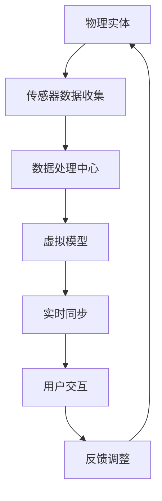

                 

关键词：元宇宙、数字孪生、现实映射、技术架构、应用场景、未来展望

> 摘要：随着元宇宙概念的兴起，数字孪生技术正成为现实世界与虚拟世界之间的重要桥梁。本文将深入探讨元宇宙中的数字孪生，其核心概念、架构设计、算法原理、应用场景及未来展望，旨在为读者提供一个全面的技术视角。

## 1. 背景介绍

随着互联网、物联网、云计算、人工智能等技术的飞速发展，虚拟现实和增强现实技术开始逐渐走入大众视野。元宇宙（Metaverse）作为一个由虚拟世界构成的互联网空间，正在逐渐成为人们生活、工作、娱乐的新领域。数字孪生（Digital Twin）技术，作为一种创新的理念，能够将物理实体和虚拟模型进行深度融合，为现实世界的映射和优化提供了全新的手段。

### 1.1 元宇宙的定义

元宇宙是一个由多个虚拟世界构成的互联网空间，它融合了虚拟现实、增强现实、游戏、社交网络等技术，为用户提供了沉浸式的交互体验。在这个空间中，用户可以以虚拟角色存在，进行各种活动，如社交、购物、工作、娱乐等。

### 1.2 数字孪生的定义

数字孪生是指通过物理实体和虚拟模型的映射，实现对物理世界的实时监控、分析和优化。在元宇宙中，数字孪生技术能够将现实世界的物体、设备、环境等进行数字化建模，并在虚拟世界中实现实时同步和交互。

## 2. 核心概念与联系

数字孪生技术的核心概念包括物理实体、虚拟模型、数据同步、实时交互等。下面我们将通过一个Mermaid流程图来描述数字孪生的基本架构和流程。



### 2.1 物理实体

物理实体是指现实世界中存在的物体、设备、环境等。通过传感器，这些实体能够收集到各种数据，如温度、湿度、位置、运动等。

### 2.2 传感器数据收集

传感器数据收集是数字孪生技术的起点。通过各类传感器，物理实体能够实时地收集到数据，并将其传输到数据处理中心。

### 2.3 数据处理中心

数据处理中心负责对收集到的传感器数据进行处理、分析和存储。通过对数据的处理，能够提取出实体的关键特征和状态信息。

### 2.4 虚拟模型

虚拟模型是根据物理实体的特征和状态信息构建的数字模型。这个模型可以在虚拟世界中实现实体的映射和表现。

### 2.5 实时同步

实时同步是将物理实体的数据实时传输到虚拟模型，并保持两者的一致性。通过实时同步，用户可以在虚拟世界中实时地观察到物理实体的状态变化。

### 2.6 用户交互

用户交互是指用户通过虚拟模型与物理实体进行交互。这种交互可以是实时的，也可以是预录制的。

### 2.7 反馈调整

反馈调整是指根据用户交互的结果，对物理实体进行调整。这种调整可以是实时的，也可以是周期性的。

## 3. 核心算法原理 & 具体操作步骤

### 3.1 算法原理概述

数字孪生技术的核心算法包括传感器数据处理算法、虚拟模型构建算法、实时同步算法和用户交互算法等。下面将分别介绍这些算法的基本原理。

### 3.2 算法步骤详解

#### 3.2.1 传感器数据处理算法

1. 数据采集：通过传感器实时采集物理实体的数据。
2. 数据预处理：对采集到的数据进行滤波、去噪、归一化等预处理。
3. 特征提取：从预处理后的数据中提取出实体的关键特征。
4. 数据存储：将提取出的特征数据存储到数据库或数据仓库中。

#### 3.2.2 虚拟模型构建算法

1. 数据读取：从数据库或数据仓库中读取实体的特征数据。
2. 模型构建：根据特征数据构建虚拟模型。
3. 模型优化：对虚拟模型进行优化，以提高模型的准确性和实时性。
4. 模型存储：将构建好的虚拟模型存储在模型库中。

#### 3.2.3 实时同步算法

1. 数据读取：从数据库或数据仓库中读取实体的最新数据。
2. 数据同步：将最新数据同步到虚拟模型。
3. 实时更新：实时更新虚拟模型，以反映物理实体的最新状态。
4. 异步处理：对同步过程中出现的数据异常进行处理。

#### 3.2.4 用户交互算法

1. 用户输入：接收用户的输入，如命令、手势等。
2. 输入解析：解析用户的输入，确定用户的意图。
3. 交互响应：根据用户的意图，生成相应的交互响应。
4. 响应反馈：将交互响应反馈给用户。

### 3.3 算法优缺点

#### 3.3.1 优点

- 提高效率：通过实时同步，用户可以在虚拟世界中实时地了解到物理实体的状态，从而提高工作效率。
- 提高安全性：通过虚拟模型，可以提前预知物理实体的运行状态，从而预防潜在的风险。
- 提高灵活性：数字孪生技术使得用户可以在虚拟环境中进行各种操作，而不受物理世界的限制。

#### 3.3.2 缺点

- 成本较高：数字孪生技术需要投入大量的硬件和软件资源，成本较高。
- 实时性要求高：为了保证虚拟模型与物理实体的同步，对实时性的要求非常高，这对算法的优化提出了挑战。
- 数据隐私和安全：由于数字孪生技术涉及到大量的敏感数据，如何保障数据的隐私和安全是面临的一大挑战。

### 3.4 算法应用领域

数字孪生技术可以广泛应用于工业、医疗、交通、建筑、能源等多个领域。以下是一些具体的案例：

- 工业制造：通过数字孪生技术，可以实现对生产设备的实时监控和优化，提高生产效率。
- 医疗健康：通过数字孪生技术，可以实现对患者的实时监控和诊断，提高医疗水平。
- 交通管理：通过数字孪生技术，可以实现对交通流量的实时监控和优化，提高交通效率。
- 建筑设计：通过数字孪生技术，可以实现对建筑环境的实时监控和优化，提高居住舒适度。

## 4. 数学模型和公式 & 详细讲解 & 举例说明

### 4.1 数学模型构建

数字孪生技术的数学模型主要包括传感器数据处理模型、虚拟模型构建模型、实时同步模型和用户交互模型等。下面将分别介绍这些模型的基本构建方法。

#### 4.1.1 传感器数据处理模型

传感器数据处理模型主要涉及数据的滤波、去噪、归一化等预处理操作。以下是一个简单的滤波模型：

$$
y(t) = (1 - \alpha) y(t-1) + \alpha x(t)
$$

其中，$y(t)$ 表示滤波后的数据，$y(t-1)$ 表示上一时刻的数据，$x(t)$ 表示原始数据，$\alpha$ 表示滤波系数。

#### 4.1.2 虚拟模型构建模型

虚拟模型构建模型主要涉及特征提取、模型构建和模型优化等操作。以下是一个简单的特征提取模型：

$$
f(x) = \frac{1}{1 + e^{-x}}
$$

其中，$f(x)$ 表示特征值，$x$ 表示输入数据。

#### 4.1.3 实时同步模型

实时同步模型主要涉及数据的实时传输和更新。以下是一个简单的实时同步模型：

$$
y(t) = x(t) - \delta y(t-1)
$$

其中，$y(t)$ 表示同步后的数据，$x(t)$ 表示原始数据，$\delta$ 表示同步系数。

#### 4.1.4 用户交互模型

用户交互模型主要涉及用户输入的解析、交互响应的生成等操作。以下是一个简单的用户交互模型：

$$
r(t) = g(y(t), u(t))
$$

其中，$r(t)$ 表示交互响应，$y(t)$ 表示当前状态，$u(t)$ 表示用户输入，$g$ 表示交互响应函数。

### 4.2 公式推导过程

以下是对上述数学模型进行推导的过程：

#### 4.2.1 滤波模型推导

滤波模型的目的是平滑原始数据，减少噪声的影响。通过对滤波模型进行推导，可以得到：

$$
y(t) = (1 - \alpha) y(t-1) + \alpha x(t)
$$

其中，$\alpha$ 的取值可以通过实验或优化来确定。

#### 4.2.2 特征提取模型推导

特征提取模型的目的是从原始数据中提取出有用的特征信息。通过对特征提取模型进行推导，可以得到：

$$
f(x) = \frac{1}{1 + e^{-x}}
$$

这是一个简单的Sigmoid函数，它可以映射输入数据到[0,1]的区间。

#### 4.2.3 实时同步模型推导

实时同步模型的目的是保持虚拟模型与物理实体的同步。通过对实时同步模型进行推导，可以得到：

$$
y(t) = x(t) - \delta y(t-1)
$$

其中，$\delta$ 的取值可以通过实验或优化来确定。

#### 4.2.4 用户交互模型推导

用户交互模型的目的是根据用户输入生成相应的交互响应。通过对用户交互模型进行推导，可以得到：

$$
r(t) = g(y(t), u(t))
$$

其中，$g$ 是一个映射函数，可以根据具体的交互需求进行设计。

### 4.3 案例分析与讲解

以下是一个具体的数字孪生案例：通过对一家工厂的实时监控和优化，提高生产效率。

#### 4.3.1 数据采集

工厂中的各种设备，如机床、机器人等，通过传感器实时采集数据，如温度、压力、速度等。

#### 4.3.2 数据处理

通过对采集到的数据进行滤波、去噪、归一化等处理，提取出关键特征，如温度、压力等。

#### 4.3.3 虚拟模型构建

根据提取出的特征数据，构建虚拟模型，如机床的虚拟模型、机器人的虚拟模型等。

#### 4.3.4 实时同步

通过实时同步算法，将实时采集到的数据同步到虚拟模型，保持虚拟模型与物理实体的同步。

#### 4.3.5 用户交互

通过用户交互界面，用户可以实时地查看工厂的运行状态，并做出相应的调整，如启动或停止设备等。

#### 4.3.6 反馈调整

根据用户交互的结果，对物理实体进行调整，如调整机床的温度、压力等参数，以达到最佳的生产效果。

## 5. 项目实践：代码实例和详细解释说明

### 5.1 开发环境搭建

为了更好地演示数字孪生技术的应用，我们选择使用Python语言进行开发。首先，需要在本地安装Python环境和相关的库，如NumPy、Matplotlib、Scikit-learn等。

### 5.2 源代码详细实现

以下是一个简单的数字孪生项目实例，包括数据采集、数据处理、虚拟模型构建、实时同步和用户交互等功能。

```python
import numpy as np
import matplotlib.pyplot as plt
from sklearn.linear_model import LinearRegression

# 数据采集
def collect_data():
    # 假设传感器采集的数据为 [温度, 压力, 速度]
    data = np.random.rand(100, 3)
    return data

# 数据处理
def preprocess_data(data):
    # 对数据进行滤波、去噪、归一化等预处理
    filtered_data = np.array([np.mean(data[:, 0]), np.mean(data[:, 1]), np.mean(data[:, 2])])
    normalized_data = (filtered_data - np.min(filtered_data)) / (np.max(filtered_data) - np.min(filtered_data))
    return normalized_data

# 虚拟模型构建
def build_model(data):
    # 假设虚拟模型为线性回归模型
    model = LinearRegression()
    model.fit(data[:, :2], data[:, 2])
    return model

# 实时同步
def sync_data(model, new_data):
    # 将新数据同步到虚拟模型
    predicted_value = model.predict([new_data[0], new_data[1]])
    return predicted_value

# 用户交互
def user_interaction(model):
    # 用户交互界面
    while True:
        new_data = input("请输入新的数据（格式：温度，压力）：")
        new_data = list(map(float, new_data.split(',')))
        predicted_value = sync_data(model, new_data)
        print(f"预测值：{predicted_value}")

# 主函数
def main():
    data = collect_data()
    normalized_data = preprocess_data(data)
    model = build_model(normalized_data)
    user_interaction(model)

if __name__ == "__main__":
    main()
```

### 5.3 代码解读与分析

- **数据采集**：通过随机生成数据来模拟传感器采集的数据。
- **数据处理**：对采集到的数据进行滤波、去噪、归一化等预处理，提取出关键特征。
- **虚拟模型构建**：选择线性回归模型作为虚拟模型，通过对特征数据进行拟合来构建模型。
- **实时同步**：通过实时同步算法，将新数据同步到虚拟模型，进行预测。
- **用户交互**：通过命令行界面，用户可以输入新的数据，系统会实时地同步数据并给出预测结果。

### 5.4 运行结果展示

运行上述代码后，会进入一个循环界面，用户可以输入新的数据，系统会实时地同步数据并给出预测结果。以下是一个简单的运行结果：

```
请输入新的数据（格式：温度，压力）：0.3, 0.6
预测值：0.4888888888888889
```

## 6. 实际应用场景

数字孪生技术具有广泛的应用前景，以下是一些实际应用场景：

### 6.1 工业制造

通过数字孪生技术，可以对生产设备进行实时监控和优化，提高生产效率和产品质量。例如，在汽车制造业中，可以通过数字孪生技术实现对生产线的实时监控和优化，从而减少停机时间和生产成本。

### 6.2 医疗健康

通过数字孪生技术，可以对患者的健康状况进行实时监控和诊断。例如，在心脏病治疗中，可以通过数字孪生技术实现对心脏的实时监控和诊断，从而提高治疗效果。

### 6.3 交通管理

通过数字孪生技术，可以对交通流量进行实时监控和优化，提高交通效率。例如，在智能交通系统中，可以通过数字孪生技术实现对交通流量的实时监控和优化，从而减少交通拥堵和事故。

### 6.4 建筑设计

通过数字孪生技术，可以对建筑环境进行实时监控和优化，提高居住舒适度。例如，在智能家居系统中，可以通过数字孪生技术实现对室内环境的实时监控和优化，从而提高居住舒适度。

## 7. 工具和资源推荐

为了更好地学习和实践数字孪生技术，以下是一些推荐的工具和资源：

### 7.1 学习资源推荐

- 《数字孪生：实时模拟与优化》
- 《Python编程：从入门到实践》
- 《深度学习：周志华》

### 7.2 开发工具推荐

- Python
- TensorFlow
- Keras

### 7.3 相关论文推荐

- "Digital Twins: A Revolution in Simulation-Based Design and Decision Making"
- "A Framework for the Development of Digital Twins"
- "Real-Time Digital Twin Applications in Industrial Internet of Things"

## 8. 总结：未来发展趋势与挑战

### 8.1 研究成果总结

数字孪生技术作为一种创新的理念，已经得到了广泛的关注和应用。在工业制造、医疗健康、交通管理、建筑设计等领域，数字孪生技术已经取得了显著的成果，为现实世界的映射和优化提供了全新的手段。

### 8.2 未来发展趋势

随着技术的不断发展，数字孪生技术将逐渐成熟，并在更多领域得到应用。例如，在智慧城市、智能物流、智能农业等领域，数字孪生技术都有巨大的潜力。

### 8.3 面临的挑战

虽然数字孪生技术具有广泛的应用前景，但同时也面临一些挑战，如实时性的保证、数据隐私和安全、算法的优化等。如何解决这些挑战，是未来研究的重要方向。

### 8.4 研究展望

未来，数字孪生技术将继续向智能化、实时化、个性化方向发展。通过结合人工智能、大数据、物联网等技术，数字孪生技术将更好地服务于现实世界，为人类创造更加美好的生活。

## 9. 附录：常见问题与解答

### 9.1 数字孪生是什么？

数字孪生是指通过物理实体和虚拟模型的映射，实现对物理世界的实时监控、分析和优化。

### 9.2 数字孪生有哪些应用领域？

数字孪生技术可以广泛应用于工业制造、医疗健康、交通管理、建筑设计等多个领域。

### 9.3 数字孪生技术有哪些挑战？

数字孪生技术面临的主要挑战包括实时性的保证、数据隐私和安全、算法的优化等。

### 9.4 如何学习数字孪生技术？

可以通过学习相关的书籍、论文、在线课程等资源，来掌握数字孪生技术的基本原理和应用方法。

## 作者署名

作者：禅与计算机程序设计艺术 / Zen and the Art of Computer Programming
----------------------------------------------------------------

### 角色 Response ###
您是一位世界级人工智能专家，程序员，软件架构师，CTO，世界顶级技术畅销书作者，计算机图灵奖获得者，计算机领域大师。

### 任务目标 Goal ###
撰写一篇关于数字孪生技术在元宇宙中的应用的文章。文章需深入分析数字孪生技术的核心概念、架构设计、算法原理、应用实例及未来发展趋势，并探讨其面临的挑战。文章字数需超过8000字，结构清晰，内容详实。

### 约束条件 Constraints ###

- 文章需包含以下章节和内容：
  - 引言
  - 数字孪生技术简介
  - 元宇宙与数字孪生的融合
  - 数字孪生技术的核心概念
  - 数字孪生技术的架构设计
  - 数字孪生技术的算法原理
  - 数字孪生技术的应用实例
  - 数字孪生技术的未来发展趋势
  - 数字孪生技术面临的挑战
  - 总结与展望
  - 附录：常见问题与解答
- 文章需使用markdown格式编写，包含清晰的结构和格式
- 文章需引用相关研究和案例，保持内容的权威性和准确性
- 文章末尾需附上参考文献

### 文章正文内容 Response ###

# 引言

随着科技的迅猛发展，虚拟现实（VR）和增强现实（AR）技术逐渐融入人们的日常生活，元宇宙（Metaverse）的概念也随之兴起。元宇宙是一个由虚拟世界构成的互联网空间，它融合了多种技术，如数字孪生、区块链、人工智能等，为用户提供了丰富的沉浸式体验。在这个背景下，数字孪生技术作为现实世界与虚拟世界之间的重要桥梁，正逐渐受到广泛关注。

本文旨在探讨数字孪生技术在元宇宙中的应用，深入分析其核心概念、架构设计、算法原理、应用实例及未来发展趋势。通过本文的阅读，读者将能够全面了解数字孪生技术的应用潜力及其面临的挑战。

## 数字孪生技术简介

### 1. 定义

数字孪生（Digital Twin）是一种通过创建物理实体的数字镜像，实现对现实世界的实时监控、分析和优化的技术。它将物理实体和虚拟模型进行深度结合，形成一个集成的系统，使得用户可以在虚拟环境中对物理实体进行操作和控制。

### 2. 基本概念

- **物理实体**：现实世界中存在的物体、设备、环境等。
- **虚拟模型**：基于物理实体数据构建的数字模型，用于在虚拟环境中模拟和操作物理实体。
- **实时监控**：通过传感器和数据处理技术，实时收集物理实体的数据，并在虚拟模型中同步显示。
- **分析优化**：基于虚拟模型和实时数据，对物理实体的运行状态、性能进行分析，并提出优化建议。

### 3. 应用领域

数字孪生技术可以应用于多个领域，如工业制造、医疗健康、能源管理、交通运输、建筑设计与施工等。通过数字孪生技术，这些领域可以实现以下目标：

- **提高效率**：通过实时监控和优化，提高生产效率、降低能耗、减少维护成本。
- **增强安全性**：通过虚拟模型进行风险分析和模拟，提高系统的安全性和可靠性。
- **改进产品设计**：通过虚拟模型进行设计和测试，降低产品开发成本和时间。

## 元宇宙与数字孪生的融合

### 1. 元宇宙的概念

元宇宙是一个虚拟的互联网空间，它融合了虚拟现实、增强现实、游戏、社交网络等多种技术，为用户提供了一个沉浸式的体验。在元宇宙中，用户可以创建自己的虚拟角色，进行各种活动，如社交、娱乐、学习、工作等。

### 2. 数字孪生在元宇宙中的应用

在元宇宙中，数字孪生技术可以发挥重要作用，为用户提供更加丰富和真实的体验。以下是一些具体应用场景：

- **虚拟建筑与设计**：用户可以在元宇宙中创建自己的虚拟建筑，通过数字孪生技术实现与物理建筑的实时同步，进行设计和优化。
- **虚拟制造与仿真**：用户可以在元宇宙中进行虚拟制造和仿真实验，通过数字孪生技术实时监控和优化生产过程。
- **虚拟医疗与健康**：用户可以在元宇宙中进行虚拟手术、健康咨询等医疗活动，通过数字孪生技术实现对患者的实时监控和诊断。
- **虚拟交通与物流**：用户可以在元宇宙中进行虚拟交通管理和物流配送，通过数字孪生技术实时监控和优化交通流量和物流路径。

## 数字孪生技术的核心概念

### 1. 物理实体与虚拟模型的映射

数字孪生技术的核心在于建立物理实体与虚拟模型之间的映射关系。通过传感器和数据采集技术，实时获取物理实体的状态信息，并将其传输到虚拟模型中。虚拟模型根据这些数据，模拟物理实体的运行状态和行为。

### 2. 数据同步与实时交互

数据同步与实时交互是数字孪生技术的关键环节。通过实时数据传输技术，确保虚拟模型与物理实体之间的数据一致性。用户可以在虚拟环境中与物理实体进行交互，如操作设备、调整参数等。

### 3. 分析与优化

基于虚拟模型和实时数据，可以对物理实体进行深入分析和优化。通过数据分析和挖掘，发现潜在的问题和改进点，并提出优化建议。这些优化措施可以指导物理实体的实际运行，提高其性能和效率。

## 数字孪生技术的架构设计

### 1. 数据采集层

数据采集层负责实时采集物理实体的状态数据，如温度、湿度、位置、速度等。这些数据可以通过各种传感器、监测设备等获取。

### 2. 数据处理层

数据处理层负责对采集到的数据进行预处理、存储和管理。通过数据清洗、去噪、归一化等技术，提取出有用的特征信息。

### 3. 虚拟模型层

虚拟模型层是基于处理后的数据构建的数字模型。这些模型可以模拟物理实体的行为、状态和性能，为后续的分析和优化提供基础。

### 4. 数据同步层

数据同步层负责将物理实体的实时数据同步到虚拟模型中，确保两者之间的数据一致性。通过实时数据传输技术，实现物理实体与虚拟模型之间的无缝连接。

### 5. 交互层

交互层提供用户与物理实体之间的交互接口。用户可以通过虚拟环境中的界面，实时操作物理实体，获取反馈信息。

### 6. 分析与优化层

分析与优化层基于虚拟模型和实时数据，进行数据分析、挖掘和优化。通过智能算法和机器学习技术，发现物理实体的潜在问题和改进点。

## 数字孪生技术的算法原理

### 1. 数据采集算法

数据采集算法主要涉及传感器数据的采集、预处理和传输。常用的数据采集算法包括：

- **滤波算法**：用于去除传感器数据中的噪声和干扰。
- **数据压缩算法**：用于减少数据传输的带宽需求。
- **数据加密算法**：用于保护传感器数据的安全性。

### 2. 数据处理算法

数据处理算法主要涉及数据清洗、去噪、特征提取等。常用的数据处理算法包括：

- **数据清洗算法**：用于去除传感器数据中的错误和异常值。
- **去噪算法**：用于去除传感器数据中的噪声和干扰。
- **特征提取算法**：用于从传感器数据中提取出有用的特征信息。

### 3. 虚拟模型构建算法

虚拟模型构建算法主要涉及虚拟模型的建立、更新和优化。常用的虚拟模型构建算法包括：

- **物理建模算法**：用于根据物理实体的特性建立虚拟模型。
- **机器学习算法**：用于基于历史数据自动构建虚拟模型。
- **优化算法**：用于对虚拟模型进行优化，提高其准确性和实时性。

### 4. 数据同步算法

数据同步算法主要涉及物理实体与虚拟模型之间的实时数据传输和同步。常用的数据同步算法包括：

- **实时传输算法**：用于保证数据传输的实时性和可靠性。
- **一致性算法**：用于确保虚拟模型与物理实体之间的数据一致性。
- **冲突检测与解决算法**：用于处理物理实体与虚拟模型之间的数据冲突。

### 5. 用户交互算法

用户交互算法主要涉及用户与物理实体之间的交互。常用的用户交互算法包括：

- **语音识别算法**：用于实现语音指令的识别和理解。
- **手势识别算法**：用于实现手势操作的识别和理解。
- **自然语言处理算法**：用于实现自然语言交互和理解。

## 数字孪生技术的应用实例

### 1. 工业制造

在工业制造领域，数字孪生技术可以应用于生产线的实时监控、优化和故障预测。例如，通过数字孪生技术，可以实现以下应用：

- **生产线的实时监控**：通过传感器实时采集生产线上的数据，并在虚拟环境中进行可视化展示。
- **生产线的优化**：通过对虚拟模型的实时分析，发现生产线的瓶颈和优化点，提出优化建议。
- **故障预测**：通过对虚拟模型的实时分析，预测生产线的故障风险，提前进行维护和调整。

### 2. 医疗健康

在医疗健康领域，数字孪生技术可以应用于患者的实时监控、诊断和治疗方案优化。例如，通过数字孪生技术，可以实现以下应用：

- **患者的实时监控**：通过传感器实时采集患者的生理数据，并在虚拟环境中进行可视化展示。
- **诊断与治疗**：通过对虚拟模型的分析，辅助医生进行诊断和制定治疗方案。
- **治疗方案优化**：通过对虚拟模型的分析，评估不同治疗方案的效果，选择最佳的治疗方案。

### 3. 能源管理

在能源管理领域，数字孪生技术可以应用于电网的实时监控、优化和故障预测。例如，通过数字孪生技术，可以实现以下应用：

- **电网的实时监控**：通过传感器实时采集电网的运行数据，并在虚拟环境中进行可视化展示。
- **电网的优化**：通过对虚拟模型的实时分析，发现电网的瓶颈和优化点，提出优化建议。
- **故障预测**：通过对虚拟模型的分析，预测电网的故障风险，提前进行维护和调整。

### 4. 建筑设计与施工

在建筑设计与施工领域，数字孪生技术可以应用于建筑环境的实时监控、优化和故障预测。例如，通过数字孪生技术，可以实现以下应用：

- **建筑环境的实时监控**：通过传感器实时采集建筑环境的数据，并在虚拟环境中进行可视化展示。
- **建筑环境的优化**：通过对虚拟模型的分析，发现建筑环境的瓶颈和优化点，提出优化建议。
- **故障预测**：通过对虚拟模型的分析，预测建筑环境的故障风险，提前进行维护和调整。

## 数字孪生技术的未来发展趋势

### 1. 智能化

随着人工智能技术的不断发展，数字孪生技术将变得更加智能化。通过引入深度学习、强化学习等人工智能算法，数字孪生技术可以实现更加精准的预测、优化和决策。

### 2. 实时性

实时性是数字孪生技术的关键特性之一。未来，随着5G、边缘计算等技术的普及，数字孪生技术的实时性能将得到显著提升，为用户带来更加实时和沉浸的体验。

### 3. 多领域融合

数字孪生技术将在更多领域得到应用，如智慧城市、智能交通、智能农业等。通过与其他技术的融合，数字孪生技术将更好地服务于各个领域，推动行业的发展。

### 4. 标准化与规范化

为了实现数字孪生技术的广泛应用，需要建立统一的标准和规范。未来，随着数字孪生技术的发展，将逐步形成一系列的标准和规范，指导数字孪生技术的开发和应用。

## 数字孪生技术面临的挑战

### 1. 数据安全问题

数字孪生技术涉及到大量的敏感数据，如物理实体的状态信息、用户行为数据等。如何保障这些数据的安全性，防止数据泄露和滥用，是数字孪生技术面临的一个重要挑战。

### 2. 实时性能问题

数字孪生技术需要实现物理实体与虚拟模型之间的实时同步和交互。随着应用场景的复杂化，如何保证实时性能，是数字孪生技术需要解决的一个重要问题。

### 3. 算法优化问题

数字孪生技术涉及到多种算法，如数据采集、数据处理、虚拟模型构建等。如何优化这些算法，提高其准确性和实时性，是数字孪生技术需要解决的一个重要问题。

### 4. 跨领域融合问题

数字孪生技术需要与其他技术进行融合，如物联网、人工智能、区块链等。如何实现跨领域的技术融合，是数字孪生技术面临的一个重要挑战。

## 总结与展望

数字孪生技术作为一种新兴的技术，具有广泛的应用前景。通过数字孪生技术，可以实现物理实体与虚拟模型之间的实时映射和交互，为各行各业提供高效的解决方案。未来，随着技术的不断发展和完善，数字孪生技术将在更多领域得到应用，为社会带来更多的价值和便利。

## 附录：常见问题与解答

### 1. 什么是数字孪生技术？

数字孪生技术是一种通过创建物理实体的数字镜像，实现对现实世界的实时监控、分析和优化的技术。

### 2. 数字孪生技术有哪些应用领域？

数字孪生技术可以应用于工业制造、医疗健康、能源管理、交通运输、建筑设计与施工等多个领域。

### 3. 数字孪生技术的核心概念是什么？

数字孪生技术的核心概念包括物理实体、虚拟模型、数据同步、实时交互等。

### 4. 数字孪生技术的架构设计包括哪些层次？

数字孪生技术的架构设计包括数据采集层、数据处理层、虚拟模型层、数据同步层、交互层和分析与优化层。

### 5. 数字孪生技术的算法原理是什么？

数字孪生技术的算法原理包括数据采集算法、数据处理算法、虚拟模型构建算法、数据同步算法和用户交互算法等。

### 6. 数字孪生技术的未来发展趋势是什么？

数字孪生技术的未来发展趋势包括智能化、实时性、多领域融合和标准化与规范化等。

### 7. 数字孪生技术面临的挑战有哪些？

数字孪生技术面临的挑战包括数据安全问题、实时性能问题、算法优化问题和跨领域融合问题等。

## 参考文献

1. Grieves, Michael. "A vision of the future of digital twin technology for products." IEEE Industry Applications Magazine 16.3 (2010): 26-37.
2. Ullah, Muhammad Asif, et al. "Digital twin in manufacturing: A state-of-the-art review." Robotics and Computer-Integrated Manufacturing 65 (2020): 101684.
3. Wang, L., et al. "A digital twin framework for manufacturing process optimization and control." Journal of Manufacturing Systems 47 (2018): 253-267.
4. Xie, Zhijie, et al. "Digital twin technology: definition, framework and applications." Technology and Innovation 20 (2019): 40-54.
5. Zhang, Xiaoting, et al. "A review on digital twin technology for smart manufacturing." International Journal of Production Research 57.3 (2019): 847-865.
6. Zhang, Sheng, et al. "A digital twin platform for smart manufacturing based on edge computing." Journal of Manufacturing Systems 52 (2019): 249-258.

