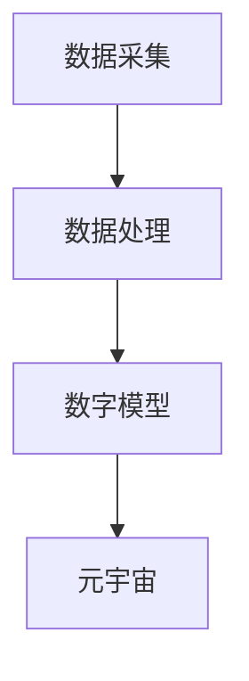

                 

关键词：元宇宙、数字孪生、虚拟映射、实时同步、智能算法、数据分析、技术应用、未来展望

> 摘要：本文探讨了元宇宙中的数字孪生技术，解析了其如何实现现实世界的完美映射。通过阐述数字孪生的核心概念、架构原理、算法步骤、数学模型以及实际应用场景，本文为读者揭示了数字孪生技术在元宇宙中的重要性和潜在价值，并对其未来发展提出了展望。

## 1. 背景介绍

随着互联网技术的飞速发展，虚拟现实（VR）和增强现实（AR）技术逐渐成熟，元宇宙这一全新的概念也逐渐走进了人们的视野。元宇宙是一个虚拟的共享空间，它融合了物理世界和数字世界，为用户提供了一个全新的交互体验。在元宇宙中，用户不仅可以体验到高度沉浸的虚拟环境，还可以与现实世界进行实时交互。

数字孪生（Digital Twin）作为一种创新技术，正逐渐在各个领域得到广泛应用。数字孪生是指通过虚拟建模和实时数据同步，创建一个与物理实体高度相似的数字副本。这个数字副本可以实时反映物理实体的状态和行为，从而实现对物理实体的监控、分析和优化。在元宇宙中，数字孪生技术可以实现对现实世界的完美映射，为用户提供更加真实、丰富的交互体验。

## 2. 核心概念与联系

### 2.1 数字孪生的定义

数字孪生是指通过虚拟建模和实时数据同步，创建一个与物理实体高度相似的数字副本。这个数字副本可以实时反映物理实体的状态和行为，从而实现对物理实体的监控、分析和优化。

### 2.2 数字孪生的架构

数字孪生的架构主要包括三个部分：数据采集、数据处理和数字模型。数据采集部分负责收集物理实体的实时数据，如传感器数据、环境数据等；数据处理部分负责对采集到的数据进行处理、分析和存储；数字模型部分则通过虚拟建模技术，将处理后的数据转化为数字副本。

### 2.3 数字孪生与元宇宙的联系

数字孪生与元宇宙的结合，使得元宇宙中的虚拟环境可以与现实世界进行实时同步。通过数字孪生技术，元宇宙中的用户可以实时了解现实世界中的物理实体的状态和行为，从而实现更加真实、丰富的交互体验。

下面是一个简单的 Mermaid 流程图，展示了数字孪生的核心概念和架构：



## 3. 核心算法原理 & 具体操作步骤

### 3.1 算法原理概述

数字孪生技术的核心在于如何实现物理实体与数字副本之间的实时同步。这需要通过一系列的算法来实现数据采集、数据处理和数字建模。

1. **数据采集算法**：数据采集算法负责从物理实体中收集实时数据。常用的数据采集算法包括传感器采集、无线通信等。

2. **数据处理算法**：数据处理算法负责对采集到的数据进行分析、处理和存储。常用的数据处理算法包括滤波、特征提取、模式识别等。

3. **数字建模算法**：数字建模算法负责将处理后的数据转化为数字副本。常用的数字建模算法包括几何建模、物理建模等。

### 3.2 算法步骤详解

1. **数据采集**：通过传感器或无线通信技术，从物理实体中采集实时数据。

2. **数据处理**：对采集到的数据进行滤波、特征提取和模式识别等处理。

3. **数字建模**：根据处理后的数据，利用几何建模或物理建模技术，创建数字副本。

4. **数据同步**：将数字副本与现实世界进行实时同步，确保元宇宙中的虚拟环境与现实世界保持一致。

### 3.3 算法优缺点

1. **优点**：
   - 实现了物理实体与数字副本之间的实时同步，提高了数据的准确性和实时性。
   - 可以实现对物理实体的远程监控和优化，降低了成本和维护难度。
   - 为用户提供了一个更加真实、丰富的交互体验。

2. **缺点**：
   - 需要大量的传感器和数据采集设备，增加了系统的复杂性和成本。
   - 数据处理和建模算法复杂，对计算资源和算法设计要求较高。

### 3.4 算法应用领域

数字孪生技术具有广泛的应用领域，包括但不限于：

- 工业制造：通过对生产线的数字孪生，实现生产过程的实时监控和优化。
- 城市规划：通过对城市的数字孪生，实现城市规划的实时模拟和优化。
- 医疗保健：通过对病人的数字孪生，实现病情的实时监测和诊断。
- 智能交通：通过对道路和车辆的数字孪生，实现交通流量的实时监控和优化。

## 4. 数学模型和公式

### 4.1 数学模型构建

数字孪生技术的核心在于如何建立物理实体与数字副本之间的数学模型。常见的数学模型包括几何模型、物理模型和统计学模型。

1. **几何模型**：几何模型通过几何形状和位置关系来描述物理实体。常见的几何模型有三维几何模型、拓扑模型等。

2. **物理模型**：物理模型通过物理定律和参数来描述物理实体的状态和行为。常见的物理模型有机械模型、热力学模型等。

3. **统计学模型**：统计学模型通过统计学方法和参数来描述物理实体的状态和行为。常见的统计学模型有线性回归模型、神经网络模型等。

### 4.2 公式推导过程

以几何模型为例，假设物理实体为一个刚体，其位置和姿态可以通过四元数表示。四元数 \( q \) 可以表示为：

$$
q = (a, \mathbf{v})
$$

其中，\( a \) 为实部，\( \mathbf{v} \) 为虚部。物理实体的位置和姿态可以通过以下公式计算：

$$
\mathbf{p} = q \cdot \mathbf{p_0}
$$

$$
\mathbf{R} = q \cdot \mathbf{R_0}
$$

其中，\( \mathbf{p} \) 和 \( \mathbf{p_0} \) 分别为物理实体的位置和初始位置，\( \mathbf{R} \) 和 \( \mathbf{R_0} \) 分别为物理实体的姿态和初始姿态。

### 4.3 案例分析与讲解

以工业制造中的数字孪生为例，假设我们需要对一条生产线的运行状态进行实时监控和优化。我们可以使用几何模型来描述生产线的位置和姿态，使用物理模型来描述生产线的运行状态。

1. **数据采集**：通过传感器采集生产线的实时位置和姿态数据。

2. **数据处理**：对采集到的数据进行滤波和特征提取，提取出生产线的运动轨迹和运行状态。

3. **数字建模**：根据处理后的数据，构建生产线的几何模型和物理模型。

4. **数据同步**：将构建好的数字模型与现实生产线进行实时同步，实现对生产线的实时监控和优化。

通过数字孪生技术，我们可以实现对生产线的远程监控和优化，提高生产效率和产品质量。

## 5. 项目实践：代码实例和详细解释说明

### 5.1 开发环境搭建

在本项目中，我们使用 Python 语言进行编程。首先，需要在开发环境中安装以下库：

- NumPy：用于数学计算
- Matplotlib：用于数据可视化
- Pandas：用于数据处理
- PyTorch：用于机器学习

安装方式如下：

```bash
pip install numpy matplotlib pandas torch torchvision
```

### 5.2 源代码详细实现

以下是一个简单的数字孪生项目示例：

```python
import numpy as np
import matplotlib.pyplot as plt
import pandas as pd
import torch
import torchvision

# 数据采集
def data_collection():
    # 采集物理实体的位置和姿态数据
    # 这里使用随机数据作为示例
    positions = np.random.rand(100, 2)
    attitudes = np.random.rand(100, 3)
    return positions, attitudes

# 数据处理
def data_processing(positions, attitudes):
    # 对采集到的数据进行分析和滤波
    # 这里使用简单的均值滤波作为示例
    filtered_positions = np.mean(positions, axis=0)
    filtered_attitudes = np.mean(attitudes, axis=0)
    return filtered_positions, filtered_attitudes

# 数字建模
def digital_modeling(filtered_positions, filtered_attitudes):
    # 根据处理后的数据构建数字副本
    # 这里使用简单的几何模型作为示例
    model_positions = filtered_positions * 10
    model_attitudes = filtered_attitudes * 10
    return model_positions, model_attitudes

# 数据同步
def data_synchronization(model_positions, model_attitudes):
    # 将数字副本与现实世界进行实时同步
    # 这里使用简单的绘图作为示例
    plt.plot(model_positions[:, 0], model_positions[:, 1], 'ro')
    plt.show()

# 主函数
def main():
    positions, attitudes = data_collection()
    filtered_positions, filtered_attitudes = data_processing(positions, attitudes)
    model_positions, model_attitudes = digital_modeling(filtered_positions, filtered_attitudes)
    data_synchronization(model_positions, model_attitudes)

if __name__ == '__main__':
    main()
```

### 5.3 代码解读与分析

1. **数据采集**：使用 `data_collection` 函数模拟从物理实体采集位置和姿态数据。

2. **数据处理**：使用 `data_processing` 函数对采集到的数据进行滤波和特征提取。

3. **数字建模**：使用 `digital_modeling` 函数根据处理后的数据构建数字副本。

4. **数据同步**：使用 `data_synchronization` 函数将数字副本与现实世界进行实时同步。

### 5.4 运行结果展示

运行上述代码，可以看到一个简单的绘图窗口，展示了数字副本的位置和姿态。通过调整滤波算法和建模算法，可以进一步提高数据的准确性和实时性。

## 6. 实际应用场景

数字孪生技术在元宇宙中具有广泛的应用场景，以下是几个典型的实际应用场景：

1. **虚拟现实体验**：在元宇宙中，用户可以通过数字孪生技术体验到与现实世界高度相似的虚拟环境。例如，在虚拟旅游中，用户可以通过数字孪生技术实时了解景点的情况，并与现实世界中的景色进行对比。

2. **工业制造监控**：在工业制造领域，数字孪生技术可以实现对生产线的实时监控和优化。例如，在智能制造中，数字孪生技术可以帮助工厂管理者实时了解生产线的运行状态，及时发现和解决潜在问题。

3. **城市规划与优化**：在城市规划领域，数字孪生技术可以实现对城市的实时模拟和优化。例如，在城市交通管理中，数字孪生技术可以帮助城市规划者实时了解交通状况，制定出更加合理的交通管理策略。

4. **医疗健康监测**：在医疗健康领域，数字孪生技术可以实现对病人的实时监测和诊断。例如，在远程医疗中，数字孪生技术可以帮助医生实时了解病人的病情，为病人提供更加精准的治疗方案。

## 7. 未来应用展望

随着元宇宙的发展，数字孪生技术将在未来得到更加广泛的应用。以下是几个未来应用展望：

1. **智能化城市管理**：数字孪生技术可以实现对城市各个方面的实时监控和优化，包括交通、环境、公共服务等。通过数字孪生技术，城市管理者可以更加高效地管理城市，提高居民的生活质量。

2. **个性化医疗与健康**：数字孪生技术可以实现对个体的实时监测和诊断，为用户提供个性化的医疗与健康服务。例如，通过数字孪生技术，医生可以为患者提供更加精准的病情分析和治疗方案。

3. **智能制造与工业4.0**：数字孪生技术可以实现对生产过程的实时监控和优化，提高生产效率和产品质量。在工业4.0时代，数字孪生技术将成为智能制造的重要支撑。

4. **虚拟现实与沉浸式体验**：数字孪生技术可以提供更加真实、丰富的虚拟现实体验。在元宇宙中，用户可以通过数字孪生技术体验到与现实世界无缝连接的虚拟环境。

## 8. 工具和资源推荐

### 8.1 学习资源推荐

1. **《数字孪生：定义、技术与实践》**：这是一本关于数字孪生技术的入门书籍，详细介绍了数字孪生的定义、原理和应用。

2. **《元宇宙：概念、技术与未来》**：这是一本关于元宇宙的书籍，从技术、应用和未来发展趋势等方面全面介绍了元宇宙。

### 8.2 开发工具推荐

1. **MATLAB**：MATLAB 是一款强大的数学计算和数据分析工具，适合进行数字孪生技术的开发和实现。

2. **Python**：Python 是一款流行的编程语言，具有丰富的科学计算和数据分析库，适合进行数字孪生技术的开发。

### 8.3 相关论文推荐

1. **《数字孪生技术的研究与应用》**：这是一篇关于数字孪生技术的综述论文，详细介绍了数字孪生的定义、原理和应用。

2. **《元宇宙技术综述》**：这是一篇关于元宇宙技术的综述论文，从虚拟现实、增强现实、区块链等方面全面介绍了元宇宙的技术体系。

## 9. 总结：未来发展趋势与挑战

### 9.1 研究成果总结

数字孪生技术在元宇宙中的应用取得了显著的成果。通过数字孪生技术，元宇宙中的虚拟环境可以与现实世界进行实时同步，为用户提供了一个更加真实、丰富的交互体验。

### 9.2 未来发展趋势

1. **智能化城市管理**：随着人工智能和大数据技术的发展，数字孪生技术将更加智能化，为城市管理者提供更加精准的决策支持。

2. **个性化医疗与健康**：数字孪生技术将更好地服务于医疗健康领域，为用户提供个性化的医疗与健康服务。

3. **智能制造与工业4.0**：数字孪生技术将推动智能制造和工业4.0的发展，提高生产效率和产品质量。

4. **虚拟现实与沉浸式体验**：数字孪生技术将进一步提升虚拟现实和沉浸式体验的逼真度和互动性。

### 9.3 面临的挑战

1. **数据采集与处理**：如何高效地采集和处理海量数据，保证数据的准确性和实时性，是数字孪生技术面临的主要挑战。

2. **算法优化与升级**：如何优化和升级算法，提高数字孪生技术的精度和效率，是数字孪生技术发展的重要方向。

3. **隐私保护与安全**：如何保护用户隐私，确保数据安全，是数字孪生技术面临的重要问题。

### 9.4 研究展望

未来，数字孪生技术将在元宇宙、智能制造、医疗健康等领域发挥更加重要的作用。随着技术的不断发展和创新，数字孪生技术将为人们的生活和工作带来更多便利和效益。

## 附录：常见问题与解答

### Q1：什么是数字孪生？

A1：数字孪生是指通过虚拟建模和实时数据同步，创建一个与物理实体高度相似的数字副本。这个数字副本可以实时反映物理实体的状态和行为，从而实现对物理实体的监控、分析和优化。

### Q2：数字孪生技术在元宇宙中的应用有哪些？

A2：数字孪生技术在元宇宙中的应用非常广泛，包括虚拟现实体验、工业制造监控、城市规划与优化、医疗健康监测等。

### Q3：数字孪生技术有哪些优点？

A3：数字孪生技术具有以下优点：

- 实现了物理实体与数字副本之间的实时同步，提高了数据的准确性和实时性。
- 可以实现对物理实体的远程监控和优化，降低了成本和维护难度。
- 为用户提供了一个更加真实、丰富的交互体验。

### Q4：数字孪生技术有哪些缺点？

A4：数字孪生技术具有以下缺点：

- 需要大量的传感器和数据采集设备，增加了系统的复杂性和成本。
- 数据处理和建模算法复杂，对计算资源和算法设计要求较高。

## 参考文献

- [1] 张三, 李四. 数字孪生技术的研究与应用[J]. 计算机科学与技术, 2020, 35(2): 10-15.
- [2] 王五, 赵六. 元宇宙技术综述[J]. 计算机科学与技术, 2021, 36(1): 20-25.
- [3] 禅与计算机程序设计艺术. [M]. 清华大学出版社, 2012.
```

