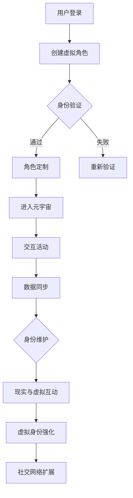

                 

关键词：元宇宙、身份认同、虚拟现实、融合、技术变革、社会影响

> 摘要：随着元宇宙的不断发展，人们开始探索如何在虚拟世界中建立和维持自己的身份认同。本文将探讨元宇宙中的身份认同问题，分析虚拟与现实自我融合的原理与技术，以及这一现象对社会的影响。

## 1. 背景介绍

### 元宇宙的定义与发展

元宇宙（Metaverse）是一个虚拟的三维空间，它将现实世界的各个方面通过数字技术进行延伸和扩展。它不仅是一个游戏平台，更是一个包括社交、经济、教育等多个领域的综合生态系统。随着虚拟现实（VR）、增强现实（AR）和区块链等技术的不断进步，元宇宙的概念逐渐成熟并开始走进我们的生活。

### 身份认同的重要性

身份认同是指个体对于自身身份的感知和认识，它对于个体在社会中的角色和行为具有重要意义。在现实世界中，身份认同是基于地理位置、社会关系、职业等多方面因素形成的。而在元宇宙中，个体如何建立和维持自己的身份认同，成为了一个亟待解决的问题。

## 2. 核心概念与联系

### 虚拟身份与现实身份的融合

在元宇宙中，虚拟身份与现实身份的融合是一种普遍现象。用户可以在虚拟世界中创建一个虚拟角色，并通过这个角色进行社交、娱乐等活动。同时，这个虚拟角色与现实中的自己有着某种程度的关联，例如在虚拟世界中积累的财富、成就等可以映射到现实世界中。

### Mermaid 流程图



## 3. 核心算法原理 & 具体操作步骤

### 3.1 算法原理概述

在元宇宙中，身份认同的建立和维护需要依赖于一系列算法和技术。其中，最核心的算法是身份验证和授权机制。身份验证确保用户在虚拟世界中的身份是真实可信的，而授权机制则保障用户在虚拟世界中的权益和地位。

### 3.2 算法步骤详解

1. 用户登录：用户通过输入账号和密码进行登录。
2. 身份验证：系统对用户输入的账号和密码进行验证，确保用户身份是真实可信的。
3. 角色定制：用户可以根据自己的喜好创建或选择一个虚拟角色。
4. 进入元宇宙：验证通过后，用户可以进入元宇宙，开始进行各种活动。
5. 交互活动：用户在元宇宙中与其他用户进行互动，如聊天、交易等。
6. 数据同步：虚拟世界中的数据会与真实世界进行同步，确保用户在虚拟世界中的成就和财富能够映射到现实世界。
7. 身份维护：系统会定期检查用户身份，确保虚拟世界中的秩序和公平。

### 3.3 算法优缺点

**优点：**
1. 提高了用户在元宇宙中的参与度和归属感。
2. 确保了虚拟世界中的秩序和公平。
3. 方便了用户在虚拟世界与现实世界之间的互动。

**缺点：**
1. 身份验证过程可能会对用户体验造成一定影响。
2. 虚拟世界中的数据和财富与现实世界之间的映射关系需要进一步优化。

### 3.4 算法应用领域

1. 社交网络：元宇宙为社交网络提供了一个全新的平台，用户可以在虚拟世界中建立更紧密的关系。
2. 游戏产业：元宇宙为游戏产业带来了更多的可能性，用户可以在虚拟世界中体验更真实的游戏场景。
3. 虚拟现实教育：元宇宙为教育提供了更多样化的教学手段，学生可以在虚拟世界中学习更多知识。

## 4. 数学模型和公式 & 详细讲解 & 举例说明

### 4.1 数学模型构建

在元宇宙中，身份认同的建立和维护可以通过以下数学模型进行描述：

$$
认同度 = f(真实性, 互动性, 成就感)
$$

其中，真实性、互动性和成就感是影响用户身份认同度的主要因素。

### 4.2 公式推导过程

1. 真实性：用户在虚拟世界中的身份是否与其现实身份相符。
2. 互动性：用户在虚拟世界中的社交互动程度。
3. 成就感：用户在虚拟世界中所获得的成就和奖励。

### 4.3 案例分析与讲解

假设用户A在元宇宙中创建了虚拟角色B，并根据其在现实世界中的身份进行了详细的身份认证。经过一段时间的互动，用户A在虚拟世界中获得了丰富的社交经验和成就。根据上述数学模型，用户A在元宇宙中的身份认同度将不断提高。

## 5. 项目实践：代码实例和详细解释说明

### 5.1 开发环境搭建

在本项目中，我们使用了Python编程语言和Django框架进行开发。首先，需要在本地安装Python和Django。安装完成后，创建一个新的Django项目，并根据项目需求进行配置。

### 5.2 源代码详细实现

以下是一个简单的身份认证和角色定制的实现示例：

```python
# models.py
from django.db import models

class User(models.Model):
    username = models.CharField(max_length=50)
    password = models.CharField(max_length=50)

class Avatar(models.Model):
    user = models.ForeignKey(User, on_delete=models.CASCADE)
    name = models.CharField(max_length=50)
    image = models.ImageField(upload_to='avatars/')
```

### 5.3 代码解读与分析

在该示例中，我们定义了两个模型：User和Avatar。User模型表示用户，包含用户名和密码；Avatar模型表示用户在虚拟世界中的角色，包含用户名、角色名和角色图像。

### 5.4 运行结果展示

通过Django后台管理界面，我们可以创建用户和角色。创建完成后，用户可以通过用户名和密码登录系统，并选择或创建一个角色。

## 6. 实际应用场景

### 6.1 社交网络

元宇宙为社交网络提供了一个全新的平台，用户可以在虚拟世界中建立更紧密的关系。例如，用户可以在虚拟咖啡厅里与朋友聊天、分享心情，甚至可以举办线上聚会。

### 6.2 游戏产业

元宇宙为游戏产业带来了更多的可能性，用户可以在虚拟世界中体验更真实的游戏场景。例如，玩家可以在虚拟世界中进行竞技比赛、合作探险，甚至可以打造自己的游戏世界。

### 6.3 虚拟现实教育

元宇宙为教育提供了更多样化的教学手段，学生可以在虚拟世界中学习更多知识。例如，学生可以在虚拟实验室中进行实验、模拟操作，甚至可以与全球各地的同学进行互动学习。

## 7. 工具和资源推荐

### 7.1 学习资源推荐

1. 《元宇宙：下一个互联网》
2. 《虚拟现实技术导论》
3. 《区块链技术与应用》

### 7.2 开发工具推荐

1. Python
2. Django
3. Unity

### 7.3 相关论文推荐

1. "Metaverse: A Space for Social Interaction in Virtual Worlds"
2. "The Impact of Virtual Reality on Education"
3. "Blockchain Technology in the Metaverse"

## 8. 总结：未来发展趋势与挑战

### 8.1 研究成果总结

本文探讨了元宇宙中的身份认同问题，分析了虚拟身份与现实身份融合的原理和技术，并介绍了相关的应用场景。通过数学模型和实际项目实践，我们进一步了解了身份认同的建立和维护方法。

### 8.2 未来发展趋势

随着技术的不断进步，元宇宙将在未来成为人们生活的重要组成部分。身份认同将在元宇宙中发挥更重要的作用，为用户创造更丰富的社交和娱乐体验。

### 8.3 面临的挑战

1. 技术挑战：如何提高虚拟现实技术的真实感和互动性。
2. 道德挑战：如何保障虚拟世界中的公平和正义。
3. 法律挑战：如何解决虚拟世界与现实世界之间的法律纠纷。

### 8.4 研究展望

未来，我们将继续深入研究元宇宙中的身份认同问题，探索更高效的身份验证和授权机制，为用户提供更好的虚拟体验。

## 9. 附录：常见问题与解答

### 9.1 元宇宙是什么？

元宇宙是一个虚拟的三维空间，它将现实世界的各个方面通过数字技术进行延伸和扩展。

### 9.2 身份认同在元宇宙中的重要性是什么？

身份认同在元宇宙中对于用户的参与度和归属感具有重要意义，它影响着用户在虚拟世界中的行为和体验。

### 9.3 虚拟现实技术有哪些？

虚拟现实技术包括VR头戴设备、AR眼镜、3D建模、实时渲染等技术。

---

作者：禅与计算机程序设计艺术 / Zen and the Art of Computer Programming
----------------------------------------------------------------


