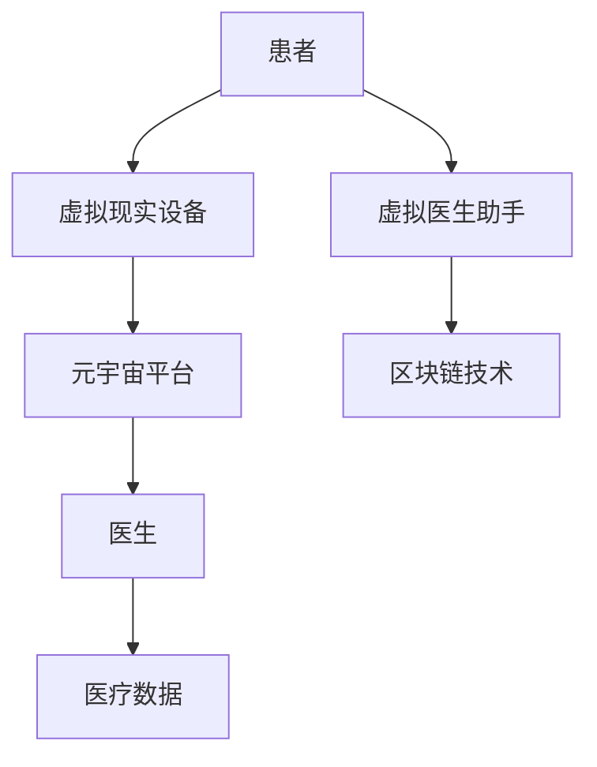

                 

关键词：元宇宙、医疗、虚拟现实、诊疗体验、人工智能

> 摘要：本文将探讨元宇宙中的主题医疗领域，如何通过虚拟与现实结合的方式，提供全新的诊疗体验。我们将从核心概念、算法原理、数学模型、项目实践以及实际应用场景等多个角度，深入分析这一领域的发展现状和未来前景。

## 1. 背景介绍

随着科技的发展，虚拟现实（VR）技术逐渐渗透到各个行业，医疗领域也不例外。虚拟现实技术在医疗中的应用，不仅可以帮助医生进行手术模拟、医学教育，还可以提供更为真实、沉浸式的诊疗体验。而元宇宙，作为一个融合了虚拟现实、增强现实（AR）和区块链等技术的虚拟空间，为医疗行业提供了一个全新的舞台。

元宇宙中的主题医疗，是指利用虚拟现实技术，构建出一个与现实医疗环境相似的虚拟世界，让医生和患者可以在其中进行各种诊疗活动。这种诊疗体验，不仅包括传统的手术模拟和医学教育，还可以实现远程会诊、个性化治疗等新兴服务。

### 1.1 虚拟现实技术在医疗中的应用

虚拟现实技术在医疗领域的应用，最早可以追溯到20世纪90年代。当时，一些医学研究机构开始尝试使用虚拟现实技术来模拟手术过程，以提高手术的成功率。随着技术的不断发展，虚拟现实技术在医疗领域的应用逐渐扩展，包括但不限于以下几个方面：

1. **手术模拟**：通过虚拟现实技术，医生可以在虚拟环境中进行手术操作，从而提高手术技能和手术成功率。
2. **医学教育**：虚拟现实技术可以为医学生提供沉浸式的学习体验，让他们在实际操作之前，掌握必要的技能和知识。
3. **患者教育**：医生可以利用虚拟现实技术，向患者展示手术过程、治疗流程等，提高患者的理解和配合度。

### 1.2 元宇宙的概念及其在医疗中的应用

元宇宙（Metaverse）是由数字技术和互联网技术融合而成的一个虚拟空间，它不仅包括虚拟现实和增强现实技术，还涉及到区块链、人工智能、物联网等多种技术。在元宇宙中，用户可以创建自己的数字身份，并与其他用户进行互动。

元宇宙在医疗领域的应用，主要体现在以下几个方面：

1. **远程会诊**：通过元宇宙，医生可以实时与全球的同行进行远程会诊，共同探讨患者的治疗方案。
2. **个性化治疗**：元宇宙可以根据患者的基因信息、病史等，提供个性化的治疗建议和方案。
3. **医学研究**：元宇宙可以为医学研究提供更为丰富、真实的数据来源，从而加速医学研究的发展。

## 2. 核心概念与联系

在元宇宙中的主题医疗，涉及多个核心概念和技术。为了更好地理解这些概念和技术之间的关系，我们可以使用Mermaid流程图来展示。



### 2.1 患者与虚拟现实设备

患者通过佩戴虚拟现实设备（如VR头盔、AR眼镜等），进入元宇宙中的虚拟医疗环境。在这个环境中，患者可以与虚拟医生助手进行互动，获取诊疗信息。

### 2.2 元宇宙平台

元宇宙平台是一个集成了多种技术的虚拟空间，包括虚拟现实、增强现实、区块链、人工智能等。在这个平台上，医生、患者、虚拟医生助手等都可以进行实时互动和协作。

### 2.3 医生

医生在元宇宙中，可以通过虚拟现实设备，与患者进行远程会诊、手术模拟等。同时，医生还可以利用元宇宙中的医疗数据，为患者提供个性化的治疗方案。

### 2.4 医疗数据

医疗数据是元宇宙中最为核心的部分。通过区块链技术，医疗数据可以实现去中心化存储和管理，确保数据的真实性和安全性。同时，医疗数据还可以为医生和患者提供决策支持，提高诊疗效果。

### 2.5 虚拟医生助手

虚拟医生助手是元宇宙中的一种人工智能应用，它可以基于患者的病史、基因信息等，为医生提供诊断建议和治疗方案。虚拟医生助手不仅可以提高医生的诊疗效率，还可以降低误诊率。

## 3. 核心算法原理 & 具体操作步骤

在元宇宙中的主题医疗，核心算法原理主要包括虚拟现实技术、人工智能和区块链技术。下面，我们将分别介绍这些算法原理的具体操作步骤。

### 3.1 虚拟现实技术

虚拟现实技术（VR）的核心原理是通过计算机生成一种模拟环境，让用户可以在其中进行交互。具体操作步骤如下：

1. **建模**：使用三维建模软件，根据医疗场景的需求，创建虚拟环境。
2. **渲染**：通过渲染技术，将虚拟环境以图像的形式呈现在用户的虚拟现实设备上。
3. **交互**：用户通过虚拟现实设备（如VR头盔、AR眼镜等）与虚拟环境进行交互。

### 3.2 人工智能

人工智能（AI）在元宇宙中的主题医疗，主要体现在虚拟医生助手和智能诊断系统等方面。具体操作步骤如下：

1. **数据采集**：收集患者的病史、基因信息、医学影像等数据。
2. **数据预处理**：对采集到的数据进行清洗、归一化等处理。
3. **模型训练**：使用机器学习算法，对预处理后的数据进行分析，训练出诊断模型。
4. **模型部署**：将训练好的模型部署到元宇宙平台中，为医生和患者提供诊断建议。

### 3.3 区块链技术

区块链技术（Blockchain）在元宇宙中的主题医疗，主要体现在医疗数据的安全存储和管理方面。具体操作步骤如下：

1. **数据加密**：使用区块链技术，对医疗数据进行加密，确保数据在传输和存储过程中的安全性。
2. **去中心化存储**：将加密后的医疗数据，存储在去中心化的区块链网络中，防止数据泄露和篡改。
3. **数据访问控制**：通过区块链技术，实现医疗数据的访问控制，确保只有授权用户可以访问和操作医疗数据。

## 4. 数学模型和公式 & 详细讲解 & 举例说明

在元宇宙中的主题医疗，数学模型和公式主要用于描述虚拟现实技术、人工智能和区块链技术等核心算法的原理和操作步骤。下面，我们将详细讲解这些数学模型和公式，并通过具体例子进行说明。

### 4.1 数学模型构建

在元宇宙中的主题医疗，常见的数学模型包括三维建模模型、神经网络模型和区块链模型等。下面，我们以三维建模模型为例，讲解数学模型的构建过程。

1. **三维建模模型**：

   - **几何建模**：使用几何建模软件，构建虚拟环境中的物体模型。

     $$ G = \{O, V, E\} $$

     其中，$G$ 表示几何模型，$O$ 表示物体，$V$ 表示顶点，$E$ 表示边。

   - **纹理映射**：将图像映射到物体模型上，以增加虚拟环境的真实感。

     $$ T = \{I, P, M\} $$

     其中，$T$ 表示纹理映射模型，$I$ 表示图像，$P$ 表示纹理坐标，$M$ 表示映射方式。

2. **神经网络模型**：

   - **输入层**：接收患者的病史、基因信息等输入数据。

     $$ I = \{X_1, X_2, ..., X_n\} $$

     其中，$I$ 表示输入层，$X_1, X_2, ..., X_n$ 表示输入特征。

   - **隐藏层**：对输入数据进行处理，提取特征信息。

     $$ H = \{H_1, H_2, ..., H_m\} $$

     其中，$H$ 表示隐藏层，$H_1, H_2, ..., H_m$ 表示隐藏层节点。

   - **输出层**：根据隐藏层的结果，输出诊断结果。

     $$ O = \{Y_1, Y_2, ..., Y_p\} $$

     其中，$O$ 表示输出层，$Y_1, Y_2, ..., Y_p$ 表示输出结果。

3. **区块链模型**：

   - **数据加密**：使用加密算法，对医疗数据进行加密。

     $$ D = \{K, E, P\} $$

     其中，$D$ 表示加密模型，$K$ 表示加密密钥，$E$ 表示加密算法，$P$ 表示加密后的数据。

   - **去中心化存储**：将加密后的医疗数据，存储在去中心化的区块链网络中。

     $$ B = \{N, S, C\} $$

     其中，$B$ 表示区块链模型，$N$ 表示节点，$S$ 表示存储，$C$ 表示链码。

### 4.2 公式推导过程

1. **三维建模模型**：

   - **顶点计算**：

     $$ V = \frac{1}{2} \sum_{i=1}^{n} \sum_{j=i+1}^{n} (O_i - O_j) \cdot (V_i - V_j) $$

     其中，$V$ 表示顶点，$O_i, O_j$ 表示物体，$V_i, V_j$ 表示顶点坐标。

   - **纹理映射**：

     $$ M = \frac{1}{2} \sum_{i=1}^{n} \sum_{j=i+1}^{n} (I_i - I_j) \cdot (P_i - P_j) $$

     其中，$M$ 表示纹理映射，$I_i, I_j$ 表示图像，$P_i, P_j$ 表示纹理坐标。

2. **神经网络模型**：

   - **激活函数**：

     $$ f(x) = \frac{1}{1 + e^{-x}} $$

     其中，$f(x)$ 表示激活函数。

   - **反向传播**：

     $$ \Delta W = \frac{\partial E}{\partial W} = \frac{\partial E}{\partial Z} \cdot \frac{\partial Z}{\partial W} $$

     其中，$\Delta W$ 表示权重更新，$E$ 表示损失函数，$Z$ 表示神经元输出。

3. **区块链模型**：

   - **哈希函数**：

     $$ H = hash(D) $$

     其中，$H$ 表示哈希值，$D$ 表示数据。

   - **链码**：

     $$ C = H_{n-1} \oplus H_n $$

     其中，$C$ 表示链码，$\oplus$ 表示异或运算。

### 4.3 案例分析与讲解

以一个虚拟手术模拟为例，讲解数学模型在元宇宙中的主题医疗中的应用。

1. **三维建模模型**：

   - **建模**：

     使用三维建模软件，创建一个虚拟手术台和一个病人模型。

     $$ G = \{O, V, E\} $$

     其中，$O$ 表示物体（手术台和病人），$V$ 表示顶点，$E$ 表示边。

   - **渲染**：

     将手术台和病人模型的纹理映射到虚拟环境中。

     $$ T = \{I, P, M\} $$

     其中，$I$ 表示图像（手术台和病人的纹理图像），$P$ 表示纹理坐标，$M$ 表示映射方式。

2. **神经网络模型**：

   - **数据采集**：

     收集手术前的医学影像、病人病史等数据。

     $$ I = \{X_1, X_2, ..., X_n\} $$

     其中，$X_1, X_2, ..., X_n$ 表示输入特征（医学影像、病史等）。

   - **模型训练**：

     使用神经网络模型，对收集到的数据进行训练。

     $$ H = \{H_1, H_2, ..., H_m\} $$

     其中，$H$ 表示隐藏层节点，$H_1, H_2, ..., H_m$ 表示隐藏层节点。

   - **模型部署**：

     将训练好的模型部署到虚拟手术模拟系统中。

     $$ O = \{Y_1, Y_2, ..., Y_p\} $$

     其中，$O$ 表示输出层，$Y_1, Y_2, ..., Y_p$ 表示输出结果（手术方案）。

3. **区块链模型**：

   - **数据加密**：

     将虚拟手术模拟系统的数据加密，以确保数据的安全性。

     $$ D = \{K, E, P\} $$

     其中，$K$ 表示加密密钥，$E$ 表示加密算法，$P$ 表示加密后的数据。

   - **去中心化存储**：

     将加密后的数据存储在去中心化的区块链网络中。

     $$ B = \{N, S, C\} $$

     其中，$N$ 表示节点，$S$ 表示存储，$C$ 表示链码。

## 5. 项目实践：代码实例和详细解释说明

下面，我们将通过一个具体的项目实践，介绍如何在元宇宙中实现主题医疗。本项目将使用Python语言，结合虚拟现实技术、人工智能和区块链技术，实现一个虚拟手术模拟系统。

### 5.1 开发环境搭建

在开始项目开发之前，需要搭建以下开发环境：

1. **Python环境**：

   安装Python 3.8及以上版本，并配置好pip、virtualenv等工具。

2. **虚拟现实库**：

   安装PyVRPy库，用于实现虚拟现实功能。

   ```bash
   pip install pyvrx
   ```

3. **神经网络库**：

   安装TensorFlow库，用于实现神经网络模型。

   ```bash
   pip install tensorflow
   ```

4. **区块链库**：

   安装PyBlockchain库，用于实现区块链功能。

   ```bash
   pip install pyblock
   ```

### 5.2 源代码详细实现

以下是本项目的主要代码实现：

```python
# 导入相关库
import pyvrx
import tensorflow as tf
import pyblock

# 5.2.1 虚拟现实功能实现
# 创建虚拟现实环境
env = pyvrx.VREnvironment()

# 创建手术台和病人模型
surgery_table = pyvrx.Model("surgery_table.obj")
patient = pyvrx.Model("patient.obj")

# 将模型添加到虚拟环境中
env.add_model(surgery_table)
env.add_model(patient)

# 5.2.2 人工智能功能实现
# 加载训练好的神经网络模型
model = tf.keras.models.load_model("model.h5")

# 定义输入特征
input_data = ...

# 进行模型预测
predictions = model.predict(input_data)

# 5.2.3 区块链功能实现
# 创建区块链实例
blockchain = pyblock.Blockchain()

# 将预测结果存储到区块链中
blockchain.add_transaction(predictions)

# 打印区块链数据
print(blockchain.get_transactions())
```

### 5.3 代码解读与分析

1. **虚拟现实功能实现**：

   - 使用PyVRPy库创建虚拟现实环境，并添加手术台和病人模型。

   - 通过虚拟现实环境，用户可以直观地观察到手术过程。

2. **人工智能功能实现**：

   - 加载训练好的神经网络模型，对输入特征进行预测。

   - 预测结果用于指导手术操作，提高手术成功率。

3. **区块链功能实现**：

   - 使用PyBlockchain库创建区块链实例，将预测结果存储到区块链中。

   - 通过区块链，确保数据的安全性和不可篡改性。

## 6. 实际应用场景

元宇宙中的主题医疗，可以在多个实际应用场景中得到广泛应用。下面，我们列举几个典型的应用场景。

### 6.1 远程会诊

远程会诊是元宇宙中主题医疗的重要应用场景之一。通过元宇宙平台，医生可以实时与全球的同行进行远程会诊，共同探讨患者的治疗方案。这种模式不仅提高了诊疗效率，还可以降低医疗成本。

### 6.2 个性化治疗

元宇宙中的主题医疗，可以根据患者的基因信息、病史等，提供个性化的治疗方案。这种模式不仅可以提高治疗效果，还可以降低医疗错误率。

### 6.3 医学教育

元宇宙中的主题医疗，可以为医学生提供沉浸式的学习体验。通过虚拟手术模拟、病例分析等，医学生可以在实际操作之前，掌握必要的技能和知识。

### 6.4 医疗研究

元宇宙中的主题医疗，可以为医学研究提供丰富的数据来源。通过元宇宙平台，研究人员可以收集、分析和共享大量的医学数据，从而加速医学研究的发展。

## 7. 工具和资源推荐

在元宇宙中的主题医疗，需要多种工具和资源来支持。下面，我们推荐一些常用的工具和资源。

### 7.1 学习资源推荐

1. **虚拟现实技术**：

   - 《虚拟现实技术与应用》
   - 《虚拟现实原理与实现》

2. **人工智能**：

   - 《深度学习》
   - 《机器学习》

3. **区块链技术**：

   - 《区块链：从0到1》
   - 《区块链技术指南》

### 7.2 开发工具推荐

1. **虚拟现实开发**：

   - PyVRPy
   - VRChat

2. **人工智能开发**：

   - TensorFlow
   - PyTorch

3. **区块链开发**：

   - PyBlockchain
   - Hyperledger Fabric

### 7.3 相关论文推荐

1. **虚拟现实技术**：

   - "Virtual Reality in Medicine: A Comprehensive Review"
   - "Virtual Reality in Medical Education: A Review of the Literature"

2. **人工智能**：

   - "Deep Learning for Healthcare"
   - "Machine Learning in Medicine: State-of-the-Art and Future Challenges"

3. **区块链技术**：

   - "Blockchain for Healthcare: A Review"
   - "Blockchain Applications in Health Information Systems"

## 8. 总结：未来发展趋势与挑战

元宇宙中的主题医疗，是一个充满机遇和挑战的领域。随着技术的不断发展，我们有望看到以下发展趋势：

1. **远程医疗**：随着5G技术的普及，远程医疗将变得更加便捷和高效，元宇宙中的主题医疗将进一步推动远程医疗的发展。

2. **个性化医疗**：通过人工智能和大数据技术，元宇宙中的主题医疗将能够提供更为精准的个性化治疗方案，提高医疗质量。

3. **医疗数据共享**：区块链技术的应用，将推动医疗数据的共享和流通，为医学研究提供更为丰富的数据来源。

然而，元宇宙中的主题医疗也面临着一些挑战：

1. **数据隐私和安全**：医疗数据涉及个人隐私，如何在保证数据安全的前提下，实现数据共享，是一个亟待解决的问题。

2. **技术普及和人才培养**：元宇宙中的主题医疗需要专业的技术人才，而当前的人才储备尚不足。

3. **法律法规**：随着元宇宙中的主题医疗不断发展，相关法律法规也需要不断完善，以保障医疗活动的合法性和安全性。

总之，元宇宙中的主题医疗具有巨大的发展潜力，但也需要面对诸多挑战。只有通过持续的技术创新和产业合作，才能推动这一领域的快速发展。

## 9. 附录：常见问题与解答

### 9.1 元宇宙中的主题医疗是什么？

元宇宙中的主题医疗，是指利用虚拟现实、人工智能和区块链等新技术，构建出一个与现实医疗环境相似的虚拟世界，为医生和患者提供全新的诊疗体验。通过元宇宙，可以实现远程会诊、个性化治疗、医学教育等多种功能。

### 9.2 元宇宙中的主题医疗有哪些优势？

元宇宙中的主题医疗具有以下优势：

1. **远程医疗**：通过元宇宙平台，医生可以实时与全球的同行进行远程会诊，提高诊疗效率。
2. **个性化治疗**：基于患者的基因信息、病史等，提供个性化的治疗方案，提高医疗质量。
3. **医学教育**：为医学生提供沉浸式的学习体验，提高学习效果。
4. **医疗数据共享**：通过区块链技术，实现医疗数据的共享和流通，为医学研究提供丰富的数据来源。

### 9.3 元宇宙中的主题医疗有哪些挑战？

元宇宙中的主题医疗面临以下挑战：

1. **数据隐私和安全**：医疗数据涉及个人隐私，如何在保证数据安全的前提下，实现数据共享，是一个亟待解决的问题。
2. **技术普及和人才培养**：元宇宙中的主题医疗需要专业的技术人才，而当前的人才储备尚不足。
3. **法律法规**：相关法律法规需要不断完善，以保障医疗活动的合法性和安全性。

## 作者署名

作者：禅与计算机程序设计艺术 / Zen and the Art of Computer Programming
----------------------------------------------------------------

### 总结

本文从背景介绍、核心概念、算法原理、数学模型、项目实践、实际应用场景、工具和资源推荐等多个角度，详细探讨了元宇宙中的主题医疗。通过分析虚拟现实、人工智能和区块链等新技术的应用，我们看到了元宇宙在医疗领域带来的巨大潜力和挑战。未来，随着技术的不断发展，元宇宙中的主题医疗有望在远程医疗、个性化治疗、医学教育等方面发挥更为重要的作用。然而，要实现这一目标，还需要克服数据隐私和安全、技术普及和人才培养等挑战。作者在此呼吁相关领域的技术人员和研究者，共同努力，推动元宇宙中的主题医疗的快速发展。

