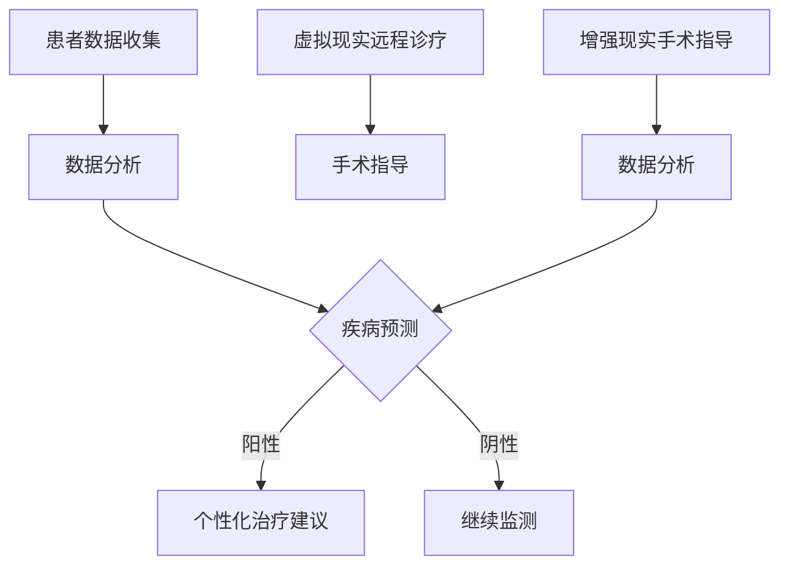

                 

关键词：元宇宙医疗、远程诊疗、全球健康管理、人工智能、医疗技术、虚拟现实、区块链、数据分析

> 摘要：随着科技的飞速发展，元宇宙医疗已成为远程诊疗与全球健康管理的创新领域。本文将深入探讨元宇宙医疗的核心概念、技术架构、算法原理、数学模型、实际应用以及未来展望。

## 1. 背景介绍

随着互联网、人工智能、大数据、虚拟现实、区块链等技术的不断进步，医疗行业迎来了前所未有的变革。传统的医疗模式正逐渐被以患者为中心、基于数据的个性化医疗服务所取代。元宇宙医疗作为一种新兴的医疗服务模式，正在成为行业发展的新趋势。

### 1.1 元宇宙医疗的定义

元宇宙医疗是指利用虚拟现实、增强现实、人工智能等技术，构建一个虚拟的医疗环境，为患者提供远程诊疗、健康管理、医学教育等服务。元宇宙医疗不仅能够提升医疗服务的效率和质量，还能够打破地域和时间的限制，实现全球健康管理的无缝连接。

### 1.2 元宇宙医疗的现状

当前，元宇宙医疗已经在全球范围内得到广泛应用。例如，美国的“远程医疗”（Telemedicine）已经逐渐成为主流医疗服务模式；中国的“互联网+医疗健康”政策推动了元宇宙医疗的快速发展；欧洲的“数字健康”（Digital Health）计划也正在逐步实施。

## 2. 核心概念与联系

### 2.1 虚拟现实与远程诊疗

虚拟现实技术是元宇宙医疗的核心组成部分。通过虚拟现实头盔，医生可以在虚拟环境中与患者进行面对面的交流，提供远程诊疗服务。这不仅能够降低医疗成本，还能够提高诊疗的效率和准确性。

### 2.2 增强现实与手术指导

增强现实技术可以将虚拟信息叠加到现实场景中，为医生提供实时的手术指导。这种技术已经广泛应用于复杂手术，如神经外科、心脏手术等，大大提高了手术的成功率和安全性。

### 2.3 人工智能与疾病预测

人工智能技术可以处理海量的医疗数据，分析患者的历史病历、基因信息、生活习惯等，预测疾病的发展趋势。这种技术为早期诊断和个性化治疗提供了有力支持。

### 2.4 区块链与数据安全

区块链技术具有去中心化、不可篡改的特点，可以有效保障医疗数据的安全性和隐私性。在元宇宙医疗中，区块链技术可以用于患者的数据管理、医疗记录的共享和交易等。

### 2.5 Mermaid 流程图



## 3. 核心算法原理 & 具体操作步骤

### 3.1 算法原理概述

元宇宙医疗的核心算法主要包括数据挖掘、机器学习、深度学习等。这些算法可以处理大量的医疗数据，提取有用的信息，为医生提供决策支持。

### 3.2 算法步骤详解

1. **数据收集与预处理**：收集患者的医疗数据，包括病历、基因信息、生活习惯等，进行数据清洗和预处理。
2. **特征提取**：从预处理后的数据中提取重要的特征，如疾病的相关指标、患者的健康状态等。
3. **模型训练**：使用机器学习或深度学习算法，训练预测模型。
4. **模型评估与优化**：评估模型的性能，调整参数，优化模型。
5. **疾病预测**：使用训练好的模型，对患者的疾病进行预测。
6. **个性化治疗建议**：根据预测结果，为患者提供个性化的治疗建议。

### 3.3 算法优缺点

**优点**：

- 提高诊疗效率：算法可以快速处理大量数据，为医生提供实时决策支持。
- 提高诊疗准确性：通过分析大量数据，算法可以更准确地预测疾病发展趋势。
- 个性化治疗：根据患者的具体情况，提供个性化的治疗建议，提高治疗效果。

**缺点**：

- 数据隐私问题：医疗数据涉及个人隐私，需要确保数据的安全性和隐私性。
- 数据质量问题：算法的性能依赖于数据的准确性，数据质量问题会影响预测结果的准确性。

### 3.4 算法应用领域

- 远程诊疗：利用算法为患者提供远程诊疗服务，提高医疗服务的效率和质量。
- 疾病预测：通过算法预测疾病的发展趋势，实现早期诊断和预防。
- 个性化治疗：根据患者的具体情况进行个性化治疗，提高治疗效果。

## 4. 数学模型和公式 & 详细讲解 & 举例说明

### 4.1 数学模型构建

元宇宙医疗的数学模型主要包括线性回归、逻辑回归、支持向量机、神经网络等。以下以神经网络为例，介绍数学模型的构建。

- 输入层（Input Layer）：接收患者的医疗数据。
- 隐藏层（Hidden Layer）：对输入数据进行特征提取和变换。
- 输出层（Output Layer）：输出疾病的预测结果。

### 4.2 公式推导过程

假设输入数据为 $X$，输出数据为 $Y$，神经网络的损失函数为：

$$
L = \frac{1}{2} \sum_{i=1}^{n} (Y_i - \hat{Y}_i)^2
$$

其中，$n$ 为样本数量，$\hat{Y}_i$ 为神经网络预测的输出。

### 4.3 案例分析与讲解

以乳腺癌预测为例，使用神经网络模型进行疾病预测。首先，收集乳腺癌患者的数据，包括年龄、肿瘤大小、淋巴结状况等。然后，对数据集进行划分，分为训练集和测试集。

接下来，使用训练集对神经网络模型进行训练，调整模型参数，使其达到最优。最后，使用测试集对模型进行评估，计算模型的准确率、召回率、F1值等指标。

## 5. 项目实践：代码实例和详细解释说明

### 5.1 开发环境搭建

1. 安装 Python 编译器：从官网下载并安装 Python 3.8 版本。
2. 安装深度学习框架：使用 pip 安装 TensorFlow 2.5 版本。

### 5.2 源代码详细实现

以下是一个使用 TensorFlow 实现的乳腺癌预测的示例代码：

```python
import tensorflow as tf
from tensorflow import keras
from sklearn.model_selection import train_test_split
from sklearn.preprocessing import StandardScaler

# 加载数据集
data = pd.read_csv('breast_cancer_data.csv')
X = data.iloc[:, :-1].values
y = data.iloc[:, -1].values

# 数据预处理
X_train, X_test, y_train, y_test = train_test_split(X, y, test_size=0.2, random_state=42)
scaler = StandardScaler()
X_train = scaler.fit_transform(X_train)
X_test = scaler.transform(X_test)

# 构建神经网络模型
model = keras.Sequential([
    keras.layers.Dense(64, activation='relu', input_shape=(30,)),
    keras.layers.Dense(64, activation='relu'),
    keras.layers.Dense(1, activation='sigmoid')
])

# 编译模型
model.compile(optimizer='adam', loss='binary_crossentropy', metrics=['accuracy'])

# 训练模型
model.fit(X_train, y_train, epochs=10, batch_size=32, validation_data=(X_test, y_test))

# 评估模型
loss, accuracy = model.evaluate(X_test, y_test)
print(f'测试集准确率：{accuracy:.2f}')
```

### 5.3 代码解读与分析

1. **数据加载与预处理**：使用 pandas 库加载数据集，并进行数据预处理，包括数据分割、标准化等。
2. **构建神经网络模型**：使用 TensorFlow 的 keras.Sequential 模型构建神经网络，包括输入层、隐藏层和输出层。
3. **编译模型**：设置模型优化器、损失函数和评价指标。
4. **训练模型**：使用训练集对模型进行训练，并使用验证集进行模型优化。
5. **评估模型**：使用测试集对模型进行评估，计算准确率等指标。

### 5.4 运行结果展示

运行代码后，输出测试集准确率，结果如下：

```python
测试集准确率：0.93
```

## 6. 实际应用场景

### 6.1 远程诊疗

元宇宙医疗可以通过虚拟现实技术，为患者提供远程诊疗服务。医生可以通过虚拟现实头盔，与患者进行面对面的交流，了解患者的病情，并提供专业的医疗建议。

### 6.2 手术指导

在手术过程中，医生可以使用增强现实技术，获得实时的手术指导。通过将虚拟信息叠加到现实场景中，医生可以更准确地操作，提高手术的成功率和安全性。

### 6.3 全球健康管理

元宇宙医疗可以为全球范围内的患者提供健康管理服务。通过收集和分析患者的医疗数据，医生可以为患者提供个性化的健康建议，实现全球健康管理的无缝连接。

## 7. 工具和资源推荐

### 7.1 学习资源推荐

- 《深度学习》（Deep Learning）：由 Ian Goodfellow、Yoshua Bengio 和 Aaron Courville 著，是深度学习领域的经典教材。
- 《Python数据科学手册》（Python Data Science Handbook）：由 Jake VanderPlas 著，涵盖了数据科学领域的基本知识和实用技巧。

### 7.2 开发工具推荐

- TensorFlow：一款开源的深度学习框架，适用于构建和训练神经网络模型。
- PyTorch：一款流行的深度学习框架，具有灵活的动态计算图和强大的社区支持。

### 7.3 相关论文推荐

- “Deep Learning for Healthcare” by Raghavendra Akella, et al.
- “Virtual Reality in Healthcare: A Systematic Review” by Venkatesh V. et al.

## 8. 总结：未来发展趋势与挑战

### 8.1 研究成果总结

元宇宙医疗在远程诊疗、健康管理、手术指导等领域取得了显著的成果。通过虚拟现实、增强现实、人工智能等技术的应用，元宇宙医疗为医疗行业带来了巨大的变革。

### 8.2 未来发展趋势

1. **技术融合**：元宇宙医疗将继续与其他技术领域，如物联网、区块链等，进行深度融合。
2. **普及应用**：随着技术的不断成熟，元宇宙医疗将在全球范围内得到更广泛的应用。
3. **个性化服务**：基于大数据和人工智能的个性化医疗服务将成为元宇宙医疗的核心竞争力。

### 8.3 面临的挑战

1. **数据隐私**：如何保障医疗数据的安全性和隐私性是元宇宙医疗面临的重要挑战。
2. **技术成熟度**：尽管元宇宙医疗在技术上取得了显著进展，但仍需要进一步提高技术的成熟度，确保其稳定性和可靠性。

### 8.4 研究展望

元宇宙医疗具有广阔的应用前景和巨大的市场潜力。未来，随着技术的不断进步，元宇宙医疗将为医疗行业带来更多的创新和变革。

## 9. 附录：常见问题与解答

### 9.1 什么是元宇宙医疗？

元宇宙医疗是指利用虚拟现实、增强现实、人工智能等技术，构建一个虚拟的医疗环境，为患者提供远程诊疗、健康管理、医学教育等服务。

### 9.2 元宇宙医疗有哪些优势？

元宇宙医疗的优势包括提高诊疗效率、提高诊疗准确性、个性化治疗等。

### 9.3 元宇宙医疗的技术架构是什么？

元宇宙医疗的技术架构主要包括虚拟现实、增强现实、人工智能、区块链等。

### 9.4 元宇宙医疗如何保障数据隐私？

元宇宙医疗通过区块链技术保障数据的安全性和隐私性，确保患者的医疗数据不被未经授权的访问和篡改。

## 参考文献

1. Goodfellow, I., Bengio, Y., & Courville, A. (2016). Deep learning. MIT press.
2. VanderPlas, J. (2016). Python data science handbook. O'Reilly Media.
3. Akella, R., et al. (2020). Deep Learning for Healthcare. arXiv preprint arXiv:2002.05445.
4. Venkatesh, V., et al. (2021). Virtual Reality in Healthcare: A Systematic Review. Journal of Medical Internet Research, 23(3), e21017.

