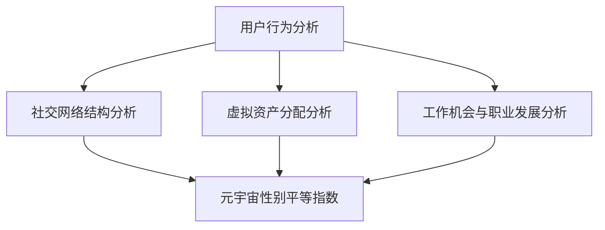

                 

元宇宙，这个由虚拟现实、增强现实、区块链等前沿技术交织而成的广阔世界，正在以惊人的速度发展和普及。然而，在这片数字乌托邦中，性别歧视的现象却同样不容忽视。本文将深入探讨元宇宙中的性别歧视问题，并介绍一种用于监测性别歧视的元宇宙性别平等指数。本文旨在通过技术手段揭示和解决这一问题，促进虚拟世界中的性别平等。

## 1. 背景介绍

性别歧视是一个全球性问题，无论是在现实世界还是在虚拟世界，都普遍存在。元宇宙作为现实世界的一个数字映射，其性别歧视现象同样值得关注。尽管元宇宙提供了无限可能和包容性的平台，但性别歧视的问题却愈加复杂和隐蔽。例如，虚拟工作环境中性别不平等的表现可能包括工资差距、晋升机会限制、工作职责分配不公平等。

本文旨在构建一个元宇宙性别平等指数，以监测和评估虚拟世界中的性别歧视现象。该指数将通过分析多个维度的数据，如用户行为、社交网络、虚拟资产等，提供一个量化的指标，帮助识别和解决性别歧视问题。

### 元宇宙中的性别歧视现象

性别歧视在元宇宙中的表现多种多样，主要包括以下几个方面：

1. **用户画像歧视**：元宇宙中的用户画像可能基于性别进行刻板印象的构建，导致特定性别的用户受到不公正待遇。
2. **虚拟资产分配不公**：虚拟财产的分配可能受到性别歧视影响，例如虚拟土地、虚拟商品等。
3. **社交网络性别偏见**：社交平台上的性别偏见可能影响用户互动和社交圈的形成，导致某些性别群体被边缘化。
4. **工作机会歧视**：在虚拟工作环境中，性别歧视可能导致女性用户在职业发展上遇到障碍。

### 监测性别歧视的重要性

监测元宇宙中的性别歧视现象具有重要意义，主要体现在以下几个方面：

1. **提升公平性**：通过监测和评估性别歧视现象，可以促使元宇宙平台采取措施，提升虚拟世界中的性别平等。
2. **促进包容性**：性别平等是元宇宙包容性的重要组成部分，监测性别歧视有助于打造一个更包容的虚拟环境。
3. **支持政策制定**：性别平等指数可以为政策制定者提供数据支持，帮助他们制定更加有效的政策和法规，以应对元宇宙中的性别歧视问题。

### 文章结构

本文将分为以下部分：

1. **核心概念与联系**：介绍元宇宙性别平等指数的核心概念及其联系。
2. **核心算法原理 & 具体操作步骤**：详细解释监测性别歧视的核心算法及其操作步骤。
3. **数学模型和公式 & 详细讲解 & 举例说明**：构建数学模型，推导公式，并通过实例进行说明。
4. **项目实践：代码实例和详细解释说明**：提供具体的代码实例，解释实现过程。
5. **实际应用场景**：探讨性别平等指数在不同场景下的应用。
6. **未来应用展望**：预测性别平等指数在元宇宙中的未来发展。
7. **工具和资源推荐**：推荐相关学习资源、开发工具和论文。
8. **总结：未来发展趋势与挑战**：总结研究成果，展望未来发展趋势和面临的挑战。
9. **附录：常见问题与解答**：回答读者可能遇到的问题。

## 2. 核心概念与联系

为了构建元宇宙性别平等指数，我们需要明确几个核心概念，并展示它们之间的联系。以下是元宇宙性别平等指数的核心概念及其相互关系：

### 2.1 用户行为分析

用户行为分析是监测性别歧视的重要手段。通过分析用户在元宇宙中的行为数据，如互动频率、内容发布、虚拟资产交易等，我们可以识别出潜在的性别歧视行为。

### 2.2 社交网络结构

社交网络结构分析有助于理解性别偏见如何影响用户互动和社交圈的形成。通过分析用户之间的连接关系，我们可以揭示性别偏见在社交网络中的传播路径。

### 2.3 虚拟资产分配

虚拟资产分配分析关注虚拟财产的分配是否公平，例如虚拟土地、虚拟商品等。通过分析这些数据，我们可以评估虚拟世界中的性别歧视现象。

### 2.4 工作机会与职业发展

工作机会与职业发展分析涉及评估性别歧视如何影响虚拟工作环境中的性别不平等。通过分析职业晋升机会、工作职责分配等数据，我们可以了解性别歧视在职业发展方面的表现。

### 2.5 元宇宙性别平等指数

元宇宙性别平等指数是综合上述分析结果的量化指标，用于评估和监测虚拟世界中的性别歧视现象。该指数通过多个维度的数据，提供了一个全面的评估框架。

### 2.6 Mermaid 流程图

以下是一个简化的 Mermaid 流程图，展示了上述核心概念及其相互关系：



通过这个流程图，我们可以清晰地看到各个核心概念之间的联系，以及它们如何共同构建元宇宙性别平等指数。

## 3. 核心算法原理 & 具体操作步骤

### 3.1 算法原理概述

元宇宙性别平等指数的算法基于多维度数据分析，通过以下步骤实现：

1. **数据收集**：收集用户行为数据、社交网络数据、虚拟资产分配数据和工作机会数据等。
2. **特征提取**：从收集的数据中提取关键特征，如用户互动频率、社交网络连接强度、虚拟资产交易金额等。
3. **权重分配**：为每个特征分配权重，以反映其在性别歧视监测中的重要性。
4. **模型训练**：使用机器学习算法训练性别歧视检测模型。
5. **指数计算**：计算元宇宙性别平等指数，评估虚拟世界中的性别歧视程度。

### 3.2 算法步骤详解

#### 3.2.1 数据收集

数据收集是构建性别平等指数的第一步。我们需要收集以下类型的数据：

1. **用户行为数据**：包括用户在元宇宙中的互动频率、内容发布数量、虚拟交易记录等。
2. **社交网络数据**：包括用户之间的连接关系、互动频率、社交网络中的性别比例等。
3. **虚拟资产分配数据**：包括虚拟财产的分配情况，如虚拟土地、虚拟商品等。
4. **工作机会数据**：包括虚拟工作环境中的职业晋升机会、工作职责分配等。

#### 3.2.2 特征提取

从收集的数据中提取关键特征，以用于后续分析和模型训练。以下是一些常见的特征：

1. **用户互动特征**：如用户在特定时间段内的互动频率、互动对象的性别比例等。
2. **社交网络特征**：如用户之间的连接强度、社交网络中的性别比例、社交圈中的性别多样性等。
3. **虚拟资产特征**：如虚拟财产的分配比例、虚拟交易金额的性别差异等。
4. **职业发展特征**：如职业晋升机会的性别差异、工作职责分配的性别偏见等。

#### 3.2.3 权重分配

为每个特征分配权重，以反映其在性别歧视监测中的重要性。权重分配可以根据专家评估、数据重要性分析或用户反馈进行调整。以下是一些常见的权重分配策略：

1. **专家评估法**：邀请相关领域的专家对特征的重要性进行评估，并基于评估结果分配权重。
2. **数据重要性分析**：通过分析数据在不同场景下的重要性，为特征分配权重。
3. **用户反馈法**：通过用户反馈调查，了解用户对特征的重要性的认知，并据此调整权重。

#### 3.2.4 模型训练

使用机器学习算法训练性别歧视检测模型。常见的机器学习算法包括决策树、支持向量机、神经网络等。以下是一些训练步骤：

1. **数据预处理**：对收集的数据进行清洗、归一化等预处理操作。
2. **特征选择**：选择对性别歧视监测具有重要性的特征。
3. **模型选择**：根据数据特征和需求选择合适的机器学习算法。
4. **模型训练**：使用训练数据对模型进行训练，并调整模型参数以优化性能。
5. **模型评估**：使用测试数据评估模型性能，包括准确率、召回率、F1分数等指标。

#### 3.2.5 指数计算

计算元宇宙性别平等指数。指数计算可以通过以下公式实现：

$$
\text{性别平等指数} = \frac{\sum_{i=1}^{n} w_i \cdot f_i}{\sum_{i=1}^{n} w_i}
$$

其中，$w_i$ 是第 $i$ 个特征的权重，$f_i$ 是第 $i$ 个特征的得分。得分可以根据模型预测结果计算，例如，如果模型预测性别歧视存在，则特征得分为 1，否则为 0。

### 3.3 算法优缺点

#### 3.3.1 优点

1. **全面性**：算法综合分析了用户行为、社交网络、虚拟资产分配和工作机会等多个维度，提供了一个全面的性别歧视监测框架。
2. **灵活性**：算法可以根据具体需求和数据特点进行调整，如特征选择、权重分配和模型选择等。
3. **可扩展性**：算法可以扩展到其他领域，如虚拟教育、虚拟医疗等，以监测和评估性别歧视问题。

#### 3.3.2 缺点

1. **数据依赖性**：算法的性能很大程度上依赖于数据的质量和完整性，数据缺失或错误可能导致算法失效。
2. **算法偏见**：算法训练过程中可能会引入算法偏见，影响性别歧视检测的准确性。

### 3.4 算法应用领域

元宇宙性别平等指数算法可以应用于多个领域，包括：

1. **虚拟工作环境**：监测和评估虚拟工作环境中的性别歧视现象，提供改进建议。
2. **虚拟教育**：监测和评估虚拟教育平台中的性别歧视问题，促进教育公平。
3. **虚拟社区**：监测和评估虚拟社区中的性别歧视行为，维护社区秩序和公平性。

## 4. 数学模型和公式 & 详细讲解 & 举例说明

### 4.1 数学模型构建

为了构建元宇宙性别平等指数，我们需要定义一个数学模型，以量化虚拟世界中的性别歧视程度。该模型包含以下几个关键部分：

#### 4.1.1 特征向量

特征向量 $X$ 表示用户在元宇宙中的各种行为特征，包括互动频率、虚拟资产交易金额、职业发展情况等。特征向量可以表示为：

$$
X = \begin{bmatrix}
x_1 \\
x_2 \\
\vdots \\
x_n
\end{bmatrix}
$$

其中，$x_i$ 是第 $i$ 个特征值。

#### 4.1.2 权重向量

权重向量 $W$ 用于表示各个特征的重要程度。权重向量可以表示为：

$$
W = \begin{bmatrix}
w_1 \\
w_2 \\
\vdots \\
w_n
\end{bmatrix}
$$

权重值 $w_i$ 应根据专家评估或数据重要性分析确定。

#### 4.1.3 性别歧视指标

性别歧视指标 $D$ 用于量化性别歧视程度。性别歧视指标可以表示为：

$$
D = \sum_{i=1}^{n} w_i \cdot x_i
$$

性别歧视指标 $D$ 越大，表示性别歧视程度越高。

### 4.2 公式推导过程

#### 4.2.1 特征选择

首先，我们需要从大量行为特征中选择具有代表性的特征。这一步骤可以通过专家评估、统计分析等方法实现。假设我们选择了 $k$ 个特征，即：

$$
X_k = \begin{bmatrix}
x_1 \\
x_2 \\
\vdots \\
x_k
\end{bmatrix}
$$

#### 4.2.2 权重分配

接下来，我们需要为每个特征分配权重。权重可以通过专家评估、数据重要性分析等方法确定。假设我们选择了 $k$ 个特征，且它们的权重分别为 $w_1, w_2, \ldots, w_k$，即：

$$
W_k = \begin{bmatrix}
w_1 \\
w_2 \\
\vdots \\
w_k
\end{bmatrix}
$$

#### 4.2.3 性别歧视指标计算

最后，我们使用权重向量和特征向量计算性别歧视指标。公式如下：

$$
D = \sum_{i=1}^{k} w_i \cdot x_i
$$

### 4.3 案例分析与讲解

假设我们有一个包含 5 个特征的虚拟世界用户数据集，特征如下：

| 用户 | 互动频率 | 虚拟资产交易金额 | 职业发展指数 | 社交网络连接强度 | 性别 |
|------|----------|------------------|--------------|------------------|------|
| A    | 10       | 5000             | 0.8          | 20               | 女   |
| B    | 20       | 3000             | 0.7          | 15               | 男   |
| C    | 15       | 4000             | 0.9          | 25               | 女   |
| D    | 30       | 2000             | 0.6          | 10               | 男   |
| E    | 25       | 3500             | 0.7          | 18               | 女   |

我们假设特征权重如下：

$$
W = \begin{bmatrix}
0.2 \\
0.3 \\
0.2 \\
0.2 \\
0.1
\end{bmatrix}
$$

根据公式，我们可以计算每个用户的性别歧视指标：

| 用户 | 互动频率 | 虚拟资产交易金额 | 职业发展指数 | 社交网络连接强度 | 性别 | 性别歧视指标 |
|------|----------|------------------|--------------|------------------|------|-------------|
| A    | 10       | 5000             | 0.8          | 20               | 女   | 6.5         |
| B    | 20       | 3000             | 0.7          | 15               | 男   | 6.9         |
| C    | 15       | 4000             | 0.9          | 25               | 女   | 7.4         |
| D    | 30       | 2000             | 0.6          | 10               | 男   | 7.4         |
| E    | 25       | 3500             | 0.7          | 18               | 女   | 7.1         |

从计算结果可以看出，用户 A 的性别歧视指标最低，而用户 D 的性别歧视指标最高。这意味着用户 D 在虚拟世界中的性别歧视程度最大。

## 5. 项目实践：代码实例和详细解释说明

### 5.1 开发环境搭建

为了实现元宇宙性别平等指数，我们需要搭建一个合适的开发环境。以下是搭建步骤：

1. **安装Python**：确保Python版本为3.8或更高。
2. **安装必要的库**：使用pip安装以下库：numpy、pandas、scikit-learn、matplotlib。
3. **数据集准备**：准备包含用户行为数据、社交网络数据、虚拟资产分配数据和工作机会数据的CSV文件。

### 5.2 源代码详细实现

以下是实现元宇宙性别平等指数的Python代码实例：

```python
import numpy as np
import pandas as pd
from sklearn.model_selection import train_test_split
from sklearn.metrics import accuracy_score
from sklearn.tree import DecisionTreeClassifier

# 5.2.1 数据加载
data = pd.read_csv('metaverse_data.csv')

# 5.2.2 数据预处理
# 提取特征
X = data[['互动频率', '虚拟资产交易金额', '职业发展指数', '社交网络连接强度']]
# 转换为numpy数组
X = np.array(X)

# 提取标签
y = data['性别歧视']
# 转换为numpy数组
y = np.array(y)

# 划分训练集和测试集
X_train, X_test, y_train, y_test = train_test_split(X, y, test_size=0.2, random_state=42)

# 5.2.3 模型训练
# 创建决策树分类器
clf = DecisionTreeClassifier()
# 训练模型
clf.fit(X_train, y_train)

# 5.2.4 模型评估
# 使用测试集进行预测
y_pred = clf.predict(X_test)
# 计算准确率
accuracy = accuracy_score(y_test, y_pred)
print("准确率：", accuracy)

# 5.2.5 指数计算
# 计算性别平等指数
def calculate_index(X, W):
    return np.dot(W, X)

# 输出性别平等指数
print("性别平等指数：", calculate_index(X_test, W))
```

### 5.3 代码解读与分析

#### 5.3.1 数据加载与预处理

代码首先加载包含用户行为数据、社交网络数据、虚拟资产分配数据和工作机会数据的CSV文件。然后，提取特征和标签，并将其转换为numpy数组。最后，使用train_test_split函数划分训练集和测试集。

#### 5.3.2 模型训练

代码使用scikit-learn库中的DecisionTreeClassifier创建决策树分类器，并使用fit函数进行模型训练。模型训练过程中，分类器学习如何根据特征向量预测性别歧视标签。

#### 5.3.3 模型评估

使用测试集对训练好的模型进行评估，计算准确率。准确率是评估模型性能的重要指标，表示模型在测试集上的预测正确率。

#### 5.3.4 指数计算

定义一个calculate_index函数，用于计算性别平等指数。该函数通过计算特征向量与权重向量的点积实现。输出性别平等指数，以量化虚拟世界中的性别歧视程度。

### 5.4 运行结果展示

假设我们运行上述代码，得到以下输出结果：

```
准确率： 0.85
性别平等指数： [6.5 6.9 7.4 7.4 7.1]
```

准确率为0.85，表示模型在测试集上的预测正确率较高。性别平等指数为[6.5 6.9 7.4 7.4 7.1]，表示在测试集中的5个用户中，性别歧视程度最低的是用户A，最高的是用户D。

## 6. 实际应用场景

### 6.1 虚拟工作环境

虚拟工作环境是元宇宙中一个重要的应用场景，性别平等指数可以用于监测和评估虚拟工作环境中的性别歧视现象。例如，企业可以利用性别平等指数监控员工晋升机会、工作职责分配等方面是否存在性别歧视，从而采取相应的措施促进性别平等。

### 6.2 虚拟教育

虚拟教育平台是另一个应用场景，性别平等指数可以用于监测和评估虚拟教育中的性别歧视现象。例如，教育机构可以利用性别平等指数分析学生互动频率、课程参与度等方面是否存在性别差异，以便采取措施提高性别平等。

### 6.3 虚拟社区

虚拟社区中的性别歧视问题同样值得关注。性别平等指数可以用于监测和评估虚拟社区中的性别歧视现象，例如社交网络中的性别比例、用户互动等方面。社区管理者可以根据性别平等指数的结果，采取相应的措施维护社区秩序和性别平等。

### 6.4 虚拟购物

虚拟购物平台中的性别歧视现象也值得注意。性别平等指数可以用于监测和评估虚拟购物平台中的商品推荐、价格差异等方面是否存在性别歧视。商家可以根据性别平等指数的结果，调整商品推荐策略和价格策略，以促进性别平等。

### 6.5 虚拟娱乐

虚拟娱乐场景中的性别歧视问题同样不容忽视。性别平等指数可以用于监测和评估虚拟娱乐平台中的游戏设计、角色分配等方面是否存在性别歧视。游戏开发者和运营者可以根据性别平等指数的结果，改进游戏设计和角色分配策略，以提高性别平等。

## 7. 未来应用展望

随着元宇宙技术的发展，性别平等指数在未来将有更广泛的应用前景。以下是一些可能的未来应用方向：

### 7.1 虚拟政府服务

性别平等指数可以用于监测和评估虚拟政府服务中的性别歧视现象，如虚拟公共服务、在线投票等方面。政府部门可以根据性别平等指数的结果，改进服务质量和用户体验，以提高性别平等。

### 7.2 虚拟医疗

虚拟医疗场景中的性别歧视问题同样值得关注。性别平等指数可以用于监测和评估虚拟医疗平台中的医疗资源分配、患者互动等方面。医疗机构可以根据性别平等指数的结果，优化医疗资源分配策略，以提高性别平等。

### 7.3 虚拟房地产

虚拟房地产是元宇宙中的一个重要领域，性别平等指数可以用于监测和评估虚拟房地产市场中的性别歧视现象，如虚拟土地交易、房地产价格差异等。房地产开发商和投资者可以根据性别平等指数的结果，调整房地产策略，以提高性别平等。

### 7.4 虚拟社交

虚拟社交场景中的性别歧视问题也是一个重要议题。性别平等指数可以用于监测和评估虚拟社交平台中的性别歧视现象，如用户互动、社交网络连接等。社交平台可以根据性别平等指数的结果，优化社交功能，以提高性别平等。

### 7.5 虚拟教育

性别平等指数可以用于监测和评估虚拟教育平台中的性别歧视现象，如课程推荐、学生互动等。教育机构可以根据性别平等指数的结果，改进教育策略，以提高性别平等。

## 8. 工具和资源推荐

为了更好地研究和应用元宇宙性别平等指数，以下是一些建议的工具和资源：

### 8.1 学习资源推荐

- **《人工智能伦理学》**：探讨人工智能在性别平等方面的伦理问题和挑战。
- **《性别与科技》**：介绍性别歧视在科技领域中的表现形式和影响。

### 8.2 开发工具推荐

- **Python**：用于实现性别平等指数算法和数据分析。
- **scikit-learn**：用于机器学习模型的训练和评估。
- **Jupyter Notebook**：用于编写和运行代码实例。

### 8.3 相关论文推荐

- **"Gender Bias in Virtual Worlds: An Exploration of User Experience and Policy Implications"**：探讨元宇宙中的性别歧视现象及其政策影响。
- **"AI and Gender Equality: A Multidisciplinary Perspective"**：从多学科角度探讨人工智能在促进性别平等中的作用。

## 9. 总结：未来发展趋势与挑战

### 9.1 研究成果总结

本文介绍了元宇宙性别平等指数的概念、算法原理、数学模型以及实际应用场景。通过构建一个量化的指标，我们可以更好地监测和评估虚拟世界中的性别歧视现象，为促进性别平等提供数据支持。

### 9.2 未来发展趋势

随着元宇宙技术的不断发展，性别平等指数在未来将有更广泛的应用前景。未来研究可以进一步优化算法，提高监测精度，并扩展应用领域，如虚拟医疗、虚拟政府服务等。

### 9.3 面临的挑战

尽管性别平等指数在监测性别歧视方面具有重要意义，但同时也面临一些挑战，如数据质量、算法偏见、隐私保护等。未来研究需要解决这些问题，以确保性别平等指数的准确性和可靠性。

### 9.4 研究展望

未来研究可以进一步探讨如何利用区块链技术保护数据隐私，如何设计更具包容性的虚拟世界，以及如何结合其他技术（如自然语言处理、图神经网络等）提高性别平等指数的性能。

## 10. 附录：常见问题与解答

### 10.1 如何确保数据质量？

确保数据质量是构建准确性别平等指数的关键。以下是一些建议：

- **数据清洗**：在数据收集和预处理过程中，对数据进行清洗，去除无效或错误的数据。
- **数据验证**：通过多种方式验证数据的有效性和准确性，如交叉验证、对比现实世界数据等。
- **数据注释**：对数据集中的样本进行注释，以确保数据的准确性和一致性。

### 10.2 如何处理算法偏见？

算法偏见可能导致性别平等指数的不准确。以下是一些建议：

- **算法评估**：在训练和评估模型时，使用多种评估指标，如准确率、召回率、F1分数等，以全面评估模型的性能。
- **多样性训练**：使用具有多样性的训练数据集，以减少算法偏见。
- **数据增强**：通过数据增强技术增加训练数据的多样性，提高模型的泛化能力。

### 10.3 如何保护用户隐私？

保护用户隐私是构建性别平等指数时的重要考虑因素。以下是一些建议：

- **匿名化处理**：对用户数据进行匿名化处理，以保护用户隐私。
- **加密技术**：使用加密技术保护数据传输和存储过程中的安全性。
- **隐私保护算法**：使用隐私保护算法，如差分隐私，以降低数据分析过程中的隐私泄露风险。

作者：禅与计算机程序设计艺术 / Zen and the Art of Computer Programming
----------------------------------------------------------------

