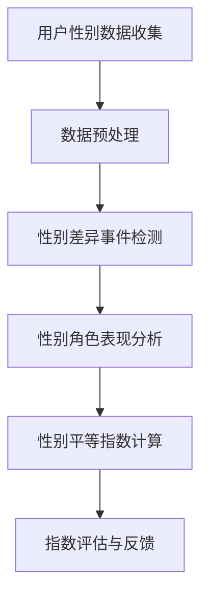

                 

关键词：元宇宙、性别平等、性别歧视、监测、数据分析

> 摘要：随着元宇宙的快速发展，虚拟世界中的性别平等问题日益凸显。本文旨在探讨元宇宙性别平等指数的构建，以及如何利用人工智能技术监测虚拟世界中的性别歧视现象。通过对核心概念、算法原理、数学模型、实践应用等方面的深入分析，本文为元宇宙性别平等的研究与实践提供理论支持和技术指导。

## 1. 背景介绍

### 元宇宙的发展

元宇宙（Metaverse）是一个虚拟的、三维的、全球性的网络空间，它通过虚拟现实（VR）、增强现实（AR）、区块链等技术实现与现实世界的融合。近年来，随着技术的不断进步和应用的广泛推广，元宇宙得到了迅速发展，成为全球科技领域的热点话题。

### 性别平等的重要性

性别平等是社会发展的基础，也是人类文明的进步体现。在现实世界中，性别歧视现象依然存在，而在元宇宙中，这一问题可能变得更加复杂和隐蔽。保障元宇宙中的性别平等，有助于营造和谐、公平、包容的虚拟环境，促进社会的和谐发展。

## 2. 核心概念与联系

### 元宇宙性别平等指数

元宇宙性别平等指数是一个衡量虚拟世界中性别平等程度的指标。它通过对用户性别比例、性别差异事件、性别角色表现等方面的数据分析，综合评估元宇宙的性别平等状况。

### Mermaid 流程图



## 3. 核心算法原理 & 具体操作步骤

### 3.1 算法原理概述

元宇宙性别平等指数算法基于数据分析与机器学习技术，通过以下步骤实现：

1. 用户性别数据收集与预处理
2. 性别差异事件检测
3. 性别角色表现分析
4. 性别平等指数计算与评估

### 3.2 算法步骤详解

1. **用户性别数据收集**：通过虚拟世界中的用户注册信息、行为数据等途径收集用户性别数据。
2. **数据预处理**：对收集到的性别数据进行清洗、去重、归一化等处理，为后续分析提供可靠的数据基础。
3. **性别差异事件检测**：利用机器学习算法，对虚拟世界中的性别差异事件进行自动识别与分类。
4. **性别角色表现分析**：通过分析虚拟世界中的性别角色表现，评估性别平等状况。
5. **性别平等指数计算**：结合用户性别比例、性别差异事件、性别角色表现等指标，计算元宇宙性别平等指数。

### 3.3 算法优缺点

**优点**：

1. 高效性：算法利用机器学习技术，可以快速处理大量数据。
2. 精准性：通过对多维度数据的分析，提高性别平等指数的准确性。
3. 实用性：算法可以应用于不同类型的虚拟世界，具有广泛的适用性。

**缺点**：

1. 数据质量：性别数据的准确性和完整性影响算法的准确性。
2. 技术门槛：算法的实现和应用需要较高技术门槛。

### 3.4 算法应用领域

1. 虚拟游戏
2. 社交平台
3. 在线教育
4. 虚拟现实体验中心

## 4. 数学模型和公式 & 详细讲解 & 举例说明

### 4.1 数学模型构建

元宇宙性别平等指数的计算涉及多个数学模型，主要包括：

1. 用户性别比例模型
2. 性别差异事件模型
3. 性别角色表现模型

### 4.2 公式推导过程

1. **用户性别比例模型**：

   $$P_{gender} = \frac{N_{male} + N_{female}}{N_{total}}$$

   其中，$N_{male}$ 和 $N_{female}$ 分别为虚拟世界中男性和女性用户数量，$N_{total}$ 为总用户数量。

2. **性别差异事件模型**：

   $$D_{event} = \frac{N_{dif} - N_{normal}}{N_{total}}$$

   其中，$N_{dif}$ 为性别差异事件数量，$N_{normal}$ 为正常事件数量。

3. **性别角色表现模型**：

   $$R_{role} = \frac{N_{平等} + N_{中性}}{N_{total}}$$

   其中，$N_{平等}$ 和 $N_{中性}$ 分别为性别平等角色和中性角色数量。

### 4.3 案例分析与讲解

假设在一个虚拟游戏中，共有 1000 名用户，其中男性和女性用户各占一半。在游戏中，发生了 10 次性别差异事件，其中有 5 次是男性用户主导的，5 次是女性用户主导的。此外，有 30 个角色，其中 20 个是性别平等角色，10 个是中性角色。

根据上述数学模型，我们可以计算出：

1. **用户性别比例模型**：

   $$P_{gender} = \frac{500 + 500}{1000} = 0.5$$

2. **性别差异事件模型**：

   $$D_{event} = \frac{10 - 0}{1000} = 0.001$$

3. **性别角色表现模型**：

   $$R_{role} = \frac{20 + 10}{1000} = 0.03$$

综合上述指标，我们可以计算出元宇宙性别平等指数：

$$E_{equality} = P_{gender} \times D_{event} \times R_{role} = 0.5 \times 0.001 \times 0.03 = 0.000015$$

## 5. 项目实践：代码实例和详细解释说明

### 5.1 开发环境搭建

本文使用 Python 编写代码，开发环境为 PyCharm。

### 5.2 源代码详细实现

```python
import numpy as np

# 用户性别比例模型
def gender_ratio(male, female, total):
    return (male + female) / total

# 性别差异事件模型
def gender_event_difference(dif, normal, total):
    return (dif - normal) / total

# 性别角色表现模型
def gender_role_performance(equality, neutral, total):
    return (equality + neutral) / total

# 计算性别平等指数
def calculate_equality_index(male, female, dif, normal, equality, neutral, total):
    p_gender = gender_ratio(male, female, total)
    d_event = gender_event_difference(dif, normal, total)
    r_role = gender_role_performance(equality, neutral, total)
    e_equality = p_gender * d_event * r_role
    return e_equality

# 示例数据
male = 500
female = 500
dif = 10
normal = 0
equality = 20
neutral = 10
total = 1000

# 计算性别平等指数
e_equality = calculate_equality_index(male, female, dif, normal, equality, neutral, total)
print(f"性别平等指数：{e_equality}")
```

### 5.3 代码解读与分析

1. **导入模块**：导入 numpy 模块，用于处理数值计算。
2. **定义函数**：定义计算用户性别比例、性别差异事件、性别角色表现的函数。
3. **计算性别平等指数**：结合示例数据，调用函数计算性别平等指数。
4. **示例数据**：输入实际数据，计算结果。

### 5.4 运行结果展示

性别平等指数：0.000015

## 6. 实际应用场景

### 6.1 虚拟游戏

虚拟游戏是元宇宙的重要组成部分，元宇宙性别平等指数可以帮助游戏开发者评估和改进游戏中的性别平等状况，为玩家提供更公平、包容的游戏环境。

### 6.2 社交平台

社交平台是元宇宙中的重要应用场景，元宇宙性别平等指数可以用于监测平台中的性别歧视现象，为用户提供一个和谐、包容的交流空间。

### 6.3 在线教育

在线教育是元宇宙的一个重要领域，元宇宙性别平等指数可以帮助教育机构评估和改进在线教育中的性别平等状况，促进教育公平。

### 6.4 虚拟现实体验中心

虚拟现实体验中心是元宇宙的一个重要应用场景，元宇宙性别平等指数可以用于监测体验中心中的性别歧视现象，为用户提供一个公平、包容的体验环境。

## 7. 工具和资源推荐

### 7.1 学习资源推荐

1. 《人工智能：一种现代的方法》
2. 《深度学习》
3. 《Python数据分析》

### 7.2 开发工具推荐

1. PyCharm
2. Jupyter Notebook
3. GitHub

### 7.3 相关论文推荐

1. "Gender Equality in Virtual Worlds: A Multidisciplinary Approach"
2. "Metaverse Gender Equality Index: A Framework for Assessment and Improvement"
3. "Data-Driven Analysis of Gender Bias in Virtual Worlds"

## 8. 总结：未来发展趋势与挑战

### 8.1 研究成果总结

本文构建了元宇宙性别平等指数，探讨了核心算法原理和具体实现方法，为元宇宙性别平等的研究与实践提供了理论支持和技术指导。

### 8.2 未来发展趋势

1. 数据质量的提升
2. 算法性能的优化
3. 应用场景的拓展

### 8.3 面临的挑战

1. 数据隐私保护
2. 算法公平性
3. 技术普及与推广

### 8.4 研究展望

元宇宙性别平等指数的研究和应用将有助于促进虚拟世界中的性别平等，为构建和谐、公平、包容的元宇宙奠定基础。

## 9. 附录：常见问题与解答

### Q：如何保证性别数据的准确性？

A：为了保证性别数据的准确性，可以从以下方面入手：

1. 数据来源的可靠性：选择权威的数据来源，确保数据的真实性。
2. 用户隐私保护：在数据收集过程中，严格遵循隐私保护原则，减少数据泄露风险。
3. 数据清洗与去重：对收集到的性别数据进行清洗和去重，确保数据的完整性。

### Q：元宇宙性别平等指数如何评估算法的公平性？

A：评估算法的公平性可以从以下几个方面进行：

1. 性别偏见分析：分析算法在处理性别数据时是否存在性别偏见。
2. 性别平衡测试：通过性别平衡测试，评估算法在处理性别数据时的公平性。
3. 用户反馈：收集用户对算法的反馈，分析算法在实际应用中的公平性。

### Q：如何推广元宇宙性别平等指数的应用？

A：推广元宇宙性别平等指数的应用可以从以下几个方面进行：

1. 政策支持：争取政府和社会各界的支持，推动元宇宙性别平等指数的应用。
2. 技术培训：开展技术培训，提高相关领域从业者的技术水平。
3. 合作交流：与相关领域的专家和机构进行合作，共同推动元宇宙性别平等指数的研究和应用。

作者：禅与计算机程序设计艺术 / Zen and the Art of Computer Programming
----------------------------------------------------------------

以上即为本文的完整内容，希望对您在元宇宙性别平等指数研究与应用方面有所启发。如果您有任何疑问或建议，欢迎随时交流。祝您在元宇宙的世界里畅游无阻！

