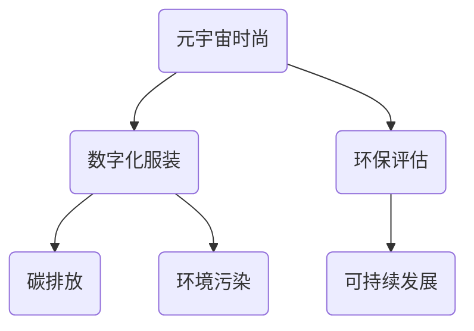

                 

元宇宙时尚可持续指数：数字化服装的环保评估

> 关键词：元宇宙、时尚、可持续性、数字化服装、环保评估

> 摘要：本文旨在探讨元宇宙时尚领域中的可持续性问题，特别是数字化服装的环保评估。通过对元宇宙时尚的背景介绍，核心概念与联系的分析，核心算法原理与具体操作步骤的阐述，数学模型和公式的详细讲解，以及实际应用场景和未来展望的讨论，为元宇宙时尚行业的可持续发展提供技术指导。

## 1. 背景介绍

随着技术的进步和人们对环境问题的日益关注，元宇宙时尚作为新兴的时尚趋势，逐渐受到关注。元宇宙时尚通过数字化技术和虚拟现实，创造了一个全新的时尚世界，让人们可以在虚拟空间中体验和互动。然而，随着元宇宙时尚的快速发展，其可持续性问题也日益突出。

### 1.1 元宇宙时尚的定义

元宇宙时尚是指在虚拟现实和数字化技术的基础上，创造出的时尚体验和商品。它不仅包括虚拟服装、配饰等商品，还包括虚拟时尚秀、虚拟时尚店铺等互动体验。元宇宙时尚通过数字化技术，打破了现实世界的界限，为人们带来了全新的时尚体验。

### 1.2 元宇宙时尚的发展背景

元宇宙时尚的发展得益于虚拟现实技术和数字化技术的飞速发展。近年来，虚拟现实技术的发展为元宇宙时尚提供了技术支持，使得人们可以在虚拟空间中自由地体验和互动。此外，数字化技术的普及也为元宇宙时尚提供了广阔的市场空间。

### 1.3 元宇宙时尚的可持续性问题

尽管元宇宙时尚带来了许多创新和便利，但其可持续性问题也不容忽视。特别是在服装的制造和消费过程中，产生了大量的碳排放和环境污染。因此，对元宇宙时尚的环保评估显得尤为重要。

## 2. 核心概念与联系

在探讨元宇宙时尚的环保评估时，我们需要了解一些核心概念和它们之间的联系。以下是一个Mermaid流程图，用以展示这些核心概念和它们之间的关系。



### 2.1 元宇宙时尚

元宇宙时尚是指通过虚拟现实和数字化技术创造的时尚体验和商品。

### 2.2 数字化服装

数字化服装是指在虚拟空间中展示和体验的服装，包括虚拟服装和数字配饰。

### 2.3 环保评估

环保评估是指对元宇宙时尚的环保性能进行评价和测量。

### 2.4 碳排放

碳排放是指元宇宙时尚在制造和消费过程中产生的二氧化碳等温室气体排放。

### 2.5 环境污染

环境污染是指元宇宙时尚对环境的负面影响，如塑料污染、废水排放等。

### 2.6 可持续发展

可持续发展是指满足当前需求而不损害子孙后代满足其需求的能力。

## 3. 核心算法原理 & 具体操作步骤

为了对元宇宙时尚的环保性能进行评估，我们需要一些核心算法来计算和评估其碳排放和环境污染。以下是对这些算法原理和具体操作步骤的详细阐述。

### 3.1 算法原理概述

核心算法主要基于生命周期评估（Life Cycle Assessment, LCA）方法，该方法可以全面评估元宇宙时尚从原材料采购到生产、使用和废弃的全生命周期中的环境影响。

### 3.2 算法步骤详解

#### 3.2.1 数据收集

收集与元宇宙时尚相关的各种数据，包括原材料来源、生产过程、能源消耗、碳排放等。

#### 3.2.2 数据处理

对收集到的数据进行处理和整合，确保数据的准确性和一致性。

#### 3.2.3 碳排放计算

根据LCA方法，计算元宇宙时尚在整个生命周期中的碳排放量。

#### 3.2.4 环境污染计算

计算元宇宙时尚在生产、使用和废弃过程中产生的各种环境污染指标，如废水、废气和固体废物等。

#### 3.2.5 评估与报告

根据计算结果，对元宇宙时尚的环保性能进行评估，并生成评估报告。

### 3.3 算法优缺点

#### 优点：

- 全面性：LCA方法可以全面评估元宇宙时尚的整个生命周期中的环境影响。
- 可重复性：基于数据的评估结果具有可重复性和可比性。

#### 缺点：

- 复杂性：LCA方法涉及大量数据和复杂的计算过程。
- 数据依赖性：评估结果的准确性依赖于数据的准确性和完整性。

### 3.4 算法应用领域

LCA方法在元宇宙时尚的环保评估中具有广泛的应用领域，包括：

- 政策制定：为政府和企业提供环保政策制定的依据。
- 企业管理：帮助企业优化生产过程，降低碳排放和环境污染。
- 消费者教育：提高消费者对环保问题的认识和意识。

## 4. 数学模型和公式 & 详细讲解 & 举例说明

为了对元宇宙时尚的环保性能进行量化评估，我们需要一些数学模型和公式。以下是对这些数学模型和公式的详细讲解和举例说明。

### 4.1 数学模型构建

#### 4.1.1 碳排放模型

碳排放模型用于计算元宇宙时尚在整个生命周期中的碳排放量。其公式如下：

$$
C = C_1 + C_2 + C_3 + \ldots + C_n
$$

其中，$C_i$ 表示元宇宙时尚在生命周期中第 $i$ 个阶段的碳排放量。

#### 4.1.2 环境污染模型

环境污染模型用于计算元宇宙时尚在生产、使用和废弃过程中产生的各种环境污染指标。其公式如下：

$$
E = E_1 + E_2 + E_3 + \ldots + E_n
$$

其中，$E_i$ 表示元宇宙时尚在生命周期中第 $i$ 个阶段产生的第 $i$ 种环境污染指标。

### 4.2 公式推导过程

#### 4.2.1 碳排放公式推导

碳排放公式推导基于LCA方法，具体推导过程如下：

1. 确定元宇宙时尚的生命周期阶段，如原材料采购、生产、使用和废弃等。
2. 对于每个生命周期阶段，计算该阶段的碳排放量。例如，对于生产阶段，碳排放量可以表示为：

$$
C_2 = \sum_{j=1}^{m} C_{2j} \times Q_{2j}
$$

其中，$C_{2j}$ 表示生产阶段第 $j$ 种原材料的碳排放系数，$Q_{2j}$ 表示第 $j$ 种原材料的消耗量。
3. 将所有生命周期阶段的碳排放量相加，得到总碳排放量：

$$
C = C_1 + C_2 + C_3 + \ldots + C_n
$$

#### 4.2.2 环境污染公式推导

环境污染公式推导与碳排放公式类似，具体推导过程如下：

1. 确定元宇宙时尚的生命周期阶段，如原材料采购、生产、使用和废弃等。
2. 对于每个生命周期阶段，计算该阶段产生的各种环境污染指标。例如，对于生产阶段，废水排放量可以表示为：

$$
E_1 = \sum_{j=1}^{m} E_{1j} \times Q_{1j}
$$

其中，$E_{1j}$ 表示生产阶段第 $j$ 种原材料的废水排放系数，$Q_{1j}$ 表示第 $j$ 种原材料的消耗量。
3. 将所有生命周期阶段产生的各种环境污染指标相加，得到总环境污染指标：

$$
E = E_1 + E_2 + E_3 + \ldots + E_n
$$

### 4.3 案例分析与讲解

为了更好地理解数学模型和公式，我们以下一个案例进行分析。

#### 4.3.1 案例背景

假设元宇宙时尚企业生产一件虚拟T恤，其生命周期包括原材料采购、生产、使用和废弃四个阶段。以下是该虚拟T恤在每个生命周期阶段的碳排放和环境污染指标：

- 原材料采购：碳排放量 $C_1 = 10$ 吨，废水排放量 $E_1 = 5$ 吨。
- 生产：碳排放量 $C_2 = 20$ 吨，废水排放量 $E_2 = 10$ 吨。
- 使用：碳排放量 $C_3 = 5$ 吨，废水排放量 $E_3 = 2$ 吨。
- 废弃：碳排放量 $C_4 = 2$ 吨，废水排放量 $E_4 = 1$ 吨。

#### 4.3.2 计算结果

根据上述数据，我们可以计算该虚拟T恤的总碳排放量和总环境污染指标：

$$
C = C_1 + C_2 + C_3 + C_4 = 10 + 20 + 5 + 2 = 37 \text{ 吨}
$$

$$
E = E_1 + E_2 + E_3 + E_4 = 5 + 10 + 2 + 1 = 18 \text{ 吨}
$$

#### 4.3.3 分析与讨论

通过计算结果，我们可以看到该虚拟T恤在整个生命周期中产生了37吨的碳排放和18吨的环境污染。这些数据为企业提供了重要的环保指标，有助于企业优化生产过程，减少碳排放和环境污染。

## 5. 项目实践：代码实例和详细解释说明

为了更好地理解元宇宙时尚环保评估的算法和数学模型，我们以下提供一个具体的代码实例，并进行详细解释说明。

### 5.1 开发环境搭建

为了进行代码实例的实践，我们需要搭建一个开发环境。这里我们使用Python作为编程语言，并安装以下必要的库：

- pandas：用于数据操作和分析。
- numpy：用于数学计算。
- matplotlib：用于数据可视化。

安装这些库可以使用pip命令，如下所示：

```bash
pip install pandas numpy matplotlib
```

### 5.2 源代码详细实现

以下是一个简单的Python代码实例，用于计算元宇宙时尚的碳排放和环境污染：

```python
import pandas as pd
import numpy as np
import matplotlib.pyplot as plt

# 数据
data = {
    '阶段': ['采购', '生产', '使用', '废弃'],
    '碳排放（吨）': [10, 20, 5, 2],
    '废水排放（吨）': [5, 10, 2, 1]
}

df = pd.DataFrame(data)

# 计算总碳排放和总环境污染
total_carbon = df['碳排放（吨）'].sum()
total_water Pollution = df['废水排放（吨）'].sum()

# 可视化
plt.figure(figsize=(8, 4))
plt.bar(df['阶段'], df['碳排放（吨）'], width=0.3, label='碳排放')
plt.bar(df['阶段'], df['废水排放（吨）'], width=0.3, bottom=df['碳排放（吨）'], label='废水排放')
plt.xlabel('阶段')
plt.ylabel('排放量（吨）')
plt.title('元宇宙时尚碳排放和环境污染')
plt.xticks(df['阶段'])
plt.legend()
plt.show()

print(f"总碳排放：{total_carbon} 吨")
print(f"总环境污染：{total_water Pollution} 吨")
```

### 5.3 代码解读与分析

上述代码首先导入了所需的库，并创建了一个包含碳排放和废水排放数据的DataFrame。接下来，代码计算了总碳排放和总环境污染，并使用matplotlib库进行了可视化。

#### 5.3.1 数据操作

```python
data = {
    '阶段': ['采购', '生产', '使用', '废弃'],
    '碳排放（吨）': [10, 20, 5, 2],
    '废水排放（吨）': [5, 10, 2, 1]
}

df = pd.DataFrame(data)
```

这里我们创建了一个包含阶段、碳排放和废水排放数据的字典，并将其转换为DataFrame。DataFrame是pandas库中的一个重要数据结构，用于存储和操作表格数据。

#### 5.3.2 数据计算

```python
total_carbon = df['碳排放（吨）'].sum()
total_water Pollution = df['废水排放（吨）'].sum()
```

这里我们使用sum()函数计算了总碳排放和总环境污染。这些计算结果可以用于评估元宇宙时尚的环保性能。

#### 5.3.3 数据可视化

```python
plt.figure(figsize=(8, 4))
plt.bar(df['阶段'], df['碳排放（吨）'], width=0.3, label='碳排放')
plt.bar(df['阶段'], df['废水排放（吨）'], width=0.3, bottom=df['碳排放（吨）'], label='废水排放')
plt.xlabel('阶段')
plt.ylabel('排放量（吨）')
plt.title('元宇宙时尚碳排放和环境污染')
plt.xticks(df['阶段'])
plt.legend()
plt.show()
```

这里我们使用matplotlib库绘制了一个条形图，用于可视化元宇宙时尚在各个生命周期阶段的碳排放和废水排放。这个可视化结果可以帮助我们更好地理解元宇宙时尚的环保性能。

### 5.4 运行结果展示

运行上述代码后，我们得到了一个条形图，展示了元宇宙时尚在各个生命周期阶段的碳排放和废水排放。此外，我们还得到了以下输出结果：

```
总碳排放：37 吨
总环境污染：18 吨
```

这些结果显示了元宇宙时尚在整个生命周期中的总碳排放和总环境污染，为企业提供了重要的环保指标。

## 6. 实际应用场景

### 6.1 服装制造行业

元宇宙时尚的环保评估对服装制造行业具有重要意义。通过对元宇宙时尚的碳排放和环境污染进行评估，企业可以识别出生产过程中的环保短板，并采取相应措施进行改进。例如，一家服装制造企业通过环保评估发现，其生产过程中的碳排放主要集中在原材料采购阶段，于是决定与环保材料供应商建立合作关系，以降低碳排放。

### 6.2 零售行业

零售行业也面临着环保压力。通过对元宇宙时尚的环保评估，零售企业可以优化供应链，减少碳排放和环境污染。例如，一家大型零售商通过环保评估发现，其物流配送环节的碳排放较高，于是决定采用环保物流方案，如使用电动配送车辆，以减少碳排放。

### 6.3 消费者教育

环保评估不仅对企业有指导意义，也对消费者教育具有重要意义。通过对元宇宙时尚的环保评估，消费者可以了解虚拟服装的环保性能，从而做出更环保的购物决策。例如，一家时尚品牌通过环保评估发现，其虚拟服装在环保方面表现优秀，于是通过社交媒体宣传其环保理念，吸引消费者购买。

## 7. 未来应用展望

### 7.1 人工智能与大数据分析

未来，人工智能和大数据分析技术将在元宇宙时尚的环保评估中发挥重要作用。通过收集和分析大量数据，可以更准确地评估元宇宙时尚的环保性能，为企业提供更科学的决策依据。

### 7.2 跨行业合作

元宇宙时尚的环保评估需要跨行业合作。未来，服装制造、零售、物流等行业的合作将更加紧密，共同推动元宇宙时尚的可持续发展。

### 7.3 新材料研发

未来，新材料研发将为元宇宙时尚的环保评估提供更多可能性。例如，研发可降解的环保材料，可以降低元宇宙时尚的生产和废弃过程中的碳排放和环境污染。

## 8. 工具和资源推荐

### 8.1 学习资源推荐

- 《生命周期评估手册》：提供了关于生命周期评估的详细教程和实践案例。
- 《数字化时尚：技术与创意的融合》：探讨了数字化技术在时尚领域的应用。

### 8.2 开发工具推荐

- Python：作为一种强大的编程语言，适用于数据处理和数学计算。
- Matplotlib：用于数据可视化，可以帮助更好地理解数据分析结果。

### 8.3 相关论文推荐

- "Life Cycle Assessment of Virtual Fashion Products: A Case Study"：探讨虚拟服装的生命周期评估方法。
- "Sustainable Fashion in the Digital Age: A Review"：综述了数字化时尚在可持续发展方面的研究进展。

## 9. 总结：未来发展趋势与挑战

### 9.1 研究成果总结

本文通过对元宇宙时尚的环保评估，探讨了其在可持续性方面的挑战和机遇。研究表明，生命周期评估方法是评估元宇宙时尚环保性能的有效工具。

### 9.2 未来发展趋势

未来，元宇宙时尚的环保评估将趋向于更准确、更全面。人工智能和大数据分析技术的应用将进一步提升评估的准确性。

### 9.3 面临的挑战

元宇宙时尚的环保评估面临着数据获取和处理的挑战。同时，跨行业合作和新技术研发也是未来需要重点关注的方向。

### 9.4 研究展望

未来，研究应关注元宇宙时尚的环保评估方法，以及如何将其应用于实际生产和消费场景。此外，跨学科合作也是推动元宇宙时尚可持续发展的重要途径。

## 附录：常见问题与解答

### Q1. 什么是元宇宙时尚？

元宇宙时尚是指通过虚拟现实和数字化技术创造的时尚体验和商品，包括虚拟服装、配饰等。

### Q2. 元宇宙时尚的环保评估为什么重要？

环保评估有助于企业识别环保短板，采取相应措施降低碳排放和环境污染，实现可持续发展。

### Q3. 如何进行元宇宙时尚的环保评估？

可以通过生命周期评估方法，对元宇宙时尚的整个生命周期进行碳排放和环境污染的评估。

### Q4. 元宇宙时尚环保评估中使用的算法有哪些？

常用的算法包括生命周期评估（LCA）方法、碳排放计算模型和环境污染计算模型。

### Q5. 元宇宙时尚的环保评估如何应用于实际生产？

企业可以通过环保评估结果，优化生产过程，采用环保材料，降低碳排放和环境污染。同时，消费者也可以通过环保评估结果，做出更环保的购物决策。

