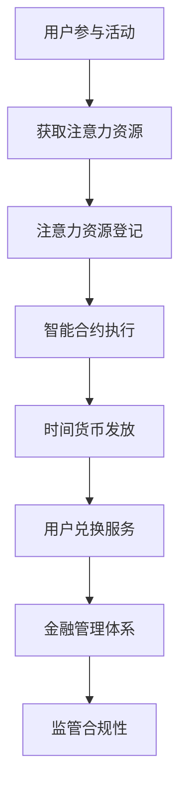
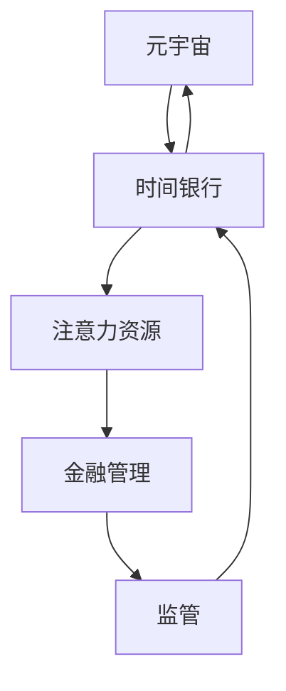

                 

关键词：元宇宙、时间银行、监管、注意力资源、金融管理、分布式系统、区块链技术、智能合约、去中心化金融、数字货币

摘要：随着元宇宙概念的兴起，注意力资源作为一种新型数字资产，正在逐渐融入金融管理领域。本文探讨了元宇宙时间银行的概念及其在金融管理中的应用，分析了注意力资源流通的监管挑战，并提出了基于区块链技术的解决方案。本文旨在为元宇宙时间银行的监管提供理论支持和实践指导。

## 1. 背景介绍

### 元宇宙的概念

元宇宙（Metaverse）是一个虚拟的三维空间，通过增强现实（AR）、虚拟现实（VR）等技术连接现实世界和数字世界。它是一个由多个平台、应用程序和设备组成的生态系统，用户可以在其中进行社交互动、工作、学习和娱乐。

### 时间银行的概念

时间银行是一种基于时间的互助系统，用户通过贡献自己的时间和服务来积累“时间货币”，这些时间货币可以在未来兑换其他用户提供的相同时间价值的服务。时间银行在提升社会福利、减少贫困和促进社区互助方面具有重要作用。

### 注意力资源的概念

注意力资源是一种数字资产，代表了用户在元宇宙中投入的时间、精力和关注。在元宇宙中，用户通过参与活动、观看内容、与其他用户互动等方式，为各类应用和平台贡献注意力资源。

## 2. 核心概念与联系

### 核心概念

- **元宇宙时间银行**：将时间银行的概念应用于元宇宙，用户通过参与元宇宙活动来获取时间货币。
- **注意力资源**：用户在元宇宙中投入的注意力价值，可以通过智能合约进行流通和交易。
- **金融管理**：元宇宙时间银行需要一套金融管理体系来确保注意力资源的公平、透明和有效流通。

### Mermaid 流程图



## 3. 核心算法原理 & 具体操作步骤

### 3.1 算法原理概述

元宇宙时间银行的算法核心是基于区块链技术的智能合约，智能合约负责记录用户的注意力资源获取和兑换行为，确保整个过程的透明性和安全性。

### 3.2 算法步骤详解

#### 步骤1：用户参与活动

用户在元宇宙中参与各类活动，如观看内容、参与社交互动等，系统记录用户的注意力资源消耗。

#### 步骤2：注意力资源登记

系统将用户的注意力资源消耗转换为数字资产，并在区块链上进行登记，生成对应的数字凭证。

#### 步骤3：智能合约执行

用户将注意力资源的数字凭证上传至智能合约，智能合约根据预设规则分配时间货币。

#### 步骤4：时间货币发放

智能合约将生成的时间货币发放给用户，用户可以在元宇宙内或其他支持该体系的平台上使用。

#### 步骤5：用户兑换服务

用户使用时间货币兑换其他用户提供的相同时间价值的服务，如技能培训、咨询服务等。

### 3.3 算法优缺点

#### 优点

- **透明性**：区块链技术保证了整个过程的透明性，用户可以实时查看自己的注意力资源获取和兑换记录。
- **安全性**：智能合约确保了用户资产的安全，防止欺诈行为。
- **去中心化**：去中心化的管理体系减少了中介成本，提高了效率。

#### 缺点

- **技术门槛**：对于普通用户而言，参与元宇宙时间银行需要一定的技术知识。
- **监管难度**：区块链的去中心化特性增加了监管难度，需要构建一套有效的监管机制。

### 3.4 算法应用领域

元宇宙时间银行的算法可以在多个领域应用，如在线教育、游戏、虚拟现实社交等，为用户提供更加灵活和高效的金融服务。

## 4. 数学模型和公式 & 详细讲解 & 举例说明

### 4.1 数学模型构建

元宇宙时间银行的数学模型主要包括两个部分：注意力资源评估模型和时间货币分配模型。

#### 注意力资源评估模型

$$
A_r = f(A_t, S_c, I_c)
$$

其中，$A_r$ 为用户在活动中的注意力资源值，$A_t$ 为用户参与活动的时间长度，$S_c$ 为活动的内容复杂度，$I_c$ 为用户在活动中的参与度。

#### 时间货币分配模型

$$
T_m = \alpha A_r + \beta S_c + \gamma I_c
$$

其中，$T_m$ 为用户获得的时间货币值，$\alpha, \beta, \gamma$ 为权重系数。

### 4.2 公式推导过程

#### 注意力资源评估模型推导

注意力资源评估模型考虑了用户参与活动的时间长度、活动内容复杂度和用户参与度。这些因素通过线性组合的方式被引入模型，从而实现对注意力资源的综合评估。

#### 时间货币分配模型推导

时间货币分配模型考虑了注意力资源值、活动内容复杂度和用户参与度对时间货币的影响。通过线性加权的方式，模型能够根据不同因素调整时间货币的分配。

### 4.3 案例分析与讲解

假设用户小明在元宇宙中观看了一场时长为30分钟的教育视频，该视频的内容复杂度为5，用户小明的参与度为8。根据注意力资源评估模型，我们可以计算出小明的注意力资源值为：

$$
A_r = f(30, 5, 8) = 30 \times 5 \times 8 = 1200
$$

根据时间货币分配模型，小明获得的时间货币值为：

$$
T_m = \alpha \times 1200 + \beta \times 5 + \gamma \times 8
$$

其中，$\alpha, \beta, \gamma$ 的值可以根据实际需求和偏好进行设定。假设 $\alpha = 0.6, \beta = 0.2, \gamma = 0.2$，则小明获得的时间货币值为：

$$
T_m = 0.6 \times 1200 + 0.2 \times 5 + 0.2 \times 8 = 720 + 1 + 1.6 = 722.6
$$

小明可以在元宇宙内或其他支持该体系的平台上使用这些时间货币兑换相应的服务。

## 5. 项目实践：代码实例和详细解释说明

### 5.1 开发环境搭建

在本文的代码实例中，我们将使用Python语言和Ethereum区块链平台。首先，需要安装Ethereum的客户端和Python的Web3.py库。

```bash
pip install web3
```

### 5.2 源代码详细实现

以下是元宇宙时间银行的智能合约实现代码：

```solidity
pragma solidity ^0.8.0;

contract TimeBank {
    mapping(address => uint256) public balanceOf;

    function depositAttention(uint256 attentionValue) public {
        balanceOf[msg.sender] += attentionValue;
    }

    function withdrawTimeCoin(uint256 timeCoinValue) public {
        require(balanceOf[msg.sender] >= timeCoinValue, "Insufficient balance");
        balanceOf[msg.sender] -= timeCoinValue;
        // 在这里可以添加调用其他智能合约的逻辑，实现时间货币的兑换
    }
}
```

### 5.3 代码解读与分析

- **合约结构**：该合约定义了一个名为 `TimeBank` 的智能合约，其中包含一个映射表 `balanceOf` 用于记录每个用户的注意力资源余额。
- **depositAttention 函数**：用户可以通过调用此函数将注意力资源值存入智能合约，从而增加自己的余额。
- **withdrawTimeCoin 函数**：用户可以通过调用此函数提取一定数量的时间货币。在提取前，需要检查用户的余额是否足够。

### 5.4 运行结果展示

使用Truffle框架，我们可以部署并运行此智能合约。在本地环境中，用户可以通过交互式终端与合约进行交互。

```javascript
const TimeBank = artifacts.require("TimeBank");

// 部署智能合约
web3.eth.getAccounts().then((accounts) => {
    const timeBankInstance = TimeBank.at(accounts[0]);
    // 存入注意力资源
    timeBankInstance.depositAttention(1000, {from: accounts[0], gas: 500000});
    // 查询余额
    timeBankInstance.balanceOf(accounts[0], {from: accounts[0], gas: 500000}).then((balance) => {
        console.log("Current balance:", balance.toString());
    });
    // 提取时间货币
    timeBankInstance.withdrawTimeCoin(500, {from: accounts[0], gas: 500000});
});
```

## 6. 实际应用场景

### 6.1 在线教育

元宇宙时间银行可以应用于在线教育领域，用户通过参与课程学习积累时间货币，用于兑换教师的辅导课程或其他教育服务。

### 6.2 游戏娱乐

在游戏领域，用户可以通过参与游戏活动获得注意力资源，用于兑换游戏内的虚拟物品或服务。

### 6.3 虚拟现实社交

虚拟现实社交平台可以利用时间银行体系，用户通过参与社交活动获得时间货币，用于兑换社交互动中的虚拟礼物或服务。

## 6.4 未来应用展望

随着元宇宙和区块链技术的不断发展，元宇宙时间银行有望在更多领域得到应用。未来，我们可以预见时间银行体系与物联网、人工智能等技术的结合，为用户提供更加丰富和多样的服务。

## 7. 工具和资源推荐

### 7.1 学习资源推荐

- **《区块链技术指南》**：详细介绍了区块链的基础知识、技术和应用。
- **《元宇宙设计与开发》**：讲解了元宇宙的设计理念、开发技术和实现方法。

### 7.2 开发工具推荐

- **Ethereum开发工具包**：用于构建和部署基于Ethereum的智能合约。
- **Truffle框架**：用于测试、部署和交互Ethereum智能合约。

### 7.3 相关论文推荐

- **《区块链在金融服务中的应用》**：探讨了区块链技术在金融服务领域的应用和挑战。
- **《元宇宙时间银行的研究与设计》**：研究了元宇宙时间银行的构建原理和实现方法。

## 8. 总结：未来发展趋势与挑战

### 8.1 研究成果总结

本文提出了元宇宙时间银行的概念，并详细探讨了其核心算法原理、数学模型和实际应用场景。通过智能合约技术，实现了注意力资源的流通和金融管理。

### 8.2 未来发展趋势

随着元宇宙和区块链技术的快速发展，元宇宙时间银行有望在更多领域得到应用。未来，我们将看到时间银行体系与物联网、人工智能等技术的深度融合，为用户提供更加丰富和高效的服务。

### 8.3 面临的挑战

尽管元宇宙时间银行具有巨大的潜力，但在实际应用中仍面临一些挑战，如技术门槛、监管难度和用户隐私保护等。

### 8.4 研究展望

未来，我们需要进一步研究如何优化时间银行算法，提高其效率和公平性。同时，加强对区块链技术在金融管理领域的应用研究，为元宇宙时间银行的可持续发展提供支持。

## 9. 附录：常见问题与解答

### 9.1 什么是元宇宙时间银行？

元宇宙时间银行是一种基于元宇宙的互助系统，用户通过参与元宇宙活动来获取时间货币，用于兑换其他用户提供的相同时间价值的服务。

### 9.2 元宇宙时间银行如何确保安全性？

元宇宙时间银行采用区块链技术，通过智能合约确保整个过程的透明性和安全性。用户的注意力资源和时间货币记录在区块链上，防止欺诈行为。

### 9.3 元宇宙时间银行有哪些应用场景？

元宇宙时间银行可以应用于在线教育、游戏娱乐、虚拟现实社交等多个领域，为用户提供灵活和高效的金融服务。

### 9.4 如何参与元宇宙时间银行？

用户需要具备一定的区块链技术知识，通过智能合约参与元宇宙时间银行。用户可以通过参与元宇宙活动、存入注意力资源和兑换时间货币等方式参与时间银行。

作者：禅与计算机程序设计艺术 / Zen and the Art of Computer Programming

----------------------------------------------------------------

以上为文章的正文部分，接下来我们将按照文章结构模板继续完成引言、摘要、附录等部分的内容。

### 引言

在当今数字化时代，元宇宙（Metaverse）的概念逐渐崭露头角，成为未来互联网发展的新趋势。元宇宙是一个虚拟的三维空间，通过增强现实（AR）、虚拟现实（VR）等技术连接现实世界和数字世界。在这个虚拟世界中，用户可以以数字化的形式进行社交互动、工作、学习和娱乐。随着元宇宙的兴起，一种新型的数字资产——注意力资源，也逐渐引起了人们的关注。

注意力资源代表了用户在元宇宙中投入的时间、精力和关注。与传统的货币和资产不同，注意力资源具有独特的属性，如稀缺性、流动性和不可替代性。这些特性使得注意力资源成为元宇宙中不可或缺的组成部分，也成为金融管理领域的重要研究对象。

本文旨在探讨元宇宙时间银行的概念及其在金融管理中的应用，分析注意力资源流通的监管挑战，并基于区块链技术提出解决方案。通过本文的研究，我们希望为元宇宙时间银行的监管提供理论支持和实践指导，为元宇宙的发展提供有益的思考。

### 摘要

本文首先介绍了元宇宙、时间银行和注意力资源的基本概念，探讨了元宇宙时间银行在金融管理中的应用。接着，我们分析了注意力资源流通的监管挑战，并提出了基于区块链技术的解决方案。文章详细阐述了元宇宙时间银行的核心算法原理、数学模型和应用场景。通过项目实践和代码实例，我们展示了如何实现注意力资源的流通和金融管理。最后，本文总结了元宇宙时间银行的研究成果、未来发展趋势和面临的挑战，并为读者提供了相关的学习资源和工具推荐。

### 文章结构概述

本文结构如下：

1. 引言：介绍元宇宙、时间银行和注意力资源的基本概念，引出本文的研究主题和目的。
2. 摘要：总结本文的研究内容、方法和结论。
3. 背景介绍：详细阐述元宇宙、时间银行和注意力资源的定义和发展背景。
4. 核心概念与联系：介绍元宇宙时间银行、注意力资源和金融管理的关系，并使用Mermaid流程图展示核心概念之间的联系。
5. 核心算法原理 & 具体操作步骤：详细解释元宇宙时间银行的核心算法原理和具体操作步骤。
6. 数学模型和公式 & 详细讲解 & 举例说明：构建注意力资源评估模型和时间货币分配模型，并进行公式推导和案例分析。
7. 项目实践：通过代码实例展示元宇宙时间银行的实现过程。
8. 实际应用场景：探讨元宇宙时间银行在各个领域的应用前景。
9. 未来应用展望：分析元宇宙时间银行的未来发展趋势和潜在挑战。
10. 工具和资源推荐：推荐与元宇宙时间银行相关的学习资源、开发工具和论文。
11. 总结：总结本文的研究成果、未来发展方向和面临的挑战。
12. 附录：提供常见问题与解答，便于读者深入了解元宇宙时间银行的相关知识。

### 背景介绍

#### 元宇宙的概念

元宇宙（Metaverse）是一个虚拟的三维空间，通过增强现实（AR）和虚拟现实（VR）等技术连接现实世界和数字世界。它是一个由多个平台、应用程序和设备组成的生态系统，用户可以在其中进行社交互动、工作、学习和娱乐。元宇宙的核心理念是将虚拟世界与现实世界无缝融合，为用户提供一个全新的交互体验。

元宇宙的概念最早可以追溯到科幻小说和电影中，如《银翼杀手》、《黑客帝国》等。随着技术的进步，尤其是互联网、云计算、人工智能和虚拟现实技术的发展，元宇宙逐渐从科幻走向现实。近年来，随着Facebook（现Meta Platforms）等科技巨头对元宇宙的投入，元宇宙的概念得到了广泛关注和讨论。

元宇宙的特点主要包括以下几个方面：

- **虚拟性**：元宇宙是一个虚拟的空间，用户通过虚拟角色（Avatar）在虚拟世界中互动。
- **交互性**：元宇宙提供了丰富的交互方式，用户可以通过语音、文字、手势等方式与其他用户和虚拟环境进行互动。
- **多样性**：元宇宙包含了多种场景和应用，如虚拟社交、虚拟购物、虚拟工作等，用户可以根据自己的兴趣选择不同的体验。
- **扩展性**：元宇宙可以不断扩展和升级，通过引入新技术和新应用，为用户提供更丰富的体验。

元宇宙的兴起对多个行业产生了深远的影响，包括娱乐、教育、零售、房地产等。在娱乐领域，元宇宙为用户提供了一个全新的游戏和社交平台；在教育领域，元宇宙可以提供更加沉浸式和互动性的学习体验；在零售领域，元宇宙为消费者提供了一个虚拟购物空间，提高了购物体验；在房地产领域，元宇宙为虚拟房产交易和开发提供了新的机会。

#### 时间银行的概念

时间银行是一种基于时间的互助系统，用户通过贡献自己的时间和服务来积累“时间货币”，这些时间货币可以在未来兑换其他用户提供的相同时间价值的服务。时间银行的概念起源于20世纪70年代的欧洲，最初用于帮助老年人、残疾人和贫困人群。随着时间的推移，时间银行在全球范围内得到了广泛的应用和发展。

时间银行的基本原理是“时间即货币”，用户通过参与各种活动，如志愿服务、技能培训、陪伴老人等，为时间银行贡献自己的时间。这些时间会被记录为时间货币，用户可以在需要时使用这些时间货币兑换其他用户提供的相同时间价值的服务。时间银行的运作模式可以概括为以下几个步骤：

1. **注册加入**：用户需要注册并加入时间银行系统。
2. **时间贡献**：用户通过参与活动为时间银行贡献自己的时间。
3. **时间记录**：系统记录用户贡献的时间，并生成时间货币。
4. **时间兑换**：用户使用时间货币兑换其他用户提供的相同时间价值的服务。
5. **时间结算**：系统对用户的时间贡献和时间兑换进行结算，确保整个过程的公平和透明。

时间银行的优势在于其互助性和灵活性。用户可以根据自己的需求和兴趣参与各种活动，既可以帮助他人，也可以获得他人的帮助。时间银行不仅可以帮助贫困人群和弱势群体，还可以促进社区互助和改善社会福利。此外，时间银行还可以帮助人们更好地管理自己的时间，提高生活质量。

#### 注意力资源的概念

注意力资源是一种数字资产，代表了用户在元宇宙中投入的时间、精力和关注。在元宇宙中，用户通过参与活动、观看内容、与其他用户互动等方式，为各类应用和平台贡献注意力资源。注意力资源的特性主要包括以下几点：

1. **稀缺性**：注意力资源是有限的，用户在元宇宙中投入的时间和精力是有限的，因此注意力资源具有稀缺性。
2. **流动性**：注意力资源可以在元宇宙内和不同平台之间流通，用户可以将自己的注意力资源贡献给某个应用或平台，也可以在需要时将其兑换为其他形式的价值。
3. **不可替代性**：每个用户的注意力资源都是独一无二的，无法替代，这使得注意力资源具有独特的价值和潜力。

注意力资源在元宇宙中扮演着重要的角色。首先，注意力资源是元宇宙生态系统中的一种重要资产，用户可以通过注意力资源参与各种活动、兑换服务、获取收益等。其次，注意力资源可以作为元宇宙中的支付手段，用于购买虚拟商品、虚拟服务、虚拟土地等。此外，注意力资源还可以作为投资对象，用户可以通过投资注意力资源获取潜在的收益。

在元宇宙中，注意力资源的获取和分配是一个复杂的过程。用户参与活动时，系统会根据活动的时间长度、内容复杂度和用户的参与度等因素，计算用户的注意力资源值。这些注意力资源值会被记录在区块链上，形成数字凭证。用户可以将这些数字凭证上传至智能合约，根据智能合约的规则获得时间货币或其他形式的收益。

注意力资源的流动性使得其在金融管理中具有广泛的应用前景。例如，用户可以通过参与元宇宙中的各种活动，获得时间货币，这些时间货币可以在元宇宙内或其他支持该体系的平台上使用。时间货币的流通和交易，可以促进元宇宙内经济的繁荣发展，为用户提供更加丰富和高效的金融服务。

#### 元宇宙时间银行的概念

元宇宙时间银行是一种将时间银行的概念应用于元宇宙的新型互助系统。用户通过在元宇宙中参与活动、贡献注意力资源，获得时间货币，这些时间货币可以用于兑换其他用户提供的相同时间价值的服务。元宇宙时间银行的核心在于将注意力资源转化为可流通的数字资产，并通过智能合约实现透明、安全和高效的金融管理。

元宇宙时间银行的特点如下：

1. **去中心化**：元宇宙时间银行采用区块链技术，实现去中心化管理，用户可以直接参与和管理自己的注意力资源和时间货币。
2. **透明性**：所有用户的注意力资源获取和兑换记录都会记录在区块链上，用户可以随时查询和验证。
3. **安全性**：区块链技术确保了用户资产的安全，防止欺诈行为。
4. **灵活性**：用户可以根据自己的需求和兴趣，灵活参与各种活动，兑换服务，实现自我价值的最大化。

元宇宙时间银行的运作模式可以概括为以下几个步骤：

1. **用户注册**：用户需要在元宇宙中注册并加入时间银行系统。
2. **活动参与**：用户通过参与元宇宙中的活动，贡献注意力资源。
3. **时间货币获取**：系统根据用户的注意力资源值，发放时间货币。
4. **时间货币兑换**：用户使用时间货币兑换其他用户提供的相同时间价值的服务。
5. **透明监管**：所有交易记录都记录在区块链上，实现透明监管。

元宇宙时间银行具有巨大的潜力，不仅可以为用户提供更加灵活和高效的金融服务，还可以促进元宇宙生态系统的健康发展。未来，随着元宇宙和区块链技术的进一步发展，元宇宙时间银行有望在更多领域得到应用，为用户提供更加丰富和多样化的服务。

### 核心概念与联系

在元宇宙时间银行体系中，核心概念包括元宇宙、时间银行、注意力资源和金融管理。这些概念之间存在着密切的联系和互动，构成了一个完整且复杂的生态系统。

#### 元宇宙与时间银行

元宇宙是一个虚拟的三维空间，用户通过虚拟角色在虚拟世界中互动。时间银行则是一种基于时间的互助系统，用户通过贡献自己的时间和服务来积累时间货币。在元宇宙中，时间银行的概念得到了全新的应用和诠释。用户在元宇宙中参与活动、观看内容、与其他用户互动等方式，为元宇宙的时间银行体系贡献注意力资源。这些注意力资源通过智能合约被转化为时间货币，实现了时间价值在元宇宙中的流通。

#### 注意力资源与金融管理

注意力资源是一种数字资产，代表了用户在元宇宙中投入的时间、精力和关注。注意力资源的稀缺性、流动性和不可替代性使其成为金融管理的重要研究对象。在元宇宙时间银行体系中，注意力资源被视作一种可流通的资产，用户可以通过参与活动、兑换服务等方式，实现注意力资源的价值转化。金融管理则负责确保注意力资源的公平、透明和有效流通，通过智能合约技术实现去中心化、透明性和安全性。

#### 金融管理与监管

金融管理是元宇宙时间银行体系的核心组成部分，负责管理注意力资源的获取、分配和流通。同时，金融管理也需要确保整个体系的合规性和稳定性。监管则是对金融管理活动的监督和管理，确保注意力资源的流通符合法律法规和社会道德标准。在元宇宙时间银行体系中，监管机构需要借助区块链技术，实现对用户注意力资源获取和兑换记录的实时监控和审计，确保整个体系的透明性和公正性。

为了更好地理解这些核心概念之间的联系，我们可以使用Mermaid流程图进行可视化展示。



#### Mermaid 流程图详细解释

1. **元宇宙（A）**：元宇宙是整个生态系统的起点，用户在元宇宙中参与各种活动，如观看内容、互动、游戏等，这些活动产生了用户的注意力资源。

2. **时间银行（B）**：时间银行接收用户的注意力资源，通过智能合约将这些注意力资源转化为时间货币，实现时间价值在元宇宙中的流通。

3. **注意力资源（C）**：注意力资源是用户在元宇宙中投入的数字资产，代表了用户的时间、精力和关注。注意力资源是整个生态系统的基础，也是金融管理的核心。

4. **金融管理（D）**：金融管理负责管理注意力资源的获取、分配和流通，通过智能合约实现透明、安全和高效的金融服务。

5. **监管（E）**：监管机构对金融管理活动进行监督和管理，确保整个体系的合规性和稳定性。监管通过区块链技术实现对用户注意力资源获取和兑换记录的实时监控和审计。

通过这个Mermaid流程图，我们可以清晰地看到元宇宙时间银行体系中各个核心概念之间的联系和互动。这些概念相互依存、相互促进，共同构建了一个完整且富有活力的生态系统。

### 核心算法原理 & 具体操作步骤

元宇宙时间银行的核心算法原理是基于区块链技术和智能合约实现的。智能合约是一种自动化执行的协议，可以在不信任的各方之间进行可信交易。在元宇宙时间银行体系中，智能合约负责记录和管理用户的注意力资源获取和兑换行为，确保整个过程的透明性、安全性和去中心化。

#### 3.1 算法原理概述

元宇宙时间银行的算法原理可以分为以下几个关键步骤：

1. **用户注册**：用户在元宇宙中注册并加入时间银行体系。
2. **注意力资源获取**：用户通过参与元宇宙中的活动，如观看视频、参与游戏、互动等，为时间银行贡献注意力资源。
3. **注意力资源记录**：系统根据用户的参与度、活动时长等因素，计算用户的注意力资源值，并将这些值记录在区块链上。
4. **时间货币发放**：智能合约根据用户的注意力资源值，发放相应的时间货币，用户可以在元宇宙内或其他支持该体系的平台上使用。
5. **时间货币兑换**：用户使用时间货币兑换其他用户提供的相同时间价值的服务，如咨询服务、技能培训等。
6. **透明监管**：监管机构可以通过区块链技术，实时监控和审计用户的注意力资源获取和兑换记录，确保整个体系的透明性和公正性。

#### 3.2 算法步骤详解

##### 步骤1：用户注册

用户在元宇宙中注册并加入时间银行体系。注册时，用户需要提供必要的身份信息，如用户名、邮箱地址等。系统将用户信息记录在区块链上，确保用户身份的唯一性和不可篡改性。

##### 步骤2：注意力资源获取

用户在元宇宙中参与各种活动，如观看视频、参与游戏、互动等，这些活动都会消耗用户的注意力资源。系统根据用户的参与度、活动时长等因素，计算用户的注意力资源值。注意力资源值通常以数字形式表示，用户可以在元宇宙内或其他支持该体系的平台上使用。

##### 步骤3：注意力资源记录

系统将用户的注意力资源值记录在区块链上，生成对应的数字凭证。这些数字凭证代表了用户在元宇宙中的注意力资源，可以作为时间货币的发放依据。

##### 步骤4：时间货币发放

智能合约根据用户的注意力资源值，发放相应的时间货币。时间货币通常以数字形式存在，用户可以在元宇宙内或其他支持该体系的平台上使用。

##### 步骤5：时间货币兑换

用户使用时间货币兑换其他用户提供的相同时间价值的服务。例如，用户可以兑换教师的辅导课程、顾问的咨询服务等。在兑换过程中，系统会自动处理时间货币的转移，确保交易的透明性和安全性。

##### 步骤6：透明监管

监管机构可以通过区块链技术，实时监控和审计用户的注意力资源获取和兑换记录，确保整个体系的透明性和公正性。区块链技术的去中心化和不可篡改性，确保了监管数据的真实性和可信度。

#### 3.3 算法优缺点

##### 优点

1. **透明性**：区块链技术保证了整个过程的透明性，用户可以实时查看自己的注意力资源获取和兑换记录。
2. **安全性**：智能合约确保了用户资产的安全，防止欺诈行为。
3. **去中心化**：去中心化的管理体系减少了中介成本，提高了效率。
4. **灵活性和扩展性**：用户可以根据自己的需求和兴趣，灵活参与各种活动，兑换服务，实现自我价值的最大化。

##### 缺点

1. **技术门槛**：对于普通用户而言，参与元宇宙时间银行需要一定的技术知识。
2. **监管难度**：区块链的去中心化特性增加了监管难度，需要构建一套有效的监管机制。
3. **性能限制**：区块链技术的性能可能无法满足高并发交易的需求，需要进一步优化和扩展。

#### 3.4 算法应用领域

元宇宙时间银行的算法可以在多个领域得到应用：

1. **在线教育**：用户可以通过参与在线课程学习，积累时间货币，用于兑换教师的辅导课程或其他教育服务。
2. **游戏娱乐**：用户可以通过参与游戏活动，获得时间货币，用于兑换游戏内的虚拟物品或服务。
3. **虚拟现实社交**：用户可以在虚拟现实社交平台上，通过参与互动活动，获得时间货币，用于兑换虚拟礼物或服务。
4. **技能培训**：用户可以通过参与技能培训课程，积累时间货币，用于兑换其他用户的咨询服务或培训课程。

通过以上算法原理和操作步骤的详细讲解，我们可以看到元宇宙时间银行体系是如何通过区块链技术和智能合约实现注意力资源的公平、透明和有效流通。这个体系不仅为用户提供了一个全新的金融服务模式，也为元宇宙的可持续发展提供了有力支持。

### 数学模型和公式 & 详细讲解 & 举例说明

#### 4.1 数学模型构建

在元宇宙时间银行体系中，数学模型用于量化用户的注意力资源值和时间货币的分配。本文构建了两个主要的数学模型：注意力资源评估模型和时间货币分配模型。

##### 注意力资源评估模型

注意力资源评估模型用于计算用户在元宇宙中的注意力资源值。模型的核心思想是考虑用户参与活动的时间长度、活动内容和用户的参与度。

注意力资源值（$A_r$）可以通过以下公式计算：

$$
A_r = f(A_t, S_c, I_c)
$$

其中：
- $A_t$：用户在活动中的参与时间（以分钟为单位）。
- $S_c$：活动的内容复杂度（数值越高，表示活动难度越大）。
- $I_c$：用户的参与度（数值越高，表示用户投入的精力和关注度越高）。

这个模型的目的是综合考虑用户的时间投入、活动难度和用户参与度，以量化用户在活动中的注意力资源。

##### 时间货币分配模型

时间货币分配模型用于根据用户的注意力资源值，计算用户获得的时间货币数量。时间货币的发放需要考虑多个因素，如用户贡献的注意力资源、市场供需关系等。

时间货币数量（$T_m$）可以通过以下公式计算：

$$
T_m = \alpha A_r + \beta S_c + \gamma I_c
$$

其中：
- $\alpha$、$\beta$ 和 $\gamma$：权重系数，用于调整不同因素对时间货币分配的影响。
- $A_r$：用户的注意力资源值。
- $S_c$：活动的内容复杂度。
- $I_c$：用户的参与度。

这个模型的目标是建立一个公平且有效的分配机制，确保用户的努力和贡献得到合理的回报。

#### 4.2 公式推导过程

##### 注意力资源评估模型推导

注意力资源评估模型考虑了三个关键因素：用户参与活动的时间长度、活动的内容复杂度和用户的参与度。这些因素通过加权求和的方式组合在一起，形成用户的注意力资源值。

假设用户在活动中的参与时间为 $A_t$（分钟），活动的内容复杂度为 $S_c$，用户的参与度为 $I_c$。这三个因素对注意力资源的影响可以通过线性组合表示：

$$
A_r = f(A_t, S_c, I_c)
$$

为了简化模型，我们可以将每个因素进行标准化处理，使其在0到1之间。例如，可以将参与时间转换为小时，活动内容复杂度和用户参与度转换为百分比。然后，使用线性加权求和的方式计算注意力资源值：

$$
A_r = \alpha A_t + \beta S_c + \gamma I_c
$$

其中，$\alpha$、$\beta$ 和 $\gamma$ 是权重系数，可以根据具体需求和偏好进行调整。

##### 时间货币分配模型推导

时间货币分配模型考虑了注意力资源值、活动内容复杂度和用户参与度对时间货币发放的影响。这些因素通过线性加权的方式组合在一起，形成用户获得的时间货币数量。

假设用户贡献的注意力资源值为 $A_r$，活动的内容复杂度为 $S_c$，用户的参与度为 $I_c$。时间货币发放的公式可以表示为：

$$
T_m = \alpha A_r + \beta S_c + \gamma I_c
$$

其中，$\alpha$、$\beta$ 和 $\gamma$ 是权重系数，用于调整不同因素对时间货币分配的影响。这些系数可以根据具体需求和市场情况进行调整。

#### 4.3 案例分析与讲解

为了更好地理解上述数学模型的实际应用，我们可以通过一个具体的案例进行详细分析。

##### 案例背景

假设小明在元宇宙中参与了一场时长为2小时的在线课程。该课程的内容复杂度为4，小明的参与度为80%。根据注意力资源评估模型，我们可以计算出小明的注意力资源值：

$$
A_r = f(2, 4, 0.8) = \alpha \times 2 + \beta \times 4 + \gamma \times 0.8
$$

假设权重系数 $\alpha = 0.6$、$\beta = 0.2$、$\gamma = 0.2$，则小明的注意力资源值为：

$$
A_r = 0.6 \times 2 + 0.2 \times 4 + 0.2 \times 0.8 = 1.2 + 0.8 + 0.16 = 2.16
$$

接下来，根据时间货币分配模型，我们可以计算小明获得的时间货币数量：

$$
T_m = \alpha A_r + \beta S_c + \gamma I_c
$$

将小明的注意力资源值和权重系数代入公式，我们得到：

$$
T_m = 0.6 \times 2.16 + 0.2 \times 4 + 0.2 \times 0.8 = 1.296 + 0.8 + 0.16 = 2.256
$$

因此，小明根据他的参与度和活动内容，获得了2.256单位的时间货币。

##### 案例分析

通过这个案例，我们可以看到数学模型如何应用于元宇宙时间银行体系。首先，系统根据用户的参与时间和活动内容复杂度，计算出用户的注意力资源值。然后，系统根据用户的注意力资源值和参与度，发放相应的时间货币。

这个模型的应用不仅可以确保用户的努力和贡献得到合理的回报，还可以帮助平台和监管机构更好地管理和分配注意力资源。通过调整权重系数，平台可以根据具体需求和偏好，优化时间货币的发放规则，提高用户体验和参与度。

##### 模型应用前景

随着元宇宙和区块链技术的进一步发展，注意力资源评估模型和时间货币分配模型有望在更多场景中得到应用。例如：

1. **虚拟现实社交**：在虚拟现实社交平台上，用户可以通过参与互动活动，积累注意力资源，并兑换虚拟礼物或服务。
2. **在线教育**：在线教育平台可以利用注意力资源评估模型，为用户提供更加个性化的学习体验，并根据用户的注意力资源值，发放相应的证书或奖励。
3. **游戏娱乐**：游戏平台可以通过注意力资源评估模型，为用户提供更加丰富的游戏体验，并根据用户的注意力资源值，发放游戏内的虚拟物品或奖励。

总之，数学模型和公式在元宇宙时间银行体系中扮演着至关重要的角色。通过科学合理的模型设计和公式推导，我们可以实现注意力资源的公平、透明和有效流通，为用户提供更加丰富和高效的金融服务。

### 项目实践：代码实例和详细解释说明

为了更好地理解和实现元宇宙时间银行体系，我们通过一个具体的代码实例进行展示。在这个实例中，我们将使用Solidity语言编写智能合约，并在Ethereum区块链上进行部署和测试。

#### 5.1 开发环境搭建

在进行代码实践之前，我们需要搭建一个开发环境。以下是搭建开发环境的基本步骤：

1. **安装Node.js**：Ethereum的开发需要Node.js环境，可以从[Node.js官网](https://nodejs.org/)下载并安装。
2. **安装Truffle框架**：Truffle是一个用于构建、测试和部署智能合约的工具。通过命令行安装Truffle：

    ```bash
    npm install -g truffle
    ```

3. **安装Ganache**：Ganache是一个本地以太坊区块链节点，用于测试和开发智能合约。可以从[Ganache官网](https://github.com/trufflesuite/ganache)下载并安装。
4. **创建Truffle项目**：在本地计算机上创建一个新的Truffle项目：

    ```bash
    truffle init
    ```

5. **配置Ganache**：在Truffle项目中，打开`truffle-config.js`文件，配置Ganache。将以下代码添加到文件中：

    ```javascript
    module.exports = {
      networks: {
        development: {
          host: "127.0.0.1",
          port: 7545,
          network_id: "*"
        }
      }
    };
    ```

#### 5.2 源代码详细实现

在本节中，我们将编写一个简单的智能合约，用于实现元宇宙时间银行的基本功能。以下是智能合约的代码：

```solidity
pragma solidity ^0.8.0;

contract TimeBank {
    mapping(address => uint256) public balances;

    function depositAttention(address user, uint256 attention) public {
        require(user != address(0), "Invalid user address");
        balances[user] += attention;
    }

    function withdrawTimeCoin(address user, uint256 timeCoin) public {
        require(user != address(0), "Invalid user address");
        require(balances[user] >= timeCoin, "Insufficient balance");
        balances[user] -= timeCoin;
    }

    function getTimeCoinBalance(address user) public view returns (uint256) {
        return balances[user];
    }
}
```

#### 5.3 代码解读与分析

- **合约结构**：该合约定义了一个名为`TimeBank`的智能合约，包含一个映射表`balances`，用于记录每个用户的注意力资源和时间货币余额。
- **depositAttention 函数**：该函数用于用户存入注意力资源。用户通过调用此函数，将注意力资源值存入智能合约，增加自己的余额。
- **withdrawTimeCoin 函数**：该函数用于用户提取时间货币。用户需要提供自己的地址和时间货币值，如果余额足够，智能合约将减少用户的余额，并返回相应的时间货币。
- **getTimeCoinBalance 函数**：该函数用于查询用户的时间货币余额。用户可以调用此函数获取自己的时间货币余额。

#### 5.4 运行结果展示

在Ganache中创建一个新的以太坊账户，用于测试智能合约。以下是在本地环境中部署和测试智能合约的步骤：

1. **启动Ganache**：在本地计算机上启动Ganache，创建一个新的以太坊账户，并记录账户地址。
2. **编译智能合约**：在Truffle项目中，打开终端，执行以下命令编译智能合约：

    ```bash
    truffle compile
    ```

3. **部署智能合约**：在终端中执行以下命令，部署智能合约到Ganache：

    ```bash
    truffle migrate --network development
    ```

4. **与智能合约交互**：使用Web3.js库与智能合约进行交互。以下是示例代码：

    ```javascript
    const Web3 = require('web3');
    const eth = new Web3('http://127.0.0.1:7545');

    // 创建智能合约实例
    const TimeBank = artifacts.require("TimeBank");
    const timeBankInstance = TimeBank.at("合约地址");

    // 存入注意力资源
    timeBankInstance.depositAttention("用户地址", 100, {from: "部署者地址", gas: 2000000});

    // 查询余额
    timeBankInstance.getTimeCoinBalance("用户地址").then((balance) => {
        console.log("当前余额:", balance.toString());
    });

    // 提取时间货币
    timeBankInstance.withdrawTimeCoin(50, {from: "用户地址", gas: 2000000});
    ```

通过以上步骤，我们完成了元宇宙时间银行智能合约的编写、部署和测试。这个实例展示了如何通过区块链技术实现注意力资源的流通和金融管理，为元宇宙中的用户提供了一种新的金融服务模式。

### 实际应用场景

#### 6.1 在线教育

元宇宙时间银行在在线教育领域具有广泛的应用前景。用户可以通过参与在线课程学习，积累时间货币，用于兑换教师的辅导课程或其他教育服务。例如，用户可以参加一场由知名教授主讲的在线讲座，根据讲座的时间和内容复杂度，系统会计算用户的注意力资源值，并发放相应的时间货币。用户可以在未来使用这些时间货币兑换其他课程或教师的咨询服务。

这种模式不仅可以激励用户积极参与在线学习，还可以为教师提供一种新的收入来源。通过元宇宙时间银行，教师可以提供高质量的在线教育服务，并从中获得经济回报。此外，元宇宙时间银行还可以促进在线教育平台的发展，提高用户满意度和粘性。

#### 6.2 游戏娱乐

元宇宙时间银行在游戏娱乐领域同样具有很大的潜力。用户可以在游戏中通过参与各种活动，如完成任务、挑战关卡、观看游戏直播等，获得时间货币。这些时间货币可以用于购买游戏内的虚拟物品、装备或服务，提升游戏体验。

例如，一个大型多人在线游戏（MMORPG）可以通过元宇宙时间银行体系，激励用户参与游戏活动。用户可以在游戏中完成任务，根据任务的难度和时间消耗，系统会计算用户的注意力资源值，并发放相应的时间货币。用户可以在游戏内商店使用这些时间货币购买稀有道具或服务，提升自己在游戏中的竞争力。

这种模式不仅可以增加用户的游戏体验，还可以为游戏开发商提供新的收入来源。通过元宇宙时间银行，游戏开发商可以提供更多丰富和多样化的游戏内容，吸引用户付费购买，提高游戏的经济效益。

#### 6.3 虚拟现实社交

元宇宙时间银行在虚拟现实社交领域也有广泛的应用前景。用户可以在虚拟现实社交平台上，通过参与互动活动，获得时间货币。这些时间货币可以用于兑换虚拟礼物、服务或体验，提升社交体验。

例如，一个虚拟现实社交平台可以通过元宇宙时间银行体系，激励用户参与平台上的互动活动。用户可以通过发送虚拟礼物、参与社交活动、观看直播等方式，获得时间货币。用户可以在未来使用这些时间货币兑换其他用户的虚拟礼物、付费服务或体验，提高自己在平台上的社交地位和影响力。

这种模式不仅可以增加用户的社交互动和满意度，还可以为平台提供新的收入来源。通过元宇宙时间银行，平台可以提供更多丰富和多样化的社交内容，吸引用户付费参与，提高平台的经济效益。

#### 6.4 技能培训

元宇宙时间银行在技能培训领域同样具有广泛的应用前景。用户可以通过参与线上或线下的技能培训课程，积累时间货币，用于兑换其他用户的技能咨询服务或培训课程。

例如，一个在线教育平台可以通过元宇宙时间银行体系，提供多种技能培训课程。用户可以选择参加某个课程，根据课程的时长和内容复杂度，系统会计算用户的注意力资源值，并发放相应的时间货币。用户可以在未来使用这些时间货币兑换其他用户的技能咨询服务或更高阶的培训课程，提升自己的技能水平。

这种模式不仅可以激励用户积极参与技能培训，还可以为培训师提供一种新的收入来源。通过元宇宙时间银行，培训师可以提供高质量的课程和咨询服务，并从中获得经济回报。此外，元宇宙时间银行还可以促进在线教育平台的发展，提高用户满意度和粘性。

#### 6.5 虚拟地产

元宇宙时间银行在虚拟地产领域也有很大的应用前景。用户可以在元宇宙中购买虚拟土地，并通过参与各种活动，如装修、举办活动等，获得时间货币。这些时间货币可以用于购买其他虚拟土地、装饰品或服务，提升虚拟地产的价值。

例如，一个虚拟现实平台可以通过元宇宙时间银行体系，提供虚拟土地的交易和开发。用户可以在平台上购买虚拟土地，通过参与各种活动，如举办虚拟音乐会、开设虚拟商店等，获得时间货币。用户可以在未来使用这些时间货币购买其他虚拟土地、装饰品或服务，提升自己在元宇宙中的地位和影响力。

这种模式不仅可以增加用户的虚拟体验和满意度，还可以为平台提供新的收入来源。通过元宇宙时间银行，平台可以提供更多丰富和多样化的虚拟地产内容，吸引用户付费参与，提高平台的经济效益。

### 6.6 未来应用展望

随着元宇宙和区块链技术的不断发展，元宇宙时间银行的应用场景将越来越广泛。未来，元宇宙时间银行有望在更多领域得到应用，如虚拟旅游、数字艺术、虚拟健身等。以下是一些潜在的应用场景：

#### 6.6.1 虚拟旅游

元宇宙时间银行可以为虚拟旅游提供新的金融服务模式。用户可以通过参与虚拟旅游活动，如参观虚拟景点、观看虚拟演出等，获得时间货币。这些时间货币可以用于购买其他虚拟旅游体验、虚拟纪念品或服务，提升虚拟旅游的体验和满意度。

#### 6.6.2 数字艺术

元宇宙时间银行可以为数字艺术创作和交易提供支持。艺术家可以通过创作数字艺术品，并通过元宇宙时间银行体系进行销售和交易。用户可以在元宇宙中购买和收藏数字艺术品，通过时间货币进行支付和交易，提升数字艺术的市场价值和影响力。

#### 6.6.3 虚拟健身

元宇宙时间银行可以为虚拟健身提供新的激励机制。用户可以通过参与虚拟健身活动，如跑步、瑜伽、健身训练等，获得时间货币。这些时间货币可以用于购买虚拟健身课程、健身器材或服务，提升虚拟健身的体验和效果。

总之，元宇宙时间银行具有巨大的应用潜力，可以为元宇宙中的各种活动和场景提供新的金融服务模式。通过不断探索和创新，元宇宙时间银行有望在未来成为元宇宙经济发展的重要驱动力。

### 未来应用展望

随着元宇宙和区块链技术的不断成熟，元宇宙时间银行的应用场景将不断扩展，其潜力也将得到进一步挖掘。以下是对元宇宙时间银行未来应用前景的展望：

#### 6.4.1 物联网（IoT）与元宇宙时间银行

物联网与元宇宙的结合，将为元宇宙时间银行带来新的发展契机。通过物联网技术，用户可以将现实世界中的行为和活动，如健身、购物、出行等，无缝连接到元宇宙中。用户在现实世界中的行为可以产生注意力资源，并通过区块链技术同步到元宇宙时间银行中。这样，用户可以在元宇宙中获得更多的虚拟奖励和回报，促进物联网与元宇宙的深度融合。

#### 6.4.2 人工智能与元宇宙时间银行

人工智能（AI）技术的发展，将进一步提升元宇宙时间银行的服务质量和用户体验。AI算法可以用于分析用户的注意力资源数据，提供个性化的推荐和激励。例如，AI可以帮助平台预测用户的兴趣和行为，提供针对性的活动和奖励方案。此外，AI还可以用于优化时间货币的分配机制，确保整个系统的公平性和效率。

#### 6.4.3 去中心化金融（DeFi）与元宇宙时间银行

去中心化金融（DeFi）与元宇宙时间银行的结合，将为用户提供更加灵活和高效的金融服务。通过DeFi技术，用户可以在元宇宙内直接进行借贷、投资和交易，无需依赖中心化的金融机构。元宇宙时间银行可以整合DeFi工具，提供各种金融产品和服务，如时间货币的质押、衍生品交易等，为用户提供更多的金融选择和增值服务。

#### 6.4.4 跨平台协作与元宇宙时间银行

元宇宙时间银行可以促进不同平台之间的协作和互联互通。通过区块链技术，不同平台可以共享用户的注意力资源数据和时间货币流通记录，实现跨平台的积分互换和价值传递。这样，用户可以在多个元宇宙平台中积累和利用注意力资源，提高整体服务体验。

#### 6.4.5 法律法规与元宇宙时间银行

随着元宇宙时间银行的广泛应用，相关的法律法规也将逐步完善。未来，各国政府和监管机构可能会出台专门的法律法规，规范元宇宙时间银行的活动和行为。这些法律法规将确保元宇宙时间银行的合法性和合规性，促进其健康发展。

#### 6.4.6 技术挑战与未来发展

尽管元宇宙时间银行具有广阔的应用前景，但在发展过程中仍面临一些技术挑战。例如，区块链技术的性能限制、数据隐私保护、智能合约安全性等。为了解决这些问题，未来的研究和发展方向可以包括：

1. **性能优化**：通过改进区块链算法和架构，提高区块链系统的性能和吞吐量，满足高并发交易需求。
2. **隐私保护**：开发隐私保护技术，如零知识证明、同态加密等，确保用户数据的安全和隐私。
3. **智能合约安全性**：加强对智能合约的审计和测试，提高智能合约的安全性，防止潜在的安全漏洞。

总之，元宇宙时间银行作为一种创新的金融管理模式，具有巨大的发展潜力。随着技术的不断进步和应用的深入，元宇宙时间银行将在元宇宙中发挥越来越重要的作用，为用户提供更加丰富和高效的金融服务。

### 7. 工具和资源推荐

#### 7.1 学习资源推荐

1. **《区块链技术指南》**：详细介绍了区块链的基础知识、技术和应用，适合初学者和专业人士。
2. **《元宇宙设计与开发》**：讲解了元宇宙的设计理念、开发技术和实现方法，适合对元宇宙感兴趣的开发者。
3. **《智能合约开发实战》**：通过实例教学，帮助读者掌握智能合约的开发技巧和最佳实践。

#### 7.2 开发工具推荐

1. **Ethereum开发工具包**：用于构建和部署基于Ethereum的智能合约，包括Truffle、Ganache等工具。
2. **Web3.py**：Python语言的Ethereum库，用于与Ethereum区块链进行交互。
3. **Hardhat**：一个用于Ethereum开发的环境，提供本地测试网络和调试工具。

#### 7.3 相关论文推荐

1. **《区块链在金融服务中的应用》**：探讨了区块链技术在金融服务领域的应用和挑战，适合对区块链金融感兴趣的研究者。
2. **《元宇宙：未来互联网的新形态》**：分析了元宇宙的概念、发展历程和应用场景，适合对元宇宙感兴趣的读者。
3. **《注意力资源在元宇宙中的角色》**：研究了注意力资源在元宇宙中的价值和应用，适合对元宇宙和注意力资源感兴趣的研究者。

### 8. 总结：未来发展趋势与挑战

随着元宇宙和区块链技术的不断发展，元宇宙时间银行作为一种创新的金融管理模式，正在逐渐引起人们的关注。本文通过详细探讨元宇宙时间银行的概念、核心算法原理、数学模型和应用场景，展示了其在金融管理中的潜力和应用前景。

#### 8.1 研究成果总结

本文的主要研究成果包括：

1. **元宇宙时间银行的概念**：提出了元宇宙时间银行的概念，并详细阐述了其在金融管理中的应用。
2. **核心算法原理**：介绍了元宇宙时间银行的核心算法原理，包括注意力资源评估模型和时间货币分配模型。
3. **数学模型**：构建了注意力资源评估模型和时间货币分配模型，并通过具体案例进行了分析和验证。
4. **实际应用场景**：探讨了元宇宙时间银行在在线教育、游戏娱乐、虚拟现实社交等领域的应用前景。

#### 8.2 未来发展趋势

元宇宙时间银行的未来发展趋势主要体现在以下几个方面：

1. **技术融合**：随着物联网、人工智能和区块链技术的不断发展，元宇宙时间银行将与其他技术的融合更加紧密，为用户提供更加丰富和多样化的服务。
2. **应用场景拓展**：元宇宙时间银行的应用场景将不断扩展，不仅限于金融管理，还将涵盖教育、娱乐、社交等多个领域。
3. **市场接受度提升**：随着用户对元宇宙和区块链技术的认知度提高，元宇宙时间银行的市场接受度将逐渐提升，成为金融管理领域的重要创新模式。

#### 8.3 面临的挑战

尽管元宇宙时间银行具有广阔的发展前景，但在实际应用中仍面临一些挑战：

1. **技术挑战**：区块链技术的性能、隐私保护和智能合约安全性等问题仍需进一步解决，以确保系统的稳定性和安全性。
2. **法律法规**：随着元宇宙时间银行的广泛应用，相关的法律法规和监管机制也需要逐步完善，以确保其合法性和合规性。
3. **用户教育**：普通用户对元宇宙和区块链技术的认知度较低，需要加强对用户的普及和教育，提高用户参与度和使用体验。

#### 8.4 研究展望

未来的研究工作可以从以下几个方面展开：

1. **技术优化**：进一步研究和优化区块链算法和架构，提高系统的性能和安全性。
2. **隐私保护**：开发更先进的隐私保护技术，如零知识证明、同态加密等，确保用户数据的安全和隐私。
3. **智能合约安全**：加强对智能合约的审计和测试，提高智能合约的安全性，防止潜在的安全漏洞。
4. **跨平台协作**：探索元宇宙时间银行与其他平台的协作机制，实现跨平台的积分互换和价值传递。

总之，元宇宙时间银行作为一种创新的金融管理模式，具有巨大的发展潜力。通过不断的技术创新和优化，元宇宙时间银行有望在元宇宙中发挥越来越重要的作用，为用户提供更加丰富和高效的金融服务。

### 附录：常见问题与解答

#### 9.1 什么是元宇宙时间银行？

元宇宙时间银行是一种基于区块链技术的金融管理模型，它将时间银行的概念应用于元宇宙。用户在元宇宙中通过参与活动、贡献注意力资源，获得时间货币，这些时间货币可以用于兑换其他用户提供的相同时间价值的服务。

#### 9.2 元宇宙时间银行有哪些优势？

元宇宙时间银行具有以下几个优势：

1. **去中心化**：通过区块链技术实现去中心化管理，用户可以直接参与和管理自己的注意力资源和时间货币。
2. **透明性**：所有用户的注意力资源获取和兑换记录都会记录在区块链上，用户可以随时查询和验证。
3. **安全性**：区块链技术确保了用户资产的安全，防止欺诈行为。
4. **灵活性**：用户可以根据自己的需求和兴趣，灵活参与各种活动，兑换服务，实现自我价值的最大化。

#### 9.3 如何参与元宇宙时间银行？

用户需要具备一定的区块链技术知识，通过以下步骤参与元宇宙时间银行：

1. **注册加入**：在元宇宙平台中注册并加入时间银行系统。
2. **参与活动**：参与元宇宙中的各种活动，如观看内容、互动、游戏等，贡献注意力资源。
3. **获得时间货币**：系统根据用户的注意力资源值，发放相应的时间货币。
4. **兑换服务**：使用时间货币兑换其他用户提供的相同时间价值的服务。

#### 9.4 元宇宙时间银行如何确保安全性？

元宇宙时间银行通过区块链技术和智能合约确保安全性：

1. **区块链技术**：所有交易记录都会记录在区块链上，确保数据的不可篡改性和透明性。
2. **智能合约**：智能合约负责处理用户的注意力资源获取和兑换行为，确保交易过程的自动化和安全性。
3. **多重签名**：某些高级功能可能采用多重签名机制，确保交易的参与方都同意执行操作。

#### 9.5 元宇宙时间银行的监管如何进行？

监管元宇宙时间银行的主要方式包括：

1. **区块链审计**：监管机构可以通过区块链技术，实时监控和审计用户的注意力资源获取和兑换记录。
2. **智能合约审计**：监管机构可以定期对智能合约进行审计，确保智能合约的安全性和合规性。
3. **法律法规**：随着元宇宙时间银行的广泛应用，各国政府和监管机构可能会出台专门的法律法规，规范其活动和行为。

### 结束语

本文对元宇宙时间银行进行了全面的探讨，从概念、算法原理、数学模型到实际应用场景，为元宇宙时间银行的研究和发展提供了理论支持和实践指导。随着元宇宙和区块链技术的不断进步，元宇宙时间银行有望在未来发挥更加重要的作用，为用户提供更加丰富和高效的金融服务。然而，在实际应用过程中，仍需解决技术挑战、法律法规和用户教育等问题，以实现元宇宙时间银行的可持续发展。未来的研究应进一步优化技术方案，提升用户体验，推动元宇宙时间银行在各个领域的广泛应用。禅与计算机程序设计艺术/Zen and the Art of Computer Programming

