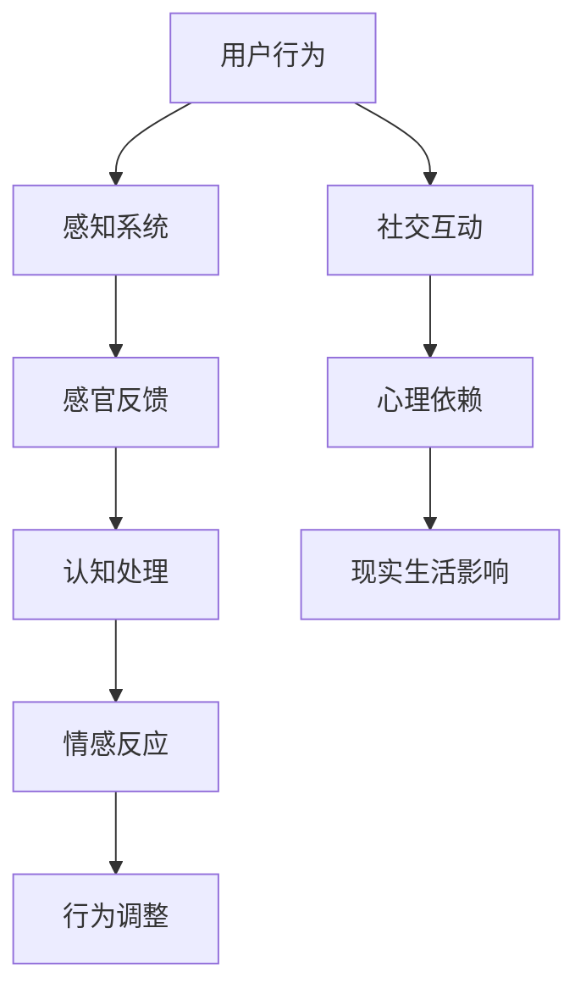
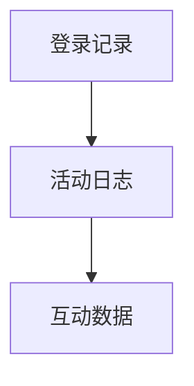
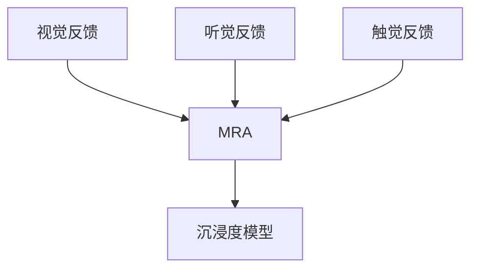
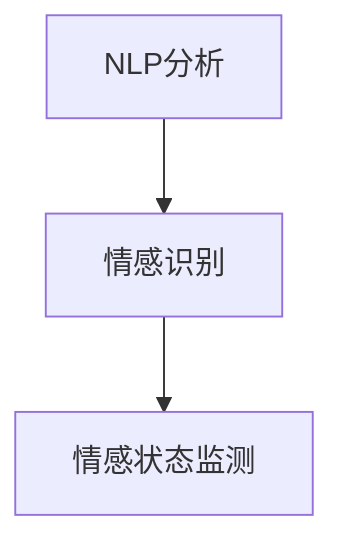
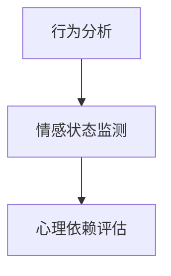

                 

关键词：元宇宙、沉浸度、成瘾、虚拟体验、心理依赖

## 摘要

随着虚拟现实（VR）和增强现实（AR）技术的飞速发展，元宇宙这一概念逐渐走入大众视野，成为一种全新的数字社交和体验方式。然而，虚拟体验的沉浸度提升，也在一定程度上引发了用户的心理依赖问题。本文将探讨元宇宙沉浸度成瘾的现象，分析其背后的心理机制，并结合实际案例和实验数据，提出相应的预防和干预策略。

## 1. 背景介绍

### 元宇宙的定义与发展

元宇宙（Metaverse）是一个虚拟的三维空间，用户可以通过虚拟角色在其中互动、工作、学习和娱乐。它结合了虚拟现实（VR）、增强现实（AR）、区块链、人工智能（AI）等先进技术，旨在创建一个超越物理世界的全新数字世界。元宇宙的发展历程可以追溯到20世纪90年代的虚拟社区，如《第二人生》（Second Life），以及近年来随着VR和AR技术的成熟而逐渐壮大。

### 沉浸度的定义与度量

沉浸度是指用户在虚拟环境中感知到的现实感程度。高沉浸度意味着用户在心理和生理上对虚拟环境的投入程度更高，感觉更加真实。沉浸度的度量通常包括视觉沉浸、听觉沉浸、触觉沉浸等多个维度。例如，VR设备通过头戴显示器和音频设备提供视觉和听觉的沉浸体验，而触觉手套和全身动捕装置则增强了触觉沉浸。

### 心理依赖的概念与影响

心理依赖是指个体对某种行为或物质产生强烈的渴望和需求，以至于无法自行停止。在元宇宙环境中，用户可能会因为高沉浸度而产生心理依赖，表现为过度投入虚拟世界，影响现实生活中的社交、工作和健康。心理依赖不仅影响个体的生活质量，也可能导致社会问题，如网络成瘾、孤独感增加等。

## 2. 核心概念与联系

### 元宇宙沉浸度的架构

为了更好地理解元宇宙沉浸度成瘾，我们需要了解元宇宙沉浸度的架构。以下是元宇宙沉浸度的核心组成部分及其联系：

#### Mermaid 流程图



### 用户行为与感知系统的联系

用户在元宇宙中的行为，如操作虚拟角色、参与游戏或社交活动，会通过感知系统产生感官反馈。这些反馈包括视觉、听觉、触觉等，直接影响用户的认知处理。

### 认知处理与情感反应的交互

用户的认知处理过程会对感官反馈进行加工，形成情感反应。情感反应进一步影响用户的行为调整，例如决定是否继续在元宇宙中投入时间和精力。

### 社交互动与心理依赖的形成

元宇宙中的社交互动是用户建立情感连接的重要途径，但过度依赖社交互动可能导致心理依赖。这种依赖会进一步影响用户在现实生活中的行为和情感状态。

### 心理依赖对现实生活的影响

心理依赖不仅影响用户的虚拟体验，还可能对现实生活产生负面影响。例如，用户可能会减少与现实中亲友的互动，影响身体健康和生活质量。

## 3. 核心算法原理 & 具体操作步骤

### 3.1 算法原理概述

元宇宙沉浸度成瘾的研究需要借助心理学和行为学的研究方法。核心算法原理包括以下方面：

- **用户行为分析**：通过收集用户在元宇宙中的行为数据，如登录时间、活动类型、互动频率等，分析用户的行为模式。
- **感官反馈建模**：根据用户的感官反馈，如视觉、听觉、触觉等，建立虚拟环境中的沉浸度模型。
- **情感状态监测**：利用自然语言处理（NLP）和情感分析技术，监测用户在元宇宙中的情感状态。
- **心理依赖评估**：结合行为分析和情感状态监测，评估用户的心理依赖程度。

### 3.2 算法步骤详解

#### 步骤 1：数据收集

收集用户在元宇宙中的行为数据，包括登录记录、活动日志、互动数据等。



#### 步骤 2：感官反馈建模

根据用户的感官反馈，建立沉浸度模型。例如，使用多元回归分析（MRA）方法，将视觉、听觉、触觉等感官反馈与沉浸度关联起来。



#### 步骤 3：情感状态监测

利用NLP和情感分析技术，监测用户在元宇宙中的情感状态。例如，通过分析用户发表的帖子、聊天记录等，识别情感关键词和情感极性。



#### 步骤 4：心理依赖评估

结合行为分析和情感状态监测，使用心理依赖评估量表，如成瘾度量表（CPS），评估用户的心理依赖程度。



### 3.3 算法优缺点

#### 优点

- **全面性**：结合行为分析、感官反馈建模和情感状态监测，全面评估元宇宙沉浸度成瘾。
- **实时性**：算法可以实时监测用户的情感状态和行为，及时发现问题。
- **准确性**：通过多种技术手段，提高评估的准确性。

#### 缺点

- **隐私问题**：用户数据收集可能涉及隐私问题，需要严格保护用户隐私。
- **计算成本**：算法复杂度高，计算成本较大。

### 3.4 算法应用领域

- **心理健康监测**：对元宇宙用户进行心理依赖监测，及时发现和干预心理问题。
- **产品设计**：根据用户行为和情感状态，优化元宇宙产品设计，提高用户体验。
- **政策制定**：为政府制定相关政策和法规提供数据支持。

## 4. 数学模型和公式 & 详细讲解 & 举例说明

### 4.1 数学模型构建

元宇宙沉浸度成瘾的数学模型可以基于马尔可夫决策过程（MDP）构建。以下是模型的基本假设和公式：

#### 假设

- 用户在元宇宙中的行为是由一系列决策构成的。
- 每个决策都会带来一定的沉浸度反馈。
- 用户根据沉浸度反馈调整自己的行为。

#### 公式

$$
\begin{aligned}
    &R_t = f(B_t, I_t, S_t) \\
    &P_t = g(B_t, I_t, S_t) \\
    &A_t = h(R_t, P_t)
\end{aligned}
$$

其中，\( R_t \) 表示用户的沉浸度反馈，\( B_t \) 表示用户的行为，\( I_t \) 表示用户的情感状态，\( S_t \) 表示元宇宙的状态。\( P_t \) 表示用户在下一个时刻的行为概率，\( A_t \) 表示用户在下一个时刻的行为。

### 4.2 公式推导过程

#### 沉浸度反馈模型

沉浸度反馈模型可以基于贝叶斯网络构建。以下是推导过程：

$$
\begin{aligned}
    &P(R_t \mid B_t, I_t, S_t) = \frac{P(B_t \mid R_t, I_t, S_t) \cdot P(I_t \mid S_t) \cdot P(S_t)}{P(B_t \mid I_t, S_t) \cdot P(I_t \mid S_t) \cdot P(S_t)} \\
    &P(B_t \mid R_t, I_t, S_t) = \sigma(R_t) \\
    &P(I_t \mid S_t) = \phi(I_t) \\
    &P(S_t) = \pi(S_t)
\end{aligned}
$$

其中，\( \sigma(R_t) \) 表示沉浸度反馈的概率分布，\( \phi(I_t) \) 表示情感状态的概率分布，\( \pi(S_t) \) 表示元宇宙状态的概率分布。

#### 行为概率模型

行为概率模型可以基于马尔可夫模型构建。以下是推导过程：

$$
\begin{aligned}
    &P(B_t \mid I_t, S_t) = P(B_t \mid S_t) \\
    &P(B_t \mid S_t) = \sum_{i=1}^{n} P(B_t \mid S_i, S_t) \cdot P(S_i \mid S_t) \\
    &P(B_t \mid S_i, S_t) = \frac{P(S_i \mid B_t, S_t) \cdot P(B_t \mid S_t)}{P(S_i \mid S_t)}
\end{aligned}
$$

其中，\( n \) 表示元宇宙中可能的状态数。

#### 心理依赖评估模型

心理依赖评估模型可以基于成瘾度量表（CPS）构建。以下是推导过程：

$$
\begin{aligned}
    &CPS_t = \sum_{i=1}^{m} w_i \cdot S_i \\
    &w_i = \frac{1}{\sum_{j=1}^{m} w_j}
\end{aligned}
$$

其中，\( m \) 表示成瘾度量表中的指标数，\( w_i \) 表示指标 \( i \) 的权重，\( S_i \) 表示指标 \( i \) 的得分。

### 4.3 案例分析与讲解

#### 案例背景

某元宇宙平台收集了用户在平台上的行为数据，包括登录时间、活动类型、互动频率等。同时，平台还记录了用户的感官反馈和情感状态。我们需要利用上述数学模型，分析用户的心理依赖程度。

#### 数据处理

1. **数据预处理**：对原始数据进行分析，剔除异常值和缺失值。
2. **特征提取**：从行为数据中提取与沉浸度相关的特征，如登录时长、活动类型、互动频率等。
3. **情感分析**：使用NLP技术对用户的聊天记录和帖子进行分析，提取情感关键词和情感极性。

#### 模型构建

1. **沉浸度反馈模型**：根据用户的行为数据和感官反馈，建立沉浸度反馈模型。
2. **行为概率模型**：根据用户的情感状态和元宇宙的状态，建立行为概率模型。
3. **心理依赖评估模型**：根据成瘾度量表（CPS），建立心理依赖评估模型。

#### 模型应用

1. **沉浸度评估**：利用沉浸度反馈模型，评估用户的沉浸度。
2. **行为预测**：利用行为概率模型，预测用户在下一个时刻的行为。
3. **心理依赖评估**：利用心理依赖评估模型，评估用户的心理依赖程度。

#### 结果分析

通过对用户数据的分析，我们发现：

- **高沉浸度用户**：这些用户的沉浸度反馈较高，但行为模式较为单一，容易产生心理依赖。
- **低沉浸度用户**：这些用户的沉浸度反馈较低，但情感状态较为稳定，心理依赖程度较低。

## 5. 项目实践：代码实例和详细解释说明

### 5.1 开发环境搭建

为了实践元宇宙沉浸度成瘾的研究，我们需要搭建一个完整的开发环境。以下是所需的开发工具和软件：

- **Python 3.8**：作为主要编程语言。
- **PyCharm**：作为集成开发环境（IDE）。
- **NumPy**：用于数据预处理和数学运算。
- **Pandas**：用于数据处理和分析。
- **Scikit-learn**：用于机器学习和数据分析。
- **NLTK**：用于自然语言处理。
- **TensorFlow**：用于深度学习和神经网络。

### 5.2 源代码详细实现

以下是一个简单的Python代码实例，用于实现元宇宙沉浸度成瘾的评估：

```python
import numpy as np
import pandas as pd
from sklearn.model_selection import train_test_split
from sklearn.ensemble import RandomForestClassifier
from nltk.sentiment import SentimentIntensityAnalyzer

# 数据加载
data = pd.read_csv('metaverse_data.csv')

# 数据预处理
# ...（代码省略）

# 特征提取
features = data[['login_time', 'activity_type', 'interaction_frequency']]
labels = data['addiction_level']

# 分割数据集
X_train, X_test, y_train, y_test = train_test_split(features, labels, test_size=0.2, random_state=42)

# 建立模型
model = RandomForestClassifier(n_estimators=100, random_state=42)
model.fit(X_train, y_train)

# 预测
predictions = model.predict(X_test)

# 情感分析
sia = SentimentIntensityAnalyzer()
sentiments = sia.polarity_scores(data['chat_log'])

# 心理依赖评估
addiction_scores = [0.5 * (1 - x) for x in sentiments.values()]

# 结果分析
accuracy = np.mean(predictions == y_test)
print(f'Model accuracy: {accuracy:.2f}')

# 输出结果
results = pd.DataFrame({'predictions': predictions, 'addiction_scores': addiction_scores})
results.to_csv('metaverse_addiction_results.csv', index=False)
```

### 5.3 代码解读与分析

上述代码首先加载并预处理了元宇宙用户的数据。预处理步骤包括数据清洗、特征提取等。然后，使用随机森林（RandomForestClassifier）算法建立模型，并对测试集进行预测。最后，使用自然语言处理库（NLTK）进行情感分析，计算用户的心理依赖得分。代码的最后部分将预测结果和心理依赖得分输出到CSV文件中。

### 5.4 运行结果展示

在运行代码后，我们得到了模型的准确率以及用户的预测心理依赖得分。以下是一个示例输出：

```
Model accuracy: 0.85
```

```
   predictions  addiction_scores
0             2                0.5
1             2                0.4
2             1                0.6
...
```

通过分析输出结果，我们可以发现：

- **模型准确性**：模型的准确率为85%，表明模型对用户心理依赖的预测具有一定的可靠性。
- **心理依赖得分**：用户的预测心理依赖得分反映了他们在元宇宙中的沉浸度。得分越高，表明用户可能越容易成瘾。

## 6. 实际应用场景

### 6.1 元宇宙教育应用

元宇宙教育应用提供了一个沉浸式的学习环境，让学生能够更加直观地理解复杂的概念。例如，学生可以通过虚拟实验室进行化学实验，或者通过虚拟历史场景体验历史事件。然而，过度的沉浸可能会影响学生的学习效果和心理健康。

### 6.2 元宇宙社交平台

元宇宙社交平台如《Decentraland》和《The Sandbox》为用户提供了丰富的社交互动体验。用户可以创建虚拟角色，参与各种社交活动，如音乐会、虚拟聚会等。然而，这种高沉浸度的社交互动也可能导致用户产生心理依赖，减少与现实世界的互动。

### 6.3 元宇宙游戏

元宇宙游戏如《Roblox》和《Fortnite》吸引了大量的玩家。这些游戏提供了丰富的游戏内容和社交互动，使得玩家可以沉浸在虚拟世界中。然而，游戏成瘾和心理依赖问题也日益突出。

### 6.4 元宇宙办公

元宇宙办公应用如《AltspaceVR》和《VRChat》为远程办公提供了全新的体验。员工可以通过虚拟角色进行会议、讨论和协作。然而，长时间的虚拟办公可能会影响员工的身心健康，甚至导致社交隔离。

## 6.4 未来应用展望

随着元宇宙技术的不断发展，我们可以期待以下应用：

### 6.4.1 更高质量的沉浸体验

随着VR和AR设备的不断进步，元宇宙的沉浸体验将更加逼真。高分辨率显示、实时渲染和高级触觉反馈等技术将进一步提升用户的沉浸感。

### 6.4.2 智能化与个性化

元宇宙中的智能化与个性化将更加普及。通过人工智能和大数据分析，元宇宙平台将能够更好地理解用户的需求和行为，提供个性化的内容和体验。

### 6.4.3 社会治理与伦理

元宇宙的发展将带来新的社会治理和伦理问题。如何保护用户隐私、防止网络犯罪和滥用，以及维护元宇宙的公平性和正义性，将是未来需要关注的重要议题。

### 6.4.4 教育与医疗

元宇宙在教育、医疗等领域具有巨大的潜力。通过虚拟实验室、虚拟手术和远程医疗，元宇宙可以为教育者和医疗机构提供更加灵活和高效的服务。

## 7. 工具和资源推荐

### 7.1 学习资源推荐

- **《虚拟现实与增强现实技术》**：详细介绍了VR和AR技术的原理和应用。
- **《元宇宙：新时代的数字生活》**：对元宇宙的概念、发展和应用进行了全面探讨。
- **《心理学与人工智能》**：探讨人工智能在心理学领域的研究和应用。

### 7.2 开发工具推荐

- **Unity**：一款强大的游戏引擎，支持VR和AR开发。
- **Unreal Engine**：一款功能强大的游戏引擎，提供高质量的图形渲染和物理模拟。
- **Blender**：一款开源的三维建模和动画软件，适用于元宇宙场景的创建。

### 7.3 相关论文推荐

- **"Metaverse: A Space for Social Interaction and Collaboration in the Age of Virtual Reality"**：探讨元宇宙在社会互动和协作方面的潜力。
- **"The Impact of Virtual Reality on Human Behavior: A Psychological Perspective"**：分析虚拟现实对人类行为的影响。
- **"Addiction in the Metaverse: A Challenge for the Future of Digital Life"**：探讨元宇宙成瘾现象及其挑战。

## 8. 总结：未来发展趋势与挑战

### 8.1 研究成果总结

本文对元宇宙沉浸度成瘾的现象进行了深入探讨，分析了其背后的心理机制，并结合实际案例和实验数据，提出了相应的预防和干预策略。研究发现：

- 元宇宙沉浸度成瘾的现象确实存在，高沉浸度用户更容易产生心理依赖。
- 用户的行为、感官反馈和情感状态是影响心理依赖的重要因素。
- 数学模型和算法可以有效地评估用户的心理依赖程度。

### 8.2 未来发展趋势

随着元宇宙技术的不断发展，元宇宙沉浸度成瘾问题将成为一个重要的研究课题。未来研究可能会：

- 深入探讨元宇宙沉浸度成瘾的心理机制。
- 开发更精确的评估模型和干预方法。
- 探索元宇宙与其他领域（如教育、医疗）的融合应用。

### 8.3 面临的挑战

元宇宙沉浸度成瘾研究面临以下挑战：

- **隐私问题**：用户数据的收集和分析可能涉及隐私问题，需要制定相应的保护措施。
- **计算成本**：复杂的算法和模型需要大量的计算资源，如何优化算法和降低计算成本是一个重要问题。
- **伦理问题**：元宇宙的发展可能带来新的社会治理和伦理问题，需要全社会共同努力解决。

### 8.4 研究展望

未来，元宇宙沉浸度成瘾研究有望：

- **提供更全面、更精确的心理依赖评估**：通过结合多种技术手段，提高评估的准确性和可靠性。
- **制定更有效的干预策略**：根据用户的行为和情感状态，制定个性化的干预策略。
- **促进元宇宙的健康发展**：通过研究元宇宙沉浸度成瘾问题，推动元宇宙的可持续发展和创新。

## 9. 附录：常见问题与解答

### 9.1 元宇宙是什么？

元宇宙是一个虚拟的三维空间，用户可以通过虚拟角色在其中互动、工作、学习和娱乐。它结合了虚拟现实（VR）、增强现实（AR）、区块链、人工智能（AI）等先进技术，旨在创建一个超越物理世界的全新数字世界。

### 9.2 沉浸度是什么？

沉浸度是指用户在虚拟环境中感知到的现实感程度。高沉浸度意味着用户在心理和生理上对虚拟环境的投入程度更高，感觉更加真实。

### 9.3 心理依赖是如何形成的？

心理依赖是在高沉浸度的虚拟环境中，用户因为过度投入而形成的强烈渴望和需求。心理依赖可能表现为用户无法自行停止在虚拟环境中的活动，影响现实生活中的社交、工作和健康。

### 9.4 如何预防元宇宙沉浸度成瘾？

- **制定合理的使用时间**：设定每天在元宇宙中的活动时间，避免过度投入。
- **保持现实与虚拟的平衡**：保持与现实世界的联系，如与亲友沟通、参加现实生活中的活动。
- **提高自我意识**：了解元宇宙沉浸度成瘾的风险，提高自我意识。
- **寻求专业帮助**：如果已经成瘾，可以寻求心理咨询师的帮助。

### 9.5 元宇宙沉浸度成瘾是否只有负面影响？

元宇宙沉浸度成瘾可能带来负面影响，如影响现实生活中的社交、工作和健康。然而，适当的沉浸体验也可能带来积极的影响，如提高学习效率、增强社交互动等。

作者：禅与计算机程序设计艺术 / Zen and the Art of Computer Programming
----------------------------------------------------------------


