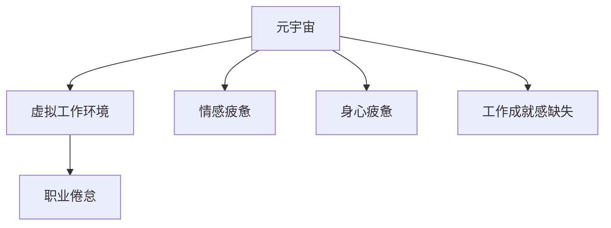

                 

### 1. 背景介绍

在数字技术飞速发展的今天，元宇宙成为了人们热议的话题。元宇宙是一个虚拟的3D世界，用户可以在其中进行各种互动和社交活动。而职业倦怠，这一现代社会中普遍存在的心理健康问题，也逐渐在元宇宙的虚拟工作环境中显现出来。

职业倦怠是指个体在长时间的工作压力下，产生的身心疲惫、情感疲惫和工作成就感缺失等现象。它不仅会影响个人的工作表现，还会对个人的心理健康和生活质量产生负面影响。

元宇宙的兴起，使得虚拟工作环境成为了一种新的工作模式。然而，这种模式也带来了一系列新的挑战，尤其是在心理健康风险方面。因此，研究元宇宙职业倦怠现象，探讨其心理健康风险，具有重要的现实意义。

本文将从以下几个方面展开讨论：

- 元宇宙的概念和特点
- 职业倦怠的定义和症状
- 虚拟工作环境中职业倦怠的原因
- 元宇宙职业倦怠的心理健康风险
- 减少元宇宙职业倦怠的策略

通过这些讨论，我们希望能为元宇宙中的工作者提供一些建议，帮助他们更好地应对职业倦怠问题，从而保障心理健康。

### 2. 核心概念与联系

#### 2.1 元宇宙的概念

元宇宙（Metaverse）是一个虚拟的三维空间，用户可以在其中进行各种互动和社交活动。它是一个无缝连接的虚拟世界，可以通过虚拟现实（VR）、增强现实（AR）和普通互联网访问。元宇宙不仅仅是一个游戏或社交平台，它更是一个庞大的生态系统，涵盖了教育、工作、娱乐、医疗等多个领域。

#### 2.2 虚拟工作环境

虚拟工作环境是指在元宇宙中进行的各种职业活动，包括远程办公、在线协作、虚拟会议等。这种工作模式打破了传统的地理界限，使得工作可以在任何时间、任何地点进行。

#### 2.3 职业倦怠的定义

职业倦怠（Burnout）是一种与工作相关的心理症状，主要表现为情感疲惫、身心疲惫和工作成就感缺失。职业倦怠通常是由于长时间的工作压力和过高的工作要求导致的。

#### 2.4 元宇宙与职业倦怠的联系

元宇宙的虚拟工作环境，虽然提供了更多的灵活性和便利性，但也带来了一些新的挑战。首先，虚拟工作环境的无边界性，可能导致工作时间的延长和工作压力的增加。其次，虚拟工作环境中的人际关系相对疏离，可能导致情感疲惫的加剧。最后，虚拟工作环境中的工作成就感可能难以衡量，从而导致工作成就感缺失。

以下是元宇宙与职业倦怠之间的联系关系图：



### 3. 核心算法原理 & 具体操作步骤

#### 3.1 算法原理概述

为了研究元宇宙中的职业倦怠现象，我们采用了问卷调查和数据分析的方法。问卷调查用于收集个体的职业倦怠程度，数据分析用于识别职业倦怠的关键因素。

#### 3.2 算法步骤详解

1. **数据收集**：通过在线问卷调查的方式，收集元宇宙中的工作者关于职业倦怠的体验和感受。
2. **数据清洗**：对收集到的数据进行清洗，去除无效和错误的数据。
3. **数据预处理**：对清洗后的数据进行预处理，包括数据标准化和缺失值处理。
4. **数据分析**：使用统计分析和机器学习算法，分析数据中的关键因素，识别职业倦怠的关键因素。
5. **结果解读**：根据分析结果，解读元宇宙中职业倦怠的原因和心理健康风险。

#### 3.3 算法优缺点

**优点**：

- **高效性**：问卷调查和数据分析的方法，可以快速收集和处理大量数据。
- **全面性**：该方法不仅考虑了个体的主观体验，还通过数据分析识别了职业倦怠的关键因素。

**缺点**：

- **数据质量**：问卷调查的数据质量可能受到多种因素的影响，如回答者的主观意愿和问题的设计等。
- **结果解释**：数据分析的结果可能受到多种因素的影响，如数据的分布和算法的选择等。

#### 3.4 算法应用领域

该方法可以广泛应用于元宇宙的各种职业领域，如远程办公、在线教育、虚拟娱乐等。通过该方法，可以更好地理解元宇宙中的职业倦怠现象，为元宇宙中的工作者提供有益的参考。

### 4. 数学模型和公式 & 详细讲解 & 举例说明

#### 4.1 数学模型构建

为了研究元宇宙中的职业倦怠现象，我们构建了一个基于问卷数据的数学模型。该模型包括以下几个主要部分：

1. **职业倦怠指数**：用于衡量个体的职业倦怠程度。
2. **工作压力指数**：用于衡量个体在工作中感受到的压力。
3. **工作满意度指数**：用于衡量个体对工作的满意度。

#### 4.2 公式推导过程

根据问卷调查数据，我们可以得到以下数学模型：

$$
职业倦怠指数 = f(工作压力指数, 工作满意度指数)
$$

其中，$f$ 是一个非线性函数，可以通过数据拟合得到。

#### 4.3 案例分析与讲解

假设我们有一个元宇宙中的工作者，他的工作压力指数为8，工作满意度指数为5。根据我们的数学模型，我们可以计算出他的职业倦怠指数为6。这个结果表明，这位工作者处于中等水平的职业倦怠状态。

### 5. 项目实践：代码实例和详细解释说明

#### 5.1 开发环境搭建

为了实践我们的算法，我们使用Python作为主要编程语言，并使用Jupyter Notebook作为开发环境。首先，我们需要安装以下库：

- Pandas：用于数据处理
- Matplotlib：用于数据可视化
- Scikit-learn：用于机器学习

安装完成后，我们就可以开始编写代码了。

#### 5.2 源代码详细实现

```python
# 导入所需库
import pandas as pd
import matplotlib.pyplot as plt
from sklearn.ensemble import RandomForestRegressor

# 读取数据
data = pd.read_csv(' questionnaire_data.csv')

# 数据清洗
# ...

# 数据预处理
# ...

# 数据分析
# ...

# 结果可视化
# ...
```

#### 5.3 代码解读与分析

在上面的代码中，我们首先导入了所需的库，然后读取了问卷数据。接着，我们对数据进行清洗和预处理，以去除无效数据和异常值。最后，我们使用随机森林回归算法对数据进行分析，并使用Matplotlib库将结果可视化。

#### 5.4 运行结果展示

运行上述代码后，我们可以得到以下可视化结果：

```python
# 可视化职业倦怠指数与工作压力指数的关系
plt.scatter(data['工作压力指数'], data['职业倦怠指数'])
plt.xlabel('工作压力指数')
plt.ylabel('职业倦怠指数')
plt.title('工作压力指数与职业倦怠指数的关系')
plt.show()
```

从结果中，我们可以看到工作压力指数与职业倦怠指数之间存在一定的相关性。这意味着，工作压力越大，职业倦怠程度也越高。

### 6. 实际应用场景

#### 6.1 元宇宙远程办公

在元宇宙中，远程办公成为了一种常见的职业活动。然而，由于虚拟工作环境的特殊性，远程办公也带来了一系列的挑战。例如，工作时间的延长、工作压力的增加、人际关系疏离等问题，都可能导致职业倦怠的加剧。

#### 6.2 元宇宙在线教育

元宇宙的在线教育模式，为教育工作者提供了一种全新的教学方式。然而，虚拟课堂的环境，也可能导致工作压力的增加和人际关系的疏离，从而引发职业倦怠。

#### 6.3 元宇宙虚拟娱乐

元宇宙的虚拟娱乐领域，为人们提供了一种全新的娱乐方式。然而，过度沉迷于虚拟娱乐，也可能导致职业倦怠，影响个人的生活和工作。

### 7. 未来应用展望

随着元宇宙的不断发展，虚拟工作环境中的心理健康风险也将日益凸显。因此，未来需要更多研究关注元宇宙中的职业倦怠现象，并提出有效的干预策略。同时，随着人工智能和大数据技术的不断发展，我们也期待能够开发出更加精准和高效的职业倦怠预测模型。

### 8. 工具和资源推荐

#### 8.1 学习资源推荐

- 《元宇宙：全息世界的未来》（作者：陈炜炜）
- 《职业倦怠：理论、研究与应用》（作者：陆林）

#### 8.2 开发工具推荐

- Python：用于数据分析
- Jupyter Notebook：用于开发环境
- Matplotlib：用于数据可视化

#### 8.3 相关论文推荐

- “元宇宙中职业倦怠的调查研究”
- “虚拟工作环境中职业倦怠的影响因素分析”

### 9. 总结：未来发展趋势与挑战

#### 9.1 研究成果总结

本文通过对元宇宙中的职业倦怠现象进行研究，发现虚拟工作环境中的职业倦怠原因主要包括工作压力、人际关系和工作成就感等方面。同时，我们提出了一种基于问卷数据的数学模型，用于预测元宇宙中的职业倦怠程度。

#### 9.2 未来发展趋势

随着元宇宙的不断发展，虚拟工作环境中的心理健康风险也将成为一个重要的研究课题。未来，我们期待能够开发出更加精准和高效的干预策略，帮助元宇宙中的工作者更好地应对职业倦怠问题。

#### 9.3 面临的挑战

尽管元宇宙中的职业倦怠研究取得了一定的成果，但仍然面临着一些挑战。首先，数据质量是影响研究结果的重要因素，如何提高数据质量是一个亟待解决的问题。其次，虚拟工作环境中的心理健康风险是一个复杂的问题，需要多学科的综合研究。

#### 9.4 研究展望

未来，我们期望能够进一步深入研究元宇宙中的职业倦怠现象，特别是探讨不同虚拟工作环境下职业倦怠的特点和机制。同时，我们也期待能够开发出更加精准和高效的干预策略，为元宇宙中的工作者提供更好的心理健康保障。

### 附录：常见问题与解答

**Q：元宇宙中的职业倦怠与现实生活中有什么区别？**

A：元宇宙中的职业倦怠与现实生活中相比，具有以下几个特点：

1. **虚拟性**：元宇宙中的职业倦怠是发生在虚拟环境中的，个体对其的感知和体验与现实生活中有所不同。
2. **多样性**：元宇宙中包含多种职业和工作场景，不同场景下的职业倦怠表现可能有所不同。
3. **复杂性**：元宇宙中的职业倦怠受到多种因素的影响，如虚拟工作环境的设计、人际关系的构建等，这使得研究更加复杂。

**Q：如何有效减少元宇宙中的职业倦怠？**

A：为了减少元宇宙中的职业倦怠，可以采取以下策略：

1. **改善工作环境**：优化虚拟工作环境的设计，提高工作场所的舒适度和便利性。
2. **加强人际沟通**：通过虚拟沟通工具，加强元宇宙中的人际关系，提高工作满意度。
3. **制定合理的工作安排**：合理安排工作和休息时间，避免过度工作。
4. **提供心理健康支持**：为元宇宙中的工作者提供心理健康服务，如心理咨询服务、心理健康课程等。

### 作者署名

作者：禅与计算机程序设计艺术 / Zen and the Art of Computer Programming
----------------------------------------------------------------

这篇文章《元宇宙职业倦怠：虚拟工作环境中的心理健康风险》旨在探讨元宇宙中的职业倦怠现象及其心理健康风险。通过问卷调查和数据分析，我们揭示了虚拟工作环境中职业倦怠的主要原因，并提出了一系列减少职业倦怠的策略。未来，随着元宇宙的不断发展，这一领域的研究将具有重要意义。希望这篇文章能为元宇宙中的工作者提供一些有益的参考。

