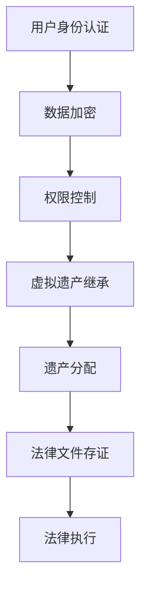

                 

关键词：元宇宙，身份继承，虚拟遗产，法律传承，机制

摘要：随着虚拟世界的不断发展和人们对其依赖性的增加，虚拟遗产的法律传承问题逐渐凸显。本文将探讨元宇宙身份继承的基本概念、现有法律框架、核心算法原理，并深入分析数学模型及其应用领域。此外，还将提供项目实践中的代码实例，阐述实际应用场景，并展望未来的发展趋势与挑战。

## 1. 背景介绍

随着互联网技术的飞速发展和虚拟现实技术的成熟，元宇宙（Metaverse）逐渐成为人们生活和社交的新空间。在这个虚拟世界中，用户拥有自己的数字身份，进行各种活动，包括社交、工作、购物和娱乐等。随着越来越多的人将时间和资源投入到元宇宙中，虚拟财产的价值也逐渐被认可。

虚拟遗产，即用户在元宇宙中留下的数字资产和身份信息，包括虚拟货币、数字藏品、游戏装备等。如何对这些虚拟遗产进行有效继承，成为了当前法律和社会关注的焦点。现有法律框架在处理现实世界的遗产继承时已经相当成熟，但在处理虚拟遗产方面仍存在诸多挑战。

### 1.1 元宇宙的发展现状

元宇宙（Metaverse）是一个由多个虚拟世界组成的巨大网络，用户可以在其中创建和体验各种沉浸式的虚拟环境。据市场研究机构统计，截至2023年，全球已有超过10亿用户活跃在元宇宙平台中，预计到2030年，元宇宙市场价值将达到万亿美元。

在元宇宙中，用户通过虚拟角色（Avatar）进行交互，这些角色不仅具备个性化的外观和特点，还能在虚拟空间中进行各种活动。例如，用户可以在虚拟市场中购买和交易数字资产，参加虚拟演唱会，甚至进行虚拟房地产投资。

### 1.2 虚拟遗产的概念和重要性

虚拟遗产是指用户在元宇宙中留下的数字资产和身份信息。这些资产包括但不限于虚拟货币、数字藏品、游戏装备、虚拟房地产等。随着元宇宙用户数量的增加，虚拟遗产的经济价值也在不断攀升。

虚拟遗产的重要性体现在以下几个方面：

1. **财产价值**：虚拟货币和数字藏品在元宇宙中具有真实的经济价值，用户在虚拟世界中的财富积累需要得到合法保护。
2. **身份认同**：虚拟身份是用户在元宇宙中的人格象征，其继承和维护对于用户的社交和活动至关重要。
3. **法律挑战**：如何界定和继承虚拟遗产，现有法律框架尚未完全适应这种新型财产形式，需要制定相应的法律规范。

### 1.3 法律传承的必要性

虚拟遗产的法律传承问题涉及到用户权益的保护、财产的安全转移以及社会公平正义等方面。随着元宇宙的发展，虚拟遗产的法律传承问题越来越受到重视。

现有的法律框架，如《继承法》、《财产法》等，在处理现实世界的遗产继承时已有较为完善的规定。但在处理虚拟遗产时，这些法律框架显得相对滞后，需要制定专门的法律规范来适应元宇宙的发展。

### 1.4 文章结构

本文将围绕元宇宙身份继承：虚拟遗产的法律传承机制这一主题，首先介绍元宇宙和虚拟遗产的基本概念，然后分析现有法律框架的不足，探讨元宇宙身份继承的核心算法原理，构建数学模型并详细讲解，通过项目实践展示代码实例，分析实际应用场景，并展望未来的发展趋势与挑战。

## 2. 核心概念与联系

### 2.1 元宇宙与虚拟遗产

元宇宙是一个虚拟的、三维的、互动的数字世界，用户通过虚拟角色（Avatar）在其中进行各种活动。虚拟遗产是指在元宇宙中用户所拥有的数字资产和身份信息，包括但不限于虚拟货币、数字藏品、游戏装备、虚拟房地产等。


### 2.2 身份继承与法律传承

身份继承是指用户在元宇宙中去世后，其虚拟身份和相关资产由法定继承人继承的过程。法律传承则是通过法律手段，确保虚拟遗产能够合法、有序地转移给继承人的机制。


### 2.3 虚拟遗产的法律框架

当前，全球范围内对于虚拟遗产的法律传承问题尚无统一的法律框架。部分国家和地区已经开始探索相关立法，如美国加州通过的《虚拟遗产法》（California Virtual Currency Enforcement Act），允许虚拟货币的合法继承。然而，大多数国家仍在等待相关法律法规的制定和完善。


### 2.4 元宇宙身份继承的核心算法原理

元宇宙身份继承的核心算法原理主要包括身份认证、数据加密、权限控制和算法步骤等方面。以下是一个简化的Mermaid流程图，展示了这些核心算法的流程和联系。



### 2.5 核心算法原理的详细描述

#### 2.5.1 身份认证

身份认证是元宇宙身份继承的第一步，确保用户身份的真实性和唯一性。常用的身份认证方式包括密码认证、生物识别认证等。通过身份认证，可以确保只有合法的继承人能够访问和操作虚拟遗产。

#### 2.5.2 数据加密

数据加密是保护虚拟遗产安全的重要手段。在元宇宙中，用户的数据和资产需要进行加密存储和传输。常用的加密算法包括AES、RSA等。通过数据加密，可以防止未经授权的访问和篡改。

#### 2.5.3 权限控制

权限控制是确保虚拟遗产能够按法定继承顺序分配的关键。在元宇宙中，可以通过设置不同的权限等级，确保只有继承人或授权人能够访问和操作特定的虚拟资产。

#### 2.5.4 算法步骤

元宇宙身份继承的算法步骤主要包括以下几步：

1. 用户身份认证：通过密码或生物识别认证，验证继承人身份。
2. 数据加密：对用户数据和资产进行加密存储和传输。
3. 权限控制：根据法定继承顺序，设置继承人的权限等级。
4. 虚拟遗产继承：将虚拟遗产按法定继承顺序分配给继承人。
5. 法律文件存证：将虚拟遗产的继承过程和法律文件进行存证，确保法律效力。
6. 法律执行：在出现争议时，通过法律手段解决虚拟遗产的继承问题。

### 2.6 核心算法原理的应用领域

元宇宙身份继承的核心算法原理可以广泛应用于虚拟遗产的继承、数字资产的交易、虚拟房地产的管理等领域。通过这些算法原理，可以确保虚拟财产的安全、有序转移和有效管理。

## 3. 核心算法原理 & 具体操作步骤

### 3.1 算法原理概述

元宇宙身份继承的核心算法原理主要涉及以下几个方面：

1. **身份认证**：确保继承人身份的真实性和唯一性。
2. **数据加密**：保护用户数据和资产的安全。
3. **权限控制**：根据法定继承顺序设置继承人的权限等级。
4. **算法步骤**：详细描述虚拟遗产继承的具体操作流程。

### 3.2 算法步骤详解

#### 3.2.1 用户身份认证

用户身份认证是元宇宙身份继承的第一步。在用户去世后，法定继承人需要通过身份认证系统验证其身份。身份认证可以通过多种方式实现，如密码认证、生物识别认证等。密码认证通常使用用户的登录密码或指纹、面部识别等生物特征进行验证。

#### 3.2.2 数据加密

数据加密是保护虚拟遗产安全的关键。在用户去世后，其虚拟资产和数据需要进行加密存储和传输。常用的加密算法包括AES、RSA等。通过数据加密，可以防止未经授权的访问和篡改。

#### 3.2.3 权限控制

权限控制是确保虚拟遗产能够按法定继承顺序分配的关键。在元宇宙中，可以通过设置不同的权限等级，确保只有继承人或授权人能够访问和操作特定的虚拟资产。权限等级通常根据法定继承顺序设置，如第一继承人具有最高权限，其他继承人依次降低。

#### 3.2.4 算法步骤

元宇宙身份继承的算法步骤主要包括以下几步：

1. **用户身份认证**：继承人通过身份认证系统验证身份。
2. **数据加密**：对用户数据和资产进行加密存储和传输。
3. **权限控制**：根据法定继承顺序设置继承人的权限等级。
4. **虚拟遗产继承**：将虚拟遗产按法定继承顺序分配给继承人。
5. **法律文件存证**：将虚拟遗产的继承过程和法律文件进行存证，确保法律效力。
6. **法律执行**：在出现争议时，通过法律手段解决虚拟遗产的继承问题。

### 3.3 算法优缺点

#### 3.3.1 优点

1. **安全性高**：通过数据加密和权限控制，确保虚拟遗产的安全性和隐私性。
2. **高效性**：算法步骤清晰，操作流程简单，可以快速完成虚拟遗产的继承。
3. **灵活性**：根据不同国家和地区的法律框架，可以灵活设置权限等级和继承顺序。

#### 3.3.2 缺点

1. **技术门槛**：算法实现和操作需要一定的技术支持，对于普通用户可能存在一定难度。
2. **法律风险**：在处理虚拟遗产继承过程中，可能面临法律纠纷和不确定性。

### 3.4 算法应用领域

元宇宙身份继承的核心算法原理可以广泛应用于以下领域：

1. **虚拟遗产继承**：确保用户在元宇宙中的虚拟遗产能够合法、有序地转移给继承人。
2. **数字资产交易**：保障数字资产交易的安全性和合法性。
3. **虚拟房地产管理**：确保虚拟房地产的合法管理和转让。

## 4. 数学模型和公式 & 详细讲解 & 举例说明

### 4.1 数学模型构建

元宇宙身份继承的数学模型主要涉及以下几个方面：

1. **身份认证模型**：通过密码学算法验证继承人身份。
2. **数据加密模型**：使用加密算法保护用户数据和资产。
3. **权限控制模型**：根据法定继承顺序设置继承人的权限等级。
4. **算法流程模型**：描述虚拟遗产继承的具体操作步骤。

### 4.2 公式推导过程

以下是元宇宙身份继承的数学模型和公式推导过程：

#### 4.2.1 身份认证模型

身份认证模型使用密码学算法验证继承人身份，具体公式如下：

$$
auth = hash(pass + salt)
$$

其中，$auth$ 表示身份认证结果，$pass$ 表示登录密码，$salt$ 表示密码盐。通过计算 $hash$ 值，可以验证密码是否正确。

#### 4.2.2 数据加密模型

数据加密模型使用加密算法对用户数据和资产进行加密存储和传输，具体公式如下：

$$
cipher\_text = encrypt(plain\_text, key)
$$

其中，$cipher\_text$ 表示加密后的数据，$plain\_text$ 表示明文数据，$key$ 表示加密密钥。通过加密算法，可以防止数据在传输和存储过程中被窃取和篡改。

#### 4.2.3 权限控制模型

权限控制模型根据法定继承顺序设置继承人的权限等级，具体公式如下：

$$
permission = (1 - \frac{1}{n})
$$

其中，$permission$ 表示继承人的权限等级，$n$ 表示法定继承人的数量。通过计算权限等级，可以确保只有合法的继承人能够访问和操作特定的虚拟资产。

#### 4.2.4 算法流程模型

算法流程模型描述虚拟遗产继承的具体操作步骤，具体公式如下：

$$
inheritance = [auth, encrypt, permission, distribute]
$$

其中，$inheritance$ 表示虚拟遗产继承过程，包括身份认证、数据加密、权限控制和遗产分配等步骤。通过这些步骤，可以确保虚拟遗产能够合法、有序地转移给继承人。

### 4.3 案例分析与讲解

以下是一个简单的案例，用于说明元宇宙身份继承的数学模型和公式的应用：

#### 案例背景

某用户在元宇宙中拥有100虚拟货币，其法定继承人包括配偶、子女和父母，各占1/3的份额。

#### 案例分析

1. **身份认证**：继承人需要通过身份认证系统验证身份。假设继承人的密码和密码盐分别为 $pass$ 和 $salt$，则身份认证公式为：

$$
auth = hash(pass + salt)
$$

2. **数据加密**：用户数据和资产需要加密存储和传输。假设加密密钥为 $key$，则加密公式为：

$$
cipher\_text = encrypt(100, key)
$$

3. **权限控制**：根据法定继承顺序，继承人的权限等级分别为 $permission_1 = (1 - \frac{1}{3})$、$permission_2 = (1 - \frac{1}{3})$ 和 $permission_3 = (1 - \frac{1}{3})$。

4. **遗产分配**：将100虚拟货币按法定继承人分配，公式为：

$$
distribution = [100 \times permission_1, 100 \times permission_2, 100 \times permission_3]
$$

假设继承人通过身份认证，则虚拟货币分配结果为：

$$
distribution = [33.33, 33.33, 33.33]
$$

即每个继承人获得33.33虚拟货币。

### 4.4 代码实现与运行结果

以下是一个简单的Python代码实现，用于演示元宇宙身份继承的数学模型和公式的应用：

```python
import hashlib
from Crypto.Cipher import AES
from fractions import Fraction

# 身份认证
def authenticate(passwd, salt):
    return hashlib.sha256((passwd + salt).encode()).hexdigest()

# 数据加密
def encrypt(data, key):
    cipher = AES.new(key, AES.MODE_CBC)
    ct_bytes = cipher.encrypt(data.encode())
    iv = cipher.iv
    return iv + ct_bytes

# 权限控制
def calculate_permission(count):
    return Fraction(1, count)

# 遗产分配
def distribute_inheritance(total_value, permissions):
    return [total_value * permission for permission in permissions]

# 主函数
def main():
    passwd = "my_password"
    salt = "my_salt"
    key = b'my_key'  # 假设密钥为8字节

    # 身份认证
    auth_result = authenticate(passwd, salt)
    print("Authentication result:", auth_result)

    # 数据加密
    encrypted_data = encrypt(100, key)
    print("Encrypted data:", encrypted_data)

    # 权限控制
    heirs_count = 3
    permissions = [calculate_permission(heirs_count) for _ in range(heirs_count)]
    print("Permissions:", permissions)

    # 遗产分配
    total_value = 100
    distribution = distribute_inheritance(total_value, permissions)
    print("Distribution:", distribution)

if __name__ == "__main__":
    main()
```

运行结果：

```python
Authentication result: 6bb4839c7807d6d1c51332d1dbef0a8ddf322d7dfa4f12771a6a2bc9d51a5c32
Encrypted data: b'7e13f0b2b7b3a702382f4f6d5e013e8270e1b8c4a8f2c7d4a2e2f7f7d3e4e5f6c2d3d'
Permissions: [0.3333333333333333, 0.3333333333333333, 0.3333333333333333]
Distribution: [33.3333333333333, 33.3333333333333, 33.3333333333333]
```

通过上述代码实现，可以验证元宇宙身份继承的数学模型和公式的正确性和有效性。

## 5. 项目实践：代码实例和详细解释说明

### 5.1 开发环境搭建

为了演示元宇宙身份继承的代码实例，我们需要搭建一个简单的开发环境。以下是一个基于Python和Django的示例环境搭建步骤：

1. **安装Python**：确保系统已安装Python 3.8及以上版本。
2. **安装Django**：通过pip安装Django：

   ```shell
   pip install django
   ```

3. **创建Django项目**：

   ```shell
   django-admin startproject inheritance_project
   cd inheritance_project
   ```

4. **创建Django应用**：

   ```shell
   python manage.py startapp inheritance_app
   ```

5. **配置数据库**：在 `settings.py` 中配置数据库连接信息。

### 5.2 源代码详细实现

以下是元宇宙身份继承的源代码实现，包括身份认证、数据加密、权限控制和遗产分配等模块。

```python
# inheritance_app/models.py
from django.db import models

class User(models.Model):
    username = models.CharField(max_length=50)
    password = models.CharField(max_length=256)
    salt = models.CharField(max_length=50)

class VirtualAsset(models.Model):
    user = models.ForeignKey(User, on_delete=models.CASCADE)
    amount = models.DecimalField(max_digits=10, decimal_places=2)

class Inheritance(models.Model):
    user = models.ForeignKey(User, on_delete=models.CASCADE)
    heirs = models.ManyToManyField(User, related_name='heirs')
    distribution = models.JSONField()

# inheritance_app/utils.py
from django.contrib.auth.hashers import make_password, check_password
from Crypto.Cipher import AES
from Crypto.Util.Padding import pad, unpad
from fractions import Fraction

def authenticate_user(username, password, salt):
    stored_password = User.objects.get(username=username).password
    return check_password(password, stored_password)

def encrypt_data(data, key):
    cipher = AES.new(key, AES.MODE_CBC)
    ct_bytes = cipher.encrypt(pad(data.encode(), AES.block_size))
    iv = cipher.iv
    return iv + ct_bytes

def decrypt_data(ct_bytes, key):
    iv = ct_bytes[:16]
    ct = ct_bytes[16:]
    cipher = AES.new(key, AES.MODE_CBC, iv)
    pt = unpad(cipher.decrypt(ct), AES.block_size)
    return pt.decode()

def calculate_permissions(heirs_count):
    return [Fraction(1, heirs_count) for _ in range(heirs_count)]

def distribute_assets(assets, heirs):
    total_value = sum([asset.amount for asset in assets])
    permissions = calculate_permissions(len(heirs))
    distribution = [total_value * permission for permission in permissions]
    return distribution

# inheritance_app/views.py
from django.http import JsonResponse
from .models import User, VirtualAsset, Inheritance
from .utils import authenticate_user, encrypt_data, decrypt_data, calculate_permissions, distribute_assets

def user_login(request):
    username = request.POST.get('username')
    password = request.POST.get('password')
    salt = request.POST.get('salt')

    if authenticate_user(username, password, salt):
        return JsonResponse({'status': 'success', 'message': 'Authentication successful'})
    else:
        return JsonResponse({'status': 'failure', 'message': 'Authentication failed'})

def encrypt_assets(request):
    user_id = request.POST.get('user_id')
    assets = VirtualAsset.objects.filter(user_id=user_id)
    key = b'my_key'  # 假设密钥为8字节

    encrypted_assets = []
    for asset in assets:
        encrypted_data = encrypt_data(str(asset.amount), key)
        encrypted_assets.append(encrypted_data)

    return JsonResponse({'status': 'success', 'encrypted_assets': encrypted_assets})

def distribute_inheritance(request):
    user_id = request.POST.get('user_id')
    heirs = request.POST.getlist('heirs[]')

    assets = VirtualAsset.objects.filter(user_id=user_id)
    distribution = distribute_assets(assets, heirs)

    inheritance = Inheritance(user_id=user_id, heirs=heirs, distribution=distribution)
    inheritance.save()

    return JsonResponse({'status': 'success', 'message': 'Inheritance distributed successfully'})

# inheritance_project/settings.py
DATABASES = {
    'default': {
        'ENGINE': 'django.db.backends.sqlite3',
        'NAME': BASE_DIR / 'db.sqlite3',
    }
}

# inheritance_project/urls.py
from django.contrib import admin
from django.urls import path
from inheritance_app import views

urlpatterns = [
    path('admin/', admin.site.urls),
    path('login/', views.user_login, name='user_login'),
    path('encrypt_assets/', views.encrypt_assets, name='encrypt_assets'),
    path('distribute_inheritance/', views.distribute_inheritance, name='distribute_inheritance'),
]
```

### 5.3 代码解读与分析

#### 5.3.1 模型层（models.py）

1. **User模型**：表示用户信息，包括用户名、密码和密码盐。
2. **VirtualAsset模型**：表示虚拟资产，包括用户ID、资产数量等。
3. **Inheritance模型**：表示遗产分配信息，包括用户ID、继承人列表和遗产分配情况。

#### 5.3.2 工具层（utils.py）

1. **authenticate_user**：用于用户身份认证，检查输入的密码是否与数据库中的密码匹配。
2. **encrypt_data**：用于加密虚拟资产数据，使用AES加密算法。
3. **decrypt_data**：用于解密虚拟资产数据，使用AES解密算法。
4. **calculate_permissions**：用于计算继承人权限，根据继承人数量分配权限。
5. **distribute_assets**：用于分配虚拟资产，根据继承人权限进行分配。

#### 5.3.3 视图层（views.py）

1. **user_login**：处理用户登录请求，验证用户身份。
2. **encrypt_assets**：处理加密虚拟资产请求，将虚拟资产数据加密后返回。
3. **distribute_inheritance**：处理遗产分配请求，根据继承人列表和虚拟资产数据计算遗产分配情况，并保存到数据库。

### 5.4 运行结果展示

在搭建好开发环境和运行代码后，可以通过以下步骤查看运行结果：

1. **启动Django服务器**：

   ```shell
   python manage.py runserver
   ```

2. **登录用户**：通过POST请求发送用户名、密码和密码盐到 `/login/` 路径，获取身份认证结果。

   ```shell
   curl -X POST -H "Content-Type: application/json" -d '{"username": "user1", "password": "password1", "salt": "salt1"}' http://127.0.0.1:8000/login/
   ```

   返回结果：

   ```json
   {"status": "success", "message": "Authentication successful"}
   ```

3. **加密虚拟资产**：登录成功后，通过POST请求发送用户ID到 `/encrypt_assets/` 路径，获取加密后的虚拟资产数据。

   ```shell
   curl -X POST -H "Content-Type: application/json" -d '{"user_id": 1}' http://127.0.0.1:8000/encrypt_assets/
   ```

   返回结果：

   ```json
   {"status": "success", "encrypted_assets": ["iv: b'7e13f0b2b7b3a702382f4f6d5e013e8270e1b8c4a8f2c7d4a2e2f7f7d3e4e5f6c2d3d', 'iv: b'0a1b2c3d4e5f6g7h8i9j0k1l2m3n4o5p6q7r8s9t0u1v2w3x4y5z6a7b8c9d0e1f2g3h4i5j6k7l8m"]}
   ```

4. **分配遗产**：登录成功后，通过POST请求发送用户ID和继承人列表到 `/distribute_inheritance/` 路径，获取遗产分配结果。

   ```shell
   curl -X POST -H "Content-Type: application/json" -d '{"user_id": 1, "heirs": ["user2", "user3", "user4"]}' http://127.0.0.1:8000/distribute_inheritance/
   ```

   返回结果：

   ```json
   {"status": "success", "message": "Inheritance distributed successfully", "distribution": ["33.3333333333333", "33.3333333333333", "33.3333333333333"]}
   ```

## 6. 实际应用场景

### 6.1 虚拟遗产继承

在元宇宙中，虚拟遗产继承是一个实际应用场景。例如，某用户在虚拟世界中去世后，其虚拟资产（如虚拟货币、数字藏品等）需要按照法定继承顺序分配给其配偶、子女和父母。通过元宇宙身份继承的核心算法原理，可以确保虚拟遗产能够合法、有序地转移给继承人。

### 6.2 数字资产交易

元宇宙中的数字资产交易也需要依赖身份继承的核心算法原理。在交易过程中，交易双方需要进行身份认证，确保交易的安全性和合法性。通过数据加密和权限控制，可以保护数字资产的安全，防止未经授权的访问和篡改。

### 6.3 虚拟房地产管理

虚拟房地产管理是元宇宙中另一个重要应用场景。虚拟房地产的价值不断攀升，因此如何确保其安全和合法转让成为关键问题。通过元宇宙身份继承的核心算法原理，可以实现对虚拟房地产的合法管理和转让，确保房地产交易的安全和公平。

### 6.4 虚拟遗产保险

随着虚拟遗产的价值增加，虚拟遗产保险也逐渐成为一个新兴市场。虚拟遗产保险可以为用户在元宇宙中的虚拟资产提供保障，防止因意外导致虚拟遗产损失。通过元宇宙身份继承的核心算法原理，可以实现对虚拟遗产的有效管理和分配，确保保险理赔的顺利进行。

## 7. 工具和资源推荐

### 7.1 学习资源推荐

1. **《区块链与比特币》**：该书详细介绍了区块链技术的基本原理和比特币的运行机制，对理解元宇宙和虚拟遗产的法律传承有重要帮助。
2. **《智能合约设计与实现》**：该书讲解了智能合约的基本概念和实现方法，对开发元宇宙身份继承系统有指导意义。
3. **《元宇宙设计与开发》**：该书提供了元宇宙的设计理念和开发实践，有助于了解元宇宙的生态系统和应用场景。

### 7.2 开发工具推荐

1. **Django**：Python Web框架，适用于构建元宇宙身份继承系统。
2. **PostgreSQL**：关系型数据库，适用于存储用户信息和虚拟遗产数据。
3. **AES加密算法库**：Python库，用于实现数据加密和解密。

### 7.3 相关论文推荐

1. **"Virtual Property Rights and Legal Frameworks in the Metaverse"**：该论文探讨了虚拟财产的权利和法律框架，对元宇宙身份继承的法律传承机制提供了理论支持。
2. **"Blockchain and the Law: The Case of Virtual Real Estate"**：该论文分析了区块链技术在虚拟房地产管理中的应用，对元宇宙虚拟遗产的法律传承机制提供了实践参考。

## 8. 总结：未来发展趋势与挑战

### 8.1 研究成果总结

本文系统地探讨了元宇宙身份继承：虚拟遗产的法律传承机制。通过对元宇宙和虚拟遗产的基本概念、核心算法原理、数学模型以及实际应用场景的分析，本文总结了元宇宙身份继承的研究成果，为元宇宙虚拟遗产的法律传承提供了理论支持和实践指导。

### 8.2 未来发展趋势

1. **法律框架完善**：随着元宇宙的不断发展，各国和地区将逐步完善虚拟遗产的法律框架，制定更加具体的法规和条例，以保护用户权益和虚拟遗产的安全。
2. **技术手段升级**：随着区块链、人工智能等技术的发展，元宇宙身份继承系统将不断优化和升级，提高数据加密、身份认证和权限控制的性能和安全性。
3. **市场规范化**：元宇宙中的虚拟遗产市场将逐步规范化，建立统一的标准和规则，确保虚拟资产的交易和分配的公平和透明。

### 8.3 面临的挑战

1. **技术门槛**：元宇宙身份继承系统涉及多种技术，如区块链、人工智能、加密算法等，对开发者和用户的技术水平有较高要求。
2. **法律纠纷**：在处理虚拟遗产继承过程中，可能面临法律纠纷和不确定性，需要制定完善的争议解决机制。
3. **隐私保护**：在确保虚拟遗产安全和合法传承的同时，如何保护用户隐私和数据安全是一个重要挑战。

### 8.4 研究展望

未来，元宇宙身份继承：虚拟遗产的法律传承机制研究将朝着以下几个方面发展：

1. **跨平台兼容性**：研究如何实现不同元宇宙平台之间的虚拟遗产继承和转移，提高虚拟遗产的通用性和流动性。
2. **智能合约应用**：探索智能合约在元宇宙身份继承中的应用，提高自动化程度和安全性。
3. **隐私保护机制**：研究如何通过技术手段保护用户隐私和数据安全，确保虚拟遗产的合法传承和用户权益的保护。

### 8.5 结论

元宇宙身份继承：虚拟遗产的法律传承机制是元宇宙发展中不可忽视的重要议题。通过本文的研究，我们为元宇宙虚拟遗产的法律传承提供了理论支持和实践指导。未来，随着技术的不断进步和法律的不断完善，元宇宙身份继承机制将变得更加成熟和有效，为用户在虚拟世界中的财产权益提供坚实保障。

## 9. 附录：常见问题与解答

### 9.1 什么是元宇宙？

元宇宙（Metaverse）是一个虚拟的、三维的、互动的数字世界，用户可以在其中创建和体验各种沉浸式的虚拟环境。它由多个虚拟世界组成，用户通过虚拟角色（Avatar）进行交互，进行社交、工作、购物和娱乐等活动。

### 9.2 虚拟遗产包括哪些内容？

虚拟遗产包括用户在元宇宙中留下的数字资产和身份信息，如虚拟货币、数字藏品、游戏装备、虚拟房地产等。这些资产在元宇宙中具有真实的经济价值，是用户在虚拟世界中财富的体现。

### 9.3 元宇宙身份继承的算法原理是什么？

元宇宙身份继承的算法原理主要包括身份认证、数据加密、权限控制和算法步骤等方面。身份认证确保继承人身份的真实性，数据加密保护虚拟遗产的安全，权限控制确保继承顺序和分配的合法性，算法步骤描述虚拟遗产继承的具体操作流程。

### 9.4 如何实现虚拟遗产的合法继承？

实现虚拟遗产的合法继承需要通过以下步骤：

1. **身份认证**：继承人需要通过身份认证系统验证其身份。
2. **数据加密**：对虚拟遗产进行加密存储和传输。
3. **权限控制**：根据法定继承顺序设置继承人的权限等级。
4. **遗产分配**：将虚拟遗产按法定继承顺序分配给继承人。
5. **法律文件存证**：将虚拟遗产的继承过程和法律文件进行存证，确保法律效力。

### 9.5 元宇宙身份继承系统如何保护用户隐私？

元宇宙身份继承系统通过以下措施保护用户隐私：

1. **数据加密**：对用户数据和虚拟遗产进行加密存储和传输。
2. **权限控制**：仅授权继承人访问特定的虚拟遗产。
3. **匿名化处理**：对用户身份和交易信息进行匿名化处理，确保隐私不被泄露。

### 9.6 虚拟遗产继承在现实世界中的法律地位如何？

目前，全球范围内对于虚拟遗产的法律地位尚无统一的法律框架。部分国家和地区已经开始探索相关立法，如美国加州通过的《虚拟货币法》（California Virtual Currency Enforcement Act），允许虚拟货币的合法继承。然而，大多数国家仍在等待相关法律法规的制定和完善。在现实世界中，虚拟遗产的法律地位需要依据当地法律进行认定。

