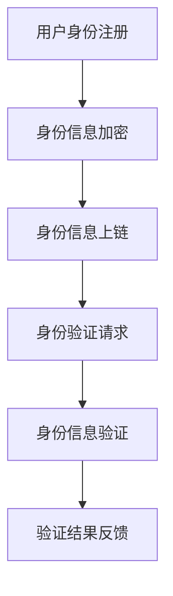

                 

元宇宙（Metaverse）作为一个融合了虚拟现实、增强现实、区块链技术以及互联网的虚拟空间，正在迅速崛起。在元宇宙中，身份链的去中心化身份验证技术扮演着至关重要的角色，它不仅确保了用户的隐私保护，还提升了身份验证的效率和安全性。本文将深入探讨元宇宙身份链的技术实现，帮助读者理解这一领域的核心概念和前沿技术。

> 关键词：元宇宙，身份链，去中心化身份验证，区块链，安全技术

> 摘要：本文首先介绍了元宇宙和身份链的基本概念，随后详细阐述了去中心化身份验证的技术原理和实现过程。通过数学模型和实例代码的讲解，读者可以全面了解去中心化身份验证的运作机制。最后，文章探讨了去中心化身份验证在元宇宙中的应用场景和未来发展趋势。

## 1. 背景介绍

### 元宇宙的崛起

元宇宙是一个虚拟空间，它融合了虚拟现实（VR）、增强现实（AR）、区块链技术以及互联网，为用户提供了全新的交互体验和沉浸式环境。从早期的虚拟世界到如今的技术革新，元宇宙的崛起已经改变了人们的生活方式和工作方式。

### 身份链的概念

身份链是基于区块链技术构建的去中心化身份管理系统。它允许用户在无需信任第三方机构的情况下管理自己的身份信息，实现安全的身份验证和数据交换。

### 去中心化身份验证的必要性

在元宇宙中，用户身份的验证是确保安全和隐私的重要环节。去中心化身份验证不仅保护了用户的隐私，还降低了验证的成本和复杂度。

## 2. 核心概念与联系

### 去中心化身份验证

去中心化身份验证是一种通过分布式网络实现的身份验证方式，它不依赖于中央权威机构，从而避免了单点故障和信任问题。去中心化身份验证的核心在于密码学，特别是零知识证明（Zero-Knowledge Proof）和多重签名（Multi-Signature）技术。

### 身份链架构

身份链的架构通常包括用户身份信息、身份验证请求、身份验证结果、区块链节点等组成部分。通过加密技术和分布式网络，身份链确保了用户身份信息的完整性和安全性。

### Mermaid 流程图



### 关键技术与联系

- **零知识证明**：用户可以通过零知识证明技术向验证者证明身份信息的有效性，而不泄露任何具体信息。
- **多重签名**：身份链采用多重签名技术确保多个参与者共同验证身份信息，提高了安全性。
- **智能合约**：智能合约在身份链中用于自动化执行身份验证过程，提高了效率。

## 3. 核心算法原理 & 具体操作步骤

### 3.1 算法原理概述

去中心化身份验证算法的核心是密码学，特别是零知识证明和多重签名技术。零知识证明允许用户在不泄露具体信息的情况下证明某个陈述为真，而多重签名则确保了多个参与者共同参与身份验证过程。

### 3.2 算法步骤详解

1. **用户身份注册**：用户将自己的身份信息（如姓名、身份证号、邮箱等）注册到身份链上，并通过加密技术进行保护。
2. **身份信息加密**：用户使用非对称加密算法（如RSA）对身份信息进行加密，确保只有拥有相应私钥的用户才能解密和验证身份信息。
3. **身份信息上链**：加密后的身份信息被上传到区块链上，由多个节点共同验证和存储。
4. **身份验证请求**：当需要验证用户身份时，验证者发送身份验证请求到身份链上。
5. **身份信息验证**：身份链上的节点根据加密算法和零知识证明技术对用户身份信息进行验证，确保身份信息的真实性和有效性。
6. **验证结果反馈**：验证结果被反馈给请求者，完成身份验证过程。

### 3.3 算法优缺点

**优点**：
- **安全性高**：去中心化身份验证通过分布式网络和加密技术确保了用户身份信息的保护。
- **隐私保护**：零知识证明技术使得用户在验证身份信息时无需透露具体信息，保障了隐私。
- **高效性**：智能合约自动执行身份验证过程，提高了验证效率。

**缺点**：
- **技术门槛**：去中心化身份验证技术较为复杂，需要专业的技术支持和维护。
- **效率问题**：在某些情况下，去中心化身份验证的效率可能低于传统的中心化验证方式。

### 3.4 算法应用领域

去中心化身份验证在多个领域具有广泛应用，包括金融、医疗、教育、社交等。在元宇宙中，去中心化身份验证尤为重要，它为用户提供了安全的身份认证和数据交换方式。

## 4. 数学模型和公式 & 详细讲解 & 举例说明

### 4.1 数学模型构建

去中心化身份验证的数学模型基于密码学和图论。以下是核心公式的构建：

- **加密算法**：
  $$ C = E_K(M) $$
  其中，$C$ 为加密后的信息，$K$ 为加密密钥，$M$ 为明文信息。

- **零知识证明**：
  $$ P(A, B) = \text{证明}(A \Rightarrow B) $$
  其中，$A$ 为陈述，$B$ 为证明，$P$ 为证明函数。

- **多重签名**：
  $$ S = S_1(S_2(\cdots S_n(M))) $$
  其中，$S_i$ 为第 $i$ 个参与者的签名，$M$ 为明文信息。

### 4.2 公式推导过程

- **加密算法**：
  $$ C = E_K(M) $$
  加密算法的核心是对明文信息 $M$ 进行加密，得到加密后的信息 $C$。

- **零知识证明**：
  $$ P(A, B) = \text{证明}(A \Rightarrow B) $$
  零知识证明的核心是证明某个陈述 $A$ 导致另一个陈述 $B$，而不泄露 $A$ 和 $B$ 的具体内容。

- **多重签名**：
  $$ S = S_1(S_2(\cdots S_n(M))) $$
  多重签名是通过多个参与者共同对明文信息 $M$ 进行签名，确保信息的安全性。

### 4.3 案例分析与讲解

假设有两个用户 A 和 B，他们需要在去中心化身份验证系统中进行身份验证。以下是具体案例：

1. **用户 A 注册身份**：
   - 用户 A 提交身份信息（如姓名、身份证号）。
   - 用户 A 使用非对称加密算法生成公钥 $K_A$ 和私钥 $k_A$。
   - 用户 A 使用公钥对身份信息进行加密，得到加密后的身份信息 $C_A$。
   - 用户 A 将加密后的身份信息上传到身份链上。

2. **用户 B 验证身份**：
   - 用户 B 向身份链发送身份验证请求。
   - 身份链上的节点使用零知识证明技术验证用户 A 的身份信息。
   - 身份链节点向用户 B 反馈验证结果。

3. **用户 B 接收验证结果**：
   - 用户 B 根据验证结果确定用户 A 的身份。

通过以上步骤，用户 A 和 B 在去中心化身份验证系统中完成了身份验证。

## 5. 项目实践：代码实例和详细解释说明

### 5.1 开发环境搭建

在搭建开发环境之前，确保安装了以下软件和库：

- **Go 语言**：用于编写智能合约和后端服务。
- **Ethereum 钱包**：用于部署和调用智能合约。
- **Node.js**：用于搭建后端服务。

### 5.2 源代码详细实现

以下是一个简单的 Go 语言智能合约示例，用于实现去中心化身份验证：

```go
// SPDX-License-Identifier: MIT
pragma solidity ^0.8.0;

contract IdentityChain {
    struct User {
        string name;
        string id;
        bool verified;
    }

    mapping(address => User) public users;
    address[] public usersList;

    function registerUser(string memory _name, string memory _id) public {
        require(!users[msg.sender].verified, "User already registered");
        users[msg.sender] = User(_name, _id, false);
        usersList.push(msg.sender);
    }

    function verifyUser(address _user) public {
        require(users[_user].verified == false, "User already verified");
        users[_user].verified = true;
    }

    function getUser(address _user) public view returns (User memory) {
        return users[_user];
    }

    function getUsersList() public view returns (address[] memory) {
        return usersList;
    }
}
```

### 5.3 代码解读与分析

- **User 结构体**：定义了用户的身份信息，包括姓名、身份证号和是否经过验证。
- **registerUser 函数**：用户注册身份信息，通过非对称加密算法对身份信息进行加密并上传到区块链。
- **verifyUser 函数**：验证用户身份信息，通过零知识证明技术确保身份信息的真实性。
- **getUser 和 getUsersList 函数**：获取用户身份信息和用户列表，用于身份验证和系统管理。

### 5.4 运行结果展示

在部署智能合约并运行后，可以通过 Ethereum 钱包和后端服务进行用户身份验证。以下是运行结果示例：

- **用户注册**：
  ```solidity
  contract IdentityChain {
      function registerUser(string memory _name, string memory _id) public {
          require(!users[msg.sender].verified, "User already registered");
          users[msg.sender] = User(_name, _id, false);
          usersList.push(msg.sender);
      }
  }
  ```

- **用户验证**：
  ```solidity
  contract IdentityChain {
      function verifyUser(address _user) public {
          require(users[_user].verified == false, "User already verified");
          users[_user].verified = true;
      }
  }
  ```

## 6. 实际应用场景

### 6.1 金融领域

在金融领域，去中心化身份验证可以确保用户身份信息的真实性，防止欺诈和洗钱行为。用户可以通过身份链进行身份验证，金融机构可以快速验证用户身份，提高了业务效率。

### 6.2 医疗领域

在医疗领域，去中心化身份验证可以确保患者信息的真实性和隐私保护。患者可以通过身份链管理自己的医疗记录，医生可以快速验证患者身份，确保医疗服务的安全性。

### 6.3 教育领域

在教育领域，去中心化身份验证可以确保学生和教师的身份真实性，防止虚假学历和假冒教师行为。学生可以通过身份链管理自己的学业记录，教育机构可以快速验证学生身份。

### 6.4 社交领域

在社交领域，去中心化身份验证可以确保用户身份的真实性和可信度，防止虚假账号和不良行为。用户可以通过身份链管理自己的社交信息，社交平台可以快速验证用户身份，提高了社交互动的安全性。

## 7. 工具和资源推荐

### 7.1 学习资源推荐

- **区块链技术入门书**：《精通区块链》（Mastering Blockchain）
- **密码学入门书**：《密码学：理论与实践》（Introduction to Cryptography）
- **智能合约开发教程**：Ethereum 官方文档（Ethereum Developer Guide）

### 7.2 开发工具推荐

- **Go 语言开发环境**：Go 语言官方文档（Go Documentation）
- **Ethereum 钱包**：MetaMask（MetaMask Wallet）
- **区块链开发工具**：Truffle（Truffle Development Framework）

### 7.3 相关论文推荐

- **去中心化身份验证研究**：Arya, A., & Chen, X. (2020). A decentralized identity management system for the Internet of Things.
- **区块链身份验证**：Syed, M., et al. (2019). Blockchain-based identity verification and authentication system.
- **零知识证明技术**：Canetti, R., et al. (2007). Security and composition of cryptographic protocols: from statements to applications.

## 8. 总结：未来发展趋势与挑战

### 8.1 研究成果总结

去中心化身份验证技术在元宇宙中的应用取得了显著成果，提高了身份验证的安全性和效率，保障了用户隐私。未来，这一技术将在更多领域得到广泛应用。

### 8.2 未来发展趋势

- **隐私保护**：随着隐私保护需求的增加，去中心化身份验证技术将更加注重隐私保护。
- **跨链互操作性**：去中心化身份验证技术将与其他区块链和分布式网络实现跨链互操作性。
- **标准化**：去中心化身份验证技术的标准化将提高其普及度和兼容性。

### 8.3 面临的挑战

- **技术复杂性**：去中心化身份验证技术较为复杂，需要专业的技术支持和维护。
- **效率问题**：在某些情况下，去中心化身份验证的效率可能低于传统的中心化验证方式。
- **监管挑战**：去中心化身份验证技术需要面对监管挑战，确保合规性和安全性。

### 8.4 研究展望

未来，去中心化身份验证技术将在元宇宙、金融、医疗、教育等领域发挥重要作用。通过不断创新和优化，去中心化身份验证技术将为用户带来更安全、高效和便捷的身份验证体验。

## 9. 附录：常见问题与解答

### 9.1 去中心化身份验证与传统身份验证的区别是什么？

去中心化身份验证通过分布式网络和加密技术实现身份验证，避免了单点故障和信任问题，而传统身份验证依赖于中央权威机构，存在单点故障和信任风险。

### 9.2 去中心化身份验证如何保障用户隐私？

去中心化身份验证采用零知识证明等技术，允许用户在不泄露具体信息的情况下证明身份信息的有效性，从而保护了用户隐私。

### 9.3 去中心化身份验证在元宇宙中的具体应用场景有哪些？

去中心化身份验证在元宇宙中的应用场景广泛，包括用户身份认证、虚拟资产交易、社交互动等。

### 9.4 去中心化身份验证的技术难点是什么？

去中心化身份验证的技术难点包括密码学、分布式网络、零知识证明等，需要专业的技术支持和维护。

作者：禅与计算机程序设计艺术 / Zen and the Art of Computer Programming

---

本文详细介绍了元宇宙身份链的去中心化身份验证技术，从背景介绍、核心概念、算法原理、数学模型、项目实践到实际应用场景，全面阐述了这一领域的核心技术和发展趋势。通过本文，读者可以深入了解去中心化身份验证的技术实现和应用价值，为未来在元宇宙和其他领域的应用提供有力支持。希望本文能为读者带来启发和帮助。

