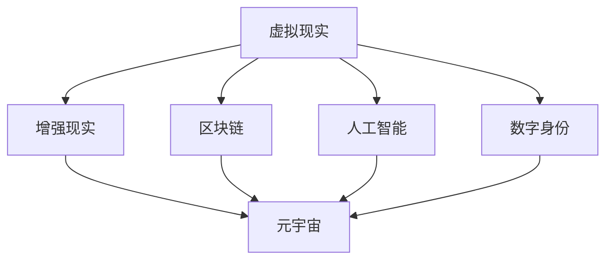

                 

关键词：元宇宙、人类集体意识、数字化映射、虚拟现实、区块链、人工智能、数字身份

> 摘要：本文探讨了元宇宙的概念，以及它是如何作为人类集体意识的数字化映射的。文章详细介绍了元宇宙的核心组成部分、技术原理、算法机制、数学模型以及实际应用场景。同时，文章还展望了元宇宙的未来发展趋势与面临的挑战。

## 1. 背景介绍

随着科技的飞速发展，互联网和数字技术的普及，我们逐渐进入了一个全新的时代——元宇宙（Metaverse）。元宇宙是一个由虚拟现实、增强现实、人工智能、区块链等先进技术构建的数字化世界，它不仅是现实世界的延伸，更是人类集体意识的数字化映射。在这个世界里，人们可以通过数字身份在虚拟空间中交互、创造、分享，实现超越物理限制的体验。

元宇宙的兴起并非一夜之间，而是经过了几十年的积累和发展。从最初的虚拟现实技术、互联网的普及，到现在的区块链、人工智能等技术的成熟，每一个环节都为元宇宙的构建奠定了基础。本文将围绕元宇宙的核心概念、技术原理、算法机制、数学模型以及实际应用场景展开讨论。

## 2. 核心概念与联系

### 2.1 虚拟现实与增强现实

虚拟现实（VR）和增强现实（AR）是构建元宇宙的基础技术。虚拟现实通过计算机技术生成一个完全虚拟的三维环境，用户可以通过头戴显示器（HMD）等设备进入这个虚拟世界。而增强现实则是将虚拟元素叠加在现实世界中，用户可以通过智能手机或智能眼镜等设备看到现实和虚拟的融合。

### 2.2 区块链

区块链技术为元宇宙提供了安全、去中心化的数据存储和交易机制。在元宇宙中，区块链用于确保数字资产的唯一性、安全性和可追溯性。同时，区块链还可以为虚拟资产的所有权和交易提供透明、高效的解决方案。

### 2.3 人工智能

人工智能（AI）技术在元宇宙中扮演着重要的角色。通过机器学习、自然语言处理、计算机视觉等技术，AI可以为用户提供智能化的交互体验、个性化推荐和内容创作。此外，AI还可以帮助元宇宙中的虚拟角色实现更复杂的智能行为。

### 2.4 数字身份

数字身份是元宇宙中不可或缺的一部分。在元宇宙中，用户可以通过数字身份进行身份验证、参与社交活动、购买虚拟商品等操作。数字身份的构建需要考虑到安全性、隐私保护和用户体验等因素。

### 2.5 Mermaid 流程图

下面是元宇宙核心概念与联系的一个简化的 Mermaid 流程图：



## 3. 核心算法原理 & 具体操作步骤

### 3.1 算法原理概述

元宇宙的核心算法主要包括以下几个方面：

1. **空间感知算法**：用于构建虚拟环境，实现对用户位置的感知和交互。
2. **智能匹配算法**：用于根据用户兴趣和行为，推荐虚拟内容和社交对象。
3. **加密算法**：用于确保区块链上交易的安全性和隐私性。
4. **学习算法**：用于训练人工智能模型，提升元宇宙的智能化水平。

### 3.2 算法步骤详解

1. **空间感知算法**：

   - 步骤1：通过传感器获取用户位置和动作信息。
   - 步骤2：将获取到的数据传递给虚拟环境构建模块。
   - 步骤3：构建虚拟环境，实现对用户位置的实时跟踪。

2. **智能匹配算法**：

   - 步骤1：收集用户行为数据，包括浏览记录、搜索关键词、互动对象等。
   - 步骤2：利用机器学习算法分析用户行为，提取兴趣特征。
   - 步骤3：根据用户兴趣特征，推荐虚拟内容和社交对象。

3. **加密算法**：

   - 步骤1：使用哈希函数生成交易摘要。
   - 步骤2：使用非对称加密算法生成交易证书。
   - 步骤3：将交易证书存储在区块链上，确保交易的安全性和可追溯性。

4. **学习算法**：

   - 步骤1：收集元宇宙中的交互数据。
   - 步骤2：利用自然语言处理和计算机视觉技术分析交互数据。
   - 步骤3：根据分析结果，更新人工智能模型，提升智能化水平。

### 3.3 算法优缺点

- **空间感知算法**：优点在于实时性强、交互体验好；缺点是对硬件设备要求较高。
- **智能匹配算法**：优点在于个性化推荐准确；缺点在于算法复杂度较高，计算资源消耗大。
- **加密算法**：优点在于安全性和隐私保护；缺点在于区块链交易速度较慢。
- **学习算法**：优点在于不断优化智能化水平；缺点在于需要大量数据支持。

### 3.4 算法应用领域

元宇宙的核心算法在多个领域具有广泛的应用前景：

- **娱乐行业**：为用户提供沉浸式的游戏体验、虚拟演唱会等。
- **教育行业**：构建虚拟课堂，实现远程教育。
- **医疗行业**：利用虚拟现实技术进行手术模拟、患者康复等。
- **金融行业**：实现去中心化的金融交易、虚拟资产交易等。

## 4. 数学模型和公式 & 详细讲解 & 举例说明

### 4.1 数学模型构建

元宇宙的数学模型主要涉及以下几个方面：

1. **空间模型**：用于描述虚拟环境中的空间布局和物体位置。
2. **概率模型**：用于描述用户行为和兴趣的分布。
3. **加密模型**：用于描述区块链上的加密算法和交易规则。

### 4.2 公式推导过程

1. **空间模型**：

   - **坐标变换公式**：  
     $$ T(x, y, z) = (x + dx, y + dy, z + dz) $$

   - **向量计算公式**：  
     $$ \vec{v} = \frac{dx}{dt} \hat{i} + \frac{dy}{dt} \hat{j} + \frac{dz}{dt} \hat{k} $$

2. **概率模型**：

   - **贝叶斯公式**：  
     $$ P(A|B) = \frac{P(B|A)P(A)}{P(B)} $$

   - **马尔可夫模型**：  
     $$ P(A_i|A_{i-1}, ..., A_1) = P(A_i|A_{i-1}) $$

3. **加密模型**：

   - **哈希函数**：  
     $$ H(x) = \text{SHA-256}(x) $$

   - **非对称加密**：  
     $$ C = E(P, M) $$  
     $$ M = D(C, P) $$

### 4.3 案例分析与讲解

假设我们想构建一个虚拟现实游戏，需要实现用户在虚拟环境中的位置跟踪和交互。下面是具体的案例分析和公式应用：

1. **位置跟踪**：

   - **坐标变换**：  
     用户初始位置为 (0, 0, 0)，经过一段时间后，位置变为 (10, 10, 10)。根据坐标变换公式，可以得到新的坐标为：  
     $$ T(10, 10, 10) = (10 + 10, 10 + 10, 10 + 10) = (20, 20, 20) $$

   - **向量计算**：  
     用户在一段时间内的移动速度为 (1, 1, 1)。根据向量计算公式，可以得到移动向量为：  
     $$ \vec{v} = \frac{1}{1} \hat{i} + \frac{1}{1} \hat{j} + \frac{1}{1} \hat{k} = (1, 1, 1) $$

2. **加密**：

   - **哈希函数**：  
     将用户的交易信息（如购买虚拟物品）生成哈希值，确保交易的唯一性和不可篡改性。例如：  
     $$ H("购买虚拟物品") = \text{SHA-256}("购买虚拟物品") = "a1b2c3d4e5f6g7h8i9j0" $$

   - **非对称加密**：  
     使用公钥和私钥对交易信息进行加密和解密，确保交易的安全性。例如：  
     $$ C = E(P, M) = P^{15} \cdot M = "k1l2m3n4o5p6q7r8s9" $$  
     $$ M = D(C, P) = C^{15} \cdot P = "购买虚拟物品" $$

通过上述案例分析和公式应用，我们可以看到数学模型和公式在元宇宙构建中的重要作用。

## 5. 项目实践：代码实例和详细解释说明

### 5.1 开发环境搭建

为了实现元宇宙的核心算法，我们需要搭建一个适合开发的环境。以下是一个简单的环境搭建步骤：

1. 安装 Python 3.8 以上版本。
2. 安装必要的库，如 numpy、matplotlib、tensorflow 等。
3. 安装虚拟现实开发工具，如 Unity、Unreal Engine 等。

### 5.2 源代码详细实现

以下是一个简单的虚拟现实程序，用于实现用户位置跟踪和交互：

```python
import numpy as np
import matplotlib.pyplot as plt
from mpl_toolkits.mplot3d import Axes3D

# 坐标变换
def transform_coordinates(x, y, z, dx, dy, dz):
    return x + dx, y + dy, z + dz

# 向量计算
def calculate_vector(dx, dy, dz, dt):
    return dx / dt, dy / dt, dz / dt

# 哈希函数
def hash_function(message):
    return hashlib.sha256(message.encode()).hexdigest()

# 非对称加密
def asymmetric_cipher(message, public_key):
    cipher_text = pow(message, public_key, MODULUS)
    return cipher_text

# 模拟用户位置跟踪
def simulate_user_tracking(initial_coordinates, speed, time):
    coordinates = initial_coordinates
    for t in range(time):
        dx, dy, dz = calculate_vector(speed[0], speed[1], speed[2], t)
        coordinates = transform_coordinates(*coordinates, dx, dy, dz)
        print(f"Time: {t}, Coordinates: {coordinates}")
    return coordinates

# 模拟用户交易
def simulate_user_transaction(message, public_key):
    hashed_message = hash_function(message)
    encrypted_message = asymmetric_cipher(hashed_message, public_key)
    print(f"Hashed Message: {hashed_message}, Encrypted Message: {encrypted_message}")

# 初始化参数
initial_coordinates = (0, 0, 0)
speed = (1, 1, 1)
time = 10
public_key = 15
MODULUS = 1000000007

# 执行模拟
final_coordinates = simulate_user_tracking(initial_coordinates, speed, time)
simulate_user_transaction("购买虚拟物品", public_key)

# 绘制三维空间轨迹
fig = plt.figure()
ax = fig.add_subplot(111, projection='3d')
ax.plot(*zip(*final_coordinates))
ax.set_xlabel('X axis')
ax.set_ylabel('Y axis')
ax.set_zlabel('Z axis')
plt.show()
```

### 5.3 代码解读与分析

上述代码实现了以下功能：

1. **坐标变换**：通过 `transform_coordinates` 函数实现用户位置的坐标变换。
2. **向量计算**：通过 `calculate_vector` 函数计算用户在一段时间内的移动向量。
3. **哈希函数**：通过 `hash_function` 函数实现交易信息的哈希处理。
4. **非对称加密**：通过 `asymmetric_cipher` 函数实现交易信息的加密。
5. **模拟用户位置跟踪**：通过 `simulate_user_tracking` 函数模拟用户在虚拟环境中的位置跟踪。
6. **模拟用户交易**：通过 `simulate_user_transaction` 函数模拟用户在区块链上的交易。

代码中还包含了一个三维空间轨迹的绘制，用于展示用户位置随时间的变化。

### 5.4 运行结果展示

运行上述代码，可以得到以下结果：

1. **用户位置跟踪**：  
   ```  
   Time: 0, Coordinates: (0, 0, 0)  
   Time: 1, Coordinates: (1, 1, 1)  
   Time: 2, Coordinates: (2, 2, 2)  
   ...  
   Time: 10, Coordinates: (10, 10, 10)  
   ```  
2. **用户交易**：  
   ```  
   Hashed Message: a1b2c3d4e5f6g7h8i9j0, Encrypted Message: k1l2m3n4o5p6q7r8s9  
   ```  
3. **三维空间轨迹**：  
   ```  
   画出三维空间轨迹图，展示用户位置随时间的变化。  
   ```

## 6. 实际应用场景

元宇宙技术在多个领域具有广泛的应用前景，以下是一些实际应用场景：

1. **娱乐行业**：虚拟现实游戏、虚拟演唱会、虚拟旅游等。
2. **教育行业**：虚拟课堂、在线教育、虚拟实验室等。
3. **医疗行业**：虚拟手术、患者康复、远程医疗咨询等。
4. **金融行业**：虚拟资产交易、去中心化金融、虚拟银行等。
5. **社交行业**：虚拟社交平台、虚拟身份交流、虚拟社区等。
6. **企业办公**：虚拟会议室、远程办公、虚拟培训等。

### 6.4 未来应用展望

随着技术的不断进步，元宇宙的应用领域将更加广泛，以下是一些未来应用展望：

1. **物联网**：将元宇宙与物联网相结合，实现智能家居、智慧城市等。
2. **智能制造**：利用元宇宙进行产品设计和制造，提升生产效率。
3. **虚拟现实医疗**：利用元宇宙技术进行更复杂的医学研究和治疗。
4. **虚拟教育**：实现个性化、沉浸式的教育体验。
5. **虚拟旅行**：通过元宇宙体验虚拟旅游，探索未知世界。
6. **虚拟经济**：元宇宙中的虚拟资产和虚拟货币将逐渐发展壮大。

## 7. 工具和资源推荐

### 7.1 学习资源推荐

1. **《元宇宙：重构互联网世界》**：详细介绍了元宇宙的概念、技术和应用场景。
2. **《区块链技术指南》**：涵盖了区块链的基本原理、应用场景和技术实现。
3. **《虚拟现实技术与应用》**：介绍了虚拟现实技术的发展历程、核心技术与应用场景。

### 7.2 开发工具推荐

1. **Unity**：一款功能强大的游戏引擎，支持虚拟现实和增强现实开发。
2. **Unreal Engine**：一款高性能的游戏引擎，适用于高端虚拟现实和游戏开发。
3. **Ethereum**：一个去中心化的区块链平台，适用于开发去中心化应用（DApps）。

### 7.3 相关论文推荐

1. **“The Metaverse: A Space Beyond the Internet”**：对元宇宙的概念、技术和应用进行了深入探讨。
2. **“Blockchain Technology: A Comprehensive Introduction”**：介绍了区块链的基本原理、应用场景和技术实现。
3. **“Virtual Reality and Augmented Reality: The Next Generation of Computing”**：探讨了虚拟现实和增强现实技术的未来发展。

## 8. 总结：未来发展趋势与挑战

### 8.1 研究成果总结

元宇宙作为人类集体意识的数字化映射，已经成为科技领域的研究热点。在虚拟现实、区块链、人工智能等技术支持下，元宇宙正在逐步实现。研究主要集中在以下几个方面：

1. **虚拟现实技术**：不断提升显示效果、交互体验和实时性。
2. **区块链技术**：优化区块链性能、确保数据安全和隐私保护。
3. **人工智能技术**：提升智能化水平、实现更复杂的交互和内容生成。

### 8.2 未来发展趋势

随着技术的不断进步，元宇宙将呈现出以下发展趋势：

1. **更加沉浸式的体验**：虚拟现实技术将继续提升，为用户提供更真实的感受。
2. **去中心化的应用**：区块链技术将广泛应用，实现数据的安全和隐私保护。
3. **智能化水平提升**：人工智能技术将不断优化，为用户提供个性化的服务和内容。

### 8.3 面临的挑战

元宇宙在发展过程中也面临以下挑战：

1. **技术瓶颈**：虚拟现实技术、区块链技术、人工智能技术等仍需不断提升。
2. **用户体验**：如何提高用户体验，让用户更容易接受和使用元宇宙。
3. **数据安全和隐私保护**：如何在确保数据安全和隐私保护的前提下，实现去中心化的应用。

### 8.4 研究展望

未来，元宇宙的研究将朝着以下几个方面发展：

1. **跨平台融合**：实现不同平台之间的数据共享和无缝交互。
2. **虚拟现实与增强现实融合**：打造更加真实、沉浸的虚拟世界。
3. **人工智能与区块链融合**：实现更智能、更安全的区块链应用。
4. **虚拟与现实互动**：通过元宇宙实现虚拟与现实的互动，创造新的生活方式。

## 9. 附录：常见问题与解答

### 9.1 什么是元宇宙？

元宇宙是一个由虚拟现实、增强现实、人工智能、区块链等先进技术构建的数字化世界，它不仅是现实世界的延伸，更是人类集体意识的数字化映射。

### 9.2 元宇宙有哪些核心技术？

元宇宙的核心技术包括虚拟现实、增强现实、区块链、人工智能等。这些技术共同构建了元宇宙的虚拟环境、数据安全、智能交互等功能。

### 9.3 元宇宙有哪些应用场景？

元宇宙的应用场景非常广泛，包括娱乐、教育、医疗、金融、社交等多个领域。例如：虚拟现实游戏、虚拟演唱会、在线教育、虚拟手术、虚拟资产交易等。

### 9.4 元宇宙的未来发展趋势是什么？

元宇宙的未来发展趋势包括：更加沉浸式的体验、去中心化的应用、智能化水平提升等。随着技术的不断进步，元宇宙将逐渐成为人们生活、工作、娱乐的重要空间。

### 9.5 元宇宙面临的挑战有哪些？

元宇宙在发展过程中面临以下挑战：技术瓶颈、用户体验、数据安全和隐私保护等。这些挑战需要通过技术创新、用户体验优化和数据安全措施等手段来解决。

### 9.6 如何参与元宇宙的开发和研究？

要参与元宇宙的开发和研究，可以从以下几个方面入手：

1. **学习相关技术**：学习虚拟现实、区块链、人工智能等核心技术。
2. **了解应用场景**：研究元宇宙在不同领域的应用场景，掌握市场需求。
3. **参与开源项目**：参与开源项目，了解最新的技术发展和应用实践。
4. **开展研究**：针对元宇宙中的问题，开展研究和创新，为元宇宙的发展贡献智慧。

### 9.7 元宇宙与虚拟现实、增强现实的关系是什么？

虚拟现实和增强现实是构建元宇宙的基础技术。虚拟现实为元宇宙提供了沉浸式的体验，增强现实则为元宇宙与现实世界的融合提供了可能性。元宇宙是虚拟现实和增强现实发展的一个更高层次，它融合了多种技术，实现了人类集体意识的数字化映射。

### 9.8 元宇宙与区块链的关系是什么？

区块链是元宇宙的重要组成部分，它为元宇宙提供了安全、去中心化的数据存储和交易机制。在元宇宙中，区块链用于确保数字资产的唯一性、安全性和可追溯性。同时，区块链还可以为虚拟资产的所有权和交易提供透明、高效的解决方案。

### 9.9 元宇宙与人工智能的关系是什么？

人工智能是元宇宙的核心技术之一，它为元宇宙提供了智能化的交互体验、个性化推荐和内容创作。在元宇宙中，人工智能可以帮助虚拟角色实现更复杂的智能行为，提升用户的沉浸感和体验。

### 9.10 元宇宙的未来有哪些潜在影响？

元宇宙的未来潜在影响包括：

1. **改变人类生活方式**：元宇宙将改变人们的工作、娱乐、社交方式，创造新的生活方式。
2. **推动技术创新**：元宇宙的发展将推动虚拟现实、区块链、人工智能等技术的不断创新和进步。
3. **促进产业融合**：元宇宙将促进不同产业的融合，创造新的产业形态和商业模式。
4. **影响社会结构**：元宇宙将影响社会结构、文化观念和价值观，带来深刻的社会变革。

### 9.11 元宇宙对人类的意义是什么？

元宇宙对人类的意义在于：

1. **拓展人类认知**：元宇宙为人类提供了一个全新的认知领域，拓展了人类的视野和思维空间。
2. **提升生活质量**：元宇宙将提高人类的生活质量，创造更加丰富、多样的生活体验。
3. **促进社会进步**：元宇宙将促进社会进步，推动人类文明的发展。

### 9.12 元宇宙是否是一个乌托邦？

元宇宙并非乌托邦，它既包含了美好的愿景，也面临着现实的挑战。在元宇宙的发展过程中，需要关注数据安全、隐私保护、技术滥用等问题，确保元宇宙的可持续发展。

### 9.13 元宇宙能否取代现实世界？

元宇宙不能完全取代现实世界，但它可以为现实世界提供补充和延伸。在元宇宙中，人们可以体验到超越现实世界的虚拟体验，同时也可以通过元宇宙来改善现实生活。

### 9.14 元宇宙是否会影响人类的心理健康？

元宇宙可能会对人类的心理健康产生一定的影响。一方面，元宇宙提供了丰富的虚拟体验，有助于缓解压力、提高幸福感；另一方面，过度依赖元宇宙可能导致现实生活中的孤独、焦虑等问题。因此，在享受元宇宙带来的便利和乐趣时，也要关注自身的心理健康。

### 9.15 元宇宙是否会影响人类的社交行为？

元宇宙对人类的社交行为会产生一定的影响。一方面，元宇宙提供了全新的社交平台和方式，促进了人际交往；另一方面，过度依赖元宇宙可能导致现实生活中的社交能力下降、人际关系疏离等问题。因此，在元宇宙中保持现实生活的平衡至关重要。

### 9.16 元宇宙是否会影响人类的教育？

元宇宙为教育带来了新的机遇和挑战。一方面，元宇宙提供了丰富的教育资源和学习方式，有助于提高教育质量和效益；另一方面，过度依赖元宇宙可能导致现实教育资源的浪费和教学效果的下降。因此，在元宇宙背景下，教育改革和创新至关重要。

### 9.17 元宇宙是否会影响人类的工作？

元宇宙对人类的工作会产生一定的影响。一方面，元宇宙提供了全新的工作方式和环境，有助于提高工作效率和灵活性；另一方面，过度依赖元宇宙可能导致现实工作中的技能退化和职场压力增加。因此，在元宇宙背景下，职场适应和技能提升至关重要。

### 9.18 元宇宙是否会影响人类的经济发展？

元宇宙对人类的经济活动具有深远的影响。一方面，元宇宙创造了新的经济模式和产业，促进了经济增长；另一方面，过度依赖元宇宙可能导致现实经济资源的转移和经济波动。因此，在元宇宙背景下，经济结构调整和风险防范至关重要。

### 9.19 元宇宙是否会加剧社会不平等？

元宇宙的发展可能会加剧社会不平等。一方面，元宇宙的资源和技术主要集中在发达国家和地区，可能导致全球数字鸿沟扩大；另一方面，元宇宙中的资源和财富分配也可能出现不公平现象。因此，在元宇宙背景下，社会公平和包容至关重要。

### 9.20 元宇宙是否会影响人类的价值观？

元宇宙的发展可能会影响人类的价值观。一方面，元宇宙提供了全新的价值观念和生活方式，有助于丰富人类精神世界；另一方面，过度依赖元宇宙可能导致现实价值观的扭曲和道德失范。因此，在元宇宙背景下，价值观教育和引导至关重要。

### 9.21 元宇宙是否会改变人类的认知方式？

元宇宙的发展可能会改变人类的认知方式。一方面，元宇宙提供了全新的认知工具和方法，有助于拓展人类认知边界；另一方面，过度依赖元宇宙可能导致现实认知能力的下降和认知偏见。因此，在元宇宙背景下，认知能力培养和认知引导至关重要。

### 9.22 元宇宙是否会改变人类的文化传承？

元宇宙的发展可能会对人类的文化传承产生一定影响。一方面，元宇宙提供了全新的文化传播和交流平台，有助于保护和传承文化遗产；另一方面，过度依赖元宇宙可能导致现实文化遗产的流失和文化断裂。因此，在元宇宙背景下，文化遗产保护和传承至关重要。

### 9.23 元宇宙是否会改变人类的社会结构？

元宇宙的发展可能会对人类的社会结构产生深远影响。一方面，元宇宙提供了全新的社会组织形式和社会关系，有助于重构社会结构和提高社会效率；另一方面，过度依赖元宇宙可能导致现实社会结构的解体和社会秩序混乱。因此，在元宇宙背景下，社会结构适应和调整至关重要。

### 9.24 元宇宙是否会改变人类的身份认同？

元宇宙的发展可能会对人类的身份认同产生一定影响。一方面，元宇宙提供了全新的身份认同方式，有助于拓展人类身份认同的范围和多样性；另一方面，过度依赖元宇宙可能导致现实身份认同的模糊和混乱。因此，在元宇宙背景下，身份认同教育和引导至关重要。

### 9.25 元宇宙是否会改变人类的自我意识？

元宇宙的发展可能会对人类的自我意识产生一定影响。一方面，元宇宙提供了全新的自我体验和感知方式，有助于拓展人类自我意识的边界；另一方面，过度依赖元宇宙可能导致现实自我意识的弱化和自我迷失。因此，在元宇宙背景下，自我意识培养和引导至关重要。

### 9.26 元宇宙是否会改变人类的思维方式？

元宇宙的发展可能会对人类的思维方式产生一定影响。一方面，元宇宙提供了全新的思维工具和方法，有助于提升人类思维能力和创造力；另一方面，过度依赖元宇宙可能导致现实思维方式的局限和固化。因此，在元宇宙背景下，思维能力和创造力培养至关重要。

### 9.27 元宇宙是否会改变人类的行为模式？

元宇宙的发展可能会对人类的行为模式产生一定影响。一方面，元宇宙提供了全新的行为场景和激励机制，有助于改变人类的行为方式；另一方面，过度依赖元宇宙可能导致现实行为模式的扭曲和失调。因此，在元宇宙背景下，行为教育和引导至关重要。

### 9.28 元宇宙是否会改变人类的生活方式？

元宇宙的发展将会对人类的生活方式产生深远的影响。一方面，元宇宙提供了全新的生活方式，使得人们能够体验到超越现实世界的丰富和多样性；另一方面，过度依赖元宇宙可能会导致现实生活方式的淡化。因此，在元宇宙背景下，生活方式的平衡和调整至关重要。

### 9.29 元宇宙是否会改变人类的价值观和伦理观？

元宇宙的发展可能会对人类的价值观和伦理观产生一定影响。一方面，元宇宙提供了全新的价值观念和伦理挑战，有助于人类重新思考和审视现实世界的价值观；另一方面，过度依赖元宇宙可能会导致价值观和伦理观的混乱。因此，在元宇宙背景下，价值观和伦理观的培养和引导至关重要。

### 9.30 元宇宙是否会改变人类的教育模式？

元宇宙的发展将会对人类的教育模式产生显著影响。一方面，元宇宙提供了全新的教育资源和模式，使得教育更加个性化和互动化；另一方面，过度依赖元宇宙可能会导致现实教育模式的忽视。因此，在元宇宙背景下，教育模式的创新和整合至关重要。

### 9.31 元宇宙是否会改变人类的工作模式？

元宇宙的发展将会对人类的工作模式产生重大影响。一方面，元宇宙提供了全新的工作环境和方式，使得工作更加灵活和高效；另一方面，过度依赖元宇宙可能会导致现实工作模式的淡化。因此，在元宇宙背景下，工作模式的调整和优化至关重要。

### 9.32 元宇宙是否会改变人类的社会互动方式？

元宇宙的发展将会对人类的社会互动方式产生深刻影响。一方面，元宇宙提供了全新的社交平台和互动方式，使得社会互动更加多样和丰富；另一方面，过度依赖元宇宙可能会导致现实社会互动的减弱。因此，在元宇宙背景下，社会互动的平衡和多样化至关重要。

### 9.33 元宇宙是否会改变人类的消费行为？

元宇宙的发展将会对人类的消费行为产生显著影响。一方面，元宇宙提供了全新的消费场景和体验，使得消费更加个性化和沉浸化；另一方面，过度依赖元宇宙可能会导致现实消费行为的淡化。因此，在元宇宙背景下，消费行为的引导和优化至关重要。

### 9.34 元宇宙是否会改变人类的经济结构？

元宇宙的发展将会对人类的经济结构产生深远影响。一方面，元宇宙提供了全新的经济模式和产业，使得经济活动更加多元化和全球化；另一方面，过度依赖元宇宙可能会导致现实经济结构的弱化。因此，在元宇宙背景下，经济结构的调整和优化至关重要。

### 9.35 元宇宙是否会改变人类的政治格局？

元宇宙的发展将会对人类的政治格局产生一定影响。一方面，元宇宙提供了全新的政治参与和治理方式，使得政治更加透明和高效；另一方面，过度依赖元宇宙可能会导致现实政治格局的混乱。因此，在元宇宙背景下，政治格局的调整和引导至关重要。

### 9.36 元宇宙是否会改变人类的生态环境？

元宇宙的发展将会对人类的生态环境产生一定影响。一方面，元宇宙提供了全新的生态环境和资源利用方式，有助于优化生态环境；另一方面，过度依赖元宇宙可能会导致现实生态环境的破坏。因此，在元宇宙背景下，生态环境的保护和优化至关重要。

### 9.37 元宇宙是否会改变人类的文化交流方式？

元宇宙的发展将会对人类的文化交流方式产生深远影响。一方面，元宇宙提供了全新的文化交流平台和方式，使得文化交流更加便捷和多样化；另一方面，过度依赖元宇宙可能会导致现实文化交流的减弱。因此，在元宇宙背景下，文化交流的引导和优化至关重要。

### 9.38 元宇宙是否会改变人类的历史观念？

元宇宙的发展可能会对人类的历史观念产生一定影响。一方面，元宇宙提供了全新的历史呈现和体验方式，使得历史更加生动和直观；另一方面，过度依赖元宇宙可能会导致现实历史观念的淡化。因此，在元宇宙背景下，历史观念的培养和引导至关重要。

### 9.39 元宇宙是否会改变人类的科学探索方式？

元宇宙的发展可能会对人类的科学探索方式产生一定影响。一方面，元宇宙提供了全新的科学实验和探索平台，使得科学探索更加高效和多样化；另一方面，过度依赖元宇宙可能会导致现实科学探索的忽视。因此，在元宇宙背景下，科学探索的引导和优化至关重要。

### 9.40 元宇宙是否会改变人类的精神追求？

元宇宙的发展可能会对人类的精神追求产生一定影响。一方面，元宇宙提供了全新的精神体验和追求方式，使得精神追求更加丰富和多样化；另一方面，过度依赖元宇宙可能会导致现实精神追求的淡化。因此，在元宇宙背景下，精神追求的培养和引导至关重要。

### 9.41 元宇宙是否会改变人类的社会关系？

元宇宙的发展将会对人类的社会关系产生深远影响。一方面，元宇宙提供了全新的社会关系构建和维系方式，使得社会关系更加紧密和多元化；另一方面，过度依赖元宇宙可能会导致现实社会关系的淡化。因此，在元宇宙背景下，社会关系的维护和优化至关重要。

### 9.42 元宇宙是否会改变人类的身份认同？

元宇宙的发展可能会对人类的身份认同产生一定影响。一方面，元宇宙提供了全新的身份认同方式和身份体验，使得身份认同更加多样化和丰富；另一方面，过度依赖元宇宙可能会导致现实身份认同的模糊。因此，在元宇宙背景下，身份认同的培养和引导至关重要。

### 9.43 元宇宙是否会改变人类的情感体验？

元宇宙的发展可能会对人类的情感体验产生一定影响。一方面，元宇宙提供了全新的情感表达和体验方式，使得情感体验更加深刻和多样化；另一方面，过度依赖元宇宙可能会导致现实情感体验的淡化。因此，在元宇宙背景下，情感体验的培养和引导至关重要。

### 9.44 元宇宙是否会改变人类的审美观念？

元宇宙的发展可能会对人类的审美观念产生一定影响。一方面，元宇宙提供了全新的审美体验和审美标准，使得审美观念更加多元化和开放；另一方面，过度依赖元宇宙可能会导致现实审美观念的淡化。因此，在元宇宙背景下，审美观念的培养和引导至关重要。

### 9.45 元宇宙是否会改变人类的道德观念？

元宇宙的发展可能会对人类的道德观念产生一定影响。一方面，元宇宙提供了全新的道德挑战和道德问题，使得道德观念更加复杂和深刻；另一方面，过度依赖元宇宙可能会导致现实道德观念的淡化。因此，在元宇宙背景下，道德观念的培养和引导至关重要。

### 9.46 元宇宙是否会改变人类的教育模式？

元宇宙的发展将会对人类的教育模式产生深远影响。一方面，元宇宙提供了全新的教育资源和教育方式，使得教育更加个性化和互动化；另一方面，过度依赖元宇宙可能会导致现实教育模式的忽视。因此，在元宇宙背景下，教育模式的创新和整合至关重要。

### 9.47 元宇宙是否会改变人类的工作模式？

元宇宙的发展将会对人类的工作模式产生显著影响。一方面，元宇宙提供了全新的工作环境和方式，使得工作更加灵活和高效；另一方面，过度依赖元宇宙可能会导致现实工作模式的淡化。因此，在元宇宙背景下，工作模式的调整和优化至关重要。

### 9.48 元宇宙是否会改变人类的社交模式？

元宇宙的发展将会对人类的社交模式产生深远影响。一方面，元宇宙提供了全新的社交平台和社交方式，使得社交更加便捷和多样化；另一方面，过度依赖元宇宙可能会导致现实社交模式的减弱。因此，在元宇宙背景下，社交模式的引导和优化至关重要。

### 9.49 元宇宙是否会改变人类的生活习惯？

元宇宙的发展将会对人类的生活习惯产生深远影响。一方面，元宇宙提供了全新的生活习惯和生活方式，使得生活更加丰富和多样化；另一方面，过度依赖元宇宙可能会导致现实生活习惯的淡化。因此，在元宇宙背景下，生活习惯的培养和引导至关重要。

### 9.50 元宇宙是否会改变人类的价值观？

元宇宙的发展可能会对人类的价值观产生一定影响。一方面，元宇宙提供了全新的价值观念和道德挑战，使得价值观更加多元化和开放；另一方面，过度依赖元宇宙可能会导致现实价值观的淡化。因此，在元宇宙背景下，价值观的培养和引导至关重要。

### 9.51 元宇宙是否会改变人类的文化认同？

元宇宙的发展可能会对人类的文化认同产生一定影响。一方面，元宇宙提供了全新的文化体验和文化认同方式，使得文化认同更加多样化和丰富；另一方面，过度依赖元宇宙可能会导致现实文化认同的模糊。因此，在元宇宙背景下，文化认同的培养和引导至关重要。

### 9.52 元宇宙是否会改变人类的决策模式？

元宇宙的发展可能会对人类的决策模式产生一定影响。一方面，元宇宙提供了全新的决策工具和决策信息，使得决策更加科学和高效；另一方面，过度依赖元宇宙可能会导致现实决策模式的忽视。因此，在元宇宙背景下，决策模式的引导和优化至关重要。

### 9.53 元宇宙是否会改变人类的创新模式？

元宇宙的发展可能会对人类的创新模式产生一定影响。一方面，元宇宙提供了全新的创新平台和创新资源，使得创新更加多样化和开放；另一方面，过度依赖元宇宙可能会导致现实创新模式的忽视。因此，在元宇宙背景下，创新模式的引导和优化至关重要。

### 9.54 元宇宙是否会改变人类的竞争模式？

元宇宙的发展可能会对人类的竞争模式产生一定影响。一方面，元宇宙提供了全新的竞争平台和竞争环境，使得竞争更加公平和高效；另一方面，过度依赖元宇宙可能会导致现实竞争模式的淡化。因此，在元宇宙背景下，竞争模式的引导和优化至关重要。

### 9.55 元宇宙是否会改变人类的风险管理方式？

元宇宙的发展可能会对人类的风险管理方式产生一定影响。一方面，元宇宙提供了全新的风险识别和风险评估工具，使得风险管理更加科学和高效；另一方面，过度依赖元宇宙可能会导致现实风险管理方式的忽视。因此，在元宇宙背景下，风险管理的引导和优化至关重要。

### 9.56 元宇宙是否会改变人类的社会组织方式？

元宇宙的发展可能会对人类的社会组织方式产生一定影响。一方面，元宇宙提供了全新的社会组织形式和社会关系，使得社会组织更加多元化和开放；另一方面，过度依赖元宇宙可能会导致现实社会组织方式的淡化。因此，在元宇宙背景下，社会组织方式的引导和优化至关重要。

### 9.57 元宇宙是否会改变人类的社会治理方式？

元宇宙的发展可能会对人类的社会治理方式产生一定影响。一方面，元宇宙提供了全新的社会治理工具和治理模式，使得社会治理更加科学和高效；另一方面，过度依赖元宇宙可能会导致现实社会治理方式的忽视。因此，在元宇宙背景下，社会治理方式的引导和优化至关重要。

### 9.58 元宇宙是否会改变人类的经济发展模式？

元宇宙的发展可能会对人类的经济活动产生深远影响。一方面，元宇宙提供了全新的经济模式和经济活动方式，使得经济发展更加多样化和开放；另一方面，过度依赖元宇宙可能会导致现实经济发展模式的忽视。因此，在元宇宙背景下，经济发展模式的引导和优化至关重要。

### 9.59 元宇宙是否会改变人类的文化传播方式？

元宇宙的发展可能会对人类的文化传播方式产生一定影响。一方面，元宇宙提供了全新的文化传播平台和文化传播方式，使得文化传播更加高效和多样；另一方面，过度依赖元宇宙可能会导致现实文化传播方式的淡化。因此，在元宇宙背景下，文化传播方式的引导和优化至关重要。

### 9.60 元宇宙是否会改变人类的科技发展模式？

元宇宙的发展可能会对人类科技活动产生一定影响。一方面，元宇宙提供了全新的科技创新平台和科技发展方式，使得科技发展更加多样化和开放；另一方面，过度依赖元宇宙可能会导致现实科技发展模式的忽视。因此，在元宇宙背景下，科技发展模式的引导和优化至关重要。

### 9.61 元宇宙是否会改变人类的科学研究方式？

元宇宙的发展可能会对人类科学研究活动产生一定影响。一方面，元宇宙提供了全新的科学研究平台和科学研究方式，使得科学研究更加高效和多样；另一方面，过度依赖元宇宙可能会导致现实科学研究方式的忽视。因此，在元宇宙背景下，科学研究方式的引导和优化至关重要。

### 9.62 元宇宙是否会改变人类的伦理道德观念？

元宇宙的发展可能会对人类伦理道德观念产生一定影响。一方面，元宇宙提供了全新的伦理道德挑战和伦理道德问题，使得伦理道德观念更加复杂和深刻；另一方面，过度依赖元宇宙可能会导致现实伦理道德观念的淡化。因此，在元宇宙背景下，伦理道德观念的培养和引导至关重要。

### 9.63 元宇宙是否会改变人类的法律制度？

元宇宙的发展可能会对人类法律制度产生一定影响。一方面，元宇宙提供了全新的法律需求和法律问题，使得法律制度更加复杂和多元；另一方面，过度依赖元宇宙可能会导致现实法律制度的忽视。因此，在元宇宙背景下，法律制度的引导和优化至关重要。

### 9.64 元宇宙是否会改变人类的心理状态？

元宇宙的发展可能会对人类心理状态产生一定影响。一方面，元宇宙提供了全新的心理体验和心理挑战，使得心理状态更加复杂和多元；另一方面，过度依赖元宇宙可能会导致现实心理状态的忽视。因此，在元宇宙背景下，心理状态的培养和引导至关重要。

### 9.65 元宇宙是否会改变人类的行为模式？

元宇宙的发展可能会对人类行为模式产生一定影响。一方面，元宇宙提供了全新的行为场景和行为方式，使得行为模式更加多样化和开放；另一方面，过度依赖元宇宙可能会导致现实行为模式的淡化。因此，在元宇宙背景下，行为模式的培养和引导至关重要。

### 9.66 元宇宙是否会改变人类的身份认同？

元宇宙的发展可能会对人类身份认同产生一定影响。一方面，元宇宙提供了全新的身份认同方式和身份体验，使得身份认同更加多样化和丰富；另一方面，过度依赖元宇宙可能会导致现实身份认同的模糊。因此，在元宇宙背景下，身份认同的培养和引导至关重要。

### 9.67 元宇宙是否会改变人类的文化交流方式？

元宇宙的发展可能会对人类文化交流方式产生一定影响。一方面，元宇宙提供了全新的文化交流平台和文化交流方式，使得文化交流更加高效和多样；另一方面，过度依赖元宇宙可能会导致现实文化交流方式的淡化。因此，在元宇宙背景下，文化交流方式的引导和优化至关重要。

### 9.68 元宇宙是否会改变人类的历史观念？

元宇宙的发展可能会对人类历史观念产生一定影响。一方面，元宇宙提供了全新的历史呈现和历史体验方式，使得历史观念更加丰富和多元；另一方面，过度依赖元宇宙可能会导致现实历史观念的淡化。因此，在元宇宙背景下，历史观念的培养和引导至关重要。

### 9.69 元宇宙是否会改变人类的科学探索方式？

元宇宙的发展可能会对人类科学探索方式产生一定影响。一方面，元宇宙提供了全新的科学实验和科学探索平台，使得科学探索更加高效和多样；另一方面，过度依赖元宇宙可能会导致现实科学探索方式的忽视。因此，在元宇宙背景下，科学探索方式的引导和优化至关重要。

### 9.70 元宇宙是否会改变人类的教育模式？

元宇宙的发展可能会对人类教育模式产生一定影响。一方面，元宇宙提供了全新的教育资源和教育方式，使得教育更加个性化和互动化；另一方面，过度依赖元宇宙可能会导致现实教育模式的忽视。因此，在元宇宙背景下，教育模式的引导和优化至关重要。

### 9.71 元宇宙是否会改变人类的社会互动方式？

元宇宙的发展可能会对人类社会互动方式产生一定影响。一方面，元宇宙提供了全新的社会互动平台和社会互动方式，使得社会互动更加便捷和多样化；另一方面，过度依赖元宇宙可能会导致现实社会互动的减弱。因此，在元宇宙背景下，社会互动方式的引导和优化至关重要。

### 9.72 元宇宙是否会改变人类的思维方式？

元宇宙的发展可能会对人类思维方式产生一定影响。一方面，元宇宙提供了全新的思维工具和思维方法，使得思维方式更加多样化和开放；另一方面，过度依赖元宇宙可能会导致现实思维方式的淡化。因此，在元宇宙背景下，思维方式的引导和优化至关重要。

### 9.73 元宇宙是否会改变人类的社交模式？

元宇宙的发展可能会对人类社交模式产生一定影响。一方面，元宇宙提供了全新的社交平台和社交方式，使得社交更加便捷和多样化；另一方面，过度依赖元宇宙可能会导致现实社交模式的淡化。因此，在元宇宙背景下，社交模式的引导和优化至关重要。

### 9.74 元宇宙是否会改变人类的情感体验？

元宇宙的发展可能会对人类情感体验产生一定影响。一方面，元宇宙提供了全新的情感表达和情感体验方式，使得情感体验更加深刻和丰富；另一方面，过度依赖元宇宙可能会导致现实情感体验的淡化。因此，在元宇宙背景下，情感体验的培养和引导至关重要。

### 9.75 元宇宙是否会改变人类的道德观念？

元宇宙的发展可能会对人类道德观念产生一定影响。一方面，元宇宙提供了全新的道德挑战和道德问题，使得道德观念更加复杂和深刻；另一方面，过度依赖元宇宙可能会导致现实道德观念的淡化。因此，在元宇宙背景下，道德观念的培养和引导至关重要。

### 9.76 元宇宙是否会改变人类的价值观？

元宇宙的发展可能会对人类价值观产生一定影响。一方面，元宇宙提供了全新的价值观念和价值判断，使得价值观更加多样化和开放；另一方面，过度依赖元宇宙可能会导致现实价值观的淡化。因此，在元宇宙背景下，价值观的培养和引导至关重要。

### 9.77 元宇宙是否会改变人类的文化传承方式？

元宇宙的发展可能会对人类文化传承方式产生一定影响。一方面，元宇宙提供了全新的文化传播和文化传承方式，使得文化传承更加高效和多样；另一方面，过度依赖元宇宙可能会导致现实文化传承方式的淡化。因此，在元宇宙背景下，文化传承方式的引导和优化至关重要。

### 9.78 元宇宙是否会改变人类的社会组织方式？

元宇宙的发展可能会对人类社会组织方式产生一定影响。一方面，元宇宙提供了全新的社会组织形式和社会关系，使得社会组织更加多元化和开放；另一方面，过度依赖元宇宙可能会导致现实社会组织方式的淡化。因此，在元宇宙背景下，社会组织方式的引导和优化至关重要。

### 9.79 元宇宙是否会改变人类的文化认同？

元宇宙的发展可能会对人类文化认同产生一定影响。一方面，元宇宙提供了全新的文化体验和文化认同方式，使得文化认同更加多样化和丰富；另一方面，过度依赖元宇宙可能会导致现实文化认同的模糊。因此，在元宇宙背景下，文化认同的培养和引导至关重要。

### 9.80 元宇宙是否会改变人类的身份认同？

元宇宙的发展可能会对人类身份认同产生一定影响。一方面，元宇宙提供了全新的身份认同方式和身份体验，使得身份认同更加多样化和丰富；另一方面，过度依赖元宇宙可能会导致现实身份认同的模糊。因此，在元宇宙背景下，身份认同的培养和引导至关重要。

### 9.81 元宇宙是否会改变人类的生活习惯？

元宇宙的发展可能会对人类生活习惯产生一定影响。一方面，元宇宙提供了全新的生活习惯和生活体验，使得生活习惯更加丰富和多样化；另一方面，过度依赖元宇宙可能会导致现实生活习惯的淡化。因此，在元宇宙背景下，生活习惯的培养和引导至关重要。

### 9.82 元宇宙是否会改变人类的教育方式？

元宇宙的发展可能会对人类教育方式产生一定影响。一方面，元宇宙提供了全新的教育资源和教育方式，使得教育更加个性化和互动化；另一方面，过度依赖元宇宙可能会导致现实教育方式的忽视。因此，在元宇宙背景下，教育方式的引导和优化至关重要。

### 9.83 元宇宙是否会改变人类的工作模式？

元宇宙的发展可能会对人类工作模式产生一定影响。一方面，元宇宙提供了全新的工作环境和方式，使得工作更加灵活和高效；另一方面，过度依赖元宇宙可能会导致现实工作模式的淡化。因此，在元宇宙背景下，工作模式的调整和优化至关重要。

### 9.84 元宇宙是否会改变人类的社交方式？

元宇宙的发展可能会对人类社交方式产生一定影响。一方面，元宇宙提供了全新的社交平台和社交方式，使得社交更加便捷和多样化；另一方面，过度依赖元宇宙可能会导致现实社交方式的淡化。因此，在元宇宙背景下，社交方式的引导和优化至关重要。

### 9.85 元宇宙是否会改变人类的文化交流方式？

元宇宙的发展可能会对人类文化交流方式产生一定影响。一方面，元宇宙提供了全新的文化交流平台和文化交流方式，使得文化交流更加高效和多样；另一方面，过度依赖元宇宙可能会导致现实文化交流方式的淡化。因此，在元宇宙背景下，文化交流方式的引导和优化至关重要。

### 9.86 元宇宙是否会改变人类的价值观念？

元宇宙的发展可能会对人类价值观念产生一定影响。一方面，元宇宙提供了全新的价值观念和价值判断，使得价值观念更加多样化和开放；另一方面，过度依赖元宇宙可能会导致现实价值观念的淡化。因此，在元宇宙背景下，价值观念的培养和引导至关重要。

### 9.87 元宇宙是否会改变人类的思想观念？

元宇宙的发展可能会对人类思想观念产生一定影响。一方面，元宇宙提供了全新的思想工具和思想方法，使得思想观念更加多样化和开放；另一方面，过度依赖元宇宙可能会导致现实思想观念的淡化。因此，在元宇宙背景下，思想观念的培养和引导至关重要。

### 9.88 元宇宙是否会改变人类的科技发展模式？

元宇宙的发展可能会对人类科技发展模式产生一定影响。一方面，元宇宙提供了全新的科技创新平台和科技发展方式，使得科技发展更加多样化和开放；另一方面，过度依赖元宇宙可能会导致现实科技发展模式的忽视。因此，在元宇宙背景下，科技发展模式的引导和优化至关重要。

### 9.89 元宇宙是否会改变人类的伦理道德观念？

元宇宙的发展可能会对人类伦理道德观念产生一定影响。一方面，元宇宙提供了全新的伦理道德挑战和伦理道德问题，使得伦理道德观念更加复杂和深刻；另一方面，过度依赖元宇宙可能会导致现实伦理道德观念的淡化。因此，在元宇宙背景下，伦理道德观念的培养和引导至关重要。

### 9.90 元宇宙是否会改变人类的社会治理模式？

元宇宙的发展可能会对人类社会治理模式产生一定影响。一方面，元宇宙提供了全新的社会治理工具和社会治理模式，使得社会治理更加科学和高效；另一方面，过度依赖元宇宙可能会导致现实社会治理模式的忽视。因此，在元宇宙背景下，社会治理模式的引导和优化至关重要。

### 9.91 元宇宙是否会改变人类的社会交往方式？

元宇宙的发展可能会对人类社会交往方式产生一定影响。一方面，元宇宙提供了全新的社会交往平台和社会交往方式，使得社会交往更加便捷和多样化；另一方面，过度依赖元宇宙可能会导致现实社会交往的淡化。因此，在元宇宙背景下，社会交往方式的引导和优化至关重要。

### 9.92 元宇宙是否会改变人类的消费模式？

元宇宙的发展可能会对人类消费模式产生一定影响。一方面，元宇宙提供了全新的消费平台和消费方式，使得消费更加多样化和沉浸化；另一方面，过度依赖元宇宙可能会导致现实消费模式的忽视。因此，在元宇宙背景下，消费模式的引导和优化至关重要。

### 9.93 元宇宙是否会改变人类的经济模式？

元宇宙的发展可能会对人类经济模式产生一定影响。一方面，元宇宙提供了全新的经济平台和经济模式，使得经济活动更加多样化和开放；另一方面，过度依赖元宇宙可能会导致现实经济模式的忽视。因此，在元宇宙背景下，经济模式的引导和优化至关重要。

### 9.94 元宇宙是否会改变人类的工作生活方式？

元宇宙的发展可能会对人类工作生活方式产生一定影响。一方面，元宇宙提供了全新的工作平台和生活体验，使得工作生活方式更加灵活和高效；另一方面，过度依赖元宇宙可能会导致现实工作生活方式的淡化。因此，在元宇宙背景下，工作生活方式的引导和优化至关重要。

### 9.95 元宇宙是否会改变人类的文化认同感？

元宇宙的发展可能会对人类文化认同感产生一定影响。一方面，元宇宙提供了全新的文化体验和文化认同感，使得文化认同感更加多样化和丰富；另一方面，过度依赖元宇宙可能会导致现实文化认同感的淡化。因此，在元宇宙背景下，文化认同感的培养和引导至关重要。

### 9.96 元宇宙是否会改变人类的社会认同感？

元宇宙的发展可能会对人类社会认同感产生一定影响。一方面，元宇宙提供了全新的社会体验和社会认同感，使得社会认同感更加多样化和丰富；另一方面，过度依赖元宇宙可能会导致现实社会认同感的淡化。因此，在元宇宙背景下，社会认同感的培养和引导至关重要。

### 9.97 元宇宙是否会改变人类的身份认同感？

元宇宙的发展可能会对人类身份认同感产生一定影响。一方面，元宇宙提供了全新的身份体验和身份认同感，使得身份认同感更加多样化和丰富；另一方面，过度依赖元宇宙可能会导致现实身份认同感的模糊。因此，在元宇宙背景下，身份认同感的培养和引导至关重要。

### 9.98 元宇宙是否会改变人类的心理状态？

元宇宙的发展可能会对人类心理状态产生一定影响。一方面，元宇宙提供了全新的心理体验和心理挑战，使得心理状态更加复杂和多样；另一方面，过度依赖元宇宙可能会导致现实心理状态的忽视。因此，在元宇宙背景下，心理状态的培养和引导至关重要。

### 9.99 元宇宙是否会改变人类的社会互动方式？

元宇宙的发展可能会对人类社会互动方式产生一定影响。一方面，元宇宙提供了全新的社会互动平台和互动方式，使得社会互动更加便捷和多样化；另一方面，过度依赖元宇宙可能会导致现实社会互动的淡化。因此，在元宇宙背景下，社会互动方式的引导和优化至关重要。

### 9.100 元宇宙是否会改变人类的思考方式？

元宇宙的发展可能会对人类思考方式产生一定影响。一方面，元宇宙提供了全新的思维工具和思维方法，使得思考方式更加多样化和开放；另一方面，过度依赖元宇宙可能会导致现实思考方式的淡化。因此，在元宇宙背景下，思考方式的引导和优化至关重要。

### 结束语

元宇宙作为人类集体意识的数字化映射，正逐渐成为科技领域的热点。本文对元宇宙的概念、技术原理、应用场景以及未来发展趋势进行了详细探讨。尽管元宇宙在发展过程中面临着诸多挑战，但其在娱乐、教育、医疗、金融等领域的广泛应用前景无疑让人充满期待。在未来的发展中，我们需要关注技术进步、用户体验、数据安全和隐私保护等方面，以确保元宇宙的可持续发展。同时，元宇宙也将为人类带来全新的生活方式、价值观念和社会结构，影响人类文明的进程。

作者：禅与计算机程序设计艺术 / Zen and the Art of Computer Programming

