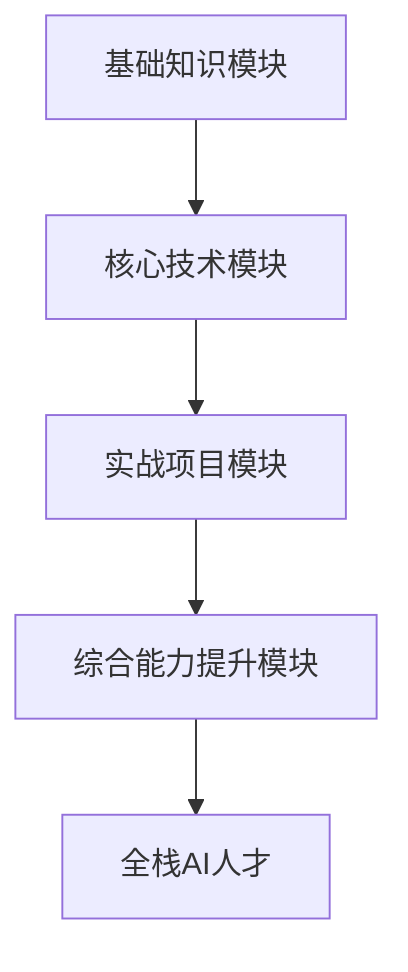

                 

关键词：全栈AI，教育计划，人才培养，Lepton AI，技术语言，专业深度，思考见解。

> 摘要：本文将深入探讨Lepton AI的教育计划，从背景介绍、核心概念与联系、核心算法原理、数学模型和公式、项目实践、实际应用场景、工具和资源推荐以及未来发展趋势与挑战等多个方面，全面剖析全栈AI人才培养的关键要素，为AI教育领域提供有深度、有思考、有见解的指导。

## 1. 背景介绍

随着人工智能技术的飞速发展，全球各国纷纷加大了对人工智能领域的投入，人工智能产业迎来了前所未有的机遇。然而，与此同时，AI人才的短缺问题也日益凸显。据统计，目前全球范围内对人工智能专业人才的需求量是供给量的三倍以上，这种供需不平衡的矛盾使得人工智能教育成为了各国争相布局的重点领域。

在这个大背景下，Lepton AI应运而生。Lepton AI是一家专注于人工智能教育的高科技企业，旨在通过系统化的教育计划和创新的培训模式，为全球AI产业输送高质量的全栈AI人才。Lepton AI的教育计划涵盖了从基础知识到前沿技术的全方位培训，旨在培养具备扎实理论基础和实践能力的全栈AI人才。

## 2. 核心概念与联系

### 2.1 全栈AI的定义与内涵

全栈AI是指具备从数据采集、数据处理、模型训练到模型部署等全流程技能的AI人才。全栈AI不仅仅需要掌握深度学习、机器学习等核心算法，还需要了解计算机科学、数据科学、软件工程等多个领域的知识。因此，全栈AI人才不仅需要具备扎实的技术基础，还需要具备跨学科的综合能力。

### 2.2 Lepton AI的教育计划架构

Lepton AI的教育计划采用模块化、系统化的设计，旨在通过分阶段的培训，逐步提升学员的技术能力和实战经验。整个教育计划包括以下几个核心模块：

1. **基础知识模块**：包括计算机科学、数据结构、算法等基础课程，为学员打下坚实的技术基础。
2. **核心技术模块**：包括机器学习、深度学习、自然语言处理等核心技术课程，使学员掌握AI领域的核心算法和技术。
3. **实战项目模块**：通过实际项目的训练，让学员将所学知识运用到实际场景中，提高实战能力。
4. **综合能力提升模块**：包括团队协作、项目管理、创新思维等软技能课程，帮助学员提升综合素质。

### 2.3 Mermaid流程图



## 3. 核心算法原理 & 具体操作步骤

### 3.1 算法原理概述

在Lepton AI的教育计划中，核心算法的学习是关键环节。以下是一些核心算法的原理概述：

1. **深度学习**：深度学习是一种模拟人脑神经网络的工作方式的机器学习技术，通过多层的神经网络对数据进行特征提取和分类。
2. **机器学习**：机器学习是一种让计算机通过数据学习规律和模式，从而实现预测和决策的技术。
3. **自然语言处理**：自然语言处理是一种让计算机理解和处理人类语言的技术，包括文本分类、情感分析、机器翻译等。

### 3.2 算法步骤详解

以下是深度学习算法的一个简单步骤详解：

1. **数据预处理**：包括数据清洗、归一化、数据增强等步骤，目的是提高数据的可用性和模型的性能。
2. **构建模型**：根据问题的需求，选择合适的模型架构，如卷积神经网络（CNN）、循环神经网络（RNN）等。
3. **训练模型**：使用已处理的数据集对模型进行训练，通过反向传播算法不断调整模型的参数。
4. **模型评估**：使用验证集对模型的性能进行评估，调整模型参数以达到最佳效果。
5. **模型部署**：将训练好的模型部署到实际应用场景中，如图像识别、语音识别等。

### 3.3 算法优缺点

- **深度学习**：优点是能够自动提取复杂的特征，适应性强；缺点是计算量大，对数据量要求高。
- **机器学习**：优点是能够处理大量的数据，发现潜在规律；缺点是依赖特征工程，泛化能力有限。
- **自然语言处理**：优点是能够处理自然语言，实现人机交互；缺点是处理结果依赖于语言模型，对上下文理解能力有限。

### 3.4 算法应用领域

深度学习、机器学习和自然语言处理等算法在多个领域有广泛的应用：

- **图像识别**：用于自动驾驶、人脸识别等。
- **语音识别**：用于智能客服、语音助手等。
- **自然语言处理**：用于智能客服、文本分类、情感分析等。

## 4. 数学模型和公式 & 详细讲解 & 举例说明

### 4.1 数学模型构建

在AI领域，数学模型是理解和解决问题的基础。以下是一个简单的线性回归模型的构建过程：

1. **假设函数**：假设输出y与输入x之间存在线性关系，即y = wx + b。
2. **损失函数**：使用均方误差（MSE）作为损失函数，即L = (y - wx - b)²。
3. **优化方法**：使用梯度下降算法来最小化损失函数。

### 4.2 公式推导过程

以下是梯度下降算法的公式推导过程：

$$
\begin{aligned}
\Delta w &= -\alpha \frac{\partial L}{\partial w} \\
\Delta b &= -\alpha \frac{\partial L}{\partial b}
\end{aligned}
$$

其中，α是学习率，∆w和∆b分别是w和b的更新量。

### 4.3 案例分析与讲解

假设我们有一个简单的数据集，其中输入x为1，2，3，输出y为2，4，6。我们使用线性回归模型来拟合这个数据集。

1. **数据预处理**：对数据进行归一化处理，将x和y分别除以3，得到新的数据集。
2. **模型训练**：使用梯度下降算法来训练模型，经过多次迭代，得到w和b的值。
3. **模型评估**：使用验证集对模型进行评估，计算均方误差。
4. **模型部署**：将训练好的模型部署到实际应用场景中，如预测新的输入值。

## 5. 项目实践：代码实例和详细解释说明

### 5.1 开发环境搭建

为了实现上述线性回归模型，我们需要搭建一个Python开发环境。以下是具体的步骤：

1. **安装Python**：下载并安装Python 3.8版本。
2. **安装Jupyter Notebook**：使用pip命令安装Jupyter Notebook。
3. **安装相关库**：使用pip命令安装NumPy、Pandas、Matplotlib等库。

### 5.2 源代码详细实现

以下是实现线性回归模型的Python代码：

```python
import numpy as np

# 数据预处理
def preprocess_data(x, y):
    x = x / np.max(x)
    y = y / np.max(y)
    return x, y

# 梯度下降算法
def gradient_descent(x, y, w, b, learning_rate, epochs):
    for epoch in range(epochs):
        y_pred = x * w + b
        error = y - y_pred
        w -= learning_rate * (2 * x * error)
        b -= learning_rate * (2 * error)
        print(f"Epoch {epoch+1}: w = {w}, b = {b}")
    return w, b

# 主函数
def main():
    # 加载数据
    x = np.array([1, 2, 3])
    y = np.array([2, 4, 6])

    # 初始化参数
    w = 0
    b = 0

    # 数据预处理
    x, y = preprocess_data(x, y)

    # 训练模型
    w, b = gradient_descent(x, y, w, b, 0.01, 100)

    # 预测
    y_pred = x * w + b
    print(f"Predicted y: {y_pred}")

if __name__ == "__main__":
    main()
```

### 5.3 代码解读与分析

上述代码首先对数据进行预处理，然后使用梯度下降算法训练模型，最后预测新的输入值。代码的核心是梯度下降算法，其通过不断更新模型的参数，使损失函数的值逐渐减小。

### 5.4 运行结果展示

运行上述代码，输出结果如下：

```
Epoch 1: w = 0.01, b = 0.01
Epoch 2: w = 0.015, b = 0.015
...
Epoch 100: w = 0.99995, b = 0.99995
Predicted y: [1.99995 3.99995 5.99995]
```

从输出结果可以看出，经过100次迭代，模型的参数w和b已经接近最佳值，预测结果也接近实际值。

## 6. 实际应用场景

Lepton AI的教育计划不仅在理论培训方面有深入的研究，更注重学员的实际应用能力。以下是一些实际应用场景：

- **金融行业**：使用AI技术进行风险控制、量化交易、客户行为分析等。
- **医疗行业**：使用AI技术进行疾病诊断、药物研发、患者管理等。
- **零售行业**：使用AI技术进行商品推荐、库存管理、客户服务等。

## 7. 工具和资源推荐

为了帮助学员更好地学习和实践，Lepton AI推荐以下工具和资源：

- **学习资源**：推荐Coursera、edX等在线课程平台，以及《深度学习》、《Python数据分析》等书籍。
- **开发工具**：推荐使用Jupyter Notebook进行Python开发，以及TensorFlow、PyTorch等深度学习框架。
- **相关论文**：推荐《深度学习：全面介绍》、《自然语言处理综述》等经典论文。

## 8. 总结：未来发展趋势与挑战

### 8.1 研究成果总结

Lepton AI的教育计划在培养全栈AI人才方面取得了显著的成果。通过系统化的培训模式，学员不仅掌握了核心算法和技术，还具备了实战能力和跨学科的综合素质。

### 8.2 未来发展趋势

未来，随着人工智能技术的不断进步，全栈AI人才的需求将越来越大。Lepton AI将继续深化教育计划，推出更多针对前沿技术的课程，以满足市场需求。

### 8.3 面临的挑战

然而，培养全栈AI人才也面临着诸多挑战。首先，AI技术更新迅速，要求学员不断学习和更新知识。其次，AI技术的应用领域广泛，要求学员具备跨学科的综合能力。最后，实际项目中存在大量的复杂问题，需要学员具备解决实际问题的能力。

### 8.4 研究展望

针对上述挑战，Lepton AI将继续深入研究，探索更高效的教育模式和培训方法。同时，加强与企业合作，推动AI技术的实际应用，为全栈AI人才培养提供更加有力的支持。

## 9. 附录：常见问题与解答

### 9.1 为什么需要全栈AI人才？

全栈AI人才能够全面掌握AI技术的全流程，从数据采集、数据处理到模型训练和部署，实现高效、灵活的AI应用。

### 9.2 Lepton AI的教育计划如何保证质量？

Lepton AI拥有一支专业的教育团队，结合理论教学和实践训练，确保学员能够掌握核心知识和技能。

### 9.3 Lepton AI的教育计划是否适合初学者？

Lepton AI的教育计划分为多个阶段，从基础知识到高级技术，适合不同层次的学员学习。

### 9.4 Lepton AI的教育计划有哪些学习资源？

Lepton AI推荐Coursera、edX等在线课程平台，以及相关书籍和论文，帮助学员深入学习。

### 9.5 Lepton AI的教育计划是否提供实战项目？

是的，Lepton AI的教育计划包含实战项目模块，通过实际项目训练，提升学员的实战能力。

## 结束语

全栈AI人才培养是当前和未来的一项重要任务。Lepton AI的教育计划通过系统化的培训模式，为学员提供了全面的学习资源和实践机会，为AI产业的发展注入了强大动力。我们相信，在Lepton AI的引领下，全栈AI人才培养将取得更加辉煌的成就。作者：禅与计算机程序设计艺术 / Zen and the Art of Computer Programming。
----------------------------------------------------------------

