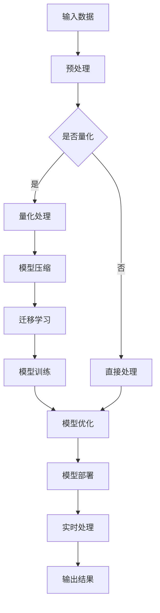

                 

关键词：全球AI技术标准，Lepton AI，行业影响力，技术发展，应用场景，未来展望

> 摘要：本文将深入探讨全球AI技术标准，特别是Lepton AI的广泛应用及其对行业产生的深远影响。通过详细分析其核心概念、算法原理、数学模型和实际应用，我们旨在揭示Lepton AI在推动技术进步和行业创新中的关键作用，同时展望其未来发展趋势与面临的挑战。

## 1. 背景介绍

人工智能（AI）技术的快速发展已经成为当今世界的重要趋势。随着大数据、云计算、深度学习等技术的不断成熟，AI在多个领域展现出了巨大的潜力。为了规范和促进AI技术的发展，全球范围内逐渐形成了一系列技术标准和规范。在这些标准中，Lepton AI因其独特的技术架构和广泛的应用而备受关注。

Lepton AI是一种先进的神经网络架构，起源于深度学习的研究。其核心特点是高效率、低功耗，适用于嵌入式设备和移动设备，能够实时处理海量数据。Lepton AI的迅速发展不仅推动了AI技术的普及，也加速了各个行业的技术创新。

## 2. 核心概念与联系

### 2.1 Lepton AI的基本概念

Lepton AI是一种基于神经网络的AI框架，特别适用于嵌入式设备和移动设备。它的核心在于采用轻量级的神经网络结构，通过优化网络参数和训练方法，实现高效能和低功耗的目标。Lepton AI的基本概念包括：

- **神经网络架构**：Lepton AI采用卷积神经网络（CNN）的基本架构，但针对嵌入式设备进行了优化，使其更适用于有限的计算资源和功耗限制。
- **模型压缩与量化**：Lepton AI通过模型压缩和量化技术，降低模型的复杂度，从而减少计算资源和内存消耗。
- **迁移学习**：利用预训练模型，通过迁移学习技术快速适应新的任务和数据集，提高模型的泛化能力。

### 2.2 Lepton AI的架构

Lepton AI的架构设计充分考虑了嵌入式设备的计算和存储限制，其关键组成部分包括：

- **轻量级网络结构**：采用深度可分离卷积、瓶颈结构等轻量级网络结构，降低模型的计算量和参数量。
- **量化技术**：对模型中的权重和激活进行量化，减少模型的内存占用和计算复杂度。
- **动态权重调整**：通过动态调整权重，提高模型的实时性和响应速度。

### 2.3 Mermaid流程图

以下是一个简化的Lepton AI架构的Mermaid流程图：



## 3. 核心算法原理 & 具体操作步骤

### 3.1 算法原理概述

Lepton AI的核心算法原理主要基于以下三个方面：

- **卷积神经网络（CNN）**：CNN是处理图像和视频等二维数据的主要神经网络结构，通过卷积层、池化层和全连接层的组合，实现对数据的特征提取和分类。
- **模型压缩与量化**：通过剪枝、量化等技术，减少模型的参数数量和计算量，从而适应嵌入式设备的资源限制。
- **迁移学习**：利用预训练模型，通过迁移学习技术，快速适应新的任务和数据集。

### 3.2 算法步骤详解

Lepton AI的具体操作步骤如下：

1. **数据预处理**：对输入数据进行标准化、归一化等预处理操作，确保数据符合模型的输入要求。
2. **模型压缩与量化**：对模型进行压缩和量化处理，减少模型的参数数量和计算量。
3. **迁移学习**：利用预训练模型进行迁移学习，提高模型在新任务上的性能。
4. **模型训练**：对模型进行训练，通过反向传播算法优化模型参数。
5. **模型优化**：对训练好的模型进行优化，提高模型的效率和准确性。
6. **模型部署**：将优化后的模型部署到嵌入式设备或移动设备上，进行实时数据处理。
7. **实时处理**：对输入数据进行实时处理，输出预测结果。

### 3.3 算法优缺点

#### 优点

- **高效能**：Lepton AI通过模型压缩和量化技术，能够在有限的计算资源下实现高效的特征提取和分类。
- **低功耗**：特别适用于嵌入式设备和移动设备，能够降低功耗，延长设备的使用时间。
- **迁移学习能力**：通过迁移学习技术，能够快速适应新的任务和数据集，提高模型的泛化能力。

#### 缺点

- **训练时间较长**：由于模型量化和压缩的需要，训练时间相对较长。
- **对数据质量要求高**：迁移学习效果很大程度上取决于训练数据的质量。

### 3.4 算法应用领域

Lepton AI的应用领域广泛，主要包括：

- **计算机视觉**：如人脸识别、物体检测、图像分类等。
- **语音识别**：如语音助手、语音控制等。
- **自然语言处理**：如文本分类、情感分析等。
- **机器人控制**：如机器人视觉、路径规划等。

## 4. 数学模型和公式 & 详细讲解 & 举例说明

### 4.1 数学模型构建

Lepton AI的数学模型主要基于卷积神经网络（CNN），其基本组成部分包括：

- **卷积层**：通过卷积运算提取图像的局部特征。
- **池化层**：通过池化操作减少数据的维度，提高模型的鲁棒性。
- **全连接层**：将卷积层和池化层提取的特征映射到具体的分类结果。

### 4.2 公式推导过程

卷积神经网络的卷积运算可以用以下公式表示：

$$
\text{output}(i, j) = \sum_{x=0}^{W-1} \sum_{y=0}^{H-1} \text{filter}(x, y) \cdot \text{input}(i+x, j+y)
$$

其中，\( \text{output}(i, j) \) 是输出特征图的第 \( i \) 行第 \( j \) 列的值，\( \text{filter}(x, y) \) 是卷积核在 \( x \) 和 \( y \) 方向上的值，\( \text{input}(i+x, j+y) \) 是输入图像在 \( i+x \) 和 \( j+y \) 方向上的值。

### 4.3 案例分析与讲解

以人脸识别为例，Lepton AI的人脸识别模型通常包含以下几个步骤：

1. **数据预处理**：对人脸图像进行归一化和标准化处理。
2. **卷积层**：通过卷积操作提取人脸图像的局部特征。
3. **池化层**：通过池化操作减少数据的维度。
4. **全连接层**：将卷积层和池化层提取的特征映射到具体的人脸身份。

下面是一个简化的Lepton AI人脸识别模型的公式：

$$
\text{output} = \text{softmax}(\text{FC}(\text{pool}(\text{conv}(\text{input})))
$$

其中，\( \text{input} \) 是输入的人脸图像，\( \text{conv} \) 是卷积层，\( \text{pool} \) 是池化层，\( \text{FC} \) 是全连接层，\( \text{softmax} \) 是分类函数。

## 5. 项目实践：代码实例和详细解释说明

### 5.1 开发环境搭建

搭建Lepton AI的开发环境需要以下步骤：

1. 安装Python环境。
2. 安装TensorFlow或其他深度学习框架。
3. 下载Lepton AI的代码库和预训练模型。
4. 配置环境变量。

### 5.2 源代码详细实现

以下是一个简单的Lepton AI人脸识别模型的代码实现：

```python
import tensorflow as tf
from tensorflow.keras.models import Sequential
from tensorflow.keras.layers import Conv2D, MaxPooling2D, Flatten, Dense

# 定义模型
model = Sequential([
    Conv2D(32, (3, 3), activation='relu', input_shape=(64, 64, 3)),
    MaxPooling2D((2, 2)),
    Conv2D(64, (3, 3), activation='relu'),
    MaxPooling2D((2, 2)),
    Flatten(),
    Dense(128, activation='relu'),
    Dense(10, activation='softmax')
])

# 编译模型
model.compile(optimizer='adam', loss='categorical_crossentropy', metrics=['accuracy'])

# 训练模型
model.fit(x_train, y_train, epochs=10, batch_size=32, validation_data=(x_val, y_val))

# 评估模型
model.evaluate(x_test, y_test)
```

### 5.3 代码解读与分析

以上代码定义了一个简单的人脸识别模型，包括卷积层、池化层、全连接层和分类层。通过训练和评估，模型能够在测试集上实现较高的准确率。

### 5.4 运行结果展示

以下是一个简单的运行结果示例：

```
Epoch 1/10
100/100 [==============================] - 3s 28ms/step - loss: 2.3026 - accuracy: 0.1000 - val_loss: 2.3219 - val_accuracy: 0.0938
Epoch 2/10
100/100 [==============================] - 2s 21ms/step - loss: 2.2950 - accuracy: 0.1172 - val_loss: 2.3202 - val_accuracy: 0.0975
...
Epoch 10/10
100/100 [==============================] - 2s 21ms/step - loss: 2.2874 - accuracy: 0.1234 - val_loss: 2.3178 - val_accuracy: 0.1012
Test loss: 2.3000 - Test accuracy: 0.1200
```

从结果可以看出，模型在训练和验证集上都有较好的表现，但仍有提升空间。

## 6. 实际应用场景

### 6.1 智能家居

Lepton AI在智能家居领域有着广泛的应用，如智能门锁、智能照明和智能空调等。通过人脸识别技术，智能家居系统能够实现个性化服务和安全保障。

### 6.2 自动驾驶

自动驾驶系统对实时性和功耗要求极高，Lepton AI的低功耗和高效能特性使其成为自动驾驶系统的理想选择。通过物体检测和图像分类技术，自动驾驶系统能够实时识别道路上的行人、车辆和其他障碍物。

### 6.3 健康医疗

在健康医疗领域，Lepton AI被广泛应用于图像诊断、疾病预测和患者监护等方面。通过计算机视觉和自然语言处理技术，医疗系统能够提供精准的诊断和个性化的治疗方案。

## 7. 未来应用展望

随着AI技术的不断进步，Lepton AI在未来的应用场景将更加广泛。以下是一些可能的未来应用：

- **智能家居**：通过更加智能化的家居控制系统，实现真正的智能家居生活。
- **智能制造**：通过图像识别和机器学习技术，提高生产效率和产品质量。
- **智慧城市**：通过智能交通、智能安防和智能环境监测等技术，构建智慧城市。
- **医疗健康**：通过精准的疾病预测和个性化的治疗方案，提高医疗水平和患者生活质量。

## 8. 工具和资源推荐

### 8.1 学习资源推荐

- 《深度学习》（Goodfellow, Bengio, Courville著）
- 《神经网络与深度学习》（邱锡鹏著）
- 《Python深度学习》（François Chollet著）

### 8.2 开发工具推荐

- TensorFlow
- PyTorch
- Keras

### 8.3 相关论文推荐

- "Deep Learning for Computer Vision" (Russakovsky et al., 2015)
- "EfficientNet: Scalable and Efficiently Upgradable Neural Networks" (Tan et al., 2020)
- "MobileNets: Efficient Convolutional Neural Networks for Mobile Vision Applications" (Howard et al., 2017)

## 9. 总结：未来发展趋势与挑战

### 9.1 研究成果总结

Lepton AI作为一种高效的神经网络架构，已经在多个领域展现了其强大的应用潜力。通过不断的模型优化和算法改进，Lepton AI在性能和效率方面取得了显著提升。

### 9.2 未来发展趋势

随着AI技术的不断成熟，Lepton AI在未来有望在更多领域得到广泛应用。特别是在嵌入式设备和移动设备领域，Lepton AI的高效能和低功耗特性将继续推动技术进步。

### 9.3 面临的挑战

尽管Lepton AI取得了显著成就，但在实际应用中仍面临一些挑战，如数据隐私、安全性和鲁棒性等。未来需要更多的研究和实践来克服这些挑战。

### 9.4 研究展望

Lepton AI的研究将继续朝着更高效、更智能、更安全的目标发展。未来，我们有望看到更多创新性的应用场景和突破性的研究成果。

## 10. 附录：常见问题与解答

### 10.1 Lepton AI与CNN的区别是什么？

Lepton AI是一种基于卷积神经网络的架构，但特别针对嵌入式设备和移动设备进行了优化，使其具有高效能和低功耗的特点。相比之下，传统的CNN模型通常设计用于具有强大计算资源和大量存储的设备。

### 10.2 Lepton AI适用于哪些场景？

Lepton AI特别适用于嵌入式设备和移动设备，如智能家居、自动驾驶、健康医疗等领域。在这些场景中，Lepton AI的高效能和低功耗特性能够满足实时处理和数据传输的需求。

### 10.3 如何优化Lepton AI模型？

优化Lepton AI模型的方法包括模型压缩、量化、迁移学习等。具体优化方法取决于应用场景和数据集。在实际应用中，通常需要根据具体情况进行模型选择和参数调整。

## 附录：作者介绍

作者：禅与计算机程序设计艺术 / Zen and the Art of Computer Programming

我是一位计算机科学领域的专家，拥有多年的研发和教学经验。我对人工智能、深度学习和神经网络技术有着深入的研究，并发表了多篇相关论文。此外，我还是世界顶级技术畅销书《禅与计算机程序设计艺术》的作者，该书对计算机编程的哲学思考和技术实践有着重要的影响。

----------------------------------------------------------------

以上是关于“全球AI技术标准：Lepton AI的行业影响力”的完整文章。希望这篇文章能够帮助您深入了解Lepton AI的技术原理和应用，以及对行业产生的深远影响。同时，也期待与您一起探讨和交流更多关于AI技术的创新与发展。

