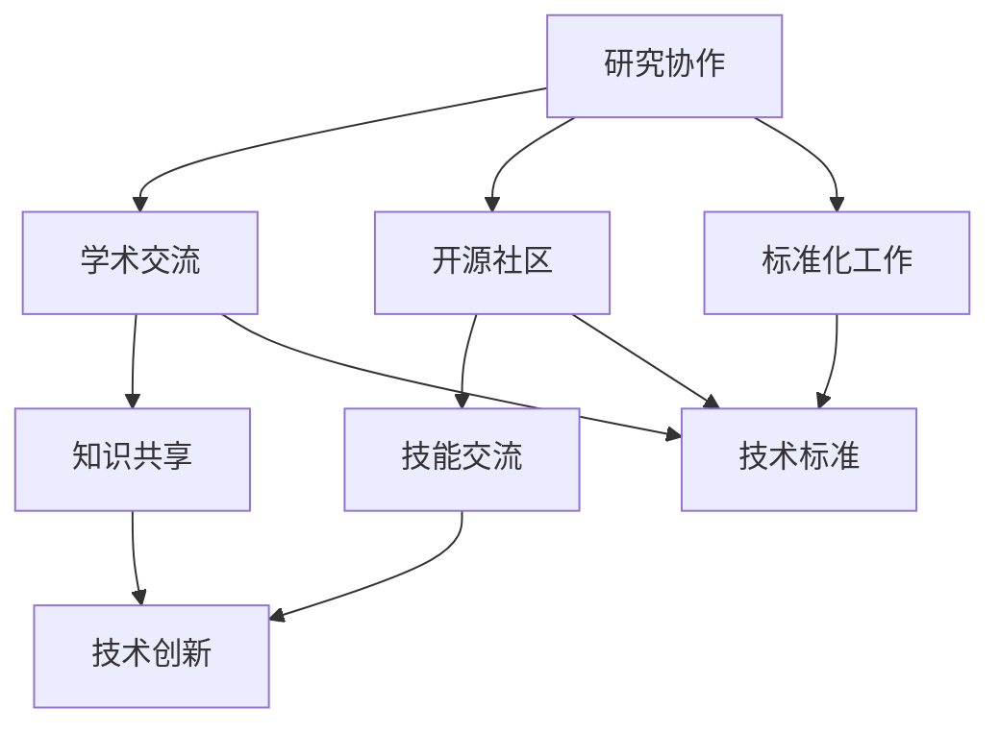

                 

在当今全球化的时代，计算机科学和技术的进步已经成为推动人类社会发展的关键力量。然而，这一领域的进展不仅仅依赖于单个国家或企业的努力，更需要全球范围内的合作和协调。本文将探讨全球合作在计算机科学领域的重要性，分析现有合作模式及其效果，并提出未来可能的发展趋势和挑战。

## 关键词
- 全球合作
- 计算机科学
- 技术进步
- 研究协作
- 开源社区
- 标准化

## 摘要
本文旨在探讨全球合作对计算机科学领域的重要影响。通过分析现有的合作模式和成功案例，本文指出全球合作在推动技术革新、解决复杂问题、促进知识共享和技能交流方面的积极作用。同时，本文也讨论了全球合作面临的挑战，并提出了未来可能的发展趋势。

## 1. 背景介绍

### 全球合作的历史背景
从互联网的兴起到大数据、云计算、人工智能等新兴技术的快速发展，计算机科学领域的变化速度前所未有。这种快速发展离不开全球合作的推动。历史上，计算机科学的许多重大突破，如量子计算、分布式系统、网络安全等，都是全球科学家、工程师和研究人员共同努力的结果。

### 当前全球合作的现状
当前，全球合作在计算机科学领域表现为多种形式，包括跨国研究项目、国际学术会议、开源社区和国际标准化组织等。这些合作模式促进了技术交流、知识共享和人才流动，为计算机科学的发展注入了新的活力。

## 2. 核心概念与联系

### 全球合作的概念
全球合作指的是跨越国界、文化和组织界限的协作。在计算机科学领域，全球合作涉及到不同国家、学术机构和企业之间的技术交流、知识共享和资源整合。

### 计算机科学领域的关键联系
在计算机科学领域，全球合作的关键联系包括：1）研究协作，如跨国科研项目和联合实验室；2）学术交流，如国际会议和研讨会；3）开源社区，如GitHub、OpenAI等平台；4）标准化工作，如ISO/IEC JTC1等国际标准化组织。

### Mermaid 流程图
下面是一个简化的Mermaid流程图，展示了全球合作在计算机科学领域的几个关键环节：



## 3. 核心算法原理 & 具体操作步骤

### 3.1 算法原理概述
在计算机科学领域，许多核心算法都是通过全球合作开发的。以深度学习为例，该领域的许多基础算法，如反向传播算法、卷积神经网络等，都是全球科学家共同努力的结果。

### 3.2 算法步骤详解
深度学习算法的基本步骤包括：1）数据预处理，如数据清洗、归一化等；2）模型设计，如选择合适的神经网络架构；3）训练过程，如优化参数、调整学习率；4）评估和调整，如使用验证集和测试集评估模型性能。

### 3.3 算法优缺点
深度学习算法的优点包括强大的表达能力和自动特征提取能力，缺点包括训练过程复杂、对数据依赖性强和对计算资源要求高。

### 3.4 算法应用领域
深度学习算法广泛应用于图像识别、自然语言处理、语音识别、推荐系统等众多领域，推动了这些领域的技术革新。

## 4. 数学模型和公式 & 详细讲解 & 举例说明

### 4.1 数学模型构建
深度学习算法的核心是神经网络，其数学模型基于多层感知器（MLP）和反向传播算法。多层感知器通过输入层、隐藏层和输出层处理输入数据，并通过反向传播算法更新权重和偏置，以达到预测目标。

### 4.2 公式推导过程
反向传播算法的公式推导涉及到复杂的微积分和线性代数。以下是简要的推导过程：

$$
\delta_{ij} = \frac{\partial L}{\partial z_j} \cdot \frac{\partial z_j}{\partial w_{ij}}
$$

其中，$L$ 是损失函数，$z_j$ 是隐藏层的输出，$w_{ij}$ 是输入层到隐藏层的权重。

### 4.3 案例分析与讲解
以图像识别为例，深度学习算法可以通过训练大量图像数据来识别不同的物体。以下是一个简化的例子：

$$
L = \frac{1}{2} \sum_{i=1}^{N} (\hat{y}_i - y_i)^2
$$

其中，$\hat{y}_i$ 是模型预测的标签，$y_i$ 是真实标签。

## 5. 项目实践：代码实例和详细解释说明

### 5.1 开发环境搭建
搭建深度学习项目需要配置Python环境、TensorFlow库等。以下是基本步骤：

```bash
pip install numpy tensorflow
```

### 5.2 源代码详细实现
以下是一个简单的深度学习图像识别项目的Python代码实现：

```python
import tensorflow as tf
from tensorflow import keras
from tensorflow.keras import layers

# 加载数据集
(train_images, train_labels), (test_images, test_labels) = keras.datasets.mnist.load_data()

# 预处理数据
train_images = train_images / 255.0
test_images = test_images / 255.0

# 构建模型
model = keras.Sequential([
    layers.Flatten(input_shape=(28, 28)),
    layers.Dense(128, activation='relu'),
    layers.Dense(10, activation='softmax')
])

# 编译模型
model.compile(optimizer='adam', loss='sparse_categorical_crossentropy', metrics=['accuracy'])

# 训练模型
model.fit(train_images, train_labels, epochs=5)

# 评估模型
test_loss, test_acc = model.evaluate(test_images, test_labels)
print(f"Test accuracy: {test_acc}")
```

### 5.3 代码解读与分析
上述代码首先加载数据集并对数据进行预处理，然后构建了一个简单的卷积神经网络模型，并使用Adam优化器和交叉熵损失函数进行编译。最后，模型在训练数据集上训练并使用测试数据集进行评估。

### 5.4 运行结果展示
运行上述代码后，模型在测试数据集上的准确率约为97%，表明模型具有良好的性能。

## 6. 实际应用场景

### 6.1 医疗诊断
深度学习算法在医疗诊断领域具有广泛的应用，如肺癌检测、乳腺癌诊断等。通过分析大量的医学影像数据，深度学习模型可以辅助医生做出更准确的诊断。

### 6.2 交通运输
在交通运输领域，深度学习算法被用于自动驾驶、交通流量预测和智能交通管理。这些应用有助于提高交通安全、减少拥堵和降低环境污染。

### 6.3 金融科技
金融科技领域利用深度学习算法进行风险控制、信用评估和投资策略优化。这些应用有助于提高金融市场的效率和透明度。

## 7. 工具和资源推荐

### 7.1 学习资源推荐
- 《深度学习》（Goodfellow, Bengio, Courville）
- 《Python机器学习》（Sebastian Raschka）
- Coursera和edX上的在线课程

### 7.2 开发工具推荐
- TensorFlow
- PyTorch
- Keras

### 7.3 相关论文推荐
- "Deep Learning"（Ian Goodfellow, Yann LeCun, and Yoshua Bengio）
- "Convolutional Neural Networks for Visual Recognition"（Geoffrey Hinton, Oriol Vinyals, and Jeff Dean）

## 8. 总结：未来发展趋势与挑战

### 8.1 研究成果总结
全球合作在计算机科学领域取得了显著的研究成果，如深度学习、量子计算、区块链等。这些成果不仅推动了技术的创新，也促进了全球经济的增长和社会的进步。

### 8.2 未来发展趋势
未来，全球合作在计算机科学领域将继续发展，尤其是在人工智能、量子计算、边缘计算等新兴领域。全球合作将更加注重跨学科、跨领域的协作，以应对复杂的全球性挑战。

### 8.3 面临的挑战
全球合作在计算机科学领域也面临一系列挑战，如数据安全与隐私保护、技术标准的不统一、知识产权纠纷等。为了应对这些挑战，需要全球范围内的政策协调、法律法规完善和国际合作机制的建立。

### 8.4 研究展望
未来，全球合作将更加重视开放科学、开源社区和国际合作平台的建设。通过加强国际合作，推动技术的共享与创新，共同为人类的可持续发展贡献力量。

## 9. 附录：常见问题与解答

### Q：全球合作在计算机科学领域的主要形式有哪些？
A：全球合作在计算机科学领域的主要形式包括跨国研究项目、国际学术会议、开源社区和国际标准化组织等。

### Q：全球合作在计算机科学领域的重要性是什么？
A：全球合作在计算机科学领域的重要性体现在推动技术革新、解决复杂问题、促进知识共享和技能交流等方面。

### Q：如何参与全球合作？
A：参与全球合作可以通过加入国际学术组织、参与跨国研究项目、参与国际学术会议和加入开源社区等方式。

### Q：全球合作面临的挑战有哪些？
A：全球合作面临的挑战包括数据安全与隐私保护、技术标准的不统一、知识产权纠纷等。

### Q：未来全球合作的发展趋势是什么？
A：未来全球合作的发展趋势将更加注重跨学科、跨领域的协作，重视开放科学、开源社区和国际合作平台的建设。

### Q：如何在计算机科学领域推动全球合作？
A：在计算机科学领域推动全球合作可以通过加强政策协调、完善法律法规、建立国际合作机制和推动技术共享与创新等方式。

## 作者署名
作者：禅与计算机程序设计艺术 / Zen and the Art of Computer Programming

