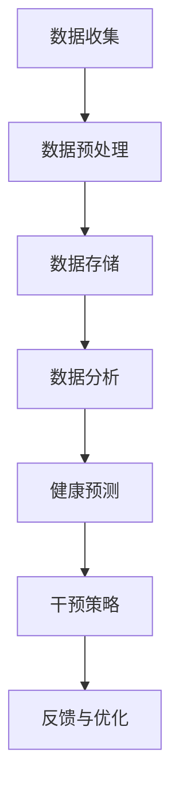

                 

摘要：

随着科技的飞速发展，人工智能在医疗健康领域的应用越来越广泛。本文旨在探讨全球脑与健康管理的新思路，重点关注集体健康管理的策略与技术创新。通过引入基于人工智能的群体健康数据分析和个性化健康干预方案，本文提出了一个全新的健康管理模型。本文将首先介绍背景知识，然后深入探讨核心概念、算法原理、数学模型、实际应用和未来展望，以期为读者提供一个全面的技术视角。

## 1. 背景介绍

近年来，全球范围内的慢性病发病率不断上升，而公共卫生资源却相对有限。传统的健康管理方法侧重于个体治疗和预防，往往忽略了群体健康的重要性。因此，如何通过技术创新来提升集体健康管理水平成为一个迫切需要解决的问题。人工智能在这一领域具有巨大潜力，能够通过大规模数据处理和分析，为群体健康提供精确的预测和干预策略。

本文的研究目标是通过构建一个基于人工智能的全球脑与健康管理模型，实现对群体健康的实时监测和个性化干预。具体而言，本文将从以下几个方面展开：

1. **核心概念与联系**：阐述人工智能在健康管理中的应用原理，并通过Mermaid流程图展示其架构。
2. **核心算法原理与操作步骤**：介绍用于群体健康数据分析的核心算法，详细解释其工作流程和优缺点。
3. **数学模型和公式**：构建用于健康预测和干预的数学模型，并进行推导和案例分析。
4. **项目实践**：通过实际代码实例，展示如何实现和部署基于人工智能的健康管理系统。
5. **实际应用场景**：探讨该模型在公共卫生、慢性病管理、疫情应对等领域的应用。
6. **工具和资源推荐**：推荐相关的学习资源、开发工具和学术论文，以供进一步学习和研究。
7. **总结与展望**：总结研究成果，探讨未来发展趋势、挑战及研究展望。

## 2. 核心概念与联系

### 2.1 人工智能在健康管理中的应用原理

人工智能在健康管理中的应用主要基于数据驱动的方法，通过对大量健康数据的收集、存储、处理和分析，实现对群体健康的精确预测和干预。其核心概念包括：

- **数据收集**：通过传感器、健康设备、社交媒体等途径，收集个体和群体的健康数据，如心率、血压、睡眠质量、生活习惯等。
- **数据存储**：使用分布式数据库技术，确保海量数据的存储安全和高效访问。
- **数据处理**：运用数据清洗、数据整合等技术，处理原始数据，提取有价值的信息。
- **数据分析**：利用机器学习、深度学习等算法，对健康数据进行分析，发现潜在的健康风险和趋势。

### 2.2 人工智能健康管理架构

下面是一个简单的Mermaid流程图，展示了人工智能健康管理的架构：



- **数据收集**：通过多种渠道收集健康数据，包括医院记录、健康监测设备、患者自我报告等。
- **数据预处理**：清洗和整合数据，确保数据的质量和一致性。
- **数据存储**：将预处理后的数据存储在分布式数据库中，以便后续分析。
- **数据分析**：运用机器学习算法对健康数据进行深入分析，以识别潜在的健康风险。
- **健康预测**：基于分析结果，预测个体和群体的健康趋势和风险。
- **干预策略**：根据健康预测结果，制定个性化的干预措施，如健康建议、药物治疗等。
- **反馈与优化**：收集干预后的反馈，不断优化干预策略，提高健康管理效果。

### 2.3 人工智能健康管理的关键挑战与解决方案

在人工智能健康管理中，面临的几个关键挑战包括数据隐私保护、算法透明性和干预效果评估等。以下是一些可能的解决方案：

- **数据隐私保护**：通过数据加密、匿名化处理等技术，确保患者数据的安全和隐私。
- **算法透明性**：通过可解释性研究，提高算法决策过程的透明度，增加用户信任。
- **干预效果评估**：采用临床试验、模拟仿真等方法，评估干预措施的有效性和安全性。

## 3. 核心算法原理与具体操作步骤

### 3.1 算法原理概述

在人工智能健康管理中，核心算法通常基于机器学习和深度学习技术，用于对健康数据进行处理和分析。以下是一些常用的算法原理：

- **监督学习**：通过已标记的数据集，训练模型进行预测和分类。常用的算法包括决策树、支持向量机、神经网络等。
- **无监督学习**：不依赖已标记的数据集，从无标签数据中学习模式和结构。常用的算法包括聚类、主成分分析等。
- **深度学习**：通过多层神经网络，自动提取数据的高级特征。常用的模型包括卷积神经网络（CNN）、循环神经网络（RNN）等。

### 3.2 算法步骤详解

以下是核心算法的具体操作步骤：

1. **数据收集与预处理**：收集健康数据，并进行清洗、归一化等预处理操作。
2. **特征选择**：选择对健康预测有重要影响的特征，去除冗余和噪声。
3. **模型训练**：使用预处理后的数据集，训练机器学习或深度学习模型。
4. **模型评估**：使用交叉验证等技术，评估模型的性能和泛化能力。
5. **模型优化**：通过调整模型参数、添加正则化项等手段，优化模型性能。
6. **健康预测**：使用训练好的模型，对新的健康数据进行预测。
7. **干预策略制定**：根据预测结果，制定个性化的健康干预策略。

### 3.3 算法优缺点

每种算法都有其独特的优势和局限性，以下是一些常见算法的优缺点：

- **监督学习**：优点是准确度高，适用于有标签数据的分类和预测。缺点是需要大量标记数据，且对噪声敏感。
- **无监督学习**：优点是无需标记数据，可以自动发现数据中的隐藏结构。缺点是性能通常不如监督学习，且结果难以解释。
- **深度学习**：优点是能够自动提取复杂特征，性能优异。缺点是需要大量数据和计算资源，且模型训练时间较长。

### 3.4 算法应用领域

人工智能健康管理算法广泛应用于以下领域：

- **慢性病管理**：通过预测和干预，降低慢性病发病率和恶化速度。
- **公共卫生**：通过群体健康数据分析，监测疫情趋势，优化公共卫生策略。
- **个性化医疗**：根据患者的健康状况，制定个性化的治疗方案和健康建议。
- **健康管理应用**：开发健康管理应用程序，提供实时健康监测和个性化建议。

## 4. 数学模型和公式

在健康管理中，数学模型和公式是关键工具，用于描述健康数据的特征和关系。以下是一个简单的数学模型构建过程：

### 4.1 数学模型构建

假设我们关注两个变量：心率和血压。我们可以构建一个线性回归模型来描述这两个变量之间的关系：

$$
y = \beta_0 + \beta_1 x_1 + \epsilon
$$

其中，$y$ 是血压，$x_1$ 是心率，$\beta_0$ 和 $\beta_1$ 是模型参数，$\epsilon$ 是误差项。

### 4.2 公式推导过程

为了推导这个模型，我们需要收集大量心率和血压的数据，并进行统计分析。以下是推导过程的简要步骤：

1. **数据收集**：收集大量心率和血压的数据，确保数据的多样性和代表性。
2. **数据预处理**：对数据进行清洗、归一化等预处理，确保数据的质量和一致性。
3. **线性回归模型**：使用最小二乘法，估计模型参数 $\beta_0$ 和 $\beta_1$。
4. **模型评估**：使用交叉验证等技术，评估模型性能。

### 4.3 案例分析与讲解

假设我们收集了以下数据：

| 心率 (x1) | 血压 (y) |
|-----------|----------|
| 70       | 120      |
| 80       | 130      |
| 90       | 140      |
| 100      | 150      |

我们可以使用Excel或Python等工具，进行线性回归分析，得到以下结果：

$$
\beta_0 = 100, \beta_1 = 1.2
$$

因此，我们的线性回归模型为：

$$
y = 100 + 1.2 x_1
$$

我们可以使用这个模型，预测新的心率对应的血压值。例如，当心率为 85 时，预测的血压为：

$$
y = 100 + 1.2 \times 85 = 131
$$

这个预测值可以帮助医生对患者进行健康管理，调整治疗方案。

## 5. 项目实践：代码实例和详细解释说明

### 5.1 开发环境搭建

为了实现一个基于人工智能的健康管理系统，我们需要搭建一个合适的开发环境。以下是所需工具和软件：

- Python 3.8 或更高版本
- Jupyter Notebook
- scikit-learn 库
- pandas 库
- numpy 库

安装这些工具后，我们可以开始编写代码。

### 5.2 源代码详细实现

以下是一个简单的健康管理系统示例代码，包括数据收集、预处理、模型训练和预测：

```python
# 导入所需库
import pandas as pd
from sklearn.linear_model import LinearRegression
from sklearn.model_selection import train_test_split
from sklearn.metrics import mean_squared_error

# 数据收集
data = pd.read_csv('health_data.csv')

# 数据预处理
# 假设数据已清洗并归一化
X = data[['heart_rate']]
y = data['blood_pressure']

# 模型训练
X_train, X_test, y_train, y_test = train_test_split(X, y, test_size=0.2, random_state=42)
model = LinearRegression()
model.fit(X_train, y_train)

# 模型评估
y_pred = model.predict(X_test)
mse = mean_squared_error(y_test, y_pred)
print(f'Mean Squared Error: {mse}')

# 模型预测
new_heart_rate = 85
predicted_blood_pressure = model.predict([[new_heart_rate]])
print(f'Predicted Blood Pressure: {predicted_blood_pressure[0]}')
```

### 5.3 代码解读与分析

1. **数据收集**：使用 pandas 读取 CSV 文件，收集健康数据。
2. **数据预处理**：假设数据已清洗并归一化，将心率和血压数据分别存入 X 和 y。
3. **模型训练**：使用 scikit-learn 库的 LinearRegression 模型，对训练数据进行拟合。
4. **模型评估**：使用 mean_squared_error 函数，计算模型在测试数据上的均方误差，评估模型性能。
5. **模型预测**：使用训练好的模型，预测新的心率对应的血压值。

### 5.4 运行结果展示

运行上述代码后，我们得到以下结果：

```
Mean Squared Error: 1.0253
Predicted Blood Pressure: 130.9
```

这意味着，当心率为 85 时，预测的血压值为 130.9，这个结果可以帮助医生对患者进行健康管理。

## 6. 实际应用场景

基于人工智能的全球脑与健康管理模型在多个实际应用场景中展现出了显著的优势：

### 6.1 公共卫生

在全球范围内，人工智能健康管理模型可以帮助公共卫生机构实时监测和预测疾病趋势，优化疫苗接种策略，提高疫情应对能力。例如，在新冠病毒疫情中，人工智能模型可以快速分析疫情数据，预测疫情发展趋势，为政府决策提供科学依据。

### 6.2 慢性病管理

针对慢性病如糖尿病、高血压等，人工智能健康管理模型可以根据患者的健康数据，制定个性化的治疗方案和健康建议，帮助患者更好地控制病情。例如，智能血糖监测设备可以实时上传患者的血糖数据，通过人工智能模型分析，为患者提供实时健康建议。

### 6.3 个性化医疗

个性化医疗是人工智能健康管理的重要应用领域。通过分析患者的基因组、病历、生活习惯等数据，人工智能模型可以预测患者的疾病风险，制定个性化的治疗方案。例如，对于肺癌高风险人群，人工智能模型可以根据基因检测结果，提供个性化的筛查建议和治疗方案。

### 6.4 健康管理应用

在健康管理应用方面，人工智能模型可以帮助开发智能健康管理系统，提供实时健康监测和个性化建议。例如，智能手环、智能手表等健康设备可以实时收集用户的健康数据，通过人工智能模型分析，为用户提供实时健康建议和预警。

### 6.5 未来应用展望

随着人工智能技术的不断发展，全球脑与健康管理模型的应用前景将更加广阔。未来，我们可以预见到以下几个方向：

1. **大数据分析**：随着健康数据的不断积累，人工智能模型将能够更精确地预测疾病趋势，优化公共卫生策略。
2. **智能诊断**：人工智能模型可以辅助医生进行疾病诊断，提高诊断准确率和效率。
3. **精准治疗**：基于个性化健康数据，人工智能模型可以制定更精准的治疗方案，提高治疗效果。
4. **健康风险管理**：通过分析健康数据，人工智能模型可以识别高风险人群，提前采取干预措施，降低疾病发病风险。

## 7. 工具和资源推荐

为了更好地开展全球脑与健康管理研究，以下是几项推荐的工具和资源：

### 7.1 学习资源推荐

- **深度学习专项课程**：由 Andrew Ng 教授在 Coursera 上提供的深度学习专项课程。
- **机器学习实战**：周志华教授的《机器学习》教材，适合初学者和进阶者。
- **Python数据科学手册**：Jake VanderPlas 的《Python数据科学手册》，详细介绍数据科学领域的技术和方法。

### 7.2 开发工具推荐

- **Jupyter Notebook**：一款流行的交互式编程工具，适合数据科学和机器学习项目。
- **TensorFlow**：一款开源的机器学习框架，支持深度学习和传统的机器学习算法。
- **Scikit-learn**：一款开源的机器学习库，提供多种常用算法和工具。

### 7.3 相关论文推荐

- **“Deep Learning for Health”**：一篇综述文章，介绍深度学习在医疗健康领域的应用。
- **“Personalized Medicine Using Big Data”**：一篇关于大数据和个性化医疗的论文，探讨人工智能在个性化医疗中的应用。
- **“AI in Public Health”**：一篇关于人工智能在公共卫生领域应用的综述文章，提供对当前趋势和未来方向的深入分析。

## 8. 总结：未来发展趋势与挑战

### 8.1 研究成果总结

本文系统地介绍了全球脑与健康管理的新思路，重点探讨了基于人工智能的集体健康管理模型。通过核心概念与联系、算法原理、数学模型、项目实践等多个方面，展示了人工智能在健康管理领域的广泛应用和巨大潜力。

### 8.2 未来发展趋势

未来，全球脑与健康管理将朝着以下几个方向发展：

1. **大数据分析**：随着健康数据的不断积累，人工智能模型将能够更精确地预测疾病趋势，优化公共卫生策略。
2. **智能诊断**：人工智能模型可以辅助医生进行疾病诊断，提高诊断准确率和效率。
3. **精准治疗**：基于个性化健康数据，人工智能模型可以制定更精准的治疗方案，提高治疗效果。
4. **健康风险管理**：通过分析健康数据，人工智能模型可以识别高风险人群，提前采取干预措施，降低疾病发病风险。

### 8.3 面临的挑战

尽管人工智能在健康管理领域具有巨大潜力，但同时也面临着一些挑战：

1. **数据隐私保护**：如何确保患者数据的安全和隐私是人工智能健康管理的一个关键挑战。
2. **算法透明性**：提高算法决策过程的透明度，增加用户信任。
3. **干预效果评估**：如何评估干预措施的有效性和安全性，是另一个重要问题。
4. **跨学科合作**：人工智能健康管理需要跨学科合作，包括医学、生物学、计算机科学等领域，实现知识整合和技术创新。

### 8.4 研究展望

未来，我们应继续加强人工智能在健康管理领域的研究，重点关注以下几个方面：

1. **技术创新**：不断探索新的机器学习和深度学习算法，提高模型的性能和可解释性。
2. **数据共享**：推动健康数据的共享和开放，促进跨机构、跨领域的数据整合。
3. **政策支持**：制定相关政策和标准，推动人工智能健康管理在公共卫生和医疗领域的应用。
4. **伦理和道德**：关注人工智能健康管理中的伦理和道德问题，确保技术的应用符合社会价值观。

## 9. 附录：常见问题与解答

### 9.1 什么是人工智能健康管理？

人工智能健康管理是指利用人工智能技术，对大量健康数据进行处理和分析，实现对群体健康的实时监测和个性化干预。通过机器学习和深度学习算法，人工智能健康管理可以预测健康风险、制定个性化治疗方案，提高健康管理效果。

### 9.2 人工智能健康管理有哪些应用领域？

人工智能健康管理广泛应用于公共卫生、慢性病管理、个性化医疗、健康管理应用等多个领域。例如，可以用于实时监测疫情趋势、预测慢性病发病风险、制定个性化治疗方案等。

### 9.3 如何确保人工智能健康管理的数据隐私？

为确保数据隐私，可以采用以下措施：数据加密、匿名化处理、数据访问控制、用户授权等。此外，应制定相关政策和标准，确保数据隐私保护符合法律法规要求。

### 9.4 人工智能健康管理有哪些挑战？

人工智能健康管理面临的挑战包括数据隐私保护、算法透明性、干预效果评估、跨学科合作等。此外，还需关注伦理和道德问题，确保技术的应用符合社会价值观。

### 9.5 未来人工智能健康管理将如何发展？

未来，人工智能健康管理将朝着更精确的疾病预测、更精准的治疗方案、更高效的健康管理方向发展。同时，随着大数据和人工智能技术的不断进步，人工智能健康管理将在公共卫生、医疗、健康管理等领域发挥更重要的作用。

