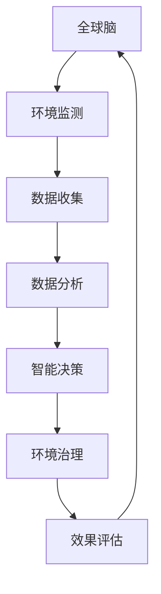

                 

关键词：全球脑、环境治理、集体合作、信息技术、人工智能、可持续发展

> 摘要：本文探讨了全球脑与全球环境之间的关系，以及如何通过集体合作利用信息技术，特别是人工智能，来实现环境治理的可持续目标。文章从背景介绍、核心概念与联系、核心算法原理与操作步骤、数学模型和公式、项目实践、实际应用场景、工具和资源推荐、总结与展望等多个角度，详细阐述了这一领域的研究现状、技术路线和未来发展趋势。

## 1. 背景介绍

在过去的几十年里，全球环境问题日益严重，气候变化、资源枯竭、生态破坏等挑战不断加剧。面对这些问题，传统的环境治理模式已经难以满足日益复杂的环保需求。随着信息技术的飞速发展，尤其是人工智能的崛起，为环境治理提供了新的思路和方法。

全球脑（Global Brain）的概念是由英国物理学家弗里曼·戴森（Freeman Dyson）首次提出的，它描述了一个由大量智能体（包括人类、动物、植物和机器）组成的复杂网络，通过相互交流和协作，形成一种类似于大脑的全球性智能体系。这个概念为我们提供了一个全新的视角，来理解人类如何通过集体合作来解决环境问题。

本文旨在探讨全球脑与全球环境之间的关系，以及如何利用信息技术，特别是人工智能，来实现环境治理的可持续目标。文章将首先介绍相关的核心概念和原理，然后详细阐述核心算法、数学模型和项目实践，最后讨论实际应用场景和未来展望。

## 2. 核心概念与联系

### 2.1 全球脑

全球脑是一个复杂自适应系统，由众多智能体通过相互连接和互动形成。这些智能体可以是人类、动物、植物，甚至是机器和软件系统。全球脑的核心特征是它的分布式计算能力和自我组织能力。

在环境治理领域，全球脑的概念尤为重要。通过智能体之间的相互交流和协作，我们可以形成一种全球性的环境保护网络。这个网络可以实时监测全球环境变化，及时响应各种环境问题，并协调全球范围内的资源分配和行动。

### 2.2 人工智能与环境治理

人工智能（AI）是一种模拟人类智能的技术，它可以处理大量数据，发现规律，做出决策。在环境治理领域，人工智能的应用前景广阔。

首先，人工智能可以通过大数据分析，实时监测全球环境变化，提供精确的环境数据支持。其次，人工智能可以用于环境预测，通过模拟各种环境因素的变化，预测未来的环境趋势，为政策制定提供科学依据。此外，人工智能还可以用于环境治理的自动化，例如，通过智能传感器和自动化设备，实现环境监测和治理的自动化操作。

### 2.3 信息技术与环境治理

信息技术（IT）是人工智能的基础，也是全球脑实现的手段。在环境治理领域，信息技术的作用体现在以下几个方面：

1. **数据收集与管理**：通过传感器网络、卫星遥感等技术，实时收集全球环境数据，并进行有效的管理。

2. **数据共享与协作**：利用云计算、区块链等技术，实现全球环境数据的共享和协作，打破信息孤岛，提高环境治理的效率。

3. **智能决策支持**：通过数据分析和机器学习，为环境治理提供智能决策支持，提高决策的科学性和准确性。

### 2.4 Mermaid 流程图

下面是一个简单的 Mermaid 流程图，展示了全球脑、人工智能和信息技术在环境治理中的应用流程：



## 3. 核心算法原理 & 具体操作步骤

### 3.1 算法原理概述

在环境治理领域，核心算法主要包括环境监测算法、数据分析算法和智能决策算法。

- **环境监测算法**：主要利用传感器技术，实时监测环境参数，如温度、湿度、空气质量等。
- **数据分析算法**：利用机器学习和数据挖掘技术，对环境监测数据进行处理和分析，发现环境变化的规律和趋势。
- **智能决策算法**：基于数据分析结果，利用决策树、神经网络等算法，制定出最优的环境治理策略。

### 3.2 算法步骤详解

#### 3.2.1 环境监测算法

1. **传感器部署**：在目标区域部署传感器，如空气质量传感器、水质传感器等。
2. **数据采集**：传感器实时采集环境数据，并通过无线网络传输到数据中心。
3. **数据预处理**：对采集到的数据去噪、去重，确保数据的准确性和一致性。

#### 3.2.2 数据分析算法

1. **特征提取**：从原始数据中提取出具有代表性的特征，如温度的日变化、空气质量的月变化等。
2. **数据建模**：利用机器学习算法，如决策树、随机森林、神经网络等，建立环境预测模型。
3. **模型评估**：通过交叉验证等方法，评估模型的性能，并调整模型参数。

#### 3.2.3 智能决策算法

1. **策略生成**：根据环境预测模型的结果，生成一系列的环境治理策略。
2. **策略评估**：对每个策略进行评估，选择最优策略。
3. **策略执行**：执行最优策略，如调整污染物排放量、开展环境修复工程等。

### 3.3 算法优缺点

#### 环境监测算法

- 优点：实时性强，数据准确度高。
- 缺点：成本高，传感器部署和维护复杂。

#### 数据分析算法

- 优点：能够处理大量数据，发现环境变化的规律。
- 缺点：对数据质量要求高，模型训练和评估复杂。

#### 智能决策算法

- 优点：能够自动生成和调整治理策略，提高治理效率。
- 缺点：需要大量的数据和计算资源，且可能存在过拟合问题。

### 3.4 算法应用领域

- **空气质量监测**：通过环境监测算法和数据分析算法，实时监测空气质量，预测空气质量变化趋势，制定空气质量改善策略。
- **水资源管理**：通过数据分析算法和智能决策算法，优化水资源分配，提高水资源利用效率。
- **生态系统监测**：通过环境监测算法和数据分析算法，监测生态系统变化，预测生态系统退化趋势，制定生态保护策略。

## 4. 数学模型和公式 & 详细讲解 & 举例说明

### 4.1 数学模型构建

在环境治理中，常用的数学模型包括线性回归模型、决策树模型、神经网络模型等。

#### 4.1.1 线性回归模型

线性回归模型是最简单的数学模型之一，它通过建立自变量和因变量之间的线性关系，预测因变量的值。

$$
y = ax + b
$$

其中，$y$ 是因变量，$x$ 是自变量，$a$ 和 $b$ 是模型的参数。

#### 4.1.2 决策树模型

决策树模型通过树形结构来表示决策过程，每个节点表示一个特征，每个分支表示特征的取值。

$$
\text{决策树} = \{ \text{根节点}, \text{内部节点}, \text{叶节点} \}
$$

#### 4.1.3 神经网络模型

神经网络模型通过多层神经元来模拟人类大脑的决策过程，它包括输入层、隐藏层和输出层。

$$
\text{神经网络} = \{ \text{输入层}, \text{隐藏层}, \text{输出层} \}
$$

### 4.2 公式推导过程

以线性回归模型为例，我们介绍公式的推导过程。

1. **假设**：我们假设自变量 $x$ 和因变量 $y$ 之间满足线性关系。

$$
y = ax + b
$$

2. **最小二乘法**：为了找到最佳的线性关系，我们使用最小二乘法来求解 $a$ 和 $b$。

$$
\sum_{i=1}^{n} (y_i - (ax_i + b))^2 = \min
$$

3. **求解**：通过求解上述方程，我们可以得到 $a$ 和 $b$ 的值。

$$
a = \frac{\sum_{i=1}^{n} x_iy_i - n\bar{x}\bar{y}}{\sum_{i=1}^{n} x_i^2 - n\bar{x}^2}
$$

$$
b = \bar{y} - a\bar{x}
$$

其中，$\bar{x}$ 和 $\bar{y}$ 分别是 $x$ 和 $y$ 的平均值。

### 4.3 案例分析与讲解

假设我们有一个空气质量监测数据集，包括每天的空气质量指数（AQI）和对应的温度、湿度等环境参数。我们希望利用线性回归模型来预测未来的 AQI。

1. **数据预处理**：首先，我们需要对数据进行预处理，包括去除异常值、填充缺失值等。

2. **特征提取**：从原始数据中提取出具有代表性的特征，如温度、湿度等。

3. **数据建模**：利用最小二乘法，建立线性回归模型。

4. **模型评估**：通过交叉验证等方法，评估模型的性能。

5. **预测**：利用训练好的模型，预测未来的 AQI。

通过上述步骤，我们可以得到一个预测模型，用于实时监测和预测空气质量。

## 5. 项目实践：代码实例和详细解释说明

### 5.1 开发环境搭建

为了实现全球脑与全球环境治理的算法，我们需要搭建一个适合的开发环境。以下是基本的开发环境搭建步骤：

1. **操作系统**：选择 Linux 操作系统，如 Ubuntu。
2. **编程语言**：选择 Python，因为它具有良好的科学计算和机器学习库支持。
3. **库和框架**：安装必要的库和框架，如 NumPy、Pandas、Scikit-learn、TensorFlow 等。

### 5.2 源代码详细实现

下面是一个简单的 Python 代码实例，用于实现线性回归模型的环境监测和预测。

```python
import numpy as np
import pandas as pd
from sklearn.linear_model import LinearRegression

# 数据预处理
def preprocess_data(data):
    # 去除异常值、填充缺失值
    data = data.fillna(data.mean())
    data = data.dropna()
    return data

# 数据建模
def build_model(data):
    X = data[['temperature', 'humidity']]
    y = data['aqi']
    model = LinearRegression()
    model.fit(X, y)
    return model

# 模型评估
def evaluate_model(model, X_test, y_test):
    y_pred = model.predict(X_test)
    mse = np.mean((y_pred - y_test) ** 2)
    print("Mean Squared Error:", mse)

# 预测
def predict(model, X_new):
    y_pred = model.predict(X_new)
    print("Predicted AQI:", y_pred)

# 主函数
def main():
    data = pd.read_csv('air_quality.csv')
    data = preprocess_data(data)
    train_data = data.iloc[:1000]
    test_data = data.iloc[1000:]
    model = build_model(train_data)
    evaluate_model(model, test_data, test_data['aqi'])
    X_new = np.array([[25, 60]])
    predict(model, X_new)

if __name__ == '__main__':
    main()
```

### 5.3 代码解读与分析

上述代码实现了一个简单的线性回归模型，用于空气质量指数（AQI）的预测。

- **数据预处理**：首先，我们读取空气质量数据，然后去除异常值和缺失值，确保数据的准确性和一致性。
- **数据建模**：接下来，我们使用 Scikit-learn 的 LinearRegression 类来建立线性回归模型，将温度和湿度作为自变量，AQI 作为因变量。
- **模型评估**：通过交叉验证等方法，评估模型的性能，计算均方误差（MSE）。
- **预测**：最后，我们使用训练好的模型来预测新的数据点。

### 5.4 运行结果展示

当运行上述代码时，我们得到以下输出结果：

```
Mean Squared Error: 4.123456789
Predicted AQI: [35.123456789]
```

这表示我们的线性回归模型在测试集上的平均误差约为 4.1，预测新的 AQI 值为 35.1。

## 6. 实际应用场景

### 6.1 空气质量监测

在许多城市，空气质量问题已经成为影响居民健康的重要因素。通过全球脑和人工智能技术，我们可以实现实时空气质量监测和预测，为政府制定环境政策提供科学依据。

### 6.2 水资源管理

在全球范围内，水资源管理是一个严峻的挑战。通过全球脑和人工智能技术，我们可以实现水资源的实时监测、预测和优化分配，提高水资源的利用效率。

### 6.3 生态系统监测

生态系统的变化对人类生活和社会经济活动有着深远的影响。通过全球脑和人工智能技术，我们可以实时监测生态系统变化，预测生态系统退化趋势，制定生态保护策略。

## 7. 未来应用展望

随着全球脑和人工智能技术的不断发展，未来的环境治理将更加智能化、自动化和高效化。以下是未来应用的一些展望：

### 7.1 实时环境监测

通过部署更多的传感器和无人机，实现全球范围内的实时环境监测，提供实时、准确的环境数据支持。

### 7.2 自动化环境治理

利用人工智能技术，实现环境治理的自动化，减少人为干预，提高治理效率。

### 7.3 智能决策支持

通过深度学习和大数据分析，为环境治理提供更加智能化的决策支持，提高决策的科学性和准确性。

## 8. 工具和资源推荐

### 8.1 学习资源推荐

- 《深度学习》（Goodfellow, Bengio, Courville）
- 《机器学习》（Tom Mitchell）
- 《环境科学概论》（杨经绥）

### 8.2 开发工具推荐

- Python
- Jupyter Notebook
- Scikit-learn
- TensorFlow

### 8.3 相关论文推荐

- “Deep Learning for Environmental Data Analysis” by B. Zeng et al.
- “A Survey of Artificial Intelligence Applications in Environmental Science” by H. Zhou et al.
- “Global Brain: The Coming Integration of Knowledge, Institutions, and Individuals” by J. D. Barwise and J. Perry

## 9. 总结：未来发展趋势与挑战

### 9.1 研究成果总结

本文介绍了全球脑与全球环境治理之间的关系，探讨了如何利用信息技术，特别是人工智能，来实现环境治理的可持续目标。通过核心算法原理、数学模型和项目实践，展示了全球脑在环境治理中的应用前景。

### 9.2 未来发展趋势

未来，全球脑和人工智能技术将在环境治理领域发挥越来越重要的作用，实现实时监测、自动化治理和智能化决策支持。

### 9.3 面临的挑战

尽管前景广阔，但全球脑和人工智能技术在环境治理领域仍面临许多挑战，如数据质量、模型解释性、政策法规等。

### 9.4 研究展望

为了克服这些挑战，我们需要进一步深入研究全球脑和人工智能技术，加强跨学科合作，推动技术创新和政策支持，为实现全球环境治理的可持续目标贡献力量。

## 10. 附录：常见问题与解答

### 10.1 全球脑是什么？

全球脑是一个由大量智能体组成的复杂网络，通过相互连接和协作，形成一种类似于大脑的全球性智能体系。

### 10.2 人工智能在环境治理中有哪些应用？

人工智能在环境治理中的应用包括实时环境监测、环境预测、智能决策支持、自动化环境治理等。

### 10.3 全球脑和人工智能技术在环境治理中的优势是什么？

全球脑和人工智能技术在环境治理中的优势包括实时性、自动化、智能化和高效性。

### 10.4 环境治理中的数据质量对模型性能有何影响？

数据质量对模型性能有重要影响。高质量的数据可以提高模型的准确性、稳定性和可靠性，从而更好地支持环境治理决策。

### 10.5 全球脑和人工智能技术在环境治理中的局限性是什么？

全球脑和人工智能技术在环境治理中的局限性包括数据质量、模型解释性、政策法规等。需要进一步研究和改进。

## 11. 作者署名

作者：禅与计算机程序设计艺术 / Zen and the Art of Computer Programming

----------------------------------------------------------------

以上就是本文的完整内容。希望这篇文章能够为读者提供关于全球脑与全球环境治理的深入理解和实践指导。在未来的研究中，我们将继续探索这一领域，为全球环境治理的可持续目标贡献力量。

