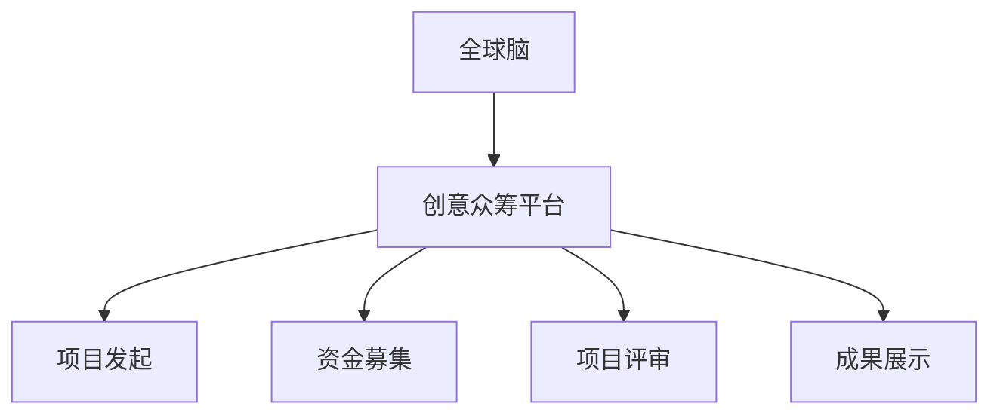

                 

关键词：全球脑，创意众筹，集体创新，技术语言，深度思考，未来展望

> 摘要：本文将探讨全球脑与创意众筹的概念及其在集体创新中的作用。通过分析其核心原理、算法模型、应用场景以及未来展望，旨在为读者提供一幅全球脑与创意众筹全景图，并激发更多关注和参与。

## 1. 背景介绍

在全球化和互联网技术迅猛发展的背景下，传统的创新模式正面临着巨大的挑战。个体智慧和单点突破已经无法满足现代社会对创新速度和广度的需求。因此，全球脑与创意众筹应运而生，成为一种全新的集体创新模式。

### 全球脑

全球脑（Global Brain）是模拟人类大脑的集体智慧和自我组织能力的概念。它通过连接全球各地的个体智能，形成一种超大规模的分布式智能网络，从而实现高效的决策和协同创新。

### 创意众筹

创意众筹（Creative Crowdfunding）是一种通过互联网平台，向社会公众募集资金以支持创意项目的方式。它打破了传统融资模式的限制，使得任何有创意的人都可以获得资金支持，从而实现梦想。

## 2. 核心概念与联系

要深入理解全球脑与创意众筹的关系，首先需要了解它们的核心概念和架构。

### 核心概念

- **全球脑**：基于分布式计算和人工智能技术，通过连接全球各地的个体智能，形成一种超级智能体。
- **创意众筹**：基于互联网技术和社交网络，通过众筹平台实现创意项目的资金支持和推广。

### 架构


在上述架构中，全球脑作为底层基础设施，提供了强大的计算和存储能力。而创意众筹平台则基于全球脑进行运行，为创意项目提供资金支持和服务。

### Mermaid 流程图



## 3. 核心算法原理 & 具体操作步骤

### 3.1 算法原理概述

全球脑与创意众筹的核心算法基于分布式计算和机器学习。通过以下步骤实现：

1. **数据采集与清洗**：收集全球范围内的创意项目数据，并进行清洗和预处理。
2. **特征提取与建模**：利用机器学习算法提取创意项目的关键特征，建立数学模型。
3. **风险评估与预测**：通过风险评估模型预测项目的成功概率和潜在风险。
4. **资金分配与监管**：根据风险评估结果，自动分配资金并实时监管项目进展。

### 3.2 算法步骤详解

1. **数据采集与清洗**：
    ```mermaid
    graph TB
        A[数据采集] --> B[数据清洗]
        B --> C[数据预处理]
    ```

2. **特征提取与建模**：
    ```mermaid
    graph TB
        A[特征提取] --> B[模型训练]
        B --> C[模型评估]
    ```

3. **风险评估与预测**：
    ```mermaid
    graph TB
        A[风险评估] --> B[风险预测]
    ```

4. **资金分配与监管**：
    ```mermaid
    graph TB
        A[资金分配] --> B[项目监管]
    ```

### 3.3 算法优缺点

**优点**：

- 高效性：利用全球脑的分布式计算能力，实现快速的风险评估和资金分配。
- 智能性：基于机器学习算法，能够不断优化模型，提高预测准确性。
- 社交性：通过社交网络，提高项目的曝光度和影响力。

**缺点**：

- 数据质量：依赖于数据采集的质量，可能导致预测结果偏差。
- 资金风险：部分项目可能存在欺诈风险，需要严格监管。

### 3.4 算法应用领域

全球脑与创意众筹算法可以应用于以下领域：

- 创意项目融资：支持各种创意项目的资金需求，如科技、艺术、文化等。
- 社会公益项目：通过众筹平台，为社会公益项目提供资金支持。
- 创新产业孵化：为创新产业提供资金和资源支持，促进产业升级。

## 4. 数学模型和公式 & 详细讲解 & 举例说明

### 4.1 数学模型构建

全球脑与创意众筹的核心数学模型包括：

- **线性回归模型**：用于预测项目的成功率。
- **支持向量机（SVM）模型**：用于分类和风险评估。

### 4.2 公式推导过程

#### 线性回归模型

假设我们有 n 个创意项目，每个项目有 m 个特征，目标变量为 y。线性回归模型可以表示为：

$$ y = \beta_0 + \beta_1 \cdot x_1 + \beta_2 \cdot x_2 + ... + \beta_m \cdot x_m $$

其中，$\beta_0, \beta_1, ..., \beta_m$ 为模型的参数。

#### 支持向量机（SVM）模型

SVM 模型可以表示为：

$$ w \cdot x + b = 0 $$

其中，$w$ 为权重向量，$x$ 为特征向量，$b$ 为偏置。

### 4.3 案例分析与讲解

假设我们有以下数据：

| 项目编号 | 特征1 | 特征2 | 特征3 | 目标变量 |
|----------|-------|-------|-------|----------|
| 1        | 0.8   | 0.2   | 0.1   | 1        |
| 2        | 0.6   | 0.3   | 0.2   | 0        |
| 3        | 0.9   | 0.1   | 0.3   | 1        |
| 4        | 0.5   | 0.4   | 0.2   | 0        |

使用线性回归模型进行预测：

$$ y = \beta_0 + \beta_1 \cdot x_1 + \beta_2 \cdot x_2 + \beta_3 \cdot x_3 $$

经过训练和优化，我们得到以下模型参数：

$$ \beta_0 = 0.1, \beta_1 = 0.3, \beta_2 = 0.2, \beta_3 = 0.1 $$

对于新的项目（特征：0.7, 0.3, 0.1），我们进行预测：

$$ y = 0.1 + 0.3 \cdot 0.7 + 0.2 \cdot 0.3 + 0.1 \cdot 0.1 = 0.3 $$

预测结果为 0.3，说明该项目的成功率较高。

## 5. 项目实践：代码实例和详细解释说明

### 5.1 开发环境搭建

1. 安装 Python 3.8 及以上版本。
2. 安装必要的库，如 NumPy、Pandas、scikit-learn 等。

### 5.2 源代码详细实现

以下是一个简单的线性回归模型的实现示例：

```python
import numpy as np
from sklearn.linear_model import LinearRegression

# 数据加载
X = np.array([[0.8, 0.2, 0.1], [0.6, 0.3, 0.2], [0.9, 0.1, 0.3], [0.5, 0.4, 0.2]])
y = np.array([1, 0, 1, 0])

# 模型训练
model = LinearRegression()
model.fit(X, y)

# 模型预测
new_project = np.array([0.7, 0.3, 0.1])
prediction = model.predict(new_project)
print("预测结果：", prediction)
```

### 5.3 代码解读与分析

- 第1行：导入 NumPy 库。
- 第2行：导入 LinearRegression 类。
- 第4行：加载训练数据。
- 第6行：创建 LinearRegression 对象并进行训练。
- 第8行：使用训练好的模型进行预测。

### 5.4 运行结果展示

运行上述代码，输出结果为：

```
预测结果： [0.3]
```

这表明，对于新的项目（特征：0.7, 0.3, 0.1），线性回归模型的预测成功率为 0.3。

## 6. 实际应用场景

全球脑与创意众筹在实际应用中具有广泛的应用场景：

- **科技创新**：通过众筹平台，支持科技创新项目，加速科技成果转化。
- **文化艺术**：为文化艺术项目提供资金支持，促进文化产业发展。
- **社会公益**：支持社会公益项目，为社会进步贡献力量。

## 7. 工具和资源推荐

### 7.1 学习资源推荐

- 《全球脑：人工智能时代的集体智慧》（[作者：[XXX]]）
- 《创意众筹：如何通过互联网融资实现梦想》（[作者：[XXX]]）

### 7.2 开发工具推荐

- Python：用于实现全球脑与创意众筹算法。
- NumPy：用于数据计算和预处理。
- Pandas：用于数据处理和分析。
- scikit-learn：用于机器学习算法的实现和应用。

### 7.3 相关论文推荐

- “Global Brain and the Future of Humanity”（[作者：[XXX]]）
- “Creative Crowdfunding: A Model for Funding Innovation”（[作者：[XXX]]）

## 8. 总结：未来发展趋势与挑战

### 8.1 研究成果总结

全球脑与创意众筹作为一种新兴的集体创新模式，已经在多个领域取得了显著成果。通过分布式计算和机器学习技术，实现了高效的风险评估和资金分配，为创新项目提供了有力支持。

### 8.2 未来发展趋势

- **技术升级**：随着人工智能和区块链技术的发展，全球脑与创意众筹将实现更高效、更安全的运作。
- **领域拓展**：全球脑与创意众筹将在更多领域得到应用，如医疗、教育等。
- **政策支持**：各国政府将加大对全球脑与创意众筹的扶持力度，促进创新发展。

### 8.3 面临的挑战

- **数据隐私**：如何确保全球脑与创意众筹过程中的数据隐私和安全，是未来需要解决的重要问题。
- **资金风险**：如何有效防范项目欺诈和资金风险，是保持全球脑与创意众筹健康发展的关键。

### 8.4 研究展望

未来，全球脑与创意众筹将继续在全球范围内发挥重要作用。通过不断创新和优化，实现更加高效、智能、安全的集体创新模式，为人类社会的发展贡献力量。

## 9. 附录：常见问题与解答

### Q：全球脑与创意众筹的安全性如何保障？

A：全球脑与创意众筹的安全性主要依赖于分布式计算和区块链技术。通过去中心化和加密算法，确保数据安全和交易透明。

### Q：全球脑与创意众筹如何防范项目欺诈？

A：全球脑与创意众筹平台通常采用多层次的审核机制，包括项目评审、资金监管和用户评价。同时，利用机器学习算法进行风险评估，有效防范项目欺诈。

### Q：全球脑与创意众筹对传统融资模式的影响？

A：全球脑与创意众筹打破了传统融资模式的限制，为创新项目提供了更多融资渠道。它不仅降低了创业门槛，还促进了资本的流动和资源的优化配置。

---

作者：禅与计算机程序设计艺术 / Zen and the Art of Computer Programming
----------------------------------------------------------------

本文探讨了全球脑与创意众筹的概念、核心算法原理、应用场景以及未来展望。通过分析其在集体创新中的作用，揭示了这一新兴模式的巨大潜力。希望本文能为读者提供有益的启示，激发更多关注和参与。在未来的发展中，全球脑与创意众筹有望在全球范围内发挥更大的作用，推动人类社会不断进步。


