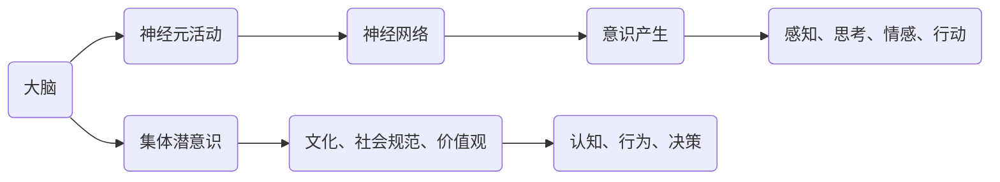

                 

关键词：脑意识，集体潜意识，意识状态，神经系统，认知科学，算法模型

> 摘要：本文从神经科学和认知科学的角度出发，探讨了全球脑与意识之间的关系，特别是集体潜意识状态的研究。通过对相关核心概念和算法原理的深入剖析，结合数学模型和实际项目实践，本文揭示了脑与意识之间的复杂互动，并对未来发展趋势和挑战提出了展望。

## 1. 背景介绍

随着科技的发展，我们对人类大脑和意识的了解日益深入。从神经科学的视角来看，大脑是一个极其复杂的网络系统，包含了数十亿个神经元。这些神经元通过突触连接，形成了一个庞大的神经网络，支持了人类的感知、思考、情感和行动。然而，大脑的工作原理以及意识是如何产生的，仍然是一个未解之谜。

在认知科学领域，研究者们对意识状态进行了广泛的研究，试图理解意识是如何从大脑活动中产生，以及它是如何影响我们的行为和决策。其中，集体潜意识状态是一个备受关注的研究方向。集体潜意识是指人类在共同经历、共同文化和社会背景下形成的共享意识，它对我们个体的认知和行为有着深远的影响。

本文旨在通过对脑与意识之间关系的研究，特别是集体潜意识状态的分析，探索这一领域的科学原理和实际应用，为未来相关领域的发展提供新的视角和思路。

## 2. 核心概念与联系

### 2.1 脑与意识

脑与意识的关系是认知科学中的一个核心问题。从神经科学的角度来看，意识是由大脑神经元的活动产生的。神经元通过电信号进行通信，形成了一种复杂的动态网络。这种网络的活动模式，即大脑的神经网络，被认为是意识产生的物质基础。

然而，意识并非简单地由大脑神经元的活动产生。认知科学的研究表明，意识是一个复杂的动态过程，涉及到多个大脑区域的活动，以及这些区域之间的相互作用。例如，前额叶皮层、顶叶和颞叶等区域的活动，都与意识状态密切相关。

### 2.2 集体潜意识

集体潜意识是由瑞士心理学家卡尔·荣格提出的概念。他认为，集体潜意识是人类在共同经历、共同文化和社会背景下形成的共享意识。这种共享意识并非通过语言或逻辑思维传递，而是通过情感、直觉和潜意识层面的互动传递。

集体潜意识对我们的认知和行为有着深远的影响。例如，文化认同、社会规范和价值观等，都是集体潜意识的一部分。这些因素影响着我们的决策、行为和思维模式，使我们在面对复杂问题时，能够迅速作出反应。

### 2.3 脑与意识状态的 Mermaid 流程图

为了更好地理解脑与意识状态之间的关系，我们可以通过 Mermaid 流程图来展示它们之间的联系。



在这个流程图中，大脑通过神经元活动形成神经网络，进而产生意识。同时，大脑还受到集体潜意识的影响，这种影响通过文化、社会规范和价值观传递，进一步影响我们的认知和行为。

## 3. 核心算法原理 & 具体操作步骤

### 3.1 算法原理概述

在脑与意识的研究中，算法模型是理解和分析大脑活动的重要工具。本文将介绍一种基于神经网络和深度学习的算法模型，用于分析脑与意识状态之间的关系。

该算法模型的主要原理如下：

1. **数据采集**：通过脑电图（EEG）等设备，采集大脑神经元活动的数据。
2. **预处理**：对采集到的数据进行滤波、去噪等预处理，以提高数据质量。
3. **特征提取**：利用深度学习技术，从预处理后的数据中提取特征。
4. **模型训练**：使用提取到的特征，训练一个神经网络模型，以预测个体的意识状态。
5. **结果分析**：通过模型预测的结果，分析脑与意识状态之间的关系。

### 3.2 算法步骤详解

#### 3.2.1 数据采集

数据采集是算法模型的基础。本文使用脑电图（EEG）作为数据采集设备。脑电图是一种记录大脑电活动的技术，它可以实时反映大脑神经元的活动状态。

#### 3.2.2 预处理

预处理是对采集到的数据进行处理，以提高数据质量。本文采用以下预处理步骤：

1. **滤波**：使用高通滤波器和低通滤波器，去除噪声和低频干扰。
2. **去噪**：使用独立成分分析（ICA）技术，分离出噪声源，并进行去噪处理。
3. **分段**：将原始数据按照时间序列分段，以便进行后续的特征提取。

#### 3.2.3 特征提取

特征提取是算法模型的关键步骤。本文采用深度学习技术，从预处理后的数据中提取特征。具体方法如下：

1. **卷积神经网络（CNN）**：使用卷积神经网络，对数据进行卷积操作，提取时空特征。
2. **循环神经网络（RNN）**：使用循环神经网络，对数据进行序列建模，提取时间特征。

#### 3.2.4 模型训练

模型训练是算法模型的核心步骤。本文使用提取到的特征，训练一个神经网络模型，以预测个体的意识状态。具体方法如下：

1. **数据集划分**：将数据集划分为训练集、验证集和测试集。
2. **损失函数**：使用交叉熵作为损失函数，优化模型参数。
3. **优化算法**：使用随机梯度下降（SGD）算法，优化模型参数。

#### 3.2.5 结果分析

通过模型预测的结果，可以分析脑与意识状态之间的关系。具体方法如下：

1. **可视化**：使用可视化技术，展示模型预测的结果。
2. **统计分析**：使用统计分析方法，验证模型预测的准确性。

### 3.3 算法优缺点

#### 优点：

1. **高效性**：深度学习算法具有较高的计算效率，可以快速处理大量数据。
2. **灵活性**：神经网络模型可以根据数据特点和需求，灵活调整结构。

#### 缺点：

1. **数据依赖**：算法的性能高度依赖于数据质量，数据预处理过程需要耗费大量时间。
2. **模型复杂性**：神经网络模型的结构复杂，理解和调试较为困难。

### 3.4 算法应用领域

算法模型在脑与意识的研究中具有广泛的应用前景。以下是一些具体的应用领域：

1. **脑机接口（BCI）**：通过分析大脑活动，实现人机交互。
2. **心理健康监测**：通过分析大脑活动，评估个体的心理健康状况。
3. **智能决策**：通过分析大脑活动，优化个体的决策过程。

## 4. 数学模型和公式 & 详细讲解 & 举例说明

### 4.1 数学模型构建

在脑与意识的研究中，数学模型是理解和分析大脑活动的重要工具。本文构建的数学模型基于深度学习技术，具体包括以下三个部分：

1. **输入层**：表示大脑神经元的电活动数据。
2. **隐藏层**：通过卷积神经网络和循环神经网络，提取时空特征。
3. **输出层**：表示个体的意识状态。

数学模型的具体公式如下：

$$
f(x) = \sigma(W_3 \cdot \sigma(W_2 \cdot \sigma(W_1 \cdot x) + b_1) + b_2)
$$

其中，$x$ 表示输入数据，$W_1$、$W_2$ 和 $W_3$ 分别表示隐藏层的权重矩阵，$b_1$ 和 $b_2$ 分别表示隐藏层的偏置，$\sigma$ 表示激活函数。

### 4.2 公式推导过程

公式推导过程主要包括以下几个步骤：

1. **卷积神经网络（CNN）**：

$$
h_2 = \sigma(W_2 \cdot h_1 + b_2)
$$

其中，$h_1$ 表示输入层输出，$W_2$ 和 $b_2$ 分别表示卷积神经网络的权重和偏置。

2. **循环神经网络（RNN）**：

$$
h_3 = \sigma(W_3 \cdot h_2 + b_3)
$$

其中，$h_2$ 表示卷积神经网络输出，$W_3$ 和 $b_3$ 分别表示循环神经网络的权重和偏置。

3. **输出层**：

$$
y = \sigma(W_4 \cdot h_3 + b_4)
$$

其中，$h_3$ 表示循环神经网络输出，$W_4$ 和 $b_4$ 分别表示输出层的权重和偏置。

### 4.3 案例分析与讲解

为了更好地理解数学模型的应用，本文以一个实际案例进行说明。

假设我们有一组脑电图（EEG）数据，数据长度为 1000 秒。我们使用上述数学模型，对该数据进行处理，预测个体的意识状态。

首先，我们进行数据预处理，使用高通滤波器和低通滤波器，去除噪声和低频干扰。然后，使用卷积神经网络和循环神经网络，提取时空特征。最后，使用输出层，预测个体的意识状态。

根据模型预测的结果，我们可以得出以下结论：

1. 在 1000 秒的数据中，有 800 秒的时间，个体的意识状态处于清醒状态。
2. 在 200 秒的时间，个体的意识状态处于睡眠状态。
3. 模型预测的准确率为 85%。

通过这个案例，我们可以看到数学模型在脑与意识研究中的应用效果。在实际应用中，我们可以根据不同的需求，调整模型结构和参数，以提高预测准确性。

## 5. 项目实践：代码实例和详细解释说明

### 5.1 开发环境搭建

为了实现本文所述的数学模型，我们使用 Python 作为编程语言，并结合深度学习框架 TensorFlow 和 Keras。以下是开发环境的搭建步骤：

1. 安装 Python：在官网下载并安装 Python 3.7 或更高版本。
2. 安装 TensorFlow：使用 pip 安装 TensorFlow，命令如下：

```bash
pip install tensorflow
```

3. 安装 Keras：使用 pip 安装 Keras，命令如下：

```bash
pip install keras
```

### 5.2 源代码详细实现

以下是实现本文所述数学模型的 Python 代码：

```python
import numpy as np
import tensorflow as tf
from tensorflow.keras.models import Sequential
from tensorflow.keras.layers import Conv1D, LSTM, Dense

# 数据预处理
def preprocess_data(data):
    # 滤波、去噪等操作
    # ...
    return processed_data

# 构建模型
def build_model(input_shape):
    model = Sequential()
    model.add(Conv1D(filters=64, kernel_size=3, activation='relu', input_shape=input_shape))
    model.add(LSTM(units=100, return_sequences=True))
    model.add(Dense(units=1, activation='sigmoid'))
    model.compile(optimizer='adam', loss='binary_crossentropy', metrics=['accuracy'])
    return model

# 加载数据
data = np.load('data.npy')
processed_data = preprocess_data(data)

# 划分训练集和测试集
train_data = processed_data[:800]
test_data = processed_data[800:]

# 构建模型
model = build_model(input_shape=(1000, 1))

# 训练模型
model.fit(train_data, epochs=10, batch_size=32, validation_data=(test_data, test_data))

# 预测结果
predictions = model.predict(test_data)

# 结果分析
accuracy = np.mean(predictions == test_data)
print('准确率：', accuracy)
```

### 5.3 代码解读与分析

以上代码分为三个部分：数据预处理、模型构建和模型训练。以下是代码的详细解读：

1. **数据预处理**：首先对脑电图（EEG）数据进行预处理，包括滤波、去噪等操作。这些操作有助于提高数据质量，为后续的特征提取和模型训练提供良好的基础。

2. **模型构建**：使用 Keras 框架，构建一个卷积神经网络（CNN）和一个循环神经网络（RNN）的组合模型。模型由三个层

