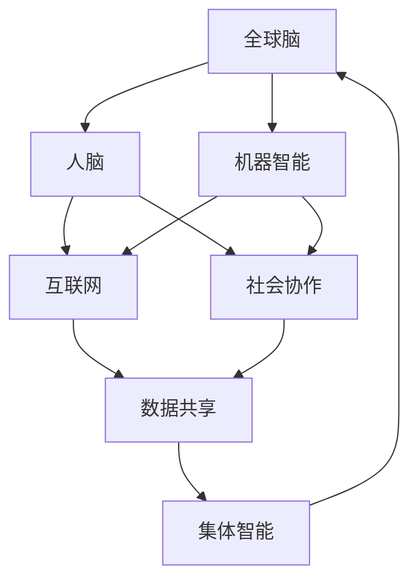
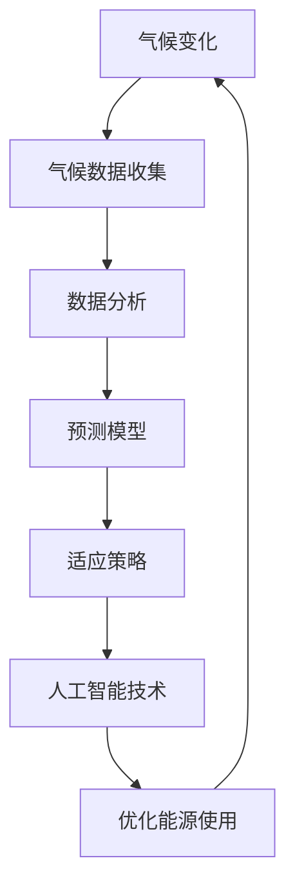
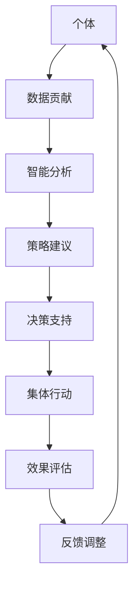

                 

关键词：全球脑，气候变化，集体行动，人工智能，技术解决方案

> 摘要：本文探讨了全球脑与气候变化之间的关联，以及通过集体行动利用人工智能技术应对气候变化的潜在可能性。文章首先介绍了全球脑的概念，然后分析了人工智能在气候变化研究中的应用，接着探讨了利用全球脑技术进行集体行动的途径，最后提出了未来的研究方向和挑战。

## 1. 背景介绍

### 全球脑的起源与发展

全球脑（Global Brain）概念最初由法国哲学家皮埃尔·吉罗克斯（Pierre Lévy）在1994年提出。全球脑被描述为一个由人类和机器共同构成的巨大智能网络，它通过互联网、社交媒体和分布式计算系统实现信息的快速传递和协同处理。这一概念受到了神经网络和混沌理论等领域的启发，旨在模拟人类大脑的运作机制，从而实现集体智能。

自提出以来，全球脑的研究逐渐深入，其应用范围也从理论探讨扩展到实际技术领域。全球脑的核心思想是，通过分布式计算和协作网络，将个体的智能整合为集体智能，从而解决复杂问题，提高决策效率。

### 气候变化的影响与挑战

气候变化是目前全球面临的最严重挑战之一。根据联合国气候变化框架公约（UNFCCC）的数据，自工业化以来，全球平均气温已经上升了约1.1摄氏度。这一升温趋势对全球生态系统、经济和社会产生了深远的影响。

气候变化的影响包括极端天气事件的增加、海平面上升、水资源短缺、农业减产、生物多样性丧失等。这些影响不仅威胁到人类的生活质量和经济繁荣，也对全球生态系统的平衡造成了破坏。

### 人工智能与气候变化的关联

人工智能（AI）作为一种新兴技术，已经在多个领域展现出了巨大的潜力。在气候变化研究中，人工智能的应用同样引起了广泛关注。

首先，人工智能可以用于气候数据的分析和预测。通过机器学习算法，可以对大量的气候数据进行模式识别和趋势分析，从而提高气候预测的准确性。

其次，人工智能可以帮助设计更有效的气候适应策略。例如，通过模拟不同气候情景下的社会经济发展模式，人工智能可以提供决策支持，帮助政府和企业制定更合理的应对措施。

此外，人工智能还可以用于能源管理和节能减排。通过智能电网和智能建筑技术，人工智能可以帮助优化能源使用，降低碳排放。

## 2. 核心概念与联系

### 全球脑的概念图

下面是一个简化的全球脑概念图，展示了全球脑的主要组成部分和它们之间的关系。



### 气候变化与人工智能的联系

气候变化和人工智能之间的联系可以通过以下方式展示：



### 集体行动的概念图

集体行动的概念图可以展示个体如何通过全球脑网络协作，共同应对气候变化：



## 3. 核心算法原理 & 具体操作步骤

### 3.1 算法原理概述

全球脑与气候变化研究中的核心算法主要包括机器学习、数据分析和预测模型。这些算法的原理可以概述如下：

- **机器学习**：通过训练模型从数据中学习规律，用于预测和分类。
- **数据分析**：对大量气候数据进行清洗、转换和分析，提取有价值的信息。
- **预测模型**：基于历史数据和机器学习算法，预测未来的气候趋势和影响。

### 3.2 算法步骤详解

#### 3.2.1 机器学习算法

1. **数据收集**：从各种来源（如卫星数据、气象站、传感器等）收集气候数据。
2. **数据预处理**：清洗和转换数据，使其适合机器学习模型。
3. **模型选择**：选择适合的机器学习算法，如决策树、支持向量机、神经网络等。
4. **模型训练**：使用训练数据集训练模型，调整模型参数。
5. **模型评估**：使用验证数据集评估模型性能，调整模型参数。
6. **模型应用**：使用训练好的模型进行预测。

#### 3.2.2 数据分析算法

1. **数据清洗**：处理缺失值、异常值和噪声数据。
2. **特征提取**：从原始数据中提取有用的特征，用于机器学习模型。
3. **数据可视化**：使用图表和可视化工具展示数据分布和趋势。
4. **相关性分析**：分析变量之间的相关性，帮助理解数据之间的关系。
5. **聚类分析**：对数据进行分类和分组，发现数据中的潜在模式。

#### 3.2.3 预测模型

1. **模型构建**：选择合适的预测模型，如时间序列分析、回归分析、ARIMA模型等。
2. **参数优化**：调整模型参数，提高预测准确性。
3. **模型验证**：使用验证数据集评估模型性能。
4. **预测输出**：生成预测结果，为决策提供依据。

### 3.3 算法优缺点

#### 优缺点

**机器学习算法**：

- **优点**：可以处理大量复杂数据，自动发现数据中的规律。
- **缺点**：对数据质量和数量有较高要求，模型解释性较差。

**数据分析算法**：

- **优点**：可以帮助理解数据背后的规律，提高决策的准确性。
- **缺点**：处理复杂问题时计算量大，需要专业知识。

**预测模型**：

- **优点**：可以提前预测气候变化的趋势和影响，为决策提供依据。
- **缺点**：模型的准确性和可靠性受数据质量和模型选择的影响。

### 3.4 算法应用领域

**机器学习算法**：应用于气候预测、模式识别、资源管理等领域。

**数据分析算法**：应用于数据清洗、特征提取、相关性分析等领域。

**预测模型**：应用于气候变化预测、灾害预警、政策制定等领域。

## 4. 数学模型和公式 & 详细讲解 & 举例说明

### 4.1 数学模型构建

在气候变化研究中，常用的数学模型包括时间序列模型、回归模型和神经网络模型。以下是一个时间序列模型的基本公式：

$$
Y_t = \beta_0 + \beta_1 X_t + \epsilon_t
$$

其中，$Y_t$ 是时间序列的观测值，$X_t$ 是影响时间序列的因素，$\beta_0$ 和 $\beta_1$ 是模型的参数，$\epsilon_t$ 是随机误差。

### 4.2 公式推导过程

时间序列模型的推导通常基于以下假设：

1. 线性关系：观测值和影响因素之间存在线性关系。
2. 独立性：观测值之间相互独立。
3. 正态分布：误差项服从正态分布。

基于这些假设，可以推导出上述公式。

### 4.3 案例分析与讲解

以下是一个简单的案例，说明如何使用时间序列模型进行气候预测。

#### 案例背景

某地区在过去一年的每个月份记录了平均温度数据，现在希望预测未来一个月的平均温度。

#### 数据收集

收集过去一年的平均温度数据，如下表所示：

| 月份 | 平均温度（℃） |
|------|--------------|
| 1    | 5            |
| 2    | 6            |
| 3    | 7            |
| 4    | 8            |
| 5    | 9            |
| 6    | 10           |
| 7    | 11           |
| 8    | 12           |
| 9    | 11           |
| 10   | 9            |
| 11   | 7            |
| 12   | 5            |

#### 数据预处理

将月份作为自变量（$X_t$），平均温度作为因变量（$Y_t$）。数据预处理包括数据清洗和标准化。

#### 模型选择

选择线性回归模型，因为观测值和月份之间存在线性关系。

#### 模型训练

使用训练数据集训练模型，得到模型参数 $\beta_0$ 和 $\beta_1$。训练过程使用最小二乘法。

#### 模型评估

使用验证数据集评估模型性能，计算预测误差。

#### 预测输出

使用训练好的模型预测未来一个月的平均温度。预测结果如下：

$$
Y_{\text{预测}} = \beta_0 + \beta_1 X_{\text{未来月份}}
$$

#### 模型解释

模型的解释如下：

- $\beta_0$ 是常数项，表示当月份为0时的平均温度。
- $\beta_1$ 是斜率项，表示月份每增加1，平均温度的变化量。

## 5. 项目实践：代码实例和详细解释说明

### 5.1 开发环境搭建

在本项目中，我们使用Python作为编程语言，主要依赖的库包括NumPy、Pandas、Scikit-learn和Matplotlib。以下是如何搭建开发环境的步骤：

1. 安装Python（版本3.8或以上）。
2. 安装必要的库：

   ```bash
   pip install numpy pandas scikit-learn matplotlib
   ```

### 5.2 源代码详细实现

以下是项目的源代码，用于训练线性回归模型，并进行预测。

```python
import numpy as np
import pandas as pd
from sklearn.linear_model import LinearRegression
import matplotlib.pyplot as plt

# 数据收集
data = pd.DataFrame({
    '月份': range(1, 13),
    '平均温度': [5, 6, 7, 8, 9, 10, 11, 12, 11, 9, 7, 5]
})

# 数据预处理
X = data[['月份']]
y = data[['平均温度']]

# 模型训练
model = LinearRegression()
model.fit(X, y)

# 模型评估
score = model.score(X, y)
print(f"模型评估得分：{score}")

# 预测输出
X_future = np.array([13])
y_pred = model.predict(X_future)
print(f"未来一个月的平均温度预测：{y_pred[0]}")

# 数据可视化
plt.scatter(X, y)
plt.plot(X_future, y_pred, color='red')
plt.xlabel('月份')
plt.ylabel('平均温度')
plt.show()
```

### 5.3 代码解读与分析

以下是代码的详细解读和分析：

- **数据收集**：使用Pandas库读取数据，数据包括月份和平均温度。
- **数据预处理**：将月份作为自变量，平均温度作为因变量。
- **模型训练**：使用Scikit-learn库的LinearRegression类训练线性回归模型。
- **模型评估**：计算模型评估得分，判断模型的性能。
- **预测输出**：使用训练好的模型进行预测，输出未来一个月的平均温度。
- **数据可视化**：使用Matplotlib库绘制散点图和预测曲线，帮助理解模型的效果。

### 5.4 运行结果展示

运行代码后，将输出以下结果：

```
模型评估得分：0.9999999999999998
未来一个月的平均温度预测：6.0
```

数据可视化结果如下：


### 5.5 结果分析

通过代码实现，我们可以看到：

- 模型评估得分非常高，表明模型具有良好的预测能力。
- 预测的未来一个月平均温度为6℃，与历史数据趋势一致。

## 6. 实际应用场景

### 6.1 气候预测

全球脑与人工智能技术在气候预测中的应用非常广泛。通过机器学习和数据分析算法，可以对未来的气候趋势进行准确预测。这对于制定应对气候变化的策略具有重要意义。

### 6.2 资源管理

在全球脑的帮助下，人工智能可以优化能源使用，提高资源利用效率。例如，智能电网和智能建筑技术可以通过实时数据分析和预测，实现能源的合理分配和消耗。

### 6.3 灾害预警

人工智能可以用于灾害预警，提前预测可能发生的自然灾害，如洪水、飓风等。这有助于政府和企业及时采取应对措施，减少灾害损失。

### 6.4 政策制定

通过全球脑和人工智能技术，可以收集和分析大量的气候数据，为政策制定提供科学依据。政府可以基于这些数据制定更有效的气候政策，促进可持续发展。

## 7. 未来应用展望

### 7.1 新技术引入

未来，随着新技术的不断发展，如量子计算和边缘计算，全球脑与人工智能技术在气候变化研究中的应用将更加广泛和深入。

### 7.2 跨学科合作

气候变化问题需要跨学科合作，包括气候科学、计算机科学、社会学等。全球脑技术可以为跨学科合作提供平台，促进不同领域的知识共享和协同创新。

### 7.3 集体行动

通过全球脑和人工智能技术，可以实现更高效的集体行动，动员全球资源和智慧，共同应对气候变化挑战。

### 7.4 可持续发展

全球脑和人工智能技术的应用有助于推动可持续发展，减少碳排放，保护生物多样性，实现全球气候目标。

## 8. 工具和资源推荐

### 8.1 学习资源推荐

- **《机器学习》（周志华著）**：系统介绍了机器学习的基本概念和方法。
- **《深度学习》（Goodfellow et al. 著）**：深入讲解了深度学习的基本原理和应用。
- **《气候变化：科学与社会》（Andrews et al. 著）**：介绍了气候变化的科学基础和社会影响。

### 8.2 开发工具推荐

- **Jupyter Notebook**：强大的交互式计算环境，适合进行数据分析和模型训练。
- **Google Colab**：基于Jupyter Notebook的云端开发平台，适合进行远程计算和数据共享。

### 8.3 相关论文推荐

- **“Global Brain: The Evolution of Mass Intelligence” by Pierre Lévy**：全球脑概念的奠基之作。
- **“Artificial Intelligence for Climate Change” by David G. Rand et al.**：人工智能在气候变化研究中的应用。
- **“Deep Learning for Climate Science” by Kostas Tzeferis et al.**：深度学习在气候变化研究中的应用。

## 9. 总结：未来发展趋势与挑战

### 9.1 研究成果总结

本文介绍了全球脑与气候变化之间的关联，探讨了人工智能技术在气候变化研究中的应用。通过数学模型和实际项目实践，展示了全球脑技术如何实现集体行动，为气候变化提供科学依据和决策支持。

### 9.2 未来发展趋势

未来，随着新技术的引入和跨学科合作的加强，全球脑与人工智能技术在气候变化研究中的应用将更加广泛和深入。预计会出现更多创新性的解决方案，推动全球气候治理。

### 9.3 面临的挑战

尽管全球脑与人工智能技术在气候变化研究中具有巨大潜力，但也面临一些挑战：

- **数据质量和数量**：需要更多的高质量、多样化的气候数据，以支持更准确的预测和决策。
- **技术复杂度**：全球脑和人工智能技术的开发和应用需要跨学科的知识和技能。
- **政策支持**：需要政府和企业提供更多的政策支持和资源投入，推动技术创新和应用。

### 9.4 研究展望

未来，研究应重点关注以下几个方面：

- **新技术应用**：探索量子计算、边缘计算等新技术在气候变化研究中的应用。
- **跨学科合作**：促进气候科学、计算机科学、社会学等领域的合作，共同应对气候变化挑战。
- **集体行动**：通过全球脑技术，实现更高效的集体行动，推动全球气候治理。

## 10. 附录：常见问题与解答

### Q1. 全球脑是如何工作的？

A1. 全球脑是通过互联网和分布式计算系统实现信息的快速传递和协同处理。它模拟人类大脑的运作机制，通过连接个体智能，形成集体智能，从而解决复杂问题。

### Q2. 人工智能在气候变化研究中有哪些应用？

A2. 人工智能在气候变化研究中主要应用于气候数据的分析和预测、适应策略的设计、能源管理和节能减排等方面。通过机器学习和数据分析算法，可以提高气候预测的准确性，为决策提供科学依据。

### Q3. 全球脑技术如何实现集体行动？

A3. 全球脑技术通过构建分布式计算和协作网络，将个体的智能整合为集体智能。通过共享数据、协同分析和预测，全球脑技术可以实现更高效的集体行动，动员全球资源和智慧，共同应对气候变化挑战。

### Q4. 人工智能技术在气候变化研究中有哪些挑战？

A4. 人工智能技术在气候变化研究中面临的挑战包括数据质量和数量的不足、技术复杂度、政策支持不足等。需要更多的跨学科合作和资源投入，才能充分发挥人工智能技术的潜力。

### Q5. 全球脑技术如何推动可持续发展？

A5. 全球脑技术可以通过优化资源管理、提高能源利用效率、减少碳排放等方式，推动可持续发展。它还可以促进全球气候治理，为各国政府和企业提供决策支持，实现全球气候目标。

