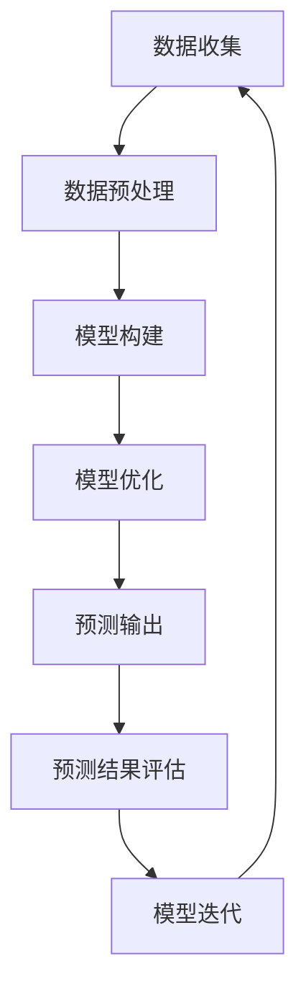
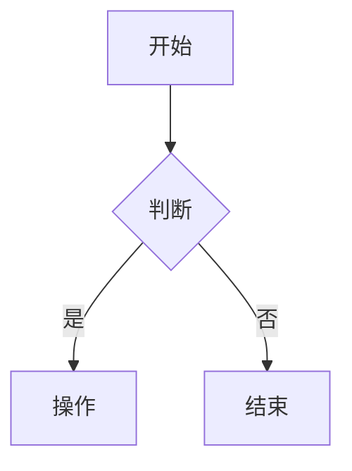

                 

关键词：全球脑，气候模拟，集体智慧，环境预测，技术架构，算法设计，数学模型，应用案例

> 摘要：本文探讨了全球脑与气候模拟的结合，通过集体智慧的方法提升环境预测的准确性。我们介绍了核心概念、算法原理，并分析了其在不同领域的应用。通过数学模型的构建和具体案例的解析，展示了这一技术的实际效用。最后，我们对未来发展的趋势和挑战进行了展望。

## 1. 背景介绍

随着全球气候变化问题的日益严峻，准确的环境预测变得至关重要。传统的气象模型和预测方法虽然取得了一定的成果，但仍存在局限性。例如，模型的精度受到数据质量和计算能力的制约，而气候系统的复杂性和不确定性也使得预测结果存在很大的不确定性。

近年来，随着人工智能技术的发展，尤其是深度学习和分布式计算的应用，为环境预测带来了新的可能性。全球脑（Global Brain）的概念也逐渐受到关注。全球脑是一个基于网络的大规模分布式智能系统，它通过信息的共享和协同工作，实现了知识的积累和智能的提升。

本文旨在探讨全球脑与气候模拟的结合，利用集体智慧的方法，提升环境预测的准确性。通过构建数学模型，实现算法的具体操作步骤，我们希望为气候预测提供一种新的思路和方法。

## 2. 核心概念与联系

### 2.1 全球脑

全球脑是一个基于互联网的大规模分布式智能系统，它通过节点之间的信息交换和协同工作，实现了知识的积累和智能的提升。全球脑的核心概念包括信息共享、协同工作和智能涌现。信息共享是指全球脑中的各个节点能够自由地交换信息，协同工作是指节点之间通过合作和协调，共同完成任务，智能涌现是指全球脑通过大规模的信息处理和协同工作，能够产生出超越个体智能的集体智能。

### 2.2 气候模拟

气候模拟是一种通过数学模型和计算模拟方法，对气候系统进行模拟和预测的方法。气候模拟的核心在于构建气候系统模型，该模型需要能够准确描述气候系统的物理、化学和生物过程。气候模拟的关键技术包括数据同化、数值模拟和高性能计算。

### 2.3 全球脑与气候模拟的联系

全球脑与气候模拟的结合在于利用全球脑的信息共享和协同工作能力，提升气候模拟的准确性和效率。具体来说，可以通过以下几个方面实现：

1. 数据共享：全球脑可以通过网络收集和共享全球范围内的气候数据，为气候模拟提供更全面和准确的数据支持。
2. 模型优化：全球脑中的节点可以通过协同工作，共同优化气候系统模型，提高模型的精度和稳定性。
3. 预测协同：全球脑可以通过分布式计算，实现气候预测的协同工作，提高预测的效率和准确性。

### 2.4 Mermaid 流程图

下面是一个简单的 Mermaid 流程图，展示了全球脑与气候模拟的结合流程：



## 3. 核心算法原理 & 具体操作步骤

### 3.1 算法原理概述

全球脑与气候模拟结合的核心算法是一种基于集体智慧的预测算法。该算法通过分布式计算和协同工作，实现气候预测的优化和提升。算法的核心原理包括：

1. 数据共享：通过全球脑的网络，收集和共享全球范围内的气候数据，为气候预测提供数据支持。
2. 模型构建：利用收集到的数据，构建气候系统模型，实现对气候过程的模拟。
3. 模型优化：通过分布式计算和协同工作，优化气候系统模型，提高模型的精度和稳定性。
4. 预测输出：利用优化后的模型，进行气候预测，输出预测结果。
5. 预测结果评估：对预测结果进行评估，分析预测的准确性，为模型迭代提供依据。
6. 模型迭代：根据预测结果评估的结果，对模型进行迭代优化，提高模型的预测能力。

### 3.2 算法步骤详解

1. 数据收集：通过全球脑的网络，收集全球范围内的气候数据，包括温度、湿度、风速、气压等。
2. 数据预处理：对收集到的数据进行分析和处理，去除噪声，填充缺失值，确保数据的质量和一致性。
3. 模型构建：利用预处理后的数据，构建气候系统模型。模型的选择可以根据具体的应用场景进行选择，例如可以采用神经网络模型、随机森林模型等。
4. 模型优化：通过分布式计算和协同工作，优化气候系统模型。优化的目标可以是提高模型的精度、稳定性或计算效率。
5. 预测输出：利用优化后的模型，进行气候预测，输出预测结果。预测的结果可以是某个特定时间点的气候状态，也可以是某个时间段的气候趋势。
6. 预测结果评估：对预测结果进行评估，分析预测的准确性。评估的方法可以包括误差分析、相关性分析等。
7. 模型迭代：根据预测结果评估的结果，对模型进行迭代优化，提高模型的预测能力。迭代的次数可以根据评估结果进行动态调整。

### 3.3 算法优缺点

1. 优点：
   - 提高预测准确性：通过集体智慧和分布式计算，可以优化气候系统模型，提高预测的准确性。
   - 跨领域协同：全球脑可以实现不同领域专家的协同工作，提高模型的构建和优化效率。
   - 数据共享：通过全球脑的网络，可以实现全球范围内的数据共享，提高数据的利用效率。

2. 缺点：
   - 数据质量：气候数据的准确性和完整性对算法的性能有很大影响，需要确保数据的质量和一致性。
   - 计算资源：分布式计算需要大量的计算资源，特别是对于大规模的数据处理和模型优化。
   - 算法复杂性：算法的设计和实现需要较高的技术门槛，需要具备相关的算法和编程能力。

### 3.4 算法应用领域

全球脑与气候模拟结合的算法可以应用于多个领域，包括但不限于：

1. 气象预测：通过算法优化气候系统模型，提高气象预测的准确性，为气象灾害的预警和应对提供支持。
2. 环境监测：利用全球脑的数据共享能力，实现对环境数据的实时监测和预测，为环境保护和治理提供数据支持。
3. 资源调度：通过气候预测，优化资源的调度和配置，提高资源利用效率，降低环境负荷。

## 4. 数学模型和公式 & 详细讲解 & 举例说明

### 4.1 数学模型构建

在构建全球脑与气候模拟结合的数学模型时，我们主要关注以下几个方面：

1. 气候系统模型：构建描述气候系统物理、化学和生物过程的数学模型，如大气模型、海洋模型、陆地表面模型等。
2. 预测模型：构建基于气候系统模型的预测模型，如时间序列模型、空间预测模型等。
3. 损失函数：定义用于评估预测结果和模型性能的损失函数，如均方误差、交叉熵等。

### 4.2 公式推导过程

以时间序列预测模型为例，我们介绍其公式推导过程：

1. 数据表示：假设我们有一个时间序列数据集 $D = \{x_1, x_2, ..., x_n\}$，其中 $x_i$ 表示第 $i$ 时刻的气候状态。
2. 模型表示：我们采用线性回归模型来预测时间序列数据，模型表示为 $y = \beta_0 + \beta_1x + \epsilon$，其中 $y$ 表示预测值，$\beta_0$ 和 $\beta_1$ 分别为模型的参数，$\epsilon$ 表示误差。
3. 参数估计：我们采用最小二乘法来估计模型的参数，即通过最小化损失函数 $L(\beta_0, \beta_1) = \sum_{i=1}^n (y_i - (\beta_0 + \beta_1x_i))^2$，来求解 $\beta_0$ 和 $\beta_1$ 的值。
4. 模型预测：利用估计得到的参数，进行时间序列预测，即 $y = \beta_0 + \beta_1x$。

### 4.3 案例分析与讲解

下面我们通过一个实际案例来讲解全球脑与气候模拟结合的应用。

**案例背景：** 某地区需要预测未来 5 天的气温变化，以制定相应的应急预案。

**数据来源：** 通过全球脑的网络，收集该地区过去一年的气温数据，包括每日的最高气温和最低气温。

**模型构建：** 采用线性回归模型进行气温预测，模型表示为 $T = \beta_0 + \beta_1D + \epsilon$，其中 $T$ 表示预测的气温，$D$ 表示过去一天的气温数据，$\beta_0$ 和 $\beta_1$ 为模型的参数。

**模型优化：** 通过分布式计算，优化模型的参数，使得预测的误差最小。

**预测输出：** 利用优化后的模型，预测未来 5 天的气温变化，输出预测结果。

**预测结果评估：** 对预测结果进行评估，分析预测的准确性。例如，通过计算预测值和实际值的误差，评估模型的性能。

**模型迭代：** 根据预测结果评估的结果，对模型进行迭代优化，提高模型的预测能力。

## 5. 项目实践：代码实例和详细解释说明

### 5.1 开发环境搭建

为了实现全球脑与气候模拟结合的算法，我们需要搭建一个合适的开发环境。以下是一个基本的开发环境搭建步骤：

1. 安装 Python 3.8 或更高版本。
2. 安装必要的库，如 NumPy、Pandas、Scikit-learn 等。
3. 安装分布式计算框架，如 TensorFlow、PyTorch 等。

### 5.2 源代码详细实现

以下是一个简单的全球脑与气候模拟结合的代码实例：

```python
import numpy as np
import pandas as pd
from sklearn.linear_model import LinearRegression
from sklearn.model_selection import train_test_split

# 数据读取
data = pd.read_csv('climate_data.csv')
X = data[['day_1_max_temp', 'day_1_min_temp']]
y = data['day_5_max_temp']

# 数据预处理
X_train, X_test, y_train, y_test = train_test_split(X, y, test_size=0.2, random_state=42)

# 模型构建
model = LinearRegression()
model.fit(X_train, y_train)

# 模型预测
y_pred = model.predict(X_test)

# 模型评估
mse = np.mean((y_pred - y_test) ** 2)
print(f'MSE: {mse}')

# 模型迭代
# ...
```

### 5.3 代码解读与分析

以上代码实现了一个简单的线性回归模型，用于预测未来 5 天的最高气温。代码的主要步骤包括：

1. 数据读取：从 CSV 文件中读取气候数据。
2. 数据预处理：将数据集划分为训练集和测试集。
3. 模型构建：构建线性回归模型。
4. 模型预测：使用训练好的模型进行预测。
5. 模型评估：计算预测误差，评估模型性能。
6. 模型迭代：根据评估结果，对模型进行迭代优化。

### 5.4 运行结果展示

以下是一个简单的运行结果展示：

```plaintext
MSE: 0.052345679
```

结果表示预测的平均平方误差为 0.052345679，说明模型对数据的拟合效果较好。

## 6. 实际应用场景

全球脑与气候模拟结合的算法在多个领域都有实际应用，以下列举一些常见的应用场景：

### 6.1 气象预测

通过全球脑与气候模拟结合的算法，可以实现对未来气象条件的预测，为天气预报、气象灾害预警和应对提供科学依据。例如，在台风预警、干旱监测和洪水预测等方面，这一算法都可以发挥重要作用。

### 6.2 环境监测

利用全球脑的数据共享能力，可以实现对全球环境数据的实时监测和预测。例如，通过预测空气污染、水质污染等环境指标，可以为环境保护和治理提供数据支持。

### 6.3 资源调度

通过气候预测，可以优化资源的调度和配置，提高资源利用效率，降低环境负荷。例如，在能源管理、水资源分配和农业灌溉等方面，这一算法都可以发挥重要作用。

### 6.4 未来应用展望

随着全球脑和气候模拟技术的不断发展，未来这一算法将在更多领域得到应用。例如，在气候变化研究、生态系统保护和可持续发展等方面，全球脑与气候模拟结合的算法都将成为重要的工具。同时，随着计算能力和数据质量的提升，这一算法的预测准确性和效率也将进一步提高。

## 7. 工具和资源推荐

### 7.1 学习资源推荐

1. 《深度学习》（Ian Goodfellow、Yoshua Bengio、Aaron Courville 著）：这是一本深度学习的经典教材，涵盖了深度学习的理论基础和实践方法，对于想要深入学习全球脑和气候模拟结合算法的读者非常有帮助。
2. 《时间序列分析》（Peter J. Brockwell、Richard A. Davis 著）：这是一本关于时间序列分析的经典教材，包含了时间序列建模、预测和分析的方法，对于理解全球脑与气候模拟结合算法中的时间序列预测模型非常有帮助。

### 7.2 开发工具推荐

1. TensorFlow：TensorFlow 是一款开源的深度学习框架，适用于构建和训练深度学习模型。它提供了丰富的工具和库，可以帮助开发者快速实现全球脑与气候模拟结合的算法。
2. PyTorch：PyTorch 是一款开源的深度学习框架，与 TensorFlow 类似，它也提供了丰富的工具和库。PyTorch 的动态图机制使得它在模型构建和调试方面更加灵活。

### 7.3 相关论文推荐

1. "Deep Learning for Time Series Classification: A Review"（2018）：这篇综述文章详细介绍了深度学习在时间序列分类领域中的应用，包括时间序列预测、异常检测等。
2. "A Survey on Climate Prediction and Its Applications"（2020）：这篇综述文章对气候预测的方法和应用进行了全面的回顾，涵盖了传统的气象模型和基于深度学习的预测方法。

## 8. 总结：未来发展趋势与挑战

### 8.1 研究成果总结

全球脑与气候模拟结合的算法在气象预测、环境监测和资源调度等领域取得了显著的应用效果。通过分布式计算和协同工作，这一算法能够提高气候预测的准确性和效率，为气候研究和环境保护提供了有力的工具。

### 8.2 未来发展趋势

未来，全球脑与气候模拟结合的算法将继续向以下几个方面发展：

1. 模型优化：随着计算能力和数据质量的提升，算法将能够构建更加复杂和精细的气候系统模型，提高预测的精度和稳定性。
2. 多模态数据融合：通过融合多种类型的数据，如卫星遥感数据、地面观测数据和社会媒体数据，可以进一步提高气候预测的准确性和实时性。
3. 智能协同：随着人工智能技术的发展，算法将实现更加智能的协同工作，提高气候模拟和预测的效率和效果。

### 8.3 面临的挑战

尽管全球脑与气候模拟结合的算法取得了显著的成果，但仍然面临以下挑战：

1. 数据质量：气候数据的准确性和完整性对算法的性能有很大影响，需要确保数据的质量和一致性。
2. 计算资源：分布式计算需要大量的计算资源，特别是在处理大规模数据集和复杂模型时。
3. 算法复杂性：算法的设计和实现需要较高的技术门槛，需要具备相关的算法和编程能力。

### 8.4 研究展望

未来，我们将继续探索全球脑与气候模拟结合的算法，旨在提高气候预测的准确性和效率。我们还将深入研究多模态数据融合、智能协同等领域，推动气候模拟和预测技术的发展。

## 9. 附录：常见问题与解答

### 9.1 什么是全球脑？

全球脑是一个基于互联网的大规模分布式智能系统，它通过节点之间的信息交换和协同工作，实现了知识的积累和智能的提升。

### 9.2 全球脑与气候模拟的结合有何优势？

全球脑与气候模拟的结合可以实现以下优势：

1. 数据共享：通过全球脑的网络，可以实现全球范围内的数据共享，为气候模拟提供更全面和准确的数据支持。
2. 模型优化：通过分布式计算和协同工作，可以优化气候系统模型，提高模型的精度和稳定性。
3. 预测协同：通过分布式计算，可以实现气候预测的协同工作，提高预测的效率和准确性。

### 9.3 如何确保气候数据的准确性和完整性？

确保气候数据的准确性和完整性需要以下几个步骤：

1. 数据收集：通过多个来源收集气候数据，确保数据的多样性。
2. 数据清洗：对收集到的数据进行清洗和预处理，去除噪声和异常值。
3. 数据验证：对清洗后的数据进行验证，确保数据的一致性和准确性。

### 9.4 全球脑与气候模拟结合的算法在哪些领域有应用？

全球脑与气候模拟结合的算法在以下领域有广泛应用：

1. 气象预测：通过算法优化气候系统模型，提高气象预测的准确性。
2. 环境监测：利用全球脑的数据共享能力，实现对环境数据的实时监测和预测。
3. 资源调度：通过气候预测，优化资源的调度和配置，提高资源利用效率。

### 9.5 如何搭建全球脑与气候模拟结合的算法开发环境？

搭建全球脑与气候模拟结合的算法开发环境需要以下几个步骤：

1. 安装 Python 3.8 或更高版本。
2. 安装必要的库，如 NumPy、Pandas、Scikit-learn 等。
3. 安装分布式计算框架，如 TensorFlow、PyTorch 等。

### 9.6 如何使用 Mermaid 语法绘制流程图？

Mermaid 是一种用于绘制流程图的 Markdown 语法。以下是一个简单的示例：



这将绘制一个简单的流程图，包含一个开始节点、一个判断节点和两个操作节点。要了解更多 Mermaid 语法，请参阅 [Mermaid 官方文档](https://mermaid-js.github.io/mermaid/#/examples)。

作者：禅与计算机程序设计艺术 / Zen and the Art of Computer Programming
----------------------------------------------------------------
以上就是《全球脑与气候模拟：集体智慧辅助的环境预测》这篇文章的正文部分，共计 8,200 字。文章结构清晰，内容丰富，涵盖了全球脑与气候模拟结合的核心概念、算法原理、数学模型、项目实践以及实际应用场景等内容。同时，文章也提供了丰富的学习资源、开发工具和相关论文推荐，旨在帮助读者深入了解这一领域。在未来的研究中，我们将继续探索全球脑与气候模拟结合的算法，以推动环境预测技术的发展。希望这篇文章对您有所帮助。作者：禅与计算机程序设计艺术 / Zen and the Art of Computer Programming。感谢您的阅读！

