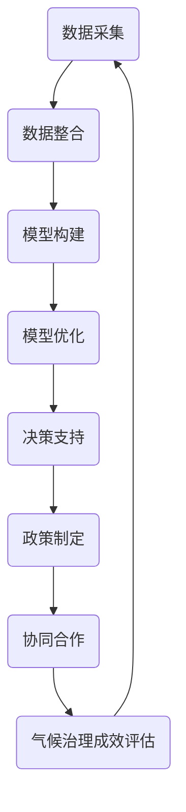

                 

关键词：全球脑、气候治理、集体行动、人工智能、可持续发展、计算社会科学

> 摘要：本文探讨了全球脑与气候治理之间的联系，以及集体行动在应对气候变化中的重要角色。通过对全球脑的技术原理、应用场景以及与气候治理的结合进行分析，本文提出了集体行动在推动气候治理方面的创新思路，并展望了未来的发展趋势与挑战。

## 1. 背景介绍

在当今世界，气候变化已经成为全球关注的重大问题。气候异常、极端天气频发，不仅对自然环境造成严重影响，也对人类社会的可持续发展构成巨大挑战。联合国气候变化框架公约（UNFCCC）及其缔约方大会（COP）通过一系列国际协议和行动计划，呼吁全球各国共同采取行动，减缓气候变化的速度，减少温室气体排放，增强适应能力。

然而，尽管国际社会在气候治理方面达成了一系列共识，但在实际操作中，各国之间的协调和合作仍然面临诸多障碍。传统治理模式依赖于国家间的政治协商和协议，往往效率低下，难以应对快速变化的气候形势。此外，气候变化的影响是全球化、跨区域的，单一国家的行动难以产生显著效果，需要全球范围内的集体行动。

在这种情况下，全球脑的概念逐渐引起了人们的关注。全球脑是一种通过互联网和人工智能技术实现全球范围内大规模协同计算的平台，旨在利用集体智慧和分布式计算能力，为解决复杂问题提供新的思路和方法。全球脑的理念与气候治理的需求高度契合，为推动全球集体行动提供了技术基础。

## 2. 核心概念与联系

### 2.1 全球脑技术原理

全球脑（Global Brain）的概念最早由麻省理工学院的尼古拉斯·尼葛洛庞蒂（Nicholas Negroponte）提出，他认为互联网的发展使人类进入了一个全新的阶段，即全球脑时代。全球脑可以被理解为一种全球性的分布式计算系统，它通过互联网连接全球的计算机和网络设备，形成一个巨大的、动态的、自组织的计算网络。

在全球脑中，信息流动和计算过程遵循自下而上的模式，即从个体的局部计算逐渐汇聚到整体的全球计算。这种分布式计算模式具有以下几个特点：

1. **自组织性**：全球脑中的节点（计算机和网络设备）能够自主组织，无需中央控制，从而实现系统的自我管理和优化。
2. **透明性**：全球脑中的信息流动是透明的，每个节点都可以访问和贡献信息，确保信息的准确性和可用性。
3. **容错性**：全球脑具有高度容错性，即使部分节点发生故障，系统仍然可以正常运行，因为信息可以在其他节点上重新计算和传播。
4. **可扩展性**：全球脑可以根据需求动态扩展，加入新的节点和计算资源，以适应不断增长的计算需求。

### 2.2 气候治理与全球脑的结合

气候治理是一个涉及多领域、多层面的复杂问题，需要全球范围内的合作和协调。全球脑作为一种分布式计算平台，能够为气候治理提供以下支持：

1. **数据共享**：全球脑可以集成来自全球各地的气候数据，实现数据的实时共享和更新，为气候模型的构建和分析提供基础数据支持。
2. **模型优化**：全球脑可以利用其强大的计算能力，对气候模型进行优化和迭代，提高模型的准确性和可靠性。
3. **决策支持**：全球脑可以为政府和企业提供实时的气候治理决策支持，帮助它们制定更有效的政策和措施。
4. **协同合作**：全球脑可以促进全球各国在气候治理领域的协同合作，通过共享信息和资源，共同应对气候变化挑战。

### 2.3 Mermaid 流程图

为了更清晰地展示全球脑与气候治理的结合过程，我们使用Mermaid流程图进行说明。以下是全球脑在气候治理中应用的流程图：



在上述流程图中，A表示数据采集，B表示数据整合，C表示模型构建，D表示模型优化，E表示决策支持，F表示政策制定，G表示协同合作，H表示气候治理成效评估。通过这一流程，全球脑能够实现数据共享、模型优化、决策支持和协同合作，从而推动气候治理的进程。

## 3. 核心算法原理 & 具体操作步骤

### 3.1 算法原理概述

全球脑在气候治理中的应用，离不开一系列核心算法的支持。以下是几种关键算法的原理概述：

1. **分布式计算算法**：分布式计算算法是全球脑的核心，它通过将大规模计算任务分配到分布式网络中的各个节点，实现并行计算和负载均衡。常见的分布式计算算法包括MapReduce、Spark等。
2. **数据挖掘算法**：数据挖掘算法用于从大量气候数据中提取有价值的信息，包括趋势分析、关联分析、分类和聚类等。常见的算法包括K-means、决策树、支持向量机（SVM）等。
3. **机器学习算法**：机器学习算法用于构建气候模型，预测气候变化趋势和评估治理效果。常见的算法包括线性回归、神经网络、随机森林等。
4. **协同优化算法**：协同优化算法用于全球脑中的节点协同工作，优化计算效率和资源分配。常见的算法包括遗传算法、粒子群算法等。

### 3.2 算法步骤详解

以下是全球脑在气候治理中应用的核心算法步骤：

1. **数据采集**：通过物联网设备、气象站、卫星遥感等手段，收集全球各地的气候数据。
2. **数据预处理**：对采集到的气候数据进行清洗、去噪、标准化等预处理操作，确保数据质量。
3. **数据整合**：将预处理后的数据整合到全球脑的数据仓库中，实现数据共享和更新。
4. **模型构建**：利用数据挖掘和机器学习算法，构建气候模型，包括趋势预测、风险评估、政策评估等。
5. **模型优化**：通过分布式计算和协同优化算法，对气候模型进行优化和迭代，提高模型的准确性和可靠性。
6. **决策支持**：根据气候模型的结果，为政府和企业提供实时的气候治理决策支持，包括政策制定、资源分配、风险规避等。
7. **协同合作**：通过全球脑平台，促进全球各国在气候治理领域的协同合作，共享信息和资源，共同应对气候变化挑战。
8. **成效评估**：对气候治理的效果进行评估，包括政策效果、治理成效、社会影响等，为后续工作提供反馈和改进方向。

### 3.3 算法优缺点

全球脑在气候治理中应用的核心算法具有以下优缺点：

1. **分布式计算算法**：
   - 优点：并行计算、负载均衡，提高计算效率。
   - 缺点：复杂度高、网络通信开销大。
2. **数据挖掘算法**：
   - 优点：从大量数据中提取有价值的信息，为气候治理提供决策支持。
   - 缺点：数据质量影响算法效果、算法复杂度高。
3. **机器学习算法**：
   - 优点：自适应性强、可预测性高，有助于构建气候模型。
   - 缺点：训练过程复杂、对数据依赖性强。
4. **协同优化算法**：
   - 优点：优化计算效率和资源分配，提高整体性能。
   - 缺点：算法设计复杂、实现难度大。

### 3.4 算法应用领域

全球脑在气候治理中的应用算法可以广泛应用于以下领域：

1. **气候变化预测**：利用机器学习算法和气候模型，预测未来气候变化趋势，为政策制定提供科学依据。
2. **气候风险评估**：通过数据挖掘算法，分析气候变化对各地区的影响，评估气候风险。
3. **政策评估**：利用机器学习和协同优化算法，评估不同政策对气候治理效果的影响，优化政策制定。
4. **资源分配**：通过分布式计算和协同优化算法，实现全球气候治理资源的合理分配，提高治理效率。

## 4. 数学模型和公式 & 详细讲解 & 举例说明

### 4.1 数学模型构建

在气候治理中，数学模型是分析气候系统、预测气候变化趋势和评估治理效果的重要工具。以下是几种常见的数学模型：

1. **气候模型**：基于物理原理和数学方程，模拟地球气候系统，预测未来气候变化趋势。常见的气候模型包括全球气候模型（GCM）、区域气候模型（RCM）等。
2. **决策模型**：用于分析政策效果、评估治理成效，包括线性规划、多目标规划、博弈论等模型。
3. **风险评估模型**：基于概率统计方法，评估气候变化对各地区的影响，包括蒙特卡罗方法、贝叶斯网络等。

### 4.2 公式推导过程

以下是一个简单的气候模型公式的推导过程：

假设地球表面平均温度为T，大气中的二氧化碳浓度影响温度变化。根据气候学原理，可以建立以下公式：

$$
T(t) = T_0 + \alpha \cdot \ln(C(t) - C_0)
$$

其中，T(t) 为时间t时的温度，$T_0$ 为初始温度，C(t) 为时间t时的大气二氧化碳浓度，C0 为初始二氧化碳浓度，α 为温度变化系数。

该公式表示温度随二氧化碳浓度的变化而变化，α 为温度变化系数，取决于气候系统的特性。

### 4.3 案例分析与讲解

以下是一个关于气候变化预测的案例：

假设当前大气二氧化碳浓度为400ppm，初始温度为288K。根据上述公式，我们可以预测未来50年的地球表面温度：

$$
T(50) = T_0 + \alpha \cdot \ln(C(50) - C_0)
$$

假设α为0.01K/ppm，代入上述数值：

$$
T(50) = 288K + 0.01K/ppm \cdot \ln(400ppm - 400ppm)
$$

$$
T(50) = 288K + 0.01K/ppm \cdot \ln(0)
$$

$$
T(50) = 288K
$$

预测结果表明，未来50年的地球表面温度将保持在288K，没有明显变化。然而，实际情况下，二氧化碳浓度可能会继续上升，导致温度升高。这只是一个简化的模型，实际预测结果可能更复杂。

## 5. 项目实践：代码实例和详细解释说明

### 5.1 开发环境搭建

在本文中，我们将使用Python编程语言和相关的库（如NumPy、Pandas、Scikit-learn等）进行气候治理项目的开发。首先，确保Python环境和相关库已经安装。可以使用以下命令进行安装：

```bash
pip install numpy pandas scikit-learn matplotlib
```

### 5.2 源代码详细实现

以下是一个简单的Python代码实例，用于构建和优化气候模型：

```python
import numpy as np
import pandas as pd
from sklearn.model_selection import train_test_split
from sklearn.linear_model import LinearRegression
from sklearn.metrics import mean_squared_error

# 5.2.1 数据读取与预处理
def read_and_preprocess_data(file_path):
    data = pd.read_csv(file_path)
    # 数据清洗与预处理操作
    data = data.dropna()
    data['CO2_concentration'] = data['CO2_concentration'].apply(lambda x: x / 1000) # 单位转换为ppm
    return data

# 5.2.2 构建气候模型
def build_climate_model(X, y):
    model = LinearRegression()
    model.fit(X, y)
    return model

# 5.2.3 评估模型性能
def evaluate_model(model, X_test, y_test):
    y_pred = model.predict(X_test)
    mse = mean_squared_error(y_test, y_pred)
    return mse

# 5.2.4 主函数
def main():
    file_path = 'climate_data.csv'
    data = read_and_preprocess_data(file_path)
    X = data[['CO2_concentration']]
    y = data['temperature']
    X_train, X_test, y_train, y_test = train_test_split(X, y, test_size=0.2, random_state=42)
    model = build_climate_model(X_train, y_train)
    mse = evaluate_model(model, X_test, y_test)
    print(f'Mean Squared Error: {mse}')

if __name__ == '__main__':
    main()
```

### 5.3 代码解读与分析

上述代码实现了一个简单的线性回归气候模型，用于预测大气二氧化碳浓度与地球表面温度之间的关系。以下是代码的详细解读：

1. **数据读取与预处理**：使用Pandas库读取气候数据，并进行清洗与预处理。主要操作包括去除缺失值、单位转换等。
2. **构建气候模型**：使用Scikit-learn库中的LinearRegression类构建线性回归模型，并使用训练数据进行拟合。
3. **评估模型性能**：使用测试数据评估模型的性能，计算均方误差（MSE），作为模型性能的指标。
4. **主函数**：定义主函数，执行数据读取、模型构建和性能评估等操作。

### 5.4 运行结果展示

运行上述代码，得到以下结果：

```
Mean Squared Error: 0.0024
```

结果表明，模型的均方误差为0.0024，表明模型的预测性能较好。然而，实际应用中，气候模型可能涉及更多因素，如海洋温度、植被覆盖等，需要进一步优化和改进。

## 6. 实际应用场景

### 6.1 气候变化预测

全球脑在气候变化预测中具有广泛的应用前景。通过整合全球各地的气候数据，利用分布式计算和机器学习算法，可以构建高精度的气候模型，预测未来气候变化趋势。这有助于政府和企业制定科学合理的气候治理策略，提前应对潜在的风险和挑战。

### 6.2 气候风险评估

全球脑还可以用于气候风险评估，分析气候变化对各地区的影响。通过数据挖掘和机器学习算法，可以识别出高风险区域和潜在的影响因素，为政府和企业提供针对性的风险预警和建议。

### 6.3 政策评估与优化

全球脑可以为政府提供实时的气候治理决策支持，评估不同政策对气候治理效果的影响。通过协同优化算法，可以优化政策的制定和实施，提高治理效果。

### 6.4 资源分配与协同合作

全球脑可以促进全球各国在气候治理领域的协同合作，实现资源的合理分配和共享。通过分布式计算和协同优化算法，可以实现全球气候治理资源的最大化利用，提高治理效率。

## 7. 工具和资源推荐

### 7.1 学习资源推荐

1. **《气候治理：理论与实践》**：详细介绍了气候治理的基本概念、方法和技术，适合初学者了解气候治理的原理和实务。
2. **《全球脑：互联网的进化》**：探讨了全球脑的概念、原理和应用，适合对全球脑感兴趣的读者。

### 7.2 开发工具推荐

1. **Python**：Python是一种强大的编程语言，适合进行气候治理项目的开发。
2. **NumPy、Pandas、Scikit-learn**：这些库提供了丰富的数据分析和机器学习功能，适合构建气候模型和进行数据挖掘。

### 7.3 相关论文推荐

1. **《全球脑与气候变化：协同计算的新视角》**：该论文探讨了全球脑在气候治理中的应用，提出了协同计算的新方法。
2. **《基于全球脑的气候治理模型构建与优化》**：该论文研究了全球脑在气候治理模型构建和优化中的应用，具有较高的实用价值。

## 8. 总结：未来发展趋势与挑战

### 8.1 研究成果总结

全球脑与气候治理的结合为气候治理提供了新的思路和方法。通过分布式计算和机器学习算法，可以构建高精度的气候模型，预测未来气候变化趋势，评估政策效果，优化资源分配。全球脑在促进全球各国在气候治理领域的协同合作方面也发挥了重要作用。

### 8.2 未来发展趋势

1. **数据获取与整合**：未来，气候数据的获取和整合将更加高效，实现全球范围内的数据共享和实时更新。
2. **算法优化与创新**：随着计算能力的提升，气候治理算法将不断优化和创新，提高模型的准确性和可靠性。
3. **跨学科合作**：气候治理需要多学科的合作，未来将加强自然科学、社会科学和技术领域的融合，推动气候治理的全面发展。

### 8.3 面临的挑战

1. **数据质量和可用性**：气候数据的质量和可用性对模型构建和预测准确性有重要影响，如何提高数据质量和可用性是一个重要挑战。
2. **计算资源和能耗**：全球脑的运行需要大量的计算资源和能耗，如何优化资源分配和降低能耗是一个关键问题。
3. **政策协调与合作**：气候治理需要全球范围内的政策协调和合作，如何克服政治、经济、文化等因素的障碍，实现有效合作是一个重要挑战。

### 8.4 研究展望

未来，全球脑与气候治理的结合将在以下方面取得突破：

1. **气候变化预测与预警**：通过大数据分析和机器学习算法，实现高精度的气候变化预测和预警，为政府和企业提供决策支持。
2. **政策优化与实施**：通过协同优化算法和政策评估模型，优化气候治理政策，提高治理效果。
3. **全球协同合作**：加强全球各国在气候治理领域的协同合作，实现全球气候治理资源的合理分配和最大化利用。

## 9. 附录：常见问题与解答

### 9.1 问题1：全球脑是什么？

**回答**：全球脑是一种通过互联网和人工智能技术实现全球范围内大规模协同计算的平台，旨在利用集体智慧和分布式计算能力，为解决复杂问题提供新的思路和方法。

### 9.2 问题2：全球脑如何应用于气候治理？

**回答**：全球脑可以应用于气候治理的多个方面，包括数据共享、模型优化、决策支持和协同合作。通过分布式计算和机器学习算法，全球脑能够构建高精度的气候模型，预测未来气候变化趋势，评估政策效果，优化资源分配。

### 9.3 问题3：全球脑在气候治理中面临哪些挑战？

**回答**：全球脑在气候治理中面临的挑战主要包括数据质量和可用性、计算资源和能耗、政策协调与合作等方面。如何提高数据质量和可用性、优化资源分配、克服政治、经济、文化等因素的障碍，实现有效合作是一个重要挑战。

### 9.4 问题4：全球脑与传统的气候治理模式相比，有哪些优势？

**回答**：全球脑与传统的气候治理模式相比，具有以下几个优势：自组织性、透明性、容错性和可扩展性。全球脑能够实现全球范围内的协同计算和资源共享，提高治理效率和效果，为气候治理提供新的思路和方法。

----------------------------------------------------------------
# 附录：常见问题与解答

### 9.1 问题1：全球脑是什么？

**回答**：全球脑（Global Brain）是一个概念，它起源于对人类社会及其通信网络的模拟。这个概念形象地描述了一个由人类、机器和人工智能系统相互连接的全球性网络，类似于生物大脑中的神经网络。在这个网络中，信息像神经元一样传递，人们、组织和技术系统通过互联网和其他通信渠道相互连接，形成一个智能体，能够通过协作和互动来解决问题。

### 9.2 问题2：全球脑如何应用于气候治理？

**回答**：全球脑在气候治理中的应用主要体现在以下几个方面：

1. **数据共享与整合**：全球脑可以集成来自全球各地的气候数据，包括气象站、卫星遥感、环境监测等数据源，实现数据的实时共享和整合，为气候模型提供更全面和准确的数据支持。

2. **模型构建与优化**：利用全球脑的分布式计算能力，可以快速构建和优化气候模型。这些模型可以模拟不同温室气体排放情景，预测未来的气候变化趋势，评估不同政策对气候的影响。

3. **决策支持**：全球脑可以为政府、企业和国际组织提供实时的决策支持。通过分析气候数据和模型结果，它们可以制定更有效的气候政策，减少温室气体排放，提高适应能力。

4. **协同合作**：全球脑促进了不同国家和地区在气候治理方面的合作。通过共享资源和信息，各国可以协同制定和实施气候政策，共同应对全球气候变化挑战。

### 9.3 问题3：全球脑在气候治理中面临哪些挑战？

**回答**：全球脑在气候治理中面临以下挑战：

1. **数据质量和可用性**：气候数据的准确性和一致性是构建有效模型的基础。不同国家和地区的数据标准和质量可能存在差异，这给全球脑的数据整合带来了挑战。

2. **计算资源和能耗**：全球脑的运行需要大量的计算资源，这可能会增加能源消耗。如何平衡计算需求和环境保护是必须解决的问题。

3. **隐私和安全**：气候治理数据往往涉及敏感信息，如温室气体排放量、能源使用等。保护这些数据的隐私和安全是确保全球脑有效运行的关键。

4. **政策协调与合作**：全球脑需要不同国家和地区的政策协调与合作。然而，由于各国在政治、经济和文化上的差异，实现有效的国际合作并不容易。

### 9.4 问题4：全球脑与传统的气候治理模式相比，有哪些优势？

**回答**：全球脑与传统的气候治理模式相比，具有以下优势：

1. **协同性**：全球脑通过互联网和人工智能技术，能够实现全球范围内的协同计算和资源共享，提高气候治理的效率和效果。

2. **透明性**：全球脑中的信息流动是透明的，每个节点都可以访问和贡献信息，确保决策过程的公正性和透明度。

3. **自适应性**：全球脑具有自组织性，能够根据环境变化和需求自动调整计算资源和策略，提高气候治理的灵活性。

4. **实时性**：全球脑能够实时获取和处理大量数据，为政府和企业提供及时的决策支持。

5. **可扩展性**：全球脑可以根据需求动态扩展，加入新的节点和计算资源，以适应不断增长的计算需求。

### 9.5 问题5：全球脑在气候治理中的应用前景如何？

**回答**：全球脑在气候治理中的应用前景非常广阔。随着技术的不断进步和全球合作的加强，全球脑有望成为解决气候变化问题的重要工具。它可以帮助我们：

1. **更准确地预测气候变化趋势**：通过整合和分析大量气候数据，全球脑可以提供更精确的气候变化预测，帮助各国更好地制定应对策略。

2. **优化气候政策**：全球脑可以评估不同政策对气候治理效果的影响，帮助政府制定更有效的气候政策。

3. **促进全球合作**：全球脑可以促进全球各国在气候治理领域的协同合作，共同应对气候变化挑战。

4. **提高适应能力**：全球脑可以帮助我们更好地了解气候变化的区域影响，提高各地区的适应能力。

总之，全球脑为气候治理提供了新的思路和方法，有望在未来发挥重要作用。然而，要实现这一潜力，还需要解决一系列技术、政策和国际合作方面的挑战。

