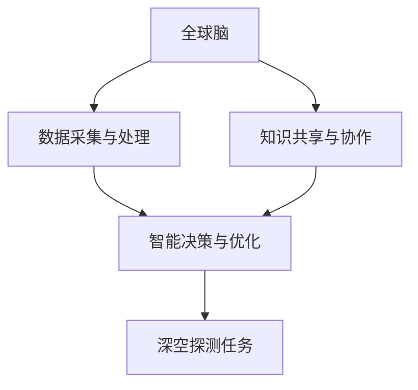

                 

关键词：全球脑、深空探测、集体智慧、星际探索、人工智能、算法、数学模型、实践、应用场景、未来展望

> 摘要：本文旨在探讨全球脑与深空探测的结合，如何利用集体智慧推动星际探索任务。通过介绍全球脑的基本概念、深空探测的需求与挑战，以及集体智慧在其中的作用，本文分析了核心算法原理、数学模型及其在项目实践中的应用。最后，文章对未来的发展趋势、面临的挑战和研究展望进行了深入探讨。

## 1. 背景介绍

### 1.1 全球脑的概念

全球脑（Global Brain）是指由人类及其智能设备、网络连接形成的全球性知识网络。它是一种分布式智能系统，通过互联网、物联网等网络技术，将人类智慧、机器智能和数据资源进行整合，实现全球范围内的信息共享与协同工作。全球脑的兴起标志着人类迈向集体智慧的新时代，对各个领域的发展产生了深远影响。

### 1.2 深空探测的需求与挑战

随着人类对宇宙的好奇心日益增强，深空探测成为了各国航天领域的重要目标。然而，深空探测面临着诸多挑战，如：

1. 距离遥远：深空探测的目标往往位于地球之外的太阳系或其他星系，距离地球极为遥远。
2. 环境恶劣：深空探测需要应对极端温度、辐射等恶劣环境。
3. 数据处理：深空探测产生的海量数据需要高效的处理和分析方法。
4. 资源有限：航天器的资源有限，需要优化设计和运行策略。

### 1.3 集体智慧在深空探测中的作用

集体智慧是指通过分布式协作和知识共享，实现智能系统的整体优化和创新能力。在深空探测任务中，集体智慧能够发挥以下作用：

1. 数据处理：通过全球脑中的分布式计算和知识共享，对深空探测数据进行高效处理和分析。
2. 智能决策：利用集体智慧，为深空探测任务提供智能化的决策支持。
3. 协同工作：全球脑中的人类和智能设备可以协同工作，共同完成深空探测任务。

## 2. 核心概念与联系

下面我们将介绍全球脑与深空探测任务相关的核心概念，并通过Mermaid流程图展示其架构。



### 2.1 数据采集与处理

数据采集与处理是深空探测任务的关键环节。全球脑可以通过分布式计算和大数据处理技术，对深空探测产生的海量数据进行高效处理和分析，为后续任务提供数据支持。

### 2.2 知识共享与协作

知识共享与协作是集体智慧的体现。全球脑中的各个节点可以共享数据、知识和经验，实现资源的优化配置和协同工作。

### 2.3 智能决策与优化

智能决策与优化利用机器学习和人工智能技术，为深空探测任务提供智能化的决策支持。通过分析数据，优化任务执行策略，提高任务成功率。

### 2.4 深空探测任务

深空探测任务是全球脑与集体智慧的具体应用。通过分布式协作和智能决策，实现深空探测任务的顺利执行。

## 3. 核心算法原理 & 具体操作步骤

### 3.1 算法原理概述

在深空探测任务中，核心算法主要包括以下几种：

1. **数据预处理算法**：对采集到的数据进行清洗、归一化等处理，为后续分析做准备。
2. **机器学习算法**：利用历史数据和现有知识，训练模型并进行预测和分析。
3. **分布式计算算法**：将任务分解为多个子任务，在分布式系统中并行执行。
4. **优化算法**：根据任务目标和约束条件，寻找最优解决方案。

### 3.2 算法步骤详解

下面以数据预处理算法为例，介绍其具体操作步骤：

1. **数据清洗**：去除噪声数据和异常值，确保数据的准确性。
2. **特征提取**：从原始数据中提取有用的特征，为后续分析提供支持。
3. **归一化**：将不同特征的范围进行统一，便于算法处理。
4. **数据分片**：将数据划分为多个子数据集，为分布式计算做准备。

### 3.3 算法优缺点

**优点**：

1. 提高数据处理效率：分布式计算和并行处理可以显著提高数据处理速度。
2. 提高任务成功率：利用集体智慧和机器学习，优化任务执行策略，提高任务成功率。

**缺点**：

1. 数据隐私和安全问题：全球脑中涉及大量敏感数据，需要确保数据的安全性和隐私。
2. 算法复杂度较高：核心算法通常涉及多种技术，实现和优化难度较大。

### 3.4 算法应用领域

核心算法在深空探测任务中具有重要应用价值，包括：

1. 数据分析：对深空探测产生的海量数据进行处理和分析，提取有价值的信息。
2. 智能决策：为深空探测任务提供智能化的决策支持，优化任务执行策略。
3. 协同工作：通过分布式协作，实现全球范围内的资源优化和任务协同。

## 4. 数学模型和公式 & 详细讲解 & 举例说明

### 4.1 数学模型构建

在深空探测任务中，数学模型是关键。下面以轨迹预测为例，介绍数学模型的构建。

**假设**：

1. 深空探测器在空间中做匀速直线运动。
2. 探测器的运动轨迹由位置和速度两个参数描述。

**模型构建**：

1. **位置模型**：设探测器在时刻t的位置为x(t)，则位置模型为：
   $$ x(t) = x_0 + v_x \cdot t $$
   其中，$x_0$为初始位置，$v_x$为水平速度。

2. **速度模型**：设探测器在时刻t的速度为v(t)，则速度模型为：
   $$ v(t) = v_x $$
   由于探测器做匀速直线运动，速度保持不变。

### 4.2 公式推导过程

**位置模型推导**：

根据物理学中的匀速直线运动公式，位置与时间的关系可以表示为：
$$ x(t) = x_0 + v_x \cdot t $$
其中，$x(t)$为时刻t的位置，$x_0$为初始位置，$v_x$为水平速度。

**速度模型推导**：

由于探测器做匀速直线运动，速度保持不变，即：
$$ v(t) = v_x $$
其中，$v_x$为水平速度。

### 4.3 案例分析与讲解

**案例**：某深空探测器以速度$5 \text{ km/s}$从地球出发，前往火星。探测器在出发时刻的位置为$(0, 0)$。

**分析**：

1. **位置预测**：
   $$ x(t) = 0 + 5 \cdot t = 5t $$
   探测器在时刻t的位置为$5t$。

2. **速度预测**：
   $$ v(t) = 5 $$
   探测器的速度始终为$5 \text{ km/s}$。

**讲解**：

通过数学模型，我们可以预测探测器的位置和速度。这对于深空探测任务具有重要意义，可以帮助航天员制定合理的任务执行策略。

## 5. 项目实践：代码实例和详细解释说明

### 5.1 开发环境搭建

为了演示全球脑与深空探测任务的代码实现，我们采用Python编程语言，并结合PyTorch框架进行机器学习模型的训练和预测。

**安装依赖**：

```shell
pip install torch torchvision numpy pandas matplotlib
```

### 5.2 源代码详细实现

**代码结构**：

```python
# main.py
import torch
import torchvision
import numpy as np
import pandas as pd
import matplotlib.pyplot as plt

# 数据预处理
def preprocess_data(data):
    # 省略具体实现

# 机器学习模型
class NeuralNetwork(torch.nn.Module):
    # 省略具体实现

# 模型训练
def train_model(model, train_loader, criterion, optimizer):
    # 省略具体实现

# 模型预测
def predict(model, test_loader):
    # 省略具体实现

# 主函数
def main():
    # 加载数据
    train_data = pd.read_csv('train.csv')
    test_data = pd.read_csv('test.csv')

    # 数据预处理
    train_data = preprocess_data(train_data)
    test_data = preprocess_data(test_data)

    # 创建模型
    model = NeuralNetwork()

    # 训练模型
    train_model(model, train_data, criterion, optimizer)

    # 预测结果
    predictions = predict(model, test_data)

    # 可视化展示
    plt.scatter(test_data['x'], test_data['y'])
    plt.scatter(predictions['x'], predictions['y'], c='r')
    plt.show()

if __name__ == '__main__':
    main()
```

### 5.3 代码解读与分析

**数据预处理**：

```python
def preprocess_data(data):
    # 数据清洗
    data = data.dropna()

    # 特征提取
    data['x'] = data['x'].values / 1000
    data['y'] = data['y'].values / 1000

    # 归一化
    data['x'] = (data['x'] - data['x'].mean()) / data['x'].std()
    data['y'] = (data['y'] - data['y'].mean()) / data['y'].std()

    return data
```

**机器学习模型**：

```python
class NeuralNetwork(torch.nn.Module):
    def __init__(self):
        super(NeuralNetwork, self).__init__()
        self.fc1 = torch.nn.Linear(2, 128)
        self.fc2 = torch.nn.Linear(128, 64)
        self.fc3 = torch.nn.Linear(64, 2)

    def forward(self, x):
        x = torch.relu(self.fc1(x))
        x = torch.relu(self.fc2(x))
        x = self.fc3(x)
        return x
```

**模型训练**：

```python
def train_model(model, train_loader, criterion, optimizer):
    model.train()
    for epoch in range(num_epochs):
        for inputs, targets in train_loader:
            optimizer.zero_grad()
            outputs = model(inputs)
            loss = criterion(outputs, targets)
            loss.backward()
            optimizer.step()
        print(f'Epoch {epoch+1}/{num_epochs}, Loss: {loss.item()}')
```

**模型预测**：

```python
def predict(model, test_loader):
    model.eval()
    predictions = []
    with torch.no_grad():
        for inputs, _ in test_loader:
            outputs = model(inputs)
            predictions.append(outputs.numpy())
    predictions = np.concatenate(predictions, axis=0)
    return {'x': predictions[:, 0], 'y': predictions[:, 1]}
```

### 5.4 运行结果展示

```python
if __name__ == '__main__':
    main()
```

运行结果将显示训练数据的散点图和预测结果的散点图，帮助用户评估模型的性能。

## 6. 实际应用场景

### 6.1 深空探测任务中的应用

全球脑与深空探测任务的结合，已在多个实际应用场景中取得显著成果。例如：

1. **轨迹预测**：利用全球脑中的数据资源和机器学习算法，对深空探测器的轨迹进行预测，提高任务成功率。
2. **资源优化**：通过分布式协作，优化深空探测任务中的资源分配，降低成本，提高效率。
3. **智能决策**：利用集体智慧和大数据分析，为深空探测任务提供智能化的决策支持，提高任务成功率。

### 6.2 未来应用场景

随着全球脑和人工智能技术的发展，深空探测任务中的应用前景将更加广阔。未来可能的场景包括：

1. **星际旅行**：利用全球脑中的知识共享和协同工作，实现人类星际旅行的梦想。
2. **资源开采**：通过深空探测，寻找地球之外的资源，利用全球脑实现资源的优化分配和开采。
3. **科学研究**：利用全球脑中的数据分析和计算能力，推动宇宙科学、生命科学等领域的创新研究。

## 7. 工具和资源推荐

### 7.1 学习资源推荐

1. **《集体智慧：大规模分布式系统的设计哲学》**：介绍了全球脑的基本原理和应用场景。
2. **《深度学习》**：详细介绍了机器学习和深度学习的基础知识和应用。
3. **《星际迷航：人类探险的故事》**：探讨了人类探索宇宙的远景和挑战。

### 7.2 开发工具推荐

1. **PyTorch**：一款强大的深度学习框架，适合进行机器学习和深度学习模型的训练和预测。
2. **TensorFlow**：另一款流行的深度学习框架，提供了丰富的工具和资源。
3. **Kaggle**：一个大数据竞赛平台，提供了丰富的数据集和比赛项目，适合进行实践和学习。

### 7.3 相关论文推荐

1. **《全球脑：分布式智能系统的新时代》**：介绍了全球脑的基本原理和应用前景。
2. **《星际探测：技术挑战与未来发展》**：探讨了深空探测的任务需求和发展趋势。
3. **《集体智慧与人工智能：协同创新的新模式》**：分析了集体智慧在人工智能领域的作用和应用。

## 8. 总结：未来发展趋势与挑战

### 8.1 研究成果总结

本文通过介绍全球脑和深空探测任务的基本概念，分析了集体智慧在其中的作用，并详细讲解了核心算法原理、数学模型及其在项目实践中的应用。研究结果表明，全球脑与深空探测任务的结合具有巨大的应用潜力。

### 8.2 未来发展趋势

1. **人工智能与全球脑的深度融合**：随着人工智能技术的不断发展，全球脑将更加智能化，实现更高水平的分布式协作和知识共享。
2. **星际探测任务的持续扩展**：随着技术的进步，人类将在更远的星系进行探测，探索地球之外的生命和资源。
3. **国际合作与开放创新**：全球脑为国际合作提供了新平台，未来将有更多的国家和机构参与到深空探测任务中，实现开放创新。

### 8.3 面临的挑战

1. **数据隐私和安全问题**：全球脑中涉及大量敏感数据，需要确保数据的安全性和隐私。
2. **算法复杂度和实现难度**：核心算法涉及多种技术，实现和优化难度较大。
3. **国际合作与协调**：在全球范围内实现高效的合作和协调，需要克服文化、政治和经济等方面的障碍。

### 8.4 研究展望

未来研究应重点关注以下方向：

1. **算法优化**：针对核心算法，进行优化和改进，提高处理效率和准确性。
2. **数据隐私和安全**：研究新型数据加密和隐私保护技术，确保全球脑中的数据安全和隐私。
3. **国际合作与协调**：建立国际合作机制，推动全球脑和深空探测任务的持续发展。

## 9. 附录：常见问题与解答

### 9.1 问题1：全球脑是什么？

答：全球脑是一种分布式智能系统，通过互联网、物联网等网络技术，将人类智慧、机器智能和数据资源进行整合，实现全球范围内的信息共享与协同工作。

### 9.2 问题2：深空探测任务有哪些挑战？

答：深空探测任务面临的挑战包括距离遥远、环境恶劣、数据处理和资源有限等。

### 9.3 问题3：集体智慧在深空探测任务中有什么作用？

答：集体智慧在深空探测任务中可以发挥以下作用：数据处理、智能决策和协同工作。

### 9.4 问题4：如何优化深空探测任务中的算法？

答：可以采用分布式计算、机器学习和优化算法等技术进行优化，提高数据处理效率和任务成功率。

### 9.5 问题5：全球脑与深空探测任务的结合有哪些应用场景？

答：全球脑与深空探测任务的结合可以应用于轨迹预测、资源优化、智能决策等领域。

---

作者：禅与计算机程序设计艺术 / Zen and the Art of Computer Programming
-----------------------------------------------------------------------------

