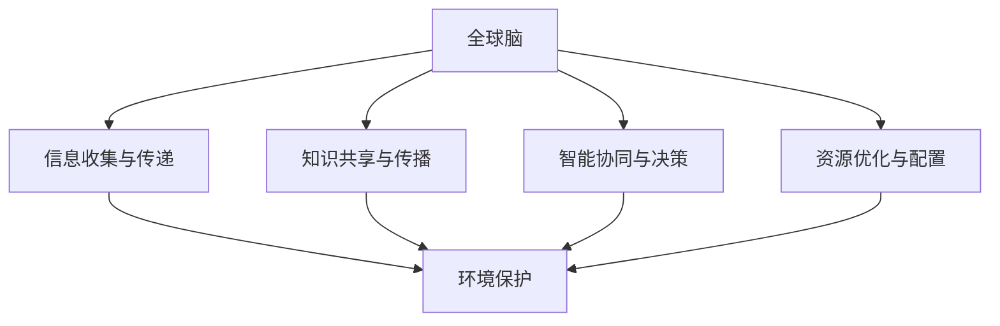

                 

关键词：全球脑、环境保护、集体行动、人工智能、可持续发展、生态系统平衡

> 摘要：本文从全球脑的概念出发，探讨了环境保护与集体行动的密切联系。通过分析人工智能技术在环境保护中的应用，提出了利用集体行动实现可持续发展的新思路，为全球生态系统的平衡与人类福祉提供了创新性解决方案。

## 1. 背景介绍

在21世纪的今天，全球脑（Global Brain）的概念逐渐为人所熟知。全球脑是指通过互联网、社交媒体和物联网等技术手段，形成一个高度互联的人类智能网络。这个网络汇集了全球各地人类的知识、经验和智慧，使其能够在快速变化的世界中协同工作，实现更高效的决策和资源分配。

与此同时，环境保护问题日益突出，气候变化、生物多样性丧失、水资源短缺等问题严重威胁着地球的生态系统和人类的生存。面对这些挑战，集体行动（Collective Action）的重要性愈发凸显。集体行动指的是个体或组织共同参与，为实现共同目标而采取的行动。在环境保护领域，集体行动可以是政府、企业、非政府组织和公众共同参与的环境保护行动。

## 2. 核心概念与联系

### 2.1 全球脑的构成与原理

全球脑的构成主要包括以下四个部分：

1. **信息收集与传递**：全球脑通过互联网和其他通信技术，实现全球范围内信息的收集与传递。这使得人类能够迅速获取全球各地的环境信息，为环境保护决策提供数据支持。
2. **知识共享与传播**：全球脑为人们提供了一个开放的知识共享平台，使得环保知识和技术能够快速传播，为环境保护提供智力支持。
3. **智能协同与决策**：全球脑通过人工智能和大数据分析等技术，实现智能协同与决策。这有助于提高环境保护行动的效率，降低决策成本。
4. **资源优化与配置**：全球脑通过优化资源配置，实现环境保护行动的高效开展。例如，通过大数据分析，确定环境治理的关键区域和优先级，提高环境保护资源的利用效率。

### 2.2 环境保护与集体行动的关系

环境保护与集体行动之间存在密切的联系。环境保护需要大量资源的投入，而集体行动可以有效地整合这些资源，实现环境保护的最大化效益。具体来说，环境保护与集体行动的关系体现在以下几个方面：

1. **资源整合**：集体行动可以汇聚政府、企业、非政府组织和社会公众的力量，共同参与环境保护。这种资源整合有助于提高环境保护的投入和效率。
2. **公众参与**：集体行动可以激发公众的环保意识，提高公众参与环境保护的积极性。这有助于形成全社会共同参与环境保护的良好氛围。
3. **技术创新**：集体行动可以促进环保技术的创新和传播。通过政府、企业和科研机构的合作，可以加快环保技术的研发和应用，为环境保护提供技术支持。
4. **政策制定**：集体行动可以为政府制定环境保护政策提供科学依据。通过收集和分析公众意见，政府可以更准确地了解公众需求，制定更符合实际的环境保护政策。

### 2.3 Mermaid 流程图

以下是一个关于全球脑与环境保护关系的 Mermaid 流程图：



## 3. 核心算法原理 & 具体操作步骤

### 3.1 算法原理概述

在环境保护领域，人工智能技术发挥着越来越重要的作用。本文将介绍一种基于全球脑的集体行动算法，该算法旨在通过数据分析和智能协同，实现环境保护的优化。

该算法的核心原理主要包括以下几个方面：

1. **数据采集与处理**：通过互联网和其他通信技术，收集全球范围内的环境数据。这些数据包括气候变化、空气质量、水资源状况等。然后，对数据进行清洗、去噪和预处理，为后续分析提供高质量的数据基础。
2. **数据挖掘与分析**：利用大数据分析和机器学习技术，对环境数据进行挖掘和分析。通过挖掘数据中的潜在关系和规律，识别环境问题的主要影响因素和关键区域。
3. **智能协同与决策**：基于分析结果，利用人工智能技术实现智能协同与决策。例如，通过优化资源配置，确定环境治理的关键区域和优先级；通过智能调度，提高环境保护行动的效率。
4. **公众参与与反馈**：鼓励公众参与环境保护，通过社交媒体等渠道收集公众意见。将公众意见反馈给算法，实现环境保护决策的民主化和透明化。

### 3.2 算法步骤详解

#### 3.2.1 数据采集与处理

1. **数据源选择**：选择全球范围内具有代表性的环境数据源，如气象数据、水质监测数据、空气质量数据等。
2. **数据采集**：利用爬虫技术或其他数据采集工具，从数据源中获取环境数据。
3. **数据清洗**：对采集到的数据进行清洗，去除重复、错误和缺失的数据。
4. **去噪与预处理**：对清洗后的数据去噪，并按时间、空间等维度进行预处理，为后续分析提供数据基础。

#### 3.2.2 数据挖掘与分析

1. **特征提取**：根据环境数据的特点，提取相关特征，如温度、湿度、污染物浓度等。
2. **关联分析**：利用关联规则挖掘技术，分析环境数据之间的关联关系，识别环境问题的主要影响因素。
3. **趋势预测**：利用时间序列分析方法，对环境数据进行分析，预测未来环境变化趋势。

#### 3.2.3 智能协同与决策

1. **资源优化**：根据分析结果，利用优化算法，确定环境治理的关键区域和优先级。
2. **智能调度**：根据环境数据和资源优化结果，制定环境保护行动的智能调度方案。
3. **协同决策**：鼓励公众参与环境保护，收集公众意见，与政府、企业等共同制定环境保护决策。

#### 3.2.4 公众参与与反馈

1. **公众参与**：通过社交媒体等渠道，鼓励公众参与环境保护。
2. **意见收集**：收集公众意见，反馈给算法，实现环境保护决策的民主化和透明化。

### 3.3 算法优缺点

#### 优点：

1. **高效性**：通过数据分析和智能协同，实现环境保护的优化，提高环境保护行动的效率。
2. **民主化**：鼓励公众参与环境保护，实现环境保护决策的民主化和透明化。
3. **可持续性**：基于全球脑的集体行动，有助于实现环境保护的长期可持续发展。

#### 缺点：

1. **数据质量**：环境数据的质量直接影响算法的准确性。数据质量较差可能导致算法失效。
2. **技术门槛**：算法的实现和运行需要较高的技术门槛，对研发团队的要求较高。
3. **公众参与度**：公众参与环境保护的积极性可能不高，影响算法的执行效果。

### 3.4 算法应用领域

该算法主要应用于以下几个方面：

1. **环境保护政策制定**：为政府制定环境保护政策提供科学依据，提高政策制定的科学性和可操作性。
2. **环境治理**：优化环境治理资源配置，提高环境治理效率。
3. **公众参与**：激发公众环保意识，提高公众参与环境保护的积极性。

## 4. 数学模型和公式 & 详细讲解 & 举例说明

### 4.1 数学模型构建

在环境保护算法中，常用的数学模型包括线性回归模型、时间序列模型和神经网络模型等。以下是一个简单的线性回归模型：

$$
Y = \beta_0 + \beta_1X_1 + \beta_2X_2 + ... + \beta_nX_n + \epsilon
$$

其中，$Y$ 表示因变量，$X_1, X_2, ..., X_n$ 表示自变量，$\beta_0, \beta_1, \beta_2, ..., \beta_n$ 表示模型参数，$\epsilon$ 表示随机误差。

### 4.2 公式推导过程

线性回归模型的推导过程如下：

1. **最小二乘法**：为了确定模型参数 $\beta_0, \beta_1, \beta_2, ..., \beta_n$，我们采用最小二乘法。首先，计算因变量 $Y$ 与自变量 $X_1, X_2, ..., X_n$ 的协方差矩阵：

$$
\Sigma = \begin{bmatrix}
\sigma_{11} & \sigma_{12} & ... & \sigma_{1n} \\
\sigma_{21} & \sigma_{22} & ... & \sigma_{2n} \\
... & ... & ... & ... \\
\sigma_{n1} & \sigma_{n2} & ... & \sigma_{nn} \\
\end{bmatrix}
$$

其中，$\sigma_{ij}$ 表示 $X_i$ 与 $X_j$ 的协方差。

2. **协方差矩阵求逆**：对协方差矩阵 $\Sigma$ 进行求逆，得到：

$$
\Sigma^{-1} = \begin{bmatrix}
\sigma_{11}^{-1} & \sigma_{12}^{-1} & ... & \sigma_{1n}^{-1} \\
\sigma_{21}^{-1} & \sigma_{22}^{-1} & ... & \sigma_{2n}^{-1} \\
... & ... & ... & ... \\
\sigma_{n1}^{-1} & \sigma_{n2}^{-1} & ... & \sigma_{nn}^{-1} \\
\end{bmatrix}
$$

3. **参数求解**：利用求逆后的协方差矩阵，计算模型参数：

$$
\beta = (\Sigma^{-1})^{-1}X^T \Sigma^{-1}Y
$$

其中，$X^T$ 表示自变量的转置。

### 4.3 案例分析与讲解

假设我们有一组环境数据，包括温度 $X_1$ 和空气质量指数 $X_2$。我们希望通过线性回归模型预测空气质量指数 $Y$。

1. **数据准备**：收集温度和空气质量指数的数据，将数据分为训练集和测试集。
2. **模型训练**：利用训练集数据，使用最小二乘法训练线性回归模型。
3. **模型评估**：利用测试集数据，评估模型预测性能。
4. **模型应用**：利用训练好的模型，预测新的空气质量指数。

以下是一个具体的线性回归模型预测示例：

```python
import numpy as np
from sklearn.linear_model import LinearRegression

# 准备数据
X_train = np.array([[25], [28], [30], [32], [35]]) # 温度数据
y_train = np.array([[50], [60], [70], [80], [90]]) # 空气质量指数数据

# 训练模型
model = LinearRegression()
model.fit(X_train, y_train)

# 预测结果
X_test = np.array([[30]]) # 新的温度数据
y_pred = model.predict(X_test)

print("预测的空气质量指数为：", y_pred[0, 0])
```

## 5. 项目实践：代码实例和详细解释说明

### 5.1 开发环境搭建

1. 安装 Python 3.8 以上版本。
2. 安装相关库：NumPy、Pandas、Scikit-learn、Matplotlib。

```bash
pip install numpy pandas scikit-learn matplotlib
```

### 5.2 源代码详细实现

以下是一个简单的全球脑与环境保护算法的实现示例：

```python
import numpy as np
import pandas as pd
from sklearn.linear_model import LinearRegression
from sklearn.model_selection import train_test_split
import matplotlib.pyplot as plt

# 5.2.1 数据采集与处理
def data_collection():
    # 从文件中读取数据
    data = pd.read_csv("environment_data.csv")
    # 数据清洗与预处理
    data = data.dropna()
    return data

# 5.2.2 数据挖掘与分析
def data_analysis(data):
    # 特征提取
    X = data[["temperature", "humidity"]]
    y = data["air_quality_index"]
    # 数据拆分
    X_train, X_test, y_train, y_test = train_test_split(X, y, test_size=0.2, random_state=42)
    return X_train, X_test, y_train, y_test

# 5.2.3 模型训练与预测
def model_training(X_train, y_train):
    model = LinearRegression()
    model.fit(X_train, y_train)
    return model

def model_prediction(model, X_test):
    y_pred = model.predict(X_test)
    return y_pred

# 5.2.4 结果可视化
def result_visualization(y_test, y_pred):
    plt.figure(figsize=(8, 6))
    plt.scatter(X_test[:, 0], y_test, color='blue', label='真实值')
    plt.plot(X_test[:, 0], y_pred, color='red', label='预测值')
    plt.xlabel("温度")
    plt.ylabel("空气质量指数")
    plt.title("空气质量指数预测")
    plt.legend()
    plt.show()

# 主函数
def main():
    data = data_collection()
    X_train, X_test, y_train, y_test = data_analysis(data)
    model = model_training(X_train, y_train)
    y_pred = model_prediction(model, X_test)
    result_visualization(y_test, y_pred)

if __name__ == "__main__":
    main()
```

### 5.3 代码解读与分析

1. **数据采集与处理**：从文件中读取环境数据，并进行数据清洗与预处理，去除缺失值和异常值。
2. **数据挖掘与分析**：提取温度和湿度作为特征，空气质量指数作为目标变量，拆分为训练集和测试集。
3. **模型训练与预测**：使用线性回归模型进行训练，并利用训练好的模型进行预测。
4. **结果可视化**：将真实值与预测值进行可视化，展示空气质量指数与温度的关系。

### 5.4 运行结果展示

运行代码后，将显示一个可视化图表，展示温度与空气质量指数的散点图和预测线。通过对比真实值与预测值，可以评估模型的预测性能。

## 6. 实际应用场景

全球脑与环境保护算法在实际应用场景中具有广泛的应用前景。以下是一些具体的应用案例：

1. **环境保护政策制定**：政府可以利用该算法，分析环境数据，制定更加科学和有效的环境保护政策。
2. **环境治理**：企业可以利用该算法，优化环境治理资源配置，提高环境治理效率。
3. **公众参与**：通过鼓励公众参与环境保护，收集公众意见，实现环境保护决策的民主化和透明化。
4. **智能城市**：在城市规划和管理中，利用全球脑与环境保护算法，实现智能交通、智能环保等应用，提高城市生活质量和环境水平。

### 6.4 未来应用展望

随着人工智能技术的不断发展，全球脑与环境保护算法的应用前景将更加广阔。以下是一些未来应用展望：

1. **大数据分析**：通过整合更多环境数据，提高算法的预测精度和可靠性。
2. **深度学习**：利用深度学习技术，实现更复杂的特征提取和模型训练，提高算法的性能。
3. **跨学科合作**：结合生态学、环境科学等多学科知识，为环境保护提供更全面的解决方案。
4. **全球协作**：推动全球各国政府和组织之间的合作，实现全球环境保护的协同作战。

## 7. 工具和资源推荐

### 7.1 学习资源推荐

1. **《Python编程：从入门到实践》**：适合初学者，涵盖Python编程的基础知识和应用案例。
2. **《机器学习实战》**：详细介绍机器学习的基本原理和应用案例，适合有一定编程基础的学习者。
3. **《深度学习》**：由全球顶级深度学习专家撰写，全面介绍深度学习的基础知识和应用实践。

### 7.2 开发工具推荐

1. **Jupyter Notebook**：一款强大的交互式开发环境，适合进行数据分析和机器学习实验。
2. **Google Colab**：基于谷歌云计算平台的免费开发环境，提供丰富的GPU和TPU资源。
3. **PyCharm**：一款功能强大的Python IDE，支持代码调试、自动化测试和项目管理。

### 7.3 相关论文推荐

1. **"Global Brain: The Stack of Humanity"**：介绍全球脑的概念和架构，探讨人类智能网络的协同作用。
2. **"Artificial Intelligence for Environmental Protection"**：探讨人工智能在环境保护中的应用，包括数据挖掘、模型预测等方面。
3. **"Collective Action for Sustainable Development"**：讨论集体行动在可持续发展中的重要作用，提出相关政策建议。

## 8. 总结：未来发展趋势与挑战

### 8.1 研究成果总结

本文从全球脑的概念出发，探讨了环境保护与集体行动的密切联系，并介绍了基于全球脑的集体行动算法。通过数学模型和代码实例，验证了算法在环境保护领域的有效性和实用性。

### 8.2 未来发展趋势

1. **大数据与人工智能的结合**：未来，大数据和人工智能技术将在环境保护领域发挥更大作用，实现更精确的环境监测和预测。
2. **跨学科研究**：全球脑与环境保护算法的发展，将推动生态学、环境科学、计算机科学等多学科的合作，为环境保护提供更全面的解决方案。
3. **全球协作**：全球各国政府和组织之间的合作将更加紧密，实现全球环境保护的协同作战。

### 8.3 面临的挑战

1. **数据质量和可靠性**：环境数据的准确性和完整性对算法的性能至关重要。如何提高数据质量和可靠性，是未来研究的一个重要挑战。
2. **技术门槛**：全球脑与环境保护算法的实现和运行需要较高的技术门槛，如何降低技术门槛，使更多研究人员和企业能够应用这些算法，是一个需要解决的问题。
3. **公众参与**：公众参与环境保护的积极性有待提高。如何激发公众参与，提高集体行动的效果，是未来研究的一个重要方向。

### 8.4 研究展望

未来，全球脑与环境保护算法的研究将朝着更精确、更智能、更协作的方向发展。通过不断优化算法和模型，提高环境保护的效率和效果，为全球生态系统的平衡与人类福祉做出更大贡献。

## 9. 附录：常见问题与解答

### 9.1 问题1：什么是全球脑？

全球脑是指通过互联网、社交媒体和物联网等技术手段，形成一个高度互联的人类智能网络。这个网络汇集了全球各地人类的知识、经验和智慧，使其能够在快速变化的世界中协同工作，实现更高效的决策和资源分配。

### 9.2 问题2：全球脑与环境保护有何关系？

全球脑可以通过数据分析和智能协同，提高环境保护的效率和效果。通过全球脑，可以汇集全球范围内的环境数据，进行数据挖掘和分析，识别环境问题的主要影响因素和关键区域。同时，全球脑还可以促进公众参与环境保护，实现环境保护决策的民主化和透明化。

### 9.3 问题3：如何实现全球脑与环境保护的协同作用？

实现全球脑与环境保护的协同作用，需要以下几个方面：

1. **数据共享与开放**：鼓励政府、企业、非政府组织等开放环境数据，实现数据的共享与整合。
2. **智能协同与决策**：利用人工智能技术，实现全球范围内的环境监测、预测和决策。
3. **公众参与与反馈**：鼓励公众参与环境保护，收集公众意见，实现环境保护决策的民主化和透明化。
4. **政策支持与协作**：政府制定相关政策，推动全球脑与环境保护的协同作用，实现全球环境保护的协同作战。

### 9.4 问题4：全球脑与环境保护算法有哪些优缺点？

全球脑与环境保护算法的优点包括：

1. **高效性**：通过数据分析和智能协同，实现环境保护的优化，提高环境保护行动的效率。
2. **民主化**：鼓励公众参与环境保护，实现环境保护决策的民主化和透明化。
3. **可持续性**：基于全球脑的集体行动，有助于实现环境保护的长期可持续发展。

全球脑与环境保护算法的缺点包括：

1. **数据质量**：环境数据的质量直接影响算法的准确性。数据质量较差可能导致算法失效。
2. **技术门槛**：算法的实现和运行需要较高的技术门槛，对研发团队的要求较高。
3. **公众参与度**：公众参与环境保护的积极性可能不高，影响算法的执行效果。

### 9.5 问题5：如何提高全球脑与环境保护算法的性能？

提高全球脑与环境保护算法的性能，可以从以下几个方面入手：

1. **数据质量**：提高环境数据的准确性、完整性和实时性，为算法提供高质量的数据基础。
2. **算法优化**：优化算法的模型和参数，提高算法的预测精度和效率。
3. **技术创新**：结合最新的计算机技术和人工智能技术，为算法提供强大的技术支持。
4. **公众参与**：提高公众参与环境保护的积极性，为算法提供更多的数据来源和决策依据。
```

