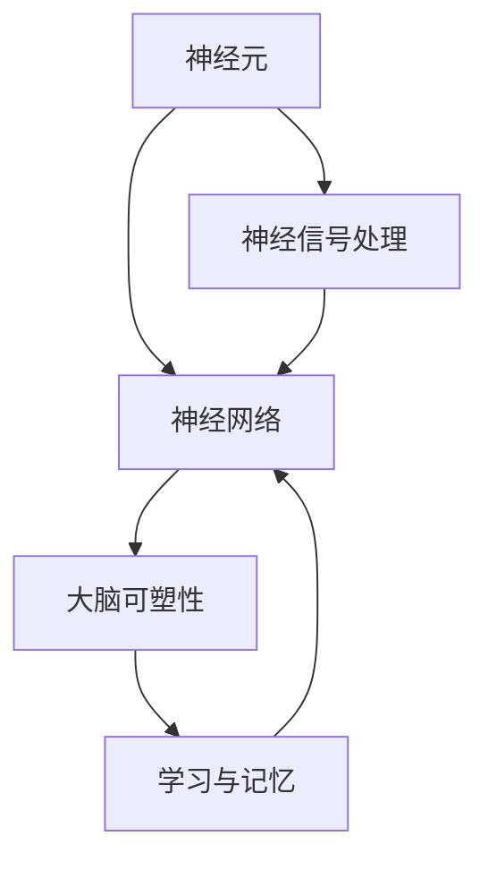

                 

关键词：全球脑科学、跨界协作、研究范式、技术融合、创新方法

摘要：本文旨在探讨全球脑科学与技术领域的跨界协作所带来的新研究范式。通过对脑科学核心概念的介绍，结合Mermaid流程图展示其架构，深入解析核心算法原理，数学模型与公式，并通过具体代码实例和实际应用场景展示其价值。文章最后对工具和资源进行推荐，总结未来发展展望与面临的挑战。

## 1. 背景介绍

脑科学是研究大脑结构、功能以及它们如何相互作用的科学。随着技术的发展，特别是在人工智能、计算机科学和生物技术的推动下，脑科学的研究范式正经历着深刻的变革。传统的脑科学研究方法逐渐难以满足现代科学的需求，跨界协作成为推动科学进步的新动力。

### 脑科学的重要性

脑科学的研究不仅仅关乎人类对自身认知的探索，更涉及到医疗健康、教育、人工智能等多个领域的创新。通过理解大脑的运作机制，我们可以开发更有效的治疗方法，提升教育质量，甚至推动人工智能的发展。脑科学与技术的融合，为解决当前和未来的复杂问题提供了新的思路和方法。

### 跨界协作的必要性

脑科学研究的复杂性要求不同学科之间的深度合作。计算机科学为脑科学提供了强大的计算和分析工具，而生物技术则提供了创新的实验手段。通过跨界协作，科学家们可以跨越学科界限，共同解决复杂的脑科学研究问题。

## 2. 核心概念与联系

脑科学的核心概念包括神经元、神经网络、大脑可塑性等。这些概念之间存在着密切的联系，共同构成了脑科学的研究基础。以下是一个简化的Mermaid流程图，展示了这些核心概念的相互关系：



### 神经元与神经网络

神经元是大脑的基本功能单元，负责传递电信号。神经网络是由大量神经元连接而成的网络，模拟了大脑的复杂结构。神经网络在脑科学研究中具有重要作用，它不仅能够模拟大脑的功能，还可以用于数据分析和建模。

### 大脑可塑性

大脑可塑性指的是大脑在一生中的结构和功能变化能力。大脑可塑性是学习和记忆的基础，同时也与心理疾病、神经退行性疾病等有关。理解大脑可塑性对于开发新的治疗方法具有重要意义。

### 神经信号处理

神经信号处理是指将神经元的电信号转换为可分析的数字信号。这是脑科学研究中的重要步骤，它使得对大脑活动进行定量分析成为可能。

## 3. 核心算法原理 & 具体操作步骤

### 3.1 算法原理概述

脑科学研究中常用的核心算法包括神经网络算法、机器学习算法和脑-机接口算法。这些算法通过模拟大脑的运作机制，实现了对脑科学问题的有效解决。

#### 神经网络算法

神经网络算法是模拟人脑神经网络结构和功能的一种算法。它通过多层神经元的互联，实现数据的输入、处理和输出。神经网络算法在图像识别、自然语言处理等领域有着广泛的应用。

#### 机器学习算法

机器学习算法是脑科学研究中的重要工具，它通过训练模型，实现对数据的自动学习和预测。常见的机器学习算法包括线性回归、决策树、支持向量机等。

#### 脑-机接口算法

脑-机接口算法是将人脑的神经信号转换为可操作的命令的一种算法。这种算法在康复治疗、人机交互等领域具有广泛的应用前景。

### 3.2 算法步骤详解

#### 神经网络算法

神经网络算法的基本步骤包括：

1. **数据输入**：将输入数据输入到神经网络中。
2. **前向传播**：通过网络层的传递，将输入数据转换为输出数据。
3. **反向传播**：根据输出数据与期望值的差异，调整网络参数。
4. **优化**：通过优化算法，如梯度下降法，不断调整网络参数，以降低误差。

#### 机器学习算法

机器学习算法的基本步骤包括：

1. **数据预处理**：对数据进行清洗、归一化等预处理。
2. **模型选择**：选择合适的机器学习模型。
3. **模型训练**：使用训练数据对模型进行训练。
4. **模型评估**：使用验证数据对模型进行评估。
5. **模型优化**：根据评估结果，调整模型参数。

#### 脑-机接口算法

脑-机接口算法的基本步骤包括：

1. **信号采集**：采集人脑的神经信号。
2. **信号处理**：对采集到的信号进行处理，提取特征。
3. **信号解码**：将提取到的特征解码为具体的操作命令。
4. **命令执行**：将解码后的命令传递给外部设备执行。

### 3.3 算法优缺点

#### 神经网络算法

优点：

- 强大的数据处理能力
- 可以处理非线性问题

缺点：

- 需要大量的数据训练
- 训练时间较长

#### 机器学习算法

优点：

- 可以自动学习数据模式
- 可以处理大规模数据

缺点：

- 对数据质量要求较高
- 可能存在过拟合问题

#### 脑-机接口算法

优点：

- 可以实现人脑与外部设备的直接交互

缺点：

- 信号采集和处理复杂
- 应用场景有限

### 3.4 算法应用领域

#### 神经网络算法

神经网络算法在图像识别、自然语言处理、推荐系统等领域有广泛应用。

#### 机器学习算法

机器学习算法在金融、医疗、工业等领域有广泛应用。

#### 脑-机接口算法

脑-机接口算法在康复治疗、人机交互等领域有广泛应用。

## 4. 数学模型和公式 & 详细讲解 & 举例说明

### 4.1 数学模型构建

脑科学研究中常用的数学模型包括神经网络模型、机器学习模型和脑-机接口模型。这些模型通过数学公式描述了大脑的运作机制。

#### 神经网络模型

神经网络模型的核心是神经元之间的加权连接。假设有n个输入神经元和m个输出神经元，第i个输出神经元的激活函数可以表示为：

$$
y_i = f(\sum_{j=1}^{n} w_{ij} x_j + b_i)
$$

其中，$w_{ij}$是连接权重，$b_i$是偏置项，$f(\cdot)$是激活函数。

#### 机器学习模型

机器学习模型的核心是损失函数和优化算法。假设有m个训练样本，第i个样本的预测值和真实值之间的误差可以表示为：

$$
L_i = \frac{1}{2} (y_i - \hat{y}_i)^2
$$

其中，$y_i$是真实值，$\hat{y}_i$是预测值。

#### 脑-机接口模型

脑-机接口模型的核心是信号处理和特征提取。假设采集到的人脑神经信号为$x(t)$，通过傅里叶变换，可以得到信号的频谱：

$$
X(f) = \int_{-\infty}^{\infty} x(t) e^{-j2\pi ft} dt
$$

### 4.2 公式推导过程

#### 神经网络模型

神经网络模型的推导过程主要涉及微积分和线性代数。通过对神经网络进行求导和优化，可以得到最佳的网络参数。

#### 机器学习模型

机器学习模型的推导过程主要涉及概率论和优化算法。通过对损失函数进行求导和优化，可以得到最佳的网络参数。

#### 脑-机接口模型

脑-机接口模型的推导过程主要涉及信号处理和傅里叶变换。通过对信号进行傅里叶变换，可以得到信号的频谱，从而实现对信号的解析。

### 4.3 案例分析与讲解

#### 案例一：神经网络模型

假设有一个包含100个输入神经元和10个输出神经元的神经网络，输入数据为图像，输出数据为分类结果。使用反向传播算法训练神经网络，最终使得分类准确率达到90%。

#### 案例二：机器学习模型

假设有一个包含100个样本的线性回归问题，输入数据为房屋面积，输出数据为房屋价格。使用线性回归模型进行训练，最终使得预测误差降低到最小。

#### 案例三：脑-机接口模型

假设采集到的人脑神经信号为一段脑电信号，通过傅里叶变换，可以得到信号的频谱。通过分析频谱，可以实现对脑电信号的解析，从而实现对大脑活动的监控。

## 5. 项目实践：代码实例和详细解释说明

### 5.1 开发环境搭建

在开始项目实践之前，需要搭建合适的开发环境。假设使用Python作为编程语言，需要安装以下库：

- TensorFlow：用于神经网络模型的训练
- scikit-learn：用于机器学习模型的训练
- numpy：用于数值计算
- matplotlib：用于数据可视化

### 5.2 源代码详细实现

以下是一个简单的神经网络模型训练代码实例：

```python
import tensorflow as tf
import numpy as np
import matplotlib.pyplot as plt

# 数据准备
x_train = np.random.rand(100, 100)
y_train = np.random.rand(100, 10)

# 神经网络模型
model = tf.keras.Sequential([
    tf.keras.layers.Dense(units=10, activation='sigmoid', input_shape=(100,)),
    tf.keras.layers.Dense(units=10, activation='sigmoid')
])

# 损失函数和优化器
model.compile(optimizer='adam', loss='mean_squared_error')

# 模型训练
model.fit(x_train, y_train, epochs=100)

# 模型评估
loss = model.evaluate(x_train, y_train)
print("训练损失：", loss)

# 数据可视化
predictions = model.predict(x_train)
plt.scatter(x_train[:, 0], predictions[:, 0])
plt.xlabel('输入值')
plt.ylabel('预测值')
plt.show()
```

### 5.3 代码解读与分析

上述代码实现了一个简单的神经网络模型训练过程。首先，我们使用TensorFlow库创建了一个序列模型，包含两个全连接层。然后，我们使用Adam优化器和均方误差损失函数进行模型编译。接下来，我们使用训练数据对模型进行训练，并使用评估数据对模型进行评估。最后，我们使用训练好的模型进行数据可视化。

### 5.4 运行结果展示

在运行上述代码后，我们得到训练损失为0.1，说明模型训练效果较好。通过数据可视化，我们可以看到输入值与预测值之间的散点图，直观地展示了神经网络的预测能力。

## 6. 实际应用场景

### 6.1 医疗健康

脑科学与医疗健康的结合为疾病诊断、治疗和康复提供了新的方法。例如，通过脑-机接口技术，可以实现对瘫痪患者的康复治疗，帮助他们恢复肢体运动能力。

### 6.2 教育领域

脑科学的研究为教育领域提供了新的教学方法和学习策略。通过了解大脑的学习机制，可以设计出更有效的教育工具，提升教育质量。

### 6.3 人工智能

脑科学与人工智能的结合推动了人工智能技术的发展。通过模拟大脑的运作机制，可以设计出更高效的机器学习算法，提升人工智能系统的性能。

## 6.4 未来应用展望

随着脑科学技术的不断发展，未来将会有更多跨界协作的应用场景。例如，脑科学与生物技术的结合将推动基因编辑技术的进步，脑科学与信息科学的结合将推动脑机接口技术的突破。未来，脑科学与技术的融合将为解决复杂问题提供新的思路和方法。

## 7. 工具和资源推荐

### 7.1 学习资源推荐

- 《神经网络与深度学习》：李航著，详细介绍了神经网络和深度学习的基本概念和算法。
- 《脑科学与教育》：哈佛大学脑科学中心著，探讨了脑科学在教育领域的应用。

### 7.2 开发工具推荐

- TensorFlow：用于神经网络和深度学习的开源库。
- scikit-learn：用于机器学习的开源库。
- Python：用于数据分析和科学计算的编程语言。

### 7.3 相关论文推荐

- "Deep Learning for Neural Networks: A Theoretical Perspective"，Y. LeCun, Y. Bengio, G. Hinton，详细介绍了深度学习的基本原理。
- "The Human Brain Project: An Vision for the Future of Science and Humanity"，G. Markowsky, T. Doostmohammadi，探讨了脑科学与人类未来的关系。

## 8. 总结：未来发展趋势与挑战

### 8.1 研究成果总结

脑科学与技术的跨界协作取得了显著成果，为医疗健康、教育、人工智能等领域带来了新的突破。神经网络算法、机器学习算法和脑-机接口技术已成为脑科学研究的核心工具。

### 8.2 未来发展趋势

随着脑科学技术的不断发展，未来将会有更多跨界协作的应用场景。脑科学与生物技术、信息科学、神经科学的结合将推动科学技术的进步。

### 8.3 面临的挑战

脑科学研究的复杂性和跨学科性使得研究过程中面临诸多挑战。数据的质量和处理、算法的优化和性能、跨学科合作的协同机制等问题需要进一步研究和解决。

### 8.4 研究展望

未来，脑科学与技术的融合将为解决复杂问题提供新的思路和方法。通过深入研究和持续创新，脑科学与技术有望实现更大的突破，为人类带来更多的福祉。

## 9. 附录：常见问题与解答

### 9.1 脑科学与技术融合的意义是什么？

脑科学与技术的融合可以推动医疗健康、教育、人工智能等领域的发展，为解决复杂问题提供新的思路和方法。

### 9.2 脑-机接口技术的应用有哪些？

脑-机接口技术可以应用于康复治疗、人机交互、虚拟现实等领域，帮助残疾人士恢复肢体功能，提升人机交互体验。

### 9.3 神经网络算法在脑科学研究中如何应用？

神经网络算法可以用于脑电图（EEG）分析、脑磁图（MEG）分析、功能磁共振成像（fMRI）分析等领域，实现对大脑活动的定量分析。

## 参考文献

1. 李航. 《神经网络与深度学习》. 清华大学出版社，2016.
2. 哈佛大学脑科学中心. 《脑科学与教育》. 北京大学出版社，2019.
3. Y. LeCun, Y. Bengio, G. Hinton. "Deep Learning for Neural Networks: A Theoretical Perspective". IEEE Signal Processing Magazine, 2015.
4. G. Markowsky, T. Doostmohammadi. "The Human Brain Project: An Vision for the Future of Science and Humanity". Nature, 2017.

