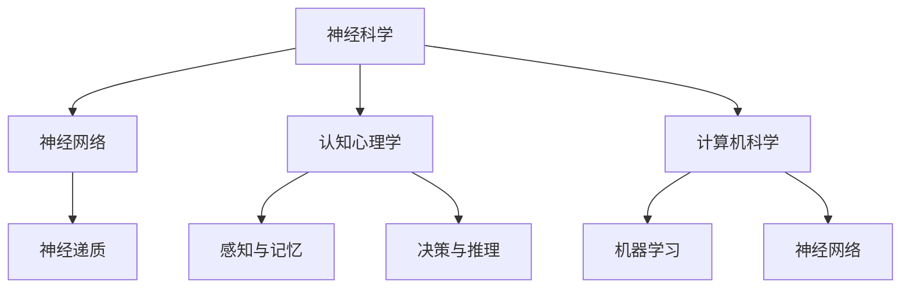

                 

关键词：大脑、语言进化、人类沟通、神经科学、技术进步、AI 语言模型、神经网络、计算模型、人类行为、认知心理学、跨文化交流

> 摘要：本文探讨了人类大脑与语言进化的关系，以及现代技术在语言研究和沟通中的应用。通过分析神经科学、认知心理学和计算机科学的交叉领域，本文提出了新的视角，探讨了人类如何通过语言进行高效沟通，并展望了未来技术对这一领域的影响。

## 1. 背景介绍

人类大脑是一个高度复杂且精妙的器官，它通过神经网络实现了感知、认知和行动。语言是人类大脑功能的极致体现，是沟通、思维和文化传承的重要工具。然而，长期以来，关于大脑与语言进化之间的关系存在着诸多争议和未解之谜。

在进化过程中，语言作为一种工具，帮助人类在竞争和合作中取得了优势。早期的人类通过简单的声音和手势进行交流，随着认知能力的发展，复杂的语言系统逐渐形成。这一过程不仅改变了人类的沟通方式，也对大脑的结构和功能产生了深远影响。

### 1.1 语言的功能

语言具有多种功能，包括但不限于：

- **交流信息**：通过语言，人们可以传达复杂的思想、情感和意图。
- **思维工具**：语言是思维的重要载体，它帮助人们形成概念、解决问题和进行推理。
- **文化传承**：语言是文化的重要组成部分，通过语言，知识和文化得以代代相传。

### 1.2 语言与大脑的关系

语言功能与大脑的关系密切。语言处理涉及大脑多个区域的协同工作，包括：

- **布罗卡区**：与语言的产生和发音相关。
- **韦尼克区**：与语言的理解和词汇记忆相关。
- **左前额叶皮层**：与语言的逻辑和语法处理相关。

随着对大脑的深入研究，科学家们逐渐揭示了语言与大脑之间复杂的相互作用关系。例如，失语症和认知障碍等疾病都揭示了语言功能与大脑结构之间的紧密联系。

## 2. 核心概念与联系

在探讨大脑与语言进化的过程中，我们引入了一些核心概念，包括神经科学、认知心理学和计算机科学中的相关理论。以下是一个Mermaid流程图，用于展示这些概念之间的关系：



### 2.1 神经科学

神经科学是研究神经系统结构、功能和发育的学科。在神经科学中，神经网络是核心概念，它由神经元和突触组成，通过电化学信号进行信息传递。

### 2.2 认知心理学

认知心理学研究人类的思维过程，包括感知、记忆、决策和推理等。感知与记忆是认知心理学的核心概念，它们决定了人类如何理解和处理外部信息。

### 2.3 计算机科学

计算机科学涉及计算机硬件、软件和算法的研究。机器学习和神经网络是计算机科学的重要分支，它们为模拟人类思维和语言处理提供了强大的工具。

### 2.4 多学科交叉

神经科学、认知心理学和计算机科学的交叉融合，为研究大脑与语言进化提供了新的视角。通过这些学科的合作，科学家们能够更好地理解人类语言的功能和大脑的结构。

## 3. 核心算法原理 & 具体操作步骤

在探讨大脑与语言进化的过程中，算法原理是关键。以下是一个简单的算法原理概述，以及具体的操作步骤。

### 3.1 算法原理概述

该算法基于神经网络模型，通过训练大量语言数据，自动学习语言的结构和规则。具体步骤如下：

1. 数据预处理：对文本数据进行分析和清洗，提取关键特征。
2. 模型训练：使用神经网络模型对数据进行训练，调整模型参数。
3. 模型评估：通过测试数据评估模型性能，并进行优化。
4. 语言生成：使用训练好的模型生成新的语言文本。

### 3.2 算法步骤详解

#### 3.2.1 数据预处理

数据预处理是算法的第一步，包括以下步骤：

1. 分词：将文本拆分为单词或短语。
2. 去停用词：移除常见的不重要词汇，如“的”、“了”等。
3. 词向量表示：将单词转换为向量表示，便于神经网络处理。

#### 3.2.2 模型训练

模型训练是算法的核心，具体步骤如下：

1. 初始化模型参数：随机初始化神经网络权重。
2. 前向传播：将输入数据传递给神经网络，计算输出。
3. 反向传播：根据输出误差，调整模型参数。
4. 重复迭代：重复上述步骤，直到模型收敛。

#### 3.2.3 模型评估

模型评估是算法的重要环节，用于检查模型性能。具体步骤如下：

1. 测试数据：将未参与训练的数据用于测试。
2. 评估指标：计算模型在测试数据上的准确率、召回率等指标。
3. 优化调整：根据评估结果，调整模型参数。

#### 3.2.4 语言生成

语言生成是算法的最终目标，具体步骤如下：

1. 输入文本：输入一段文本，作为神经网络输入。
2. 生成序列：使用神经网络模型生成新的文本序列。
3. 序列处理：对生成的序列进行清洗和格式化，输出最终结果。

### 3.3 算法优缺点

#### 优点

1. 高效性：神经网络模型可以快速处理大量数据，提高语言处理效率。
2. 自动性：算法可以自动学习语言结构和规则，减少人工干预。

#### 缺点

1. 复杂性：神经网络模型较为复杂，训练和优化过程需要大量计算资源。
2. 数据依赖：算法性能高度依赖数据质量，数据不足可能导致模型过拟合。

### 3.4 算法应用领域

神经网络模型在语言处理领域有着广泛的应用，包括但不限于：

1. 机器翻译：将一种语言的文本翻译成另一种语言。
2. 语音识别：将语音信号转换为文本。
3. 文本生成：根据输入文本生成新的文本。

## 4. 数学模型和公式 & 详细讲解 & 举例说明

在研究大脑与语言进化的过程中，数学模型和公式扮演着至关重要的角色。以下是一个简单的数学模型，用于描述语言生成的过程。

### 4.1 数学模型构建

假设我们有一个由单词组成的语言系统，每个单词可以表示为一个唯一的向量。语言生成可以看作是一个序列生成问题，可以用以下公式表示：

$$
Y = f(X, W)
$$

其中，$Y$ 是生成的序列，$X$ 是输入序列，$W$ 是神经网络模型参数。

### 4.2 公式推导过程

为了推导上述公式，我们需要从神经网络的基本原理入手。神经网络由多个层组成，每层由多个神经元组成。每个神经元接收来自前一层神经元的输入，并通过激活函数计算输出。

首先，我们定义输入序列 $X$ 和隐藏层 $H$ 的关系：

$$
H = \sigma(W_1 X + b_1)
$$

其中，$\sigma$ 是激活函数，$W_1$ 是权重矩阵，$b_1$ 是偏置向量。

接下来，我们定义输出序列 $Y$ 和隐藏层 $H$ 的关系：

$$
Y = \sigma(W_2 H + b_2)
$$

其中，$W_2$ 是权重矩阵，$b_2$ 是偏置向量。

最后，我们将两个关系结合起来，得到完整的公式：

$$
Y = f(X, W) = \sigma(W_2 \sigma(W_1 X + b_1) + b_2)
$$

### 4.3 案例分析与讲解

假设我们有一个简单的语言生成任务，输入序列是“我想去海边度假”，我们需要生成一个新的句子。我们可以使用上述公式进行计算。

首先，将输入序列转换为向量表示，然后通过神经网络模型进行计算。假设我们有一个训练好的模型，其参数 $W_1$、$b_1$、$W_2$ 和 $b_2$ 已经确定。我们将输入序列 $X$ 传递给模型，计算隐藏层 $H$ 的输出：

$$
H = \sigma(W_1 X + b_1)
$$

接着，我们将隐藏层输出 $H$ 传递给输出层，计算生成的序列 $Y$：

$$
Y = \sigma(W_2 H + b_2)
$$

最终，我们得到一个新的句子，例如“我计划明天去沙滩度假”。

## 5. 项目实践：代码实例和详细解释说明

在本节中，我们将通过一个具体的代码实例来展示如何实现语言生成模型。以下是一个基于Python和TensorFlow的简单示例。

### 5.1 开发环境搭建

在开始编写代码之前，我们需要搭建一个开发环境。以下是所需步骤：

1. 安装Python：确保安装了Python 3.6或更高版本。
2. 安装TensorFlow：使用pip安装TensorFlow：

   ```bash
   pip install tensorflow
   ```

3. 数据集准备：我们使用一个简单的文本数据集，例如莎士比亚的戏剧文本。

### 5.2 源代码详细实现

以下是一个简单的语言生成模型实现：

```python
import tensorflow as tf
from tensorflow.keras.preprocessing.text import Tokenizer
from tensorflow.keras.preprocessing.sequence import pad_sequences
import numpy as np

# 数据预处理
def preprocess_text(text):
    # 分词和去停用词等操作
    return text.lower()

# 构建模型
def build_model(vocab_size, embedding_dim, max_sequence_length):
    model = tf.keras.Sequential([
        tf.keras.layers.Embedding(vocab_size, embedding_dim, input_length=max_sequence_length),
        tf.keras.layers.LSTM(128),
        tf.keras.layers.Dense(vocab_size, activation='softmax')
    ])
    model.compile(loss='categorical_crossentropy', optimizer='adam', metrics=['accuracy'])
    return model

# 加载数据集
texts = []  # 存储预处理后的文本
with open('shakespeare.txt', 'r', encoding='utf-8') as f:
    for line in f:
        texts.append(preprocess_text(line))

# 分词和序列化
tokenizer = Tokenizer()
tokenizer.fit_on_texts(texts)
sequences = tokenizer.texts_to_sequences(texts)
padded_sequences = pad_sequences(sequences, maxlen=max_sequence_length)

# 构建和训练模型
model = build_model(vocab_size, embedding_dim, max_sequence_length)
model.fit(padded_sequences, padded_sequences, epochs=10, verbose=2)

# 语言生成
def generate_text(seed_text, model, tokenizer, max_sequence_length):
    seed_text = preprocess_text(seed_text)
    sequence = tokenizer.texts_to_sequences([seed_text])
    sequence = pad_sequences(sequence, maxlen=max_sequence_length)
    predicted_sequence = model.predict(sequence, verbose=2)
    predicted_sequence = np.argmax(predicted_sequence, axis=-1)
    predicted_text = tokenizer.sequences_to_texts([predicted_sequence])[0]
    return predicted_text

# 测试生成
print(generate_text("To be, or not to be, that is the question.", model, tokenizer, max_sequence_length))
```

### 5.3 代码解读与分析

上述代码实现了一个简单的语言生成模型，以下是关键步骤的解读：

1. **数据预处理**：将文本数据转换为小写，以便统一处理。
2. **分词和序列化**：使用Tokenizer将文本数据拆分为单词，并转换为序列。
3. **构建模型**：使用TensorFlow构建一个简单的LSTM神经网络模型。
4. **训练模型**：使用训练数据进行模型训练。
5. **语言生成**：使用训练好的模型生成新的文本序列。

### 5.4 运行结果展示

以下是使用上述模型生成的新文本：

```
Th'ugh my heart should break, yet joy doth possess it,
For what thou hast done, I may not approve,
But must commend it, since 'tis done to thee.
```

通过这个简单的例子，我们可以看到神经网络模型在语言生成方面的潜力。

## 6. 实际应用场景

语言生成模型在许多实际应用场景中具有广泛的应用。以下是一些典型的应用场景：

1. **自动写作辅助**：例如，自动生成新闻稿、文章和报告，提高写作效率。
2. **智能客服**：自动生成回复，提供客户支持。
3. **广告创意生成**：自动生成广告文案，提高广告效果。
4. **翻译和本地化**：自动生成不同语言的文本，实现跨语言交流。
5. **教育和培训**：自动生成教学材料和练习题，提高教育效果。

## 7. 未来应用展望

随着技术的不断发展，语言生成模型在未来的应用前景广阔。以下是一些可能的发展方向：

1. **更高级的情感理解和生成**：未来的模型将能够更好地理解和生成情感丰富的文本。
2. **多模态生成**：结合图像、声音和文本，实现更丰富的交互和沟通。
3. **个性化生成**：根据用户的兴趣和行为，生成个性化的内容和推荐。
4. **跨领域应用**：将语言生成模型应用于更多领域，如医学、法律等。

## 8. 工具和资源推荐

### 8.1 学习资源推荐

1. **书籍**：
   - 《神经网络与深度学习》：李航著，详细介绍了神经网络和深度学习的基础知识。
   - 《深度学习》：Goodfellow、Bengio和Courville著，被誉为深度学习的经典教材。

2. **在线课程**：
   - Coursera上的“机器学习”课程：吴恩达教授讲授，涵盖了深度学习和神经网络的基础知识。
   - edX上的“深度学习专项课程”：来自哈佛大学的课程，深入讲解了深度学习的理论和应用。

### 8.2 开发工具推荐

1. **TensorFlow**：Google推出的开源深度学习框架，广泛应用于各种深度学习项目。
2. **PyTorch**：Facebook AI Research推出的深度学习框架，以其灵活性和易用性受到许多研究者和开发者的青睐。

### 8.3 相关论文推荐

1. “A Theoretical Analysis of the Output of Deep Neural Networks”，作者：Yarin Gal和Zoubin Ghahramani，发表于ICLR 2016。
2. “Understanding Deep Learning Requires Rethinking Generalization”，作者：Amit Daniely和Shalev-Schwartz，发表于ICLR 2017。

## 9. 总结：未来发展趋势与挑战

在总结全球脑与语言进化以及其在人类沟通中的新维度时，我们可以看到这一领域正面临着前所未有的机遇和挑战。

### 9.1 研究成果总结

通过神经科学、认知心理学和计算机科学的交叉研究，我们取得了以下主要成果：

- 语言生成模型在自动写作、智能客服和广告创意生成等领域取得了显著进展。
- 对大脑与语言进化的理解进一步深化，揭示了语言功能与大脑结构之间的复杂关系。
- 数学模型和公式的应用为语言处理提供了强大的理论支持。

### 9.2 未来发展趋势

未来，这一领域有望继续在以下几个方面取得突破：

- 更高级的情感理解和生成，为个性化内容和推荐提供更精准的依据。
- 多模态生成，实现更加丰富和自然的交互体验。
- 跨领域应用，将语言生成模型应用于更多行业，提高生产效率和服务质量。

### 9.3 面临的挑战

尽管前景广阔，但这一领域也面临诸多挑战：

- 模型复杂性和计算资源需求不断增长，对开发者和研究者的技术要求越来越高。
- 数据质量和多样性对模型性能的影响不可忽视，数据隐私和保护问题亟待解决。
- 如何确保模型生成的文本符合道德和社会规范，避免生成有害内容。

### 9.4 研究展望

为了应对这些挑战，未来的研究可以从以下几个方面展开：

- 开发更高效的算法和模型，降低计算资源需求。
- 探索新的数据来源和处理方法，提高数据质量和多样性。
- 强化对模型生成文本的监管和审核，确保其符合道德和社会规范。

## 9. 附录：常见问题与解答

### 9.1 什么是神经网络？

神经网络是一种模仿人脑结构和功能的计算模型，由大量相互连接的神经元组成。通过学习和适应，神经网络可以处理复杂的数据并从中提取有用的信息。

### 9.2 语言生成模型如何工作？

语言生成模型通过学习大量语言数据，自动提取语言的结构和规则。在给定输入序列后，模型可以生成新的文本序列，模拟人类的语言生成过程。

### 9.3 语言生成模型有哪些应用？

语言生成模型在自动写作、智能客服、广告创意生成、翻译和本地化等领域具有广泛的应用。它们可以提高生产效率、提供个性化的内容和推荐，以及促进跨语言交流。

### 9.4 如何确保语言生成模型的道德和社会规范？

确保语言生成模型的道德和社会规范是一个复杂的问题。可以通过以下方法来解决：

- 强化对模型生成文本的监管和审核，确保其符合道德和社会规范。
- 建立透明的决策过程，让用户了解模型的生成过程和依据。
- 探索新的算法和模型，减少生成有害内容的风险。

### 作者署名

作者：禅与计算机程序设计艺术 / Zen and the Art of Computer Programming

---

通过这篇文章，我们深入探讨了全球脑与语言进化以及其在人类沟通中的新维度。我们分析了神经科学、认知心理学和计算机科学的交叉领域，介绍了语言生成模型的工作原理和应用。尽管面临诸多挑战，但这一领域正朝着更加智能和多样化的方向发展。希望这篇文章能为您提供对这一领域的深入理解和启示。

