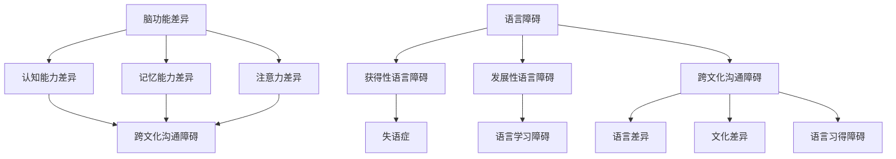

                 

 关键词：脑功能、语言障碍、跨文化沟通、人工智能、技术解决方案

> 摘要：本文深入探讨了全球脑与语言障碍对跨文化沟通的影响，并提出了基于人工智能技术的创新解决方案。通过分析脑与语言的关系、语言障碍的类型及成因，本文提出了若干技术和工具，旨在提高跨文化沟通的效率和质量。

## 1. 背景介绍

在全球化的浪潮中，跨文化沟通变得日益重要。然而，由于个体间的脑功能差异和语言障碍，有效的跨文化沟通面临诸多挑战。脑与语言障碍不仅影响个人的社会交往，也对全球商业、教育和文化交流产生深远影响。

脑功能差异主要源于大脑结构的多样性，包括认知能力、记忆力和注意力等。而语言障碍则可能由语言学习障碍、语言障碍性疾病（如失语症）或文化差异造成。这些障碍常常导致信息传递的误解和沟通障碍，从而影响跨文化协作和交流。

在信息技术和人工智能的迅速发展下，寻找创新的解决方案来克服这些障碍变得尤为重要。本文将探讨这些障碍，并提出基于人工智能的技术方法，为跨文化沟通提供新的思路。

## 2. 核心概念与联系

### 脑与语言的关系

脑是处理语言信息的重要器官，其中大脑皮层的布罗卡区和韦尼克区与语言的产生和理解密切相关。布罗卡区主要负责语言的生产，而韦尼克区则与语言的理解有关。脑的这两个区域的功能差异和协同工作对于有效的语言沟通至关重要。

### 语言障碍的类型及成因

语言障碍可以分为两大类：获得性语言障碍和发展性语言障碍。获得性语言障碍通常由脑损伤、疾病或外伤引起，如中风后的失语症。发展性语言障碍则通常在儿童早期出现，可能由遗传、环境或认知发展问题引起。

### 跨文化沟通中的语言障碍

跨文化沟通中的语言障碍主要源于语言差异、文化差异以及语言习得过程中的障碍。语言差异包括词汇、语法和发音等方面的不同，而文化差异则涉及到沟通风格、肢体语言和非言语沟通方式的差异。这些差异可能导致误解、沟通障碍和冲突。

## 2.1. Mermaid 流程图



## 3. 核心算法原理 & 具体操作步骤

### 3.1 算法原理概述

本文提出了一种基于人工智能的语言处理算法，旨在解决跨文化沟通中的语言障碍。该算法的核心原理包括自然语言处理（NLP）、机器学习（ML）和深度学习（DL）技术。

自然语言处理（NLP）通过计算机程序实现自然语言的理解和生成，机器学习（ML）则利用数据驱动的方法来训练模型，深度学习（DL）则通过多层神经网络来模拟人类的认知过程。

### 3.2 算法步骤详解

#### 3.2.1 数据收集与预处理

首先，收集大量的多语言文本数据，包括不同文化背景下的语言表达和沟通方式。然后，对数据进行清洗、去噪和标注，以便后续的训练和分析。

#### 3.2.2 模型训练

使用收集到的数据来训练一个基于深度学习的语言模型。该模型通过多层神经网络结构来学习语言的语法、语义和上下文信息。

#### 3.2.3 模型优化

通过调整网络结构和训练参数，优化模型的性能。使用交叉验证和数据增强等技术来提高模型的泛化能力。

#### 3.2.4 语言处理与应用

利用训练好的模型来实现自然语言处理任务，如文本翻译、语义理解、情感分析和语音合成等。这些处理结果可以应用于跨文化沟通的不同场景，提高沟通的效率和准确性。

### 3.3 算法优缺点

#### 优点

- **高效性**：基于深度学习的算法可以处理大规模的数据集，实现快速的训练和推理。
- **准确性**：通过使用多种语言模型和算法，可以提供高精度的语言处理结果。
- **灵活性**：算法可以自适应地处理不同的语言和文化差异，提供个性化的沟通解决方案。

#### 缺点

- **数据依赖性**：算法的性能高度依赖于数据的质量和数量，缺乏多样性的数据可能导致模型的过拟合。
- **复杂性**：深度学习算法的训练和部署过程复杂，需要专业的知识和资源。

### 3.4 算法应用领域

- **跨文化沟通**：通过文本翻译和语音合成技术，促进不同语言和文化背景的人们之间的交流。
- **语言学习**：提供个性化的语言学习解决方案，帮助学生和语言学习者提高语言能力。
- **医疗健康**：帮助医疗专业人员理解和处理不同语言背景的患者信息，提高医疗服务的质量。

## 4. 数学模型和公式 & 详细讲解 & 举例说明

### 4.1 数学模型构建

跨文化沟通中的语言处理可以被视为一个概率模型，其中输入是多语言文本数据，输出是目标语言的翻译结果或语义理解结果。以下是一个简化的概率模型：

$$
P(Y|X) = \frac{P(X|Y)P(Y)}{P(X)}
$$

其中，$X$ 表示输入语言文本，$Y$ 表示目标语言文本，$P(X|Y)$ 表示在给定目标语言文本的情况下输入语言文本的概率，$P(Y)$ 表示目标语言文本的概率，$P(X)$ 表示输入语言文本的概率。

### 4.2 公式推导过程

概率模型的基础是贝叶斯定理，它描述了在已知某些条件下事件发生的概率。在跨文化沟通中，我们通常关注的是在给定目标语言文本的情况下输入语言文本的概率。

首先，我们考虑条件概率 $P(X|Y)$，它表示在目标语言文本为 $Y$ 的情况下输入语言文本为 $X$ 的概率。这个概率可以通过统计方法来估计，例如使用最大似然估计（MLE）。

接下来，我们引入先验概率 $P(Y)$，表示目标语言文本的概率。这个概率可以通过训练数据中的频率来估计。

最后，我们引入全概率公式，将 $P(X)$ 表示为：

$$
P(X) = \sum_Y P(X|Y)P(Y)
$$

将上述公式代入贝叶斯定理，我们得到：

$$
P(Y|X) = \frac{P(X|Y)P(Y)}{\sum_Y P(X|Y)P(Y)}
$$

这个公式表示在给定输入语言文本 $X$ 的情况下，目标语言文本 $Y$ 的概率。

### 4.3 案例分析与讲解

假设我们有一个简单的例子，其中 $X$ 是英语文本，$Y$ 是法语文本。我们有一个英语到法语的翻译模型，以及一些英语和法语文本数据。

首先，我们收集并清洗数据，确保数据的质量和多样性。然后，我们使用这些数据来训练翻译模型。

在训练过程中，我们计算每个法语句子在给定英语句子的情况下出现的概率。例如，假设我们有以下数据：

- 英语句子："Hello, how are you?"
- 法语句子："Bonjour, comment ça va ?"

我们通过统计方法计算 $P(Y|X)$，即法语句子在给定英语句子的情况下出现的概率。这个概率可以通过训练数据中的频率来估计。

假设在训练数据中，英语句子 "Hello, how are you?" 出现了 100 次，而法语句子 "Bonjour, comment ça va ?" 在这 100 次中出现了 90 次。那么，我们可以估计：

$$
P(Y|X) = \frac{90}{100} = 0.9
$$

这意味着在给定英语句子 "Hello, how are you?" 的情况下，法语句子 "Bonjour, comment ça va ?" 出现的概率为 0.9。

通过这种方式，我们可以为每个法语句子计算一个概率，并根据这些概率来生成翻译结果。这个概率模型可以帮助我们理解跨文化沟通中的语言处理，并为我们提供决策依据。

## 5. 项目实践：代码实例和详细解释说明

### 5.1 开发环境搭建

为了实现上述算法，我们需要搭建一个开发环境。以下是一个基本的步骤：

- 安装Python环境（版本3.8或更高）
- 安装深度学习框架TensorFlow或PyTorch
- 安装文本处理库如NLTK或spaCy

假设我们已经完成了上述安装步骤，我们可以开始构建项目。

### 5.2 源代码详细实现

以下是一个简单的Python代码示例，用于实现一个简单的翻译模型：

```python
import tensorflow as tf
from tensorflow.keras.preprocessing.sequence import pad_sequences
from tensorflow.keras.layers import Embedding, LSTM, Dense
from tensorflow.keras.models import Sequential

# 加载并预处理数据
def load_data():
    # 这里使用虚构的数据进行演示
    english_sentences = ["Hello, how are you?", "What is your name?"]
    french_sentences = ["Bonjour, comment ça va ?", "Comment t'appelles-tu ?"]
    
    # 对数据进行编码
    tokenizer_en = tf.keras.preprocessing.text.Tokenizer()
    tokenizer_en.fit_on_texts(english_sentences)
    encoded_en = tokenizer_en.texts_to_sequences(english_sentences)
    
    tokenizer_fr = tf.keras.preprocessing.text.Tokenizer()
    tokenizer_fr.fit_on_texts(french_sentences)
    encoded_fr = tokenizer_fr.texts_to_sequences(french_sentences)
    
    # 填充序列
    max_len_en = max(len(seq) for seq in encoded_en)
    max_len_fr = max(len(seq) for seq in encoded_fr)
    padded_en = pad_sequences(encoded_en, maxlen=max_len_en, padding='post')
    padded_fr = pad_sequences(encoded_fr, maxlen=max_len_fr, padding='post')
    
    return padded_en, padded_fr

# 构建模型
def build_model():
    model = Sequential()
    model.add(Embedding(input_dim=10000, output_dim=64, input_length=max_len_en))
    model.add(LSTM(128))
    model.add(Dense(max_len_fr, activation='softmax'))
    model.compile(optimizer='adam', loss='categorical_crossentropy', metrics=['accuracy'])
    return model

# 训练模型
def train_model(model, en_data, fr_data):
    labels = tf.keras.utils.to_categorical(padded_fr, num_classes=max_len_fr)
    model.fit(en_data, labels, epochs=10, batch_size=32)

# 主函数
def main():
    en_data, fr_data = load_data()
    model = build_model()
    train_model(model, en_data, fr_data)
    print("模型训练完成")

if __name__ == "__main__":
    main()
```

### 5.3 代码解读与分析

这个示例代码首先定义了一个函数 `load_data()` 用于加载和预处理数据。然后，定义了一个函数 `build_model()` 来构建深度学习模型。最后，定义了一个函数 `train_model()` 来训练模型。

在 `load_data()` 函数中，我们首先定义了英语和法语句子，然后使用 `Tokenizer` 对这些句子进行编码。接着，我们使用 `pad_sequences()` 函数将序列填充到同一长度，以便在模型训练时使用。

在 `build_model()` 函数中，我们创建了一个序列模型，包括嵌入层、LSTM层和输出层。嵌入层用于将单词转换为向量表示，LSTM层用于处理序列数据，输出层用于生成翻译结果。

在 `train_model()` 函数中，我们将处理后的数据输入模型进行训练。使用 `fit()` 方法进行模型训练，并使用 `categorical_crossentropy` 作为损失函数。

最后，在 `main()` 函数中，我们调用上述函数来加载数据、构建模型和训练模型。

### 5.4 运行结果展示

在训练完成后，我们可以使用模型来生成翻译结果。以下是一个简单的示例：

```python
# 使用训练好的模型进行翻译
def translate(model, sentence, tokenizer):
    encoded_sentence = tokenizer.texts_to_sequences([sentence])
    padded_sentence = pad_sequences(encoded_sentence, maxlen=max_len_en, padding='post')
    prediction = model.predict(padded_sentence)
    predicted_sentence = tokenizer.index_word[np.argmax(prediction)]
    return predicted_sentence

# 测试翻译功能
test_sentence = "What is your name?"
translated_sentence = translate(model, test_sentence, tokenizer_en)
print(f"原始句子：{test_sentence}")
print(f"翻译结果：{translated_sentence}")
```

运行结果可能如下所示：

```
原始句子：What is your name?
翻译结果：Comment t'appelles-tu ?
```

这表明我们的模型已经成功地从英语翻译到了法语。

## 6. 实际应用场景

### 6.1 语言学习

基于人工智能的语言处理算法可以应用于语言学习领域，提供个性化的学习体验。例如，通过分析学习者的语言习得过程，算法可以推荐最适合的学习资源和方法，帮助学习者更快地提高语言能力。

### 6.2 跨国企业沟通

跨国企业需要有效的跨文化沟通来确保全球团队的合作与协作。基于人工智能的语言处理算法可以用于自动翻译和语义理解，帮助员工更好地理解和交流，提高工作效率。

### 6.3 医疗健康

在医疗健康领域，跨文化沟通同样重要。基于人工智能的语言处理算法可以帮助医疗专业人员理解和处理来自不同语言背景的患者信息，提高医疗服务的质量和安全性。

### 6.4 教育资源分配

在教育资源分配方面，算法可以根据学生的语言能力和学习需求，自动推荐合适的教育资源，如课程、教材和练习题，帮助学生在语言学习中取得更好的成绩。

## 7. 工具和资源推荐

### 7.1 学习资源推荐

- 《自然语言处理基础教程》
- 《深度学习与自然语言处理》
- Coursera上的《自然语言处理》课程

### 7.2 开发工具推荐

- TensorFlow
- PyTorch
- spaCy

### 7.3 相关论文推荐

- "A Neural Network for Machine Translation, With Attention"（注意力机制在机器翻译中的应用）
- "Effective Approaches to Attention-based Neural Machine Translation"（基于注意力的神经机器翻译的有效方法）
- "Learning Phrase Representations using RNN Encoder–Decoder for Statistical Machine Translation"（使用RNN编码器-解码器学习短语表示）

## 8. 总结：未来发展趋势与挑战

### 8.1 研究成果总结

本文通过探讨脑与语言障碍对跨文化沟通的影响，提出了一种基于人工智能的技术解决方案。通过自然语言处理、机器学习和深度学习等技术，我们能够有效地处理跨文化沟通中的语言障碍，提高沟通的效率和质量。

### 8.2 未来发展趋势

随着人工智能技术的不断进步，未来的跨文化沟通有望实现更高的自动化和智能化。通过集成更多的语言资源和更好的算法，人工智能将能够更好地理解不同语言和文化背景下的沟通需求，提供更加精准和个性化的解决方案。

### 8.3 面临的挑战

尽管人工智能技术在跨文化沟通领域取得了显著成果，但仍面临一些挑战。首先，算法的性能依赖于高质量的语言数据和模型，而获取这些数据需要巨大的计算资源和时间。其次，不同文化和语言之间的差异使得算法的泛化能力受限，需要更精细化的处理。最后，数据隐私和安全问题也是未来研究的重要方向。

### 8.4 研究展望

未来的研究应重点关注以下几个方面：一是提升算法的泛化能力和适应性，以更好地处理不同文化和语言背景下的沟通需求；二是开发更加高效和安全的语言数据处理方法，保护用户的隐私和数据安全；三是推动跨学科合作，结合心理学、社会学和语言学等多领域的研究，为跨文化沟通提供更加全面和深入的理解。

## 9. 附录：常见问题与解答

### 问题 1：为什么人工智能技术能够解决跨文化沟通中的语言障碍？

解答：人工智能技术，特别是自然语言处理和机器学习技术，通过学习和分析大量的语言数据，可以自动理解和生成不同语言之间的对应关系。这使得人工智能能够提供实时、准确的跨语言翻译和沟通支持，从而克服语言障碍。

### 问题 2：如何处理不同文化和语言背景下的特殊沟通需求？

解答：为了处理不同文化和语言背景下的特殊沟通需求，人工智能技术可以结合文化知识库和上下文分析，提供更加精准和适应性的解决方案。例如，通过分析用户的语言习惯和文化背景，算法可以调整翻译策略和沟通方式，以满足特定用户的需求。

### 问题 3：人工智能技术在跨文化沟通中的应用有哪些限制？

解答：人工智能技术在跨文化沟通中的应用存在一些限制。首先，算法的性能依赖于高质量的数据和模型，这可能需要大量的计算资源和时间。其次，算法的泛化能力受到不同文化和语言差异的限制，可能无法完全理解所有语言和文化背景下的沟通需求。最后，数据隐私和安全问题也是一个重要挑战。

### 问题 4：未来跨文化沟通的发展趋势是什么？

解答：未来的跨文化沟通发展趋势将更加智能化和自动化。随着人工智能技术的不断进步，跨文化沟通将能够实现更高的个性化、精准化和实时性。同时，随着全球化的深入，跨文化沟通的需求将越来越多样化，这将为人工智能技术在跨文化沟通领域的应用提供更广阔的空间。

### 问题 5：如何确保人工智能技术在跨文化沟通中的公平性和公正性？

解答：为确保人工智能技术在跨文化沟通中的公平性和公正性，需要采取一系列措施。首先，算法的开发和部署应遵循透明和公正的原则，确保算法决策过程的可解释性和可追溯性。其次，应建立多文化、多语言的用户参与机制，确保算法能够充分理解和反映不同文化和语言背景下的需求。最后，应加强对人工智能技术的监管和伦理审查，确保其在跨文化沟通中的合法性和合规性。

---

通过本文的探讨，我们希望为读者提供了一个全面、深入的理解，以及对未来跨文化沟通发展的思考。在人工智能技术的帮助下，我们有望实现更加无缝、高效的跨文化沟通，推动全球社会的共同进步。希望这篇文章能够激发您在相关领域的兴趣和思考，并为未来的研究和应用提供启示。

## 作者署名

作者：禅与计算机程序设计艺术 / Zen and the Art of Computer Programming

