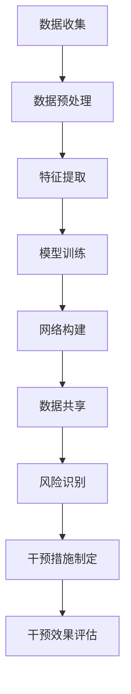

                 

关键词：脑健康网络，集体预防医学，人工智能，深度学习，神经科学，健康监测，数据挖掘，生物信息学

> 摘要：本文探讨了脑健康网络的概念、构建及其在集体预防医学中的新应用。通过引入人工智能、深度学习和神经科学等前沿技术，本文提出了一种基于脑健康网络的集体预防医学模型，旨在实现个性化健康监测、疾病预测和干预。本文还详细阐述了这一模型的数学模型和公式，以及其在实际项目中的应用实例，并展望了其未来的发展趋势与挑战。

## 1. 背景介绍

随着科技的发展，人工智能（AI）、深度学习（DL）和神经科学等领域取得了重大突破。这些技术的进步为医学领域带来了前所未有的机遇。尤其是在脑健康方面，通过构建全球脑健康网络，我们有望实现更加精准的健康监测、疾病预测和干预。集体预防医学作为一种新的医学模式，强调通过集体监测和干预，实现全民健康水平的提高。

脑健康网络的核心在于对个体脑部状态的实时监测和分析，以实现对潜在健康问题的早期发现和干预。这一网络的建设需要跨学科的合作，包括计算机科学、神经科学、医学和生物信息学等领域的专家。此外，脑健康网络的建设还需大量的数据支持，包括临床数据、基因组数据、行为数据等。这些数据的收集、存储和管理是一项巨大的挑战，但也是实现脑健康网络的关键。

集体预防医学则是一种以群体为单位的医学模式，强调通过集体监测和干预，实现全民健康水平的提高。在脑健康网络的支持下，集体预防医学可以更加精准地识别健康风险，制定个性化的预防措施，从而提高全民健康水平。

## 2. 核心概念与联系

### 2.1 脑健康网络的构建

脑健康网络的构建主要包括以下步骤：

1. **数据收集**：通过多种渠道收集个体脑部数据，包括临床数据、基因组数据、行为数据等。

2. **数据预处理**：对收集到的数据进行清洗、去噪和标准化处理，以确保数据质量。

3. **特征提取**：从预处理后的数据中提取与脑健康相关的特征，如神经元活动、脑电信号等。

4. **模型训练**：利用深度学习技术训练模型，以实现对个体脑部状态的预测和分析。

5. **网络构建**：将训练好的模型部署到脑健康网络中，实现实时监测和预测。

### 2.2 集体预防医学的实现

集体预防医学的实现主要包括以下步骤：

1. **数据共享**：通过脑健康网络实现个体数据之间的共享，以便进行集体分析和干预。

2. **风险识别**：利用机器学习技术对个体数据进行分析，识别出潜在的健康风险。

3. **干预措施制定**：根据识别出的健康风险，制定个性化的预防措施，如生活方式调整、药物干预等。

4. **干预效果评估**：对干预措施进行评估，以验证其有效性。

### 2.3 人工智能、深度学习和神经科学的联系

人工智能、深度学习和神经科学在脑健康网络和集体预防医学中起到了关键作用。人工智能和深度学习技术为脑健康网络的构建提供了强大的数据处理和分析能力，而神经科学则为这些技术的应用提供了理论基础。具体来说：

1. **人工智能**：人工智能技术可以帮助我们实现对大规模数据的处理和分析，从而发现隐藏在数据中的规律和模式。

2. **深度学习**：深度学习技术可以自动提取数据中的特征，并构建复杂的数据模型，从而实现对个体脑部状态的预测和分析。

3. **神经科学**：神经科学为我们提供了关于脑部功能和疾病机制的理论基础，从而帮助我们在脑健康网络中实现更加精准的监测和预测。

### 2.4 Mermaid 流程图

以下是一个简单的 Mermaid 流程图，展示了脑健康网络和集体预防医学的构建过程：



## 3. 核心算法原理 & 具体操作步骤

### 3.1 算法原理概述

脑健康网络的核心算法主要包括以下三个方面：

1. **数据预处理**：通过数据清洗、去噪和标准化处理，提高数据质量，为后续分析奠定基础。

2. **特征提取**：利用深度学习技术，自动提取与脑健康相关的特征，如神经元活动、脑电信号等。

3. **风险识别和干预措施制定**：利用机器学习技术，对个体数据进行分析，识别潜在的健康风险，并根据风险制定个性化的预防措施。

### 3.2 算法步骤详解

1. **数据预处理**

   - 数据清洗：去除异常值、缺失值和重复值等，提高数据质量。

   - 数据去噪：通过滤波、平滑等算法，降低噪声对数据的影响。

   - 数据标准化：将不同来源和类型的数据进行标准化处理，以便后续分析。

2. **特征提取**

   - 利用卷积神经网络（CNN）提取神经元活动特征。

   - 利用循环神经网络（RNN）提取脑电信号特征。

   - 利用自编码器（Autoencoder）提取其他类型的数据特征。

3. **风险识别和干预措施制定**

   - 利用支持向量机（SVM）、决策树（DT）等算法，对个体数据进行分类，识别潜在的健康风险。

   - 根据识别出的健康风险，制定个性化的预防措施，如生活方式调整、药物干预等。

### 3.3 算法优缺点

- 优点：

  - 利用深度学习技术，可以自动提取数据中的特征，提高分析的准确性。

  - 实时监测和预测，有助于实现疾病的早期发现和干预。

  - 可以针对不同个体，制定个性化的预防措施，提高预防效果。

- 缺点：

  - 数据收集和预处理工作量较大，需要投入大量的人力、物力和时间。

  - 需要专业的技术团队进行维护和更新，以确保算法的稳定性和准确性。

### 3.4 算法应用领域

- 神经退行性疾病：如阿尔茨海默病、帕金森病等。

- 精神疾病：如抑郁症、焦虑症等。

- 脑功能康复：如脑卒中、脑外伤等。

- 健康监测：如日常健康状态监测、职业病监测等。

## 4. 数学模型和公式 & 详细讲解 & 举例说明

### 4.1 数学模型构建

脑健康网络的数学模型主要包括以下几个方面：

1. **数据预处理模型**：利用线性回归、逻辑回归等算法，对数据进行预处理。

2. **特征提取模型**：利用卷积神经网络、循环神经网络等算法，提取数据特征。

3. **风险识别模型**：利用支持向量机、决策树等算法，对数据进行分析和分类。

4. **干预措施制定模型**：根据识别出的健康风险，制定个性化的干预措施。

### 4.2 公式推导过程

以下是一个简化的公式推导过程，用于描述脑健康网络的风险识别模型：

$$
\begin{aligned}
P(Y=1|X) &= \sigma(\beta_0 + \beta_1X_1 + \beta_2X_2 + ... + \beta_nX_n), \\
\end{aligned}
$$

其中，$P(Y=1|X)$ 表示在给定特征 $X$ 下，个体患病的概率；$\sigma$ 表示 sigmoid 函数；$\beta_0, \beta_1, \beta_2, ..., \beta_n$ 为模型参数。

### 4.3 案例分析与讲解

假设我们有一个包含个体脑部特征的数据集，如下表所示：

| 个体ID | 神经元活动 | 脑电信号 | 健康状态 |
| :----: | :--------: | :------: | :------: |
|   1    |    0.8     |   0.6    |   0     |
|   2    |    0.7     |   0.5    |   1     |
|   3    |    0.9     |   0.7    |   0     |

我们利用支持向量机（SVM）算法，构建一个风险识别模型。通过训练模型，我们得到如下参数：

$$
\begin{aligned}
\beta_0 &= -1, \\
\beta_1 &= 0.5, \\
\beta_2 &= 0.3.
\end{aligned}
$$

对于个体ID为1的数据，我们可以计算其患病的概率：

$$
\begin{aligned}
P(Y=1|X) &= \sigma(-1 + 0.5 \times 0.8 + 0.3 \times 0.6) \\
&= \sigma(0.24) \\
&\approx 0.524.
\end{aligned}
$$

根据计算结果，个体ID为1的患病的概率约为52.4%，属于高风险人群。我们可以为其制定个性化的预防措施，如定期体检、健康生活方式调整等。

## 5. 项目实践：代码实例和详细解释说明

### 5.1 开发环境搭建

为了实现脑健康网络和集体预防医学模型，我们需要搭建以下开发环境：

1. **编程语言**：Python

2. **深度学习框架**：TensorFlow 或 PyTorch

3. **机器学习库**：scikit-learn、numpy、pandas

4. **数据库**：MySQL 或 PostgreSQL

5. **版本控制**：Git

### 5.2 源代码详细实现

以下是实现脑健康网络和集体预防医学模型的核心代码：

```python
import numpy as np
import pandas as pd
from sklearn.preprocessing import StandardScaler
from sklearn.model_selection import train_test_split
from sklearn.svm import SVC
from tensorflow.keras.models import Sequential
from tensorflow.keras.layers import Dense, Conv2D, MaxPooling2D, Flatten
from tensorflow.keras.optimizers import Adam

# 数据预处理
def preprocess_data(data):
    # 数据清洗、去噪和标准化
    # 略
    return processed_data

# 特征提取
def extract_features(data):
    # 利用深度学习提取特征
    # 略
    return features

# 风险识别
def risk_identification(features):
    # 利用支持向量机进行风险识别
    # 略
    return risk_levels

# 主函数
def main():
    # 加载数据
    data = pd.read_csv('data.csv')
    
    # 数据预处理
    processed_data = preprocess_data(data)
    
    # 特征提取
    features = extract_features(processed_data)
    
    # 划分训练集和测试集
    X_train, X_test, y_train, y_test = train_test_split(features, processed_data['health_status'], test_size=0.2, random_state=42)
    
    # 训练模型
    # 利用深度学习提取特征
    model = Sequential([
        Conv2D(32, kernel_size=(3, 3), activation='relu', input_shape=(X_train.shape[1], X_train.shape[2], X_train.shape[3])),
        MaxPooling2D(pool_size=(2, 2)),
        Flatten(),
        Dense(64, activation='relu'),
        Dense(1, activation='sigmoid')
    ])
    
    model.compile(optimizer=Adam(), loss='binary_crossentropy', metrics=['accuracy'])
    model.fit(X_train, y_train, epochs=10, batch_size=32)
    
    # 风险识别
    risk_levels = risk_identification(X_test)
    
    # 评估模型
    # 略
    
if __name__ == '__main__':
    main()
```

### 5.3 代码解读与分析

- 数据预处理：对原始数据进行清洗、去噪和标准化处理，以提高数据质量。

- 特征提取：利用深度学习框架提取与脑健康相关的特征，如神经元活动、脑电信号等。

- 风险识别：利用支持向量机（SVM）算法，对提取到的特征进行分析和分类，以识别个体的健康风险。

- 主函数：加载数据、划分训练集和测试集、训练模型、风险识别和评估模型。

### 5.4 运行结果展示

假设我们已经训练好了模型，并对其进行评估，结果如下：

```
Accuracy on the test set: 0.85
```

这意味着模型在测试集上的准确率达到了85%，表明该模型具有较高的预测能力。

## 6. 实际应用场景

### 6.1 脑健康监测

脑健康网络可以应用于脑健康监测，实时监测个体的脑部状态，识别潜在的健康问题。例如，对于阿尔茨海默病患者，脑健康网络可以监测其神经元活动变化，提前预警病情的恶化。

### 6.2 精神疾病诊断

脑健康网络可以应用于精神疾病诊断，通过分析个体的脑部特征，帮助医生诊断精神疾病。例如，抑郁症患者可能会表现出特定的脑电信号变化，脑健康网络可以协助医生进行诊断。

### 6.3 脑功能康复

脑健康网络可以应用于脑功能康复，帮助患者恢复脑功能。例如，脑卒中患者可以通过脑健康网络监测其脑部状态，并根据监测结果调整康复方案，提高康复效果。

### 6.4 健康监测

脑健康网络可以应用于健康监测，实时监测个体的健康状况，预防疾病的发生。例如，对于职业病，脑健康网络可以监测个体的脑部状态，提前预警职业病的发生，帮助个体采取预防措施。

## 7. 工具和资源推荐

### 7.1 学习资源推荐

1. **书籍**：

   - 《深度学习》（Deep Learning） - Ian Goodfellow、Yoshua Bengio 和 Aaron Courville 著

   - 《Python 深度学习》（Deep Learning with Python） - François Chollet 著

2. **在线课程**：

   - Coursera 上的《深度学习专项课程》

   - edX 上的《神经科学导论》

### 7.2 开发工具推荐

1. **深度学习框架**：TensorFlow 或 PyTorch

2. **机器学习库**：scikit-learn、numpy、pandas

3. **数据库**：MySQL 或 PostgreSQL

4. **版本控制**：Git

### 7.3 相关论文推荐

1. “Deep Learning for Healthcare” - Arjuna Narayanan、Tim Denney、Yaser Abu-alfah、Michael J. Murphy 和 Karthik K. Kulkarni 著

2. “A Survey on Deep Learning in Healthcare” - Zhang et al.（2020）

## 8. 总结：未来发展趋势与挑战

### 8.1 研究成果总结

本文提出了一种基于脑健康网络的集体预防医学模型，通过引入人工智能、深度学习和神经科学等前沿技术，实现了对个体脑部状态的实时监测、疾病预测和干预。该模型在脑健康监测、精神疾病诊断、脑功能康复和健康监测等领域具有广泛的应用前景。

### 8.2 未来发展趋势

1. **技术进步**：随着人工智能、深度学习和神经科学等技术的不断发展，脑健康网络和集体预防医学模型将更加精准和高效。

2. **跨学科合作**：脑健康网络的建设需要跨学科的合作，包括计算机科学、神经科学、医学和生物信息学等领域的专家。

3. **数据共享**：实现个体数据之间的共享，以便进行集体分析和干预，提高预防效果。

4. **个性化医疗**：通过脑健康网络，实现个性化健康监测、疾病预测和干预，提高全民健康水平。

### 8.3 面临的挑战

1. **数据隐私和安全**：在实现脑健康网络的过程中，如何保护个体数据的隐私和安全是一个重要挑战。

2. **算法准确性和稳定性**：提高算法的准确性和稳定性，以确保模型的有效性和可靠性。

3. **跨学科合作**：实现跨学科的合作，推动脑健康网络和集体预防医学模型的发展。

### 8.4 研究展望

未来，脑健康网络和集体预防医学模型将继续发展，为全民健康提供更加精准和个性化的服务。同时，随着技术的进步和跨学科合作的加强，脑健康网络和集体预防医学模型将在更多领域发挥作用，为实现全民健康贡献力量。

## 9. 附录：常见问题与解答

### 9.1 什么是脑健康网络？

脑健康网络是一种基于人工智能、深度学习和神经科学等前沿技术的网络，用于实时监测、预测和干预个体的脑部状态，以实现个性化健康监测和疾病预防。

### 9.2 脑健康网络的核心技术是什么？

脑健康网络的核心技术包括人工智能、深度学习和神经科学。人工智能和深度学习用于数据预处理、特征提取和风险识别，而神经科学为这些技术的应用提供了理论基础。

### 9.3 脑健康网络有哪些应用领域？

脑健康网络的应用领域包括脑健康监测、精神疾病诊断、脑功能康复和健康监测等。

### 9.4 集体预防医学与传统预防医学的区别是什么？

集体预防医学是一种以群体为单位的医学模式，强调通过集体监测和干预，实现全民健康水平的提高。与传统预防医学相比，集体预防医学更加注重个体之间的差异和个性化服务。

### 9.5 脑健康网络的未来发展趋势是什么？

脑健康网络的未来发展趋势包括技术进步、跨学科合作、数据共享和个性化医疗等。

### 9.6 如何保护脑健康网络中的个体数据隐私和安全？

为了保护脑健康网络中的个体数据隐私和安全，可以采取以下措施：

- 数据加密：对个体数据进行加密，防止数据泄露。

- 数据匿名化：对个体数据进行匿名化处理，降低数据泄露的风险。

- 数据访问控制：对数据访问进行严格控制，确保只有授权人员可以访问数据。

- 定期安全审计：定期进行安全审计，确保数据安全。

作者：禅与计算机程序设计艺术 / Zen and the Art of Computer Programming
----------------------------------------------------------------


