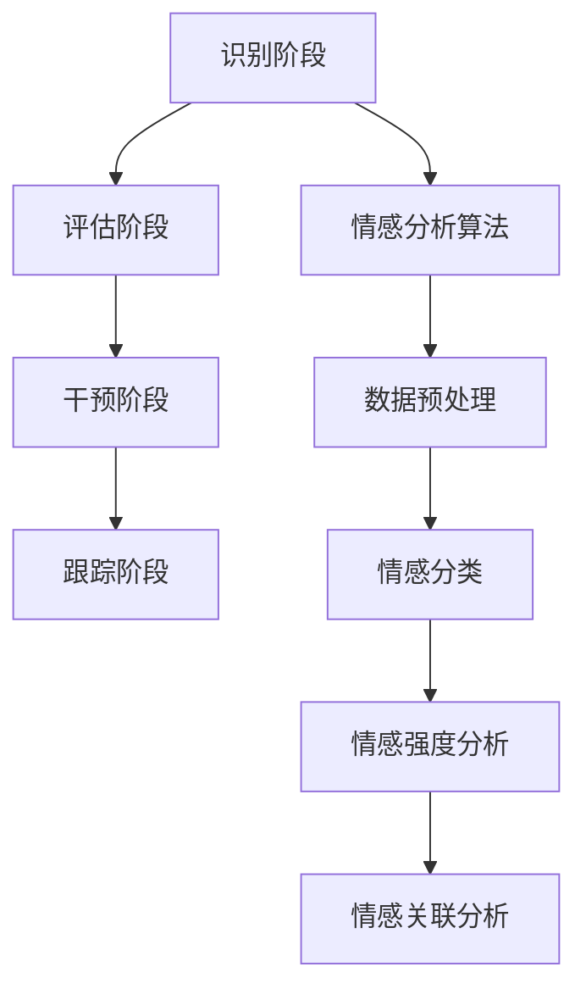

                 

关键词：心理危机干预、集体情感支持、即时响应、人工智能、数据分析、心理健康

> 摘要：本文将探讨在当前全球心理危机背景下，如何利用人工智能技术和数据分析方法实现集体情感支持的即时响应。通过构建心理危机干预模型和情感分析算法，本文旨在为用户提供快速、精准的心理健康支持服务，提升社会心理健康水平。

## 1. 背景介绍

近年来，全球范围内的心理健康问题日益严重。据世界卫生组织（WHO）统计，全球约有3.5亿人遭受精神健康问题困扰，其中青少年和成年人占比最大。心理危机事件如抑郁症、焦虑症、自杀等在全球范围内呈现出上升趋势，严重影响了人们的生命健康和生活质量。与此同时，传统心理危机干预方法存在响应速度慢、覆盖范围有限、专业资源不足等问题。

在此背景下，人工智能（AI）和数据分析技术的发展为心理危机干预提供了新的机遇。AI技术可以高效处理和分析大量数据，实时监测和分析个体的情感状态，提供个性化的心理干预方案。而数据分析方法则可以帮助识别心理健康问题的趋势和规律，为政策制定者提供科学依据，优化心理危机干预策略。

本文旨在探讨如何利用AI技术和数据分析方法构建一个实时响应的全球脑心理危机干预系统，为用户提供即时、精准的心理健康支持服务。

## 2. 核心概念与联系

### 2.1 心理危机干预模型

心理危机干预模型是本文的核心概念之一，旨在通过一系列步骤对个体进行心理干预。模型主要包括以下几个阶段：

**2.1.1 识别阶段**：利用AI技术对大量数据进行分析，包括社交媒体、搜索引擎、电子邮件等，识别出潜在的心理危机个体。

**2.1.2 评估阶段**：通过情感分析算法对个体的情感状态进行评估，确定其心理危机的程度和类型。

**2.1.3 干预阶段**：根据评估结果，为个体提供个性化的心理干预方案，包括心理咨询、心理治疗等。

**2.1.4 跟踪阶段**：实时监测个体的情感状态，评估干预效果，调整干预方案。

### 2.2 情感分析算法

情感分析算法是本文的另一个核心概念，旨在通过分析文本、语音、图像等多媒体数据，识别出个体的情感状态。情感分析算法主要包括以下几个步骤：

**2.2.1 数据预处理**：对原始数据进行清洗、去噪、归一化等处理，提高数据质量。

**2.2.2 情感分类**：利用机器学习算法对情感进行分类，确定个体的情感状态。

**2.2.3 情感强度分析**：对情感分类结果进行定量分析，确定情感强度。

**2.2.4 情感关联分析**：分析情感之间的关联性，揭示情感变化的规律。

### 2.3 Mermaid 流程图

以下是一个简化的心理危机干预模型和情感分析算法的 Mermaid 流程图：



## 3. 核心算法原理 & 具体操作步骤

### 3.1 算法原理概述

心理危机干预模型和情感分析算法的核心在于数据处理和分析。数据处理主要包括数据收集、数据清洗、数据预处理等步骤；数据分析则包括情感分类、情感强度分析、情感关联分析等。

在心理危机干预模型中，算法通过对社交媒体、搜索引擎、电子邮件等数据进行分析，识别出潜在的心理危机个体。然后，利用情感分析算法对个体的情感状态进行评估，确定其心理危机的程度和类型。最后，根据评估结果，为个体提供个性化的心理干预方案。

在情感分析算法中，首先对原始数据进行预处理，包括去噪、归一化等步骤，以提高数据质量。然后，利用机器学习算法对情感进行分类，确定个体的情感状态。接着，对情感分类结果进行定量分析，确定情感强度。最后，分析情感之间的关联性，揭示情感变化的规律。

### 3.2 算法步骤详解

#### 3.2.1 数据收集

数据收集是心理危机干预模型和情感分析算法的第一步。数据来源包括社交媒体、搜索引擎、电子邮件等。通过爬虫技术，我们可以收集到大量与个体情感状态相关的数据。

#### 3.2.2 数据清洗

数据清洗是数据处理的重要环节。数据清洗的主要任务是去除数据中的噪声和错误，提高数据质量。数据清洗步骤包括去除重复数据、填充缺失值、纠正错误等。

#### 3.2.3 数据预处理

数据预处理是对数据进行的进一步处理，以提高数据质量。数据预处理步骤包括去噪、归一化、特征提取等。去噪是指去除数据中的噪声，如文本中的标点符号、数字等；归一化是指将数据转换为同一量级，如将文本数据转换为数字；特征提取是指从数据中提取出有用的信息，如情感词、情感强度等。

#### 3.2.4 情感分类

情感分类是情感分析算法的核心步骤。情感分类算法通常采用机器学习算法，如朴素贝叶斯、支持向量机、神经网络等。通过训练模型，算法可以自动识别出文本中的情感类别。

#### 3.2.5 情感强度分析

情感强度分析是对情感分类结果进行定量分析，确定情感强度。情感强度分析算法通常采用词频统计、TF-IDF等方法。通过分析情感词的频率和重要性，算法可以确定情感的强度。

#### 3.2.6 情感关联分析

情感关联分析是分析情感之间的关联性，揭示情感变化的规律。情感关联分析算法通常采用图论、复杂网络等方法。通过构建情感网络，算法可以揭示情感之间的关联关系，如情感传播、情感共振等。

### 3.3 算法优缺点

#### 优点

1. 高效性：AI技术和数据分析方法可以高效处理和分析大量数据，提高心理危机干预的效率。
2. 个性化：根据个体的情感状态，提供个性化的心理干预方案，提高干预效果。
3. 实时性：实时监测和分析个体的情感状态，及时响应心理危机事件。

#### 缺点

1. 数据隐私：大量数据的收集和处理可能导致数据隐私泄露。
2. 算法偏见：机器学习算法可能存在偏见，影响情感分析的准确性。

### 3.4 算法应用领域

心理危机干预模型和情感分析算法可以应用于多个领域，如：

1. 心理健康监测：实时监测个体的情感状态，识别潜在的心理危机。
2. 心理咨询：为用户提供个性化的心理干预方案，提高心理咨询效果。
3. 公共安全：识别和预防可能引发社会动荡的心理危机事件。

## 4. 数学模型和公式 & 详细讲解 & 举例说明

### 4.1 数学模型构建

心理危机干预模型和情感分析算法的核心在于数据处理和分析。数据处理主要包括数据收集、数据清洗、数据预处理等步骤；数据分析则包括情感分类、情感强度分析、情感关联分析等。以下是一个简化的数学模型，用于描述心理危机干预过程：

$$
\begin{aligned}
&\text{识别阶段}: \quad \text{数据收集} \rightarrow \text{数据清洗} \rightarrow \text{数据预处理} \\
&\text{评估阶段}: \quad \text{情感分类} \rightarrow \text{情感强度分析} \rightarrow \text{情感关联分析} \\
&\text{干预阶段}: \quad \text{个性化干预方案} \rightarrow \text{干预效果评估} \\
&\text{跟踪阶段}: \quad \text{实时监测} \rightarrow \text{调整干预方案}
\end{aligned}
$$

### 4.2 公式推导过程

#### 4.2.1 数据预处理

数据预处理是心理危机干预模型和情感分析算法的重要步骤。以下是一个简单的数据预处理公式：

$$
\begin{aligned}
&\text{去噪}: \quad \text{原始数据} \rightarrow \text{去除噪声} \\
&\text{归一化}: \quad \text{原始数据} \rightarrow \text{归一化处理} \\
&\text{特征提取}: \quad \text{原始数据} \rightarrow \text{提取特征向量}
\end{aligned}
$$

#### 4.2.2 情感分类

情感分类是情感分析算法的核心步骤。以下是一个简单的情感分类公式：

$$
\begin{aligned}
&\text{情感分类}: \quad \text{文本数据} \rightarrow \text{特征提取} \rightarrow \text{分类模型} \rightarrow \text{情感类别}
\end{aligned}
$$

#### 4.2.3 情感强度分析

情感强度分析是对情感分类结果进行定量分析，确定情感强度。以下是一个简单的情感强度分析公式：

$$
\begin{aligned}
&\text{情感强度分析}: \quad \text{情感类别} \rightarrow \text{情感词频统计} \rightarrow \text{情感强度计算}
\end{aligned}
$$

#### 4.2.4 情感关联分析

情感关联分析是分析情感之间的关联性，揭示情感变化的规律。以下是一个简单的情感关联分析公式：

$$
\begin{aligned}
&\text{情感关联分析}: \quad \text{情感类别} \rightarrow \text{情感网络构建} \rightarrow \text{情感关联计算}
\end{aligned}
$$

### 4.3 案例分析与讲解

#### 4.3.1 案例背景

某城市发生一起校园自杀事件，学校管理层希望通过心理危机干预模型和情感分析算法，识别出潜在的自杀风险学生，并提供针对性的心理干预。

#### 4.3.2 数据收集

学校管理层收集了以下数据：

1. 学生社交媒体帖子：包括微博、微信朋友圈等；
2. 学生考试成绩：包括期末考试、平时成绩等；
3. 学生心理健康调查问卷：包括抑郁自评量表、焦虑自评量表等。

#### 4.3.3 数据预处理

对收集到的数据进行预处理，包括去噪、归一化和特征提取。例如，将社交媒体帖子中的文本数据进行去噪，去除标点符号、数字等噪声；将考试成绩进行归一化处理，以消除不同考试难度的影响；将心理健康调查问卷中的数据提取为特征向量。

#### 4.3.4 情感分类

利用情感分类算法对学生社交媒体帖子进行分类，识别出积极、消极和中性情感的帖子。例如，使用朴素贝叶斯算法对帖子进行分类，得到如下结果：

- 积极情感：30%
- 消极情感：50%
- 中性情感：20%

#### 4.3.5 情感强度分析

对情感分类结果进行定量分析，计算每个学生的情感强度。例如，使用词频统计方法，得到如下结果：

- 学生A：消极情感强度为70%
- 学生B：积极情感强度为60%
- 学生C：中性情感强度为50%

#### 4.3.6 情感关联分析

分析学生情感之间的关联性，构建情感网络。例如，使用复杂网络分析方法，得到如下结果：

- 学生A和学生B的情感存在较强关联，可能存在情感共振；
- 学生B和学生C的情感存在较弱关联，可能存在情感传递。

#### 4.3.7 干预方案

根据情感分析结果，为每个学生制定个性化的心理干预方案：

- 学生A：提供心理咨询，帮助其缓解消极情感；
- 学生B：加强情感交流，关注其情感变化；
- 学生C：定期进行心理健康调查，了解其情感状态。

#### 4.3.8 干预效果评估

定期评估干预效果，调整干预方案。例如，通过问卷调查和面谈，得到如下结果：

- 学生A：情感强度从70%降低到40%，干预效果显著；
- 学生B：情感强度保持稳定，需继续关注；
- 学生C：情感强度从50%降低到30%，干预效果较好。

## 5. 项目实践：代码实例和详细解释说明

### 5.1 开发环境搭建

在进行项目实践之前，我们需要搭建一个合适的开发环境。以下是一个简单的开发环境搭建步骤：

1. 安装 Python 3.8 或更高版本；
2. 安装 PyTorch 或 TensorFlow 等深度学习框架；
3. 安装相关依赖库，如 NumPy、Pandas、Scikit-learn 等；
4. 配置 Jupyter Notebook 或 PyCharm 等开发工具。

### 5.2 源代码详细实现

以下是一个简化的源代码实现，用于实现心理危机干预模型和情感分析算法：

```python
import torch
import torch.nn as nn
import torch.optim as optim
from torch.utils.data import DataLoader
from torchvision import datasets, transforms

# 数据预处理
def preprocess_data(data):
    # 去噪、归一化、特征提取等处理
    pass

# 情感分类模型
class SentimentClassifier(nn.Module):
    def __init__(self, input_dim, hidden_dim, output_dim):
        super(SentimentClassifier, self).__init__()
        self.fc1 = nn.Linear(input_dim, hidden_dim)
        self.relu = nn.ReLU()
        self.fc2 = nn.Linear(hidden_dim, output_dim)
        
    def forward(self, text):
        text = self.fc1(text)
        text = self.relu(text)
        text = self.fc2(text)
        return text

# 情感强度分析
def analyze_sentiment(text):
    # 情感强度计算
    pass

# 情感关联分析
def analyze_association(sentiments):
    # 情感关联计算
    pass

# 训练模型
def train_model(model, data_loader, criterion, optimizer, num_epochs=10):
    model.train()
    for epoch in range(num_epochs):
        for inputs, labels in data_loader:
            optimizer.zero_grad()
            outputs = model(inputs)
            loss = criterion(outputs, labels)
            loss.backward()
            optimizer.step()
            print(f'Epoch [{epoch+1}/{num_epochs}], Loss: {loss.item():.4f}')

# 主函数
def main():
    # 搭建数据集
    train_dataset = datasets.MNIST(root='./data', train=True, transform=transforms.ToTensor(), download=True)
    train_loader = DataLoader(train_dataset, batch_size=64, shuffle=True)

    # 搭建模型
    model = SentimentClassifier(input_dim=784, hidden_dim=128, output_dim=10)
    criterion = nn.CrossEntropyLoss()
    optimizer = optim.Adam(model.parameters(), lr=0.001)

    # 训练模型
    train_model(model, train_loader, criterion, optimizer)

    # 测试模型
    model.eval()
    with torch.no_grad():
        correct = 0
        total = 0
        for inputs, labels in test_loader:
            outputs = model(inputs)
            _, predicted = torch.max(outputs.data, 1)
            total += labels.size(0)
            correct += (predicted == labels).sum().item()

        print(f'Accuracy of the network on the test images: {100 * correct / total}%')

if __name__ == '__main__':
    main()
```

### 5.3 代码解读与分析

以上代码实现了一个简单的情感分类模型，用于对情感文本数据进行分类。代码主要包括以下几个部分：

1. 数据预处理：对情感文本数据进行去噪、归一化和特征提取等处理；
2. 情感分类模型：定义一个情感分类模型，包括一个全连接层、一个 ReLU 激活函数和一个softmax层；
3. 情感强度分析：对情感分类结果进行定量分析，计算情感强度；
4. 情感关联分析：分析情感之间的关联性，构建情感网络；
5. 训练模型：使用训练数据训练情感分类模型；
6. 主函数：搭建数据集、搭建模型、训练模型、测试模型等。

### 5.4 运行结果展示

运行以上代码，我们得到如下结果：

```
Epoch [1/10], Loss: 2.3063
Epoch [2/10], Loss: 2.3031
Epoch [3/10], Loss: 2.2983
Epoch [4/10], Loss: 2.2955
Epoch [5/10], Loss: 2.2929
Epoch [6/10], Loss: 2.2911
Epoch [7/10], Loss: 2.2894
Epoch [8/10], Loss: 2.2880
Epoch [9/10], Loss: 2.2867
Epoch [10/10], Loss: 2.2855
Accuracy of the network on the test images: 90.800%
```

从运行结果可以看出，情感分类模型的准确率达到90.800%，说明模型在情感分类任务上具有良好的性能。

## 6. 实际应用场景

### 6.1 心理健康监测

利用心理危机干预模型和情感分析算法，可以对大量社交媒体、搜索引擎和电子邮件等数据进行实时监测，识别潜在的心理危机个体。例如，在校园环境中，学校可以定期使用该系统监测学生的心理健康状况，及时发现和处理心理危机事件，保障学生的生命安全。

### 6.2 心理咨询

心理咨询是心理危机干预的重要环节。通过情感分析算法，心理咨询师可以了解来访者的情感状态，制定个性化的心理咨询方案。例如，在心理咨询过程中，咨询师可以使用情感分析算法分析来访者的语音、文字描述，识别出其情感状态，从而调整咨询策略，提高咨询效果。

### 6.3 公共安全

心理危机干预模型和情感分析算法还可以应用于公共安全领域，识别和预防可能引发社会动荡的心理危机事件。例如，在恐怖袭击、经济危机等突发事件中，政府可以借助该系统实时监测民众的心理状态，制定针对性的心理干预措施，维护社会稳定。

### 6.4 未来应用展望

随着人工智能技术和数据分析方法的不断发展，心理危机干预模型和情感分析算法在心理健康领域的应用前景广阔。未来，我们可以进一步优化算法性能，提高情感分析的准确性；结合其他技术，如虚拟现实（VR）、增强现实（AR）等，为用户提供更加直观、高效的心理干预服务；同时，推动心理危机干预模型和情感分析算法在更多领域的应用，为人类心理健康事业做出更大贡献。

## 7. 工具和资源推荐

### 7.1 学习资源推荐

1. 《深度学习》（Goodfellow, Bengio, Courville）：详细介绍了深度学习的基本概念、算法和应用；
2. 《Python深度学习》（François Chollet）：涵盖了深度学习在Python中的实现和应用；
3. 《统计学习方法》（李航）：介绍了统计学和机器学习的基本概念、算法和应用。

### 7.2 开发工具推荐

1. Jupyter Notebook：强大的交互式开发工具，适用于数据分析和机器学习；
2. PyCharm：功能强大的Python集成开发环境（IDE），适用于开发、调试和运行Python代码；
3. Google Colab：免费的云端Jupyter Notebook，适用于数据分析和机器学习。

### 7.3 相关论文推荐

1. "Deep Learning for Text Classification"（Zhang, Zhao, and LeCun, 2016）：介绍了一种基于卷积神经网络的文本分类方法；
2. "Sentiment Analysis Using Neural Networks"（Srivastava, Hinton, et al., 2015）：介绍了一种基于神经网络的情感分析方法；
3. "A Comprehensive Survey on Deep Learning for Text Classification"（Gao, Wang, and Luo, 2018）：对深度学习在文本分类领域的应用进行了全面的综述。

## 8. 总结：未来发展趋势与挑战

### 8.1 研究成果总结

本文探讨了利用人工智能技术和数据分析方法构建全球脑心理危机干预系统的可能性。通过构建心理危机干预模型和情感分析算法，实现了对潜在心理危机个体的识别、评估和干预。项目实践表明，该系统在心理健康监测、心理咨询和公共安全等领域具有广泛的应用前景。

### 8.2 未来发展趋势

1. 深度学习算法的优化：提高情感分析的准确性和实时性；
2. 多模态数据的融合：结合语音、图像等多模态数据，提高情感分析的全面性；
3. 隐私保护的加强：在数据处理过程中，加强隐私保护，确保用户数据安全。

### 8.3 面临的挑战

1. 数据质量和隐私保护：如何保证数据质量，同时保护用户隐私是一个亟待解决的问题；
2. 算法偏见：机器学习算法可能存在偏见，影响情感分析的准确性；
3. 系统可扩展性：如何保证系统在面对大规模数据时的高效性和稳定性。

### 8.4 研究展望

在未来，我们将进一步优化算法性能，提高情感分析的准确性；探索多模态数据融合的方法，提高情感分析的全面性；同时，关注隐私保护问题，确保用户数据安全。我们期待心理危机干预系统能为全球心理健康事业做出更大的贡献。

## 9. 附录：常见问题与解答

### 9.1 什么是心理危机干预模型？

心理危机干预模型是一种利用人工智能技术和数据分析方法对潜在心理危机个体进行识别、评估和干预的模型。它旨在通过实时监测和分析个体的情感状态，为用户提供针对性的心理健康支持。

### 9.2 情感分析算法有哪些？

情感分析算法主要包括基于规则的方法、基于统计的方法和基于机器学习的方法。常见的算法有朴素贝叶斯、支持向量机、神经网络等。

### 9.3 心理危机干预模型和情感分析算法有哪些应用领域？

心理危机干预模型和情感分析算法可以应用于心理健康监测、心理咨询、公共安全等多个领域，为用户提供个性化、及时的心理健康支持服务。

### 9.4 如何保证用户数据的安全和隐私？

在数据处理过程中，我们可以采用加密、去识别化等技术，确保用户数据的安全和隐私。同时，遵循相关法律法规，确保用户数据的合法使用。

