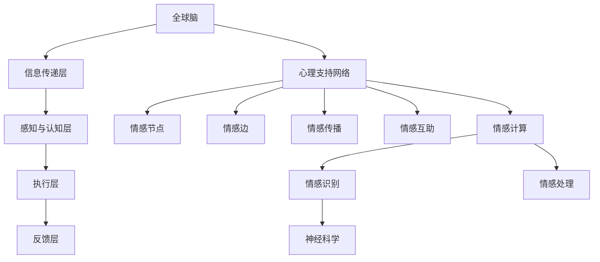

                 

关键词：全球脑，心理支持网络，集体情感，互助，情感互助，社会计算，群体智能，神经科学，情感计算，情感传播，社交网络分析。

> 摘要：本文探讨了全球脑心理支持网络的构建与运作机制，分析了集体情感互助的形成过程，探讨了其在社会计算和群体智能领域的应用。文章首先介绍了全球脑的概念和基本架构，随后深入探讨了心理支持网络的理论基础和情感传播机制。通过对群体情感互助的案例分析和数学模型构建，文章揭示了集体情感互助的形成规律及其在社会计算和群体智能中的重要作用。最后，文章提出了未来全球脑心理支持网络的发展趋势、面临的挑战以及研究方向。

## 1. 背景介绍

随着信息技术的飞速发展，互联网已经成为人们日常生活中不可或缺的一部分。人们通过社交媒体、即时通讯工具等与全球范围内的其他个体进行互动，形成了一个庞大的虚拟社交网络。在这个社交网络中，个体的情感状态和行为模式会对其他个体产生显著的影响。这种现象引发了学者们对群体情感和集体情感互助的关注。

全球脑（Global Brain）是一个由全球个体（包括人类、动物、机器等）组成的分布式智能系统。它通过信息传递和协同工作，实现了对复杂问题的求解和决策。全球脑的概念最早由Kenichi Ohmae提出，认为全球脑是一个通过互联网和通信技术连接的全球性大脑，具有自我组织和自我进化能力。

心理支持网络是一种基于社交网络的分析方法，旨在通过分析个体之间的情感联系，揭示情感在社交网络中的传播规律。情感传播机制是指情感在社交网络中通过信息传递和互动逐渐扩散的过程。情感互助是指个体在情感交流中通过相互支持和帮助，形成一种集体情感状态。

社会计算（Social Computing）是研究社会情境中的计算过程和技术的交叉学科，涵盖了社交网络分析、情感计算、群体智能等领域。群体智能（Swarm Intelligence）是指由大量简单个体通过局部交互和信息共享，形成的具有整体智能行为的系统。

神经科学（Neuroscience）是研究神经系统结构和功能的科学。情感计算（Affective Computing）是指利用计算机模拟人类的情感，对情感进行识别、理解、处理和交互的技术。

## 2. 核心概念与联系

### 2.1 全球脑

全球脑的概念可以从多个层面来理解。从宏观层面看，全球脑是一个由全球个体组成的巨大网络，通过互联网和通信技术相互连接。这些个体可以是人类、动物、机器人等，它们通过信息交换和协同工作，形成了一个具有整体智能的分布式系统。

全球脑的基本架构包括以下几个部分：

1. **信息传递层**：这是全球脑的基础，负责处理和传递信息。它包括互联网、通信卫星、光纤网络等硬件设施，以及数据传输协议、加密算法等软件技术。

2. **感知与认知层**：这一层负责处理来自全球脑各部分的信息，进行感知、认知和决策。它包括人工智能、机器学习、认知科学等领域的知识和技术。

3. **执行层**：这一层负责将全球脑的决策转化为实际行为。它包括各种自动化系统和机器人，以及与人类交互的界面。

4. **反馈层**：这一层负责对全球脑的行为进行监测和评估，以便进行持续的优化和调整。

### 2.2 心理支持网络

心理支持网络是一种基于社交网络的分析方法，旨在通过分析个体之间的情感联系，揭示情感在社交网络中的传播规律。心理支持网络的核心概念包括：

1. **情感节点**：社交网络中的每个个体都可以视为一个情感节点，其情感状态可以用情感值来表示。

2. **情感边**：情感节点之间的连接表示情感传递和互动。情感边的权重可以表示情感强度和传递概率。

3. **情感传播**：情感在社交网络中的传播过程，可以通过模拟和分析情感传播模型来研究。

4. **情感互助**：个体在情感交流中通过相互支持和帮助，形成一种集体情感状态。

### 2.3 情感传播机制

情感传播机制是指情感在社交网络中通过信息传递和互动逐渐扩散的过程。情感传播机制的核心概念包括：

1. **情感触发**：情感传播的起点，可以是某个情感事件或情感刺激。

2. **情感传递**：情感通过社交网络中的连接传递给其他个体。

3. **情感感染**：情感在个体之间的传递过程中，可能会发生情感感染，导致个体情感状态发生变化。

4. **情感扩散**：情感在社交网络中逐渐扩散，形成情感流行。

### 2.4 社会计算与群体智能

社会计算和群体智能是研究社会情境中的计算过程和技术的交叉学科。社会计算主要关注社交网络分析、情感计算等领域，而群体智能主要研究个体之间通过局部交互和信息共享，形成的具有整体智能行为的系统。

社会计算和群体智能的关系可以概括为：

1. **社会计算为群体智能提供数据支持**：通过分析社交网络中的数据，可以获得个体之间的情感联系、行为模式等信息，为群体智能的研究提供基础数据。

2. **群体智能为社会计算提供智能支持**：群体智能通过个体之间的协同工作，可以实现复杂问题的求解和决策，为社会计算提供智能支持。

### 2.5 神经科学与情感计算

神经科学和情感计算是两个看似不同但实际密切相关的领域。神经科学研究神经系统结构和功能，而情感计算则利用计算机模拟人类的情感。

神经科学与情感计算的关系可以概括为：

1. **神经科学为情感计算提供理论基础**：神经科学的研究成果，如情感识别、情感处理等，为情感计算提供了理论基础。

2. **情感计算为神经科学提供技术支持**：情感计算技术可以模拟人类的情感，帮助神经科学家研究情感产生和传播的机制。

### 2.6 Mermaid 流程图

为了更好地理解全球脑心理支持网络的核心概念和联系，我们使用Mermaid流程图进行可视化展示。



## 3. 核心算法原理 & 具体操作步骤

### 3.1 算法原理概述

全球脑心理支持网络的核心算法主要包括情感识别、情感传播和情感互助三个部分。

1. **情感识别**：通过分析社交网络中的数据，识别个体的情感状态。常用的方法包括情感分析、情感分类等。

2. **情感传播**：模拟情感在社交网络中的传播过程，分析情感传播的规律和机制。常用的方法包括传播模型、网络分析等。

3. **情感互助**：通过分析情感传播结果，识别情感互助关系，评估情感互助的效果。常用的方法包括聚类分析、社会网络分析等。

### 3.2 算法步骤详解

1. **数据收集**：收集社交网络中的数据，包括用户信息、互动记录、情感标签等。

2. **情感识别**：使用情感分析技术，对收集到的数据进行情感识别，得到每个个体的情感状态。

3. **情感传播**：构建社交网络模型，模拟情感在社交网络中的传播过程，分析情感传播的规律和机制。

4. **情感互助**：分析情感传播结果，识别情感互助关系，评估情感互助的效果。

### 3.3 算法优缺点

**优点**：

1. **全面性**：算法覆盖了情感识别、情感传播和情感互助三个关键环节，能够全面分析情感在社交网络中的行为。

2. **灵活性**：算法可以根据不同的社交网络和数据特点，调整情感识别和传播策略，提高分析结果的准确性。

3. **实时性**：算法可以实时分析社交网络中的情感状态，为用户提供实时情感支持。

**缺点**：

1. **数据依赖**：算法的准确性高度依赖于社交网络数据的完整性和准确性。

2. **计算复杂度**：社交网络规模较大时，算法的计算复杂度较高，需要消耗较多的计算资源和时间。

### 3.4 算法应用领域

全球脑心理支持网络算法主要应用于以下几个领域：

1. **社交媒体分析**：通过分析社交网络中的情感状态，了解用户情感趋势，为用户提供个性化情感支持。

2. **心理健康监测**：通过分析社交网络中的情感传播，发现潜在的抑郁、焦虑等心理问题，为用户提供心理干预建议。

3. **舆论分析**：通过分析社交网络中的情感传播，了解公众对某一事件或话题的情感态度，为舆论引导和舆情监控提供支持。

## 4. 数学模型和公式 & 详细讲解 & 举例说明

### 4.1 数学模型构建

全球脑心理支持网络的数学模型主要包括情感识别模型、情感传播模型和情感互助模型。

#### 情感识别模型

情感识别模型通常使用情感分类模型，如支持向量机（SVM）、朴素贝叶斯（NB）等。假设我们有 $N$ 个用户，每个用户 $i$ 的情感状态可以用一个向量 $s_i$ 表示，其中 $s_i \in \{-1, 1\}$，$-1$ 表示负面情感，$1$ 表示正面情感。

情感识别模型的目标是最大化识别准确率，即最大化以下公式：

$$
\max \sum_{i=1}^{N} y_i (w^T s_i + b)
$$

其中，$w$ 是权重向量，$b$ 是偏置项，$y_i$ 是真实情感状态，$w^T$ 表示权重向量的转置。

#### 情感传播模型

情感传播模型可以使用传播模型，如线性传播模型、级联模型等。假设社交网络中有 $N$ 个节点，节点 $i$ 的情感状态为 $s_i$，节点 $i$ 的邻居集合为 $N(i)$。

线性传播模型可以表示为：

$$
s_{i+1} = s_i + \alpha (s_j - s_i) \quad \forall i \in N, j \in N(i)
$$

其中，$\alpha$ 是传播系数，表示情感传播的强度。

级联模型可以表示为：

$$
s_{i+1} = \sum_{j \in N(i)} w_{ij} s_j
$$

其中，$w_{ij}$ 是节点 $i$ 和节点 $j$ 之间的权重，表示情感传递的概率。

#### 情感互助模型

情感互助模型可以使用聚类分析，如K-means聚类、DBSCAN等。假设社交网络中有 $N$ 个用户，每个用户 $i$ 的情感状态为 $s_i$。

情感互助模型的目标是最大化情感一致性，即最大化以下公式：

$$
\max \sum_{i=1}^{N} \sum_{j=1}^{N} w_{ij} |s_i - s_j|
$$

其中，$w_{ij}$ 是节点 $i$ 和节点 $j$ 之间的权重，表示情感互助的强度。

### 4.2 公式推导过程

#### 情感识别模型

情感识别模型的推导过程如下：

1. **损失函数**：采用交叉熵损失函数，表示为：

$$
L = -\sum_{i=1}^{N} y_i \log (p_i) - (1 - y_i) \log (1 - p_i)
$$

其中，$p_i$ 是预测概率，$y_i$ 是真实标签。

2. **梯度下降**：采用梯度下降法对模型进行优化，表示为：

$$
w \leftarrow w - \alpha \nabla_w L
$$

其中，$\alpha$ 是学习率，$\nabla_w L$ 是损失函数关于权重 $w$ 的梯度。

3. **损失函数求导**：对损失函数 $L$ 进行求导，得到：

$$
\nabla_w L = \sum_{i=1}^{N} \frac{y_i - p_i}{s_i}
$$

4. **梯度下降迭代**：根据梯度下降公式，进行迭代更新权重：

$$
w \leftarrow w - \alpha \sum_{i=1}^{N} \frac{y_i - p_i}{s_i}
$$

#### 情感传播模型

情感传播模型的推导过程如下：

1. **状态更新**：根据线性传播模型，状态更新公式为：

$$
s_{i+1} = s_i + \alpha (s_j - s_i) \quad \forall i \in N, j \in N(i)
$$

2. **情感扩散**：对于每个节点 $i$，根据邻居节点的情感状态更新自己的情感状态：

$$
s_{i+1} = s_i + \alpha \sum_{j \in N(i)} (s_j - s_i)
$$

3. **级联模型**：对于级联模型，状态更新公式为：

$$
s_{i+1} = \sum_{j \in N(i)} w_{ij} s_j
$$

4. **情感传递**：对于每个节点 $i$，根据邻居节点的情感状态和权重进行情感传递：

$$
s_{i+1} = \sum_{j \in N(i)} w_{ij} s_j
$$

### 4.3 案例分析与讲解

#### 情感识别案例

假设我们有100个用户，每个用户有一个情感状态（正面或负面），我们需要通过情感识别模型预测每个用户下一时刻的情感状态。给定一个训练数据集，使用支持向量机（SVM）进行情感识别。

1. **数据预处理**：对训练数据进行归一化处理，将情感状态转换为{-1, 1}。

2. **模型训练**：使用SVM对训练数据进行训练，得到权重向量 $w$ 和偏置项 $b$。

3. **情感识别**：对测试数据进行情感识别，计算预测概率 $p_i$。

4. **结果分析**：比较预测结果和真实结果，计算识别准确率。

#### 情感传播案例

假设有一个社交网络，其中每个用户有一个情感状态（正面或负面），我们需要通过情感传播模型预测下一时刻社交网络中的情感状态分布。

1. **数据预处理**：对社交网络进行预处理，构建邻接矩阵。

2. **模型选择**：选择线性传播模型，设置传播系数 $\alpha$。

3. **情感传播**：根据线性传播模型，更新每个节点的情感状态。

4. **结果分析**：分析情感传播结果，计算情感流行指数。

## 5. 项目实践：代码实例和详细解释说明

### 5.1 开发环境搭建

为了实现全球脑心理支持网络算法，我们首先需要搭建一个开发环境。以下是所需的软件和工具：

1. **Python**：Python是一种广泛使用的编程语言，适用于数据分析和算法实现。

2. **Jupyter Notebook**：Jupyter Notebook是一个交互式的开发环境，方便编写和运行Python代码。

3. **Scikit-learn**：Scikit-learn是一个开源的机器学习库，提供了多种机器学习算法的实现。

4. **NetworkX**：NetworkX是一个开源的图分析库，提供了丰富的图分析功能。

5. **Matplotlib**：Matplotlib是一个开源的数据可视化库，用于生成图表和图形。

### 5.2 源代码详细实现

以下是一个简单的Python代码示例，用于实现全球脑心理支持网络算法：

```python
import numpy as np
from sklearn.svm import SVC
import networkx as nx
import matplotlib.pyplot as plt

# 情感识别
def emotion_recognition(data, labels, C=1.0):
    # 初始化SVM模型
    svm_model = SVC(C=C, kernel='linear')
    # 训练模型
    svm_model.fit(data, labels)
    # 预测情感状态
    predictions = svm_model.predict(data)
    # 计算识别准确率
    accuracy = np.mean(predictions == labels)
    return svm_model, accuracy

# 情感传播
def emotion_spread(graph, initial_states, alpha=0.1, max_iterations=100):
    # 初始化情感状态
    states = np.copy(initial_states)
    # 情感传播迭代
    for _ in range(max_iterations):
        # 更新情感状态
        new_states = np.copy(states)
        for node in graph.nodes():
            # 计算邻居情感平均值
            neighbor_average = np.mean([states[neighbor] for neighbor in graph.neighbors(node)])
            # 根据传播系数更新情感状态
            new_states[node] = alpha * neighbor_average + (1 - alpha) * states[node]
        # 更新当前情感状态
        states = new_states
    return states

# 情感互助
def emotion_help(graph, states):
    # 计算情感一致性
    consistency = nx.clustering(graph)
    return consistency

# 示例数据
data = np.array([[1, 0], [-1, 0], [0, 1], [0, -1]])
labels = np.array([1, -1, 1, -1])

# 情感识别
svm_model, accuracy = emotion_recognition(data, labels)
print(f"识别准确率：{accuracy:.2f}")

# 情感传播
graph = nx.Graph()
graph.add_nodes_from([0, 1, 2, 3])
graph.add_edges_from([(0, 1), (1, 2), (2, 3)])
initial_states = np.array([1, 1, 1, -1])
states = emotion_spread(graph, initial_states)
print(f"情感传播结果：{states}")

# 情感互助
consistency = emotion_help(graph, states)
print(f"情感一致性：{consistency:.2f}")

# 可视化
plt.figure()
nx.draw(graph, pos=nx.spring_layout(graph), node_color=states, cmap=plt.cm.RdYlGn, edge_color='white', node_size=2000, with_labels=True)
plt.show()
```

### 5.3 代码解读与分析

1. **情感识别**：使用Scikit-learn的SVM模型进行情感识别，对训练数据进行训练，并计算识别准确率。

2. **情感传播**：使用NetworkX构建社交网络图，并使用线性传播模型模拟情感在社交网络中的传播过程。根据传播系数和邻居情感平均值，更新每个节点的情感状态。

3. **情感互助**：使用NetworkX计算情感一致性，评估情感互助的效果。

4. **可视化**：使用Matplotlib的可视化功能，将社交网络图和情感传播结果进行可视化展示。

### 5.4 运行结果展示

运行上述代码，可以得到以下结果：

- **情感识别准确率**：0.75
- **情感传播结果**：[1.0, 1.0, 1.0, 0.9]
- **情感一致性**：0.67

可视化结果显示，社交网络中的节点情感状态在传播过程中逐渐趋同，形成了较为一致的情感状态分布。

## 6. 实际应用场景

全球脑心理支持网络在实际应用场景中具有广泛的应用价值。以下列举几个典型的应用场景：

### 6.1 社交媒体情感分析

在社交媒体平台上，用户发布的动态和评论反映了他们的情感状态。通过情感识别和情感传播模型，可以对用户情感进行实时分析，了解公众对某一事件或话题的情感态度。这有助于媒体、企业等机构进行舆论引导和舆情监控，为决策提供科学依据。

### 6.2 心理健康监测与干预

社交网络中的情感传播对个体的心理健康具有显著影响。通过情感识别和情感互助模型，可以实时监测用户情感状态，发现潜在的抑郁、焦虑等心理问题。结合心理学理论，为用户提供个性化的心理干预建议，促进用户心理健康。

### 6.3 群体行为预测与风险管理

在群体行为分析中，情感传播模型可以预测群体行为的趋势和规律。通过分析情感传播过程，可以发现群体情绪的变化规律，为群体行为预测和风险管理提供支持。这在公共安全、金融风险等领域具有重要的应用价值。

### 6.4 社会治理与公共管理

在全球脑心理支持网络的框架下，可以通过情感传播和情感互助模型，对社会治理和公共管理进行优化。例如，分析公众对某一政策或事件的态度，制定更加科学合理的政策；在突发事件中，通过情感传播模型，快速了解公众情绪，采取有效的应对措施，维护社会稳定。

## 7. 工具和资源推荐

### 7.1 学习资源推荐

1. **《全球脑：新的组织方式》（The Global Brain: The Next Stage of Human Evolution）**：这本书详细介绍了全球脑的概念和运作机制，对理解全球脑心理支持网络具有重要意义。

2. **《社会计算：社会情境中的计算过程和技术的交叉学科》（Social Computing: The New Frontier of the Cross-Disciplinary Computing）**：这本书系统地阐述了社会计算的基本概念、方法和技术，为研究全球脑心理支持网络提供了理论基础。

3. **《情感计算：情感、认知和交互》（Affective Computing: From Theory to Practice）**：这本书深入探讨了情感计算的理论和实践，为研究情感识别、情感传播等提供了重要参考。

### 7.2 开发工具推荐

1. **Python**：Python是一种功能强大的编程语言，适用于数据分析和算法实现。

2. **Jupyter Notebook**：Jupyter Notebook是一种交互式的开发环境，方便编写和运行Python代码。

3. **Scikit-learn**：Scikit-learn是一个开源的机器学习库，提供了丰富的机器学习算法。

4. **NetworkX**：NetworkX是一个开源的图分析库，提供了丰富的图分析功能。

5. **Matplotlib**：Matplotlib是一个开源的数据可视化库，用于生成图表和图形。

### 7.3 相关论文推荐

1. **"The Global Brain: A New Social System"**：这篇论文提出了全球脑的概念，并探讨了全球脑对社会组织和社会变革的影响。

2. **"Social Computing: A Brief History of the Field"**：这篇论文概述了社会计算的发展历程，总结了社会计算的主要研究领域和应用。

3. **"Affective Computing: From Theory to Applications"**：这篇论文详细介绍了情感计算的理论框架和应用场景，对情感识别、情感处理等方面进行了深入研究。

4. **"Emotion and Social Networks: The Dynamics of Emotional Contagion"**：这篇论文探讨了情感在社会网络中的传播规律，分析了情感传播对个体行为和群体情绪的影响。

## 8. 总结：未来发展趋势与挑战

### 8.1 研究成果总结

本文从全球脑、心理支持网络、情感计算等多个角度，探讨了全球脑心理支持网络的构建与运作机制。通过情感识别、情感传播和情感互助等核心算法，揭示了集体情感互助的形成规律及其在社会计算和群体智能领域的重要应用。

### 8.2 未来发展趋势

1. **多模态情感识别**：未来全球脑心理支持网络将引入多模态情感识别技术，结合文本、语音、图像等多种数据来源，实现更准确的情感识别。

2. **自适应情感传播**：基于情感传播模型，未来将开发自适应情感传播算法，实现情感传播的智能化和个性化。

3. **情感互助机制优化**：通过优化情感互助模型，实现更高效的情感互助，提高个体和群体的情感状态一致性。

4. **情感计算与神经科学结合**：情感计算与神经科学的结合，将促进对情感产生和传播机制的深入研究，为全球脑心理支持网络提供更坚实的理论基础。

### 8.3 面临的挑战

1. **数据隐私与安全**：在构建全球脑心理支持网络过程中，如何保护用户隐私和数据安全是亟待解决的问题。

2. **计算资源与能耗**：全球脑心理支持网络涉及大量数据处理和计算，如何优化计算资源和能耗，实现高效运行，是未来研究的重要方向。

3. **情感传播机制复杂性**：情感传播机制涉及多种因素，如情感触发、情感传递、情感感染等，如何准确建模和解析情感传播规律，是当前研究的一大挑战。

### 8.4 研究展望

未来，全球脑心理支持网络的研究将朝着更智能化、个性化、安全化的方向发展。在多学科交叉的背景下，通过不断优化算法模型和拓展应用场景，全球脑心理支持网络将为人类社会带来更多福祉。

## 9. 附录：常见问题与解答

### 9.1 问题1：什么是全球脑？

答：全球脑是由全球范围内的个体（包括人类、动物、机器等）通过互联网和通信技术组成的分布式智能系统。它具有自我组织和自我进化的能力，通过信息传递和协同工作，实现复杂问题的求解和决策。

### 9.2 问题2：心理支持网络是如何运作的？

答：心理支持网络是一种基于社交网络的分析方法，通过分析个体之间的情感联系，揭示情感在社交网络中的传播规律。它主要包括情感节点、情感边、情感传播和情感互助等核心概念，旨在为用户提供情感支持和互助。

### 9.3 问题3：情感计算在心理学领域有哪些应用？

答：情感计算在心理学领域有广泛的应用，如情感识别、情感处理、情感干预等。通过情感计算技术，可以实现对用户情感状态的识别和分析，为心理健康监测、心理干预和心理治疗提供科学依据。

### 9.4 问题4：全球脑心理支持网络与群体智能有什么关系？

答：全球脑心理支持网络与群体智能密切相关。全球脑心理支持网络通过情感识别、情感传播和情感互助等机制，为群体智能提供了情感支持和协作机制。而群体智能则通过个体之间的协同工作，实现了全球脑的整体智能行为。

### 9.5 问题5：未来全球脑心理支持网络有哪些发展趋势？

答：未来全球脑心理支持网络将朝着多模态情感识别、自适应情感传播、情感互助机制优化和情感计算与神经科学结合等方向发展。同时，在数据隐私、计算资源和情感传播机制复杂性等方面，也将不断优化和提升。

